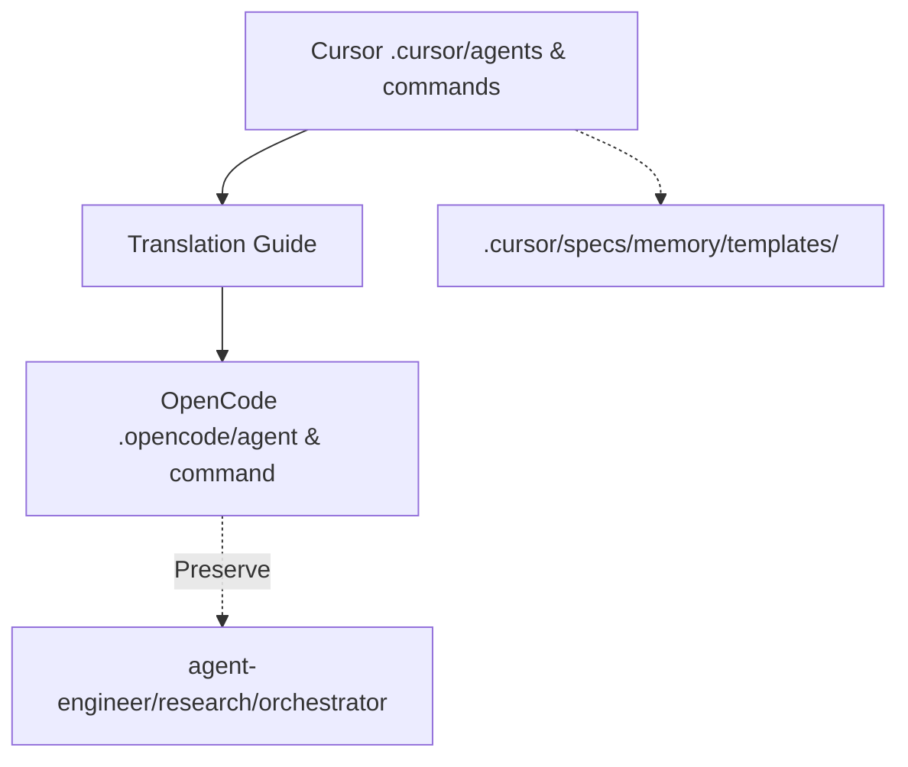

# Implementation Plan: LIF-54-refactor-sync-cursor-opencode

**Branch**: `hello/lif-54-sync-cursor-and-opencode-agentcommandtemplate-directories` | **Date**: 2025-12-16 | **Spec**: [.cursor/specs/LIF-54-refactor-sync-cursor-opencode/spec.md](spec.md)  
**Input**: Feature specification from `.cursor/specs/LIF-54-refactor-sync-cursor-opencode/spec.md`

## Summary

This implementation plan establishes synchronization between `.cursor/` (Cursor IDE agents/commands) and `.opencode/` (OpenCode CLI agents/commands) directories. It achieves workflow parity across IDEs by porting/verifying 33 Cursor commands (5 already synced) and 21 shared agents, while preserving 6 OpenCode-only agents/commands. Key outcomes: consistent agent delegation, updated translation guide, phased porting strategy, and maintenance procedures. No code changes—purely declarative Markdown synchronization following dual-maintenance strategy (Cursor as source-of-truth for shared content).

## Constitution Check

*GATE: Must pass before proceeding. Re-check after design phases.*

**Compliance Assessment** (`.cursor/memory/constitution.md`):
- **I. Simulation-First**: N/A (non-trading documentation sync)
- **II. Safety-First**: N/A
- **III. Test-First**: Verified via manual workflow tests (e.g., `/specify` in both IDEs)
- **IV. Observability**: Audit reports + changelog entries provide full visibility
- **V. Configuration-Driven**: Relies on existing agent configs (no changes)
- **VI. Error Resilience**: Translation guide prevents sync errors
- **VII. Simplicity & MVP**: Phased MVP sync (high-priority first); no over-engineering
- **VIII. Learning-First**: N/A

**GATE STATUS**: ✅ PASSES (documentation workflow; no violations)

## Architecture Approach

### Dual-Maintenance Strategy
- **Cursor as Source-of-Truth**: Shared agents/commands originate in `.cursor/agents/` and `.cursor/commands/`; sync to `.opencode/agent/` and `.opencode/command/` preserving OpenCode YAML frontmatter and categorization.
- **Preserve OpenCode-Specific**: 4 agents (`agent-engineer`, `research`, `conversation-auditor`, `orchestrator`) + 2 commands (`init-project`, `orchestrator`) remain OpenCode-only.
- **No Duplication**: Shared resources (`.cursor/specs/`, `.cursor/memory/`, `.cursor/templates/`, etc.) stay exclusively in `.cursor/`.

### Conductor vs Orchestrator
- **conductor.md** (Cursor): Slash command invoking core workflow agents.
- **orchestrator.md** (OpenCode): Agent with `task()` tool for delegation.
- **Relation**: Functional equivalents (entry points for workflows); **not merged** to preserve environment-specific invocation patterns.

### Translation Patterns
Reference: `.opencode/instructions/cursor-opencode-sync.md`
- **Agent Paths**: Flat (Cursor: `product-strategist`) → Categorized (OpenCode: `planning/product-strategist`)
- **Delegation**: `@Agent-Name` → `task(subagent_type: "category/agent-name")`
- **Format Preservation**: Cursor Markdown → OpenCode YAML frontmatter + structured sections (Role, Capabilities, Instructions, Guardrails)
- **Full Mapping**: 21 shared agents (see spec.md Directory Audit)



## Implementation Phases

### Phase 1: Verify Existing Syncs (P1, 1-2 hours) ✅ COMPLETE
1. Test 5 ported commands in OpenCode: `update-context`, `checklist`, `clarify`, `analyze`, `code-review`
2. Verify agent delegation (e.g., `@Context-Steward` → `task(governance/context-steward)`)
3. Generate divergence report; document issues
4. **Success**: 100% pass rate; update spec.md with findings

### Phase 1.5: Fix Flat Agent Structure References (P1, 1-2 hours) 🆕
**Problem Discovered**: OpenCode agents are in FLAT structure (`.opencode/agent/*.md`) but orchestrator and governance docs reference CATEGORIZED paths (`governance/context-steward`). This causes delegation mismatches.

**Decision**: Keep flat structure (required for tool compatibility), update all references to match.

**Tasks**:
1. Update `.opencode/instructions/governance.md` - Remove subdirectory convention, document flat structure
2. Update `.opencode/agent/orchestrator.md` - Change all categorized paths to flat:
   - `governance/context-steward` → `context-steward`
   - `planning/product-strategist` → `product-strategist`
   - `implementation/implementation-specialist` → `implementation-specialist`
   - etc. (all 21+ agent references)
3. Update `.opencode/instructions/cursor-opencode-sync.md` - Fix translation guide to reflect flat structure
4. Verify task tool resolves flat agent names correctly
5. **Success**: All agent references use flat naming; no broken delegations

### Phase 2: Port Medium-Priority Commands (P1, 2-3 hours)
1. Port `sync-linear.md`, `create-pr.md`, `debug-issue.md` using translation guide
2. Add OpenCode YAML frontmatter (`description`, `handoffs`)
3. Test in OpenCode CLI; fix delegation paths
4. **Success**: 3 commands functional; verified via end-to-end workflows

### Phase 3: Sync Agent Definitions (P2, 4-6 hours)
1. For 21 shared agents: Read Cursor → Apply OpenCode format → Write to `.opencode/agent/{agent}.md` (FLAT structure)
2. Update Role/Instructions/Guardrails from Cursor; preserve YAML frontmatter/tools
3. Fix all delegation references (use FLAT agent names, not categorized paths)
4. **Success**: Zero broken delegations; test via `/specify LIF-54`

### Phase 4: Port Low-Priority Commands (P3, 3-4 hours)
1. Port remaining 20+ commands (e.g., `refactor-code`, `security-audit`)
2. Skip/document low-value: `conductor.help` (→ orchestrator.help), `NR-review-pr`
3. **Success**: 80%+ commands ported; inventory complete

### Phase 5: Documentation & Maintenance (P2, 1-2 hours)
1. Update translation guide with lessons/expanded checklist
2. Create `sync-checklist.md` in `.cursor/scripts/`
3. Document OpenCode-only features in `.opencode/README.md`
4. **Success**: Guide covers 100% mappings; maintenance procedures ready

## Risk Assessment

| Risk | Likelihood | Impact | Mitigation |
|------|------------|--------|------------|
| Breaking Cursor workflows | Low | High | Phased verification; no Cursor changes |
| Incorrect delegation in OpenCode | Medium | High | Validation checklist; test core workflows first |
| Over-syncing OpenCode-only features | Low | Medium | Explicit preservation rules; audit report |
| Maintenance drift post-sync | Medium | Medium | Translation guide + sync checklist; Historian changelog |
| Time overrun on agent sync | Medium | Low | Prioritize shared agents; parallel low-priority |

## Dependencies
- **Sequential**: Phase 1 → 2 → 3 → 4 → 5
- **External**: Linear MCP access (Phase 2); Context-Steward/Historian agents functional
- **Pre-reqs**: Translation guide exists; spec.md approved

## Success Metrics
From spec.md measurable outcomes:
- **SC-001**: 5 ported commands verified (100%)
- **SC-002**: 3+ medium-priority commands ported
- **SC-003**: Translation guide 100% agent mappings
- **SC-004**: Zero broken delegations (`/specify`, `/implement`)
- **SC-005**: OpenCode-only preserved (6 items)
- **SC-006**: Divergence audit complete

**Definition of Done**:
- [ ] All P1/P2 phases complete
- [ ] 8+ commands functional in OpenCode
- [ ] Guide/checklist updated
- [ ] Linear comment: Architecture summary + plan link
- [ ] Historian changelog entry created

## Technical Context

**Language/Version**: Markdown (declarative)  
**Primary Dependencies**: Agent framework (Agno/OpenCode), Linear MCP  
**Storage**: File-based (git)  
**Testing**: Manual workflow verification + checklist  
**Target Platform**: Cursor IDE + OpenCode CLI  
**Project Type**: Agentic workflow framework  
**Performance Goals**: N/A (sync <1 day)  
**Constraints**: No breaking changes; preserve formats  
**Scale/Scope**: 21 agents + 33 commands

## Project Structure (This Feature)

```
.cursor/specs/LIF-54-refactor-sync-cursor-opencode/
├── spec.md              # Requirements (done)
├── plan.md              # This file
├── tasks.md             # Next: Linear Coordinator
├── status.md            # Track phase progress
└── checklists/          # Sync validation
```

**Sync Targets**:
```
.cursor/agents/          ↔ .opencode/agent/{category}/
.cursor/commands/        ↔ .opencode/command/
```

**Handoff**: Delegate to Implementation Specialist for Phase 1 execution (`/implement LIF-54 phase=1`).

**Last Updated**: 2025-12-16 by Strategic Architect