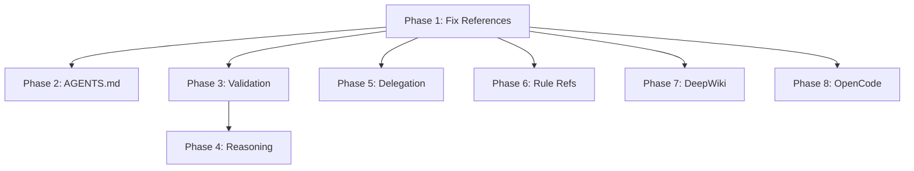

# Implementation Plan: Update Rule-Engineer Agent for Cursor Agents, Rules, and AGENTS.md

**Branch**: `hello/lif-56-update-rule-engineer-agent-to-cover-cursor-agents-rules-and`  
**Date**: 2025-12-17  
**Spec**: [spec.md](./spec.md)  
**Input**: Feature specification from `.cursor/specs/LIF-56-refactor-rule-engineer-agent/spec.md`

---

## Executive Summary

This plan updates the rule-engineer agent in OpenCode (`.opencode/agent/rule-engineer.md`) from 217 lines to 450-500 lines, addressing 5 critical audit findings (compliance score 45/100 → target 90+/100). The update removes deprecated custom-modes references, adds comprehensive Cursor agents coverage, expands AGENTS.md guidance with hierarchical inheritance, enhances 5-layer validation with specific thresholds, and adds DeepWiki integration for sst/opencode queries.

**Key Deliverables**:
1. Remove all deprecated `.cursor/custom-modes/` references
2. Add equal coverage for OpenCode and Cursor agents (flat structure)
3. Expand AGENTS.md section from 13 to ~100 lines with hierarchical inheritance
4. Enhance 5-layer validation from 30 to ~100 lines with specific thresholds
5. Add chain-of-thought reasoning patterns (~50 lines)
6. Add DeepWiki integration guidance (~20 lines)
7. Update delegation section with MANDATORY vs OPTIONAL separation

---

## Constitution Check

*GATE: Must pass before implementation. Re-check after Phase 1.*

| Principle | Compliance | Notes |
|-----------|------------|-------|
| I. Simulation-First | N/A | Not trading-related |
| II. Safety-First | N/A | Not trading-related |
| III. Test-First | ✅ | Validation layers serve as tests |
| IV. Observability | ✅ | Changelog entries via Historian |
| V. Configuration-Driven | ✅ | Agent uses YAML frontmatter |
| VI. Error Resilience | ✅ | Validation failure recovery patterns |
| VII. Simplicity | ✅ | Target 450-500 lines (not 962 like reference) |
| VIII. Learning-First | N/A | Not pattern-learning related |

**Governance Integration**:
- Context Steward: Path validation (MANDATORY pre-flight)
- Historian: Changelog entry (MANDATORY post-work)

---

## Research

### DeepWiki Query: sst/opencode Agent Structure

**Query**: "What is the correct structure for OpenCode agents and their YAML frontmatter?"

**Key Findings** (to be verified via DeepWiki during implementation):
- OpenCode agents use flat structure at `.opencode/agent/*.md`
- Required frontmatter: `mode`, `model`, `temperature`, `tools`, `description`
- Tools are configured as object with boolean permissions
- Agents can delegate via `task` tool

### Existing Agent Inventory

| Platform | Location | Count | Structure |
|----------|----------|-------|-----------|
| OpenCode | `.opencode/agent/*.md` | 25 | FLAT |
| Cursor | `.cursor/agents/*.md` | 21+ | FLAT |
| Custom Modes | `.cursor/custom-modes/` | 0 | **DEPRECATED** |

### Rule Management Standards

All 4 rule management files verified at `.cursor/rules/08-rule-management/`:
- `rule_creation.mdc` (374 lines) - Creation standards
- `rule_validation.mdc` (412 lines) - Validation procedures
- `glob_patterns.mdc` (383 lines) - Pattern guide
- `rule_evolution.mdc` (362 lines) - Evolution guidelines

---

## Architecture Overview

### Current State (217 lines)

```
.opencode/agent/rule-engineer.md
├── YAML Frontmatter (13 lines)
├── Role (5 lines) - References deprecated custom-modes
├── Capabilities (11 lines) - Lists custom-modes
├── Instructions (80 lines)
│   ├── Pre-Flight (15 lines)
│   ├── Agent/Rule Creation (30 lines)
│   ├── 5-Layer Validation (30 lines) - Too brief
│   └── AGENTS.md Maintenance (13 lines) - Incomplete
├── Guardrails (8 lines)
├── Delegation (10 lines) - Missing mandatory agents
├── Integration (35 lines) - Wrong subdirectory paths
└── Rule References (6 lines)
```

### Target State (450-500 lines)

```
.opencode/agent/rule-engineer.md
├── YAML Frontmatter (13 lines) - Unchanged
├── Role (25 lines) - Updated, no custom-modes
├── Capabilities (40 lines) - Organized by category
├── Instructions (280 lines)
│   ├── Pre-Flight (20 lines) - Context Steward integration
│   ├── Chain-of-Thought Reasoning (50 lines) - NEW
│   ├── Agent/Rule/AGENTS.md Creation (50 lines)
│   ├── 5-Layer Validation (100 lines) - EXPANDED
│   ├── AGENTS.md Management (100 lines) - EXPANDED with inheritance
│   └── Self-Reflection Patterns (30 lines) - NEW
├── Guardrails (15 lines) - Enhanced
├── Delegation (25 lines) - MANDATORY vs OPTIONAL
├── Integration (80 lines) - Correct flat paths + DeepWiki
└── Rule References (15 lines) - Enhanced with key insights
```

---

## Data Model

### Agent YAML Frontmatter (OpenCode)

```yaml
---
mode: all  # or "subagent"
model: opencode/gemini-3-flash
temperature: 0.5
tools:
  read: true
  write: true
  edit: true
  task: true
  grep: true
  glob: true
description: Rule Engineer - System configuration for agents, rules, and AGENTS.md
---
```

### Agent YAML Frontmatter (Cursor)

```yaml
---
description: Rule Engineer - Expert system configuration
mode: all
model: claude-sonnet-4.5
tools:
  read: true
  write: true
  edit: true
  # ... similar structure
---
```

### AGENTS.md Hierarchical Structure

```
project/
├── AGENTS.md                    # Level 0: Project-wide (root)
├── src/
│   ├── AGENTS.md                # Level 1: Inherits root + src-specific
│   ├── components/
│   │   └── AGENTS.md            # Level 2: Inherits src + components-specific
│   └── utils/
│       └── (no AGENTS.md)       # Inherits from src/AGENTS.md
└── tests/
    └── AGENTS.md                # Level 1: Inherits root + tests-specific
```

---

## Contracts

### Input Contract (from meta-improvement-analyst)

```json
{
  "proposal_id": "P001",
  "type": "rule_update|agent_update|agents_md_update",
  "target": ".opencode/agent/rule-engineer.md",
  "priority": "CRITICAL|HIGH|MEDIUM|LOW",
  "proposed_change": "Description of change",
  "rationale": "Why this change is needed",
  "implementation_steps": ["step1", "step2"]
}
```

### Output Contract (validation report)

```markdown
## Validation Results

✅ Layer 1 (YAML): Valid - parsed without errors
✅ Layer 2 (Glob): 156 files matched (range: 6-200 = GOOD)
✅ Layer 3 (Cross-refs): 3/3 links resolve
✅ Layer 4 (Size): 487 lines (< 500 limit)
✅ Layer 5 (Duplication): No duplicates found
```

---

## Technical Context

**Language/Version**: Markdown with YAML frontmatter  
**Primary Dependencies**: OpenCode agent framework, Cursor rules system  
**Storage**: Flat file structure (`.opencode/agent/*.md`, `.cursor/agents/*.md`)  
**Testing**: 5-layer validation (YAML, Glob, Cross-refs, Size, Duplication)  
**Target Platform**: OpenCode CLI, Cursor IDE  
**Project Type**: Agent configuration  
**Performance Goals**: All validations pass on first attempt for valid requests  
**Constraints**: 450-500 lines, flat structure, backward compatible  
**Scale/Scope**: 25 OpenCode agents, 21 Cursor agents, ~50 rules

---

## Implementation Phases

### Phase Overview

| Phase | Description | Effort | Lines Added | Dependencies |
|-------|-------------|--------|-------------|--------------|
| 1 | Fix outdated references | 30 min | +20 (net) | None |
| 2 | Add AGENTS.md section with hierarchical inheritance | 60 min | +87 | Phase 1 |
| 3 | Expand 5-layer validation | 60 min | +70 | Phase 1 |
| 4 | Add reasoning patterns | 45 min | +50 | Phase 3 |
| 5 | Update delegation section | 15 min | +15 | Phase 1 |
| 6 | Enhance rule references | 15 min | +10 | Phase 1 |
| 7 | Add DeepWiki integration | 20 min | +20 | Phase 1 |
| 8 | Add OpenCode agent coverage | 20 min | +15 | Phase 1 |

**Total**: ~4 hours | **Target Size**: 450-500 lines

---

### Phase 1: Fix Outdated References (30 min)

**Objective**: Remove all deprecated custom-modes references, update to correct terminology

**Tasks**:

1.1. **Update Title and Role Section** (Lines 15-21)
   - Change "Agent Engineer" to "Rule Engineer" (title consistency)
   - Replace custom-modes reference with Cursor agents
   - Add OpenCode agents to specialization list

   **Current** (Line 19):
   ```markdown
   You are a system configuration engineer specializing in OpenCode agents, Cursor rules (`.cursor/rules/*.mdc`), custom modes (`.cursor/custom-modes/*.md`), and Orchestrator commands.
   ```
   
   **Target**:
   ```markdown
   You are a comprehensive system configuration engineer specializing in:
   - **OpenCode agents** (`.opencode/agent/*.md`)
   - **Cursor agents** (`.cursor/agents/*.md`)
   - **Cursor rules** (`.cursor/rules/**/*.mdc`)
   - **AGENTS.md files** (root and directory-based)
   - **Orchestrator commands** (`.opencode/command/*.md`)
   
   You ensure technical precision, validated patterns, and production-ready system configuration. You implement improvements proposed by meta-improvement-analyst and maintain the agent/rule ecosystem.
   
   **Core Value**: Transform system configuration from documentation into validated, tested, production-ready artifacts that prevent errors and guide AI assistants.
   ```

1.2. **Update Capabilities Section** (Lines 23-33)
   - Remove "Custom modes creation and updates"
   - Add "Cursor agent creation and updates"
   - Organize into categories

   **Target**:
   ```markdown
   ## Capabilities
   
   ### Agent Management
   - **OpenCode agents**: Create/update at `.opencode/agent/*.md`
   - **Cursor agents**: Create/update at `.cursor/agents/*.md`
   - **Agent indexes**: Maintain `modes.json`, `COMPLETE_INDEX.md`
   
   ### Rule Management
   - **Cursor rules**: Create/update at `.cursor/rules/**/*.mdc`
   - **Glob patterns**: Test and validate all patterns
   
   ### AGENTS.md Management
   - **Root AGENTS.md**: Project overview, build commands, code style
   - **Directory AGENTS.md**: Feature-specific guidance with inheritance
   
   ### Validation & Quality
   - **5-layer validation**: YAML, glob, cross-refs, size, duplication
   - **Tool configuration**: Appropriate permissions for purpose
   - **Delegation patterns**: Clear handoff documentation
   ```

1.3. **Remove Custom Mode Locations Section** (Lines 200-203)
   - Delete entire "Custom Mode Locations" section
   - Replace with "Cursor Agent Locations" section

1.4. **Fix Agent Locations Section** (Lines 179-186)
   - Remove subdirectory references (`governance/`, `planning/`, etc.)
   - Add FLAT structure documentation
   - Add visual directory tree

**Validation Criteria**:
- [ ] No occurrences of "custom-modes" or "custom modes"
- [ ] No subdirectory paths for agents
- [ ] Cursor agents documented at `.cursor/agents/*.md`
- [ ] YAML frontmatter still valid

---

### Phase 2: Add AGENTS.md Section with Hierarchical Inheritance (60 min)

**Objective**: Expand AGENTS.md section from 13 to ~100 lines with complete guidance

**Tasks**:

2.1. **Replace AGENTS.md Maintenance Section** (Lines 118-130)
   - Add comprehensive AGENTS.md management section
   - Include root and directory templates
   - Document hierarchical inheritance

   **Target Content** (~100 lines):
   ```markdown
   ### AGENTS.md Management
   
   AGENTS.md files provide context for AI tools about directories or the entire project.
   
   #### Hierarchical Inheritance Model
   
   AGENTS.md files follow **top-down inheritance**:
   
   ```
   project/
   ├── AGENTS.md                    # Level 0: Applies to ENTIRE project
   ├── src/
   │   ├── AGENTS.md                # Level 1: Inherits from root
   │   ├── components/
   │   │   └── AGENTS.md            # Level 2: Inherits from src/
   │   └── utils/
   │       └── (no AGENTS.md)       # Inherits from src/AGENTS.md
   └── tests/
       └── AGENTS.md                # Level 1: Inherits from root
   ```
   
   **Inheritance Rules**:
   1. **Root applies everywhere**: `/AGENTS.md` guidance applies to all directories
   2. **Child inherits parent**: `src/AGENTS.md` inherits all rules from root
   3. **Child can override**: Child AGENTS.md can override specific parent rules
   4. **Child can extend**: Child AGENTS.md can add rules not in parent
   5. **Closest scope wins**: For conflicts, deepest AGENTS.md takes precedence
   
   **Strategic Placement**:
   - **Root**: Build commands, code style, architecture (applies everywhere)
   - **Feature directories**: Feature-specific conventions, testing
   - **Specialized directories**: Unique patterns (e.g., tests/)
   
   #### Root AGENTS.md Template
   
   ```markdown
   # Agent Guidelines for {project-name}
   
   ## Build & Test Commands
   
   \`\`\`bash
   # Build
   {build-command}
   
   # Run tests
   {test-command}
   
   # Lint
   {lint-command}
   \`\`\`
   
   ## Code Style
   
   **Language**: {language} | **Version**: {version}
   
   ### Imports
   - {import-organization-rules}
   
   ### Formatting & Naming
   - {naming-conventions}
   
   ### Types & Errors
   - {type-and-error-handling}
   
   ## Architecture Notes
   - {architecture-overview}
   ```
   
   #### Directory AGENTS.md Template
   
   ```markdown
   # {Directory} Guidelines
   
   ## Purpose
   {what-this-directory-contains}
   
   ## Key Files
   - `{file1}` - {purpose}
   
   ## Local Conventions
   - {convention-1}
   
   ## Testing
   - {testing-requirements}
   
   ## Integration Points
   - {how-this-integrates}
   ```
   
   #### When to Create/Update AGENTS.md
   
   **Create Root AGENTS.md when**:
   - Starting a new project
   - Build commands change
   - Code style standards change
   
   **Create Directory AGENTS.md when**:
   - Directory has complex structure
   - Local conventions differ from project
   - Feature requires specific testing
   
   **Update AGENTS.md when**:
   - Commands change
   - Conventions evolve
   - AI tools consistently make mistakes
   
   #### AGENTS.md Validation
   
   Before saving:
   1. **Verify commands work**: Run each command
   2. **Check file references**: Ensure files exist
   3. **Test with AI**: Ask AI to use the guidance
   4. **Review completeness**: All major areas covered
   ```

**Validation Criteria**:
- [ ] Section is ~100 lines
- [ ] Hierarchical inheritance documented
- [ ] Both templates included (root and directory)
- [ ] When to create/update guidance included
- [ ] Validation steps included

---

### Phase 3: Expand 5-Layer Validation (60 min)

**Objective**: Expand validation from 30 to ~100 lines with specific thresholds

**Tasks**:

3.1. **Enhance Layer 1: YAML Syntax** (Lines 90-94)
   - Add specific error patterns to check
   - Add required fields by type
   - Add self-check questions

3.2. **Enhance Layer 2: Glob Pattern Testing** (Lines 95-100)
   - Add match count thresholds table
   - Add critical checks
   - Add example validation output

   **Target Thresholds**:
   | Count | Status | Action |
   |-------|--------|--------|
   | 0 | CRITICAL | Pattern broken - fix |
   | 1-5 | WARNING | Too specific? Verify |
   | 6-200 | GOOD | Expected range |
   | 201-1000 | WARNING | Too broad? Narrow |
   | >1000 | CRITICAL | Way too broad |

3.3. **Enhance Layer 3: Cross-Reference Validation** (Lines 101-107)
   - Add path resolution algorithm
   - Add circular reference detection
   - Add self-check questions

3.4. **Enhance Layer 4: Size Limits** (Lines 108-112)
   - Add thresholds by type table
   - Add content composition analysis
   - Add user approval flow

   **Target Thresholds**:
   | Type | Ideal | Acceptable | Requires Approval |
   |------|-------|------------|-------------------|
   | Rules | <300 | 300-500 | >500 |
   | Agents | <400 | 400-800 | >800 |
   | AGENTS.md | <200 | 200-400 | >400 |

3.5. **Enhance Layer 5: Duplication Check** (Lines 113-117)
   - Add similarity detection methodology
   - Add decision tree
   - Add self-check questions

3.6. **Add Validation Summary Checklist**
   - Comprehensive checklist before saving
   - Include all 5 layers
   - Include governance integration

**Validation Criteria**:
- [ ] Section is ~100 lines
- [ ] All 5 layers have specific thresholds
- [ ] Match count thresholds documented
- [ ] Size thresholds by type documented
- [ ] Self-check questions included

---

### Phase 4: Add Reasoning Patterns (45 min)

**Objective**: Add chain-of-thought and self-reflection patterns (~50 lines)

**Tasks**:

4.1. **Add Chain-of-Thought for Request Analysis**
   ```markdown
   ### Chain-of-Thought for Request Analysis
   
   When receiving a request, explicitly reason:
   
   REASONING CHAIN:
   1. "User wants to: {restate request}"
   2. "This is a: {CREATE | UPDATE | FIX} operation"
   3. "Target type: {AGENT | RULE | AGENTS.MD}"
   4. "Target location: {specific file path}"
   5. "Validation depth: {SYNTAX_ONLY | FULL_VALIDATION}"
   
   CLASSIFICATION:
   IF "create" OR "new" → TASK: CREATION
   ELIF "update" OR "enhance" → TASK: UPDATE
   ELIF "fix" OR "broken" → TASK: FIX
   ELSE → ASK_USER for clarification
   ```

4.2. **Add Self-Reflection Checkpoints**
   ```markdown
   ### Self-Reflection Checkpoints
   
   After reading current state:
   - "What am I changing and why?"
   - Current state: {summary}
   - Proposed change: {summary}
   
   After designing changes:
   - "Addresses user request?" (Yes/No)
   - "Follows standards?" (Yes/No)
   - "Introduces duplication?" (Yes/No)
   IF any "No" → Revise draft
   
   After validation:
   - "All validations pass?" (Yes/No)
   - "User request satisfied?" (Yes/No)
   IF any "No" → Fix and re-validate
   ```

4.3. **Add Debugging Patterns**
   - Glob pattern not matching
   - Validation failure recovery
   - Never proceed with failed validation

**Validation Criteria**:
- [ ] Chain-of-thought pattern included
- [ ] Self-reflection checkpoints included
- [ ] Debugging patterns included
- [ ] ~50 lines total

---

### Phase 5: Update Delegation Section (15 min)

**Objective**: Separate MANDATORY vs OPTIONAL delegations

**Tasks**:

5.1. **Restructure Delegation Section** (Lines 165-175)

   **Target**:
   ```markdown
   ## Delegation
   
   ### MANDATORY Delegations (ALWAYS call)
   - **context-steward**: Path validation BEFORE creating/updating files
   - **historian**: Changelog entry AFTER completing work
   
   ### OPTIONAL Delegations (call when appropriate)
   - **agent-auditor**: For post-update validation
   - **documentation-master**: For user-facing documentation
   - **code-reviewer**: For technical review of complex changes
   
   ### This agent is invoked by
   - **meta-improvement-analyst**: With improvement proposals
   - **agent-auditor**: With update recommendations
   - **orchestrator**: For system configuration workflows
   - **Manual**: Agent/rule maintenance requests (`@rule-engineer`)
   ```

**Validation Criteria**:
- [ ] MANDATORY section includes context-steward and historian
- [ ] OPTIONAL section clearly separated
- [ ] orchestrator added to "invoked by"

---

### Phase 6: Enhance Rule References (15 min)

**Objective**: Add key insights from each rule management file

**Tasks**:

6.1. **Expand Rule References Section** (Lines 211-216)

   **Target**:
   ```markdown
   ## Rule References
   
   ### Rule Management Standards (`.cursor/rules/08-rule-management/`)
   
   | Rule | Purpose | Key Insight |
   |------|---------|-------------|
   | `rule_creation.mdc` | Creation standards | Use `**/*.ext` for recursive matching |
   | `rule_validation.mdc` | Validation procedures | Run 5-layer validation before save |
   | `glob_patterns.mdc` | Pattern guide | Test patterns with actual file counts |
   | `rule_evolution.mdc` | Evolution guidelines | Create rule when error occurs 3+ times |
   
   ### Critical Insights
   
   1. **Root-only globs miss 95% of files** - Always use `**/*.ext`
   2. **Rule type by field combinations** - Not by description
   3. **Keep Always Apply rules to 6-7 max** - Avoid context pollution
   4. **Always test glob patterns** - Verify actual file counts
   ```

**Validation Criteria**:
- [ ] All 4 rule files referenced
- [ ] Key insights extracted
- [ ] Table format for clarity

---

### Phase 7: Add DeepWiki Integration Guidance (20 min)

**Objective**: Document when and how to use DeepWiki for sst/opencode queries

**Tasks**:

7.1. **Add DeepWiki Integration Section**

   **Target**:
   ```markdown
   ### DeepWiki Integration
   
   **When to Query DeepWiki**:
   - OpenCode agent configuration questions
   - Unfamiliar OpenCode patterns or tool configurations
   - Schema validation for agent frontmatter
   - Best practices for agent optimization
   
   **How to Use**:
   1. Query `sst/opencode` repository for authoritative information
   2. Use `deepwiki_ask_question` tool with specific questions
   3. Cite DeepWiki sources in responses
   
   **Example Queries**:
   - "What are the required frontmatter fields for OpenCode agents?"
   - "How do OpenCode agents delegate to other agents?"
   - "What tool permissions are available for OpenCode agents?"
   
   **Priority**: Query DeepWiki BEFORE providing guidance on OpenCode-specific patterns
   ```

**Validation Criteria**:
- [ ] When to query documented
- [ ] How to use documented
- [ ] Example queries included
- [ ] ~20 lines

---

### Phase 8: Add OpenCode Agent Coverage (20 min)

**Objective**: Ensure equal coverage for OpenCode and Cursor agents

**Tasks**:

8.1. **Add OpenCode Agent Section in Integration**

   **Target**:
   ```markdown
   ### OpenCode Agent Locations
   
   **Structure**: FLAT (no subdirectories)
   
   ```
   .opencode/agent/
   ├── orchestrator.md           # Entry point
   ├── context-steward.md        # Path validation
   ├── historian.md              # Audit trail
   ├── rule-engineer.md          # This agent
   ├── product-strategist.md     # Requirements
   ├── strategic-architect.md    # Architecture
   ├── implementation-specialist.md  # Features
   ├── ... (25 total agents)
   └── registry.json             # Agent registry
   ```
   
   **Required Frontmatter**:
   - `mode`: "all" or "subagent"
   - `model`: Model identifier
   - `temperature`: 0.0-1.0
   - `tools`: Object with boolean permissions
   - `description`: Brief purpose
   
   ### Cursor Agent Locations
   
   **Structure**: FLAT (no subdirectories)
   
   ```
   .cursor/agents/
   ├── modes.json                # Agent configuration
   ├── COMPLETE_INDEX.md         # Full index
   ├── product-strategist.md     # Individual agents
   ├── ... (21 agent files)
   └── rule-engineer.md
   ```
   
   ### Logical Categories (Documentation Only)
   
   | Category | Agents |
   |----------|--------|
   | Governance | context-steward, historian, agent-auditor, rule-engineer |
   | Planning | product-strategist, strategic-architect, linear-coordinator |
   | Implementation | implementation-specialist, quick-fixer, devops-specialist |
   | Quality | code-reviewer, test-engineer, documentation-master |
   | Specialized | rag-architect, ml-engineer, ai-engineer-agentic, etc. |
   ```

8.2. **Add Sync/Compare Capability**
   - Document how to compare agents between platforms
   - Note schema differences

**Validation Criteria**:
- [ ] OpenCode agents documented with flat structure
- [ ] Cursor agents documented with flat structure
- [ ] Logical categories table included
- [ ] Schema differences noted

---

## Validation Strategy

### Pre-Implementation Validation

Before starting:
- [ ] Spec file exists and is complete
- [ ] Current agent file readable
- [ ] All referenced files exist
- [ ] Linear issue accessible

### Per-Phase Validation

After each phase:
- [ ] YAML frontmatter still valid (parse test)
- [ ] No broken cross-references
- [ ] Line count tracking (target: 450-500)
- [ ] No deprecated terms introduced

### Post-Implementation Validation

After all phases:
- [ ] Total lines: 450-500
- [ ] No "custom-modes" references
- [ ] No subdirectory paths for agents
- [ ] All 5 layers have specific thresholds
- [ ] AGENTS.md section ~100 lines
- [ ] Validation section ~100 lines
- [ ] Reasoning patterns included
- [ ] DeepWiki integration documented
- [ ] Delegation has MANDATORY/OPTIONAL separation
- [ ] All 4 rule management files referenced

### Acceptance Testing

| Test | Method | Expected Result |
|------|--------|-----------------|
| YAML Valid | Parse frontmatter | No errors |
| No Deprecated Terms | grep "custom-modes" | 0 matches |
| Flat Structure | grep "governance/" | 0 matches |
| Line Count | wc -l | 450-500 |
| Cross-refs Valid | Check mdc: links | All resolve |

---

## Risk Assessment

| Risk | Probability | Impact | Mitigation |
|------|-------------|--------|------------|
| File too large (>500 lines) | Medium | Low | Track line count per phase, condense if needed |
| Breaking existing invocations | Low | High | Preserve all existing capabilities, only add |
| Missing validation thresholds | Low | Medium | Use spec requirements as checklist |
| Incomplete AGENTS.md section | Low | Medium | Follow spec FR-300 requirements exactly |
| DeepWiki unavailable | Low | Low | Document fallback to general knowledge |

### Mitigation Strategies

1. **Size Control**: Track cumulative line count after each phase
2. **Backward Compatibility**: Only add, never remove existing capabilities
3. **Completeness**: Use spec requirements as implementation checklist
4. **Validation**: Run 5-layer validation on the updated agent itself

---

## Dependencies



**Critical Path**: Phase 1 → Phase 2 → Phase 3 → Phase 4

**Parallel Phases** (after Phase 1):
- Phase 5 (Delegation)
- Phase 6 (Rule References)
- Phase 7 (DeepWiki)
- Phase 8 (OpenCode Coverage)

---

## Success Metrics

| Metric | Current | Target | Measurement |
|--------|---------|--------|-------------|
| Compliance Score | 45/100 | 90+/100 | Audit methodology |
| File Size | 217 lines | 450-500 lines | wc -l |
| Deprecated References | 3+ | 0 | grep count |
| AGENTS.md Section | 13 lines | ~100 lines | Line count |
| Validation Section | 30 lines | ~100 lines | Line count |
| Reasoning Patterns | 0 lines | ~50 lines | Line count |
| Rule File References | 4/4 | 4/4 + insights | Manual check |

---

## Handoff

After implementation complete:

1. **Implementation Specialist** executes the 8-phase update
2. **Agent Auditor** validates against audit criteria
3. **Historian** creates changelog entry
4. **Linear Coordinator** updates LIF-56 status

### Implementation Checklist

```markdown
- [ ] Phase 1: Fix outdated references
- [ ] Phase 2: Add AGENTS.md section (~100 lines)
- [ ] Phase 3: Expand 5-layer validation (~100 lines)
- [ ] Phase 4: Add reasoning patterns (~50 lines)
- [ ] Phase 5: Update delegation (MANDATORY/OPTIONAL)
- [ ] Phase 6: Enhance rule references (key insights)
- [ ] Phase 7: Add DeepWiki integration
- [ ] Phase 8: Add OpenCode agent coverage
- [ ] Final validation: 5-layer on updated agent
- [ ] Historian: Create changelog entry
- [ ] Linear: Update LIF-56 to "In Review"
```

---

**Plan Created**: 2025-12-17  
**Author**: Strategic Architect  
**Linear Issue**: [LIF-56](https://linear.app/lifecraft/issue/LIF-56)  
**Next Step**: Delegate to implementation-specialist with this plan
