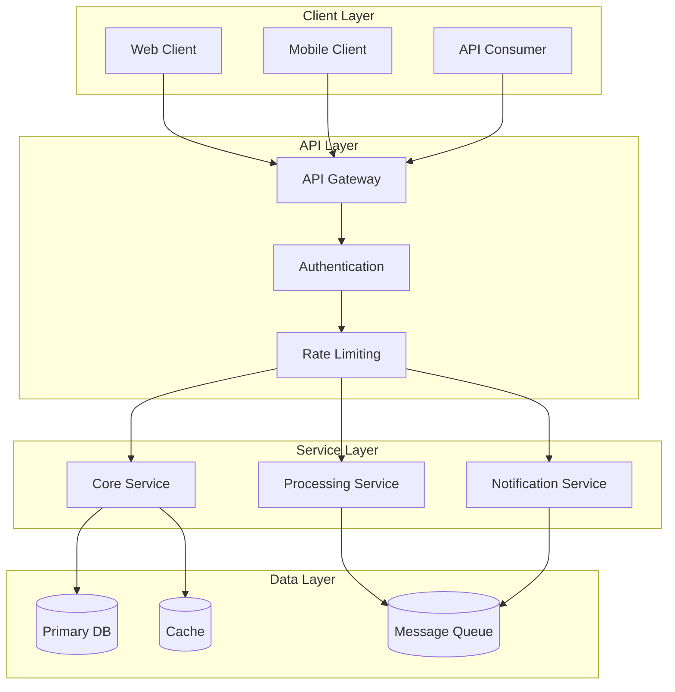

# Architecture Overview

This document provides a high-level overview of {{project.name}}'s architecture, design principles, and system components.

## Design Principles

<CardGroup cols={2}>
  <Card title="Modularity" icon="puzzle-piece">
    Components are designed to be independent and reusable
  </Card>
  <Card title="Scalability" icon="arrows-up-down">
    Architecture supports horizontal and vertical scaling
  </Card>
  <Card title="Testability" icon="vial">
    All components can be tested in isolation
  </Card>
  <Card title="Maintainability" icon="wrench">
    Clear separation of concerns and documentation
  </Card>
</CardGroup>

## System Architecture



## Core Components

### API Layer

The API layer handles all incoming requests and provides:

- **Authentication & Authorization**: JWT-based authentication with role-based access control
- **Request Validation**: Input validation and sanitization
- **Rate Limiting**: Protection against abuse and DoS attacks
- **API Versioning**: Support for multiple API versions

### Service Layer

The service layer contains the business logic:

| Service | Responsibility |
|---------|---------------|
| Core Service | Main business logic and data operations |
| Processing Service | Background jobs and async processing |
| Notification Service | Email, push, and webhook notifications |

### Data Layer

The data layer manages persistence and caching:

- **Primary Database**: Main data storage with ACID guarantees
- **Cache Layer**: Redis-based caching for performance
- **Message Queue**: Async communication between services

## Directory Structure

```
{{project.root}}/
├── src/
│   ├── api/           # API routes and controllers
│   ├── services/      # Business logic
│   ├── models/        # Data models
│   ├── utils/         # Shared utilities
│   └── config/        # Configuration
├── tests/
│   ├── unit/          # Unit tests
│   ├── integration/   # Integration tests
│   └── e2e/           # End-to-end tests
├── docs/              # Documentation
└── scripts/           # Build and deployment scripts
```

## Technology Stack

<Tabs>
  <Tab title="Backend">
    | Technology | Purpose |
    |------------|---------|
    | {{tech.language}} | Primary language |
    | {{tech.framework}} | Web framework |
    | {{tech.database}} | Database |
    | Redis | Caching |
  </Tab>
  <Tab title="Infrastructure">
    | Technology | Purpose |
    |------------|---------|
    | Docker | Containerization |
    | Kubernetes | Orchestration |
    | Terraform | Infrastructure as Code |
    | GitHub Actions | CI/CD |
  </Tab>
  <Tab title="Monitoring">
    | Technology | Purpose |
    |------------|---------|
    | Prometheus | Metrics collection |
    | Grafana | Visualization |
    | Sentry | Error tracking |
    | ELK Stack | Log aggregation |
  </Tab>
</Tabs>

## Security Architecture

<AccordionGroup>
  <Accordion title="Authentication" icon="lock">
    - JWT-based token authentication
    - Refresh token rotation
    - Multi-factor authentication support
  </Accordion>
  <Accordion title="Authorization" icon="shield">
    - Role-based access control (RBAC)
    - Resource-level permissions
    - API key management
  </Accordion>
  <Accordion title="Data Protection" icon="database">
    - Encryption at rest and in transit
    - PII data handling compliance
    - Regular security audits
  </Accordion>
</AccordionGroup>

## Related Documentation

<CardGroup cols={2}>
  <Card
    title="Design Patterns"
    icon="shapes"
    href="/architecture/patterns"
  >
    Common patterns used in the codebase
  </Card>
  <Card
    title="ADRs"
    icon="file-lines"
    href="/architecture/decisions/adr-001"
  >
    Architecture Decision Records
  </Card>
</CardGroup>

