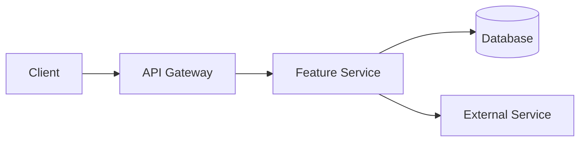

# {{feature.name}}

{{feature.description}}

## Overview

<Info>
  **Status**: {{feature.status}}  
  **Linear Issue**: [{{feature.linear_id}}]({{integrations.linear.base_url}}/issue/{{feature.linear_id}})  
  **Owner**: {{feature.owner}}
</Info>

Brief overview of what this feature does and why it exists.

## User Stories

<AccordionGroup>
  <Accordion title="As a [user type]" icon="user">
    I want [action] so that [benefit].
    
    **Acceptance Criteria:**
    - [ ] Criteria 1
    - [ ] Criteria 2
  </Accordion>
  <Accordion title="As a [user type]" icon="user">
    I want [action] so that [benefit].
    
    **Acceptance Criteria:**
    - [ ] Criteria 1
    - [ ] Criteria 2
  </Accordion>
</AccordionGroup>

## Requirements

### Functional Requirements

| ID | Requirement | Priority | Status |
|----|-------------|----------|--------|
| FR-001 | [Requirement description] | High | ✅ |
| FR-002 | [Requirement description] | Medium | 🔄 |
| FR-003 | [Requirement description] | Low | ⏳ |

### Non-Functional Requirements

| ID | Requirement | Target |
|----|-------------|--------|
| NFR-001 | Performance | < 200ms response time |
| NFR-002 | Availability | 99.9% uptime |
| NFR-003 | Security | SOC 2 compliant |

## Architecture

### Component Diagram



### Data Model

```typescript
interface FeatureEntity {
  id: string;
  name: string;
  status: "active" | "inactive";
  createdAt: Date;
  updatedAt: Date;
}
```

## API Reference

### Endpoints

<Tabs>
  <Tab title="List">
    ```http
    GET /api/v1/{{feature.slug}}
    ```
    
    **Response:**
    ```json
    {
      "success": true,
      "data": [],
      "pagination": {
        "cursor": null,
        "hasMore": false,
        "total": 0
      }
    }
    ```
  </Tab>
  <Tab title="Get">
    ```http
    GET /api/v1/{{feature.slug}}/:id
    ```
    
    **Response:**
    ```json
    {
      "success": true,
      "data": {
        "id": "...",
        "name": "..."
      }
    }
    ```
  </Tab>
  <Tab title="Create">
    ```http
    POST /api/v1/{{feature.slug}}
    ```
    
    **Request Body:**
    ```json
    {
      "name": "string"
    }
    ```
    
    **Response:**
    ```json
    {
      "success": true,
      "data": {
        "id": "...",
        "name": "..."
      }
    }
    ```
  </Tab>
</Tabs>

## Usage Examples

### Basic Usage

```typescript
import { {{feature.main_export}} } from '{{project.name}}';

const feature = new {{feature.main_export}}();
const result = await feature.execute();
```

### Advanced Usage

```typescript
import { {{feature.main_export}}, {{feature.config_type}} } from '{{project.name}}';

const config: {{feature.config_type}} = {
  option1: true,
  option2: 'value',
};

const feature = new {{feature.main_export}}(config);
const result = await feature.execute({
  param1: 'value',
});
```

## Configuration

| Option | Type | Default | Description |
|--------|------|---------|-------------|
| `option1` | `boolean` | `false` | Enable feature X |
| `option2` | `string` | `""` | Configure Y |
| `option3` | `number` | `100` | Set threshold |

## Error Handling

<Warning>
  This feature may throw the following errors. Handle them appropriately in your code.
</Warning>

| Error Code | Description | Resolution |
|------------|-------------|------------|
| `FEATURE_001` | Invalid input | Validate input before calling |
| `FEATURE_002` | Resource not found | Check resource exists |
| `FEATURE_003` | Rate limit exceeded | Implement retry with backoff |

## Testing

### Unit Tests

```bash
npm test -- --grep "{{feature.name}}"
```

### Integration Tests

```bash
npm run test:integration -- --grep "{{feature.name}}"
```

## Related Documentation

<CardGroup cols={2}>
  <Card
    title="API Reference"
    icon="code"
    href="/api-reference/{{feature.slug}}"
  >
    Complete API documentation
  </Card>
  <Card
    title="Architecture"
    icon="sitemap"
    href="/architecture/overview"
  >
    System architecture
  </Card>
</CardGroup>

## Changelog

| Version | Date | Changes |
|---------|------|---------|
| 1.0.0 | YYYY-MM-DD | Initial release |

