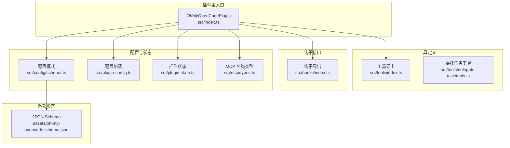
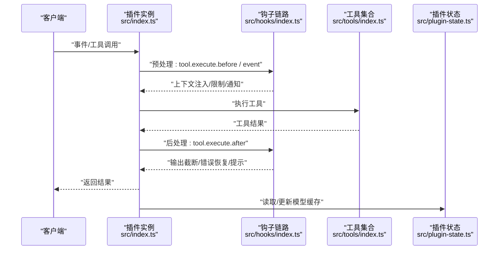
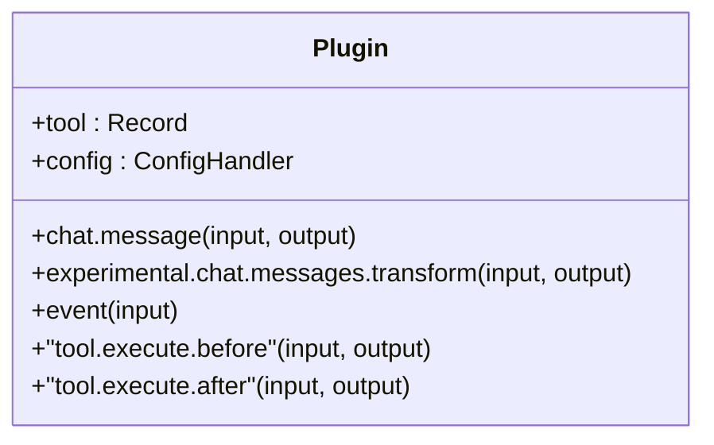
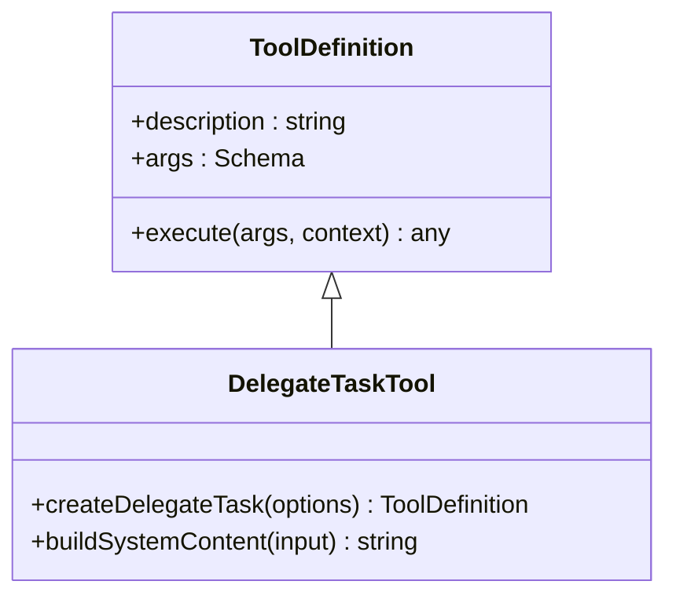
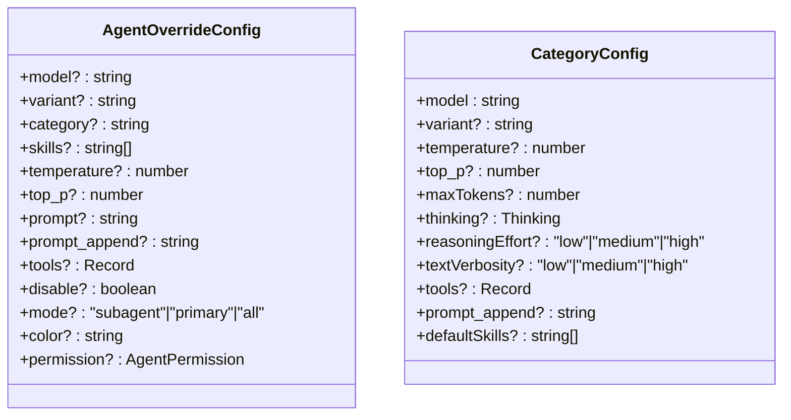
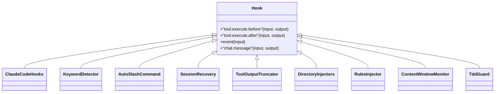
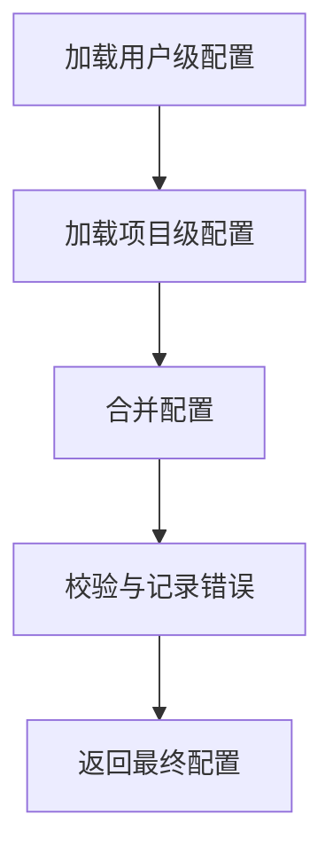
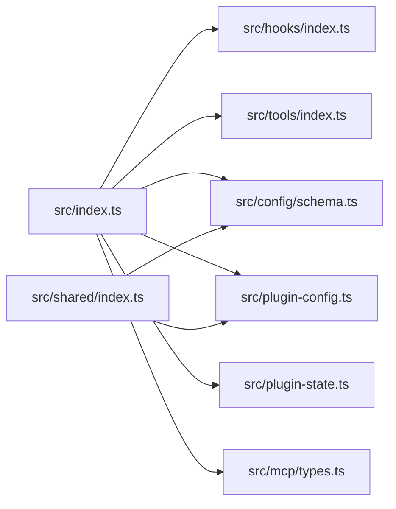

# API 参考

<cite>
**本文引用的文件**
- [src/index.ts](file://src/index.ts)
- [src/tools/index.ts](file://src/tools/index.ts)
- [src/hooks/index.ts](file://src/hooks/index.ts)
- [src/config/schema.ts](file://src/config/schema.ts)
- [src/plugin-config.ts](file://src/plugin-config.ts)
- [src/plugin-state.ts](file://src/plugin-state.ts)
- [src/mcp/types.ts](file://src/mcp/types.ts)
- [src/shared/index.ts](file://src/shared/index.ts)
- [assets/oh-my-opencode.schema.json](file://assets/oh-my-opencode.schema.json)
- [src/cli/index.ts](file://src/cli/index.ts)
- [src/tools/delegate-task/tools.ts](file://src/tools/delegate-task/tools.ts)
- [src/hooks/tdd-guard/types.ts](file://src/hooks/tdd-guard/types.ts)
- [src/features/hook-message-injector/injector.ts](file://src/features/hook-message-injector/injector.ts)
- [docs/CODEX-MCP-REPLACEMENT-PLAN.md](file://docs/CODEX-MCP-REPLACEMENT-PLAN.md)
- [README.zh-cn.md](file://README.zh-cn.md)
</cite>

## 目录
1. [简介](#简介)
2. [项目结构](#项目结构)
3. [核心组件](#核心组件)
4. [架构总览](#架构总览)
5. [详细组件分析](#详细组件分析)
6. [依赖分析](#依赖分析)
7. [性能考虑](#性能考虑)
8. [故障排查指南](#故障排查指南)
9. [结论](#结论)
10. [附录](#附录)

## 简介
本文件为 Oh My OpenCode 的全面 API 参考，覆盖插件主入口、工具定义、代理配置与钩子接口规范。内容包括：
- 插件主入口暴露的工具与事件钩子
- 工具定义接口与参数约束
- 代理与技能配置模式
- 钩子生命周期与行为
- 版本管理、向后兼容与废弃迁移
- 客户端实现建议与性能优化

## 项目结构
围绕插件主入口，系统由“工具集合”“钩子集合”“配置模式”三部分构成，并通过统一的插件实例对外暴露。

**图表来源**
- [src/index.ts](file://src/index.ts#L86-L606)
- [src/tools/index.ts](file://src/tools/index.ts#L1-L73)
- [src/hooks/index.ts](file://src/hooks/index.ts#L1-L48)
- [src/config/schema.ts](file://src/config/schema.ts#L338-L358)
- [src/plugin-config.ts](file://src/plugin-config.ts#L93-L135)
- [src/plugin-state.ts](file://src/plugin-state.ts#L1-L31)
- [src/mcp/types.ts](file://src/mcp/types.ts#L1-L10)
- [assets/oh-my-opencode.schema.json](file://assets/oh-my-opencode.schema.json#L1-L120)

**章节来源**
- [src/index.ts](file://src/index.ts#L86-L606)
- [src/tools/index.ts](file://src/tools/index.ts#L1-L73)
- [src/hooks/index.ts](file://src/hooks/index.ts#L1-L48)
- [src/config/schema.ts](file://src/config/schema.ts#L338-L358)
- [src/plugin-config.ts](file://src/plugin-config.ts#L93-L135)
- [src/plugin-state.ts](file://src/plugin-state.ts#L1-L31)
- [src/mcp/types.ts](file://src/mcp/types.ts#L1-L10)
- [assets/oh-my-opencode.schema.json](file://assets/oh-my-opencode.schema.json#L1-L120)

## 核心组件
- 插件主入口：统一注册工具、事件钩子与配置处理器，按配置启用/禁用钩子与技能。
- 工具集合：内置 LSP/Grep/Glob/Session 等工具，以及委托任务、技能工具、交互式 Bash 等。
- 钩子集合：上下文窗口监控、会话恢复、注释检查、关键词检测、自动更新检查、错误恢复、任务提示等。
- 配置模式：Zod Schema 定义的强类型配置，支持用户级与项目级合并、校验与迁移。
- 插件状态：模型上下文缓存、Anthropic 上下文扩展开关等。
- MCP 类型：MCP 名称枚举与任意名称校验。

**章节来源**
- [src/index.ts](file://src/index.ts#L86-L606)
- [src/tools/index.ts](file://src/tools/index.ts#L57-L73)
- [src/hooks/index.ts](file://src/hooks/index.ts#L1-L48)
- [src/config/schema.ts](file://src/config/schema.ts#L338-L358)
- [src/plugin-state.ts](file://src/plugin-state.ts#L1-L31)
- [src/mcp/types.ts](file://src/mcp/types.ts#L1-L10)

## 架构总览
插件以“事件驱动 + 工具执行”的方式工作：客户端触发事件或工具调用，插件根据配置动态启用钩子链路进行前置/后置处理，最终完成工具执行与结果返回。

**图表来源**
- [src/index.ts](file://src/index.ts#L514-L604)
- [src/hooks/index.ts](file://src/hooks/index.ts#L1-L48)
- [src/tools/index.ts](file://src/tools/index.ts#L57-L73)
- [src/plugin-state.ts](file://src/plugin-state.ts#L13-L30)

**章节来源**
- [src/index.ts](file://src/index.ts#L514-L604)

## 详细组件分析

### 插件主入口 API
- 工具注册：插件返回工具对象，包含内置工具与动态生成的工具（如委托任务、技能工具）。
- 事件钩子：支持 chat.message、experimental.chat.messages.transform、event、tool.execute.before、tool.execute.after 等。
- 配置处理器：通过 config handler 暴露配置读写与变更通知。

**图表来源**
- [src/index.ts](file://src/index.ts#L330-L431)

**章节来源**
- [src/index.ts](file://src/index.ts#L330-L431)

### 工具定义接口
- 工具导出：内置工具（LSP、grep、glob、session 系列）、背景工具、交互式 Bash、技能工具、slashcommand 等。
- 委托任务工具：支持分类/子代理两种委派路径，支持同步/后台运行、会话恢复、技能注入、系统内容拼装等。

**图表来源**
- [src/tools/index.ts](file://src/tools/index.ts#L57-L73)
- [src/tools/delegate-task/tools.ts](file://src/tools/delegate-task/tools.ts#L118-L131)

**章节来源**
- [src/tools/index.ts](file://src/tools/index.ts#L57-L73)
- [src/tools/delegate-task/tools.ts](file://src/tools/delegate-task/tools.ts#L118-L131)

#### 委托任务工具参数与行为
- 参数
  - description: 任务简述（必填）
  - prompt: 详细提示词（必填）
  - category/subagent_type: 二选一；前者来自类别配置，后者直接指定代理
  - run_in_background: 必填布尔值；false 用于任务委派，true 仅用于并行探索
  - resume: 可选会话 ID，用于恢复上下文
  - skills: 技能名称数组（必填）
- 行为
  - 校验 run_in_background 与 skills 必填
  - 支持同步恢复与后台恢复
  - 自动注入父代理与模型信息
  - 生成任务元数据（标题、会话 ID 等）

**章节来源**
- [src/tools/delegate-task/tools.ts](file://src/tools/delegate-task/tools.ts#L123-L131)
- [src/tools/delegate-task/tools.ts](file://src/tools/delegate-task/tools.ts#L132-L200)

### 代理配置接口
- 代理覆盖配置：支持为每个内置代理设置模型、变体、类别、技能、温度、top_p、工具白名单、权限等。
- 类别配置：为不同任务类型提供默认模型、温度、工具集、默认技能等。
- 禁用项：可禁用代理、技能、钩子、命令、MCP。

**图表来源**
- [src/config/schema.ts](file://src/config/schema.ts#L109-L130)
- [src/config/schema.ts](file://src/config/schema.ts#L170-L186)

**章节来源**
- [src/config/schema.ts](file://src/config/schema.ts#L109-L130)
- [src/config/schema.ts](file://src/config/schema.ts#L170-L186)

### 钩子接口规范
- 钩子导出：包含上下文窗口监控、会话通知、会话恢复、注释检查、工具输出截断、目录注入、关键词检测、非交互环境、交互式 Bash、思考块校验、Ralph 循环、自动斜杠命令、编辑错误恢复、任务恢复信息、开始工作、Sisyphus 协调器、TDD Guard、调试注入、失败计数、技能建议、规划流程引导等。
- 生命周期：支持 tool.execute.before、tool.execute.after、event、chat.message 等阶段钩子。
- 条件启用：根据配置 disabled_hooks 控制是否启用。

**图表来源**
- [src/hooks/index.ts](file://src/hooks/index.ts#L1-L48)
- [src/index.ts](file://src/index.ts#L514-L604)

**章节来源**
- [src/hooks/index.ts](file://src/hooks/index.ts#L1-L48)
- [src/index.ts](file://src/index.ts#L514-L604)

### MCP 代理配置接口
- MCP 名称：内置受控枚举（websearch、context7、grep_app），同时支持任意名称字符串。
- 禁用 MCP：通过配置 disabled_mcps 控制。

**章节来源**
- [src/mcp/types.ts](file://src/mcp/types.ts#L1-L10)
- [src/config/schema.ts](file://src/config/schema.ts#L340-L340)

### 配置加载与合并
- 用户级与项目级配置：优先加载用户级配置，再与项目级配置合并。
- 校验与迁移：使用 Zod Schema 校验，加载时执行迁移。
- 合并策略：数组去重合并，对象深度合并。

**图表来源**
- [src/plugin-config.ts](file://src/plugin-config.ts#L93-L135)

**章节来源**
- [src/plugin-config.ts](file://src/plugin-config.ts#L93-L135)

### 插件状态与模型缓存
- 模型缓存状态：维护模型上下文限制缓存与 Anthropic 1M 上下文开关。
- 获取模型限制：根据 providerID/modelID 与开关返回上下文限制。

**章节来源**
- [src/plugin-state.ts](file://src/plugin-state.ts#L1-L31)

### CLI 接口
- 子命令：install、run、get-local-version、doctor、version。
- 功能：安装配置、运行带完成保障的任务、版本检查、健康检查、显示版本。

**章节来源**
- [src/cli/index.ts](file://src/cli/index.ts#L22-L146)

## 依赖分析
- 插件主入口依赖钩子导出、工具导出、配置模式、状态模块与 MCP 类型。
- 工具与钩子均通过统一的插件实例注册，遵循配置开关。
- 配置加载依赖共享模块（解析、迁移、路径等）。

**图表来源**
- [src/index.ts](file://src/index.ts#L1-L84)
- [src/shared/index.ts](file://src/shared/index.ts#L1-L29)

**章节来源**
- [src/index.ts](file://src/index.ts#L1-L84)
- [src/shared/index.ts](file://src/shared/index.ts#L1-L29)

## 性能考虑
- 背景任务并发：通过背景任务配置控制默认并发与按提供方/模型的并发上限。
- 工具输出截断：可按需开启，避免大输出影响上下文窗口。
- 动态上下文修剪：可配置去重、写入后读取替代、错误输出清理等策略。
- 模型缓存：复用模型上下文限制，减少重复查询。

**章节来源**
- [src/config/schema.ts](file://src/config/schema.ts#L297-L303)
- [src/config/schema.ts](file://src/config/schema.ts#L205-L239)
- [src/plugin-state.ts](file://src/plugin-state.ts#L13-L30)

## 故障排查指南
- 配置加载错误：查看配置校验错误与加载错误记录，定位具体字段与路径。
- 通知冲突：当检测到外部通知插件时，会跳过内置通知以避免冲突。
- 会话错误恢复：对可恢复错误触发会话恢复流程，并在主会话中继续提示。
- 编辑错误恢复：在工具执行后阶段对编辑类错误进行恢复尝试。
- 任务恢复信息：记录任务恢复状态，便于追踪。

**章节来源**
- [src/plugin-config.ts](file://src/plugin-config.ts#L27-L47)
- [src/index.ts](file://src/index.ts#L104-L120)
- [src/index.ts](file://src/index.ts#L487-L511)
- [src/index.ts](file://src/index.ts#L599-L604)

## 结论
本参考文档梳理了 Oh My OpenCode 插件的工具、钩子、代理配置与 MCP 接口，明确了参数、行为与限制，并提供了配置加载、状态管理与性能优化建议。通过 Zod Schema 与 JSON Schema 的双重约束，确保配置的强类型与向后兼容性。

## 附录

### API 版本管理与兼容性
- 配置版本：通过 $schema 字段与 JSON Schema 校验，确保配置版本一致性。
- 迁移机制：加载配置时执行迁移，避免旧配置导致的异常。
- 向后兼容：新增字段采用可选策略，删除字段通过迁移处理。

**章节来源**
- [assets/oh-my-opencode.schema.json](file://assets/oh-my-opencode.schema.json#L1-L10)
- [src/plugin-config.ts](file://src/plugin-config.ts#L23-L23)

### 废弃接口与迁移指南
- 代理覆盖中的 model 字段已标注为废弃，建议使用 category 继承模型与默认设置。
- 迁移步骤：将直接 model 设置迁移到对应类别配置，保持工具与代理行为一致。

**章节来源**
- [src/config/schema.ts](file://src/config/schema.ts#L110-L111)

### 客户端实现建议
- 事件顺序：先 tool.execute.before，再工具执行，最后 tool.execute.after。
- 钩子启用：通过 disabled_hooks 控制钩子开关，避免冲突与性能开销。
- MCP 适配：使用内置 MCP 名称枚举，必要时通过任意名称字符串扩展。
- CLI 使用：优先使用内置 MCP 适配方案（如 CLIProxyAPI），以获得 OpenAI 兼容 API 体验。

**章节来源**
- [src/index.ts](file://src/index.ts#L514-L604)
- [src/mcp/types.ts](file://src/mcp/types.ts#L1-L10)
- [docs/CODEX-MCP-REPLACEMENT-PLAN.md](file://docs/CODEX-MCP-REPLACEMENT-PLAN.md#L1083-L1091)

### 示例与最佳实践
- 委托任务：明确 run_in_background 与 skills 参数，必要时使用 resume 恢复上下文。
- 类别化配置：通过 categories 为不同任务类型设置默认模型与工具集。
- 钩子组合：按需启用关键词检测、注释检查、工具输出截断等钩子，提升质量与稳定性。

**章节来源**
- [src/tools/delegate-task/tools.ts](file://src/tools/delegate-task/tools.ts#L123-L131)
- [README.zh-cn.md](file://README.zh-cn.md#L1075-L1123)