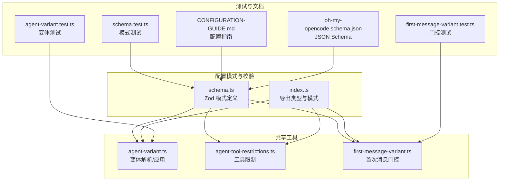
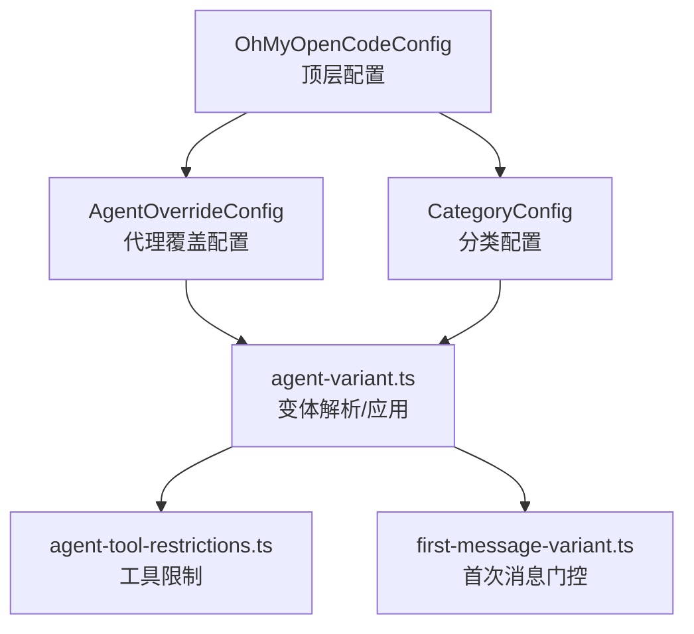
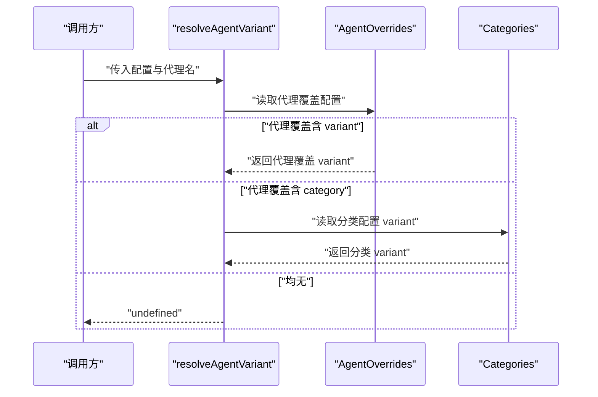
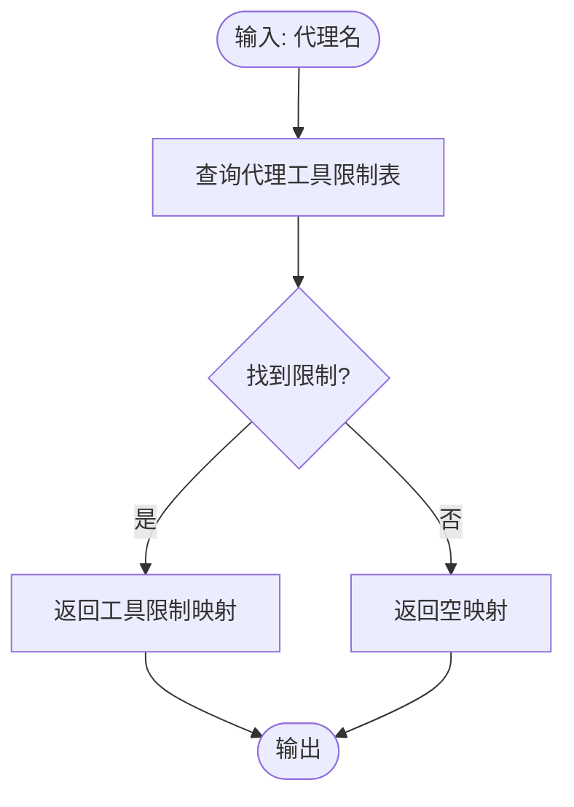
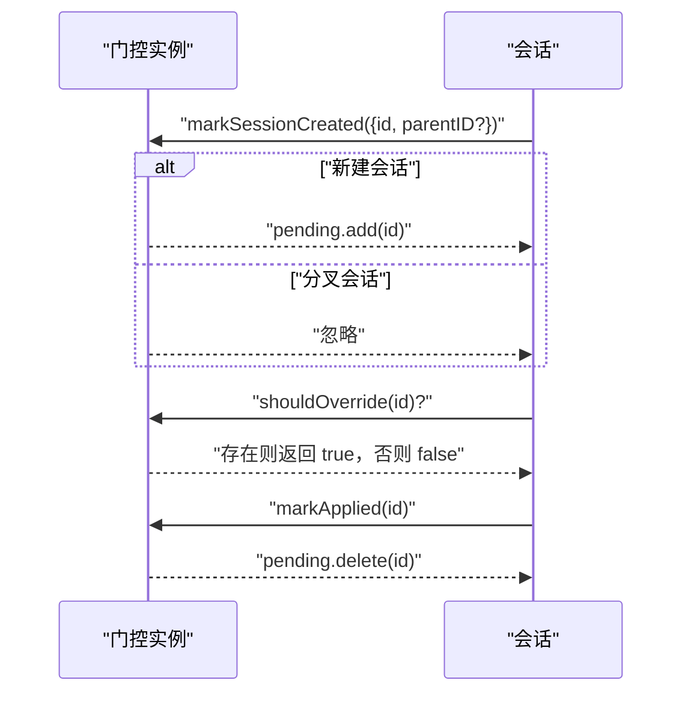
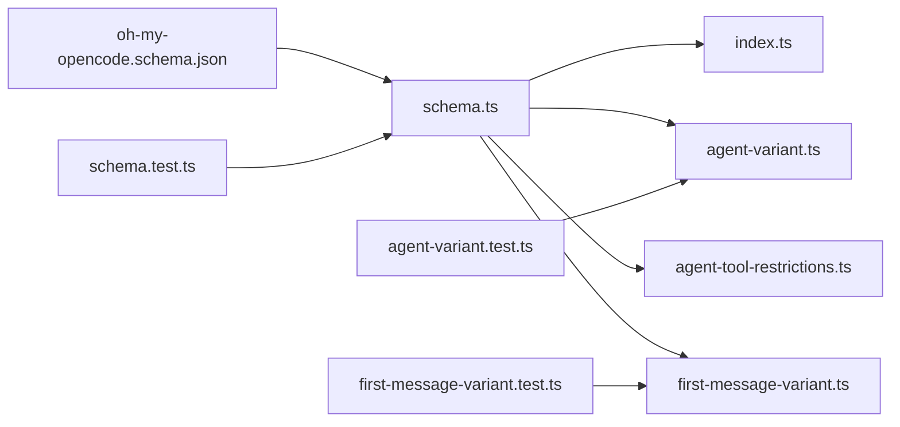

# 代理配置接口

<cite>
**本文引用的文件**
- [oh-my-opencode.schema.json](file://assets/oh-my-opencode.schema.json)
- [schema.ts](file://src/config/schema.ts)
- [index.ts](file://src/config/index.ts)
- [agent-variant.ts](file://src/shared/agent-variant.ts)
- [agent-tool-restrictions.ts](file://src/shared/agent-tool-restrictions.ts)
- [first-message-variant.ts](file://src/shared/first-message-variant.ts)
- [schema.test.ts](file://src/config/schema.test.ts)
- [agent-variant.test.ts](file://src/shared/agent-variant.test.ts)
- [first-message-variant.test.ts](file://src/shared/first-message-variant.test.ts)
- [CONFIGURATION-GUIDE.md](file://CONFIGURATION-GUIDE.md)
</cite>

## 目录
1. [简介](#简介)
2. [项目结构](#项目结构)
3. [核心组件](#核心组件)
4. [架构总览](#架构总览)
5. [详细组件分析](#详细组件分析)
6. [依赖关系分析](#依赖关系分析)
7. [性能考虑](#性能考虑)
8. [故障排除指南](#故障排除指南)
9. [结论](#结论)
10. [附录](#附录)

## 简介
本文件系统化梳理 Oh My OpenCode 的代理配置接口，涵盖代理配置的数据结构、接口定义、配置选项与验证规则；详解代理变体接口、工具限制接口、代理工具约束等配置相关接口；解释代理配置的验证规则、默认值设置与配置继承机制，并提供最佳实践与常见配置模式示例。

## 项目结构
围绕代理配置的核心代码主要分布在以下位置：
- 配置模式与校验：src/config/schema.ts
- 导出入口：src/config/index.ts
- 代理变体解析与应用：src/shared/agent-variant.ts
- 代理工具限制：src/shared/agent-tool-restrictions.ts
- 首次消息变体门控：src/shared/first-message-variant.ts
- 配置模式测试：src/config/schema.test.ts
- 变体行为测试：src/shared/agent-variant.test.ts
- 首次消息门控测试：src/shared/first-message-variant.test.ts
- JSON Schema 定义：assets/oh-my-opencode.schema.json
- 配置指南与示例：CONFIGURATION-GUIDE.md

**图表来源**
- [schema.ts](file://src/config/schema.ts#L1-L384)
- [index.ts](file://src/config/index.ts#L1-L27)
- [agent-variant.ts](file://src/shared/agent-variant.ts#L1-L41)
- [agent-tool-restrictions.ts](file://src/shared/agent-tool-restrictions.ts#L1-L57)
- [first-message-variant.ts](file://src/shared/first-message-variant.ts#L1-L29)
- [schema.test.ts](file://src/config/schema.test.ts#L1-L445)
- [agent-variant.test.ts](file://src/shared/agent-variant.test.ts#L1-L84)
- [first-message-variant.test.ts](file://src/shared/first-message-variant.test.ts#L1-L33)
- [CONFIGURATION-GUIDE.md](file://CONFIGURATION-GUIDE.md#L1-L289)
- [oh-my-opencode.schema.json](file://assets/oh-my-opencode.schema.json#L1-L800)

**章节来源**
- [schema.ts](file://src/config/schema.ts#L1-L384)
- [index.ts](file://src/config/index.ts#L1-L27)
- [CONFIGURATION-GUIDE.md](file://CONFIGURATION-GUIDE.md#L1-L289)

## 核心组件
- 配置模式与类型
  - OhMyOpenCodeConfigSchema：顶层配置模式，包含 disabled_mcps、disabled_agents、disabled_skills、disabled_hooks、disabled_commands、agents、categories、claude_code、sisyphus_agent、comment_checker、experimental、auto_update、skills、ralph_loop、background_task、notification、git_master、tdd_guard 等字段。
  - AgentOverrideConfigSchema：代理覆盖配置模式，支持 model（已弃用）、variant、category、skills、temperature、top_p、prompt、prompt_append、tools、disable、description、mode、color、permission 等字段。
  - CategoryConfigSchema：分类配置模式，支持 model、variant、temperature、top_p、maxTokens、thinking、reasoningEffort、textVerbosity、tools、prompt_append、defaultSkills 等字段。
  - 其他专用模式：SisyphusAgentConfigSchema、ClaudeCodeConfigSchema、ExperimentalConfigSchema、SkillsConfigSchema、RalphLoopConfigSchema、BackgroundTaskConfigSchema、NotificationConfigSchema、GitMasterConfigSchema、TddGuardConfigSchema 等。
- 类型导出
  - 通过 src/config/index.ts 导出 OhMyOpenCodeConfig、AgentOverrideConfig、AgentOverrides、AgentName、HookName、BuiltinCommandName、SisyphusAgentConfig、ExperimentalConfig、DynamicContextPruningConfig、RalphLoopConfig、CategoriesConfig、BuiltinCategoryName、GitMasterConfig、TddGuardConfig、RiskTier 等类型别名。

**章节来源**
- [schema.ts](file://src/config/schema.ts#L1-L384)
- [index.ts](file://src/config/index.ts#L1-L27)

## 架构总览
代理配置接口由“模式定义 + 解析应用 + 工具限制 + 门控机制”构成，形成从配置到运行期行为的闭环。

**图表来源**
- [schema.ts](file://src/config/schema.ts#L109-L151)
- [schema.ts](file://src/config/schema.ts#L170-L186)
- [agent-variant.ts](file://src/shared/agent-variant.ts#L3-L41)
- [agent-tool-restrictions.ts](file://src/shared/agent-tool-restrictions.ts#L1-L57)
- [first-message-variant.ts](file://src/shared/first-message-variant.ts#L6-L28)

## 详细组件分析

### 代理变体接口
- 功能概述
  - resolveAgentVariant：根据代理名称解析最终变体，优先使用代理覆盖配置中的 variant；若未设置，则回退到代理覆盖配置中指定的 category 对应的分类配置中的 variant；均不存在则返回 undefined。
  - applyAgentVariant：在消息对象未设置 variant 时，将其应用为解析得到的变体，避免覆盖已有显式设置。
- 关键行为
  - 代理覆盖优先于分类配置。
  - 变体仅在未显式设置时才应用，确保用户显式配置优先。
- 测试要点
  - 代理名称缺失时返回 undefined。
  - 代理覆盖 variant 生效。
  - 使用 category 时从分类配置取 variant。
  - 已有 variant 不被覆盖。

**图表来源**
- [agent-variant.ts](file://src/shared/agent-variant.ts#L3-L29)

**章节来源**
- [agent-variant.ts](file://src/shared/agent-variant.ts#L1-L41)
- [agent-variant.test.ts](file://src/shared/agent-variant.test.ts#L1-L84)

### 工具限制接口
- 功能概述
  - getAgentToolRestrictions：返回指定代理的工具限制映射，true 表示允许，false 表示禁止。
  - hasAgentToolRestrictions：判断代理是否存在工具限制。
- 适用范围
  - explore、librarian、oracle、multimodal-looker、document-writer、frontend-ui-ux-engineer、Sisyphus-Junior 等代理存在不同工具限制集合。
- 使用场景
  - 在 session.prompt 调用前，基于代理名生成工具布尔映射，确保工具调用安全可控。

**图表来源**
- [agent-tool-restrictions.ts](file://src/shared/agent-tool-restrictions.ts#L49-L56)

**章节来源**
- [agent-tool-restrictions.ts](file://src/shared/agent-tool-restrictions.ts#L1-L57)

### 代理工具约束
- 约束要点
  - 探索类代理（explore、librarian）禁止 write、edit、task、delegate_task、call_omo_agent。
  - oracle 禁止 write、edit、task、delegate_task。
  - multimodal-looker 仅允许 read。
  - document-writer、frontend-ui-ux-engineer 禁止 task、delegate_task、call_omo_agent。
  - Sisyphus-Junior 禁止 task、delegate_task。

**章节来源**
- [agent-tool-restrictions.ts](file://src/shared/agent-tool-restrictions.ts#L7-L47)

### 首次消息变体门控
- 功能概述
  - createFirstMessageVariantGate：创建一个门控实例，用于在会话首次创建时标记并决定是否对首条消息应用变体，应用后清除标记。
- 关键行为
  - 仅对新建会话（无父会话 ID）生效。
  - 应用后清除待处理集合，避免重复应用。
- 测试要点
  - 新建会话标记后应允许覆盖。
  - 分叉会话（带父 ID）不应覆盖。
  - 应用后不再覆盖。

**图表来源**
- [first-message-variant.ts](file://src/shared/first-message-variant.ts#L6-L28)

**章节来源**
- [first-message-variant.ts](file://src/shared/first-message-variant.ts#L1-L29)
- [first-message-variant.test.ts](file://src/shared/first-message-variant.test.ts#L1-L33)

### 配置数据结构与接口定义
- 顶层配置（OhMyOpenCodeConfig）
  - 字段概览：disabled_mcps、disabled_agents、disabled_skills、disabled_hooks、disabled_commands、agents、categories、claude_code、sisyphus_agent、comment_checker、experimental、auto_update、skills、ralph_loop、background_task、notification、git_master、tdd_guard。
  - 类型与约束：各字段通过 Zod 模式定义，包含枚举、数组、对象、可选字段及数值范围校验。
- 代理覆盖配置（AgentOverrideConfig）
  - 字段：model（已弃用，兼容保留）、variant、category、skills、temperature、top_p、prompt、prompt_append、tools、disable、description、mode、color、permission。
  - 继承与优先级：category 优先于 model；tools 为布尔映射；mode 支持 subagent、primary、all；color 为十六进制格式；permission 包含 edit、bash、webfetch、doom_loop、external_directory 等子项。
- 分类配置（CategoryConfig）
  - 字段：model、variant、temperature、top_p、maxTokens、thinking（type/enabled/disabled、budgetTokens）、reasoningEffort、textVerbosity、tools、prompt_append、defaultSkills。
  - 默认值：部分字段提供默认值（如 experimental 中的动态修剪配置）。
- 其他专用配置
  - ClaudeCodeConfig、SisyphusAgentConfig、SkillsConfig、RalphLoopConfig、BackgroundTaskConfig、NotificationConfig、GitMasterConfig、TddGuardConfig 等，分别对应插件开关、Sisyphus 行为、技能管理、循环任务、并发与超时、通知策略、Git 提交增强、TDD 保护等。

**章节来源**
- [schema.ts](file://src/config/schema.ts#L109-L151)
- [schema.ts](file://src/config/schema.ts#L170-L186)
- [schema.ts](file://src/config/schema.ts#L338-L358)
- [schema.ts](file://src/config/schema.ts#L1-L384)

### 验证规则与默认值
- 验证规则
  - 数值范围：temperature ∈ [0,2]，top_p ∈ [0,1]；maxTokens、budgetTokens、turns 等具有上下界。
  - 枚举值：mode ∈ {"subagent","primary","all"}；reasoningEffort ∈ {"low","medium","high"}；textVerbosity ∈ {"low","medium","high"}；permission 子项枚举 {"ask","allow","deny"}。
  - 结构约束：tools 为字符串到布尔的映射；color 正则匹配十六进制；bash 权限可为字符串或记录（字符串到权限）。
  - 数组元素：disabled_mcps、disabled_agents、disabled_skills、disabled_hooks、disabled_commands 等要求元素类型正确且非空字符串（除 disabled_mcps 可接受自定义命名模式）。
- 默认值
  - experimental.dynamic_context_pruning.enabled 默认 false，notification 默认 detailed，turn_protection.enabled 默认 true，turns 默认 3，protected_tools 默认包含 task、todowrite、todoread、lsp_rename、session_* 等。
  - tdd_guard.risk_tier_enabled 默认 true，min_enforce_tier 默认 2，reject_empty_tests、reject_missing_assertions、reject_trivial_assertions 默认 true，inject_skill_on_block 默认 true。
  - git_master.commit_footer、include_co_authored_by 默认 true。
- 兼容性
  - 代理覆盖配置仍接受已弃用的 model 字段，但运行时优先使用 category 指向的分类配置。

**章节来源**
- [schema.ts](file://src/config/schema.ts#L109-L151)
- [schema.ts](file://src/config/schema.ts#L170-L186)
- [schema.ts](file://src/config/schema.ts#L205-L239)
- [schema.ts](file://src/config/schema.ts#L319-L336)
- [schema.ts](file://src/config/schema.ts#L310-L315)
- [schema.test.ts](file://src/config/schema.test.ts#L1-L445)

### 配置继承机制
- 代理到分类的继承
  - 当代理覆盖配置仅设置 category 而未设置 variant 时，运行时从分类配置读取 variant。
- 代理覆盖优先级
  - 代理覆盖配置优先于分类配置；用户显式设置的 variant 不会被自动覆盖。
- JSON Schema 与运行时差异
  - JSON Schema 严格区分字段类型与枚举；运行时可通过迁移逻辑将旧字段（如 model）转换为新字段（category），并在必要时删除冗余配置。

**章节来源**
- [agent-variant.ts](file://src/shared/agent-variant.ts#L3-L29)
- [schema.ts](file://src/config/schema.ts#L109-L151)
- [schema.test.ts](file://src/config/schema.test.ts#L256-L288)

### 最佳实践与常见配置模式
- 推荐模式
  - 使用 categories 覆盖模型与默认技能，再通过 agents 对特定代理进行微调（如温度、提示词追加、工具开关、颜色、权限）。
  - 通过 mode 控制代理参与模式（subagent/primary/all），结合 prompt_append 与 skills 注入提升任务针对性。
  - 使用 tools 明确授权工具集合，配合 agent-tool-restrictions 强化安全边界。
- 典型场景
  - 视觉任务：categories.visual + defaultSkills 包含前端与自动化测试技能。
  - 代码任务：categories.ultrabrain + defaultSkills 包含 TDD、系统调试等技能。
  - 文档任务：categories.writing + 低温度与明确写作风格提示。
- 配置优先级
  - 项目级 oh-my-opencode.json > 全局 ~/.config/opencode/oh-my-opencode.json > 项目 .opencode/oh-my-opencode.json > 代码默认配置。
- 参考示例
  - 配置指南中提供了包含 Planning Agents 与 Categories 的完整示例，展示如何组合 agents 与 categories 达到预期效果。

**章节来源**
- [CONFIGURATION-GUIDE.md](file://CONFIGURATION-GUIDE.md#L1-L289)

## 依赖关系分析
- 模块耦合
  - 配置模式（schema.ts）独立于运行时逻辑，通过导出类型供其他模块使用（index.ts）。
  - 代理变体解析依赖配置结构（agents、categories），并与工具限制、门控协同工作。
- 外部依赖
  - JSON Schema 文件提供外部 IDE 与工具链的静态校验支持。
  - 测试用例覆盖模式定义的正确性与边界条件。

**图表来源**
- [schema.ts](file://src/config/schema.ts#L1-L384)
- [index.ts](file://src/config/index.ts#L1-L27)
- [agent-variant.ts](file://src/shared/agent-variant.ts#L1-L41)
- [agent-tool-restrictions.ts](file://src/shared/agent-tool-restrictions.ts#L1-L57)
- [first-message-variant.ts](file://src/shared/first-message-variant.ts#L1-L29)
- [oh-my-opencode.schema.json](file://assets/oh-my-opencode.schema.json#L1-L800)
- [schema.test.ts](file://src/config/schema.test.ts#L1-L445)
- [agent-variant.test.ts](file://src/shared/agent-variant.test.ts#L1-L84)
- [first-message-variant.test.ts](file://src/shared/first-message-variant.test.ts#L1-L33)

**章节来源**
- [schema.ts](file://src/config/schema.ts#L1-L384)
- [index.ts](file://src/config/index.ts#L1-L27)

## 性能考虑
- 模式解析
  - Zod safeParse 仅在需要时进行深层校验，建议在配置加载阶段一次性校验，避免重复解析。
- 运行时计算
  - 变体解析与工具限制查询均为 O(1) 查表操作，开销极低。
- 并发与缓存
  - 若频繁访问 categories 与 agents，可在应用层缓存解析结果，减少重复查找。

## 故障排除指南
- 常见错误
  - 数值越界：temperature、top_p、turns 等超出范围将导致校验失败。
  - 类型不匹配：数组元素非字符串、对象字段类型不符等。
  - 枚举值非法：mode、reasoningEffort、textVerbosity 等不在允许集合内。
- 定位方法
  - 使用 CLI Doctor 的配置校验检查，查看具体错误路径与信息。
  - 逐步缩小配置范围，定位导致失败的字段与值。
- 清理与修复
  - 清理历史遗留字段（如已弃用的 model），迁移到 category。
  - 确保 tools 映射仅包含布尔值，避免混合类型。

**章节来源**
- [schema.test.ts](file://src/config/schema.test.ts#L1-L445)
- [CONFIGURATION-GUIDE.md](file://CONFIGURATION-GUIDE.md#L1-L289)

## 结论
Oh My OpenCode 的代理配置接口通过严格的 Zod 模式定义、清晰的继承与优先级规则、以及配套的工具限制与门控机制，实现了高可配置性与安全性。遵循本文档的最佳实践与验证规则，可高效构建稳定、可维护的代理配置体系。

## 附录
- JSON Schema 参考
  - 顶层对象属性与嵌套结构详见 assets/oh-my-opencode.schema.json。
- 相关文档
  - CONFIGURATION-GUIDE.md 提供了丰富的配置示例与优先级说明。

**章节来源**
- [oh-my-opencode.schema.json](file://assets/oh-my-opencode.schema.json#L1-L800)
- [CONFIGURATION-GUIDE.md](file://CONFIGURATION-GUIDE.md#L1-L289)