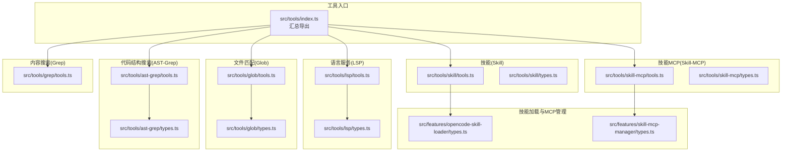
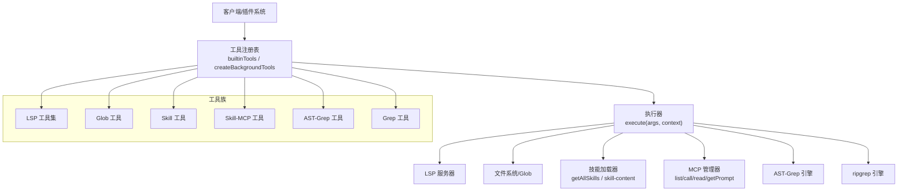
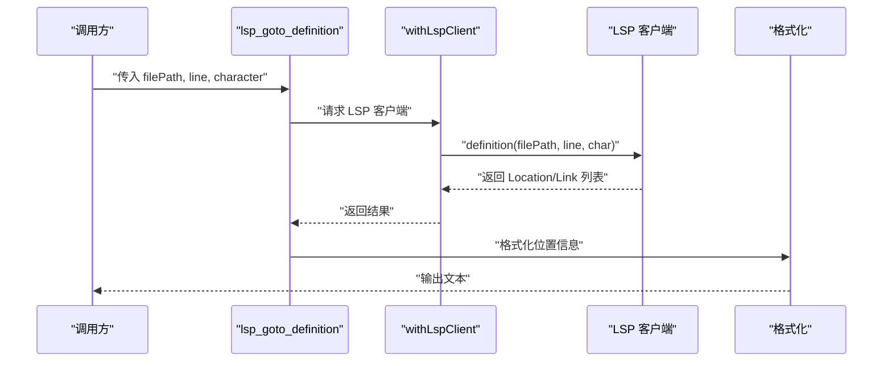
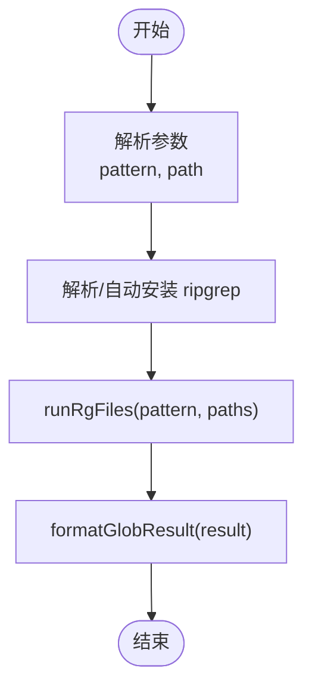
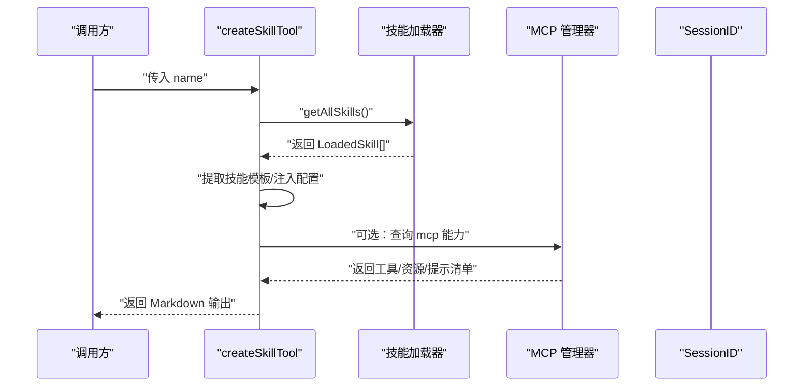
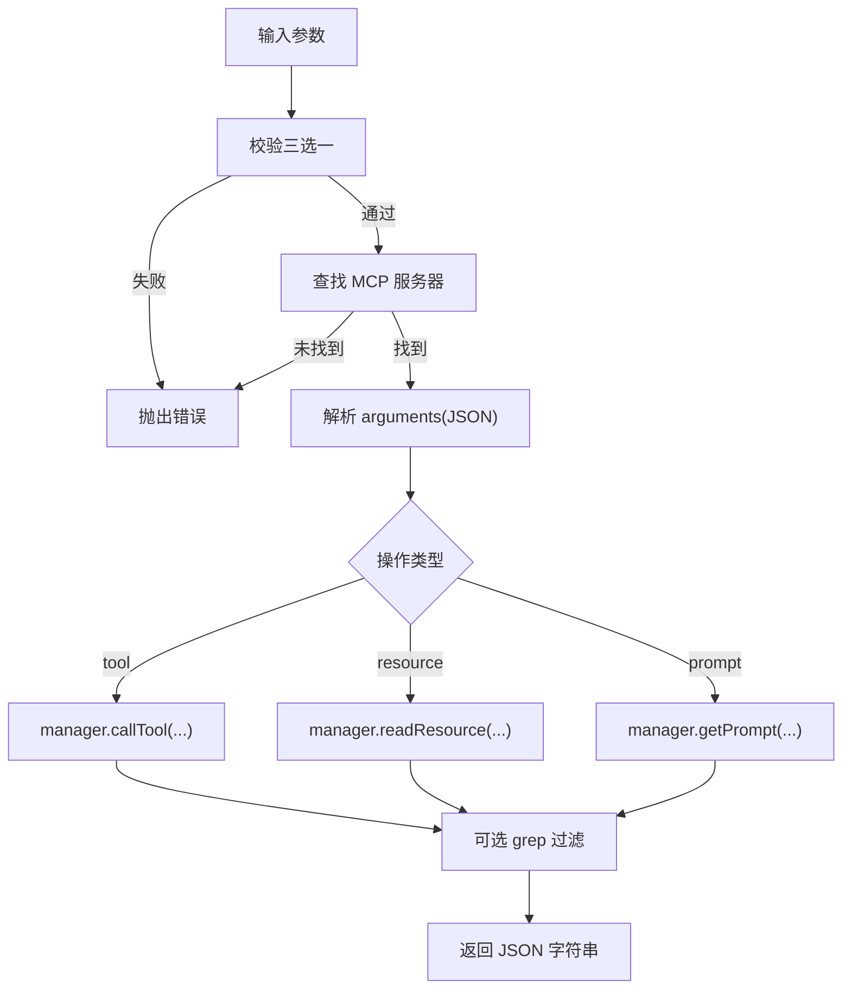
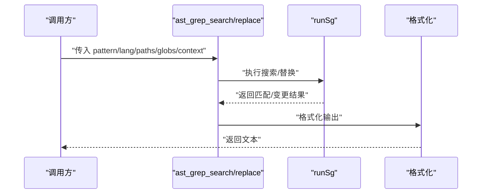
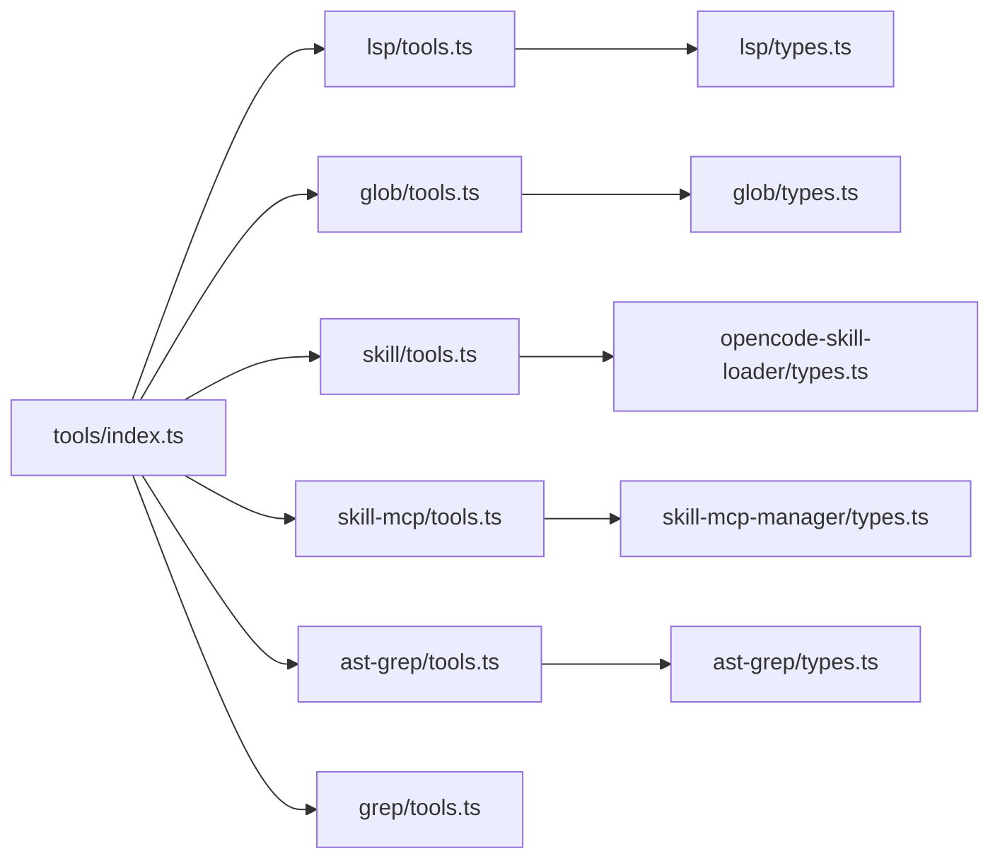

# 工具定义接口

<cite>
**本文档引用的文件**
- [src/tools/index.ts](file://src/tools/index.ts)
- [src/tools/lsp/tools.ts](file://src/tools/lsp/tools.ts)
- [src/tools/lsp/types.ts](file://src/tools/lsp/types.ts)
- [src/tools/glob/tools.ts](file://src/tools/glob/tools.ts)
- [src/tools/glob/types.ts](file://src/tools/glob/types.ts)
- [src/tools/skill/tools.ts](file://src/tools/skill/tools.ts)
- [src/tools/skill/types.ts](file://src/tools/skill/types.ts)
- [src/tools/skill-mcp/tools.ts](file://src/tools/skill-mcp/tools.ts)
- [src/tools/skill-mcp/types.ts](file://src/tools/skill-mcp/types.ts)
- [src/tools/ast-grep/tools.ts](file://src/tools/ast-grep/tools.ts)
- [src/tools/ast-grep/types.ts](file://src/tools/ast-grep/types.ts)
- [src/tools/grep/tools.ts](file://src/tools/grep/tools.ts)
- [src/features/opencode-skill-loader/types.ts](file://src/features/opencode-skill-loader/types.ts)
- [src/features/skill-mcp-manager/types.ts](file://src/features/skill-mcp-manager/types.ts)
- [src/shared/tool-name.ts](file://src/shared/tool-name.ts)
</cite>

## 目录
1. [简介](#简介)
2. [项目结构](#项目结构)
3. [核心组件](#核心组件)
4. [架构总览](#架构总览)
5. [详细组件分析](#详细组件分析)
6. [依赖关系分析](#依赖关系分析)
7. [性能考虑](#性能考虑)
8. [故障排除指南](#故障排除指南)
9. [结论](#结论)
10. [附录](#附录)

## 简介
本文件系统性梳理 Oh My OpenCode 的工具定义接口，覆盖以下工具族：LSP 工具、Glob 工具、技能工具（Skill）、技能 MCP 工具（Skill-MCP）、AST-Grep 搜索与替换、内容搜索（Grep）等。文档重点阐述：
- 工具接口的标准化结构与参数定义
- 执行流程与返回格式
- 工具注册机制与动态加载
- 工具链组合与扩展点
- 自定义工具开发指南

## 项目结构
工具模块集中于 src/tools 下，按功能域划分目录，每个工具以 ToolDefinition 形式导出，统一由 src/tools/index.ts 汇总导出，便于上层插件系统或运行时按名称调用。

**图表来源**
- [src/tools/index.ts](file://src/tools/index.ts#L1-L73)
- [src/tools/lsp/tools.ts](file://src/tools/lsp/tools.ts#L1-L262)
- [src/tools/lsp/types.ts](file://src/tools/lsp/types.ts#L1-L125)
- [src/tools/glob/tools.ts](file://src/tools/glob/tools.ts#L1-L42)
- [src/tools/glob/types.ts](file://src/tools/glob/types.ts#L1-L23)
- [src/tools/skill/tools.ts](file://src/tools/skill/tools.ts#L1-L201)
- [src/tools/skill/types.ts](file://src/tools/skill/types.ts#L1-L32)
- [src/tools/skill-mcp/tools.ts](file://src/tools/skill-mcp/tools.ts#L1-L173)
- [src/tools/skill-mcp/types.ts](file://src/tools/skill-mcp/types.ts#L1-L9)
- [src/tools/ast-grep/tools.ts](file://src/tools/ast-grep/tools.ts#L1-L113)
- [src/tools/ast-grep/types.ts](file://src/tools/ast-grep/types.ts#L1-L62)
- [src/tools/grep/tools.ts](file://src/tools/grep/tools.ts#L1-L41)
- [src/features/opencode-skill-loader/types.ts](file://src/features/opencode-skill-loader/types.ts#L1-L39)
- [src/features/skill-mcp-manager/types.ts](file://src/features/skill-mcp-manager/types.ts#L1-L15)

**章节来源**
- [src/tools/index.ts](file://src/tools/index.ts#L1-L73)

## 核心组件
- 工具定义标准：所有工具均通过 @opencode-ai/plugin 的 tool(...) 创建 ToolDefinition，包含 description、args（使用 tool.schema 定义）与 execute 方法。
- 内置工具集合：builtinTools 将常用工具聚合，便于统一注册与分发。
- 动态工具生成：如 createSkillTool、createBackgroundTools、createSkillMcpTool 等工厂函数，支持运行时配置与缓存优化。
- 工具命名转换：transformToolName 提供工具名到 PascalCase 的映射规则，兼容特殊别名。

**章节来源**
- [src/tools/index.ts](file://src/tools/index.ts#L41-L73)
- [src/shared/tool-name.ts](file://src/shared/tool-name.ts#L1-L27)

## 架构总览
工具体系围绕“标准化定义 + 统一执行 + 动态加载 + 工具链组合”展开。下图展示工具与外部系统的交互：

**图表来源**
- [src/tools/index.ts](file://src/tools/index.ts#L50-L73)
- [src/tools/lsp/tools.ts](file://src/tools/lsp/tools.ts#L29-L261)
- [src/tools/glob/tools.ts](file://src/tools/glob/tools.ts#L6-L41)
- [src/tools/skill/tools.ts](file://src/tools/skill/tools.ts#L129-L200)
- [src/tools/skill-mcp/tools.ts](file://src/tools/skill-mcp/tools.ts#L107-L172)
- [src/tools/ast-grep/tools.ts](file://src/tools/ast-grep/tools.ts#L35-L113)
- [src/tools/grep/tools.ts](file://src/tools/grep/tools.ts#L5-L40)

## 详细组件分析

### LSP 工具接口
- 工具族：定义跳转、引用查找、符号检索、诊断、重命名准备与重命名等。
- 参数结构：基于 LSP 类型定义，如 Position、Range、Location、DocumentSymbol、Diagnostic、WorkspaceEdit 等。
- 执行流程：withLspClient 获取客户端 → 调用对应 LSP 方法 → 格式化输出（位置、符号、诊断、编辑结果）。
- 返回格式：文本列表，必要时包含“已截断”提示与错误信息。

**图表来源**
- [src/tools/lsp/tools.ts](file://src/tools/lsp/tools.ts#L29-L64)
- [src/tools/lsp/types.ts](file://src/tools/lsp/types.ts#L10-L30)

**章节来源**
- [src/tools/lsp/tools.ts](file://src/tools/lsp/tools.ts#L29-L261)
- [src/tools/lsp/types.ts](file://src/tools/lsp/types.ts#L1-L125)

### Glob 工具接口
- 功能：基于 ripgrep 的文件路径模式匹配，带超时与数量限制。
- 参数：pattern（必填）、path（可选，默认当前工作目录）。
- 执行：解析 CLI、调用 runRgFiles、格式化输出。
- 返回：文件列表（按修改时间排序），含截断与错误信息。

**图表来源**
- [src/tools/glob/tools.ts](file://src/tools/glob/tools.ts#L6-L41)
- [src/tools/glob/types.ts](file://src/tools/glob/types.ts#L1-L23)

**章节来源**
- [src/tools/glob/tools.ts](file://src/tools/glob/tools.ts#L1-L42)
- [src/tools/glob/types.ts](file://src/tools/glob/types.ts#L1-L23)

### 技能工具接口（Skill）
- 功能：列举、加载与注入技能内容；支持 Git Master 配置注入；可枚举嵌入的 MCP 能力。
- 参数：name（技能标识符）。
- 执行：缓存技能列表 → 查找目标技能 → 提取指令模板 → 注入 Git Master 配置（如适用）→ 拼接输出（含 MCP 能力说明）。
- 返回：Markdown 文本，包含技能元数据、基路径与指令正文，以及可用 MCP 服务器能力清单。

**图表来源**
- [src/tools/skill/tools.ts](file://src/tools/skill/tools.ts#L129-L200)
- [src/features/opencode-skill-loader/types.ts](file://src/features/opencode-skill-loader/types.ts#L26-L39)
- [src/features/skill-mcp-manager/types.ts](file://src/features/skill-mcp-manager/types.ts#L1-L15)

**章节来源**
- [src/tools/skill/tools.ts](file://src/tools/skill/tools.ts#L1-L201)
- [src/tools/skill/types.ts](file://src/tools/skill/types.ts#L1-L32)
- [src/features/opencode-skill-loader/types.ts](file://src/features/opencode-skill-loader/types.ts#L1-L39)
- [src/features/skill-mcp-manager/types.ts](file://src/features/skill-mcp-manager/types.ts#L1-L15)

### 技能 MCP 工具接口（Skill-MCP）
- 功能：在已加载技能的 MCP 服务器中调用工具、读取资源或获取提示，支持参数 JSON 解析与输出过滤。
- 参数：mcp_name（必填）、tool_name/resource_name/prompt_name 三选一、arguments（JSON 字符串或对象）、grep（正则过滤）。
- 执行：校验操作参数 → 查找 MCP 服务器 → 构造客户端信息与上下文 → 解析参数 → 调用对应操作 → 可选正则过滤 → 返回 JSON 字符串。
- 返回：JSON 字符串，必要时经 grep 过滤。

**图表来源**
- [src/tools/skill-mcp/tools.ts](file://src/tools/skill-mcp/tools.ts#L15-L172)
- [src/tools/skill-mcp/types.ts](file://src/tools/skill-mcp/types.ts#L1-L9)

**章节来源**
- [src/tools/skill-mcp/tools.ts](file://src/tools/skill-mcp/tools.ts#L1-L173)
- [src/tools/skill-mcp/types.ts](file://src/tools/skill-mcp/types.ts#L1-L9)

### AST-Grep 工具接口
- 功能：基于 AST 的跨文件代码模式搜索与替换，支持元变量与上下文行数。
- 参数：pattern（AST 模式，需为完整节点）、lang（语言枚举）、paths/globs（可选）、context（可选）；替换工具还支持 rewrite、dryRun。
- 执行：runSg 执行搜索/替换 → 格式化结果 → 用户提示（metadata.output）。
- 返回：文本结果，包含匹配详情与提示信息。

**图表来源**
- [src/tools/ast-grep/tools.ts](file://src/tools/ast-grep/tools.ts#L35-L113)
- [src/tools/ast-grep/types.ts](file://src/tools/ast-grep/types.ts#L16-L62)

**章节来源**
- [src/tools/ast-grep/tools.ts](file://src/tools/ast-grep/tools.ts#L1-L113)
- [src/tools/ast-grep/types.ts](file://src/tools/ast-grep/types.ts#L1-L62)

### 内容搜索工具（Grep）
- 功能：基于 ripgrep 的内容正则搜索，支持 include 排除与路径限定。
- 参数：pattern（正则）、include（文件模式）、path（可选）。
- 执行：runRg 执行搜索 → 格式化输出。
- 返回：文本结果，包含匹配文件与上下文。

**章节来源**
- [src/tools/grep/tools.ts](file://src/tools/grep/tools.ts#L1-L41)

## 依赖关系分析
- 工具注册：src/tools/index.ts 汇总导出内置工具与工厂方法，形成统一注册表。
- 动态加载：技能工具通过 getAllSkills 缓存技能列表；技能 MCP 工具通过 SkillMcpManager 查询可用能力。
- 外部集成：LSP 工具依赖 LSP 客户端；Glob/Grep 依赖 ripgrep；AST-Grep 依赖本地引擎。
- 命名规范：transformToolName 统一工具名风格，避免大小写与连字符差异带来的问题。

**图表来源**
- [src/tools/index.ts](file://src/tools/index.ts#L1-L73)
- [src/tools/lsp/tools.ts](file://src/tools/lsp/tools.ts#L1-L262)
- [src/tools/glob/tools.ts](file://src/tools/glob/tools.ts#L1-L42)
- [src/tools/skill/tools.ts](file://src/tools/skill/tools.ts#L1-L201)
- [src/tools/skill-mcp/tools.ts](file://src/tools/skill-mcp/tools.ts#L1-L173)
- [src/tools/ast-grep/tools.ts](file://src/tools/ast-grep/tools.ts#L1-L113)
- [src/tools/grep/tools.ts](file://src/tools/grep/tools.ts#L1-L41)
- [src/features/opencode-skill-loader/types.ts](file://src/features/opencode-skill-loader/types.ts#L1-L39)
- [src/features/skill-mcp-manager/types.ts](file://src/features/skill-mcp-manager/types.ts#L1-L15)
- [src/tools/lsp/types.ts](file://src/tools/lsp/types.ts#L1-L125)
- [src/tools/glob/types.ts](file://src/tools/glob/types.ts#L1-L23)
- [src/tools/ast-grep/types.ts](file://src/tools/ast-grep/types.ts#L1-L62)

**章节来源**
- [src/tools/index.ts](file://src/tools/index.ts#L1-L73)
- [src/shared/tool-name.ts](file://src/shared/tool-name.ts#L1-L27)

## 性能考虑
- 限流与超时：Glob 与 Grep 工具内置超时与输出/文件数量限制，避免长时间阻塞与内存占用过高。
- 结果截断：LSP 符号与诊断默认截断，防止大结果集影响用户体验。
- 缓存策略：技能工具对技能列表进行缓存，减少重复发现成本。
- 并发查询：技能 MCP 工具对工具/资源/提示三类能力采用并发查询，提升响应速度。

[本节为通用指导，无需具体文件分析]

## 故障排除指南
- 工具参数错误：技能 MCP 工具对三选一参数进行严格校验，若同时提供多个或未提供任何操作参数，会抛出明确错误提示。
- MCP 服务器缺失：当指定的 mcp_name 未在已加载技能中找到时，会列出可用服务器并提示先加载技能。
- 参数 JSON 解析失败：arguments 必须为合法 JSON 对象，否则抛出解析错误并给出示例。
- LSP 错误处理：LSP 工具捕获异常并返回错误信息，便于定位问题。
- Glob/Grep 错误：捕获底层执行异常并返回错误字符串。

**章节来源**
- [src/tools/skill-mcp/tools.ts](file://src/tools/skill-mcp/tools.ts#L15-L46)
- [src/tools/skill-mcp/tools.ts](file://src/tools/skill-mcp/tools.ts#L125-L132)
- [src/tools/skill-mcp/tools.ts](file://src/tools/skill-mcp/tools.ts#L72-L91)
- [src/tools/lsp/tools.ts](file://src/tools/lsp/tools.ts#L59-L62)
- [src/tools/glob/tools.ts](file://src/tools/glob/tools.ts#L37-L40)
- [src/tools/grep/tools.ts](file://src/tools/grep/tools.ts#L36-L40)

## 结论
Oh My OpenCode 的工具接口遵循统一的 ToolDefinition 规范，结合动态加载与工具链组合，实现了从文件匹配、代码结构搜索、语言服务到技能与 MCP 的全栈能力。通过内置限流、截断与错误处理机制，确保了工具在复杂场景下的稳定性与可维护性。开发者可基于现有模式扩展新工具，并通过工具注册表与工厂方法实现标准化接入。

[本节为总结性内容，无需具体文件分析]

## 附录

### 工具注册与动态加载机制
- 注册表：builtinTools 聚合常用工具；createBackgroundTools 工厂按运行时状态生成后台工具。
- 动态加载：技能工具通过 getAllSkills 获取技能集合；技能 MCP 工具通过 SkillMcpManager 查询可用能力。
- 命名转换：transformToolName 统一工具名风格，避免大小写与连字符差异。

**章节来源**
- [src/tools/index.ts](file://src/tools/index.ts#L50-L73)
- [src/tools/skill/tools.ts](file://src/tools/skill/tools.ts#L129-L148)
- [src/tools/skill-mcp/tools.ts](file://src/tools/skill-mcp/tools.ts#L107-L120)
- [src/shared/tool-name.ts](file://src/shared/tool-name.ts#L15-L26)

### 工具链组合建议
- 先用 Glob/Grep 定位文件与内容，再用 LSP 获取符号与诊断，最后用 AST-Grep 执行结构化替换。
- 使用技能工具加载所需技能，再通过技能 MCP 工具调用嵌入的工具/资源/提示，实现“技能 + 外部能力”的组合。

[本节为通用指导，无需具体文件分析]