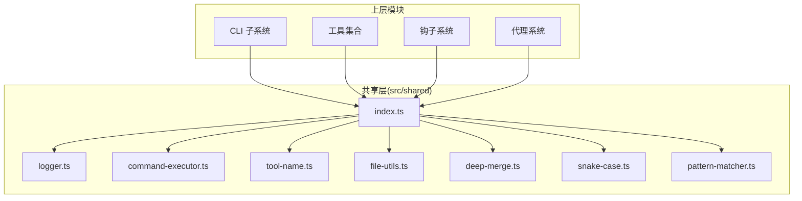
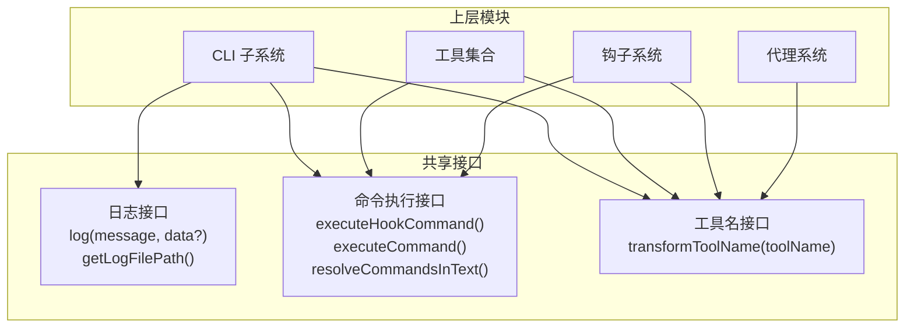
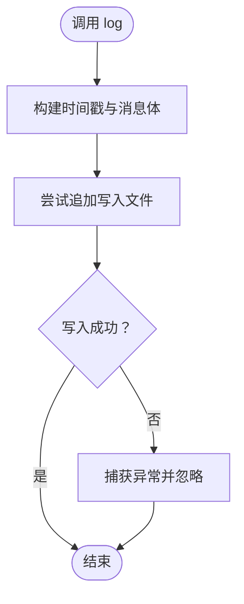
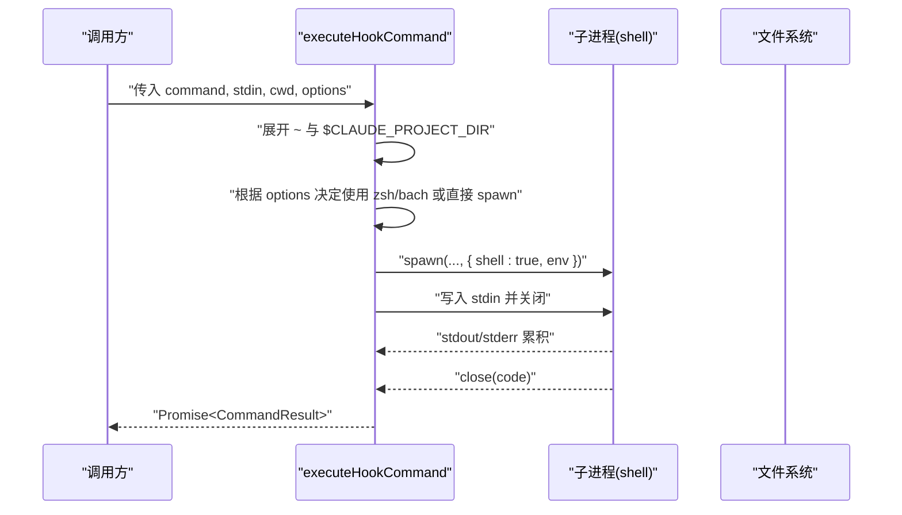
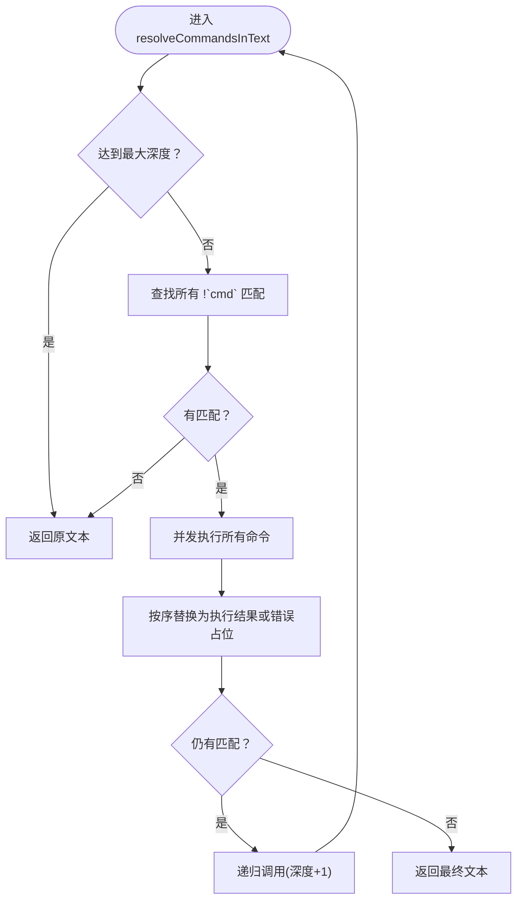
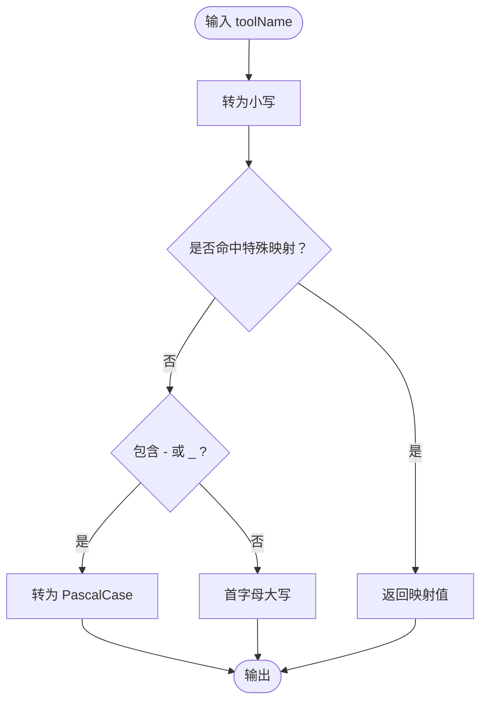
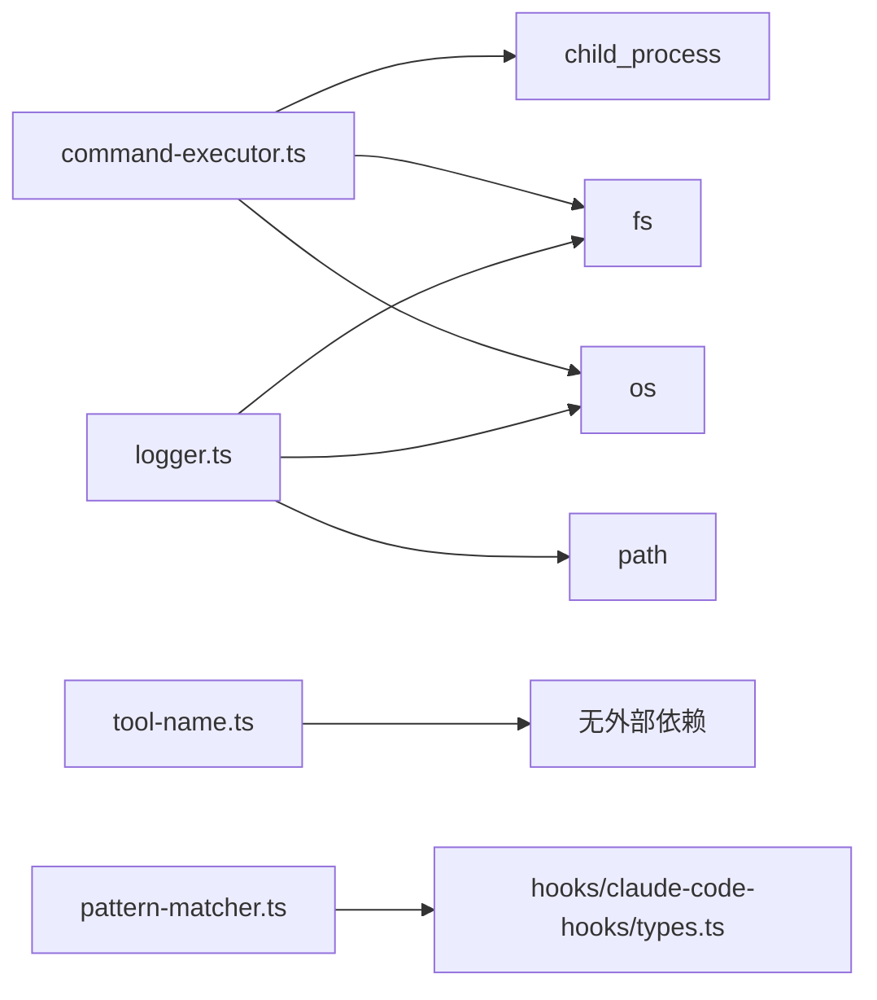

# 核心 API 接口

<cite>
**本文引用的文件**
- [src/shared/logger.ts](file://src/shared/logger.ts)
- [src/shared/command-executor.ts](file://src/shared/command-executor.ts)
- [src/shared/tool-name.ts](file://src/shared/tool-name.ts)
- [src/shared/index.ts](file://src/shared/index.ts)
- [src/shared/file-utils.ts](file://src/shared/file-utils.ts)
- [src/shared/deep-merge.ts](file://src/shared/deep-merge.ts)
- [src/shared/snake-case.ts](file://src/shared/snake-case.ts)
- [src/shared/pattern-matcher.ts](file://src/shared/pattern-matcher.ts)
- [src/hooks/claude-code-hooks/types.ts](file://src/hooks/claude-code-hooks/types.ts)
- [src/cli/types.ts](file://src/cli/types.ts)
- [src/agents/types.ts](file://src/agents/types.ts)
</cite>

## 目录
1. [简介](#简介)
2. [项目结构](#项目结构)
3. [核心组件](#核心组件)
4. [架构总览](#架构总览)
5. [详细组件分析](#详细组件分析)
6. [依赖分析](#依赖分析)
7. [性能考虑](#性能考虑)
8. [故障排查指南](#故障排查指南)
9. [结论](#结论)
10. [附录](#附录)

## 简介
本文件面向 Oh My OpenCode 的插件开发者与集成者，系统化梳理共享组件中的核心 API 接口，重点覆盖以下能力域：
- 日志记录接口：统一的日志写入与路径查询能力
- 命令执行器接口：钩子命令执行、简单命令执行、文本内嵌命令解析与递归求值
- 工具名称管理接口：工具名规范化与大小写转换
- 其他通用共享能力：文件工具、深合并、蛇形命名转换、模式匹配等

文档将逐项给出接口定义、方法签名、参数类型、返回值、典型使用场景、组合使用方式、错误处理与最佳实践，并通过可视化图表帮助理解。

## 项目结构
共享组件集中于 src/shared 目录，通过统一出口导出，供 CLI、工具、钩子、代理等模块复用。核心文件如下：
- 日志：logger.ts
- 命令执行：command-executor.ts
- 工具名转换：tool-name.ts
- 文件工具：file-utils.ts
- 深合并：deep-merge.ts
- 蛇形命名：snake-case.ts
- 模式匹配：pattern-matcher.ts
- 统一出口：index.ts

**图表来源**
- [src/shared/index.ts](file://src/shared/index.ts#L1-L29)
- [src/shared/logger.ts](file://src/shared/logger.ts#L1-L21)
- [src/shared/command-executor.ts](file://src/shared/command-executor.ts#L1-L226)
- [src/shared/tool-name.ts](file://src/shared/tool-name.ts#L1-L27)
- [src/shared/file-utils.ts](file://src/shared/file-utils.ts#L1-L41)
- [src/shared/deep-merge.ts](file://src/shared/deep-merge.ts#L1-L54)
- [src/shared/snake-case.ts](file://src/shared/snake-case.ts#L1-L50)
- [src/shared/pattern-matcher.ts](file://src/shared/pattern-matcher.ts#L1-L30)

**章节来源**
- [src/shared/index.ts](file://src/shared/index.ts#L1-L29)

## 核心组件
本节概览三大核心接口及其职责边界：
- 日志记录接口：提供统一的日志写入与日志文件路径查询
- 命令执行器接口：支持钩子命令执行（stdin 输入）、简单命令执行、文本内嵌命令解析与递归求值
- 工具名称管理接口：将原始工具名转换为规范化的 PascalCase 或特殊映射形式

**章节来源**
- [src/shared/logger.ts](file://src/shared/logger.ts#L1-L21)
- [src/shared/command-executor.ts](file://src/shared/command-executor.ts#L1-L226)
- [src/shared/tool-name.ts](file://src/shared/tool-name.ts#L1-L27)

## 架构总览
下图展示核心接口在系统中的位置与交互关系，以及与上层模块的耦合点。

**图表来源**
- [src/shared/logger.ts](file://src/shared/logger.ts#L9-L20)
- [src/shared/command-executor.ts](file://src/shared/command-executor.ts#L50-L149)
- [src/shared/command-executor.ts](file://src/shared/command-executor.ts#L184-L225)
- [src/shared/tool-name.ts](file://src/shared/tool-name.ts#L15-L26)

## 详细组件分析

### 日志记录接口
- 职责：向临时目录下的固定日志文件追加格式化日志条目；提供日志文件路径查询
- 关键函数
  - log(message: string, data?: unknown): void
    - 参数
      - message: string，日志消息正文
      - data?: unknown，可选上下文数据，将被序列化后附加
    - 返回：无
    - 使用场景：插件运行期记录事件、错误、调试信息
    - 错误处理：内部捕获写入异常并静默失败，保证不中断主流程
  - getLogFilePath(): string
    - 返回：当前日志文件的绝对路径
    - 使用场景：CLI doctor、安装器或外部工具定位日志文件
- 最佳实践
  - 将结构化数据以 JSON 字符串形式附加，便于后续解析
  - 避免在高频循环中频繁写入，必要时批量缓冲
  - 在生产环境关注磁盘空间与日志轮转策略

**图表来源**
- [src/shared/logger.ts](file://src/shared/logger.ts#L9-L16)

**章节来源**
- [src/shared/logger.ts](file://src/shared/logger.ts#L1-L21)

### 命令执行器接口
- 职责：提供两类命令执行能力与文本内嵌命令解析能力
- 关键函数
  - executeHookCommand(command: string, stdin: string, cwd: string, options?: ExecuteHookOptions): Promise<CommandResult>
    - 参数
      - command: string，待执行的命令字符串（支持 ~、$CLAUDE_PROJECT_DIR 占位符）
      - stdin: string，标准输入内容
      - cwd: string，工作目录
      - options?: ExecuteHookOptions
        - forceZsh?: boolean，是否强制使用 zsh 登录 shell
        - zshPath?: string，自定义 zsh 可执行路径
    - 返回：Promise<CommandResult>
      - exitCode: number，进程退出码
      - stdout?: string，标准输出
      - stderr?: string，标准错误
    - 使用场景：执行钩子命令（如 PreToolUse/PostToolUse），需要 stdin 输入与登录 shell 环境
    - 错误处理：spawn error 时返回 exitCode=1 并将错误信息写入 stderr
    - 行为细节
      - 自动展开 HOME 与 CLAUDE_PROJECT_DIR
      - 支持 forceZsh 且存在 zsh 则使用 zsh -lc 包裹命令；否则回退到 bash -lc；若均不可用则直接 spawn
  - executeCommand(command: string): Promise<string>
    - 参数：command: string，待执行的命令
    - 返回：Promise<string>，合并 stdout/stderr 的字符串结果
    - 使用场景：快速执行命令并获取输出，适合一次性任务
    - 错误处理：捕获异常并将 stdout/stderr 或 message 合并为字符串返回
  - resolveCommandsInText(text: string, depth?: number, maxDepth?: number): Promise<string>
    - 参数
      - text: string，包含内嵌命令标记的文本（!`command`）
      - depth?: number，当前递归深度
      - maxDepth?: number，最大递归深度，默认 3
    - 返回：Promise<string>，替换后的文本
    - 使用场景：在提示词或配置中动态注入命令输出
    - 错误处理：内嵌命令执行失败时以占位错误信息替代，避免中断整体流程
- 数据结构
  - CommandResult：exitCode、stdout、stderr
  - ExecuteHookOptions：forceZsh、zshPath
- 组合使用建议
  - 文本内嵌命令解析与钩子命令执行可配合使用：先 resolveCommandsInText，再对剩余命令调用 executeHookCommand
  - 对需要登录 shell 环境的脚本优先使用 executeHookCommand，确保 PATH 与用户配置正确加载

**图表来源**
- [src/shared/command-executor.ts](file://src/shared/command-executor.ts#L50-L118)

**图表来源**
- [src/shared/command-executor.ts](file://src/shared/command-executor.ts#L184-L225)

**章节来源**
- [src/shared/command-executor.ts](file://src/shared/command-executor.ts#L1-L226)

### 工具名称管理接口
- 职责：将原始工具名转换为规范化的 PascalCase 或特殊映射形式，用于生成稳定、一致的工具标识
- 关键函数
  - transformToolName(toolName: string): string
    - 参数：toolName: string，原始工具名（如 webfetch、web-search、TodoWrite 等）
    - 返回：string，规范化后的工具名
    - 使用场景：工具注册、钩子匹配、UI 展示等
    - 特殊映射：webfetch→WebFetch、websearch→WebSearch、todoread→TodoRead、todowrite→TodoWrite
    - 规则：包含连字符或下划线时采用 PascalCase；否则首字母大写其余小写
- 组合使用建议
  - 与 pattern-matcher 结合进行工具名匹配，提升一致性与可维护性

**图表来源**
- [src/shared/tool-name.ts](file://src/shared/tool-name.ts#L15-L26)

**章节来源**
- [src/shared/tool-name.ts](file://src/shared/tool-name.ts#L1-L27)

### 其他通用共享能力
- 文件工具（file-utils）
  - isMarkdownFile(entry): 判断是否为 Markdown 文件
  - isSymbolicLink(filePath): 判断是否为符号链接
  - resolveSymlink(filePath)/resolveSymlinkAsync(filePath): 解析符号链接真实路径
  - 使用场景：文件扫描、路径解析、安全检查
- 深合并（deep-merge）
  - deepMerge(base, override, depth?): 递归深合并对象，数组替换、undefined 不覆盖、限制最大深度
  - 使用场景：配置合并、默认值叠加
- 蛇形命名（snake-case）
  - camelToSnake/snakeToCamel/objectToSnakeCase/objectToCamelCase：键名与对象树的大小写转换
  - 使用场景：跨语言/跨协议的数据交换
- 模式匹配（pattern-matcher）
  - matchesToolMatcher(toolName, matcher): 支持通配符的工具名匹配
  - findMatchingHooks(config, eventName, toolName?): 基于配置筛选匹配的钩子
  - 使用场景：按工具名过滤钩子、精细化控制钩子触发范围

**章节来源**
- [src/shared/file-utils.ts](file://src/shared/file-utils.ts#L1-L41)
- [src/shared/deep-merge.ts](file://src/shared/deep-merge.ts#L1-L54)
- [src/shared/snake-case.ts](file://src/shared/snake-case.ts#L1-L50)
- [src/shared/pattern-matcher.ts](file://src/shared/pattern-matcher.ts#L1-L30)

## 依赖分析
- 组件内聚与耦合
  - 命令执行器与工具名管理相对独立，但可在钩子系统中组合使用
  - 日志接口被广泛依赖，建议在关键路径中统一使用
- 外部依赖
  - child_process（命令执行）、fs/os/path（文件系统与路径）
- 潜在循环依赖
  - 当前共享层为纯工具函数，未见循环导入迹象
- 接口契约
  - 命令执行器返回标准化的 CommandResult，便于上层统一处理
  - 工具名转换遵循明确规则，降低跨模块差异

**图表来源**
- [src/shared/command-executor.ts](file://src/shared/command-executor.ts#L1-L6)
- [src/shared/logger.ts](file://src/shared/logger.ts#L3-L5)
- [src/shared/pattern-matcher.ts](file://src/shared/pattern-matcher.ts#L1-L1)

**章节来源**
- [src/shared/command-executor.ts](file://src/shared/command-executor.ts#L1-L226)
- [src/shared/logger.ts](file://src/shared/logger.ts#L1-L21)
- [src/shared/pattern-matcher.ts](file://src/shared/pattern-matcher.ts#L1-L30)

## 性能考虑
- 命令执行
  - executeHookCommand：基于 spawn 的流式读取，适合长输出；注意 stdout/stderr 累积可能占用内存
  - executeCommand：基于 exec，适合短输出；注意超大输出可能导致内存压力
  - resolveCommandsInText：并发执行多个命令，合理设置 maxDepth 防止过深递归
- 日志
  - 追加写入为顺序 IO，建议避免在热路径频繁调用；必要时引入缓冲或异步写入
- 工具名转换与模式匹配
  - transformToolName 与 matchesToolMatcher 为纯函数，开销极低
- 深合并与命名转换
  - 深度限制与递归遍历，避免过深对象导致栈溢出或性能问题

[本节为通用指导，无需特定文件引用]

## 故障排查指南
- 命令执行器
  - executeHookCommand 返回 exitCode=1 且 stderr 包含错误信息：检查命令语法、权限、工作目录与环境变量
  - resolveCommandsInText 中出现占位错误信息：确认内嵌命令可用、网络可达、权限允许
- 日志
  - getLogFilePath 返回路径无法写入：检查临时目录权限与磁盘空间
- 工具名转换
  - 转换结果不符合预期：确认输入是否包含连字符/下划线或命中特殊映射
- 模式匹配
  - findMatchingHooks 未返回期望结果：核对 matcher 语法（支持通配符）与工具名大小写

**章节来源**
- [src/shared/command-executor.ts](file://src/shared/command-executor.ts#L111-L117)
- [src/shared/command-executor.ts](file://src/shared/command-executor.ts#L205-L213)
- [src/shared/logger.ts](file://src/shared/logger.ts#L14-L16)
- [src/shared/pattern-matcher.ts](file://src/shared/pattern-matcher.ts#L17-L29)

## 结论
Oh My OpenCode 的共享接口以“轻量、稳定、可组合”为核心设计原则，日志、命令执行与工具名管理三大能力覆盖了插件运行期的关键需求。通过统一的接口与清晰的错误处理策略，开发者可以以较低成本集成并扩展功能。建议在实际使用中：
- 统一日志入口，规范错误输出
- 优先使用 executeHookCommand 执行需要登录 shell 的脚本
- 使用 transformToolName 与 pattern-matcher 保持工具名一致性与可控性
- 对高并发命令执行场景，合理设置递归深度与并发策略

[本节为总结性内容，无需特定文件引用]

## 附录
- 类型参考（与共享接口协同使用）
  - 钩子系统类型：ClaudeHookEvent、HookMatcher、HookCommand、ClaudeHooksConfig、各类 Hook 输入/输出接口
  - CLI 类型：InstallArgs、InstallConfig、ConfigMergeResult、DetectedConfig
  - 代理类型：AgentFactory、AgentCategory、AgentCost、DelegationTrigger、AgentPromptMetadata、AgentName 等

**章节来源**
- [src/hooks/claude-code-hooks/types.ts](file://src/hooks/claude-code-hooks/types.ts#L1-L205)
- [src/cli/types.ts](file://src/cli/types.ts#L1-L35)
- [src/agents/types.ts](file://src/agents/types.ts#L1-L87)