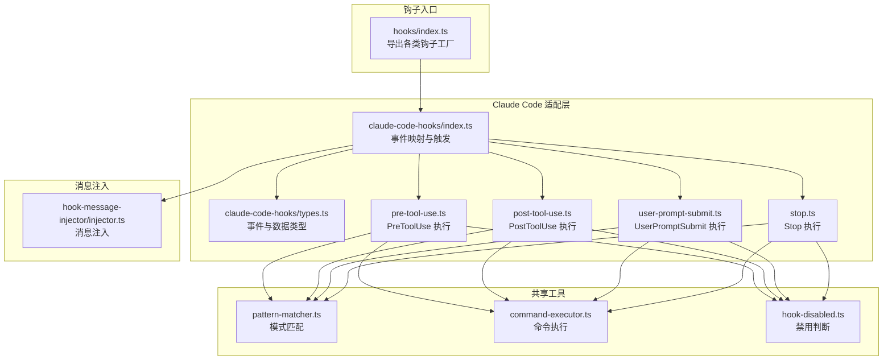
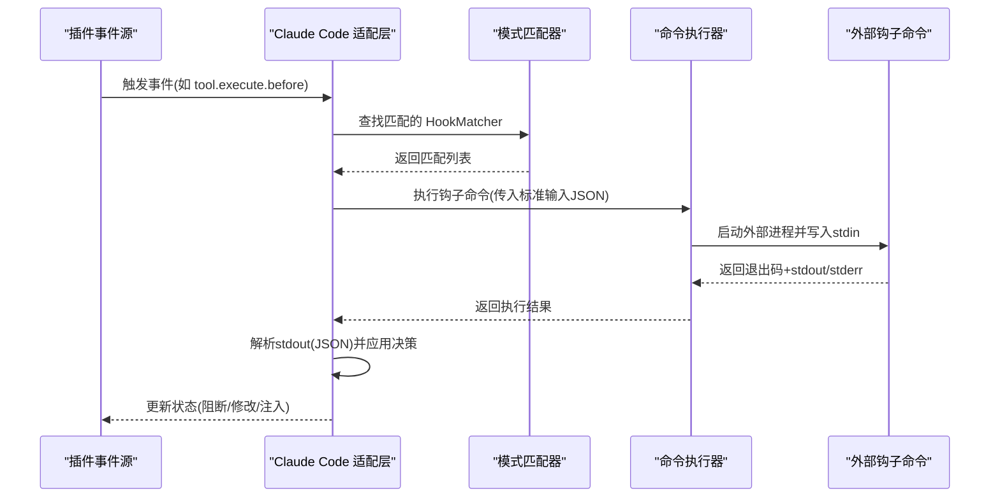
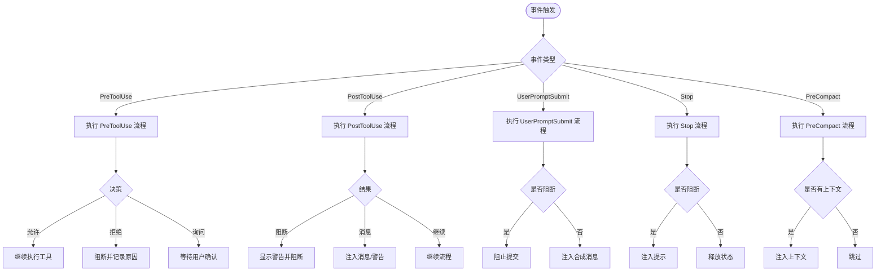
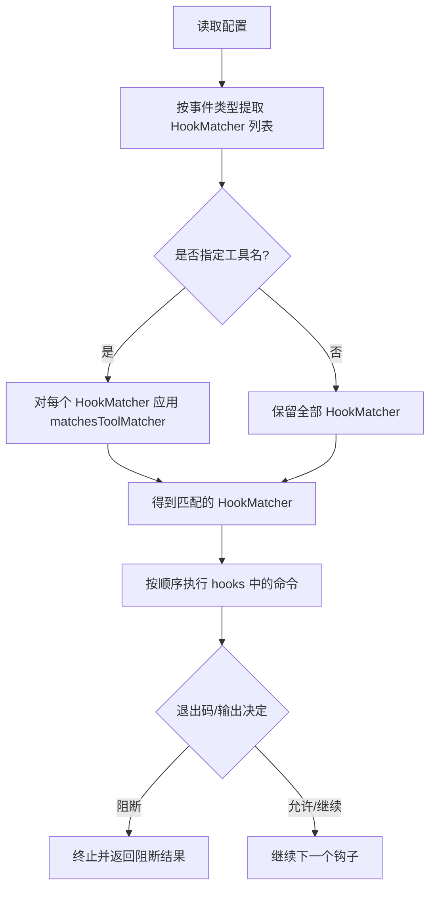
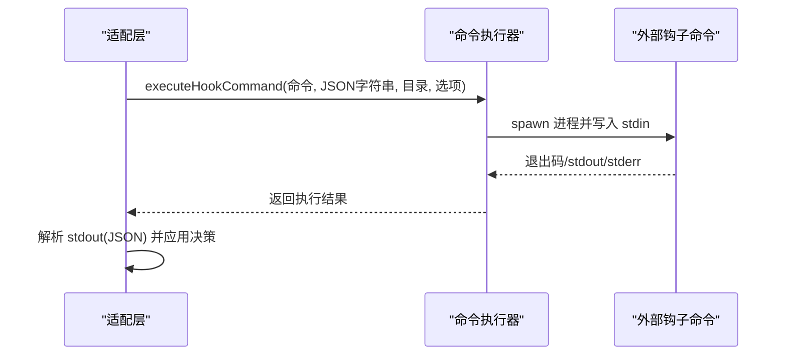
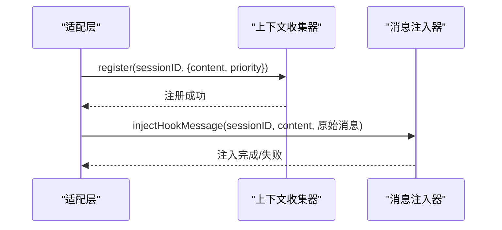
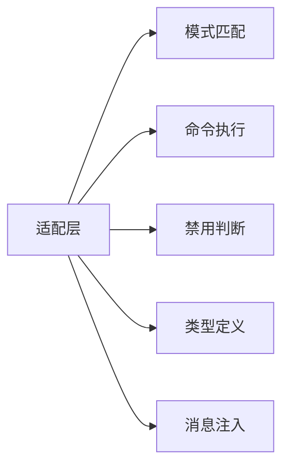

# 钩子接口规范

<cite>
**本文档引用的文件**
- [src/hooks/index.ts](file://src/hooks/index.ts)
- [src/hooks/claude-code-hooks/types.ts](file://src/hooks/claude-code-hooks/types.ts)
- [src/hooks/claude-code-hooks/index.ts](file://src/hooks/claude-code-hooks/index.ts)
- [src/hooks/claude-code-hooks/pre-tool-use.ts](file://src/hooks/claude-code-hooks/pre-tool-use.ts)
- [src/hooks/claude-code-hooks/post-tool-use.ts](file://src/hooks/claude-code-hooks/post-tool-use.ts)
- [src/hooks/claude-code-hooks/user-prompt-submit.ts](file://src/hooks/claude-code-hooks/user-prompt-submit.ts)
- [src/hooks/claude-code-hooks/stop.ts](file://src/hooks/claude-code-hooks/stop.ts)
- [src/shared/pattern-matcher.ts](file://src/shared/pattern-matcher.ts)
- [src/shared/command-executor.ts](file://src/shared/command-executor.ts)
- [src/shared/hook-disabled.ts](file://src/shared/hook-disabled.ts)
- [src/features/hook-message-injector/injector.ts](file://src/features/hook-message-injector/injector.ts)
- [src/hooks/tdd-guard/types.ts](file://src/hooks/tdd-guard/types.ts)
- [src/hooks/ralph-loop/types.ts](file://src/hooks/ralph-loop/types.ts)
</cite>

## 目录
1. [简介](#简介)
2. [项目结构](#项目结构)
3. [核心组件](#核心组件)
4. [架构总览](#架构总览)
5. [详细组件分析](#详细组件分析)
6. [依赖关系分析](#依赖关系分析)
7. [性能考虑](#性能考虑)
8. [故障排除指南](#故障排除指南)
9. [结论](#结论)
10. [附录](#附录)

## 简介
本文件为 Oh My OpenCode 的钩子接口规范，系统性阐述钩子系统的接口定义、事件类型与生命周期管理，解释钩子注册机制、事件触发流程与执行顺序，并提供钩子接口的实现指南、参数传递与返回值处理方法。同时覆盖钩子系统的扩展点、自定义钩子开发与钩子链式调用的实现方式，帮助开发者在不修改核心代码的前提下，通过外部命令扩展系统行为。

## 项目结构
钩子系统主要由以下部分组成：
- 钩子入口导出：统一暴露各类钩子工厂函数，便于插件集成与按需启用
- Claude Code 钩子适配层：将 OpenCode 插件事件映射到 Claude Code 钩子事件模型，负责事件触发、参数转换与结果处理
- 共享工具模块：提供模式匹配、命令执行、禁用配置判断等通用能力
- 消息注入器：支持将钩子生成的内容注入到会话消息中，实现跨组件协作

**图表来源**
- [src/hooks/index.ts](file://src/hooks/index.ts#L1-L48)
- [src/hooks/claude-code-hooks/index.ts](file://src/hooks/claude-code-hooks/index.ts#L1-L402)
- [src/hooks/claude-code-hooks/types.ts](file://src/hooks/claude-code-hooks/types.ts#L1-L205)
- [src/shared/pattern-matcher.ts](file://src/shared/pattern-matcher.ts#L1-L30)
- [src/shared/command-executor.ts](file://src/shared/command-executor.ts#L1-L226)
- [src/shared/hook-disabled.ts](file://src/shared/hook-disabled.ts#L1-L23)
- [src/features/hook-message-injector/injector.ts](file://src/features/hook-message-injector/injector.ts#L82-L127)

**章节来源**
- [src/hooks/index.ts](file://src/hooks/index.ts#L1-L48)
- [src/hooks/claude-code-hooks/index.ts](file://src/hooks/claude-code-hooks/index.ts#L1-L402)

## 核心组件
- 钩子事件类型与数据模型
  - Claude Code 钩子事件：PreToolUse、PostToolUse、UserPromptSubmit、Stop、PreCompact
  - 输入输出数据结构：包括会话标识、工作目录、权限模式、工具名称与输入/输出等字段
  - 返回值通用字段：继续执行、停止原因、抑制输出、系统消息等
- 钩子执行器
  - PreToolUse：在工具执行前进行权限决策与输入修改；支持允许/拒绝/询问三种决策
  - PostToolUse：在工具执行后注入消息、警告或阻断；支持附加上下文与系统消息
  - UserPromptSubmit：在用户提交提示时注入合成消息；支持阻断与内容包装
  - Stop：在会话空闲时决定是否阻断或注入提示；维护 stop_hook_active 状态
  - PreCompact：在会话压缩前注入上下文；支持额外上下文数组
- 注册与匹配
  - HookMatcher：基于工具名或通配符的匹配规则
  - findMatchingHooks：根据事件类型与可选工具名筛选匹配的钩子
- 命令执行与禁用控制
  - executeHookCommand：通过 shell 执行外部命令，支持 zsh/bash 登录模式
  - isHookDisabled：根据插件配置判断事件是否禁用
  - isHookCommandDisabled：根据正则模式禁用特定命令

**章节来源**
- [src/hooks/claude-code-hooks/types.ts](file://src/hooks/claude-code-hooks/types.ts#L1-L205)
- [src/hooks/claude-code-hooks/pre-tool-use.ts](file://src/hooks/claude-code-hooks/pre-tool-use.ts#L1-L173)
- [src/hooks/claude-code-hooks/post-tool-use.ts](file://src/hooks/claude-code-hooks/post-tool-use.ts#L1-L200)
- [src/hooks/claude-code-hooks/user-prompt-submit.ts](file://src/hooks/claude-code-hooks/user-prompt-submit.ts#L1-L118)
- [src/hooks/claude-code-hooks/stop.ts](file://src/hooks/claude-code-hooks/stop.ts#L1-L119)
- [src/shared/pattern-matcher.ts](file://src/shared/pattern-matcher.ts#L1-L30)
- [src/shared/command-executor.ts](file://src/shared/command-executor.ts#L1-L226)
- [src/shared/hook-disabled.ts](file://src/shared/hook-disabled.ts#L1-L23)

## 架构总览
钩子系统采用“事件驱动 + 外部命令执行”的架构。OpenCode 插件事件被映射为 Claude Code 钩子事件，随后通过共享工具完成匹配、执行与结果处理。执行结果可能影响后续流程（如阻断、修改输入、注入消息）。

**图表来源**
- [src/hooks/claude-code-hooks/index.ts](file://src/hooks/claude-code-hooks/index.ts#L170-L234)
- [src/shared/pattern-matcher.ts](file://src/shared/pattern-matcher.ts#L17-L29)
- [src/shared/command-executor.ts](file://src/shared/command-executor.ts#L50-L118)

## 详细组件分析

### Claude Code 钩子事件与生命周期
- 事件类型
  - PreToolUse：工具执行前，用于权限决策与输入修改
  - PostToolUse：工具执行后，用于注入消息、警告或阻断
  - UserPromptSubmit：用户提交提示时，用于注入合成消息
  - Stop：会话空闲时，用于阻断或注入提示
  - PreCompact：会话压缩前，用于注入上下文
- 生命周期管理
  - 事件在适配层集中处理，按事件类型分别调用对应执行器
  - 会话状态（错误、中断、首次消息、stop_hook_active）在模块内维护，避免跨事件污染
  - 事件间通过状态共享实现条件分支（如错误或中断时忽略某些阻断）

**图表来源**
- [src/hooks/claude-code-hooks/index.ts](file://src/hooks/claude-code-hooks/index.ts#L42-L399)
- [src/hooks/claude-code-hooks/pre-tool-use.ts](file://src/hooks/claude-code-hooks/pre-tool-use.ts#L46-L172)
- [src/hooks/claude-code-hooks/post-tool-use.ts](file://src/hooks/claude-code-hooks/post-tool-use.ts#L44-L199)
- [src/hooks/claude-code-hooks/user-prompt-submit.ts](file://src/hooks/claude-code-hooks/user-prompt-submit.ts#L35-L117)
- [src/hooks/claude-code-hooks/stop.ts](file://src/hooks/claude-code-hooks/stop.ts#L39-L118)

**章节来源**
- [src/hooks/claude-code-hooks/types.ts](file://src/hooks/claude-code-hooks/types.ts#L6-L92)
- [src/hooks/claude-code-hooks/index.ts](file://src/hooks/claude-code-hooks/index.ts#L42-L399)

### 钩子注册机制与匹配逻辑
- HookMatcher 结构
  - matcher：工具名匹配规则，支持通配符与多模式（用 | 分隔）
  - hooks：钩子命令列表，每个命令代表一个外部可执行脚本
- 匹配算法
  - findMatchingHooks：根据事件类型与可选工具名筛选匹配项
  - matchesToolMatcher：支持精确匹配与通配符匹配（*），大小写不敏感
- 执行顺序
  - 按配置中 HookMatcher 的顺序依次遍历
  - 在同一 HookMatcher 内，按 hooks 列表顺序执行
  - 一旦出现阻断或明确决策，立即停止后续执行（优先级策略）

**图表来源**
- [src/shared/pattern-matcher.ts](file://src/shared/pattern-matcher.ts#L3-L29)
- [src/hooks/claude-code-hooks/pre-tool-use.ts](file://src/hooks/claude-code-hooks/pre-tool-use.ts#L56-L84)
- [src/hooks/claude-code-hooks/post-tool-use.ts](file://src/hooks/claude-code-hooks/post-tool-use.ts#L54-L101)
- [src/hooks/claude-code-hooks/user-prompt-submit.ts](file://src/hooks/claude-code-hooks/user-prompt-submit.ts#L58-L80)
- [src/hooks/claude-code-hooks/stop.ts](file://src/hooks/claude-code-hooks/stop.ts#L52-L75)

**章节来源**
- [src/shared/pattern-matcher.ts](file://src/shared/pattern-matcher.ts#L1-L30)

### 参数传递与返回值处理
- 参数传递
  - 标准输入：JSON 字符串，包含会话ID、工作目录、工具名/输入、权限模式等
  - 环境变量：HOME、CLAUDE_PROJECT_DIR 等，确保外部命令运行环境一致
  - Shell 选择：支持强制使用 zsh 或回退到 bash 登录 shell
- 返回值处理
  - 退出码语义：0 成功、1 询问/警告、2 阻断
  - stdout：JSON 输出，遵循各事件类型的输出结构
  - stderr：错误信息，作为阻断原因或警告内容
- 数据转换
  - 工具名标准化：统一大小写与命名风格
  - 字段命名：从驼峰转蛇形，确保与 Claude Code 规范兼容

**图表来源**
- [src/shared/command-executor.ts](file://src/shared/command-executor.ts#L50-L118)
- [src/hooks/claude-code-hooks/pre-tool-use.ts](file://src/hooks/claude-code-hooks/pre-tool-use.ts#L89-L94)
- [src/hooks/claude-code-hooks/post-tool-use.ts](file://src/hooks/claude-code-hooks/post-tool-use.ts#L106-L111)
- [src/hooks/claude-code-hooks/user-prompt-submit.ts](file://src/hooks/claude-code-hooks/user-prompt-submit.ts#L82-L87)
- [src/hooks/claude-code-hooks/stop.ts](file://src/hooks/claude-code-hooks/stop.ts#L77-L82)

**章节来源**
- [src/shared/command-executor.ts](file://src/shared/command-executor.ts#L1-L226)
- [src/hooks/claude-code-hooks/types.ts](file://src/hooks/claude-code-hooks/types.ts#L31-L137)

### 钩子链式调用与优先级
- 链式调用
  - 同一事件下，多个 HookMatcher 与 hooks 依次执行
  - 早期阻断或明确决策会短路后续执行
- 优先级策略
  - 配置顺序即优先级：先匹配者优先
  - 决策优先级：阻断 > 修改输入 > 注入消息/警告 > 继续
- 会话状态影响
  - 错误或中断状态下的阻断会被忽略，保证稳定性

**章节来源**
- [src/hooks/claude-code-hooks/pre-tool-use.ts](file://src/hooks/claude-code-hooks/pre-tool-use.ts#L77-L105)
- [src/hooks/claude-code-hooks/post-tool-use.ts](file://src/hooks/claude-code-hooks/post-tool-use.ts#L94-L122)
- [src/hooks/claude-code-hooks/stop.ts](file://src/hooks/claude-code-hooks/stop.ts#L84-L92)

### 自定义钩子开发指南
- 开发步骤
  - 编写外部命令：接收标准输入 JSON，按事件类型解析参数，输出 JSON 作为标准输出
  - 配置钩子：在 HookMatcher 中声明 matcher 与 hooks，支持通配符与多模式
  - 权限与安全：合理设置权限模式与工作目录，避免越权操作
- 推荐实践
  - 明确退出码语义，保持一致性
  - 输出结构遵循类型定义，减少解析错误
  - 使用日志记录关键路径，便于调试
- 兼容性
  - 支持旧版字段（如 decision/reason）以向后兼容
  - 字段命名转换（驼峰→蛇形）由适配层自动处理

**章节来源**
- [src/hooks/claude-code-hooks/types.ts](file://src/hooks/claude-code-hooks/types.ts#L110-L186)
- [src/shared/command-executor.ts](file://src/shared/command-executor.ts#L50-L118)

### 消息注入与上下文注入
- 用户提示注入
  - UserPromptSubmit 可注入合成消息，支持阻断与内容包装
  - 通过上下文收集器注册高优先级内容，供后续消息注入使用
- 上下文注入
  - PreCompact 可注入额外上下文字符串，增强压缩提示质量
- 安全检查
  - 空内容注入会被拒绝，防止无效消息进入会话

**图表来源**
- [src/hooks/claude-code-hooks/user-prompt-submit.ts](file://src/hooks/claude-code-hooks/user-prompt-submit.ts#L120-L166)
- [src/features/hook-message-injector/injector.ts](file://src/features/hook-message-injector/injector.ts#L113-L127)

**章节来源**
- [src/hooks/claude-code-hooks/user-prompt-submit.ts](file://src/hooks/claude-code-hooks/user-prompt-submit.ts#L1-L118)
- [src/features/hook-message-injector/injector.ts](file://src/features/hook-message-injector/injector.ts#L82-L127)

### 特殊钩子示例
- TDD Guard 风险等级与配置
  - 支持风险等级、最小强制等级、忽略模式、测试质量校验等
  - 可在编辑被阻断时注入 TDD 技能
- Ralph Loop 循环控制
  - 提供循环状态、迭代次数、超时与会话存在性检查等配置
  - 支持启动、取消与状态查询

**章节来源**
- [src/hooks/tdd-guard/types.ts](file://src/hooks/tdd-guard/types.ts#L1-L59)
- [src/hooks/ralph-loop/types.ts](file://src/hooks/ralph-loop/types.ts#L1-L20)

## 依赖关系分析
- 组件耦合
  - 适配层高度依赖共享工具（模式匹配、命令执行、禁用判断）
  - 各事件执行器相互独立，仅通过共享工具耦合
- 外部依赖
  - 子进程执行外部命令，受系统 shell 与 PATH 影响
  - 会话状态通过内存 Map 维护，重启后丢失
- 潜在循环依赖
  - 无直接循环导入；事件执行器通过共享工具间接交互

**图表来源**
- [src/hooks/claude-code-hooks/index.ts](file://src/hooks/claude-code-hooks/index.ts#L1-L402)
- [src/shared/pattern-matcher.ts](file://src/shared/pattern-matcher.ts#L1-L30)
- [src/shared/command-executor.ts](file://src/shared/command-executor.ts#L1-L226)
- [src/shared/hook-disabled.ts](file://src/shared/hook-disabled.ts#L1-L23)
- [src/features/hook-message-injector/injector.ts](file://src/features/hook-message-injector/injector.ts#L82-L127)

**章节来源**
- [src/hooks/claude-code-hooks/index.ts](file://src/hooks/claude-code-hooks/index.ts#L1-L402)
- [src/shared/pattern-matcher.ts](file://src/shared/pattern-matcher.ts#L1-L30)
- [src/shared/command-executor.ts](file://src/shared/command-executor.ts#L1-L226)
- [src/shared/hook-disabled.ts](file://src/shared/hook-disabled.ts#L1-L23)

## 性能考虑
- 命令执行开销
  - 外部命令启动与 I/O 为性能瓶颈，建议合并逻辑、减少不必要的钩子数量
  - 合理设置超时与重试策略，避免长时间阻塞
- JSON 解析与序列化
  - 输入/输出 JSON 的解析与序列化应尽量简洁，避免大对象传输
- 状态缓存
  - 对频繁使用的正则表达式与会话状态进行缓存，降低重复计算成本

## 故障排除指南
- 常见问题
  - 钩子未生效：检查事件是否被禁用、命令是否被正则禁用、匹配规则是否正确
  - 阻断误判：核对退出码与 stdout 结构，确保遵循类型定义
  - 空内容注入：检查注入器对空内容的拒绝逻辑
- 调试建议
  - 启用详细日志，观察事件类型、会话状态变化与钩子执行耗时
  - 使用最小化配置复现问题，逐步增加复杂度定位根因
  - 验证外部命令在相同环境变量与工作目录下可正常运行

**章节来源**
- [src/shared/hook-disabled.ts](file://src/shared/hook-disabled.ts#L1-L23)
- [src/shared/command-executor.ts](file://src/shared/command-executor.ts#L111-L117)
- [src/features/hook-message-injector/injector.ts](file://src/features/hook-message-injector/injector.ts#L118-L126)

## 结论
Oh My OpenCode 的钩子系统通过清晰的事件模型、灵活的匹配机制与稳定的执行流程，实现了对插件行为的可扩展控制。开发者可通过外部命令快速实现定制化逻辑，同时借助共享工具保障一致性与安全性。建议在生产环境中谨慎配置钩子数量与匹配规则，结合日志与监控持续优化性能与稳定性。

## 附录
- 事件类型速查
  - PreToolUse：工具执行前权限与输入处理
  - PostToolUse：工具执行后消息与阻断处理
  - UserPromptSubmit：用户提示提交时的消息注入
  - Stop：会话空闲时的阻断与提示注入
  - PreCompact：会话压缩前的上下文注入
- 关键实现参考路径
  - 事件映射与触发：[src/hooks/claude-code-hooks/index.ts](file://src/hooks/claude-code-hooks/index.ts#L42-L399)
  - 匹配与执行：[src/shared/pattern-matcher.ts](file://src/shared/pattern-matcher.ts#L17-L29), [src/shared/command-executor.ts](file://src/shared/command-executor.ts#L50-L118)
  - 类型定义：[src/hooks/claude-code-hooks/types.ts](file://src/hooks/claude-code-hooks/types.ts#L1-L205)