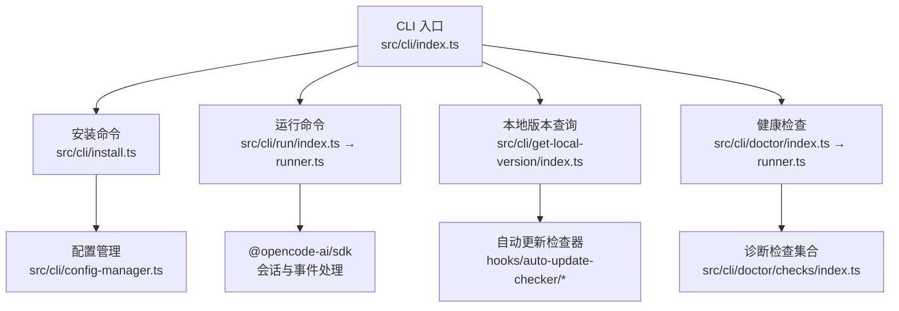
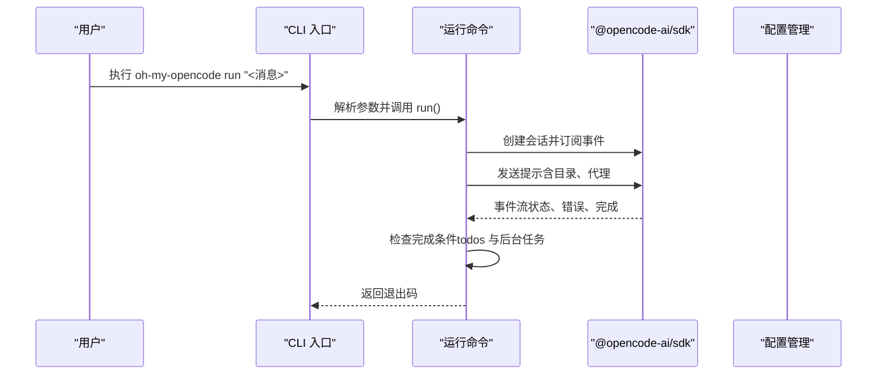
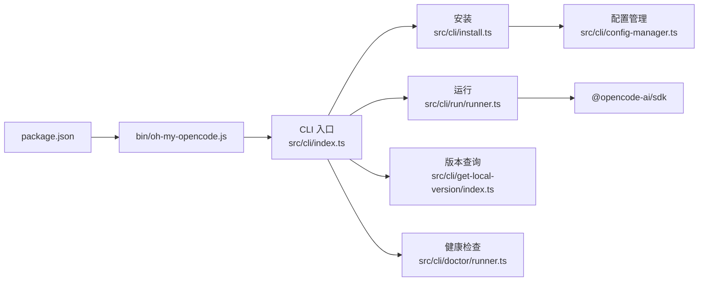

# CLI 命令参考

<cite>
**本文引用的文件**
- [src/cli/index.ts](file://src/cli/index.ts)
- [src/cli/install.ts](file://src/cli/install.ts)
- [src/cli/run/index.ts](file://src/cli/run/index.ts)
- [src/cli/run/runner.ts](file://src/cli/run/runner.ts)
- [src/cli/run/types.ts](file://src/cli/run/types.ts)
- [src/cli/get-local-version/index.ts](file://src/cli/get-local-version/index.ts)
- [src/cli/get-local-version/types.ts](file://src/cli/get-local-version/types.ts)
- [src/cli/doctor/index.ts](file://src/cli/doctor/index.ts)
- [src/cli/doctor/runner.ts](file://src/cli/doctor/runner.ts)
- [src/cli/doctor/types.ts](file://src/cli/doctor/types.ts)
- [src/cli/doctor/checks/index.ts](file://src/cli/doctor/checks/index.ts)
- [src/cli/config-manager.ts](file://src/cli/config-manager.ts)
- [src/cli/types.ts](file://src/cli/types.ts)
- [bin/oh-my-opencode.js](file://bin/oh-my-opencode.js)
- [package.json](file://package.json)
</cite>

## 目录
1. [简介](#简介)
2. [项目结构](#项目结构)
3. [核心组件](#核心组件)
4. [架构总览](#架构总览)
5. [详细组件分析](#详细组件分析)
6. [依赖关系分析](#依赖关系分析)
7. [性能与稳定性考量](#性能与稳定性考量)
8. [故障排除指南](#故障排除指南)
9. [结论](#结论)
10. [附录](#附录)

## 简介
本参考文档面向 Oh My OpenCode 的 CLI 用户，系统性说明命令行工具的所有可用命令、参数、使用场景与示例，并提供非交互式安装模式的最佳实践、命令组合技巧与自动化脚本思路，以及故障排除与常见问题解答。

## 项目结构
CLI 入口负责解析命令与参数，分发到各子命令模块；各子命令通过统一的类型定义与配置管理模块协作，最终与 OpenCode 运行时交互。

图表来源
- [src/cli/index.ts](file://src/cli/index.ts#L1-L147)
- [src/cli/install.ts](file://src/cli/install.ts#L1-L463)
- [src/cli/run/index.ts](file://src/cli/run/index.ts#L1-L3)
- [src/cli/run/runner.ts](file://src/cli/run/runner.ts#L1-L122)
- [src/cli/get-local-version/index.ts](file://src/cli/get-local-version/index.ts#L1-L107)
- [src/cli/doctor/index.ts](file://src/cli/doctor/index.ts#L1-L12)
- [src/cli/doctor/runner.ts](file://src/cli/doctor/runner.ts#L1-L133)
- [src/cli/config-manager.ts](file://src/cli/config-manager.ts#L1-L731)
- [src/cli/doctor/checks/index.ts](file://src/cli/doctor/checks/index.ts#L1-L35)

章节来源
- [src/cli/index.ts](file://src/cli/index.ts#L1-L147)

## 核心组件
- CLI 入口与命令注册：集中定义命令、帮助文本、参数与默认行为。
- 子命令实现：安装、运行、本地版本查询、健康检查。
- 配置管理：检测 OpenCode 安装、写入插件与模型配置、生成 oh-my-opencode 配置。
- 类型系统：统一参数与返回值类型，确保强类型约束。

章节来源
- [src/cli/index.ts](file://src/cli/index.ts#L1-L147)
- [src/cli/types.ts](file://src/cli/types.ts#L1-L35)
- [src/cli/config-manager.ts](file://src/cli/config-manager.ts#L1-L731)

## 架构总览
CLI 通过 commander 注册命令，子命令内部调用 SDK 与配置管理模块，完成与 OpenCode 的交互与配置变更。

图表来源
- [src/cli/index.ts](file://src/cli/index.ts#L55-L80)
- [src/cli/run/runner.ts](file://src/cli/run/runner.ts#L10-L122)
- [src/cli/run/types.ts](file://src/cli/run/types.ts#L1-L77)

## 详细组件分析

### 命令：install（安装与配置）
功能概述
- 为 oh-my-opencode 插件在 OpenCode 中进行安装与配置，支持交互式与非交互式两种模式。
- 可选择 Claude、ChatGPT、Gemini、Copilot 等模型提供商，生成对应代理与分类模型配置。

参数与选项
- --no-tui：启用非交互式安装（必须显式提供所有提供商参数）。
- --claude <no|yes|max20>：Claude 订阅类型（标准或 Max20），影响 Librarian 与 Sisyphus 模型选择。
- --chatgpt <no|yes>：是否启用 ChatGPT，影响 Oracle 模型选择。
- --gemini <no|yes>：是否启用 Gemini，将添加认证与提供商配置。
- --copilot <no|yes>：是否启用 Copilot 作为回退。
- --skip-auth：跳过认证提示。

使用场景与示例
- 交互式安装：适用于首次安装或快速配置。
- 非交互式安装：适用于 CI/CD 或自动化部署，需提供完整参数。
- 示例命令参见 CLI 入口中的帮助文本。

非交互式安装最佳实践
- 必须同时提供 --claude、--chatgpt、--gemini、--copilot 四个参数，且取值合法。
- 在容器或受限环境中，建议先确认 OpenCode 已安装并可执行，再执行安装。
- 若启用 Gemini，确保后续执行认证流程以激活相关能力。

章节来源
- [src/cli/index.ts](file://src/cli/index.ts#L22-L53)
- [src/cli/install.ts](file://src/cli/install.ts#L116-L144)
- [src/cli/install.ts](file://src/cli/install.ts#L239-L350)
- [src/cli/config-manager.ts](file://src/cli/config-manager.ts#L222-L280)
- [src/cli/config-manager.ts](file://src/cli/config-manager.ts#L385-L430)
- [src/cli/config-manager.ts](file://src/cli/config-manager.ts#L468-L506)
- [src/cli/config-manager.ts](file://src/cli/config-manager.ts#L610-L647)

### 命令：run（运行与完成保障）
功能概述
- 启动 OpenCode 会话并发送用户消息，等待“待办全部完成”和“后台任务空闲”的完成条件，适合需要强执行保障的任务。

参数与选项
- -a, --agent <name>：指定代理名称，默认使用 Sisyphus。
- -d, --directory <path>：工作目录。
- -t, --timeout <ms>：超时时间（毫秒），0 表示不超时（直到完成）。

使用场景与示例
- 自动化修复、重构等需要持续执行直至完成的任务。
- 长时间任务可通过超时控制避免无限等待。

运行机制要点
- 内部创建会话并订阅事件流，轮询主会话与子会话状态。
- 当主会话出错时提前失败并提示检查待办完成情况。
- 达到完成条件后正常退出。

章节来源
- [src/cli/index.ts](file://src/cli/index.ts#L55-L80)
- [src/cli/run/index.ts](file://src/cli/run/index.ts#L1-L3)
- [src/cli/run/runner.ts](file://src/cli/run/runner.ts#L1-L122)
- [src/cli/run/types.ts](file://src/cli/run/types.ts#L1-L77)

### 命令：get-local-version（本地版本查询）
功能概述
- 查询当前已安装版本、最新版本、是否最新、是否本地开发或被固定版本等信息。
- 支持人类可读输出与 JSON 输出，便于脚本集成。

参数与选项
- -d, --directory <path>：从指定目录读取配置与插件入口。
- --json：以 JSON 格式输出。

典型输出状态
- up-to-date：当前版本等于最新版本。
- outdated：当前版本落后于最新版本。
- local-dev：本地开发模式。
- pinned：插件被固定版本。
- error：查询失败。
- unknown：无法确定状态。

章节来源
- [src/cli/index.ts](file://src/cli/index.ts#L82-L106)
- [src/cli/get-local-version/index.ts](file://src/cli/get-local-version/index.ts#L1-L107)
- [src/cli/get-local-version/types.ts](file://src/cli/get-local-version/types.ts#L1-L15)

### 命令：doctor（健康检查）
功能概述
- 对安装、配置、认证、依赖、工具、更新等类别进行系统性诊断，支持按类别筛选与详细输出。

参数与选项
- --verbose：显示更详细的诊断信息。
- --json：以 JSON 格式输出结果。
- --category <category>：仅运行特定类别检查（installation、configuration、authentication、dependencies、tools、updates）。

诊断流程
- 按固定顺序遍历类别，逐项执行检查。
- 统计通过/失败/警告/跳过数量与总耗时。
- 根据是否有失败决定退出码。

章节来源
- [src/cli/index.ts](file://src/cli/index.ts#L108-L137)
- [src/cli/doctor/index.ts](file://src/cli/doctor/index.ts#L1-L12)
- [src/cli/doctor/runner.ts](file://src/cli/doctor/runner.ts#L1-L133)
- [src/cli/doctor/types.ts](file://src/cli/doctor/types.ts#L1-L114)
- [src/cli/doctor/checks/index.ts](file://src/cli/doctor/checks/index.ts#L1-L35)

### 命令：version（版本信息）
功能概述
- 直接打印当前 CLI 版本号，便于快速核对。

章节来源
- [src/cli/index.ts](file://src/cli/index.ts#L139-L146)

## 依赖关系分析

图表来源
- [package.json](file://package.json#L1-L93)
- [bin/oh-my-opencode.js](file://bin/oh-my-opencode.js#L1-L81)
- [src/cli/index.ts](file://src/cli/index.ts#L1-L147)
- [src/cli/install.ts](file://src/cli/install.ts#L1-L463)
- [src/cli/run/runner.ts](file://src/cli/run/runner.ts#L1-L122)
- [src/cli/get-local-version/index.ts](file://src/cli/get-local-version/index.ts#L1-L107)
- [src/cli/doctor/runner.ts](file://src/cli/doctor/runner.ts#L1-L133)
- [src/cli/config-manager.ts](file://src/cli/config-manager.ts#L1-L731)

章节来源
- [package.json](file://package.json#L1-L93)
- [bin/oh-my-opencode.js](file://bin/oh-my-opencode.js#L1-L81)

## 性能与稳定性考量
- 运行命令的轮询间隔与超时控制：默认轮询周期较短，适合快速反馈；长任务建议设置合理超时，避免资源占用。
- 非交互式安装的参数校验：提前失败可减少无效尝试，提升自动化稳定性。
- 健康检查的分类执行：可按需缩小范围，缩短诊断时间。
- 配置写入与合并：采用深合并策略，避免覆盖已有有效配置。

[本节为通用指导，无需特定文件引用]

## 故障排除指南
常见问题与定位步骤
- OpenCode 未安装或不可执行
  - 现象：安装命令提示未检测到 OpenCode。
  - 处理：先安装 OpenCode 并确保其在 PATH 中可用，再重试安装。
  - 参考：安装流程中对 OpenCode 安装状态的检测与提示。
- 非交互式安装参数缺失或非法
  - 现象：安装失败并列出缺少或非法的参数。
  - 处理：补齐 --claude/--chatgpt/--gemini/--copilot 参数，确保取值合法。
  - 参考：参数校验逻辑与错误输出。
- 认证未配置导致功能受限
  - 现象：启用 Gemini/Claude/ChatGPT 后未进行登录。
  - 处理：根据提示执行认证命令并选择相应提供商。
  - 参考：安装完成后输出的认证提示。
- 健康检查失败
  - 现象：doctor 报告某类检查失败。
  - 处理：查看详细输出与建议，按类别修复（如安装缺失依赖、修正配置格式等）。
  - 参考：doctor 的详细输出与摘要统计。
- 版本状态异常
  - 现象：get-local-version 显示 unknown/error。
  - 处理：检查插件入口与缓存版本，必要时清理缓存后重试。
  - 参考：版本查询逻辑与错误兜底。

章节来源
- [src/cli/install.ts](file://src/cli/install.ts#L239-L350)
- [src/cli/config-manager.ts](file://src/cli/config-manager.ts#L458-L466)
- [src/cli/doctor/runner.ts](file://src/cli/doctor/runner.ts#L83-L133)
- [src/cli/get-local-version/index.ts](file://src/cli/get-local-version/index.ts#L5-L107)

## 结论
Oh My OpenCode CLI 提供了从安装配置、运行执行到健康检查与版本查询的完整工具链。通过非交互式安装与 doctor 检查，可在自动化与生产环境中稳定落地；结合 run 命令的完成保障机制，可满足复杂开发任务的持续执行需求。

[本节为总结，无需特定文件引用]

## 附录

### 命令与参数速查表
- install
  - --no-tui：禁用 TUI，启用非交互式安装
  - --claude：<no|yes|max20>
  - --chatgpt：<no|yes>
  - --gemini：<no|yes>
  - --copilot：<no|yes>
  - --skip-auth：跳过认证提示
- run
  - -a, --agent：<name>
  - -d, --directory：<path>
  - -t, --timeout：<ms>
- get-local-version
  - -d, --directory：<path>
  - --json：JSON 输出
- doctor
  - --verbose：详细输出
  - --json：JSON 输出
  - --category：<category>
- version
  - 无参数，仅输出版本号

### 高级用法与自动化脚本示例（概念性）
- 非交互式安装模板
  - 使用 --no-tui + 固定参数，配合 CI 环境变量注入提供商开关。
- 健康检查流水线
  - 在构建前执行 doctor --category=installation,configuration,dependencies,tools,updates，失败即阻断。
- 版本监控
  - 定期执行 get-local-version --json，解析状态并触发升级流程。
- 组合使用
  - doctor -> install（根据诊断结果调整参数）-> run（执行任务）-> get-local-version（验证升级）。

[本节为概念性内容，无需特定文件引用]