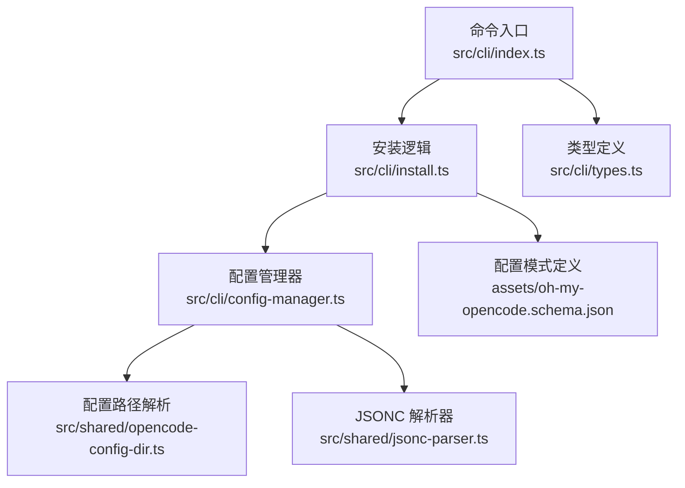
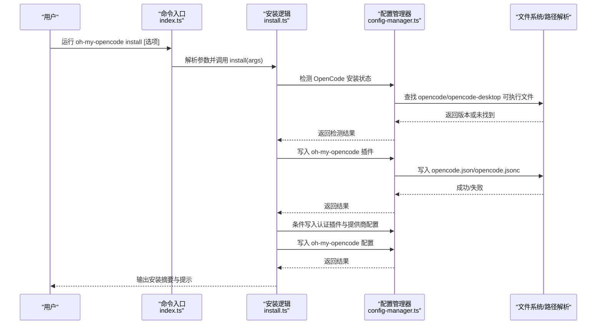
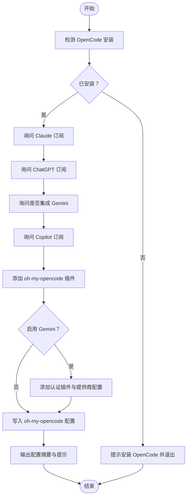
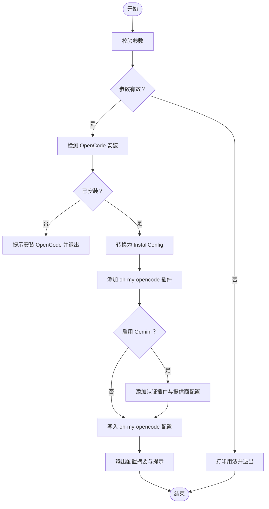
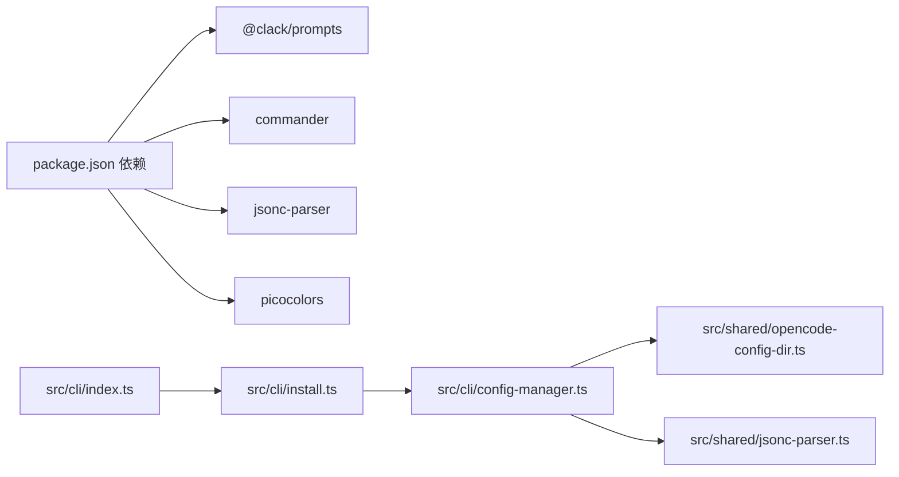

# 安装命令

<cite>
**本文引用的文件**
- [src/cli/install.ts](file://src/cli/install.ts)
- [src/cli/index.ts](file://src/cli/index.ts)
- [src/cli/types.ts](file://src/cli/types.ts)
- [src/cli/config-manager.ts](file://src/cli/config-manager.ts)
- [src/shared/opencode-config-dir.ts](file://src/shared/opencode-config-dir.ts)
- [src/shared/jsonc-parser.ts](file://src/shared/jsonc-parser.ts)
- [package.json](file://package.json)
- [assets/oh-my-opencode.schema.json](file://assets/oh-my-opencode.schema.json)
- [README.md](file://README.md)
</cite>

## 目录
1. [简介](#简介)
2. [项目结构](#项目结构)
3. [核心组件](#核心组件)
4. [架构总览](#架构总览)
5. [详细组件分析](#详细组件分析)
6. [依赖关系分析](#依赖关系分析)
7. [性能与可靠性](#性能与可靠性)
8. [故障排查指南](#故障排查指南)
9. [结论](#结论)
10. [附录：使用示例与最佳实践](#附录使用示例与最佳实践)

## 简介
本文件为 oh-my-opencode 的 install 命令提供权威参考文档。内容涵盖：
- 功能概述与交互式安装流程
- 非交互式安装模式（--no-tui）与参数校验
- 所有可用选项参数说明（--claude、--chatgpt、--gemini、--copilot、--skip-auth）
- 不同模型提供商的配置策略与最佳实践
- 安装过程中的验证步骤与错误处理机制
- 自动化部署场景下的使用示例与配置模板

## 项目结构
install 命令位于 CLI 层，通过命令行解析器注册，并委托给安装逻辑模块执行。其核心职责是：
- 解析用户输入参数
- 检测当前 OpenCode 安装状态
- 写入 oh-my-opencode 插件配置
- 可选地添加认证插件与提供商配置
- 输出安装摘要与后续指引

图表来源
- [src/cli/index.ts](file://src/cli/index.ts#L22-L53)
- [src/cli/install.ts](file://src/cli/install.ts#L352-L462)
- [src/cli/config-manager.ts](file://src/cli/config-manager.ts#L1-L731)
- [src/shared/opencode-config-dir.ts](file://src/shared/opencode-config-dir.ts#L101-L111)
- [src/shared/jsonc-parser.ts](file://src/shared/jsonc-parser.ts#L9-L24)
- [assets/oh-my-opencode.schema.json](file://assets/oh-my-opencode.schema.json#L1-L100)
- [src/cli/types.ts](file://src/cli/types.ts#L1-L35)

章节来源
- [src/cli/index.ts](file://src/cli/index.ts#L1-L147)
- [src/cli/install.ts](file://src/cli/install.ts#L1-L463)
- [src/cli/config-manager.ts](file://src/cli/config-manager.ts#L1-L731)
- [src/shared/opencode-config-dir.ts](file://src/shared/opencode-config-dir.ts#L1-L143)
- [src/shared/jsonc-parser.ts](file://src/shared/jsonc-parser.ts#L1-L66)
- [assets/oh-my-opencode.schema.json](file://assets/oh-my-opencode.schema.json#L1-L800)
- [src/cli/types.ts](file://src/cli/types.ts#L1-L35)

## 核心组件
- 命令注册与参数解析：在命令入口中注册 install 子命令，定义各选项及其帮助信息。
- 安装主流程：根据是否启用 TUI（--no-tui）选择交互或非交互模式；进行参数校验、OpenCode 安装检测、写入配置等步骤。
- 配置管理：负责 OpenCode 主配置与 oh-my-opencode 配置的读取、合并与写入；支持 JSON 与 JSONC 格式；自动识别配置目录与文件。
- 类型系统：统一安装参数与配置的数据结构，确保强类型约束。

章节来源
- [src/cli/index.ts](file://src/cli/index.ts#L22-L53)
- [src/cli/install.ts](file://src/cli/install.ts#L116-L350)
- [src/cli/config-manager.ts](file://src/cli/config-manager.ts#L159-L430)
- [src/cli/types.ts](file://src/cli/types.ts#L1-L35)

## 架构总览
安装命令的执行流从 CLI 入口开始，经过参数解析与校验，进入安装主流程。安装主流程会检测 OpenCode 是否已安装，随后按顺序执行以下步骤：
- 添加 oh-my-opencode 插件到 OpenCode 配置
- 若启用 Gemini，则添加认证插件与提供商配置
- 写入 oh-my-opencode 配置（含 agents、categories 等）
- 输出配置摘要与后续提示

图表来源
- [src/cli/index.ts](file://src/cli/index.ts#L42-L53)
- [src/cli/install.ts](file://src/cli/install.ts#L239-L350)
- [src/cli/config-manager.ts](file://src/cli/config-manager.ts#L222-L430)

## 详细组件分析

### 命令注册与参数定义
- 子命令：install
- 描述：以交互方式安装并配置 oh-my-opencode
- 选项：
  - --no-tui：非交互模式（需显式提供所有参数）
  - --claude <no|yes|max20>：Claude 订阅状态（标准/最大版/无）
  - --chatgpt <no|yes>：ChatGPT 订阅状态
  - --gemini <no|yes>：是否集成 Google Gemini
  - --copilot <no|yes>：GitHub Copilot 订阅状态
  - --skip-auth：跳过认证提示
- 示例与模型提供商说明随命令帮助输出

章节来源
- [src/cli/index.ts](file://src/cli/index.ts#L22-L53)

### 参数类型与数据结构
- InstallArgs：安装参数接口，包含 tui、claude、chatgpt、gemini、copilot、skipAuth
- InstallConfig：内部安装配置对象，布尔标志位表示各提供商启用情况
- DetectedConfig：检测到的当前配置，用于初始化交互式安装的默认值

章节来源
- [src/cli/types.ts](file://src/cli/types.ts#L1-L35)

### 交互式安装流程（TUI）
- 步骤：
  1) 检测 OpenCode 安装与版本
  2) 询问 Claude 订阅（no/yes/max20）
  3) 询问 ChatGPT 订阅（no/yes）
  4) 询问是否集成 Gemini（no/yes）
  5) 询问 Copilot 订阅（no/yes）
  6) 写入 oh-my-opencode 插件
  7) 若启用 Gemini：写入认证插件与提供商配置
  8) 写入 oh-my-opencode 配置
  9) 输出配置摘要与后续提示

图表来源
- [src/cli/install.ts](file://src/cli/install.ts#L170-L237)
- [src/cli/install.ts](file://src/cli/install.ts#L352-L462)

章节来源
- [src/cli/install.ts](file://src/cli/install.ts#L170-L237)
- [src/cli/install.ts](file://src/cli/install.ts#L352-L462)

### 非交互式安装流程（--no-tui）
- 参数校验：必须提供 --claude、--chatgpt、--gemini、--copilot 的有效值
- 流程：
  1) 检测 OpenCode 安装与版本
  2) 将参数转换为 InstallConfig
  3) 添加 oh-my-opencode 插件
  4) 若启用 Gemini：添加认证插件与提供商配置
  5) 写入 oh-my-opencode 配置
  6) 输出配置摘要与后续提示（可选跳过认证）

图表来源
- [src/cli/install.ts](file://src/cli/install.ts#L116-L144)
- [src/cli/install.ts](file://src/cli/install.ts#L239-L350)

章节来源
- [src/cli/install.ts](file://src/cli/install.ts#L116-L144)
- [src/cli/install.ts](file://src/cli/install.ts#L239-L350)

### 配置管理与写入
- OpenCode 配置写入：
  - 自动创建配置目录
  - 检测现有配置格式（优先 JSONC）
  - 合并插件列表，避免重复
  - 支持空文件与空白内容的容错处理
- oh-my-opencode 配置生成：
  - 依据安装配置生成 agents 与 categories 的模型映射
  - 使用 JSONC 解析器安全读取与合并现有配置
  - 写入 schema 引用与配置文件
- 配置路径解析：
  - 支持环境变量覆盖配置目录
  - 跨平台（Windows/macOS/Linux）路径解析
  - 兼容桌面端与 CLI 版本的配置目录差异

章节来源
- [src/cli/config-manager.ts](file://src/cli/config-manager.ts#L222-L430)
- [src/shared/opencode-config-dir.ts](file://src/shared/opencode-config-dir.ts#L78-L111)
- [src/shared/jsonc-parser.ts](file://src/shared/jsonc-parser.ts#L9-L24)

### 错误处理与验证
- 参数校验：对 --claude、--chatgpt、--gemini、--copilot 的取值进行严格校验
- 文件系统错误：权限不足、文件不存在、磁盘空间不足、只读文件系统等
- JSON/JSONC 解析错误：语法错误、空文件、空白内容、格式不合法
- 超时控制：bun install 超时处理
- 用户取消：交互式安装中用户取消时优雅退出

章节来源
- [src/cli/install.ts](file://src/cli/install.ts#L116-L144)
- [src/cli/config-manager.ts](file://src/cli/config-manager.ts#L64-L98)
- [src/cli/config-manager.ts](file://src/cli/config-manager.ts#L519-L564)

## 依赖关系分析
- 外部依赖：
  - @clack/prompts：交互式 TUI
  - commander：命令行参数解析
  - jsonc-parser：JSONC 解析
  - picocolors：终端彩色输出
- 内部模块：
  - shared：配置路径解析与 JSONC 解析
  - cli：安装逻辑与配置管理

图表来源
- [package.json](file://package.json#L56-L71)
- [src/cli/index.ts](file://src/cli/index.ts#L1-L14)
- [src/cli/install.ts](file://src/cli/install.ts#L1-L15)
- [src/cli/config-manager.ts](file://src/cli/config-manager.ts#L1-L8)
- [src/shared/opencode-config-dir.ts](file://src/shared/opencode-config-dir.ts#L1-L7)
- [src/shared/jsonc-parser.ts](file://src/shared/jsonc-parser.ts#L1-L2)

章节来源
- [package.json](file://package.json#L56-L71)
- [src/cli/index.ts](file://src/cli/index.ts#L1-L14)
- [src/cli/install.ts](file://src/cli/install.ts#L1-L15)
- [src/cli/config-manager.ts](file://src/cli/config-manager.ts#L1-L8)
- [src/shared/opencode-config-dir.ts](file://src/shared/opencode-config-dir.ts#L1-L7)
- [src/shared/jsonc-parser.ts](file://src/shared/jsonc-parser.ts#L1-L2)

## 性能与可靠性
- 安装流程采用分步执行与进度提示，便于在 CI 环境中观察状态
- 非交互模式下参数一次性校验，减少无效重试
- 配置写入使用 JSONC 解析器，支持注释与尾随逗号，提升可维护性
- 超时控制与错误分类，便于在受限环境中快速定位问题

[本节为通用指导，无需特定文件来源]

## 故障排查指南
- OpenCode 未安装
  - 现象：安装失败并提示先安装 OpenCode
  - 处理：按照官方文档安装 OpenCode 后重试
- 参数无效
  - 现象：打印参数校验错误并退出
  - 处理：检查 --claude/--chatgpt/--gemini/--copilot 的取值是否为允许值
- 权限不足
  - 现象：写入配置失败，提示权限不足
  - 处理：以管理员权限运行或调整配置目录权限
- 磁盘空间不足
  - 现象：写入失败，提示磁盘空间不足
  - 处理：清理磁盘空间后重试
- 只读文件系统
  - 现象：无法写入配置
  - 处理：检查挂载选项或切换到可写目录
- JSON/JSONC 解析错误
  - 现象：配置文件损坏或格式不合法
  - 处理：修复或删除配置文件后重试
- bun install 超时
  - 现象：bun 安装超时
  - 处理：手动执行安装或检查网络与资源限制

章节来源
- [src/cli/install.ts](file://src/cli/install.ts#L240-L251)
- [src/cli/config-manager.ts](file://src/cli/config-manager.ts#L64-L98)
- [src/cli/config-manager.ts](file://src/cli/config-manager.ts#L519-L564)

## 结论
install 命令提供了两种安装模式：交互式与非交互式，兼顾易用性与自动化需求。通过严格的参数校验、健壮的错误处理与跨平台配置管理，能够在多种环境下稳定完成 oh-my-opencode 的安装与配置。建议在自动化部署中优先使用非交互模式，并结合环境变量与配置模板，确保一致性与可重复性。

[本节为总结性内容，无需特定文件来源]

## 附录：使用示例与最佳实践

### 选项参数详解
- --no-tui
  - 作用：禁用交互式 TUI，强制非交互模式
  - 使用场景：CI/CD、脚本自动化
- --claude <no|yes|max20>
  - 作用：指定 Claude 订阅状态
  - 最佳实践：max20 模式可获得更强的 Librarian 模型能力；若无订阅，使用免费回退模型
- --chatgpt <no|yes>
  - 作用：指定 ChatGPT 订阅状态
  - 最佳实践：启用以获得更强大的调试与架构能力
- --gemini <no|yes>
  - 作用：是否集成 Google Gemini
  - 最佳实践：启用以使用前端与多模态能力；需要认证插件与提供商配置
- --copilot <no|yes>
  - 作用：指定 GitHub Copilot 订阅状态
  - 最佳实践：作为备用提供商，在其他提供商不可用时使用
- --skip-auth
  - 作用：跳过认证提示
  - 使用场景：自动化部署或已提前完成认证

章节来源
- [src/cli/index.ts](file://src/cli/index.ts#L25-L30)
- [src/cli/install.ts](file://src/cli/install.ts#L116-L144)

### 非交互式安装示例
- 仅 Copilot：适用于无 Claude/ChatGPT/Gemini 订阅但希望使用 Copilot 作为回退
- Claude Max20 + ChatGPT + Gemini：充分利用各提供商优势
- 仅 Claude：最小化配置，适合轻量使用

章节来源
- [src/cli/index.ts](file://src/cli/index.ts#L31-L36)

### 自动化部署最佳实践
- 在 CI 中使用非交互模式，显式传入所有参数
- 使用环境变量覆盖配置目录（OPENCODE_CONFIG_DIR），确保可移植性
- 提前准备认证凭据，避免交互式等待
- 对于 Gemini，确保认证插件与提供商配置正确写入

章节来源
- [src/shared/opencode-config-dir.ts](file://src/shared/opencode-config-dir.ts#L50-L76)
- [src/cli/config-manager.ts](file://src/cli/config-manager.ts#L468-L506)

### 配置文件模板（oh-my-opencode.json）
- schema 引用：指向仓库中的 schema
- agents：按需覆盖模型名称与参数
- categories：按需覆盖模型名称与参数
- 注意：JSONC 支持注释与尾随逗号，便于维护

章节来源
- [assets/oh-my-opencode.schema.json](file://assets/oh-my-opencode.schema.json#L1-L100)
- [src/cli/config-manager.ts](file://src/cli/config-manager.ts#L385-L430)
- [src/shared/jsonc-parser.ts](file://src/shared/jsonc-parser.ts#L9-L24)

### 模型提供商配置与映射
- Claude：Sisyphus 使用 Claude Opus 4.5；Librarian 在 max20 模式下使用更强模型
- ChatGPT：Oracle 使用 GPT-5.2；无订阅时回退到 Claude 或 Copilot
- Gemini：前端与文档类任务使用 Gemini 3 Pro High；需要认证插件与提供商配置
- Copilot：作为回退提供商，映射到相应模型命名空间

章节来源
- [src/cli/install.ts](file://src/cli/install.ts#L53-L61)
- [src/cli/config-manager.ts](file://src/cli/config-manager.ts#L309-L383)
- [src/cli/config-manager.ts](file://src/cli/config-manager.ts#L580-L606)