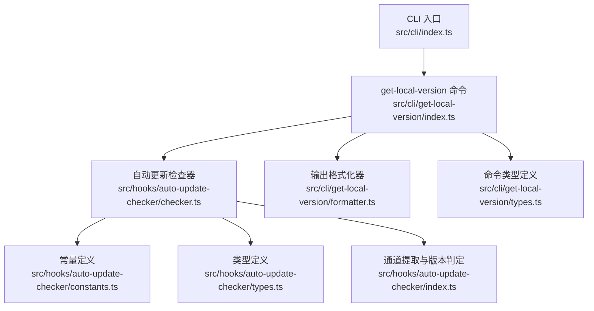
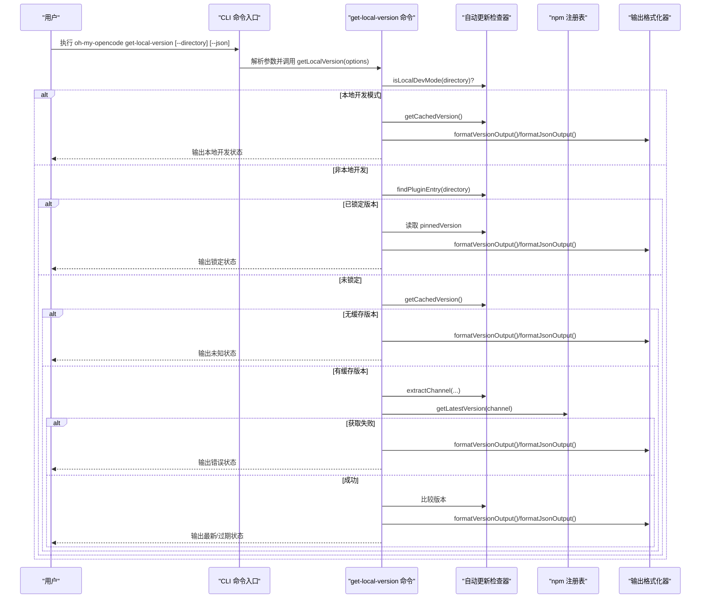
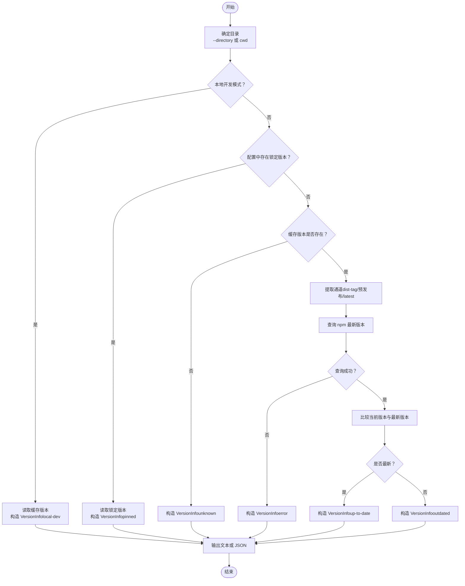
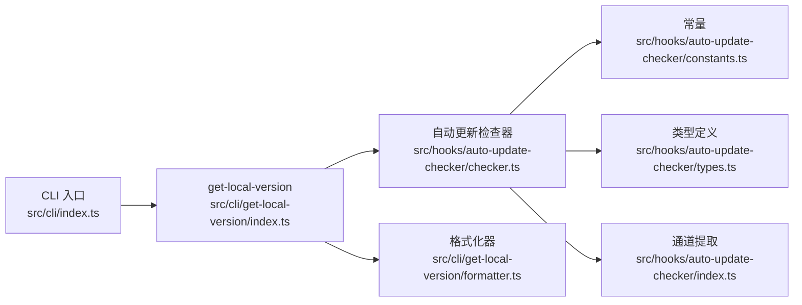

# 版本管理命令

<cite>
**本文引用的文件**
- [src/cli/get-local-version/index.ts](file://src/cli/get-local-version/index.ts)
- [src/cli/get-local-version/formatter.ts](file://src/cli/get-local-version/formatter.ts)
- [src/cli/get-local-version/types.ts](file://src/cli/get-local-version/types.ts)
- [src/hooks/auto-update-checker/checker.ts](file://src/hooks/auto-update-checker/checker.ts)
- [src/hooks/auto-update-checker/index.ts](file://src/hooks/auto-update-checker/index.ts)
- [src/hooks/auto-update-checker/constants.ts](file://src/hooks/auto-update-checker/constants.ts)
- [src/hooks/auto-update-checker/types.ts](file://src/hooks/auto-update-checker/types.ts)
- [src/cli/index.ts](file://src/cli/index.ts)
- [package.json](file://package.json)
</cite>

## 目录
1. [简介](#简介)
2. [项目结构](#项目结构)
3. [核心组件](#核心组件)
4. [架构总览](#架构总览)
5. [详细组件分析](#详细组件分析)
6. [依赖关系分析](#依赖关系分析)
7. [性能与可靠性](#性能与可靠性)
8. [故障排查指南](#故障排查指南)
9. [结论](#结论)
10. [附录：自动化集成方案](#附录自动化集成方案)

## 简介
本文档面向 oh-my-opencode 的版本管理命令，聚焦 get-local-version 子命令，系统性说明其功能、参数、输出格式以及内部实现逻辑。内容涵盖：
- 当前版本显示、最新版本检查与更新状态判断
- 选项 --directory 与 --json 的使用场景与输出差异
- 版本信息的数据结构与解析策略
- 版本锁定（pinned）、本地开发模式与特殊版本标识（预发布、dist-tag）的识别与处理
- 自动化版本管理与更新通知的集成建议

## 项目结构
get-local-version 命令位于 CLI 层，通过子模块调用自动更新检查器与格式化器完成版本信息展示与输出。

图表来源
- [src/cli/index.ts](file://src/cli/index.ts#L82-L106)
- [src/cli/get-local-version/index.ts](file://src/cli/get-local-version/index.ts#L1-L107)
- [src/hooks/auto-update-checker/checker.ts](file://src/hooks/auto-update-checker/checker.ts#L1-L285)
- [src/hooks/auto-update-checker/constants.ts](file://src/hooks/auto-update-checker/constants.ts#L1-L65)
- [src/hooks/auto-update-checker/types.ts](file://src/hooks/auto-update-checker/types.ts#L1-L30)
- [src/hooks/auto-update-checker/index.ts](file://src/hooks/auto-update-checker/index.ts#L1-L261)
- [src/cli/get-local-version/types.ts](file://src/cli/get-local-version/types.ts#L1-L15)

章节来源
- [src/cli/index.ts](file://src/cli/index.ts#L82-L106)
- [src/cli/get-local-version/index.ts](file://src/cli/get-local-version/index.ts#L1-L107)

## 核心组件
- get-local-version 命令入口：负责解析参数、调用检查器、格式化输出，并返回合适的退出码。
- 自动更新检查器：负责检测本地开发模式、解析配置中的插件条目、读取缓存版本、查询 npm 最新版本、提取通道（channel）等。
- 输出格式化器：提供人类可读文本与 JSON 两种输出格式。
- 类型定义：统一 VersionInfo 与 GetLocalVersionOptions 的数据契约。

章节来源
- [src/cli/get-local-version/index.ts](file://src/cli/get-local-version/index.ts#L5-L104)
- [src/cli/get-local-version/formatter.ts](file://src/cli/get-local-version/formatter.ts#L14-L66)
- [src/cli/get-local-version/types.ts](file://src/cli/get-local-version/types.ts#L1-L15)
- [src/hooks/auto-update-checker/checker.ts](file://src/hooks/auto-update-checker/checker.ts#L18-L174)
- [src/hooks/auto-update-checker/index.ts](file://src/hooks/auto-update-checker/index.ts#L26-L44)

## 架构总览
get-local-version 的执行路径如下：

图表来源
- [src/cli/index.ts](file://src/cli/index.ts#L82-L106)
- [src/cli/get-local-version/index.ts](file://src/cli/get-local-version/index.ts#L5-L104)
- [src/hooks/auto-update-checker/checker.ts](file://src/hooks/auto-update-checker/checker.ts#L18-L253)
- [src/hooks/auto-update-checker/index.ts](file://src/hooks/auto-update-checker/index.ts#L26-L44)
- [src/cli/get-local-version/formatter.ts](file://src/cli/get-local-version/formatter.ts#L14-L66)

## 详细组件分析

### get-local-version 命令
- 功能概述
  - 显示当前已安装版本
  - 查询 npm 上对应通道的最新版本
  - 判断是否需要更新
  - 识别本地开发模式与版本锁定状态
- 参数
  - --directory：指定工作目录，用于定位配置文件与插件条目
  - --json：以 JSON 格式输出，便于脚本解析
- 退出码
  - 0：成功输出（含 up-to-date/outdated/local-dev/pinned/error/unknown）
  - 1：发生异常或无法获取版本信息时输出 error 状态
- 输出格式
  - 人类可读文本：带彩色符号与提示信息
  - JSON：标准 VersionInfo 结构

章节来源
- [src/cli/index.ts](file://src/cli/index.ts#L82-L106)
- [src/cli/get-local-version/index.ts](file://src/cli/get-local-version/index.ts#L5-L104)
- [src/cli/get-local-version/formatter.ts](file://src/cli/get-local-version/formatter.ts#L14-L66)
- [src/cli/get-local-version/types.ts](file://src/cli/get-local-version/types.ts#L11-L14)

### 自动更新检查器
- 本地开发模式检测
  - 通过扫描配置文件（支持 .json 与 .jsonc），查找以 file:// 协议指向本包的条目，从而判断是否处于本地开发模式
- 插件条目解析
  - 支持两种形式：包名或 包名@版本
  - 若为 包名@版本，则进一步区分是否锁定（非 latest）
- 缓存版本读取
  - 优先从缓存目录的 package.json 中读取
  - 失败时回退到当前目录向上查找 package.json
- 通道提取与最新版本查询
  - 通道规则：dist-tag（如 alpha、beta、rc、canary、next）优先；否则预发布版本按预发布标识推断；否则默认 latest
  - 通过 npm 注册表接口查询对应通道的最新版本
- 错误处理
  - 网络超时/失败、配置解析异常、找不到版本等均视为 error 状态

章节来源
- [src/hooks/auto-update-checker/checker.ts](file://src/hooks/auto-update-checker/checker.ts#L18-L174)
- [src/hooks/auto-update-checker/checker.ts](file://src/hooks/auto-update-checker/checker.ts#L234-L253)
- [src/hooks/auto-update-checker/index.ts](file://src/hooks/auto-update-checker/index.ts#L26-L44)
- [src/hooks/auto-update-checker/constants.ts](file://src/hooks/auto-update-checker/constants.ts#L5-L28)

### 输出格式化器
- 人类可读文本
  - 包含当前版本、最新版本（非本地开发时）、状态提示与操作建议
  - 使用彩色符号区分不同状态（更新可用、本地开发、锁定、错误、未知）
- JSON 输出
  - 输出完整的 VersionInfo 对象，字段包含当前版本、最新版本、是否最新、是否本地开发、是否锁定、锁定版本、状态

章节来源
- [src/cli/get-local-version/formatter.ts](file://src/cli/get-local-version/formatter.ts#L14-L66)
- [src/cli/get-local-version/types.ts](file://src/cli/get-local-version/types.ts#L1-L9)

### 数据模型与解析流程

#### VersionInfo 字段说明
- currentVersion：当前已安装版本（可能为空）
- latestVersion：最新版本（可能为空）
- isUpToDate：是否已是最新
- isLocalDev：是否处于本地开发模式
- isPinned：是否锁定版本
- pinnedVersion：锁定的具体版本号（若未锁定则为空）
- status：状态枚举，取值范围包括 up-to-date、outdated、local-dev、pinned、error、unknown

章节来源
- [src/cli/get-local-version/types.ts](file://src/cli/get-local-version/types.ts#L1-L9)

#### 版本解析与比较
- 通道提取
  - dist-tag：直接作为通道名
  - 预发布版本：从预发布标识中提取通道（如 alpha、beta、rc、canary、next）
  - 默认：latest
- 版本比较
  - 通过解析主次补丁号进行逐位比较，兼容不同长度版本号
- 特殊版本标识
  - 预发布版本（如 3.0.0-beta.1）：通道由预发布标识决定
  - dist-tag（如 alpha、beta、rc、canary、next）：直接使用该标签查询最新版本

章节来源
- [src/hooks/auto-update-checker/index.ts](file://src/hooks/auto-update-checker/index.ts#L26-L44)

#### 流程图：get-local-version 决策逻辑

图表来源
- [src/cli/get-local-version/index.ts](file://src/cli/get-local-version/index.ts#L5-L104)
- [src/hooks/auto-update-checker/checker.ts](file://src/hooks/auto-update-checker/checker.ts#L18-L174)
- [src/hooks/auto-update-checker/index.ts](file://src/hooks/auto-update-checker/index.ts#L26-L44)

## 依赖关系分析
- CLI 命令依赖自动更新检查器与格式化器
- 自动更新检查器依赖常量定义与类型定义
- 通道提取与版本判定在独立模块中复用
- 命令层不直接访问 npm，而是通过检查器封装的异步函数进行查询

图表来源
- [src/cli/index.ts](file://src/cli/index.ts#L82-L106)
- [src/cli/get-local-version/index.ts](file://src/cli/get-local-version/index.ts#L1-L3)
- [src/hooks/auto-update-checker/checker.ts](file://src/hooks/auto-update-checker/checker.ts#L1-L14)
- [src/hooks/auto-update-checker/index.ts](file://src/hooks/auto-update-checker/index.ts#L1-L8)
- [src/hooks/auto-update-checker/constants.ts](file://src/hooks/auto-update-checker/constants.ts#L1-L65)
- [src/hooks/auto-update-checker/types.ts](file://src/hooks/auto-update-checker/types.ts#L1-L30)

章节来源
- [src/cli/index.ts](file://src/cli/index.ts#L82-L106)
- [src/cli/get-local-version/index.ts](file://src/cli/get-local-version/index.ts#L1-L3)
- [src/hooks/auto-update-checker/checker.ts](file://src/hooks/auto-update-checker/checker.ts#L1-L14)

## 性能与可靠性
- 网络请求超时控制：检查器对 npm 请求设置超时，避免阻塞
- 缓存命中优先：优先从缓存目录读取版本，减少 IO 与网络开销
- 通道选择优化：根据 dist-tag 或预发布标识快速定位正确通道，减少无效查询
- 异常兜底：任何异常均输出 error 状态并返回非零退出码，便于脚本处理

章节来源
- [src/hooks/auto-update-checker/checker.ts](file://src/hooks/auto-update-checker/checker.ts#L234-L253)
- [src/hooks/auto-update-checker/checker.ts](file://src/hooks/auto-update-checker/checker.ts#L152-L174)
- [src/hooks/auto-update-checker/index.ts](file://src/hooks/auto-update-checker/index.ts#L26-L44)

## 故障排查指南
- 无法获取版本信息
  - 可能原因：缓存目录不存在、package.json 读取失败、网络不可达
  - 排查步骤：确认缓存目录存在且可读；检查网络连通性；尝试使用 --directory 指定正确的项目根目录
- 无法连接 npm 注册表
  - 可能原因：网络超时、代理限制、注册表不可用
  - 排查步骤：调整超时时间或代理；切换网络环境；查看 error 状态输出
- 配置文件解析失败
  - 可能原因：配置文件格式错误（JSON/JSONC 注释）、权限不足
  - 排查步骤：使用 doctor 命令检查配置健康状况；修复注释与格式问题；确保文件权限正确
- 本地开发模式误判
  - 可能原因：配置文件中未正确使用 file:// 协议指向本包
  - 排查步骤：核对配置文件中的插件条目；确保路径正确

章节来源
- [src/cli/get-local-version/index.ts](file://src/cli/get-local-version/index.ts#L90-L103)
- [src/hooks/auto-update-checker/checker.ts](file://src/hooks/auto-update-checker/checker.ts#L18-L80)
- [src/hooks/auto-update-checker/checker.ts](file://src/hooks/auto-update-checker/checker.ts#L234-L253)

## 结论
get-local-version 命令通过清晰的状态机与稳健的错误处理，为用户提供可靠的版本信息与更新状态。结合 --directory 与 --json 选项，既能满足交互式使用，也能无缝接入自动化流水线。版本锁定、本地开发模式与特殊版本标识的识别机制，使得命令在复杂场景下仍保持一致的行为与输出。

## 附录：自动化集成方案
- 在 CI/CD 中定期运行 get-local-version --json，解析 JSON 输出中的 status、currentVersion、latestVersion 字段，触发升级或告警
- 将 --directory 指向项目根目录，确保在多包仓库中正确识别配置与锁定版本
- 结合 dist-tag 与预发布标识，针对 alpha/beta/rc 等通道定制不同的升级策略
- 在本地开发场景下，命令会直接输出 local-dev 状态，避免不必要的网络请求与误报

章节来源
- [src/cli/get-local-version/index.ts](file://src/cli/get-local-version/index.ts#L5-L104)
- [src/hooks/auto-update-checker/index.ts](file://src/hooks/auto-update-checker/index.ts#L26-L44)
- [src/hooks/auto-update-checker/checker.ts](file://src/hooks/auto-update-checker/checker.ts#L126-L150)