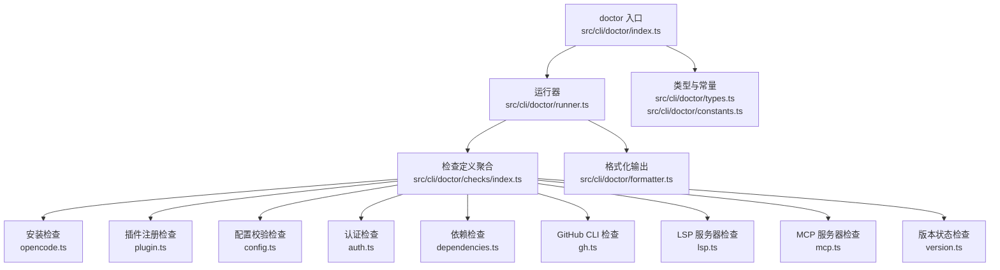
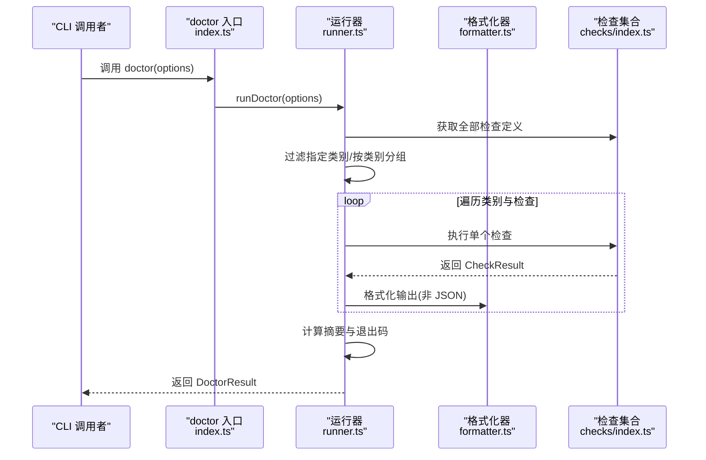
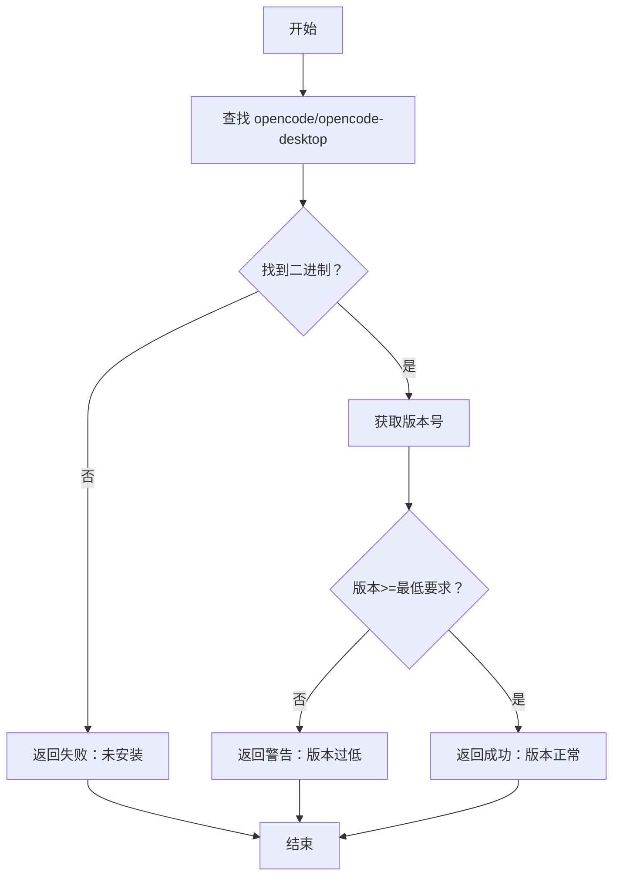
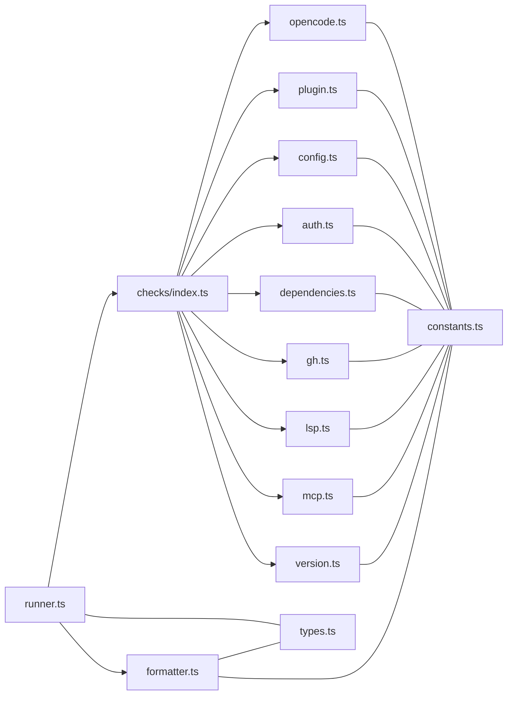

# 诊断命令

<cite>
**本文引用的文件**
- [src/cli/doctor/index.ts](file://src/cli/doctor/index.ts)
- [src/cli/doctor/types.ts](file://src/cli/doctor/types.ts)
- [src/cli/doctor/constants.ts](file://src/cli/doctor/constants.ts)
- [src/cli/doctor/formatter.ts](file://src/cli/doctor/formatter.ts)
- [src/cli/doctor/runner.ts](file://src/cli/doctor/runner.ts)
- [src/cli/doctor/checks/index.ts](file://src/cli/doctor/checks/index.ts)
- [src/cli/doctor/checks/opencode.ts](file://src/cli/doctor/checks/opencode.ts)
- [src/cli/doctor/checks/plugin.ts](file://src/cli/doctor/checks/plugin.ts)
- [src/cli/doctor/checks/config.ts](file://src/cli/doctor/checks/config.ts)
- [src/cli/doctor/checks/auth.ts](file://src/cli/doctor/checks/auth.ts)
- [src/cli/doctor/checks/dependencies.ts](file://src/cli/doctor/checks/dependencies.ts)
- [src/cli/doctor/checks/gh.ts](file://src/cli/doctor/checks/gh.ts)
- [src/cli/doctor/checks/lsp.ts](file://src/cli/doctor/checks/lsp.ts)
- [src/cli/doctor/checks/mcp.ts](file://src/cli/doctor/checks/mcp.ts)
- [src/cli/doctor/checks/version.ts](file://src/cli/doctor/checks/version.ts)
</cite>

## 目录
1. [简介](#简介)
2. [项目结构](#项目结构)
3. [核心组件](#核心组件)
4. [架构总览](#架构总览)
5. [详细组件分析](#详细组件分析)
6. [依赖关系分析](#依赖关系分析)
7. [性能与可扩展性](#性能与可扩展性)
8. [故障排查指南](#故障排查指南)
9. [结论](#结论)
10. [附录：CLI 使用与输出格式](#附录cli-使用与输出格式)

## 简介
oh-my-opencode 的 doctor 命令用于对当前环境进行系统化健康检查，覆盖安装、配置、认证、依赖、工具与更新等维度，帮助用户快速定位问题并给出修复建议。它支持三种输出模式：彩色终端（默认）、详细模式（--verbose）以及结构化 JSON（--json），并可通过 --category 指定仅运行某类检查。

## 项目结构
doctor 子系统由“入口函数”、“运行器”、“检查定义与实现”、“格式化输出”、“常量与类型”组成，采用模块化设计，便于扩展新的检查项。

图表来源
- [src/cli/doctor/index.ts](file://src/cli/doctor/index.ts#L1-L12)
- [src/cli/doctor/runner.ts](file://src/cli/doctor/runner.ts#L1-L133)
- [src/cli/doctor/checks/index.ts](file://src/cli/doctor/checks/index.ts#L1-L35)
- [src/cli/doctor/formatter.ts](file://src/cli/doctor/formatter.ts#L1-L141)
- [src/cli/doctor/types.ts](file://src/cli/doctor/types.ts#L1-L114)
- [src/cli/doctor/constants.ts](file://src/cli/doctor/constants.ts#L1-L73)

章节来源
- [src/cli/doctor/index.ts](file://src/cli/doctor/index.ts#L1-L12)
- [src/cli/doctor/runner.ts](file://src/cli/doctor/runner.ts#L1-L133)
- [src/cli/doctor/checks/index.ts](file://src/cli/doctor/checks/index.ts#L1-L35)

## 核心组件
- doctor 入口：导出 doctor(options) 主函数与 runDoctor、formatJsonOutput 工具，供 CLI 或内部调用使用。
- 运行器：负责按类别分组执行检查、统计摘要、计算退出码，并在非 JSON 模式下进行终端格式化输出。
- 检查定义：统一的 CheckDefinition 结构，包含 id、name、category、check 函数与可选 critical 字段；通过 getAllCheckDefinitions 聚合。
- 类型与常量：定义检查状态、结果、选项、摘要、信息模型，以及检查 ID、名称映射、类别名、最小版本、二进制名等常量。
- 格式化器：提供状态符号、彩色输出、摘要与页眉页脚、JSON 输出、帮助建议提取等功能。

章节来源
- [src/cli/doctor/index.ts](file://src/cli/doctor/index.ts#L1-L12)
- [src/cli/doctor/types.ts](file://src/cli/doctor/types.ts#L1-L114)
- [src/cli/doctor/constants.ts](file://src/cli/doctor/constants.ts#L1-L73)
- [src/cli/doctor/formatter.ts](file://src/cli/doctor/formatter.ts#L1-L141)
- [src/cli/doctor/runner.ts](file://src/cli/doctor/runner.ts#L1-L133)

## 架构总览
doctor 的执行流程如下：

图表来源
- [src/cli/doctor/index.ts](file://src/cli/doctor/index.ts#L4-L7)
- [src/cli/doctor/runner.ts](file://src/cli/doctor/runner.ts#L83-L132)
- [src/cli/doctor/checks/index.ts](file://src/cli/doctor/checks/index.ts#L22-L34)
- [src/cli/doctor/formatter.ts](file://src/cli/doctor/formatter.ts#L18-L84)

## 详细组件分析

### 诊断类别与检查清单
doctor 将检查分为以下类别，每个类别包含若干具体检查项：

- installation（安装）
  - OpenCode 安装与版本检查：检测 opencode 或 opencode-desktop 是否安装、版本是否满足最低要求。
  - 插件注册检查：检测 OpenCode 配置中是否已注册本包作为插件。
- configuration（配置）
  - 配置有效性检查：查找项目或用户级配置文件，解析并使用 Schema 校验，返回错误明细。
- authentication（认证）
  - 多 Provider 认证插件可用性检查：分别针对 Anthropic、OpenAI、Google，检测对应认证插件是否安装并提示登录步骤。
- dependencies（依赖）
  - AST-Grep CLI/NAPI：检测 sg/ast-grep 可执行文件与 @ast-grep/napi 模块，提供可选安装建议。
  - Comment Checker：检测 comment-checker 可执行文件，缺失时以警告提示钩子可能不可用。
- tools（工具与服务）
  - GitHub CLI：检测 gh 是否安装、版本、认证状态与账号、权限范围。
  - LSP 服务器：检测常见语言 LSP（TypeScript、Pyright、Rust Analyzer、gopls）是否可用。
  - MCP 服务器：内置服务器默认启用；检测用户 .mcp.json 配置有效性。
- updates（更新）
  - 版本状态：区分本地开发、被 Pin 版本、网络异常、有新版本等场景，给出相应提示。

章节来源
- [src/cli/doctor/checks/opencode.ts](file://src/cli/doctor/checks/opencode.ts#L134-L178)
- [src/cli/doctor/checks/plugin.ts](file://src/cli/doctor/checks/plugin.ts#L76-L114)
- [src/cli/doctor/checks/config.ts](file://src/cli/doctor/checks/config.ts#L83-L113)
- [src/cli/doctor/checks/auth.ts](file://src/cli/doctor/checks/auth.ts#L50-L89)
- [src/cli/doctor/checks/dependencies.ts](file://src/cli/doctor/checks/dependencies.ts#L124-L137)
- [src/cli/doctor/checks/gh.ts](file://src/cli/doctor/checks/gh.ts#L121-L161)
- [src/cli/doctor/checks/lsp.ts](file://src/cli/doctor/checks/lsp.ts#L38-L67)
- [src/cli/doctor/checks/mcp.ts](file://src/cli/doctor/checks/mcp.ts#L67-L109)
- [src/cli/doctor/checks/version.ts](file://src/cli/doctor/checks/version.ts#L71-L125)

### OpenCode 安装检查（installation）
- 功能要点
  - 查找 opencode 或 opencode-desktop 的可执行路径，支持多平台差异处理。
  - 解析版本号并与最低版本比较，低于阈值时给出升级建议。
  - 未找到二进制时返回失败并提供安装指引。
- 关键实现位置
  - 二进制查找与版本命令构建、Windows 可执行后缀选择、版本比较。
- 典型输出
  - 成功：显示版本与路径。
  - 警告：版本过低，建议升级。
  - 失败：未安装，提供安装链接与命令。

图表来源
- [src/cli/doctor/checks/opencode.ts](file://src/cli/doctor/checks/opencode.ts#L55-L168)

章节来源
- [src/cli/doctor/checks/opencode.ts](file://src/cli/doctor/checks/opencode.ts#L1-L179)

### 插件注册检查（installation）
- 功能要点
  - 在 OpenCode 配置目录中定位配置文件，解析插件列表，判断本包是否已注册。
  - 若未注册，提示安装与注册步骤及预期配置路径。
- 典型输出
  - 成功：显示已注册状态与配置路径。
  - 失败：提示未找到配置或未注册。

章节来源
- [src/cli/doctor/checks/plugin.ts](file://src/cli/doctor/checks/plugin.ts#L1-L125)

### 配置有效性检查（configuration）
- 功能要点
  - 优先检测项目级 .opencode 下的配置，其次检测用户级配置。
  - 使用 Schema 校验配置合法性，收集字段级错误并逐条列出。
- 典型输出
  - 无配置：视为通过（可选）。
  - 配置存在但无效：失败并列出错误项。
  - 配置有效：通过并显示格式与路径。

章节来源
- [src/cli/doctor/checks/config.ts](file://src/cli/doctor/checks/config.ts#L1-L124)

### 认证检查（authentication）
- 功能要点
  - 针对 Anthropic、OpenAI、Google 三大 Provider，检测对应认证插件是否安装。
  - 未安装则跳过该 Provider 的检查；已安装则提示登录步骤。
- 典型输出
  - 跳过：插件未安装，提示安装与重试。
  - 通过：插件可用，提示登录方式。

章节来源
- [src/cli/doctor/checks/auth.ts](file://src/cli/doctor/checks/auth.ts#L1-L116)

### 依赖检查（dependencies）
- 功能要点
  - AST-Grep CLI：优先检测 sg，回退到 ast-grep，缺失时提供安装建议。
  - AST-Grep NAPI：检测模块是否存在，不存在时以警告提示降级策略。
  - Comment Checker：检测可执行文件，缺失时提示钩子可能不可用。
- 典型输出
  - 通过：显示版本与路径。
  - 警告：未安装（可选），提供安装建议。

章节来源
- [src/cli/doctor/checks/dependencies.ts](file://src/cli/doctor/checks/dependencies.ts#L1-L164)

### 工具与服务检查（tools）
- GitHub CLI（gh）
  - 检测安装、版本、认证状态、账号与权限范围；未安装或未认证时给出建议。
- LSP 服务器
  - 检测 TypeScript、Pyright、Rust Analyzer、gopls 等常用 LSP；部分缺失时以警告提示功能受限。
- MCP 服务器
  - 内置服务器默认启用；检测用户 .mcp.json 配置有效性，无效时给出错误详情。

章节来源
- [src/cli/doctor/checks/gh.ts](file://src/cli/doctor/checks/gh.ts#L1-L172)
- [src/cli/doctor/checks/lsp.ts](file://src/cli/doctor/checks/lsp.ts#L1-L78)
- [src/cli/doctor/checks/mcp.ts](file://src/cli/doctor/checks/mcp.ts#L1-L129)

### 版本状态检查（updates）
- 功能要点
  - 识别本地开发模式、被 Pin 的版本、缓存版本与最新版本，比较得出是否需要更新。
  - 对不同场景返回通过/警告/失败，并给出相应操作建议。
- 典型输出
  - 本地开发：通过。
  - 被 Pin：通过（跳过更新检查）。
  - 无法确定版本/网络异常：警告。
  - 有新版本：警告并提示更新命令。

章节来源
- [src/cli/doctor/checks/version.ts](file://src/cli/doctor/checks/version.ts#L1-L136)

## 依赖关系分析
- 组件耦合
  - 运行器依赖检查定义聚合与格式化器；检查实现彼此独立，仅共享类型与常量。
  - 常量与类型集中管理，避免重复与不一致。
- 外部依赖
  - 通过 Bun.spawn 调用外部命令（如 which/where、gh、opencode 等）获取状态。
  - 读取文件系统中的配置与二进制路径，解析 JSON/JSONC。
- 潜在循环依赖
  - 当前结构清晰，无明显循环依赖风险。

图表来源
- [src/cli/doctor/runner.ts](file://src/cli/doctor/runner.ts#L1-L133)
- [src/cli/doctor/checks/index.ts](file://src/cli/doctor/checks/index.ts#L1-L35)
- [src/cli/doctor/formatter.ts](file://src/cli/doctor/formatter.ts#L1-L141)
- [src/cli/doctor/constants.ts](file://src/cli/doctor/constants.ts#L1-L73)
- [src/cli/doctor/types.ts](file://src/cli/doctor/types.ts#L1-L114)

## 性能与可扩展性
- 并发与顺序
  - 当前实现按类别顺序执行检查，同类别内串行等待；若需提升性能，可在类别内对独立检查并行执行（注意避免竞争与资源冲突）。
- I/O 与外部命令
  - 外部命令调用与文件读取为性能瓶颈，建议：
    - 缓存最近一次检查结果；
    - 合理设置超时；
    - 对可选依赖采用懒加载或延迟检查。
- 可扩展性
  - 新增检查项只需实现 CheckDefinition 并加入聚合函数，保持运行器与格式化器无需改动。

[本节为通用指导，不直接分析具体文件，故无章节来源]

## 故障排查指南
- 安装类
  - OpenCode 未安装：根据提示安装并确保 PATH 可找到二进制；再次运行 doctor 验证。
  - OpenCode 版本过低：按建议升级至最低版本以上。
  - 插件未注册：执行安装流程以完成注册，或手动确认配置文件中已包含插件条目。
- 配置类
  - 配置无效：根据错误列表修正字段；必要时删除或重命名配置文件以恢复默认行为。
- 认证类
  - 认证插件未安装：先安装对应认证插件，再按提示登录。
- 依赖类
  - AST-Grep CLI/NAPI 未安装：按建议全局安装；若仅用于特定功能，不影响整体运行。
  - Comment Checker 未安装：相关钩子功能可能受限，按需安装。
- 工具类
  - GitHub CLI 未安装/未认证：安装并登录；若仅用于特定脚本，可忽略。
  - LSP/MCP 未安装：按需安装对应服务器或配置文件；不影响基础功能。
- 更新类
  - 无法确定版本/网络异常：稍后重试或手动查看最新版本。
  - 有新版本：按提示更新至最新稳定版。

章节来源
- [src/cli/doctor/checks/opencode.ts](file://src/cli/doctor/checks/opencode.ts#L134-L168)
- [src/cli/doctor/checks/plugin.ts](file://src/cli/doctor/checks/plugin.ts#L76-L114)
- [src/cli/doctor/checks/config.ts](file://src/cli/doctor/checks/config.ts#L83-L113)
- [src/cli/doctor/checks/auth.ts](file://src/cli/doctor/checks/auth.ts#L50-L89)
- [src/cli/doctor/checks/dependencies.ts](file://src/cli/doctor/checks/dependencies.ts#L124-L137)
- [src/cli/doctor/checks/gh.ts](file://src/cli/doctor/checks/gh.ts#L121-L161)
- [src/cli/doctor/checks/lsp.ts](file://src/cli/doctor/checks/lsp.ts#L38-L67)
- [src/cli/doctor/checks/mcp.ts](file://src/cli/doctor/checks/mcp.ts#L67-L109)
- [src/cli/doctor/checks/version.ts](file://src/cli/doctor/checks/version.ts#L71-L125)

## 结论
doctor 命令提供了覆盖全面、结构清晰的健康检查体系，既适合开发者日常自检，也可嵌入 CI/CD 作为质量门禁。通过标准化的检查接口与输出格式，用户可以快速定位问题并采取针对性修复措施。

[本节为总结，不直接分析具体文件，故无章节来源]

## 附录：CLI 使用与输出格式

### 命令与选项
- 基本用法
  - doctor：运行全部检查，彩色终端输出。
  - doctor --json：输出结构化 JSON，便于机器解析。
  - doctor --verbose：在每条检查结果后追加详细信息（如路径、版本、错误列表等）。
  - doctor --category installation|configuration|authentication|dependencies|tools|updates：仅运行指定类别的检查。
- 退出码
  - 0：无失败项（可能有警告/跳过）。
  - 1：存在失败项。

章节来源
- [src/cli/doctor/types.ts](file://src/cli/doctor/types.ts#L29-L33)
- [src/cli/doctor/runner.ts](file://src/cli/doctor/runner.ts#L47-L50)
- [src/cli/doctor/formatter.ts](file://src/cli/doctor/formatter.ts#L82-L84)

### 输出格式说明
- 彩色终端输出
  - 每条检查包含：状态符号、检查名称、消息；在 --verbose 下显示详细列表。
  - 分类标题使用粗体高亮，摘要统计显示通过/失败/警告数量与总耗时。
  - 页脚根据结果给出总体提示（全部正常、有警告、发现问题）。
- JSON 输出
  - 包含 results（每条检查结果数组）、summary（总数/通过/失败/警告/跳过/耗时）、exitCode（退出码）。
  - 便于自动化脚本解析与告警。

章节来源
- [src/cli/doctor/formatter.ts](file://src/cli/doctor/formatter.ts#L18-L84)
- [src/cli/doctor/types.ts](file://src/cli/doctor/types.ts#L44-L48)

### 自动化诊断脚本与 CI/CD 集成指南
- 脚本编写建议
  - 使用 --json 模式捕获结构化结果，解析 results 中 status 为 fail 的条目作为失败依据。
  - 通过 summary.failed 与 summary.warnings 判断是否阻断流水线。
  - 对于可选依赖（如某些 LSP/MCP），可将其 status 视为“可容忍风险”，仅在关键路径失败时阻断。
- CI/CD 集成
  - 在 PR/合并前阶段添加 doctor 步骤，若 exitCode 为 1 则失败。
  - 将 doctor --json 输出保存为工件，便于后续审计与问题复现。
  - 对于“版本状态”检查，可在发现新版本时触发升级 PR 或告警通知。

章节来源
- [src/cli/doctor/runner.ts](file://src/cli/doctor/runner.ts#L117-L132)
- [src/cli/doctor/formatter.ts](file://src/cli/doctor/formatter.ts#L82-L84)