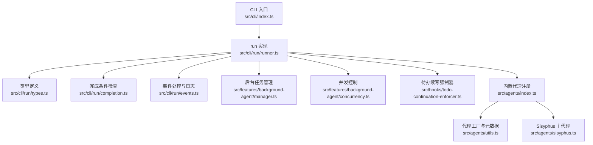
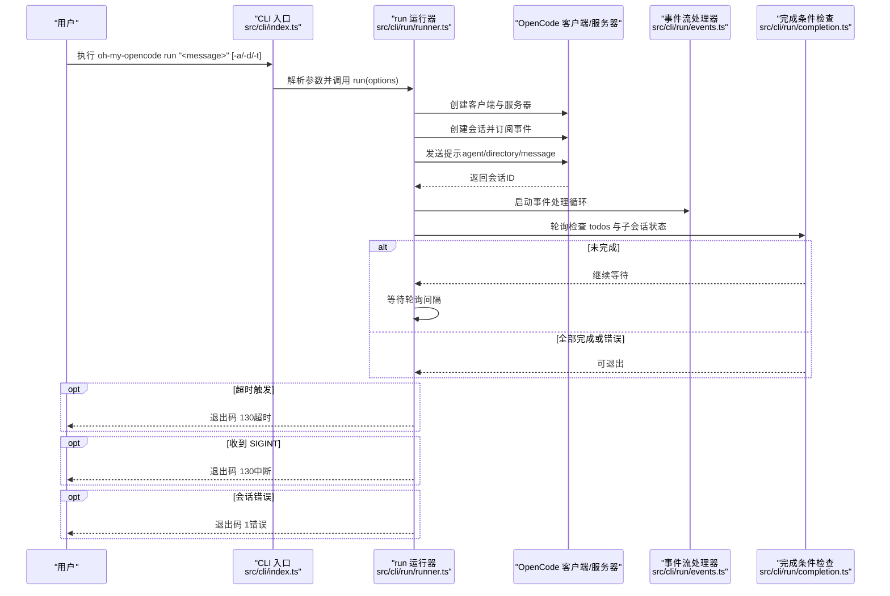
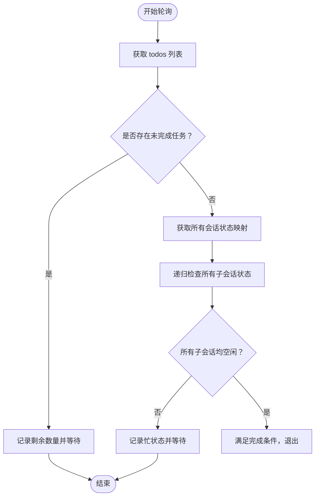
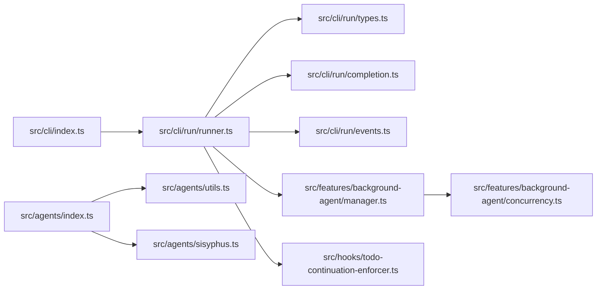

# 运行命令

<cite>
**本文引用的文件**
- [src/cli/run/index.ts](file://src/cli/run/index.ts)
- [src/cli/run/runner.ts](file://src/cli/run/runner.ts)
- [src/cli/run/types.ts](file://src/cli/run/types.ts)
- [src/cli/run/completion.ts](file://src/cli/run/completion.ts)
- [src/cli/run/events.ts](file://src/cli/run/events.ts)
- [src/cli/index.ts](file://src/cli/index.ts)
- [src/features/background-agent/manager.ts](file://src/features/background-agent/manager.ts)
- [src/features/background-agent/concurrency.ts](file://src/features/background-agent/concurrency.ts)
- [src/hooks/todo-continuation-enforcer.ts](file://src/hooks/todo-continuation-enforcer.ts)
- [src/agents/index.ts](file://src/agents/index.ts)
- [src/agents/utils.ts](file://src/agents/utils.ts)
- [src/agents/sisyphus.ts](file://src/agents/sisyphus.ts)
</cite>

## 目录
1. [简介](#简介)
2. [项目结构](#项目结构)
3. [核心组件](#核心组件)
4. [架构总览](#架构总览)
5. [详细组件分析](#详细组件分析)
6. [依赖关系分析](#依赖关系分析)
7. [性能考量](#性能考量)
8. [故障排查指南](#故障排查指南)
9. [结论](#结论)
10. [附录](#附录)

## 简介
oh-my-opencode 的 run 命令用于在本地启动 OpenCode 服务并执行一次性的开发任务，其核心特性是“待办任务完成强制执行”与“后台任务管理”。与直接调用底层 opencode run 不同，oh-my-opencode 的 run 会持续轮询并等待：
- 所有待办事项（todos）全部完成或取消
- 所有子会话（后台任务）均处于空闲状态

该命令支持超时控制与中断处理，并提供事件流的实时日志与工具调用可视化。

## 项目结构
run 命令位于 CLI 子模块中，核心实现集中在 run 子目录；同时与后台任务管理、代理注册、待办续写钩子等模块协同工作。

图表来源
- [src/cli/index.ts](file://src/cli/index.ts#L55-L80)
- [src/cli/run/runner.ts](file://src/cli/run/runner.ts#L1-L122)
- [src/cli/run/completion.ts](file://src/cli/run/completion.ts#L1-L80)
- [src/cli/run/events.ts](file://src/cli/run/events.ts#L1-L326)
- [src/features/background-agent/manager.ts](file://src/features/background-agent/manager.ts#L1-L800)
- [src/features/background-agent/concurrency.ts](file://src/features/background-agent/concurrency.ts#L1-L138)
- [src/hooks/todo-continuation-enforcer.ts](file://src/hooks/todo-continuation-enforcer.ts#L1-L570)
- [src/agents/index.ts](file://src/agents/index.ts#L1-L37)
- [src/agents/utils.ts](file://src/agents/utils.ts#L19-L223)
- [src/agents/sisyphus.ts](file://src/agents/sisyphus.ts#L1-L200)

章节来源
- [src/cli/index.ts](file://src/cli/index.ts#L55-L80)
- [src/cli/run/index.ts](file://src/cli/run/index.ts#L1-L3)

## 核心组件
- 命令入口与参数解析：CLI 使用 commander 定义 run 命令，支持 -a/--agent、-d/--directory、-t/--timeout 等选项，默认超时为 30 分钟。
- 运行器：负责创建 OpenCode 客户端与服务器、订阅事件流、发送提示、轮询完成条件、处理超时与中断。
- 完成条件检查：查询当前会话 todos 与子会话状态，确保所有任务完成且无后台任务忙。
- 事件处理：解析事件流，打印工具调用、消息更新、错误等信息，并维护主会话空闲/错误状态。
- 后台任务管理：跟踪后台子会话生命周期，保证主会话结束前后台任务全部空闲。
- 待办续写强制器：在会话空闲时自动注入续写提示，避免任务卡住。
- 代理系统：内置多种代理，run 默认使用 Sisyphus 主代理，也可指定其他代理。

章节来源
- [src/cli/index.ts](file://src/cli/index.ts#L55-L80)
- [src/cli/run/runner.ts](file://src/cli/run/runner.ts#L10-L122)
- [src/cli/run/completion.ts](file://src/cli/run/completion.ts#L4-L80)
- [src/cli/run/events.ts](file://src/cli/run/events.ts#L59-L326)
- [src/features/background-agent/manager.ts](file://src/features/background-agent/manager.ts#L52-L800)
- [src/hooks/todo-continuation-enforcer.ts](file://src/hooks/todo-continuation-enforcer.ts#L127-L570)
- [src/agents/index.ts](file://src/agents/index.ts#L17-L32)

## 架构总览
下面的序列图展示了 run 命令从 CLI 解析到完成的完整流程，包括超时与中断处理、事件订阅与完成条件检查。

图表来源
- [src/cli/index.ts](file://src/cli/index.ts#L55-L80)
- [src/cli/run/runner.ts](file://src/cli/run/runner.ts#L10-L122)
- [src/cli/run/events.ts](file://src/cli/run/events.ts#L79-L107)
- [src/cli/run/completion.ts](file://src/cli/run/completion.ts#L4-L80)

## 详细组件分析

### 命令参数与行为
- 参数
  - -a, --agent <name>：指定使用的代理名称，默认使用 Sisyphus。
  - -d, --directory <path>：工作目录，默认为当前工作目录。
  - -t, --timeout <ms>：超时时间（毫秒），默认 1800000（30 分钟）。timeout=0 表示不设置超时。
- 行为
  - 创建会话并发送提示。
  - 订阅事件流，实时输出工具调用与消息更新。
  - 轮询完成条件：所有 todos 完成或取消，且所有子会话空闲。
  - 超时或收到 SIGINT 时优雅退出，返回相应退出码。

章节来源
- [src/cli/index.ts](file://src/cli/index.ts#L55-L80)
- [src/cli/run/runner.ts](file://src/cli/run/runner.ts#L10-L122)
- [src/cli/run/types.ts](file://src/cli/run/types.ts#L3-L8)

### 完成条件检查算法
完成条件由两个维度组成：
- 待办任务（todos）：过滤掉已完成或已取消的任务，若仍有剩余则继续等待。
- 子会话状态：递归检查所有后代子会话的状态，必须全部为空闲。

图表来源
- [src/cli/run/completion.ts](file://src/cli/run/completion.ts#L4-L80)

章节来源
- [src/cli/run/completion.ts](file://src/cli/run/completion.ts#L4-L80)

### 事件处理与日志
事件处理器负责：
- 解析事件类型与属性，区分主会话与子会话。
- 记录主会话空闲/忙碌/错误状态，以便完成条件判断。
- 实时输出工具调用与结果摘要，支持文本流增量输出。
- 序列化错误信息，便于定位问题。

章节来源
- [src/cli/run/events.ts](file://src/cli/run/events.ts#L59-L326)

### 超时与中断处理
- 超时：当 timeout > 0 时，启动定时器，到达时间后通过 AbortController 触发中断，返回退出码 130。
- 中断：捕获 SIGINT，输出提示并清理资源，返回退出码 130。
- 错误：捕获异常并序列化错误信息，返回退出码 1。

章节来源
- [src/cli/run/runner.ts](file://src/cli/run/runner.ts#L20-L45)
- [src/cli/run/runner.ts](file://src/cli/run/runner.ts#L113-L121)

### 代理类型与使用示例
- 内置代理：Sisyphus、oracle、librarian、explore、implementer、archiver、frontend-ui-ux-engineer、document-writer、multimodal-looker、Metis、Momus、Prometheus、orchestrator-sisyphus。
- 使用示例（基于 CLI 帮助文本）：
  - 指定代理：oh-my-opencode run --agent Sisyphus "实现功能 X"
  - 设置超时：oh-my-opencode run --timeout 3600000 "大型重构任务"
- 性能考虑：
  - Sisyphus 作为主代理，擅长多阶段编排与并行子代理调度，适合复杂任务。
  - 其他代理按领域分工，合理选择可减少不必要的工具调用与上下文切换。

章节来源
- [src/agents/index.ts](file://src/agents/index.ts#L17-L32)
- [src/agents/utils.ts](file://src/agents/utils.ts#L19-L223)
- [src/agents/sisyphus.ts](file://src/agents/sisyphus.ts#L19-L36)
- [src/cli/index.ts](file://src/cli/index.ts#L61-L70)

### 后台任务管理与子会话
- 后台任务由 BackgroundManager 创建与跟踪，支持并发控制与稳定性检测。
- run 命令在完成条件中会检查所有子会话是否空闲，确保后台任务不会阻塞主会话退出。
- 并发控制通过 ConcurrencyManager 实现，支持按模型/提供商/默认限制。

章节来源
- [src/features/background-agent/manager.ts](file://src/features/background-agent/manager.ts#L52-L800)
- [src/features/background-agent/concurrency.ts](file://src/features/background-agent/concurrency.ts#L15-L138)
- [src/cli/run/completion.ts](file://src/cli/run/completion.ts#L37-L79)

### 待办续写强制器
- 在会话空闲时，若存在未完成的 todos，且无后台任务运行，则注入续写提示，避免任务停滞。
- 支持跳过特定代理、权限检查、关键词抑制（如涉及 Git/发布决策）等策略。

章节来源
- [src/hooks/todo-continuation-enforcer.ts](file://src/hooks/todo-continuation-enforcer.ts#L127-L570)

## 依赖关系分析
run 命令与以下模块存在强耦合：
- CLI 参数解析：src/cli/index.ts
- OpenCode SDK：创建客户端与服务器、会话与事件 API
- 完成条件：todos 与子会话状态查询
- 事件处理：事件流解析与日志输出
- 后台任务：子会话生命周期与空闲检测
- 代理系统：内置代理注册与工厂函数

图表来源
- [src/cli/index.ts](file://src/cli/index.ts#L55-L80)
- [src/cli/run/runner.ts](file://src/cli/run/runner.ts#L1-L122)
- [src/cli/run/completion.ts](file://src/cli/run/completion.ts#L1-L80)
- [src/cli/run/events.ts](file://src/cli/run/events.ts#L1-L326)
- [src/features/background-agent/manager.ts](file://src/features/background-agent/manager.ts#L1-L800)
- [src/features/background-agent/concurrency.ts](file://src/features/background-agent/concurrency.ts#L1-L138)
- [src/hooks/todo-continuation-enforcer.ts](file://src/hooks/todo-continuation-enforcer.ts#L1-L570)
- [src/agents/index.ts](file://src/agents/index.ts#L1-L37)
- [src/agents/utils.ts](file://src/agents/utils.ts#L19-L223)
- [src/agents/sisyphus.ts](file://src/agents/sisyphus.ts#L1-L200)

章节来源
- [src/cli/run/index.ts](file://src/cli/run/index.ts#L1-L3)
- [src/cli/run/types.ts](file://src/cli/run/types.ts#L1-L77)

## 性能考量
- 轮询间隔：run 使用固定轮询间隔检查完成条件，建议根据任务规模调整超时与目录范围，避免不必要的长轮询。
- 事件流：事件处理器对工具调用与消息更新进行增量输出，减少大块文本重复打印带来的开销。
- 并发控制：后台任务的并发限制可避免模型配额与资源争用，提升整体吞吐。
- 代理选择：对于简单任务优先使用轻量代理，复杂任务使用 Sisyphus 协调多个子代理，平衡响应时间与质量。

## 故障排查指南
- 会话错误：事件处理器会记录 session.error 并终止进程，返回退出码 1。请检查错误信息与最近的工具调用。
- 超时退出：当 timeout 到达时，进程以退出码 130 结束。可通过增大 -t 或优化任务路径减少超时概率。
- 中断退出：收到 SIGINT 时以退出码 130 结束。可在脚本中捕获此退出码进行重试或告警。
- 待办未完成：若 todos 未完成，run 将持续等待。可检查待办列表与后台任务状态，必要时手动清理或调整代理策略。
- 工具调用异常：事件处理器会输出工具调用与结果摘要，便于定位工具输入与输出问题。

章节来源
- [src/cli/run/events.ts](file://src/cli/run/events.ts#L173-L224)
- [src/cli/run/runner.ts](file://src/cli/run/runner.ts#L20-L45)
- [src/cli/run/runner.ts](file://src/cli/run/runner.ts#L113-L121)

## 结论
oh-my-opencode 的 run 命令通过“待办任务完成强制执行 + 后台任务管理”的双轨机制，确保任务在主会话层面彻底完成后再退出。结合事件流日志、超时与中断处理，以及内置代理与后台任务并发控制，能够稳定地支撑复杂开发任务的自动化执行与监控。

## 附录

### 参数速查
- -a, --agent <name>：代理名称，默认 Sisyphus
- -d, --directory <path>：工作目录，默认当前目录
- -t, --timeout <ms>：超时时间（毫秒），默认 30 分钟；timeout=0 表示不超时

章节来源
- [src/cli/index.ts](file://src/cli/index.ts#L55-L80)
- [src/cli/run/runner.ts](file://src/cli/run/runner.ts#L14-L16)

### 与其他 OpenCode 命令的区别与优势
- 区别：run 命令在底层 opencode run 的基础上增加了“待办完成强制执行 + 子会话空闲检测”，确保任务真正完成。
- 优势：
  - 更高的可靠性：避免“看似完成但仍有后台任务”的情况。
  - 更好的可观测性：事件流与工具调用日志帮助快速定位问题。
  - 更灵活的超时与中断：支持超时与 SIGINT 处理，适配 CI/CD 场景。

章节来源
- [src/cli/index.ts](file://src/cli/index.ts#L67-L70)
- [src/cli/run/completion.ts](file://src/cli/run/completion.ts#L4-L19)

### 批量任务与自动化脚本最佳实践
- 批量任务：将多个 run 命令串联，每个任务独立设置 -t 与 -d，避免相互干扰。
- 自动化脚本：
  - 捕获退出码：130 表示超时或中断，可触发重试或告警；1 表示错误，需检查日志。
  - 超时策略：根据任务规模设置合理的 -t，避免过短导致频繁失败。
  - 日志采集：结合事件流输出，将 stdout/stderr 重定向到日志系统。
  - 并发控制：通过后台任务并发限制避免资源瓶颈。

章节来源
- [src/cli/run/runner.ts](file://src/cli/run/runner.ts#L20-L45)
- [src/features/background-agent/concurrency.ts](file://src/features/background-agent/concurrency.ts#L24-L39)