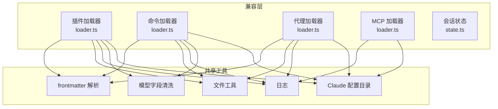
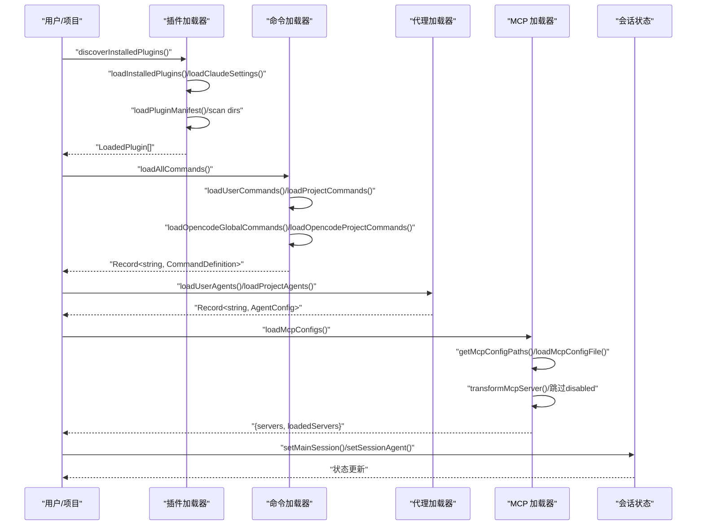
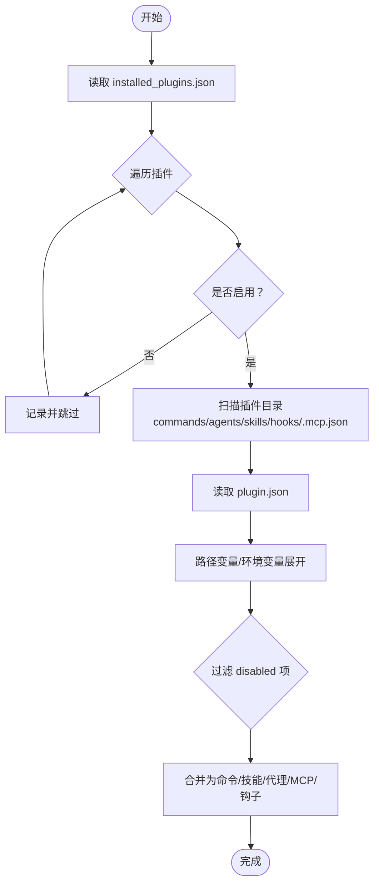
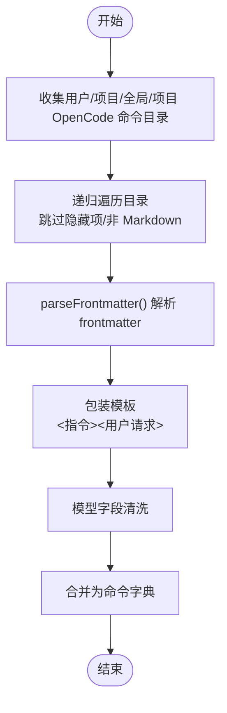
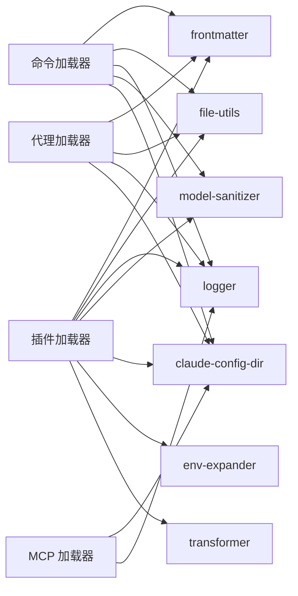

# Claude Code 兼容层

<cite>
**本文引用的文件**
- [src/features/claude-code-agent-loader/index.ts](file://src/features/claude-code-agent-loader/index.ts)
- [src/features/claude-code-agent-loader/loader.ts](file://src/features/claude-code-agent-loader/loader.ts)
- [src/features/claude-code-agent-loader/types.ts](file://src/features/claude-code-agent-loader/types.ts)
- [src/features/claude-code-command-loader/index.ts](file://src/features/claude-code-command-loader/index.ts)
- [src/features/claude-code-command-loader/loader.ts](file://src/features/claude-code-command-loader/loader.ts)
- [src/features/claude-code-command-loader/types.ts](file://src/features/claude-code-command-loader/types.ts)
- [src/features/claude-code-mcp-loader/index.ts](file://src/features/claude-code-mcp-loader/index.ts)
- [src/features/claude-code-mcp-loader/loader.ts](file://src/features/claude-code-mcp-loader/loader.ts)
- [src/features/claude-code-mcp-loader/types.ts](file://src/features/claude-code-mcp-loader/types.ts)
- [src/features/claude-code-mcp-loader/transformer.ts](file://src/features/claude-code-mcp-loader/transformer.ts)
- [src/features/claude-code-mcp-loader/env-expander.ts](file://src/features/claude-code-mcp-loader/env-expander.ts)
- [src/features/claude-code-plugin-loader/index.ts](file://src/features/claude-code-plugin-loader/index.ts)
- [src/features/claude-code-plugin-loader/loader.ts](file://src/features/claude-code-plugin-loader/loader.ts)
- [src/features/claude-code-plugin-loader/types.ts](file://src/features/claude-code-plugin-loader/types.ts)
- [src/features/claude-code-session-state/index.ts](file://src/features/claude-code-session-state/index.ts)
- [src/features/claude-code-session-state/state.ts](file://src/features/claude-code-session-state/state.ts)
- [src/shared/frontmatter.ts](file://src/shared/frontmatter.ts)
- [src/shared/file-utils.ts](file://src/shared/file-utils.ts)
- [src/shared/logger.ts](file://src/shared/logger.ts)
- [src/shared/model-sanitizer.ts](file://src/shared/model-sanitizer.ts)
- [src/shared/claude-config-dir.ts](file://src/shared/claude-config-dir.ts)
</cite>

## 目录
1. [引言](#引言)
2. [项目结构](#项目结构)
3. [核心组件](#核心组件)
4. [架构总览](#架构总览)
5. [组件详解](#组件详解)
6. [依赖关系分析](#依赖关系分析)
7. [性能考量](#性能考量)
8. [故障排查指南](#故障排查指南)
9. [结论](#结论)
10. [附录：迁移与配置](#附录迁移与配置)

## 引言
本文件面向 Oh My OpenCode 的 Claude Code 兼容层，系统化阐述其架构设计与实现原理，覆盖以下主题：
- 插件加载机制：从 Claude Code 插件数据库解析、清单读取、路径解析到组件发现与合并
- 命令系统集成：用户/项目/全局/项目 OpenCode 命令的多源聚合与模板包装
- MCP 服务器支持：.mcp.json 配置的多作用域加载、环境变量展开与格式转换
- 会话状态管理：主会话 ID 与子代理会话映射
- 兼容性切换与配置：通过选项覆盖启用状态、命名空间与模板兼容
- 迁移步骤与注意事项：从 Claude Code 向 OpenCode 的平滑过渡
- 测试与排障：加载流程可视化、错误日志与常见问题定位

## 项目结构
兼容层位于 features 子目录下，围绕“插件”“命令”“代理”“MCP”“会话状态”五大维度组织，采用按功能域分层的设计模式：
- claude-code-plugin-loader：解析 Claude Code 插件安装数据库，发现并加载插件内的命令、技能（以命令形式）、代理、MCP 与钩子
- claude-code-command-loader：从用户/项目/全局/项目 OpenCode 多个目录加载命令，统一为 OpenCode 可用的命令定义
- claude-code-agent-loader：从用户/项目目录加载代理 Markdown，解析 frontmatter 并生成 OpenCode AgentConfig
- claude-code-mcp-loader：加载 .mcp.json 配置，进行环境变量展开与格式转换，输出 OpenCode SDK 可用的 MCP 配置
- claude-code-session-state：维护主会话 ID 与会话-代理映射，支撑子代理工作流

图表来源
- [src/features/claude-code-plugin-loader/loader.ts](file://src/features/claude-code-plugin-loader/loader.ts#L1-L487)
- [src/features/claude-code-command-loader/loader.ts](file://src/features/claude-code-command-loader/loader.ts#L1-L145)
- [src/features/claude-code-agent-loader/loader.ts](file://src/features/claude-code-agent-loader/loader.ts#L1-L91)
- [src/features/claude-code-mcp-loader/loader.ts](file://src/features/claude-code-mcp-loader/loader.ts#L1-L114)
- [src/features/claude-code-session-state/state.ts](file://src/features/claude-code-session-state/state.ts#L1-L38)
- [src/shared/frontmatter.ts](file://src/shared/frontmatter.ts)
- [src/shared/file-utils.ts](file://src/shared/file-utils.ts)
- [src/shared/logger.ts](file://src/shared/logger.ts)
- [src/shared/model-sanitizer.ts](file://src/shared/model-sanitizer.ts)
- [src/shared/claude-config-dir.ts](file://src/shared/claude-config-dir.ts)

章节来源
- [src/features/claude-code-plugin-loader/index.ts](file://src/features/claude-code-plugin-loader/index.ts#L1-L4)
- [src/features/claude-code-command-loader/index.ts](file://src/features/claude-code-command-loader/index.ts#L1-L3)
- [src/features/claude-code-agent-loader/index.ts](file://src/features/claude-code-agent-loader/index.ts#L1-L3)
- [src/features/claude-code-mcp-loader/index.ts](file://src/features/claude-code-mcp-loader/index.ts#L1-L12)
- [src/features/claude-code-session-state/index.ts](file://src/features/claude-code-session-state/index.ts#L1-L2)

## 核心组件
- 插件加载器：解析 ~/.claude/plugins/installed_plugins.json，读取各插件的 plugin.json，扫描 commands/agents/skills/hooks/.mcp.json 等目录，产出命令、技能（命令化）、代理、MCP 与钩子配置；支持路径变量替换与环境变量展开
- 命令加载器：从用户/项目/全局/项目 OpenCode 目录递归加载 Markdown 命令，解析 frontmatter，包装模板，输出统一的命令定义
- 代理加载器：从用户/项目 agents 目录加载 Markdown 代理，解析 frontmatter 生成 AgentConfig
- MCP 加载器：从用户/项目/本地 .mcp.json 加载配置，跳过 disabled 项，调用转换器输出 OpenCode SDK 可用格式
- 会话状态：维护主会话 ID 与会话-代理映射，支持子代理会话集合

章节来源
- [src/features/claude-code-plugin-loader/loader.ts](file://src/features/claude-code-plugin-loader/loader.ts#L147-L486)
- [src/features/claude-code-command-loader/loader.ts](file://src/features/claude-code-command-loader/loader.ts#L112-L145)
- [src/features/claude-code-agent-loader/loader.ts](file://src/features/claude-code-agent-loader/loader.ts#L70-L91)
- [src/features/claude-code-mcp-loader/loader.ts](file://src/features/claude-code-mcp-loader/loader.ts#L69-L103)
- [src/features/claude-code-session-state/state.ts](file://src/features/claude-code-session-state/state.ts#L1-L38)

## 架构总览
兼容层通过“发现—解析—转换—合并”的流水线，将 Claude Code 生态中的插件、命令、代理与 MCP 服务无缝接入 OpenCode SDK。

图表来源
- [src/features/claude-code-plugin-loader/loader.ts](file://src/features/claude-code-plugin-loader/loader.ts#L147-L486)
- [src/features/claude-code-command-loader/loader.ts](file://src/features/claude-code-command-loader/loader.ts#L112-L145)
- [src/features/claude-code-agent-loader/loader.ts](file://src/features/claude-code-agent-loader/loader.ts#L70-L91)
- [src/features/claude-code-mcp-loader/loader.ts](file://src/features/claude-code-mcp-loader/loader.ts#L69-L103)
- [src/features/claude-code-session-state/state.ts](file://src/features/claude-code-session-state/state.ts#L5-L37)

## 组件详解

### 插件加载器（Plugin Loader）
职责
- 解析 Claude Code 插件安装数据库，读取插件清单，扫描插件内 commands/agents/skills/hooks/.mcp.json
- 对路径变量与环境变量进行展开，过滤 disabled 的 MCP 服务器
- 将插件技能转换为命令，代理与命令统一为 OpenCode SDK 可用格式

关键流程
- 发现插件：读取 installed_plugins.json，支持 v1/v2 结构；可选覆盖插件启用状态
- 加载清单：读取 plugin.json，提取名称、版本、组件路径等元信息
- 组件发现：扫描 commands/agents/skills/hooks/.mcp.json，按需加载
- 命名空间：命令与代理使用“插件名:命令/代理名”避免冲突
- 错误处理：对缺失路径、解析失败、禁用项进行日志记录与跳过

图表来源
- [src/features/claude-code-plugin-loader/loader.ts](file://src/features/claude-code-plugin-loader/loader.ts#L147-L486)
- [src/features/claude-code-mcp-loader/env-expander.ts](file://src/features/claude-code-mcp-loader/env-expander.ts)
- [src/features/claude-code-mcp-loader/transformer.ts](file://src/features/claude-code-mcp-loader/transformer.ts)

章节来源
- [src/features/claude-code-plugin-loader/loader.ts](file://src/features/claude-code-plugin-loader/loader.ts#L147-L486)
- [src/features/claude-code-plugin-loader/types.ts](file://src/features/claude-code-plugin-loader/types.ts#L1-L211)

### 命令加载器（Command Loader）
职责
- 从用户/项目/全局/项目 OpenCode 目录递归加载命令 Markdown
- 解析 frontmatter，包装模板，输出统一的命令定义
- 支持层级前缀（如 dir:file），生成 namespacedName

关键流程
- 目录遍历：使用 realpath 防止符号链接环，支持多级子目录
- 模板包装：将命令正文包裹在指令与用户请求占位符之间
- 模型清洗：根据来源选择清洗策略，保证模型字段兼容
- 合并策略：按优先级合并（项目 OpenCode > 全局 OpenCode > 项目 > 用户）

图表来源
- [src/features/claude-code-command-loader/loader.ts](file://src/features/claude-code-command-loader/loader.ts#L11-L145)
- [src/shared/frontmatter.ts](file://src/shared/frontmatter.ts)
- [src/shared/model-sanitizer.ts](file://src/shared/model-sanitizer.ts)

章节来源
- [src/features/claude-code-command-loader/loader.ts](file://src/features/claude-code-command-loader/loader.ts#L112-L145)
- [src/features/claude-code-command-loader/types.ts](file://src/features/claude-code-command-loader/types.ts#L1-L47)

### 代理加载器（Agent Loader）
职责
- 从用户/项目 agents 目录加载 Markdown 代理
- 解析 frontmatter，生成 OpenCode AgentConfig，支持 tools 列表解析

关键流程
- 目录扫描：仅处理 Markdown 文件
- frontmatter 解析：提取 name/description/tools 等
- 工具列表：逗号分隔字符串转小写键值映射
- 作用域标注：为描述添加“(user/project)”前缀

章节来源
- [src/features/claude-code-agent-loader/loader.ts](file://src/features/claude-code-agent-loader/loader.ts#L22-L91)
- [src/features/claude-code-agent-loader/types.ts](file://src/features/claude-code-agent-loader/types.ts#L1-L18)

### MCP 加载器（MCP Loader）
职责
- 从用户/项目/本地 .mcp.json 加载配置，跳过 disabled 项
- 调用转换器将 Claude Code 格式转换为 OpenCode SDK 可用格式
- 提供系统已加载服务器名称集合与提示文本格式化

关键流程
- 配置路径：用户、项目、本地三类路径
- 文件加载：Bun.file 文本读取与 JSON 解析
- 跳过禁用：遇到 disabled 字段直接跳过
- 转换与去重：同名服务器后加载覆盖先加载

章节来源
- [src/features/claude-code-mcp-loader/loader.ts](file://src/features/claude-code-mcp-loader/loader.ts#L18-L114)
- [src/features/claude-code-mcp-loader/types.ts](file://src/features/claude-code-mcp-loader/types.ts#L1-L43)

### 会话状态（Session State）
职责
- 维护主会话 ID
- 记录会话与代理的映射关系
- 支持子代理会话集合

章节来源
- [src/features/claude-code-session-state/state.ts](file://src/features/claude-code-session-state/state.ts#L1-L38)

## 依赖关系分析
- 组件耦合
  - 插件加载器依赖共享工具（frontmatter、file-utils、logger、model-sanitizer、claude-config-dir）与 MCP 环境展开与转换模块
  - 命令/代理加载器依赖 frontmatter 与 file-utils，命令加载器还依赖模型清洗
  - MCP 加载器依赖 claude-config-dir 与转换器
- 外部依赖
  - 文件系统：读取 JSON/Markdown/目录
  - 日志：统一记录加载与错误信息
- 接口契约
  - 命令定义、代理配置、MCP 配置均向 OpenCode SDK 输出兼容格式

图表来源
- [src/features/claude-code-plugin-loader/loader.ts](file://src/features/claude-code-plugin-loader/loader.ts#L1-L487)
- [src/features/claude-code-command-loader/loader.ts](file://src/features/claude-code-command-loader/loader.ts#L1-L145)
- [src/features/claude-code-agent-loader/loader.ts](file://src/features/claude-code-agent-loader/loader.ts#L1-L91)
- [src/features/claude-code-mcp-loader/loader.ts](file://src/features/claude-code-mcp-loader/loader.ts#L1-L114)
- [src/shared/frontmatter.ts](file://src/shared/frontmatter.ts)
- [src/shared/file-utils.ts](file://src/shared/file-utils.ts)
- [src/shared/logger.ts](file://src/shared/logger.ts)
- [src/shared/model-sanitizer.ts](file://src/shared/model-sanitizer.ts)
- [src/shared/claude-config-dir.ts](file://src/shared/claude-config-dir.ts)
- [src/features/claude-code-mcp-loader/env-expander.ts](file://src/features/claude-code-mcp-loader/env-expander.ts)
- [src/features/claude-code-mcp-loader/transformer.ts](file://src/features/claude-code-mcp-loader/transformer.ts)

## 性能考量
- 并发加载：命令与插件组件多处使用 Promise.all 并行处理，减少 I/O 等待
- 路径解析：使用 realpath 避免符号链接循环导致的重复遍历
- 跳过禁用：在 MCP 与插件层面尽早跳过 disabled 项，降低后续处理成本
- 内存占用：命令/代理/MCP 以字典形式返回，便于快速查找与合并

## 故障排查指南
常见问题与定位
- 插件未加载
  - 检查 installed_plugins.json 是否存在且可解析
  - 确认插件目录是否存在与权限
  - 查看日志中“Failed to load plugin manifest/command/agent/mcp”条目
- 命令未出现或命名冲突
  - 确认命令 Markdown frontmatter 是否正确
  - 注意层级前缀与命名空间（插件名:命令名）
- MCP 服务器未生效
  - 检查 .mcp.json 中 disabled 字段
  - 确认路径变量与环境变量展开是否正确
- 会话状态异常
  - 确认主会话 ID 设置与会话-代理映射逻辑

章节来源
- [src/features/claude-code-plugin-loader/loader.ts](file://src/features/claude-code-plugin-loader/loader.ts#L171-L177)
- [src/features/claude-code-plugin-loader/loader.ts](file://src/features/claude-code-plugin-loader/loader.ts#L262-L264)
- [src/features/claude-code-mcp-loader/loader.ts](file://src/features/claude-code-mcp-loader/loader.ts#L79-L82)
- [src/features/claude-code-mcp-loader/loader.ts](file://src/features/claude-code-mcp-loader/loader.ts#L408-L410)

## 结论
该兼容层通过清晰的职责划分与稳健的加载流程，实现了对 Claude Code 插件、命令、代理与 MCP 的全面兼容。其并发优化、路径与环境变量处理以及严格的错误日志，确保了在复杂项目场景下的稳定性与可维护性。配合会话状态管理，可进一步支撑子代理与多轮对话的高级工作流。

## 附录：迁移与配置

### 兼容性切换机制
- 插件启用控制
  - 优先使用传入的 enabledPluginsOverride 覆盖 ~/.claude/settings.json 中的 enabledPlugins
  - 未显式声明时默认启用
- 命令与代理命名空间
  - 插件组件统一使用“插件名:命令/代理名”，避免与内置或用户自定义冲突
- 模板与模型字段
  - 命令模板自动包装指令与用户请求占位符
  - 模型字段根据来源进行清洗，保证跨平台一致性

章节来源
- [src/features/claude-code-plugin-loader/types.ts](file://src/features/claude-code-plugin-loader/types.ts#L201-L210)
- [src/features/claude-code-plugin-loader/loader.ts](file://src/features/claude-code-plugin-loader/loader.ts#L124-L136)
- [src/features/claude-code-command-loader/loader.ts](file://src/features/claude-code-command-loader/loader.ts#L66-L72)
- [src/features/claude-code-command-loader/loader.ts](file://src/features/claude-code-command-loader/loader.ts#L82-L83)
- [src/shared/model-sanitizer.ts](file://src/shared/model-sanitizer.ts)

### 迁移步骤指南
- 准备阶段
  - 备份 ~/.claude/plugins/installed_plugins.json 与各目录（commands/agents/skills/hooks/.mcp.json）
  - 确认当前 Claude Code 插件清单与配置
- 执行迁移
  - 使用插件加载器的 discoverInstalledPlugins 与 loadAllPluginComponents 获取所有组件
  - 将命令/代理/MCP 合并至 OpenCode SDK 可用字典
  - 若存在同名冲突，优先保留 OpenCode 自定义内容
- 验证与回滚
  - 通过日志检查加载结果与错误
  - 如遇问题，回滚 installed_plugins.json 并逐项排查

章节来源
- [src/features/claude-code-plugin-loader/loader.ts](file://src/features/claude-code-plugin-loader/loader.ts#L147-L486)
- [src/features/claude-code-command-loader/loader.ts](file://src/features/claude-code-command-loader/loader.ts#L136-L144)

### 配置选项说明
- 插件加载器选项
  - enabledPluginsOverride：以“插件名@市场”为键，显式启用/禁用插件
- 命令加载器
  - 支持用户/项目/全局/项目 OpenCode 四类命令目录
- MCP 加载器
  - 支持用户/项目/本地三类 .mcp.json
  - 自动跳过 disabled 项并进行环境变量展开与格式转换

章节来源
- [src/features/claude-code-plugin-loader/types.ts](file://src/features/claude-code-plugin-loader/types.ts#L201-L210)
- [src/features/claude-code-command-loader/loader.ts](file://src/features/claude-code-command-loader/loader.ts#L112-L134)
- [src/features/claude-code-mcp-loader/loader.ts](file://src/features/claude-code-mcp-loader/loader.ts#L18-L27)