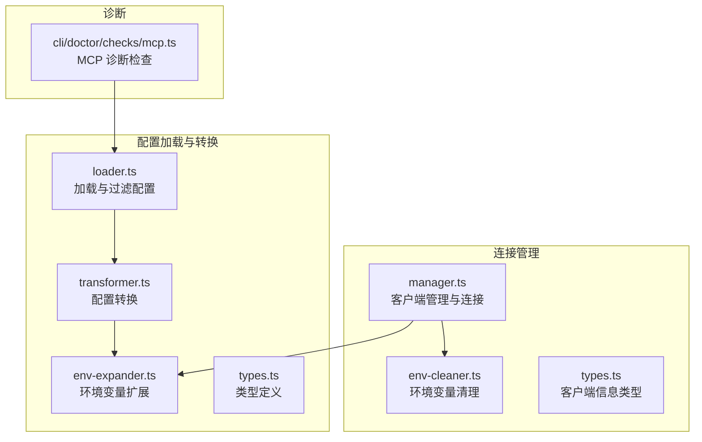
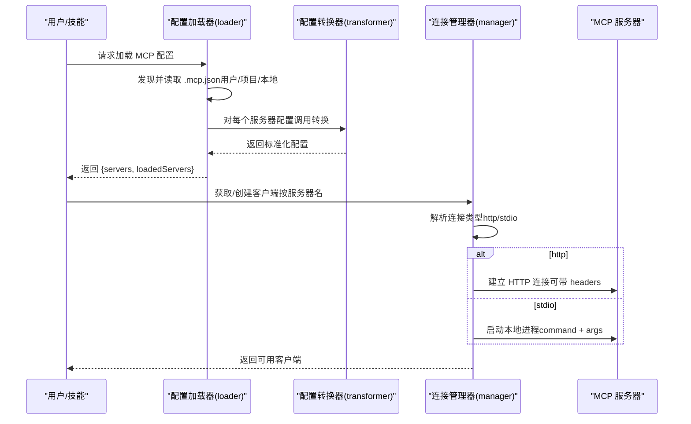
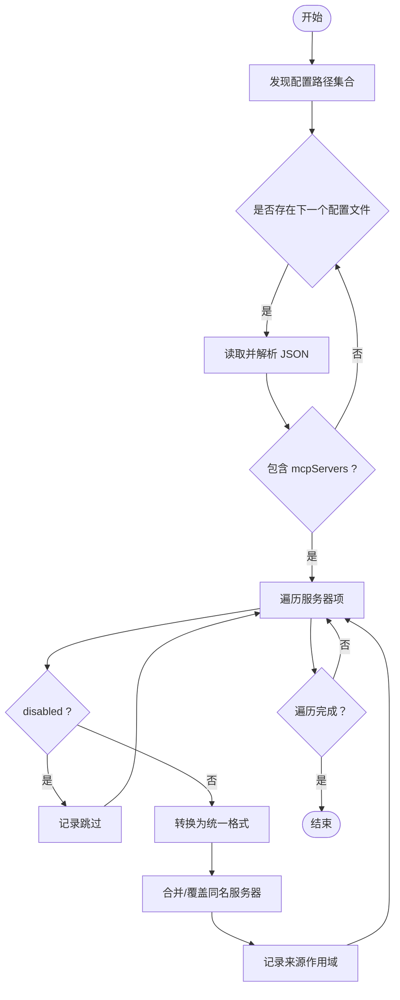
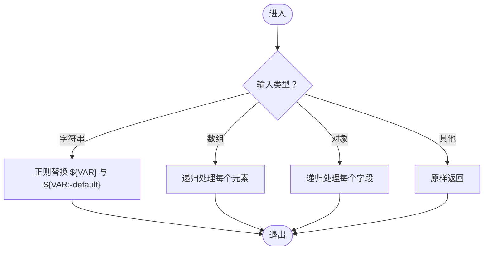
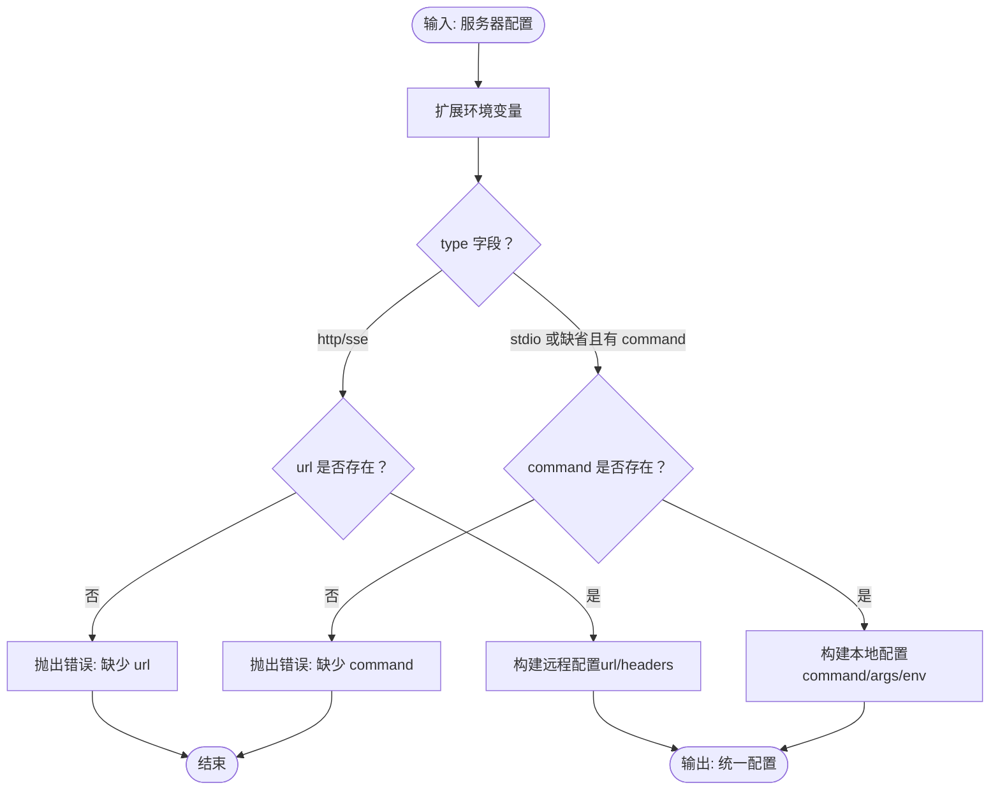
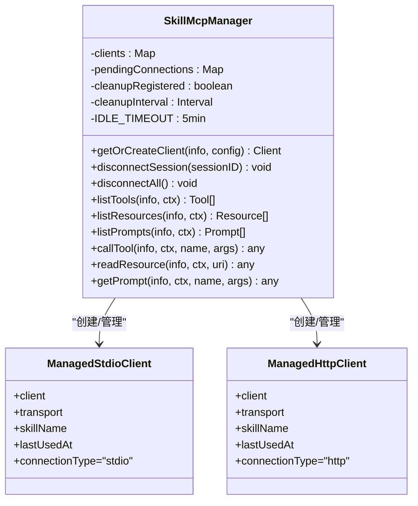
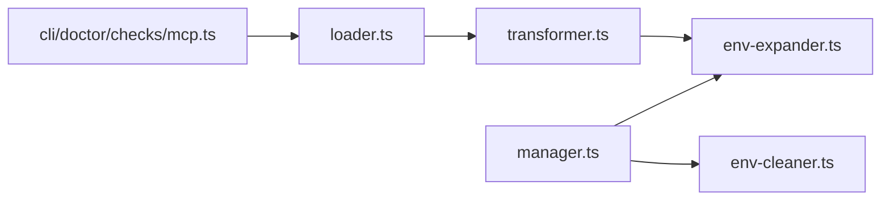

# MCP 服务器支持

<cite>
**本文引用的文件**
- [src/features/claude-code-mcp-loader/index.ts](file://src/features/claude-code-mcp-loader/index.ts)
- [src/features/claude-code-mcp-loader/loader.ts](file://src/features/claude-code-mcp-loader/loader.ts)
- [src/features/claude-code-mcp-loader/env-expander.ts](file://src/features/claude-code-mcp-loader/env-expander.ts)
- [src/features/claude-code-mcp-loader/transformer.ts](file://src/features/claude-code-mcp-loader/transformer.ts)
- [src/features/claude-code-mcp-loader/types.ts](file://src/features/claude-code-mcp-loader/types.ts)
- [src/features/skill-mcp-manager/index.ts](file://src/features/skill-mcp-manager/index.ts)
- [src/features/skill-mcp-manager/manager.ts](file://src/features/skill-mcp-manager/manager.ts)
- [src/features/skill-mcp-manager/env-cleaner.ts](file://src/features/skill-mcp-manager/env-cleaner.ts)
- [src/features/skill-mcp-manager/types.ts](file://src/features/skill-mcp-manager/types.ts)
- [src/cli/doctor/checks/mcp.ts](file://src/cli/doctor/checks/mcp.ts)
- [CONFIGURATION-GUIDE.md](file://CONFIGURATION-GUIDE.md)
- [docs/CODEX-MCP-REPLACEMENT-PLAN.md](file://docs/CODEX-MCP-REPLACEMENT-PLAN.md)
</cite>

## 目录
1. [简介](#简介)
2. [项目结构](#项目结构)
3. [核心组件](#核心组件)
4. [架构总览](#架构总览)
5. [组件详解](#组件详解)
6. [依赖关系分析](#依赖关系分析)
7. [性能与可靠性](#性能与可靠性)
8. [故障排查指南](#故障排查指南)
9. [结论](#结论)
10. [附录](#附录)

## 简介
本文件面向 Claude Code MCP 服务器支持，系统化阐述以下主题：
- MCP 配置解析与加载：多作用域配置文件发现、禁用服务器过滤、加载顺序与覆盖规则
- 环境变量扩展：字符串与对象层级的环境变量占位符替换策略
- 服务器转换机制：Claude Code 配置到 OpenCode SDK 统一配置的标准化映射
- 插件路径解析与服务器配置标准化：命令行、参数、环境变量、远程 URL 与头部的处理
- MCP 服务器启动、连接管理与错误处理：本地 stdio 与远程 HTTP 连接、重连与清理、空闲回收
- 配置示例与故障排查：常见问题定位、日志与诊断检查

## 项目结构
围绕 MCP 服务器支持的关键模块分布如下：
- 配置加载与转换：claude-code-mcp-loader
- 连接管理与生命周期：skill-mcp-manager
- 诊断与健康检查：cli/doctor/checks/mcp.ts
- 配置参考与示例：CONFIGURATION-GUIDE.md、docs/CODEX-MCP-REPLACEMENT-PLAN.md

**图表来源**
- [src/features/claude-code-mcp-loader/loader.ts](file://src/features/claude-code-mcp-loader/loader.ts#L1-L114)
- [src/features/claude-code-mcp-loader/transformer.ts](file://src/features/claude-code-mcp-loader/transformer.ts#L1-L54)
- [src/features/claude-code-mcp-loader/env-expander.ts](file://src/features/claude-code-mcp-loader/env-expander.ts#L1-L28)
- [src/features/claude-code-mcp-loader/types.ts](file://src/features/claude-code-mcp-loader/types.ts#L1-L43)
- [src/features/skill-mcp-manager/manager.ts](file://src/features/skill-mcp-manager/manager.ts#L1-L521)
- [src/features/skill-mcp-manager/env-cleaner.ts](file://src/features/skill-mcp-manager/env-cleaner.ts#L1-L28)
- [src/features/skill-mcp-manager/types.ts](file://src/features/skill-mcp-manager/types.ts#L1-L15)
- [src/cli/doctor/checks/mcp.ts](file://src/cli/doctor/checks/mcp.ts#L1-L129)

**章节来源**
- [src/features/claude-code-mcp-loader/index.ts](file://src/features/claude-code-mcp-loader/index.ts#L1-L12)
- [src/features/skill-mcp-manager/index.ts](file://src/features/skill-mcp-manager/index.ts#L1-L3)

## 核心组件
- 配置加载器（loader.ts）
  - 发现多作用域配置文件（用户、项目、本地），按顺序读取并合并
  - 过滤 disabled 的服务器，记录已加载服务器清单
- 配置转换器（transformer.ts）
  - 将 Claude Code 配置标准化为 OpenCode SDK 的统一格式
  - 支持 http/sse 与 stdio 两类连接类型
- 环境变量扩展（env-expander.ts）
  - 字符串与对象递归替换 ${VAR}、${VAR:-default} 占位符
- 连接管理器（manager.ts）
  - 基于配置创建 MCP 客户端（stdio 或 http）
  - 连接池、重连、空闲回收、进程清理、信号处理
- 环境变量清理（env-cleaner.ts）
  - 过滤 npm/pnpm/yarn 等包管理器环境变量，避免污染 MCP 子进程
- 诊断检查（cli/doctor/checks/mcp.ts）
  - 列举内置与用户配置的 MCP 服务器，校验格式有效性

**章节来源**
- [src/features/claude-code-mcp-loader/loader.ts](file://src/features/claude-code-mcp-loader/loader.ts#L18-L103)
- [src/features/claude-code-mcp-loader/transformer.ts](file://src/features/claude-code-mcp-loader/transformer.ts#L9-L53)
- [src/features/claude-code-mcp-loader/env-expander.ts](file://src/features/claude-code-mcp-loader/env-expander.ts#L1-L28)
- [src/features/skill-mcp-manager/manager.ts](file://src/features/skill-mcp-manager/manager.ts#L60-L317)
- [src/features/skill-mcp-manager/env-cleaner.ts](file://src/features/skill-mcp-manager/env-cleaner.ts#L1-L28)
- [src/cli/doctor/checks/mcp.ts](file://src/cli/doctor/checks/mcp.ts#L10-L65)

## 架构总览
MCP 服务器支持由“配置层”和“连接层”组成：
- 配置层负责解析与标准化，确保不同来源的配置能被统一消费
- 连接层负责实际建立与维护 MCP 连接，提供工具/资源/提示词等能力调用

**图表来源**
- [src/features/claude-code-mcp-loader/loader.ts](file://src/features/claude-code-mcp-loader/loader.ts#L69-L103)
- [src/features/claude-code-mcp-loader/transformer.ts](file://src/features/claude-code-mcp-loader/transformer.ts#L9-L53)
- [src/features/skill-mcp-manager/manager.ts](file://src/features/skill-mcp-manager/manager.ts#L112-L174)

## 组件详解

### 配置解析与加载（loader.ts）
- 配置文件发现顺序与作用域
  - 用户级：用户主目录下的 .claude/.mcp.json
  - 项目级：工作目录根与 .claude/.mcp.json
  - 本地级：工作目录下 .mcp.json
- 加载与合并策略
  - 逐个文件读取，若存在 mcpServers 则遍历
  - 跳过 disabled 的服务器
  - 若同名服务器重复出现，后出现者覆盖前者
- 已加载服务器汇总
  - 记录每个服务器的来源作用域，便于反馈与诊断

**图表来源**
- [src/features/claude-code-mcp-loader/loader.ts](file://src/features/claude-code-mcp-loader/loader.ts#L18-L103)

**章节来源**
- [src/features/claude-code-mcp-loader/loader.ts](file://src/features/claude-code-mcp-loader/loader.ts#L18-L103)

### 环境变量扩展（env-expander.ts）
- 支持字符串与对象层级的占位符替换
  - ${VAR}：不存在则为空字符串
  - ${VAR:-default}：支持默认值
- 递归处理数组与对象，保证嵌套结构中的占位符均被替换

**图表来源**
- [src/features/claude-code-mcp-loader/env-expander.ts](file://src/features/claude-code-mcp-loader/env-expander.ts#L1-L28)

**章节来源**
- [src/features/claude-code-mcp-loader/env-expander.ts](file://src/features/claude-code-mcp-loader/env-expander.ts#L1-L28)

### 配置转换与标准化（transformer.ts）
- 类型判定与转换
  - type 为 http/sse：生成远程配置，校验 url 必填
  - type 为 stdio 或未指定且存在 command：生成本地配置，校验 command 必填
- 环境变量扩展
  - 在转换前对整个配置进行环境变量扩展，确保后续连接参数可用
- 可选字段处理
  - headers（远程）、environment（本地）按需注入

**图表来源**
- [src/features/claude-code-mcp-loader/transformer.ts](file://src/features/claude-code-mcp-loader/transformer.ts#L9-L53)

**章节来源**
- [src/features/claude-code-mcp-loader/transformer.ts](file://src/features/claude-code-mcp-loader/transformer.ts#L9-L53)

### 连接管理与生命周期（manager.ts）
- 连接类型推断
  - 显式 type 优先：http/sse -> http；stdio -> stdio
  - 无显式 type：根据是否存在 url/command 推断
- 客户端创建
  - HTTP：StreamableHTTPClientTransport，支持 headers
  - STDIO：StdioClientTransport，合并清理后的环境变量
- 连接池与重连
  - 按 sessionID/skillName/serverName 维度缓存客户端
  - 并发连接去重（pendingConnections）
  - 操作失败时检测“未连接”错误并自动重连
- 清理与回收
  - 信号处理：SIGINT/SIGTERM/SIGBREAK，异步关闭所有连接
  - 空闲回收：超过 5 分钟未使用自动关闭
- 错误处理
  - 连接失败时关闭传输，抛出带上下文的错误信息
  - 命令缺失、URL 无效等场景提供明确提示

**图表来源**
- [src/features/skill-mcp-manager/manager.ts](file://src/features/skill-mcp-manager/manager.ts#L60-L317)

**章节来源**
- [src/features/skill-mcp-manager/manager.ts](file://src/features/skill-mcp-manager/manager.ts#L60-L317)

### 环境变量清理（env-cleaner.ts）
- 过滤规则
  - 排除 NPM_CONFIG_*、npm_config_*、YARN_*、PNPM_*、NO_UPDATE_NOTIFIER 等
- 合并策略
  - 保留清理后的进程环境，叠加自定义环境变量

**章节来源**
- [src/features/skill-mcp-manager/env-cleaner.ts](file://src/features/skill-mcp-manager/env-cleaner.ts#L1-L28)

### 诊断与健康检查（cli/doctor/checks/mcp.ts）
- 内置服务器
  - 固定列表 context7、grep_app，标记为内置且有效
- 用户配置
  - 读取用户配置路径集合，合并 mcpServers
  - 校验每项是否为对象，否则标记为无效
- 输出
  - pass/warn/skip 状态与详细信息，便于快速定位问题

**章节来源**
- [src/cli/doctor/checks/mcp.ts](file://src/cli/doctor/checks/mcp.ts#L10-L129)

## 依赖关系分析
- loader.ts 依赖 transformer.ts 与 env-expander.ts
- transformer.ts 依赖 env-expander.ts
- manager.ts 依赖 env-expander.ts 与 env-cleaner.ts，并消费 loader.ts 的标准化配置
- 诊断模块依赖 loader.ts 的配置发现逻辑

**图表来源**
- [src/features/claude-code-mcp-loader/loader.ts](file://src/features/claude-code-mcp-loader/loader.ts#L1-L11)
- [src/features/claude-code-mcp-loader/transformer.ts](file://src/features/claude-code-mcp-loader/transformer.ts#L1-L7)
- [src/features/skill-mcp-manager/manager.ts](file://src/features/skill-mcp-manager/manager.ts#L1-L8)
- [src/cli/doctor/checks/mcp.ts](file://src/cli/doctor/checks/mcp.ts#L1-L6)

**章节来源**
- [src/features/claude-code-mcp-loader/index.ts](file://src/features/claude-code-mcp-loader/index.ts#L8-L12)
- [src/features/skill-mcp-manager/index.ts](file://src/features/skill-mcp-manager/index.ts#L1-L3)

## 性能与可靠性
- 连接复用与并发控制
  - 按键缓存客户端，避免重复创建
  - pendingConnections 防止竞态重复连接
- 空闲回收
  - 5 分钟空闲超时自动关闭，释放资源
- 重连与退避
  - 操作失败检测“未连接”，最多重试 3 次
- 进程清理
  - 信号处理与定时清理，防止孤儿进程

[本节为通用指导，无需具体文件引用]

## 故障排查指南
- 常见问题与定位
  - 服务器未加载
    - 检查 .mcp.json 是否存在、JSON 是否有效、mcpServers 是否存在
    - 确认 disabled 字段未启用
    - 使用 doctor 检查：查看用户配置状态与无效项
  - 连接失败（HTTP）
    - 校验 url 是否为有效 URL
    - 检查 headers 是否正确，服务端是否支持 MCP over HTTP
  - 连接失败（STDIO）
    - 校验 command 是否存在且可执行
    - 检查 args 是否正确
    - 注意包管理器环境变量可能影响子进程，使用清理后的环境
  - 重连与超时
    - 若出现“未连接”错误，系统会自动重连；如多次失败，检查服务器稳定性与网络
- 诊断命令
  - 使用 doctor 检查内置与用户 MCP 服务器状态，获取详细列表与错误信息

**章节来源**
- [src/cli/doctor/checks/mcp.ts](file://src/cli/doctor/checks/mcp.ts#L78-L109)
- [src/features/skill-mcp-manager/manager.ts](file://src/features/skill-mcp-manager/manager.ts#L169-L317)

## 结论
本支持模块通过“配置层 + 连接层”的清晰分工，实现了：
- 多作用域配置的统一解析与覆盖
- 环境变量的深度扩展与安全清理
- 本地与远程 MCP 服务器的标准化接入
- 强健的连接管理、重连与资源回收机制
配合诊断检查与配置示例，能够高效定位与解决 MCP 服务器相关问题。

[本节为总结，无需具体文件引用]

## 附录

### MCP 服务器配置示例与最佳实践
- 用户级配置（用户主目录）
  - 文件位置：~/.claude/.mcp.json
  - 用途：全局 MCP 服务器定义
- 项目级配置
  - 文件位置：项目根 .mcp.json 或 .claude/.mcp.json
  - 用途：项目专属 MCP 服务器，优先级高于用户级
- 远程服务器（HTTP/SSE）
  - 必填字段：type、url
  - 可选字段：headers
- 本地服务器（STDIO）
  - 必填字段：type、command
  - 可选字段：args、env
- 禁用服务器
  - 在对应配置中设置 disabled: true，可临时屏蔽某服务器

**章节来源**
- [src/features/claude-code-mcp-loader/types.ts](file://src/features/claude-code-mcp-loader/types.ts#L3-L15)
- [src/features/claude-code-mcp-loader/transformer.ts](file://src/features/claude-code-mcp-loader/transformer.ts#L16-L53)
- [CONFIGURATION-GUIDE.md](file://CONFIGURATION-GUIDE.md#L169-L169)

### 相关文档与背景
- 替代 Oracle 的 MCP 方案（Codex）
  - 通过内置 MCP 服务器（codexmcp）与技能模板，将 Oracle 的系统提示词注入到 Codex CLI 调用中
  - 提供多轮对话、沙箱模式与会话 ID 续传能力

**章节来源**
- [docs/CODEX-MCP-REPLACEMENT-PLAN.md](file://docs/CODEX-MCP-REPLACEMENT-PLAN.md#L563-L710)