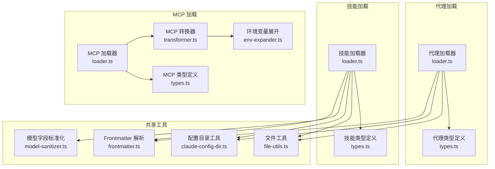
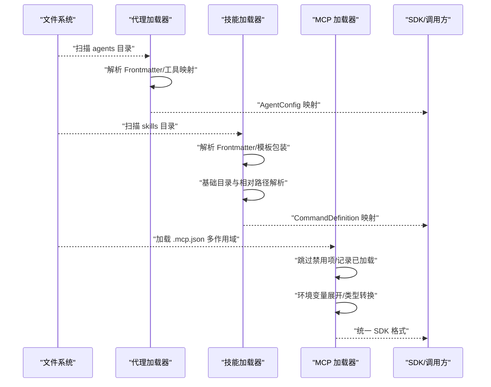
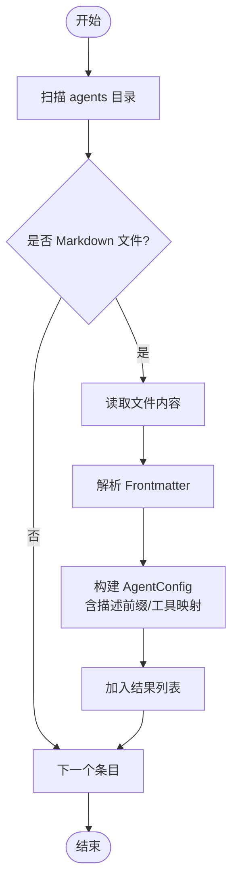
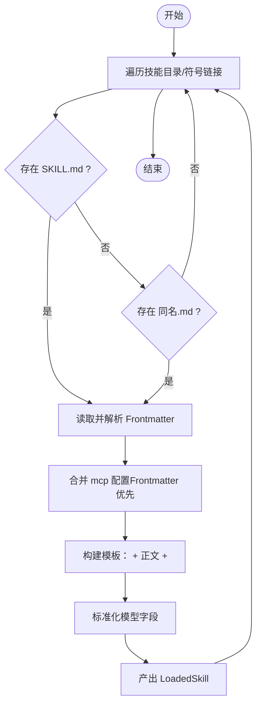
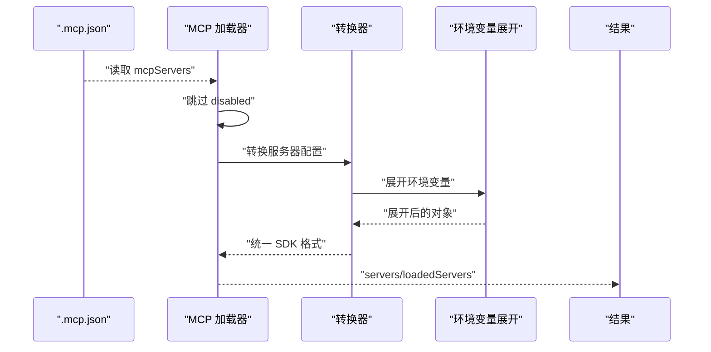
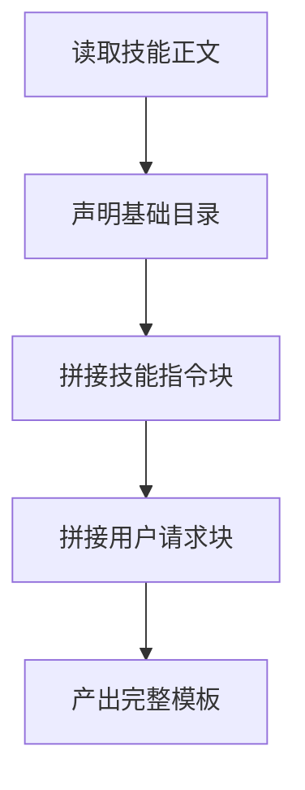
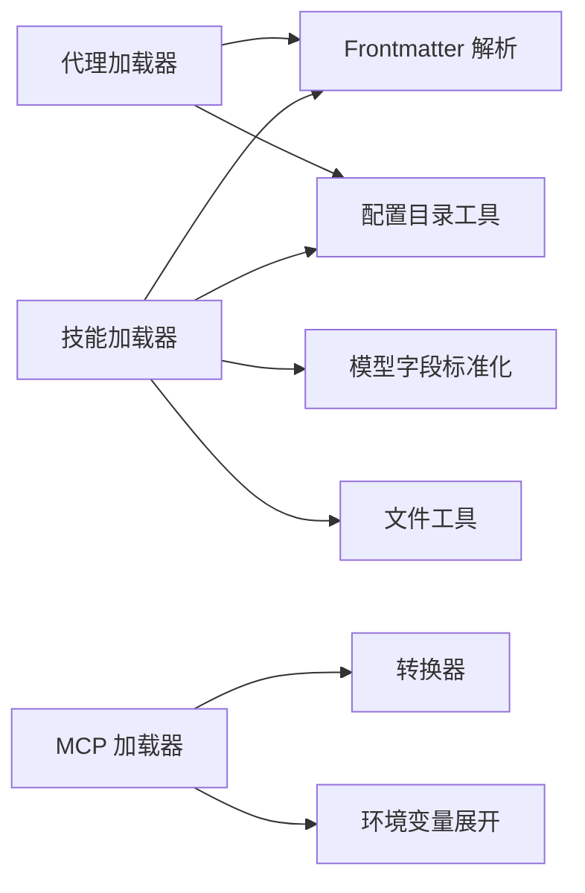

# 代理和技能集成

<cite>
**本文引用的文件**
- [src/features/claude-code-agent-loader/loader.ts](file://src/features/claude-code-agent-loader/loader.ts)
- [src/features/claude-code-agent-loader/types.ts](file://src/features/claude-code-agent-loader/types.ts)
- [src/features/opencode-skill-loader/loader.ts](file://src/features/opencode-skill-loader/loader.ts)
- [src/features/opencode-skill-loader/types.ts](file://src/features/opencode-skill-loader/types.ts)
- [src/features/claude-code-mcp-loader/loader.ts](file://src/features/claude-code-mcp-loader/loader.ts)
- [src/features/claude-code-mcp-loader/transformer.ts](file://src/features/claude-code-mcp-loader/transformer.ts)
- [src/features/claude-code-mcp-loader/env-expander.ts](file://src/features/claude-code-mcp-loader/env-expander.ts)
- [src/features/claude-code-mcp-loader/types.ts](file://src/features/claude-code-mcp-loader/types.ts)
- [src/shared/frontmatter.ts](file://src/shared/frontmatter.ts)
- [src/shared/model-sanitizer.ts](file://src/shared/model-sanitizer.ts)
- [src/shared/claude-config-dir.ts](file://src/shared/claude-config-dir.ts)
- [src/shared/file-utils.ts](file://src/shared/file-utils.ts)
- [src/features/builtin-skills/writing-skills/SKILL.md](file://src/features/builtin-skills/writing-skills/SKILL.md)
- [src/agents/momus.ts](file://src/agents/momus.ts)
</cite>

## 目录
1. [简介](#简介)
2. [项目结构](#项目结构)
3. [核心组件](#核心组件)
4. [架构总览](#架构总览)
5. [详细组件分析](#详细组件分析)
6. [依赖关系分析](#依赖关系分析)
7. [性能考虑](#性能考虑)
8. [故障排查指南](#故障排查指南)
9. [结论](#结论)
10. [附录](#附录)

## 简介
本文件面向 Claude Code 与 OpenCode 生态中的“代理（Agent）”与“技能（Skill）”集成，系统性阐述以下主题：
- 代理配置转换：从 Markdown 前言元数据到 AgentConfig 的映射，以及代理前言处理与工具配置映射。
- 技能文件解析：Frontmatter 元数据提取、基础目录设置、文件引用解析与提示词模板包装。
- 提示词包装机制：技能指令块与用户请求块的拼装，以及基础目录与相对路径解析策略。
- 模型字段标准化：不同来源的模型名规范化策略。
- MCP 配置加载与转换：从 Claude Code 的 .mcp.json 到统一 SDK 格式，并进行环境变量展开与类型转换。

本指南兼顾工程实现细节与可读性，既适合开发者深入理解源码，也便于非技术读者把握整体流程。

## 项目结构
围绕代理与技能集成的关键模块如下：
- 代理加载器：负责扫描用户/项目目录下的 Markdown 文件，解析前言元数据，生成 AgentConfig。
- 技能加载器：负责扫描技能目录，解析 Frontmatter，构建命令定义与提示词模板，支持基础目录与文件引用解析。
- MCP 加载器：负责加载 Claude Code 的 .mcp.json，进行环境变量展开与类型转换，输出统一 SDK 格式。
- 共享工具：Frontmatter 解析、模型字段标准化、配置目录定位、文件工具等。

**图表来源**
- [src/features/claude-code-agent-loader/loader.ts](file://src/features/claude-code-agent-loader/loader.ts#L1-L91)
- [src/features/claude-code-agent-loader/types.ts](file://src/features/claude-code-agent-loader/types.ts#L1-L18)
- [src/features/opencode-skill-loader/loader.ts](file://src/features/opencode-skill-loader/loader.ts#L1-L260)
- [src/features/opencode-skill-loader/types.ts](file://src/features/opencode-skill-loader/types.ts#L1-L39)
- [src/features/claude-code-mcp-loader/loader.ts](file://src/features/claude-code-mcp-loader/loader.ts#L1-L114)
- [src/features/claude-code-mcp-loader/transformer.ts](file://src/features/claude-code-mcp-loader/transformer.ts#L1-L54)
- [src/features/claude-code-mcp-loader/env-expander.ts](file://src/features/claude-code-mcp-loader/env-expander.ts#L1-L28)
- [src/features/claude-code-mcp-loader/types.ts](file://src/features/claude-code-mcp-loader/types.ts#L1-L43)
- [src/shared/frontmatter.ts](file://src/shared/frontmatter.ts#L1-L32)
- [src/shared/model-sanitizer.ts](file://src/shared/model-sanitizer.ts#L1-L13)
- [src/shared/claude-config-dir.ts](file://src/shared/claude-config-dir.ts)
- [src/shared/file-utils.ts](file://src/shared/file-utils.ts)

**章节来源**
- [src/features/claude-code-agent-loader/loader.ts](file://src/features/claude-code-agent-loader/loader.ts#L1-L91)
- [src/features/opencode-skill-loader/loader.ts](file://src/features/opencode-skill-loader/loader.ts#L1-L260)
- [src/features/claude-code-mcp-loader/loader.ts](file://src/features/claude-code-mcp-loader/loader.ts#L1-L114)

## 核心组件
- 代理加载器：扫描用户/项目 agents 目录，解析 Markdown 前言元数据，生成 AgentConfig；支持 tools 字符串到工具白名单映射；为描述添加作用域前缀。
- 技能加载器：扫描用户/项目/全局技能目录，解析 Frontmatter，构建 CommandDefinition；将技能正文包装为提示词模板，注入基础目录与参数占位；支持 mcp.json 与 Frontmatter 中的 mcp 配置合并；对模型字段进行来源相关的标准化。
- MCP 加载器：按优先级加载 .mcp.json，跳过禁用项，调用转换器将 Claude Code 格式转换为统一 SDK 格式；支持环境变量展开；记录已加载服务器清单。
- 共享工具：Frontmatter 解析确保安全（JSON_SCHEMA），模型字段标准化根据来源决定是否保留模型名，配置目录工具提供跨平台路径定位，文件工具提供符号链接解析与扩展名判断。

**章节来源**
- [src/features/claude-code-agent-loader/loader.ts](file://src/features/claude-code-agent-loader/loader.ts#L9-L68)
- [src/features/opencode-skill-loader/loader.ts](file://src/features/opencode-skill-loader/loader.ts#L58-L122)
- [src/features/claude-code-mcp-loader/loader.ts](file://src/features/claude-code-mcp-loader/loader.ts#L69-L103)
- [src/shared/frontmatter.ts](file://src/shared/frontmatter.ts#L10-L31)
- [src/shared/model-sanitizer.ts](file://src/shared/model-sanitizer.ts#L3-L12)
- [src/shared/claude-config-dir.ts](file://src/shared/claude-config-dir.ts)
- [src/shared/file-utils.ts](file://src/shared/file-utils.ts)

## 架构总览
下图展示从文件系统到最终可用配置的整体流程：代理与技能分别从各自目录加载，MCP 从多作用域配置文件加载并转换，最终供上层使用。

**图表来源**
- [src/features/claude-code-agent-loader/loader.ts](file://src/features/claude-code-agent-loader/loader.ts#L22-L68)
- [src/features/opencode-skill-loader/loader.ts](file://src/features/opencode-skill-loader/loader.ts#L124-L166)
- [src/features/claude-code-mcp-loader/loader.ts](file://src/features/claude-code-mcp-loader/loader.ts#L69-L103)

## 详细组件分析

### 代理加载器（Agent Loader）
- 目录扫描：分别支持用户与项目 agents 目录，过滤 Markdown 文件，逐个解析。
- 前言元数据：提取 name/description/tools 等字段，未提供 name 时回退为文件名。
- 工具配置映射：将逗号分隔字符串转为小写键的布尔映射，便于后续权限控制。
- 描述增强：在描述前加入“(作用域)”前缀，便于识别来源。
- 输出：返回 AgentConfig 列表，供上层聚合为记录。

**图表来源**
- [src/features/claude-code-agent-loader/loader.ts](file://src/features/claude-code-agent-loader/loader.ts#L22-L68)

**章节来源**
- [src/features/claude-code-agent-loader/loader.ts](file://src/features/claude-code-agent-loader/loader.ts#L9-L68)
- [src/features/claude-code-agent-loader/types.ts](file://src/features/claude-code-agent-loader/types.ts#L5-L17)

### 技能加载器（Skill Loader）
- 目录扫描：支持用户/项目/全局技能目录，自动解析符号链接，优先查找 SKILL.md 或与目录同名的 .md。
- Frontmatter 解析：提取 name/description/model/agent/subtask/argument-hint/allowed-tools 等元数据；同时支持 mcp 配置来源：Frontmatter 的 mcp 字段或技能目录下的 mcp.json。
- 提示词模板包装：将正文包裹在“技能指令块”和“用户请求块”，并在指令块中声明基础目录与相对路径解析规则。
- 模型字段标准化：根据来源（claude-code/opencode）决定是否保留模型名。
- 输出：返回 LoadedSkill 列表，内部包含 CommandDefinition 与元数据，供上层转换为兼容 SDK 的记录。

**图表来源**
- [src/features/opencode-skill-loader/loader.ts](file://src/features/opencode-skill-loader/loader.ts#L124-L166)
- [src/features/opencode-skill-loader/loader.ts](file://src/features/opencode-skill-loader/loader.ts#L58-L122)

**章节来源**
- [src/features/opencode-skill-loader/loader.ts](file://src/features/opencode-skill-loader/loader.ts#L13-L51)
- [src/features/opencode-skill-loader/loader.ts](file://src/features/opencode-skill-loader/loader.ts#L58-L122)
- [src/features/opencode-skill-loader/types.ts](file://src/features/opencode-skill-loader/types.ts#L6-L38)
- [src/shared/model-sanitizer.ts](file://src/shared/model-sanitizer.ts#L3-L12)

### MCP 加载器（MCP Loader）
- 配置路径：按用户、项目、本地顺序查找 .mcp.json，跳过不存在的路径。
- 加载与校验：读取 JSON，提取 mcpServers；跳过 disabled 的服务器；记录已加载服务器清单。
- 转换与展开：调用转换器将 Claude Code 格式转换为统一 SDK 格式；对对象进行环境变量展开（支持默认值语法）。
- 输出：返回统一的服务器映射与已加载服务器清单，便于通知与调试。

**图表来源**
- [src/features/claude-code-mcp-loader/loader.ts](file://src/features/claude-code-mcp-loader/loader.ts#L69-L103)
- [src/features/claude-code-mcp-loader/transformer.ts](file://src/features/claude-code-mcp-loader/transformer.ts#L9-L53)
- [src/features/claude-code-mcp-loader/env-expander.ts](file://src/features/claude-code-mcp-loader/env-expander.ts#L1-L28)

**章节来源**
- [src/features/claude-code-mcp-loader/loader.ts](file://src/features/claude-code-mcp-loader/loader.ts#L18-L103)
- [src/features/claude-code-mcp-loader/transformer.ts](file://src/features/claude-code-mcp-loader/transformer.ts#L9-L53)
- [src/features/claude-code-mcp-loader/env-expander.ts](file://src/features/claude-code-mcp-loader/env-expander.ts#L1-L28)
- [src/features/claude-code-mcp-loader/types.ts](file://src/features/claude-code-mcp-loader/types.ts#L3-L42)

### 提示词包装机制与基础目录设置
- 包装策略：技能正文被包裹在“技能指令块”与“用户请求块”之间，指令块内声明基础目录与相对路径解析规则，确保文件引用（如 @path）基于技能根目录解析。
- 参数占位：用户请求块包含参数占位符，用于运行时注入实际参数。
- 目录解析：通过 resolvedPath 指定基础目录，保证跨平台与符号链接场景的一致性。

**图表来源**
- [src/features/opencode-skill-loader/loader.ts](file://src/features/opencode-skill-loader/loader.ts#L76-L85)

**章节来源**
- [src/features/opencode-skill-loader/loader.ts](file://src/features/opencode-skill-loader/loader.ts#L76-L104)

### 模型字段标准化
- 来源区分：当来源为 claude-code 时，不强制保留模型名；当来源为 opencode 时，保留并清理空白字符。
- 用途：避免不同生态对模型字段的差异导致的配置冲突。

**章节来源**
- [src/shared/model-sanitizer.ts](file://src/shared/model-sanitizer.ts#L3-L12)

### 代理前言处理与工具配置映射
- 前言字段：支持 name、description、tools 等；tools 支持逗号分隔字符串，转换为小写键的布尔映射。
- 描述增强：在描述前加入“(作用域)”前缀，便于识别来源。
- 输出：AgentConfig，包含模式、描述、提示词与工具白名单。

**章节来源**
- [src/features/claude-code-agent-loader/loader.ts](file://src/features/claude-code-agent-loader/loader.ts#L9-L68)
- [src/features/claude-code-agent-loader/types.ts](file://src/features/claude-code-agent-loader/types.ts#L5-L17)

### 技能元数据提取与文件引用解析
- 元数据字段：name、description、model、agent、subtask、argument-hint、license、compatibility、metadata、allowed-tools、mcp。
- 文件引用解析：通过基础目录与相对路径解析规则，确保 @path 等引用指向正确位置。
- mcp 配置：优先使用 mcp.json，其次使用 Frontmatter 的 mcp 字段。

**章节来源**
- [src/features/opencode-skill-loader/types.ts](file://src/features/opencode-skill-loader/types.ts#L6-L18)
- [src/features/opencode-skill-loader/loader.ts](file://src/features/opencode-skill-loader/loader.ts#L13-L26)
- [src/features/opencode-skill-loader/loader.ts](file://src/features/opencode-skill-loader/loader.ts#L28-L51)

## 依赖关系分析
- 组件耦合：
  - 代理加载器依赖 Frontmatter 解析与配置目录工具。
  - 技能加载器依赖 Frontmatter 解析、模型字段标准化、配置目录与文件工具。
  - MCP 加载器依赖转换器与环境变量展开工具。
- 外部依赖：
  - YAML 解析（Frontmatter）、JSON 解析（MCP）、文件系统访问（代理/技能）、Bun 文件 API（MCP）。
- 潜在循环依赖：当前各模块职责清晰，未见直接循环依赖。

**图表来源**
- [src/features/claude-code-agent-loader/loader.ts](file://src/features/claude-code-agent-loader/loader.ts#L1-L9)
- [src/features/opencode-skill-loader/loader.ts](file://src/features/opencode-skill-loader/loader.ts#L1-L11)
- [src/features/claude-code-mcp-loader/loader.ts](file://src/features/claude-code-mcp-loader/loader.ts#L1-L11)

**章节来源**
- [src/features/claude-code-agent-loader/loader.ts](file://src/features/claude-code-agent-loader/loader.ts#L1-L9)
- [src/features/opencode-skill-loader/loader.ts](file://src/features/opencode-skill-loader/loader.ts#L1-L11)
- [src/features/claude-code-mcp-loader/loader.ts](file://src/features/claude-code-mcp-loader/loader.ts#L1-L11)

## 性能考虑
- 并行加载：技能发现与加载采用 Promise.all 并行策略，显著降低 I/O 等待时间。
- 延迟加载：技能内容加载器提供延迟接口，但当前实现为“急切加载”，以保证元数据与正文一致性。
- I/O 优化：代理与技能扫描仅处理 Markdown 与特定文件名，减少无关文件处理开销。
- MCP 加载：按作用域顺序加载，遇到禁用项直接跳过，避免无效转换。

**章节来源**
- [src/features/opencode-skill-loader/loader.ts](file://src/features/opencode-skill-loader/loader.ts#L205-L234)
- [src/features/claude-code-mcp-loader/loader.ts](file://src/features/claude-code-mcp-loader/loader.ts#L69-L103)

## 故障排查指南
- 代理加载失败：
  - 检查 agents 目录是否存在且为 Markdown 文件。
  - 确认 Frontmatter 结构合法，tools 字符串格式正确。
  - 查看日志输出，确认描述前缀与工具映射是否符合预期。
- 技能加载失败：
  - 确认 SKILL.md 或同名 .md 存在且可访问。
  - 检查 Frontmatter 是否包含合法字段；若使用 mcp，确认 mcp.json 或 Frontmatter 的 mcp 字段格式正确。
  - 若出现路径解析问题，检查符号链接与 resolvedPath 是否一致。
- MCP 加载失败：
  - 检查 .mcp.json 是否存在且可解析；disabled 项会被跳过。
  - 确认环境变量展开是否正确，必要时提供默认值。
  - 使用“已加载服务器”清单进行核对，确认服务器名称与作用域。

**章节来源**
- [src/features/claude-code-agent-loader/loader.ts](file://src/features/claude-code-agent-loader/loader.ts#L36-L64)
- [src/features/opencode-skill-loader/loader.ts](file://src/features/opencode-skill-loader/loader.ts#L137-L153)
- [src/features/claude-code-mcp-loader/loader.ts](file://src/features/claude-code-mcp-loader/loader.ts#L29-L43)
- [src/features/claude-code-mcp-loader/env-expander.ts](file://src/features/claude-code-mcp-loader/env-expander.ts#L1-L28)

## 结论
本集成方案通过清晰的职责划分与稳健的解析策略，实现了从文件系统到 SDK 可用配置的高效转换。代理与技能均采用 Frontmatter 元数据驱动，MCP 配置支持多作用域与环境变量展开，模型字段标准化确保跨生态一致性。建议在生产环境中结合并行加载与日志核对，持续优化 I/O 与错误处理体验。

## 附录
- 示例技能文件：内置“编写技能”指南，展示了 Frontmatter 与正文结构，可作为编写新技能的参考。
- 示例代理文件：Momus 代理展示了如何在代码中构造 AgentConfig，并结合工具限制与提示词策略。

**章节来源**
- [src/features/builtin-skills/writing-skills/SKILL.md](file://src/features/builtin-skills/writing-skills/SKILL.md#L1-L109)
- [src/agents/momus.ts](file://src/agents/momus.ts#L394-L417)