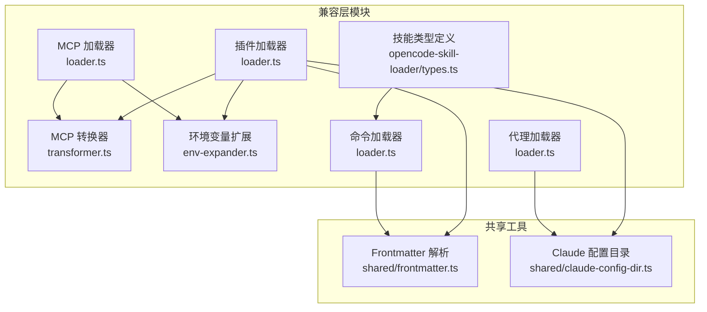
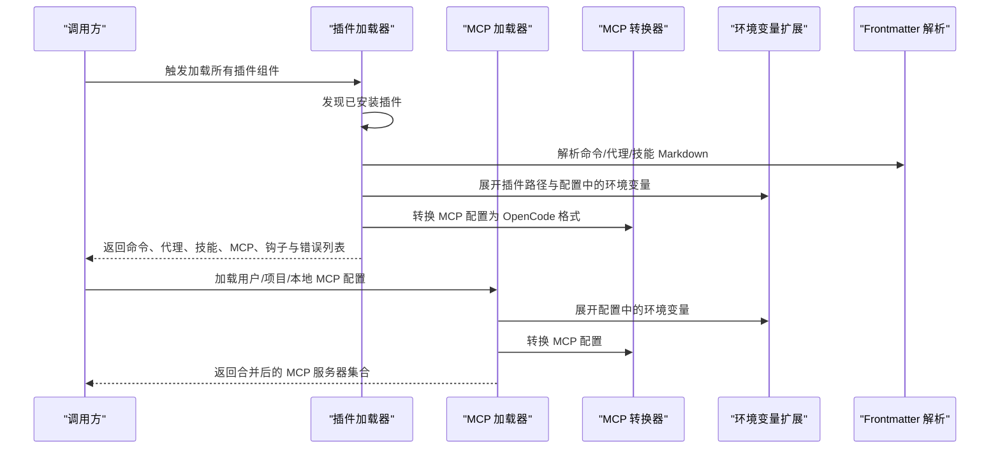
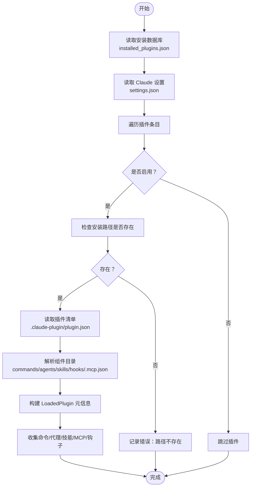
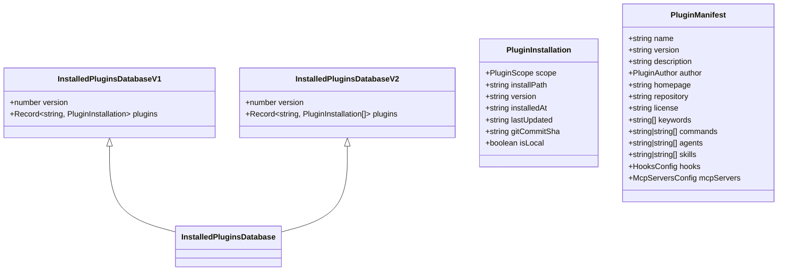
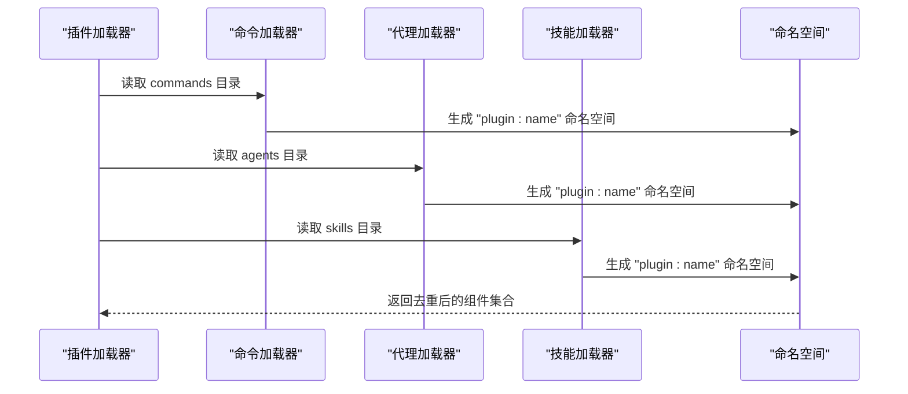
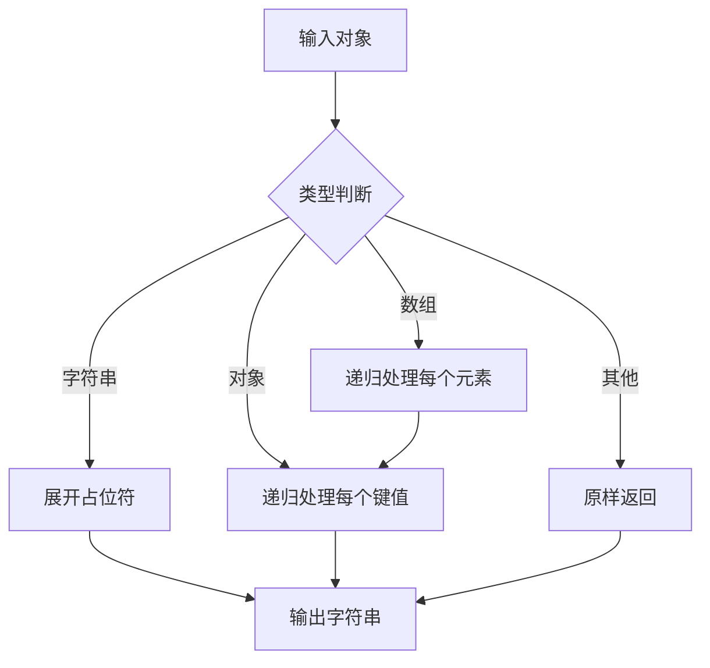
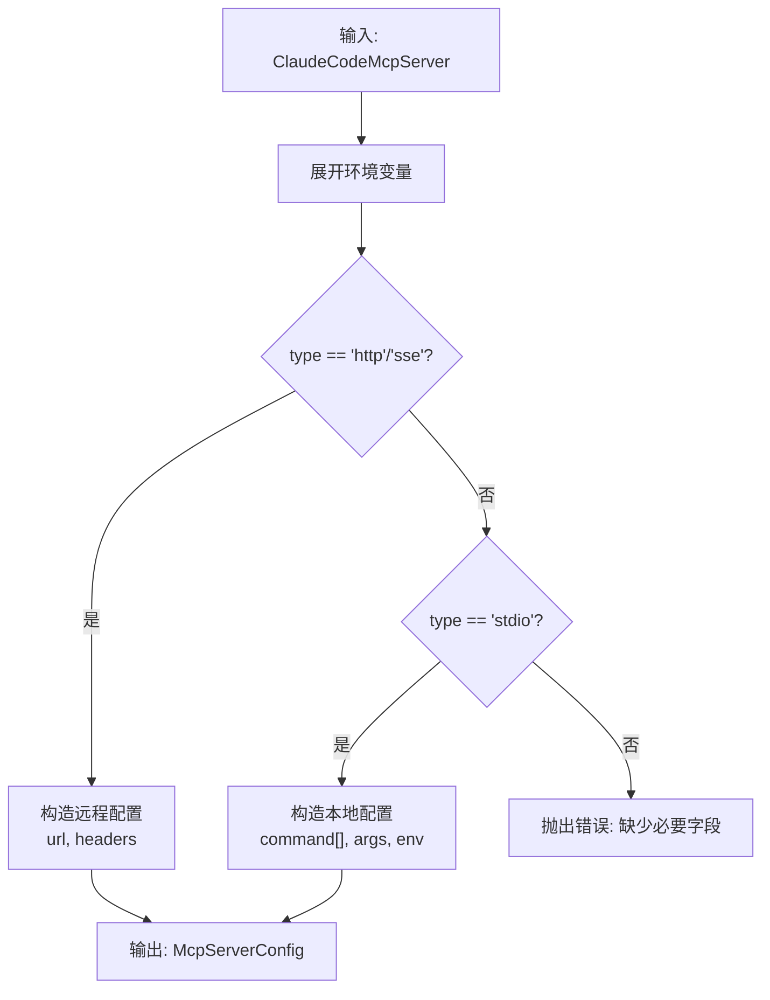
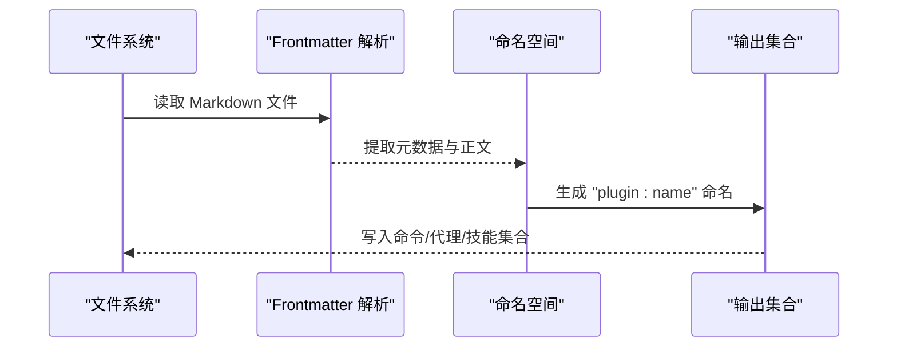
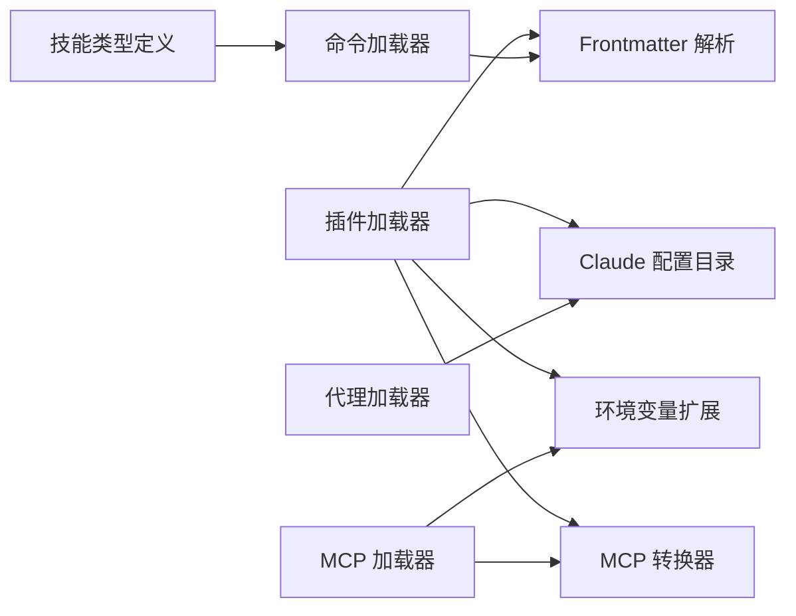

# 兼容层架构设计

<cite>
**本文档引用的文件**
- [src/features/claude-code-plugin-loader/index.ts](file://src/features/claude-code-plugin-loader/index.ts)
- [src/features/claude-code-plugin-loader/loader.ts](file://src/features/claude-code-plugin-loader/loader.ts)
- [src/features/claude-code-plugin-loader/types.ts](file://src/features/claude-code-plugin-loader/types.ts)
- [src/features/claude-code-mcp-loader/index.ts](file://src/features/claude-code-mcp-loader/index.ts)
- [src/features/claude-code-mcp-loader/loader.ts](file://src/features/claude-code-mcp-loader/loader.ts)
- [src/features/claude-code-mcp-loader/transformer.ts](file://src/features/claude-code-mcp-loader/transformer.ts)
- [src/features/claude-code-mcp-loader/env-expander.ts](file://src/features/claude-code-mcp-loader/env-expander.ts)
- [src/features/claude-code-mcp-loader/types.ts](file://src/features/claude-code-mcp-loader/types.ts)
- [src/features/claude-code-agent-loader/index.ts](file://src/features/claude-code-agent-loader/index.ts)
- [src/features/claude-code-agent-loader/loader.ts](file://src/features/claude-code-agent-loader/loader.ts)
- [src/features/claude-code-agent-loader/types.ts](file://src/features/claude-code-agent-loader/types.ts)
- [src/features/claude-code-command-loader/index.ts](file://src/features/claude-code-command-loader/index.ts)
- [src/features/claude-code-command-loader/types.ts](file://src/features/claude-code-command-loader/types.ts)
- [src/features/opencode-skill-loader/types.ts](file://src/features/opencode-skill-loader/types.ts)
- [src/shared/claude-config-dir.ts](file://src/shared/claude-config-dir.ts)
- [src/shared/frontmatter.ts](file://src/shared/frontmatter.ts)
</cite>

## 目录
1. [引言](#引言)
2. [项目结构](#项目结构)
3. [核心组件](#核心组件)
4. [架构总览](#架构总览)
5. [详细组件分析](#详细组件分析)
6. [依赖关系分析](#依赖关系分析)
7. [性能考虑](#性能考虑)
8. [故障排除指南](#故障排除指南)
9. [结论](#结论)

## 引言
本文件面向 Claude Code 兼容层的架构设计，系统性阐述兼容层的整体架构模式、插件发现机制、组件加载流程与命名空间管理策略；同时详细说明插件数据库结构、安装路径解析与环境变量扩展机制，并解释如何将 Claude Code 的插件格式转换为 OpenCode 兼容格式。文档提供多类架构图与组件交互关系说明，帮助读者从高层到实现细节全面理解该兼容层。

## 项目结构
兼容层围绕“插件加载器”“MCP 加载器”“代理加载器”“命令加载器”“技能类型定义”等模块组织，采用按功能域分层的目录结构，便于扩展与维护。

**图表来源**
- [src/features/claude-code-plugin-loader/loader.ts](file://src/features/claude-code-plugin-loader/loader.ts#L1-L487)
- [src/features/claude-code-mcp-loader/loader.ts](file://src/features/claude-code-mcp-loader/loader.ts#L1-L114)
- [src/features/claude-code-mcp-loader/transformer.ts](file://src/features/claude-code-mcp-loader/transformer.ts#L1-L54)
- [src/features/claude-code-mcp-loader/env-expander.ts](file://src/features/claude-code-mcp-loader/env-expander.ts#L1-L28)
- [src/features/claude-code-agent-loader/loader.ts](file://src/features/claude-code-agent-loader/loader.ts#L1-L91)
- [src/features/claude-code-command-loader/loader.ts](file://src/features/claude-code-command-loader/loader.ts#L1-L200)
- [src/features/opencode-skill-loader/types.ts](file://src/features/opencode-skill-loader/types.ts#L1-L39)
- [src/shared/frontmatter.ts](file://src/shared/frontmatter.ts#L1-L32)
- [src/shared/claude-config-dir.ts](file://src/shared/claude-config-dir.ts#L1-L12)

**章节来源**
- [src/features/claude-code-plugin-loader/index.ts](file://src/features/claude-code-plugin-loader/index.ts#L1-L4)
- [src/features/claude-code-mcp-loader/index.ts](file://src/features/claude-code-mcp-loader/index.ts#L1-L12)
- [src/features/claude-code-agent-loader/index.ts](file://src/features/claude-code-agent-loader/index.ts#L1-L3)
- [src/features/claude-code-command-loader/index.ts](file://src/features/claude-code-command-loader/index.ts#L1-L3)

## 核心组件
- 插件加载器：负责发现、解析与加载 Claude Code 插件，生成 OpenCode 兼容的命令、代理、技能、MCP 服务器与钩子配置。
- MCP 加载器：从用户/项目/本地作用域加载 .mcp.json 并转换为 OpenCode SDK 可用的配置。
- MCP 转换器：将 Claude Code 的 MCP 配置转换为 OpenCode 的本地/远程 MCP 配置。
- 环境变量扩展器：递归展开对象中的环境变量占位符，支持默认值语法。
- 代理加载器：从用户与项目目录加载代理定义。
- 命令加载器：从 Markdown 文件中解析命令模板与元数据。
- 技能类型定义：为技能内容与元数据提供类型约束，支撑命令化展示。

**章节来源**
- [src/features/claude-code-plugin-loader/loader.ts](file://src/features/claude-code-plugin-loader/loader.ts#L147-L486)
- [src/features/claude-code-mcp-loader/loader.ts](file://src/features/claude-code-mcp-loader/loader.ts#L69-L103)
- [src/features/claude-code-mcp-loader/transformer.ts](file://src/features/claude-code-mcp-loader/transformer.ts#L9-L53)
- [src/features/claude-code-mcp-loader/env-expander.ts](file://src/features/claude-code-mcp-loader/env-expander.ts#L1-L28)
- [src/features/claude-code-agent-loader/loader.ts](file://src/features/claude-code-agent-loader/loader.ts#L70-L91)
- [src/features/claude-code-command-loader/types.ts](file://src/features/claude-code-command-loader/types.ts#L19-L47)
- [src/features/opencode-skill-loader/types.ts](file://src/features/opencode-skill-loader/types.ts#L6-L39)

## 架构总览
兼容层通过“发现—解析—转换—合并”的流水线，将 Claude Code 的插件生态无缝映射到 OpenCode 生态。下图展示了主要组件之间的交互关系与数据流向。

**图表来源**
- [src/features/claude-code-plugin-loader/loader.ts](file://src/features/claude-code-plugin-loader/loader.ts#L147-L486)
- [src/features/claude-code-mcp-loader/loader.ts](file://src/features/claude-code-mcp-loader/loader.ts#L69-L103)
- [src/features/claude-code-mcp-loader/transformer.ts](file://src/features/claude-code-mcp-loader/transformer.ts#L9-L53)
- [src/features/claude-code-mcp-loader/env-expander.ts](file://src/features/claude-code-mcp-loader/env-expander.ts#L1-L28)
- [src/shared/frontmatter.ts](file://src/shared/frontmatter.ts#L10-L31)

## 详细组件分析

### 插件发现与加载流程
插件发现基于 Claude Code 的安装数据库与设置文件，结合命名空间策略生成 OpenCode 兼容的组件集合。

**图表来源**
- [src/features/claude-code-plugin-loader/loader.ts](file://src/features/claude-code-plugin-loader/loader.ts#L147-L216)
- [src/features/claude-code-plugin-loader/loader.ts](file://src/features/claude-code-plugin-loader/loader.ts#L101-L114)
- [src/features/claude-code-plugin-loader/loader.ts](file://src/features/claude-code-plugin-loader/loader.ts#L191-L210)

**章节来源**
- [src/features/claude-code-plugin-loader/loader.ts](file://src/features/claude-code-plugin-loader/loader.ts#L147-L216)
- [src/features/claude-code-plugin-loader/types.ts](file://src/features/claude-code-plugin-loader/types.ts#L13-L45)

### 插件数据库结构与安装路径解析
- 数据库版本：v1（直接对象）与 v2（数组）两种结构，兼容历史与当前格式。
- 安装路径：默认位于用户主目录下的特定子路径，可通过环境变量覆盖。
- 清单路径：插件根目录下的特定子路径，用于声明插件元信息与组件路径。

**图表来源**
- [src/features/claude-code-plugin-loader/types.ts](file://src/features/claude-code-plugin-loader/types.ts#L27-L78)

**章节来源**
- [src/features/claude-code-plugin-loader/types.ts](file://src/features/claude-code-plugin-loader/types.ts#L8-L45)
- [src/features/claude-code-plugin-loader/types.ts](file://src/features/claude-code-plugin-loader/types.ts#L60-L78)

### 命名空间管理策略
- 命令命名：使用“插件名:命令名”的命名空间，避免冲突。
- 代理命名：使用“插件名:代理名”的命名空间，确保唯一性。
- 技能作为命令：将技能包装为命令模板，命名同样采用“插件名:技能名”的命名空间。
- MCP 服务器命名：在转换后统一使用“插件名:服务器名”的命名空间。

**图表来源**
- [src/features/claude-code-plugin-loader/loader.ts](file://src/features/claude-code-plugin-loader/loader.ts#L233-L234)
- [src/features/claude-code-plugin-loader/loader.ts](file://src/features/claude-code-plugin-loader/loader.ts#L358-L359)
- [src/features/claude-code-plugin-loader/loader.ts](file://src/features/claude-code-plugin-loader/loader.ts#L296-L297)

**章节来源**
- [src/features/claude-code-plugin-loader/loader.ts](file://src/features/claude-code-plugin-loader/loader.ts#L233-L234)
- [src/features/claude-code-plugin-loader/loader.ts](file://src/features/claude-code-plugin-loader/loader.ts#L358-L359)
- [src/features/claude-code-plugin-loader/loader.ts](file://src/features/claude-code-plugin-loader/loader.ts#L296-L297)

### 环境变量扩展机制
- 支持字符串、数组与对象的递归展开。
- 占位符语法：`${VAR}` 或 `${VAR:-default}`，若未设置则使用默认值或空字符串。
- 应用场景：插件路径替换、MCP 配置中的命令参数、环境变量注入等。

**图表来源**
- [src/features/claude-code-mcp-loader/env-expander.ts](file://src/features/claude-code-mcp-loader/env-expander.ts#L1-L28)

**章节来源**
- [src/features/claude-code-mcp-loader/env-expander.ts](file://src/features/claude-code-mcp-loader/env-expander.ts#L1-L28)

### MCP 配置转换与兼容
- 类型识别：根据类型字段自动区分本地 stdio 与远程 http/sse。
- 参数校验：远程类型必须提供 URL，本地类型必须提供命令。
- 结构转换：将 Claude Code 的 MCP 配置转换为 OpenCode 的本地/远程配置对象。
- 环境变量展开：在转换前先展开配置中的环境变量。

**图表来源**
- [src/features/claude-code-mcp-loader/transformer.ts](file://src/features/claude-code-mcp-loader/transformer.ts#L9-L53)
- [src/features/claude-code-mcp-loader/types.ts](file://src/features/claude-code-mcp-loader/types.ts#L3-L15)

**章节来源**
- [src/features/claude-code-mcp-loader/transformer.ts](file://src/features/claude-code-mcp-loader/transformer.ts#L9-L53)
- [src/features/claude-code-mcp-loader/types.ts](file://src/features/claude-code-mcp-loader/types.ts#L1-L43)

### 命令与代理的加载与命名空间
- 命令：从 Markdown 文件解析 Frontmatter，生成命令模板与描述，统一命名空间。
- 代理：从用户与项目目录加载，统一命名空间，支持工具配置解析。
- 技能：作为命令加载，包装为指令模板，命名空间与命令一致。

**图表来源**
- [src/features/claude-code-plugin-loader/loader.ts](file://src/features/claude-code-plugin-loader/loader.ts#L235-L265)
- [src/features/claude-code-plugin-loader/loader.ts](file://src/features/claude-code-plugin-loader/loader.ts#L360-L384)
- [src/features/claude-code-plugin-loader/loader.ts](file://src/features/claude-code-plugin-loader/loader.ts#L291-L324)
- [src/shared/frontmatter.ts](file://src/shared/frontmatter.ts#L10-L31)

**章节来源**
- [src/features/claude-code-plugin-loader/loader.ts](file://src/features/claude-code-plugin-loader/loader.ts#L218-L388)
- [src/features/claude-code-agent-loader/loader.ts](file://src/features/claude-code-agent-loader/loader.ts#L22-L68)
- [src/features/claude-code-command-loader/types.ts](file://src/features/claude-code-command-loader/types.ts#L19-L47)

## 依赖关系分析
兼容层内部模块之间存在清晰的职责边界与依赖方向，避免循环依赖并保持高内聚低耦合。

**图表来源**
- [src/features/claude-code-plugin-loader/loader.ts](file://src/features/claude-code-plugin-loader/loader.ts#L1-L26)
- [src/features/claude-code-mcp-loader/loader.ts](file://src/features/claude-code-mcp-loader/loader.ts#L1-L11)
- [src/features/claude-code-agent-loader/loader.ts](file://src/features/claude-code-agent-loader/loader.ts#L1-L7)
- [src/features/claude-code-command-loader/types.ts](file://src/features/claude-code-command-loader/types.ts#L1-L47)
- [src/features/opencode-skill-loader/types.ts](file://src/features/opencode-skill-loader/types.ts#L1-L39)
- [src/shared/frontmatter.ts](file://src/shared/frontmatter.ts#L1-L32)
- [src/shared/claude-config-dir.ts](file://src/shared/claude-config-dir.ts#L1-L12)

**章节来源**
- [src/features/claude-code-plugin-loader/loader.ts](file://src/features/claude-code-plugin-loader/loader.ts#L1-L26)
- [src/features/claude-code-mcp-loader/loader.ts](file://src/features/claude-code-mcp-loader/loader.ts#L1-L11)
- [src/features/claude-code-agent-loader/loader.ts](file://src/features/claude-code-agent-loader/loader.ts#L1-L7)
- [src/features/claude-code-command-loader/types.ts](file://src/features/claude-code-command-loader/types.ts#L1-L47)
- [src/features/opencode-skill-loader/types.ts](file://src/features/opencode-skill-loader/types.ts#L1-L39)

## 性能考虑
- 并行加载：插件组件的加载采用并发 Promise 合并，显著提升整体吞吐。
- 路径与清单解析：仅在必要时读取文件系统，避免重复 IO。
- 环境变量展开：递归处理对象，注意深层嵌套带来的复杂度，建议控制配置深度。
- 错误隔离：对单个插件或配置项的失败进行局部捕获，不影响其他组件加载。

**章节来源**
- [src/features/claude-code-plugin-loader/loader.ts](file://src/features/claude-code-plugin-loader/loader.ts#L467-L473)

## 故障排除指南
- 插件未加载：检查安装数据库是否存在、插件路径是否可访问、是否被设置禁用。
- 命令/代理/技能解析失败：确认 Markdown 文件包含合法的 Frontmatter，且文件编码正确。
- MCP 配置错误：确认类型字段与必要字段匹配（远程需 URL，本地需命令），并检查环境变量是否正确展开。
- 命名冲突：确保插件名与组件名组合唯一，避免同名覆盖。

**章节来源**
- [src/features/claude-code-plugin-loader/loader.ts](file://src/features/claude-code-plugin-loader/loader.ts#L170-L177)
- [src/features/claude-code-plugin-loader/loader.ts](file://src/features/claude-code-plugin-loader/loader.ts#L262-L264)
- [src/features/claude-code-mcp-loader/transformer.ts](file://src/features/claude-code-mcp-loader/transformer.ts#L16-L38)
- [src/features/claude-code-mcp-loader/env-expander.ts](file://src/features/claude-code-mcp-loader/env-expander.ts#L1-L28)

## 结论
该兼容层通过标准化的发现、解析、转换与合并流程，实现了从 Claude Code 插件生态到 OpenCode 生态的平滑迁移。其设计强调可扩展性与健壮性：命名空间策略保证唯一性，环境变量扩展增强灵活性，MCP 转换器确保跨平台一致性，而并发加载与错误隔离提升了整体性能与可用性。未来可在以下方面持续演进：更细粒度的缓存策略、增量更新机制、以及对更多 Claude Code 组件（如 LSP）的兼容支持。