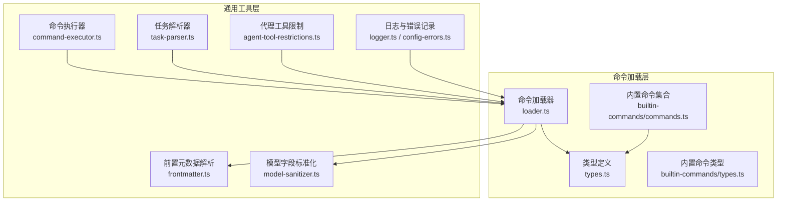
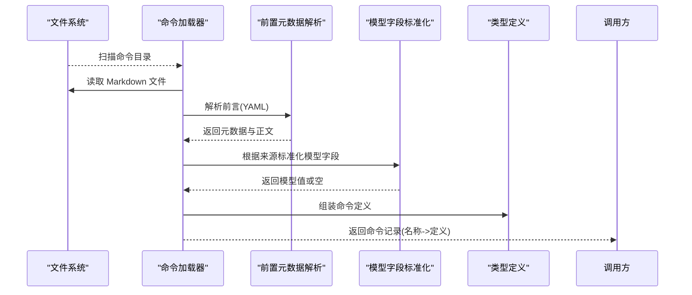
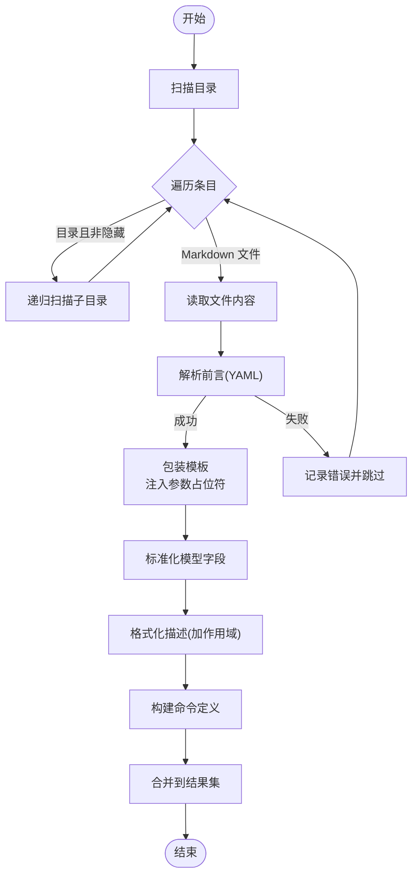
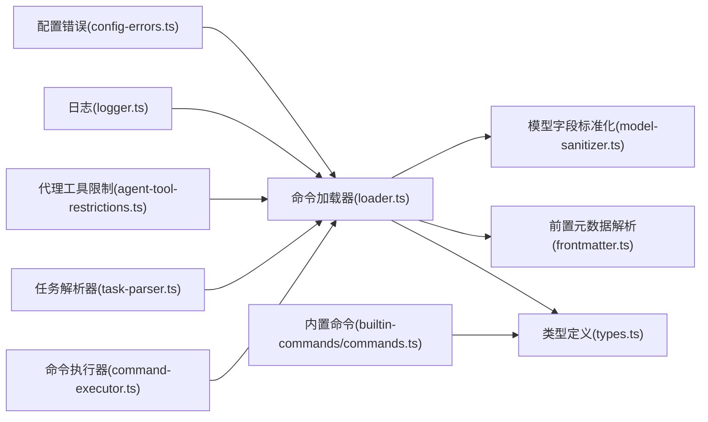

# 命令系统集成

<cite>
**本文引用的文件**
- [src/features/claude-code-command-loader/index.ts](file://src/features/claude-code-command-loader/index.ts)
- [src/features/claude-code-command-loader/loader.ts](file://src/features/claude-code-command-loader/loader.ts)
- [src/features/claude-code-command-loader/types.ts](file://src/features/claude-code-command-loader/types.ts)
- [src/features/builtin-commands/commands.ts](file://src/features/builtin-commands/commands.ts)
- [src/features/builtin-commands/types.ts](file://src/features/builtin-commands/types.ts)
- [src/shared/frontmatter.ts](file://src/shared/frontmatter.ts)
- [src/shared/model-sanitizer.ts](file://src/shared/model-sanitizer.ts)
- [src/shared/command-executor.ts](file://src/shared/command-executor.ts)
- [src/shared/task-parser.ts](file://src/shared/task-parser.ts)
- [src/shared/agent-tool-restrictions.ts](file://src/shared/agent-tool-restrictions.ts)
- [src/shared/config-errors.ts](file://src/shared/config-errors.ts)
- [src/shared/logger.ts](file://src/shared/logger.ts)
</cite>

## 目录
1. [简介](#简介)
2. [项目结构](#项目结构)
3. [核心组件](#核心组件)
4. [架构总览](#架构总览)
5. [详细组件分析](#详细组件分析)
6. [依赖关系分析](#依赖关系分析)
7. [性能考量](#性能考量)
8. [故障排查指南](#故障排查指南)
9. [结论](#结论)

## 简介
本文件面向 Claude Code 命令系统的集成与使用，围绕以下主题展开：命令文件解析（含前置元数据解析）、模板包装与命名空间管理、命令前言处理、代理配置映射与模型字段标准化、命令参数处理、子任务配置与工具限制机制，并提供命令加载失败的诊断与修复建议。目标是帮助开发者在本地或项目级以一致的方式定义、加载与执行命令，同时确保与 OpenCode 生态兼容。

## 项目结构
命令系统由“命令加载器”和“内置命令”两部分组成，配合通用工具模块完成文件解析、模板包装、模型字段标准化、命令执行与任务解析等能力。

图表来源
- [src/features/claude-code-command-loader/loader.ts](file://src/features/claude-code-command-loader/loader.ts#L1-L145)
- [src/features/claude-code-command-loader/types.ts](file://src/features/claude-code-command-loader/types.ts#L1-L47)
- [src/features/builtin-commands/commands.ts](file://src/features/builtin-commands/commands.ts#L1-L109)
- [src/features/builtin-commands/types.ts](file://src/features/builtin-commands/types.ts#L1-L18)
- [src/shared/frontmatter.ts](file://src/shared/frontmatter.ts#L1-L32)
- [src/shared/model-sanitizer.ts](file://src/shared/model-sanitizer.ts#L1-L13)
- [src/shared/command-executor.ts](file://src/shared/command-executor.ts#L1-L226)
- [src/shared/task-parser.ts](file://src/shared/task-parser.ts#L1-L314)
- [src/shared/agent-tool-restrictions.ts](file://src/shared/agent-tool-restrictions.ts#L1-L57)
- [src/shared/logger.ts](file://src/shared/logger.ts#L1-L21)
- [src/shared/config-errors.ts](file://src/shared/config-errors.ts#L1-L19)

章节来源
- [src/features/claude-code-command-loader/index.ts](file://src/features/claude-code-command-loader/index.ts#L1-L3)
- [src/features/claude-code-command-loader/loader.ts](file://src/features/claude-code-command-loader/loader.ts#L1-L145)
- [src/features/claude-code-command-loader/types.ts](file://src/features/claude-code-command-loader/types.ts#L1-L47)
- [src/features/builtin-commands/commands.ts](file://src/features/builtin-commands/commands.ts#L1-L109)
- [src/features/builtin-commands/types.ts](file://src/features/builtin-commands/types.ts#L1-L18)
- [src/shared/frontmatter.ts](file://src/shared/frontmatter.ts#L1-L32)
- [src/shared/model-sanitizer.ts](file://src/shared/model-sanitizer.ts#L1-L13)
- [src/shared/command-executor.ts](file://src/shared/command-executor.ts#L1-L226)
- [src/shared/task-parser.ts](file://src/shared/task-parser.ts#L1-L314)
- [src/shared/agent-tool-restrictions.ts](file://src/shared/agent-tool-restrictions.ts#L1-L57)
- [src/shared/logger.ts](file://src/shared/logger.ts#L1-L21)
- [src/shared/config-errors.ts](file://src/shared/config-errors.ts#L1-L19)

## 核心组件
- 命令加载器：递归扫描用户/项目/OpenCode 全局/项目级命令目录，解析 Markdown 前言元数据，包装模板，生成统一的命令定义，并按作用域合并。
- 内置命令：提供一组开箱即用的命令定义，便于快速启用常用工作流。
- 前言解析：从 Markdown 中提取 YAML 前言，安全解析并分离正文内容。
- 模型字段标准化：根据命令来源（Claude Code 或 OpenCode）对模型字段进行裁剪或保留。
- 命令执行器：支持在受控环境中执行命令，替换环境变量并处理嵌入式命令占位符。
- 任务解析器：将任务文档解析为可调度的任务图，支持波次分组与冲突检测。
- 代理工具限制：为不同代理设定工具可用性白/黑名单，保障会话安全与一致性。
- 日志与错误：集中记录加载过程中的异常，便于诊断与修复。

章节来源
- [src/features/claude-code-command-loader/loader.ts](file://src/features/claude-code-command-loader/loader.ts#L11-L145)
- [src/features/builtin-commands/commands.ts](file://src/features/builtin-commands/commands.ts#L10-L109)
- [src/shared/frontmatter.ts](file://src/shared/frontmatter.ts#L10-L31)
- [src/shared/model-sanitizer.ts](file://src/shared/model-sanitizer.ts#L3-L12)
- [src/shared/command-executor.ts](file://src/shared/command-executor.ts#L50-L118)
- [src/shared/task-parser.ts](file://src/shared/task-parser.ts#L258-L283)
- [src/shared/agent-tool-restrictions.ts](file://src/shared/agent-tool-restrictions.ts#L49-L56)
- [src/shared/logger.ts](file://src/shared/logger.ts#L9-L16)
- [src/shared/config-errors.ts](file://src/shared/config-errors.ts#L6-L18)

## 架构总览
命令系统通过“加载器 + 类型 + 工具”的组合实现端到端的命令生命周期管理：从磁盘读取、解析前言、标准化字段、包装模板、合并作用域，最终供上层调用方使用。

图表来源
- [src/features/claude-code-command-loader/loader.ts](file://src/features/claude-code-command-loader/loader.ts#L62-L97)
- [src/shared/frontmatter.ts](file://src/shared/frontmatter.ts#L10-L31)
- [src/shared/model-sanitizer.ts](file://src/shared/model-sanitizer.ts#L3-L12)
- [src/features/claude-code-command-loader/types.ts](file://src/features/claude-code-command-loader/types.ts#L19-L46)

## 详细组件分析

### 命令加载器与模板包装
- 作用域与命名空间
  - 支持四种作用域：用户、项目、OpenCode 全局、OpenCode 项目。加载时为每个命令生成“命名空间:命令名”的唯一键，避免同名冲突。
  - 合并顺序：OpenCode 项目优先于全局，再项目，最后用户，保证覆盖关系符合预期。
- 前言处理
  - 使用安全模式解析 YAML 前言，若无前言则正文作为默认内容；解析失败则标记错误并跳过该命令文件。
- 模板包装
  - 将正文包裹在固定指令块中，并注入参数占位符，形成可被后续执行器使用的模板。
- 模型字段标准化
  - 来源为 Claude Code 时忽略模型字段；来自 OpenCode 时保留并清理空白字符。
- 描述格式化
  - 在描述前添加“(作用域)”前缀，便于识别来源。

图表来源
- [src/features/claude-code-command-loader/loader.ts](file://src/features/claude-code-command-loader/loader.ts#L11-L101)
- [src/shared/frontmatter.ts](file://src/shared/frontmatter.ts#L10-L31)
- [src/shared/model-sanitizer.ts](file://src/shared/model-sanitizer.ts#L3-L12)

章节来源
- [src/features/claude-code-command-loader/loader.ts](file://src/features/claude-code-command-loader/loader.ts#L11-L145)
- [src/features/claude-code-command-loader/types.ts](file://src/features/claude-code-command-loader/types.ts#L1-L47)
- [src/shared/frontmatter.ts](file://src/shared/frontmatter.ts#L1-L32)
- [src/shared/model-sanitizer.ts](file://src/shared/model-sanitizer.ts#L1-L13)

### 内置命令与禁用机制
- 内置命令集合
  - 提供一组预置命令定义，包含描述、模板与参数提示，便于直接启用常用工作流。
- 禁用机制
  - 通过配置禁用某些内置命令，加载时过滤掉被禁用项，仅返回开放命令。

章节来源
- [src/features/builtin-commands/commands.ts](file://src/features/builtin-commands/commands.ts#L94-L109)
- [src/features/builtin-commands/types.ts](file://src/features/builtin-commands/types.ts#L13-L17)

### 命令前言处理与模型字段标准化
- 前言解析
  - 使用安全 YAML 解析方案，防止代码执行风险；解析失败时返回解析错误标记，便于上层处理。
- 模型字段标准化
  - Claude Code 来源：丢弃模型字段（交由上层策略决定）。
  - OpenCode 来源：保留并清理空白字符，确保兼容性。

章节来源
- [src/shared/frontmatter.ts](file://src/shared/frontmatter.ts#L10-L31)
- [src/shared/model-sanitizer.ts](file://src/shared/model-sanitizer.ts#L3-L12)

### 命令参数处理与模板占位符
- 参数占位符
  - 加载器在模板中注入参数占位符，用于后续执行阶段替换真实参数。
- 嵌入式命令解析
  - 命令执行器支持在文本中解析并执行嵌入式命令，递归解析多层嵌入，控制最大深度，避免无限递归。

章节来源
- [src/features/claude-code-command-loader/loader.ts](file://src/features/claude-code-command-loader/loader.ts#L66-L72)
- [src/shared/command-executor.ts](file://src/shared/command-executor.ts#L184-L225)

### 子任务配置与工具限制机制
- 子任务配置
  - 命令定义支持子任务开关，用于指示是否将命令拆分为多个子任务执行。
- 代理工具限制
  - 针对不同代理设置工具可用性白/黑名单，确保在受限会话中正确约束工具调用。

章节来源
- [src/features/claude-code-command-loader/types.ts](file://src/features/claude-code-command-loader/types.ts#L24-L28)
- [src/shared/agent-tool-restrictions.ts](file://src/shared/agent-tool-restrictions.ts#L49-L56)

### 任务解析与波次分组（与命令执行衔接）
- 任务解析
  - 将任务文档解析为结构化对象，包含风险等级、依赖、文件清单、验收标准与 TDD 注释等。
- 波次分组
  - 基于依赖关系与文件冲突检测，将任务分组成可并行执行的波次，提升执行效率。

章节来源
- [src/shared/task-parser.ts](file://src/shared/task-parser.ts#L258-L283)
- [src/shared/task-parser.ts](file://src/shared/task-parser.ts#L246-L256)
- [src/shared/task-parser.ts](file://src/shared/task-parser.ts#L224-L244)

## 依赖关系分析
命令系统各模块之间的依赖关系如下：

图表来源
- [src/features/claude-code-command-loader/loader.ts](file://src/features/claude-code-command-loader/loader.ts#L1-L145)
- [src/features/claude-code-command-loader/types.ts](file://src/features/claude-code-command-loader/types.ts#L1-L47)
- [src/features/builtin-commands/commands.ts](file://src/features/builtin-commands/commands.ts#L1-L109)
- [src/shared/frontmatter.ts](file://src/shared/frontmatter.ts#L1-L32)
- [src/shared/model-sanitizer.ts](file://src/shared/model-sanitizer.ts#L1-L13)
- [src/shared/command-executor.ts](file://src/shared/command-executor.ts#L1-L226)
- [src/shared/task-parser.ts](file://src/shared/task-parser.ts#L1-L314)
- [src/shared/agent-tool-restrictions.ts](file://src/shared/agent-tool-restrictions.ts#L1-L57)
- [src/shared/logger.ts](file://src/shared/logger.ts#L1-L21)
- [src/shared/config-errors.ts](file://src/shared/config-errors.ts#L1-L19)

章节来源
- [src/features/claude-code-command-loader/loader.ts](file://src/features/claude-code-command-loader/loader.ts#L1-L145)
- [src/features/builtin-commands/commands.ts](file://src/features/builtin-commands/commands.ts#L1-L109)
- [src/shared/command-executor.ts](file://src/shared/command-executor.ts#L1-L226)
- [src/shared/task-parser.ts](file://src/shared/task-parser.ts#L1-L314)
- [src/shared/agent-tool-restrictions.ts](file://src/shared/agent-tool-restrictions.ts#L1-L57)
- [src/shared/logger.ts](file://src/shared/logger.ts#L1-L21)
- [src/shared/config-errors.ts](file://src/shared/config-errors.ts#L1-L19)

## 性能考量
- 并发加载：命令加载器在不同作用域之间采用并发加载，减少总体等待时间。
- 递归扫描：对深层目录树进行递归扫描，注意磁盘 IO 开销；可通过合理组织命令目录层级降低扫描成本。
- 前言解析：使用安全 YAML 解析，避免潜在的复杂度问题；解析失败时快速跳过，不影响整体加载。
- 模板包装：仅做字符串拼接与占位符注入，开销极低。
- 命令执行：嵌入式命令解析有最大深度限制，防止深度过大导致的性能问题。

## 故障排查指南
- 常见问题与定位
  - 命令目录不可访问：检查路径是否存在、权限是否足够；加载器会记录失败日志。
  - 命令文件读取失败：确认文件编码为 UTF-8，且无损坏。
  - 前言解析失败：检查 YAML 语法是否正确；解析器会标记解析错误并跳过该文件。
  - 模型字段不生效：确认命令来源类型；Claude Code 来源会忽略模型字段。
  - 命令执行失败：检查嵌入式命令是否可执行、环境变量是否正确替换。
- 诊断步骤
  - 查看日志文件位置，定位具体报错时间点与上下文。
  - 清理配置加载错误缓存，重新加载验证。
  - 对单个命令文件进行最小化复现，逐步排除问题。
- 修复建议
  - 修正 YAML 语法或移除无效标签。
  - 调整命令文件命名与目录结构，避免隐藏目录干扰。
  - 在 OpenCode 来源下提供明确的模型字符串，去除多余空白。
  - 在需要交互的命令中提供必要的环境变量或非交互替代方案。

章节来源
- [src/shared/logger.ts](file://src/shared/logger.ts#L9-L16)
- [src/shared/config-errors.ts](file://src/shared/config-errors.ts#L6-L18)
- [src/shared/frontmatter.ts](file://src/shared/frontmatter.ts#L23-L30)
- [src/shared/command-executor.ts](file://src/shared/command-executor.ts#L184-L225)

## 结论
本命令系统通过“加载器 + 类型 + 工具”的清晰分层，实现了命令文件的可靠解析、模板包装与命名空间管理，同时提供了与 OpenCode 的兼容性与扩展能力。结合内置命令、任务解析与工具限制机制，能够满足从简单到复杂的命令编排需求。遇到加载失败时，可依据日志与错误缓存快速定位问题并修复。