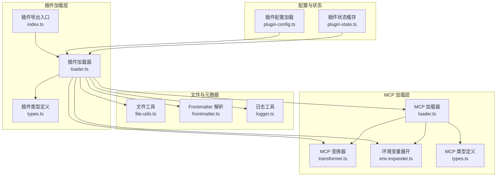
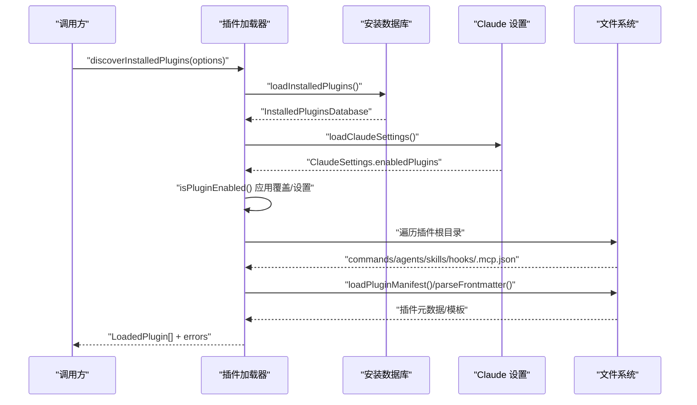
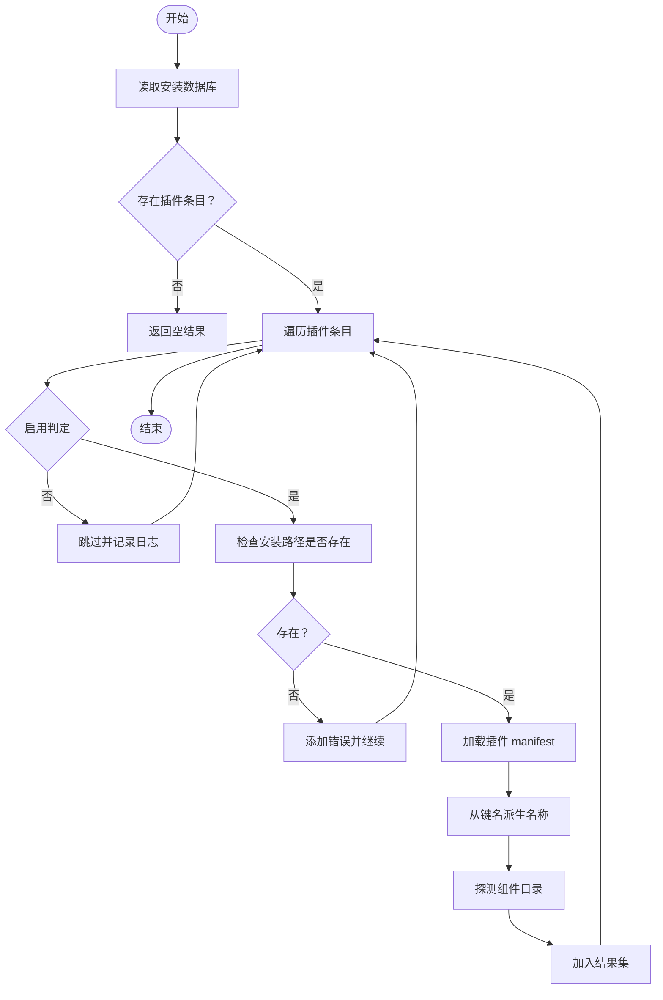
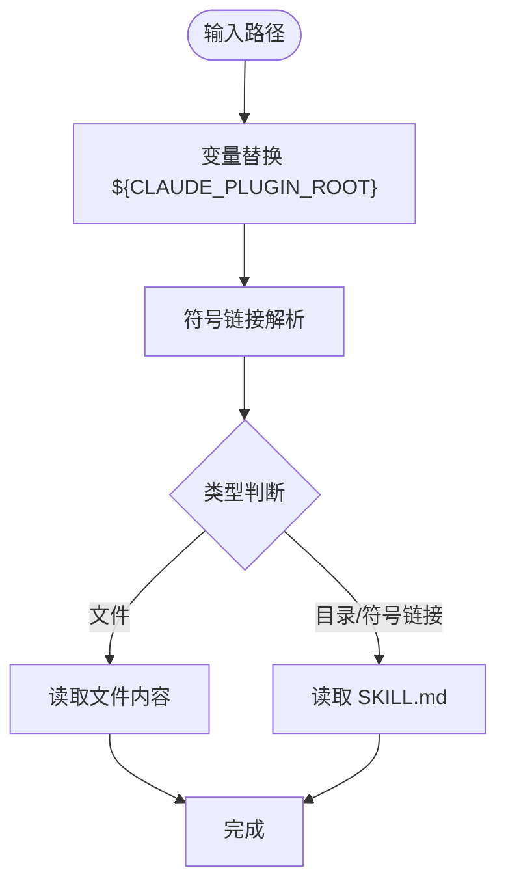
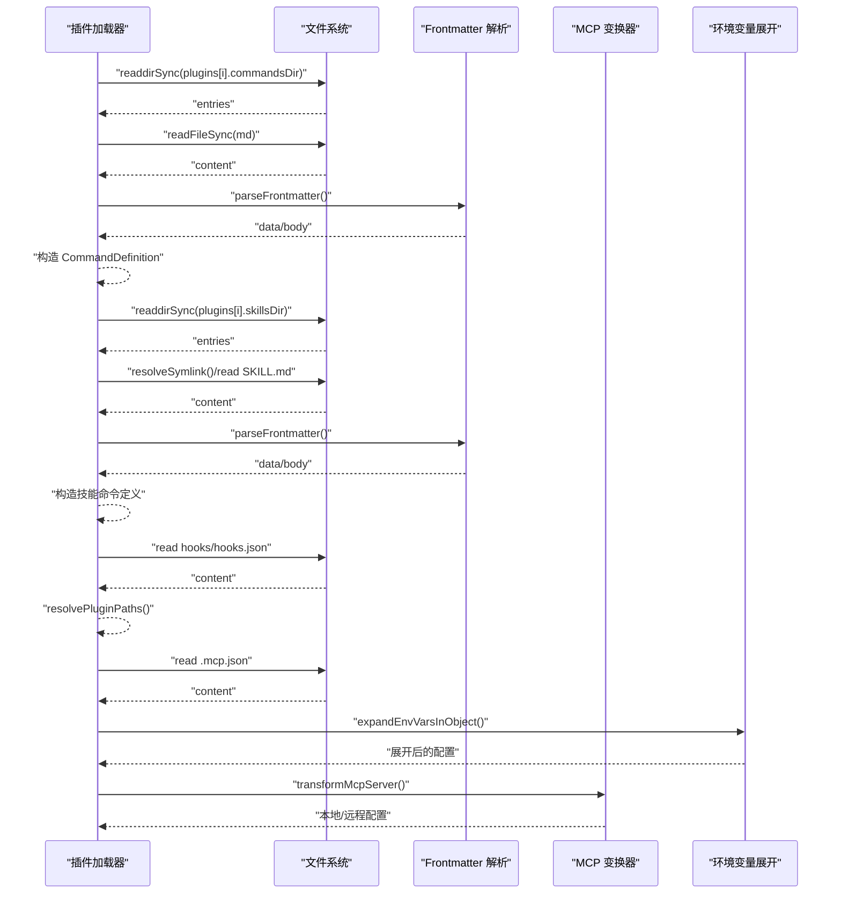
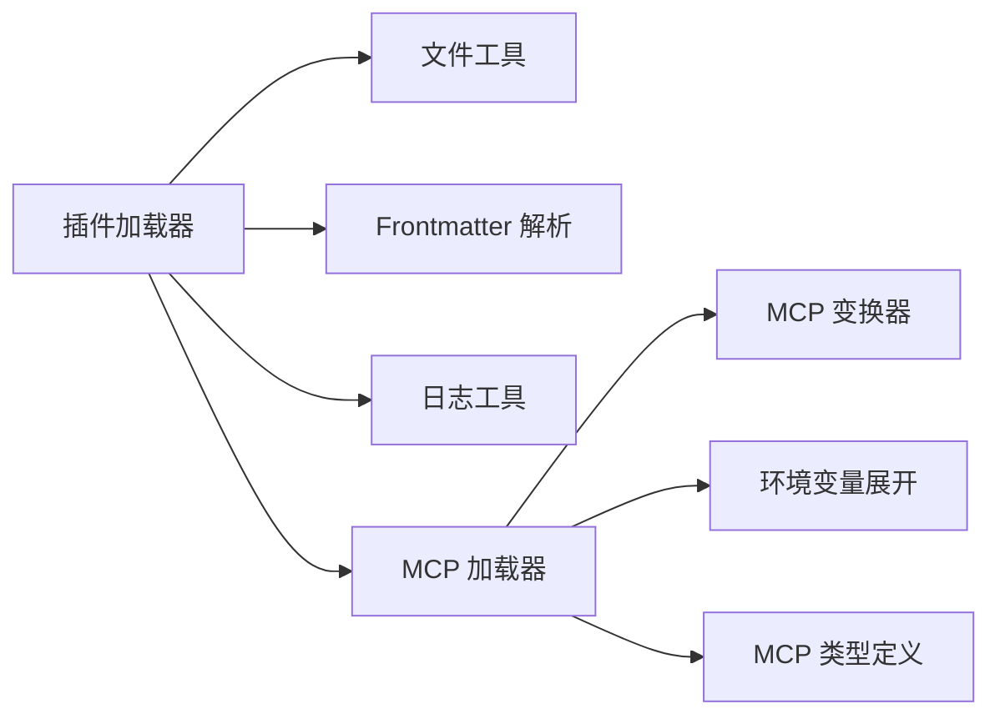

# 插件加载系统

<cite>
**本文档引用的文件**
- [src/features/claude-code-plugin-loader/index.ts](file://src/features/claude-code-plugin-loader/index.ts)
- [src/features/claude-code-plugin-loader/loader.ts](file://src/features/claude-code-plugin-loader/loader.ts)
- [src/features/claude-code-plugin-loader/types.ts](file://src/features/claude-code-plugin-loader/types.ts)
- [src/shared/file-utils.ts](file://src/shared/file-utils.ts)
- [src/shared/frontmatter.ts](file://src/shared/frontmatter.ts)
- [src/shared/logger.ts](file://src/shared/logger.ts)
- [src/features/claude-code-mcp-loader/loader.ts](file://src/features/claude-code-mcp-loader/loader.ts)
- [src/features/claude-code-mcp-loader/transformer.ts](file://src/features/claude-code-mcp-loader/transformer.ts)
- [src/features/claude-code-mcp-loader/env-expander.ts](file://src/features/claude-code-mcp-loader/env-expander.ts)
- [src/features/claude-code-mcp-loader/types.ts](file://src/features/claude-code-mcp-loader/types.ts)
- [src/features/claude-code-command-loader/types.ts](file://src/features/claude-code-command-loader/types.ts)
- [src/features/opencode-skill-loader/types.ts](file://src/features/opencode-skill-loader/types.ts)
- [src/plugin-config.ts](file://src/plugin-config.ts)
- [src/plugin-state.ts](file://src/plugin-state.ts)
</cite>

## 目录
1. [简介](#简介)
2. [项目结构](#项目结构)
3. [核心组件](#核心组件)
4. [架构总览](#架构总览)
5. [详细组件分析](#详细组件分析)
6. [依赖关系分析](#依赖关系分析)
7. [性能考虑](#性能考虑)
8. [故障排除指南](#故障排除指南)
9. [结论](#结论)

## 简介
本文件面向 Claude Code 插件加载系统，系统性阐述以下主题：
- 插件发现算法：如何从安装数据库中解析已安装插件，并结合用户设置与覆盖选项进行启用状态判定
- 安装数据库解析：支持 v1/v2 两种格式，兼容历史与当前版本
- 插件启用状态管理：优先级策略（覆盖 > 设置 > 默认）
- 插件路径解析与符号链接处理：统一的路径变量替换、符号链接解析与文件系统遍历
- 文件系统遍历机制：命令、代理、技能、钩子、MCP 配置的目录扫描与内容提取
- 元数据提取与版本管理：从 manifest 与 frontmatter 中提取信息，推导名称与版本
- 作用域识别：区分 user/project/local/managed 等作用域
- 错误处理与调试：日志记录、错误收集与定位方法

## 项目结构
该系统围绕“插件加载器”为中心，配合“MCP 加载器”“文件工具”“前端面提取”等辅助模块协同工作。

**图表来源**
- [src/features/claude-code-plugin-loader/loader.ts](file://src/features/claude-code-plugin-loader/loader.ts#L1-L487)
- [src/features/claude-code-plugin-loader/types.ts](file://src/features/claude-code-plugin-loader/types.ts#L1-L211)
- [src/shared/file-utils.ts](file://src/shared/file-utils.ts#L1-L41)
- [src/shared/frontmatter.ts](file://src/shared/frontmatter.ts#L1-L32)
- [src/features/claude-code-mcp-loader/loader.ts](file://src/features/claude-code-mcp-loader/loader.ts#L1-L114)
- [src/features/claude-code-mcp-loader/transformer.ts](file://src/features/claude-code-mcp-loader/transformer.ts#L1-L54)
- [src/features/claude-code-mcp-loader/env-expander.ts](file://src/features/claude-code-mcp-loader/env-expander.ts#L1-L28)
- [src/features/claude-code-mcp-loader/types.ts](file://src/features/claude-code-mcp-loader/types.ts#L1-L43)
- [src/plugin-config.ts](file://src/plugin-config.ts#L1-L136)
- [src/plugin-state.ts](file://src/plugin-state.ts#L1-L31)

**章节来源**
- [src/features/claude-code-plugin-loader/index.ts](file://src/features/claude-code-plugin-loader/index.ts#L1-L4)
- [src/features/claude-code-plugin-loader/loader.ts](file://src/features/claude-code-plugin-loader/loader.ts#L1-L487)
- [src/features/claude-code-plugin-loader/types.ts](file://src/features/claude-code-plugin-loader/types.ts#L1-L211)

## 核心组件
- 插件加载器：负责发现、解析、加载插件及其组件（命令、代理、技能、钩子、MCP 服务器）
- 安装数据库解析：读取 installed_plugins.json，兼容 v1/v2 结构
- 启用状态管理：基于覆盖选项与 Claude 设置决定是否加载
- 路径解析与符号链接处理：统一变量替换、路径规范化、符号链接解析
- 文件系统遍历：按约定目录扫描，提取 frontmatter 与模板内容
- 元数据与版本管理：从 manifest 与 frontmatter 推导名称、版本、描述等
- 作用域识别：区分 user/project/local/managed
- 错误处理与调试：集中日志记录、错误收集与定位

**章节来源**
- [src/features/claude-code-plugin-loader/loader.ts](file://src/features/claude-code-plugin-loader/loader.ts#L147-L216)
- [src/features/claude-code-plugin-loader/types.ts](file://src/features/claude-code-plugin-loader/types.ts#L8-L45)

## 架构总览
插件加载系统采用“发现 -> 过滤 -> 组件加载”的流水线式设计，支持多源配置与并发加载。

**图表来源**
- [src/features/claude-code-plugin-loader/loader.ts](file://src/features/claude-code-plugin-loader/loader.ts#L147-L216)
- [src/features/claude-code-plugin-loader/loader.ts](file://src/features/claude-code-plugin-loader/loader.ts#L101-L114)
- [src/features/claude-code-plugin-loader/loader.ts](file://src/features/claude-code-plugin-loader/loader.ts#L218-L269)

## 详细组件分析

### 插件发现与启用状态管理
- 发现算法
  - 读取安装数据库 installed_plugins.json，兼容 v1（对象）与 v2（数组）两种结构
  - 对于 v2，取每个插件的第一个安装条目作为当前使用版本
  - 基于插件键（pluginKey）推导启用状态
- 启用状态判定优先级
  - 覆盖选项（options.enabledPluginsOverride）优先
  - 次之 Claude settings.json 的 enabledPlugins
  - 默认启用
- 路径与作用域
  - 从安装条目读取 installPath、scope、version
  - 若安装路径不存在，记录错误并跳过
  - 尝试读取插件 manifest，缺失时回退到从键名派生名称
- 组件目录探测
  - 自动探测 commands/agents/skills/hooks/.mcp.json 等存在性并记录路径

**图表来源**
- [src/features/claude-code-plugin-loader/loader.ts](file://src/features/claude-code-plugin-loader/loader.ts#L147-L216)
- [src/features/claude-code-plugin-loader/loader.ts](file://src/features/claude-code-plugin-loader/loader.ts#L124-L136)
- [src/features/claude-code-plugin-loader/loader.ts](file://src/features/claude-code-plugin-loader/loader.ts#L101-L114)

**章节来源**
- [src/features/claude-code-plugin-loader/loader.ts](file://src/features/claude-code-plugin-loader/loader.ts#L147-L216)
- [src/features/claude-code-plugin-loader/types.ts](file://src/features/claude-code-plugin-loader/types.ts#L13-L45)

### 安装数据库解析与版本管理
- 数据库结构
  - v1：plugins 为直接对象映射
  - v2：plugins 为数组，取首个元素作为当前版本
- 版本与名称来源
  - 优先使用 manifest.version/name
  - 其次使用安装条目的 version
  - 最后从插件键派生名称（截取 @ 前部分）

**章节来源**
- [src/features/claude-code-plugin-loader/types.ts](file://src/features/claude-code-plugin-loader/types.ts#L27-L45)
- [src/features/claude-code-plugin-loader/types.ts](file://src/features/claude-code-plugin-loader/types.ts#L60-L78)
- [src/features/claude-code-plugin-loader/loader.ts](file://src/features/claude-code-plugin-loader/loader.ts#L116-L122)

### 插件路径解析与符号链接处理
- 路径变量替换
  - 支持将 ${CLAUDE_PLUGIN_ROOT} 替换为插件根目录，用于 manifest 或配置中的相对路径
- 符号链接处理
  - 使用 lstat/readlink 解析符号链接，确保技能目录的真实路径被使用
- 文件系统遍历
  - 命令与代理：仅处理 .md 文件
  - 技能：允许目录或符号链接，解析真实路径后再读取 SKILL.md

**图表来源**
- [src/features/claude-code-plugin-loader/loader.ts](file://src/features/claude-code-plugin-loader/loader.ts#L42-L62)
- [src/shared/file-utils.ts](file://src/shared/file-utils.ts#L17-L27)
- [src/features/claude-code-plugin-loader/loader.ts](file://src/features/claude-code-plugin-loader/loader.ts#L287-L289)

**章节来源**
- [src/features/claude-code-plugin-loader/loader.ts](file://src/features/claude-code-plugin-loader/loader.ts#L42-L62)
- [src/shared/file-utils.ts](file://src/shared/file-utils.ts#L1-L41)
- [src/features/claude-code-plugin-loader/loader.ts](file://src/features/claude-code-plugin-loader/loader.ts#L287-L289)

### 元数据提取与作用域识别
- 元数据来源
  - 插件 manifest：name/version/description/author/homepage/repository/license/keywords 等
  - frontmatter：命令/代理/技能的 YAML 头部信息
- 作用域识别
  - 插件条目包含 scope 字段，支持 user/project/local/managed
  - 加载后的 LoadedPlugin 保留 scope 与 installPath 等字段

**章节来源**
- [src/features/claude-code-plugin-loader/types.ts](file://src/features/claude-code-plugin-loader/types.ts#L8-L21)
- [src/features/claude-code-plugin-loader/types.ts](file://src/features/claude-code-plugin-loader/types.ts#L60-L78)
- [src/shared/frontmatter.ts](file://src/shared/frontmatter.ts#L10-L31)

### 组件加载流程（命令、代理、技能、钩子、MCP）
- 命令加载
  - 扫描 commands 目录，解析 .md frontmatter，生成 CommandDefinition
  - 名称命名空间：plugin:name
- 技能加载
  - 扫描 skills 目录，支持目录/符号链接；解析 SKILL.md，生成命令式定义
  - 模板包裹基础指令与用户参数占位
- 代理加载
  - 扫描 agents 目录，解析 .md frontmatter，生成 AgentConfig
- 钩子配置加载
  - 读取 hooks/hooks.json，解析为 HooksConfig 并进行路径替换
- MCP 服务器加载
  - 读取 .mcp.json，展开环境变量，变换为本地/远程配置
  - 支持 http/sse/stdio 三种类型

**图表来源**
- [src/features/claude-code-plugin-loader/loader.ts](file://src/features/claude-code-plugin-loader/loader.ts#L218-L269)
- [src/features/claude-code-plugin-loader/loader.ts](file://src/features/claude-code-plugin-loader/loader.ts#L271-L328)
- [src/features/claude-code-plugin-loader/loader.ts](file://src/features/claude-code-plugin-loader/loader.ts#L343-L388)
- [src/features/claude-code-plugin-loader/loader.ts](file://src/features/claude-code-plugin-loader/loader.ts#L430-L452)
- [src/features/claude-code-plugin-loader/loader.ts](file://src/features/claude-code-plugin-loader/loader.ts#L390-L428)
- [src/features/claude-code-mcp-loader/transformer.ts](file://src/features/claude-code-mcp-loader/transformer.ts#L9-L53)
- [src/features/claude-code-mcp-loader/env-expander.ts](file://src/features/claude-code-mcp-loader/env-expander.ts#L13-L27)

**章节来源**
- [src/features/claude-code-plugin-loader/loader.ts](file://src/features/claude-code-plugin-loader/loader.ts#L218-L388)
- [src/features/claude-code-plugin-loader/loader.ts](file://src/features/claude-code-plugin-loader/loader.ts#L390-L452)
- [src/features/claude-code-mcp-loader/transformer.ts](file://src/features/claude-code-mcp-loader/transformer.ts#L1-L54)
- [src/features/claude-code-mcp-loader/env-expander.ts](file://src/features/claude-code-mcp-loader/env-expander.ts#L1-L28)

### 并发加载与聚合结果
- 并发策略
  - 命令、技能、代理、钩子配置采用同步加载
  - MCP 服务器采用异步加载
  - 使用 Promise.all 聚合结果
- 返回结构
  - commands/skills/agents/mcpServers/hooksConfigs/plugins/errors

**章节来源**
- [src/features/claude-code-plugin-loader/loader.ts](file://src/features/claude-code-plugin-loader/loader.ts#L464-L486)

## 依赖关系分析
- 内聚性
  - 插件加载器内部职责清晰：发现、过滤、组件加载、错误收集
- 耦合度
  - 与 MCP 加载器通过 transformer/env-expander 协作
  - 与文件工具、frontmatter 解析器、日志工具松耦合
- 关键依赖链
  - 插件加载器 → 文件工具（符号链接/遍历）→ frontmatter（元数据）
  - 插件加载器 → MCP 加载器（MCP 变换/展开）→ 类型定义

**图表来源**
- [src/features/claude-code-plugin-loader/loader.ts](file://src/features/claude-code-plugin-loader/loader.ts#L1-L26)
- [src/features/claude-code-mcp-loader/loader.ts](file://src/features/claude-code-mcp-loader/loader.ts#L1-L11)
- [src/features/claude-code-mcp-loader/transformer.ts](file://src/features/claude-code-mcp-loader/transformer.ts#L1-L7)
- [src/features/claude-code-mcp-loader/env-expander.ts](file://src/features/claude-code-mcp-loader/env-expander.ts#L1-L7)
- [src/features/claude-code-mcp-loader/types.ts](file://src/features/claude-code-mcp-loader/types.ts#L1-L15)

**章节来源**
- [src/features/claude-code-plugin-loader/loader.ts](file://src/features/claude-code-plugin-loader/loader.ts#L1-L26)
- [src/features/claude-code-mcp-loader/loader.ts](file://src/features/claude-code-mcp-loader/loader.ts#L1-L11)

## 性能考虑
- 并发优化
  - 命令/技能/代理/钩子配置采用同步并行加载，减少总体等待时间
  - MCP 服务器采用异步读取与解析，避免阻塞
- I/O 优化
  - 使用 existsSync/readdirSync 在加载前快速判断存在性，减少无效读取
  - 符号链接解析仅在必要路径上执行
- 内存与复杂度
  - 插件条目遍历为 O(N)，组件目录遍历为 O(M)，整体近似 O(N+M)
  - frontmatter 解析与 JSON 解析为常数开销

[本节为通用性能讨论，不直接分析具体文件]

## 故障排除指南
- 常见问题与定位
  - 安装数据库缺失或损坏：检查 installed_plugins.json 是否存在与可解析
  - 插件安装路径不存在：查看错误列表中的 installPath
  - manifest 读取失败：确认 .claude-plugin/plugin.json 存在且格式正确
  - frontmatter 解析失败：检查 .md 文件头部 YAML 格式
  - MCP 配置加载失败：检查 .mcp.json 格式与必需字段（http/sse 需 url，stdio 需 command）
  - 符号链接异常：确认符号链接目标存在且可访问
- 日志与调试
  - 使用日志工具输出详细上下文，包括路径、是否包含 manifest 等
  - 查看临时日志文件位置以定位错误发生点
- 配置与覆盖
  - 通过覆盖选项强制启用/禁用特定插件键
  - 检查 Claude settings.json 的 enabledPlugins 字段

**章节来源**
- [src/shared/logger.ts](file://src/shared/logger.ts#L9-L20)
- [src/features/claude-code-plugin-loader/loader.ts](file://src/features/claude-code-plugin-loader/loader.ts#L70-L77)
- [src/features/claude-code-plugin-loader/loader.ts](file://src/features/claude-code-plugin-loader/loader.ts#L170-L177)
- [src/features/claude-code-plugin-loader/loader.ts](file://src/features/claude-code-plugin-loader/loader.ts#L110-L113)
- [src/features/claude-code-mcp-loader/loader.ts](file://src/features/claude-code-mcp-loader/loader.ts#L29-L43)
- [src/features/claude-code-mcp-loader/transformer.ts](file://src/features/claude-code-mcp-loader/transformer.ts#L16-L38)

## 结论
该插件加载系统以清晰的职责划分与稳健的错误处理为核心，实现了对 Claude Code 插件生态的全面支持。通过并发加载、路径与符号链接处理、frontmatter 元数据提取以及 MCP 配置变换，系统在保证易用性的同时兼顾了扩展性与可维护性。建议在生产环境中结合覆盖选项与日志工具进行持续监控与排障。