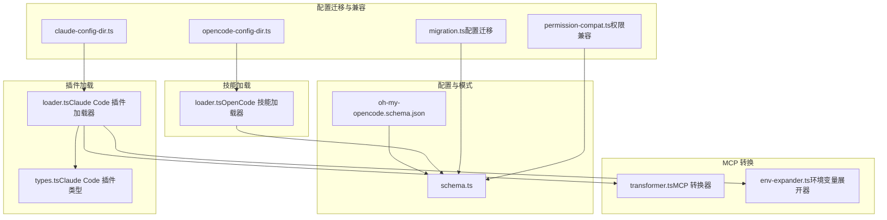
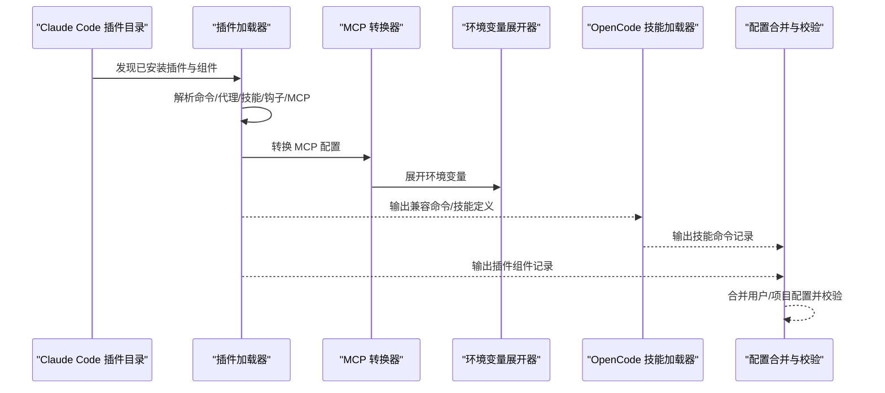
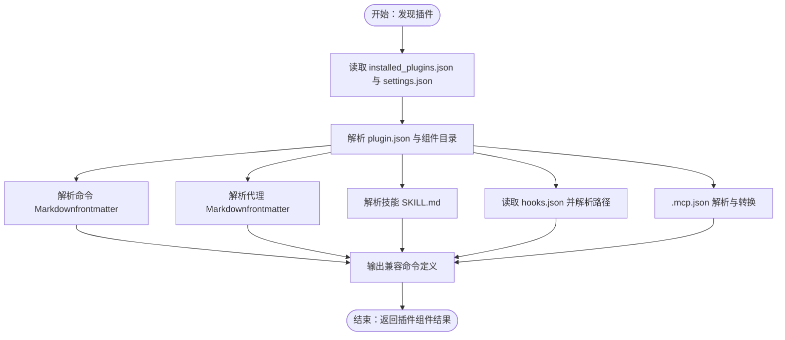
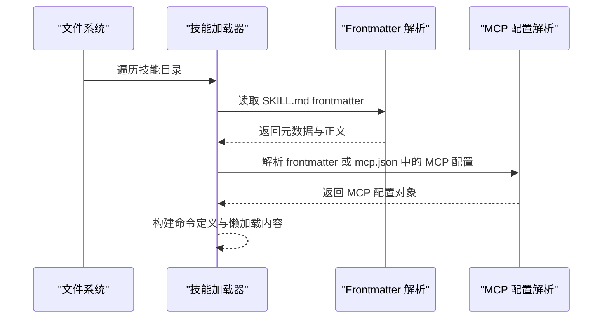
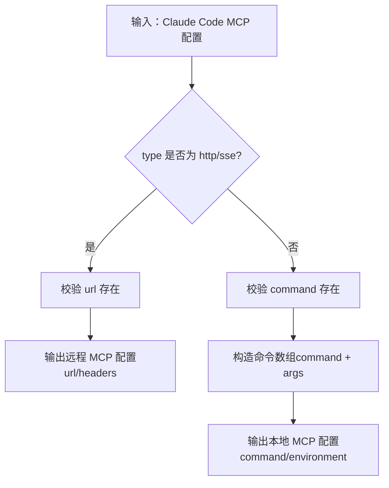
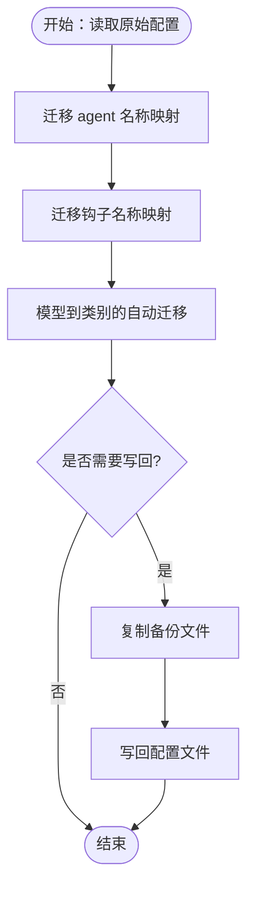
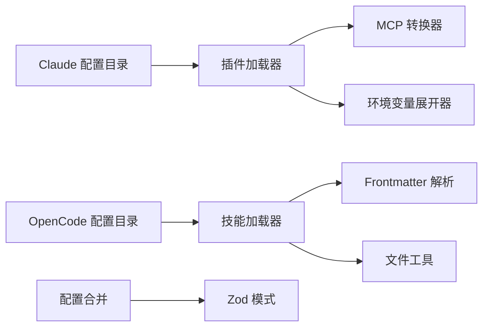

# 迁移指南

<cite>
**本文引用的文件**
- [oh-my-opencode.schema.json](file://assets/oh-my-opencode.schema.json)
- [plugin-config.ts](file://src/plugin-config.ts)
- [migration.ts](file://src/shared/migration.ts)
- [loader.ts（Claude Code 插件加载器）](file://src/features/claude-code-plugin-loader/loader.ts)
- [loader.ts（OpenCode 技能加载器）](file://src/features/opencode-skill-loader/loader.ts)
- [transformer.ts（MCP 转换器）](file://src/features/claude-code-mcp-loader/transformer.ts)
- [env-expander.ts（环境变量展开器）](file://src/features/claude-code-mcp-loader/env-expander.ts)
- [claude-config-dir.ts](file://src/shared/claude-config-dir.ts)
- [opencode-config-dir.ts](file://src/shared/opencode-config-dir.ts)
- [CONFIGURATION-GUIDE.md](file://CONFIGURATION-GUIDE.md)
- [CODEX-MCP-REPLACEMENT-PLAN.md](file://docs/CODEX-MCP-REPLACEMENT-PLAN.md)
- [schema.ts（配置模式）](file://src/config/schema.ts)
- [permission-compat.ts](file://src/shared/permission-compat.ts)
- [types.ts（Claude Code 插件类型）](file://src/features/claude-code-plugin-loader/types.ts)
</cite>

## 目录
1. [简介](#简介)
2. [项目结构](#项目结构)
3. [核心组件](#核心组件)
4. [架构总览](#架构总览)
5. [详细组件分析](#详细组件分析)
6. [依赖关系分析](#依赖关系分析)
7. [性能考量](#性能考量)
8. [故障排查指南](#故障排查指南)
9. [结论](#结论)
10. [附录](#附录)

## 简介
本指南面向从 Claude Code 插件生态迁移到 OpenCode 兼容格式的用户与维护者，目标是帮助您完成从 Claude Code 插件的命令、代理、技能、MCP 服务与钩子等资源的识别、转换与加载，并确保迁移后的配置与行为在 OpenCode 中保持一致或可预期。文档涵盖：
- 插件结构差异与映射关系
- 配置字段映射与兼容性处理
- 加载流程与转换机制
- 迁移检查清单、兼容性测试方法与回滚策略
- 常见问题与最佳实践

## 项目结构
OpenCode 仓库采用按功能域划分的模块化组织方式，与迁移相关的模块主要集中在以下位置：
- 配置与模式：src/config、assets
- 插件加载：src/features/claude-code-plugin-loader
- 技能加载：src/features/opencode-skill-loader
- MCP 转换：src/features/claude-code-mcp-loader
- 配置迁移与兼容：src/shared/migration.ts、src/shared/permission-compat.ts
- 配置目录解析：src/shared/claude-config-dir.ts、src/shared/opencode-config-dir.ts



图表来源
- [oh-my-opencode.schema.json](file://assets/oh-my-opencode.schema.json#L1-L2739)
- [schema.ts（配置模式）](file://src/config/schema.ts#L1-L384)
- [loader.ts（Claude Code 插件加载器）](file://src/features/claude-code-plugin-loader/loader.ts#L1-L487)
- [loader.ts（OpenCode 技能加载器）](file://src/features/opencode-skill-loader/loader.ts#L1-L260)
- [transformer.ts（MCP 转换器）](file://src/features/claude-code-mcp-loader/transformer.ts#L1-L54)
- [env-expander.ts（环境变量展开器）](file://src/features/claude-code-mcp-loader/env-expander.ts#L1-L28)
- [migration.ts（配置迁移）](file://src/shared/migration.ts#L1-L167)
- [permission-compat.ts](file://src/shared/permission-compat.ts#L1-L78)
- [claude-config-dir.ts](file://src/shared/claude-config-dir.ts#L1-L12)
- [opencode-config-dir.ts](file://src/shared/opencode-config-dir.ts#L1-L143)

章节来源
- [oh-my-opencode.schema.json](file://assets/oh-my-opencode.schema.json#L1-L2739)
- [schema.ts（配置模式）](file://src/config/schema.ts#L1-L384)

## 核心组件
- 配置模式与校验：通过 Zod 模式定义 OpenCode 配置结构，包括 agents、categories、hooks、skills 等字段，以及 Claude Code 兼容开关 claude_code。
- 插件加载器：从 Claude Code 插件目录发现已安装插件，解析命令、代理、技能、MCP 与钩子配置，并转换为 OpenCode 兼容格式。
- 技能加载器：从用户与项目目录加载技能，生成命令定义并注入模板与元数据。
- MCP 转换器：将 Claude Code 风格的 MCP 配置转换为 OpenCode 的本地/远程 MCP 配置。
- 配置迁移：提供旧版键名映射、钩子名迁移、模型到类别的自动迁移与写回备份。
- 权限兼容：将旧版 tools 格式迁移为新的 permission 格式。

章节来源
- [plugin-config.ts](file://src/plugin-config.ts#L1-L136)
- [loader.ts（Claude Code 插件加载器）](file://src/features/claude-code-plugin-loader/loader.ts#L1-L487)
- [loader.ts（OpenCode 技能加载器）](file://src/features/opencode-skill-loader/loader.ts#L1-L260)
- [transformer.ts（MCP 转换器）](file://src/features/claude-code-mcp-loader/transformer.ts#L1-L54)
- [migration.ts（配置迁移）](file://src/shared/migration.ts#L1-L167)
- [permission-compat.ts](file://src/shared/permission-compat.ts#L1-L78)

## 架构总览
下图展示了从 Claude Code 插件到 OpenCode 兼容格式的端到端流程：插件发现与解析、MCP 配置转换、技能与命令生成、配置合并与校验。



图表来源
- [loader.ts（Claude Code 插件加载器）](file://src/features/claude-code-plugin-loader/loader.ts#L147-L486)
- [transformer.ts（MCP 转换器）](file://src/features/claude-code-mcp-loader/transformer.ts#L9-L53)
- [env-expander.ts（环境变量展开器）](file://src/features/claude-code-mcp-loader/env-expander.ts#L13-L27)
- [loader.ts（OpenCode 技能加载器）](file://src/features/opencode-skill-loader/loader.ts#L177-L260)
- [plugin-config.ts](file://src/plugin-config.ts#L50-L91)

## 详细组件分析

### 配置模式与字段映射
- OpenCode 配置模式定义了 agents、categories、disabled_mcps、disabled_agents、disabled_skills、disabled_hooks、disabled_commands、claude_code 等字段，以及各字段的类型约束与枚举值。
- schema.json 提供了 JSON Schema，用于静态校验与 IDE 提示；Zod 模式提供运行时校验与类型推断。
- Claude Code 兼容开关 claude_code 控制是否启用插件、命令、技能、代理、钩子与 MCP 的加载。

```mermaid
classDiagram
class OhMyOpenCodeConfig {
+disabled_mcps : string[]
+disabled_agents : string[]
+disabled_skills : string[]
+disabled_hooks : string[]
+disabled_commands : string[]
+agents : AgentOverrides
+categories : CategoriesConfig
+claude_code : ClaudeCodeConfig
+experimental : ExperimentalConfig
+skills : SkillsConfig
}
class AgentOverrides {
+build : AgentOverrideConfig
+plan : AgentOverrideConfig
+Sisyphus : AgentOverrideConfig
+Sisyphus-Junior : AgentOverrideConfig
+OpenCode-Builder : AgentOverrideConfig
+Prometheus(Planner) : AgentOverrideConfig
+Metis(Plan Consultant) : AgentOverrideConfig
+Momus(Plan Reviewer) : AgentOverrideConfig
+oracle : AgentOverrideConfig
+librarian : AgentOverrideConfig
+explore : AgentOverrideConfig
+implementer : AgentOverrideConfig
+archiver : AgentOverrideConfig
+frontend-ui-ux-engineer : AgentOverrideConfig
+document-writer : AgentOverrideConfig
+multimodal-looker : AgentOverrideConfig
+orchestrator-sisyphus : AgentOverrideConfig
}
class AgentOverrideConfig {
+model : string
+variant : string
+category : string
+skills : string[]
+temperature : number
+top_p : number
+prompt : string
+prompt_append : string
+tools : map<string,bool>
+disable : boolean
+description : string
+mode : "subagent"|"primary"|"all"
+color : string
+permission : AgentPermission
}
class AgentPermission {
+edit : "ask"|"allow"|"deny"
+bash : "ask"|"allow"|"deny"|map<string,"ask"|"allow"|"deny">
+webfetch : "ask"|"allow"|"deny"
+doom_loop : "ask"|"allow"|"deny"
+external_directory : "ask"|"allow"|"deny"
}
class CategoriesConfig {
+[categoryName] : CategoryConfig
}
class CategoryConfig {
+model : string
+variant : string
+temperature : number
+top_p : number
+maxTokens : number
+thinking : {type, budgetTokens}
+reasoningEffort : "low"|"medium"|"high"
+textVerbosity : "low"|"medium"|"high"
+tools : map<string,bool>
+prompt_append : string
+defaultSkills : string[]
}
class ClaudeCodeConfig {
+mcp : boolean
+commands : boolean
+skills : boolean
+agents : boolean
+hooks : boolean
+plugins : boolean
+plugins_override : map<string,bool>
}
OhMyOpenCodeConfig --> AgentOverrides
OhMyOpenCodeConfig --> CategoriesConfig
AgentOverrides --> AgentOverrideConfig
AgentOverrideConfig --> AgentPermission
CategoriesConfig --> CategoryConfig
```

图表来源
- [schema.ts（配置模式）](file://src/config/schema.ts#L109-L358)
- [oh-my-opencode.schema.json](file://assets/oh-my-opencode.schema.json#L7-L2739)

章节来源
- [schema.ts（配置模式）](file://src/config/schema.ts#L1-L384)
- [oh-my-opencode.schema.json](file://assets/oh-my-opencode.schema.json#L1-L2739)

### 插件加载器（Claude Code → OpenCode）
- 发现与解析：从 Claude Code 插件数据库与设置中发现插件，解析 manifest、commands、agents、skills、hooks、mcp 等组件。
- 命令与代理：将 Markdown frontmatter 中的命令与代理定义转换为 OpenCode 兼容的 CommandDefinition 与 AgentConfig。
- 技能：将技能目录中的 SKILL.md 转换为命令定义，注入模板与元数据。
- MCP：解析 .mcp.json，展开环境变量与路径，根据类型转换为本地或远程 MCP 配置。
- 钩子：读取 hooks.json 并进行路径解析。



图表来源
- [loader.ts（Claude Code 插件加载器）](file://src/features/claude-code-plugin-loader/loader.ts#L147-L486)

章节来源
- [loader.ts（Claude Code 插件加载器）](file://src/features/claude-code-plugin-loader/loader.ts#L1-L487)
- [types.ts（Claude Code 插件类型）](file://src/features/claude-code-plugin-loader/types.ts#L1-L211)

### 技能加载器（OpenCode）
- 用户与项目技能：从用户与项目目录加载技能，支持符号链接与多种文件命名约定。
- 模板与元数据：读取 SKILL.md frontmatter，构建命令定义模板，注入基础目录与相对路径规则。
- MCP 配置：支持 frontmatter 与 mcp.json 两种方式声明 MCP 配置。



图表来源
- [loader.ts（OpenCode 技能加载器）](file://src/features/opencode-skill-loader/loader.ts#L58-L122)

章节来源
- [loader.ts（OpenCode 技能加载器）](file://src/features/opencode-skill-loader/loader.ts#L1-L260)

### MCP 转换器与环境变量展开
- 类型判断：根据 type 字段决定是 HTTP/SSE 还是 stdio；HTTP/SSE 需要 url，stdio 需要 command 与 args。
- 环境变量展开：递归遍历对象，将 ${VAR} 与 ${VAR:-default} 展开为进程环境变量值。
- 配置输出：生成 OpenCode 的本地或远程 MCP 配置对象。



图表来源
- [transformer.ts（MCP 转换器）](file://src/features/claude-code-mcp-loader/transformer.ts#L9-L53)
- [env-expander.ts（环境变量展开器）](file://src/features/claude-code-mcp-loader/env-expander.ts#L13-L27)

章节来源
- [transformer.ts（MCP 转换器）](file://src/features/claude-code-mcp-loader/transformer.ts#L1-L54)
- [env-expander.ts（环境变量展开器）](file://src/features/claude-code-mcp-loader/env-expander.ts#L1-L28)

### 配置迁移与兼容
- 旧键名映射：将旧版 agent 名称与钩子名称映射到新名称，如 omo → Sisyphus、OmO-Plan → Prometheus (Planner) 等。
- 模型到类别：根据模型自动推导类别，减少用户配置成本。
- 写回备份：迁移成功后写回配置文件并生成带时间戳的备份文件。
- 权限迁移：将旧版 tools 格式迁移为新的 permission 格式，支持通配符与细粒度控制。



图表来源
- [migration.ts（配置迁移）](file://src/shared/migration.ts#L125-L166)
- [permission-compat.ts](file://src/shared/permission-compat.ts#L46-L77)

章节来源
- [migration.ts（配置迁移）](file://src/shared/migration.ts#L1-L167)
- [permission-compat.ts](file://src/shared/permission-compat.ts#L1-L78)

## 依赖关系分析
- 插件加载器依赖 MCP 转换器与环境变量展开器，以保证 MCP 配置在不同平台与环境下的一致性。
- 技能加载器依赖 frontmatter 解析与文件工具，以正确读取与解析 SKILL.md。
- 配置合并模块依赖 Zod 模式与深度合并工具，确保用户与项目配置的正确合并与校验。
- 配置目录解析模块分别处理 Claude Code 与 OpenCode 的配置路径，避免冲突。



图表来源
- [loader.ts（Claude Code 插件加载器）](file://src/features/claude-code-plugin-loader/loader.ts#L1-L487)
- [loader.ts（OpenCode 技能加载器）](file://src/features/opencode-skill-loader/loader.ts#L1-L260)
- [plugin-config.ts](file://src/plugin-config.ts#L50-L91)
- [claude-config-dir.ts](file://src/shared/claude-config-dir.ts#L1-L12)
- [opencode-config-dir.ts](file://src/shared/opencode-config-dir.ts#L1-L143)

章节来源
- [plugin-config.ts](file://src/plugin-config.ts#L1-L136)
- [claude-config-dir.ts](file://src/shared/claude-config-dir.ts#L1-L12)
- [opencode-config-dir.ts](file://src/shared/opencode-config-dir.ts#L1-L143)

## 性能考量
- 并发加载：插件组件（命令、技能、代理、MCP、钩子）采用并发 Promise 加载，提升整体加载效率。
- 懒加载内容：技能内容采用懒加载接口，实际内容在首次访问时读取，减少内存占用。
- 环境变量展开：递归展开可能带来一定开销，建议在配置中尽量使用必要变量，避免深层嵌套。
- 配置写回：迁移写回操作仅在需要时触发，并生成备份文件，避免频繁 IO。

## 故障排查指南
- 插件未被发现
  - 检查 ~/.claude/plugins/installed_plugins.json 是否存在且可读。
  - 确认 ~/.claude/settings.json 中 enabledPlugins 对应插件键值为 true。
  - 章节来源
    - [loader.ts（Claude Code 插件加载器）](file://src/features/claude-code-plugin-loader/loader.ts#L64-L136)

- MCP 配置无效
  - 确认 .mcp.json 中 type 字段与所需协议匹配（http/sse 需 url，stdio 需 command）。
  - 检查环境变量是否正确展开，必要时在配置中显式提供默认值。
  - 章节来源
    - [transformer.ts（MCP 转换器）](file://src/features/claude-code-mcp-loader/transformer.ts#L16-L38)
    - [env-expander.ts（环境变量展开器）](file://src/features/claude-code-mcp-loader/env-expander.ts#L1-L28)

- 技能加载失败
  - 确认 SKILL.md 文件存在且 frontmatter 正确。
  - 检查技能目录权限与符号链接解析。
  - 章节来源
    - [loader.ts（OpenCode 技能加载器）](file://src/features/opencode-skill-loader/loader.ts#L58-L122)

- 配置校验失败
  - 使用 JSON Schema 与 Zod 模式双重校验，关注报错字段路径与消息。
  - 章节来源
    - [schema.ts（配置模式）](file://src/config/schema.ts#L338-L358)
    - [plugin-config.ts](file://src/plugin-config.ts#L23-L37)

- 权限配置不生效
  - 确认 tools 已迁移为 permission 格式，必要时使用通配符与具体工具组合。
  - 章节来源
    - [permission-compat.ts](file://src/shared/permission-compat.ts#L46-L77)

## 结论
通过本指南，您可以系统地完成从 Claude Code 插件到 OpenCode 兼容格式的迁移。关键在于：
- 明确插件结构差异与映射关系
- 正确进行配置字段迁移与兼容处理
- 利用并发加载与懒加载优化性能
- 建立完善的测试与回滚流程

## 附录

### 迁移检查清单
- [ ] 确认 Claude Code 插件数据库与设置文件存在且可读
- [ ] 确认插件 manifest 与组件目录结构符合规范
- [ ] 确认 .mcp.json 协议类型与必要字段完整
- [ ] 确认 SKILL.md frontmatter 与模板结构正确
- [ ] 确认配置模式校验通过（JSON Schema 与 Zod）
- [ ] 确认权限格式已从 tools 迁移为 permission
- [ ] 确认模型到类别的映射符合预期
- [ ] 确认配置写回与备份文件生成成功

### 兼容性测试方法
- 命令与代理：在 OpenCode 中执行命令与代理，确认输出与行为一致。
- 技能：调用技能并验证模板注入与 MCP 配置生效。
- MCP：验证本地/远程 MCP 服务连通性与响应格式。
- 钩子：触发钩子事件，确认钩子配置与路径解析正确。
- 配置：对比迁移前后配置差异，确保关键字段一致。

### 回滚策略
- 迁移写回：迁移模块会在写回前生成带时间戳的备份文件，可直接替换回原配置。
- 配置合并：用户配置与项目配置合并后仍可逐项回退，定位问题配置项。
- 权限回滚：将 permission 格式还原为 tools 格式，或删除 permission 字段。
- 章节来源
  - [migration.ts（配置迁移）](file://src/shared/migration.ts#L152-L163)
  - [plugin-config.ts](file://src/plugin-config.ts#L50-L91)

### 常见迁移问题与解决方案
- 旧版 agent 名称导致无法识别
  - 使用迁移映射将旧名称映射到新名称。
  - 章节来源
    - [migration.ts（配置迁移）](file://src/shared/migration.ts#L5-L24)

- 钩子名称变更导致失效
  - 使用钩子名称映射进行迁移。
  - 章节来源
    - [migration.ts（配置迁移）](file://src/shared/migration.ts#L42-L45)

- tools 格式导致权限不生效
  - 使用权限兼容模块将 tools 迁移为 permission。
  - 章节来源
    - [permission-compat.ts](file://src/shared/permission-compat.ts#L46-L77)

- MCP 配置缺少必要字段
  - 根据类型补充 url（HTTP/SSE）或 command（stdio）。
  - 章节来源
    - [transformer.ts（MCP 转换器）](file://src/features/claude-code-mcp-loader/transformer.ts#L16-L38)

### 最佳实践建议
- 使用 Claude Code 兼容开关 claude_code 控制迁移范围，逐步启用各组件。
- 在项目级与用户级配置中分别设置默认值，确保一致性。
- 对 MCP 服务使用稳定的本地命令或可靠的远程地址，并配置必要的环境变量。
- 对技能与命令模板进行版本化管理，便于回滚与协作。
- 定期备份配置文件，迁移前先生成备份。
- 参考官方配置指南与迁移计划文档，确保迁移步骤与策略符合项目演进方向。
- 章节来源
  - [CONFIGURATION-GUIDE.md](file://CONFIGURATION-GUIDE.md#L1-L289)
  - [CODEX-MCP-REPLACEMENT-PLAN.md](file://docs/CODEX-MCP-REPLACEMENT-PLAN.md#L1-L800)