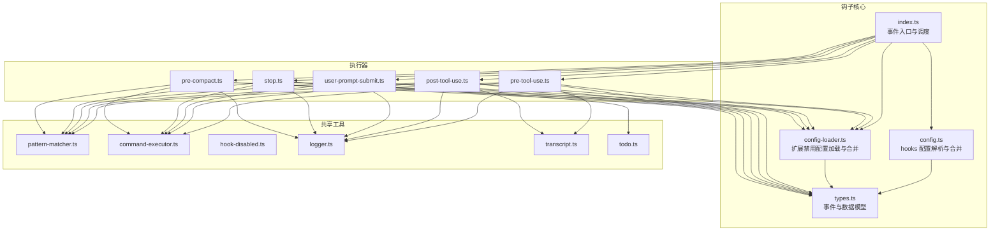
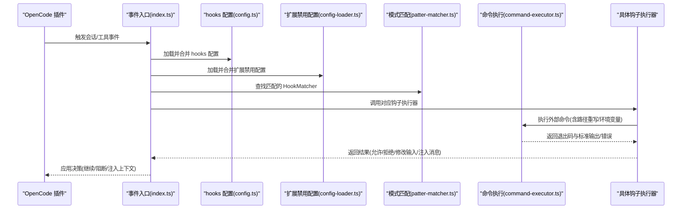
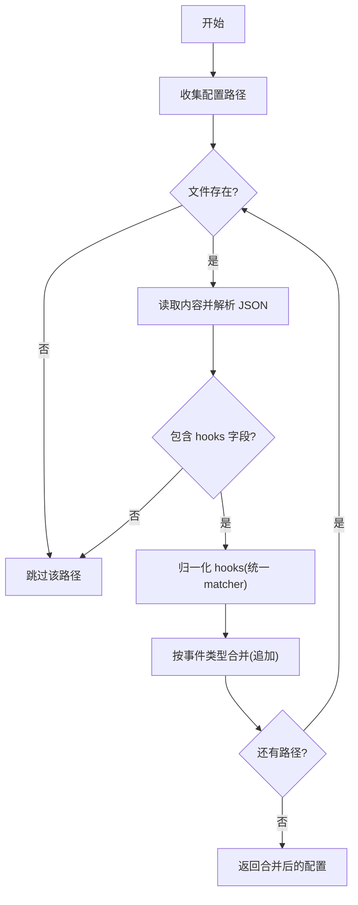
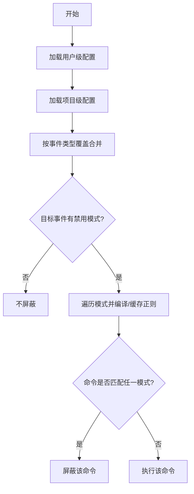
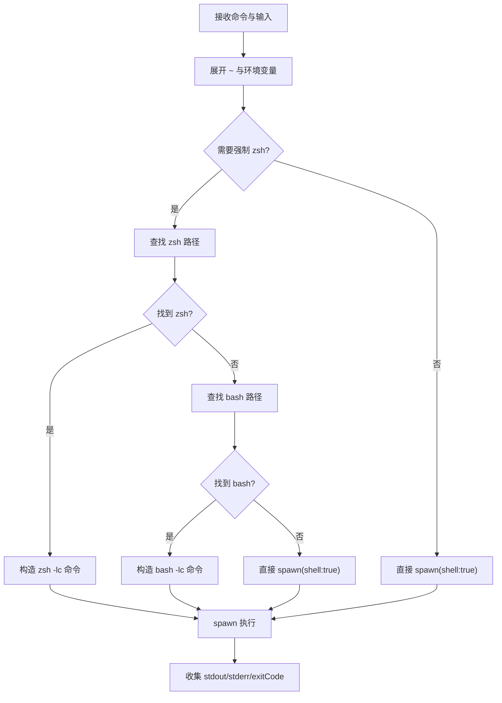
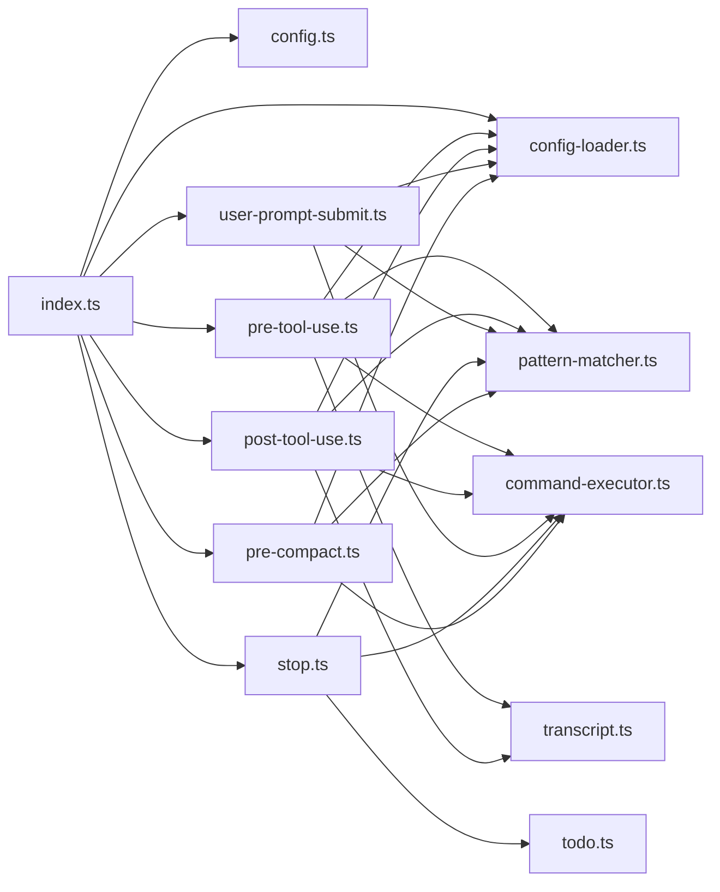

# 钩子配置管理

<cite>
**本文引用的文件**
- [src/hooks/claude-code-hooks/index.ts](file://src/hooks/claude-code-hooks/index.ts)
- [src/hooks/claude-code-hooks/config.ts](file://src/hooks/claude-code-hooks/config.ts)
- [src/hooks/claude-code-hooks/config-loader.ts](file://src/hooks/claude-code-hooks/config-loader.ts)
- [src/hooks/claude-code-hooks/plugin-config.ts](file://src/hooks/claude-code-hooks/plugin-config.ts)
- [src/hooks/claude-code-hooks/types.ts](file://src/hooks/claude-code-hooks/types.ts)
- [src/hooks/claude-code-hooks/pre-tool-use.ts](file://src/hooks/claude-code-hooks/pre-tool-use.ts)
- [src/hooks/claude-code-hooks/post-tool-use.ts](file://src/hooks/claude-code-hooks/post-tool-use.ts)
- [src/hooks/claude-code-hooks/user-prompt-submit.ts](file://src/hooks/claude-code-hooks/user-prompt-submit.ts)
- [src/hooks/claude-code-hooks/stop.ts](file://src/hooks/claude-code-hooks/stop.ts)
- [src/hooks/claude-code-hooks/pre-compact.ts](file://src/hooks/claude-code-hooks/pre-compact.ts)
- [src/hooks/claude-code-hooks/transcript.ts](file://src/hooks/claude-code-hooks/transcript.ts)
- [src/hooks/claude-code-hooks/todo.ts](file://src/hooks/claude-code-hooks/todo.ts)
- [src/shared/pattern-matcher.ts](file://src/shared/pattern-matcher.ts)
- [src/shared/command-executor.ts](file://src/shared/command-executor.ts)
- [src/shared/hook-disabled.ts](file://src/shared/hook-disabled.ts)
- [src/shared/logger.ts](file://src/shared/logger.ts)
</cite>

## 目录
1. [简介](#简介)
2. [项目结构](#项目结构)
3. [核心组件](#核心组件)
4. [架构总览](#架构总览)
5. [详细组件分析](#详细组件分析)
6. [依赖关系分析](#依赖关系分析)
7. [性能考量](#性能考量)
8. [故障排查指南](#故障排查指南)
9. [结论](#结论)
10. [附录](#附录)

## 简介
本文件系统性阐述 Claude Code 钩子配置管理的设计与实现，覆盖以下关键主题：
- 配置文件解析：从用户与项目级 settings.json 解析 hooks 映射；从 ~/.config/opencode/opencode-cc-plugin.json 解析扩展禁用规则。
- 路径重写与插件路径扩展：命令执行前对命令字符串进行路径与环境变量替换（如 ~、$CLAUDE_PROJECT_DIR）。
- 插件路径扩展机制：支持在 Windows 等平台自动选择 zsh 或 bash 登录 shell，确保环境一致。
- 钩子事件映射：将 OpenCode 插件生命周期事件映射到 Claude Code 钩子事件类型。
- 配置合并策略：用户级与项目级配置按优先级合并，禁用列表采用覆盖式合并。
- 禁用钩子过滤：基于正则表达式的命令匹配，支持按事件类型精确禁用。
- 配置验证、错误处理与调试：日志记录、异常捕获、临时转录文件清理、兼容性降级。
- 最佳实践与常见问题：配置建议、排障步骤与注意事项。

## 项目结构
钩子配置管理主要位于 src/hooks/claude-code-hooks 目录，配合 src/shared 提供的通用工具（模式匹配、命令执行、禁用判断、日志等）。

图表来源
- [src/hooks/claude-code-hooks/index.ts](file://src/hooks/claude-code-hooks/index.ts#L36-L401)
- [src/hooks/claude-code-hooks/config.ts](file://src/hooks/claude-code-hooks/config.ts#L81-L103)
- [src/hooks/claude-code-hooks/config-loader.ts](file://src/hooks/claude-code-hooks/config-loader.ts#L55-L75)
- [src/hooks/claude-code-hooks/types.ts](file://src/hooks/claude-code-hooks/types.ts#L23-L29)
- [src/shared/pattern-matcher.ts](file://src/shared/pattern-matcher.ts#L17-L29)
- [src/shared/command-executor.ts](file://src/shared/command-executor.ts#L50-L118)
- [src/shared/hook-disabled.ts](file://src/shared/hook-disabled.ts#L3-L22)
- [src/shared/transcript.ts](file://src/shared/transcript.ts#L132-L238)
- [src/hooks/claude-code-hooks/todo.ts](file://src/hooks/claude-code-hooks/todo.ts#L8-L10)

章节来源
- [src/hooks/claude-code-hooks/index.ts](file://src/hooks/claude-code-hooks/index.ts#L36-L401)
- [src/hooks/claude-code-hooks/config.ts](file://src/hooks/claude-code-hooks/config.ts#L46-L103)
- [src/hooks/claude-code-hooks/config-loader.ts](file://src/hooks/claude-code-hooks/config-loader.ts#L19-L75)

## 核心组件
- 配置解析与合并
  - hooks 配置：从 Claude 设置目录、项目 .claude 目录及可选自定义路径读取 settings.json，提取 hooks 字段并归一化为 HookMatcher 列表，随后按事件类型合并（追加）。
  - 扩展禁用配置：从用户与项目级 opencode-cc-plugin.json 加载 disabledHooks，按事件类型进行覆盖式合并。
- 命令执行与路径扩展
  - 命令预处理：支持 ~ 展开、$CLAUDE_PROJECT_DIR 环境变量替换。
  - Shell 选择：默认启用 zsh 登录 shell（Windows 平台自动禁用），若不可用则回退到 bash 登录 shell。
- 钩子事件映射与执行
  - 将 OpenCode 插件事件映射到 Claude Code 钩子事件（PreToolUse、PostToolUse、UserPromptSubmit、Stop、PreCompact）。
  - 每个事件执行前先检查全局禁用与扩展禁用，再按工具名匹配 HookMatcher，最后调用外部命令执行钩子。
- 调试与日志
  - 统一日志输出至临时目录文件，便于定位问题。
  - PostToolUse 在失败时收集警告消息，必要时注入到输出中。

章节来源
- [src/hooks/claude-code-hooks/config.ts](file://src/hooks/claude-code-hooks/config.ts#L27-L103)
- [src/hooks/claude-code-hooks/config-loader.ts](file://src/hooks/claude-code-hooks/config-loader.ts#L39-L75)
- [src/shared/command-executor.ts](file://src/shared/command-executor.ts#L50-L118)
- [src/hooks/claude-code-hooks/index.ts](file://src/hooks/claude-code-hooks/index.ts#L46-L398)
- [src/shared/logger.ts](file://src/shared/logger.ts#L9-L20)

## 架构总览
下图展示从 OpenCode 插件事件到钩子执行的整体流程，包括配置加载、匹配与命令执行。

图表来源
- [src/hooks/claude-code-hooks/index.ts](file://src/hooks/claude-code-hooks/index.ts#L46-L398)
- [src/hooks/claude-code-hooks/config.ts](file://src/hooks/claude-code-hooks/config.ts#L81-L103)
- [src/hooks/claude-code-hooks/config-loader.ts](file://src/hooks/claude-code-hooks/config-loader.ts#L55-L75)
- [src/shared/pattern-matcher.ts](file://src/shared/pattern-matcher.ts#L17-L29)
- [src/shared/command-executor.ts](file://src/shared/command-executor.ts#L50-L118)

## 详细组件分析

### 配置解析与合并（hooks）
- 归一化与合并
  - 归一化：将原始配置中的 pattern/matcher 字段统一为 matcher 字段，未指定时默认使用通配符。
  - 合并：按事件类型将多个配置源的 HookMatcher 数组拼接（追加），后加载的配置在末尾，具有更高优先级。
- 配置来源
  - Claude 配置目录 settings.json
  - 项目 .claude/settings.json
  - 项目 .claude/settings.local.json
  - 可选自定义路径（存在时插入到最前）

图表来源
- [src/hooks/claude-code-hooks/config.ts](file://src/hooks/claude-code-hooks/config.ts#L46-L103)
- [src/hooks/claude-code-hooks/config.ts](file://src/hooks/claude-code-hooks/config.ts#L20-L44)

章节来源
- [src/hooks/claude-code-hooks/config.ts](file://src/hooks/claude-code-hooks/config.ts#L27-L103)

### 扩展禁用配置（disabledHooks）
- 配置来源
  - 用户级：~/.config/opencode/opencode-cc-plugin.json
  - 项目级：.opencode/opencode-cc-plugin.json
- 合并策略
  - 用户级与项目级分别解析为 disabledHooks 对象，按事件类型进行覆盖式合并（项目级覆盖用户级）。
- 过滤逻辑
  - 按事件类型取出对应的命令模式数组，逐条使用正则匹配命令字符串，命中即跳过该钩子命令。

图表来源
- [src/hooks/claude-code-hooks/config-loader.ts](file://src/hooks/claude-code-hooks/config-loader.ts#L55-L75)
- [src/hooks/claude-code-hooks/config-loader.ts](file://src/hooks/claude-code-hooks/config-loader.ts#L93-L107)

章节来源
- [src/hooks/claude-code-hooks/config-loader.ts](file://src/hooks/claude-code-hooks/config-loader.ts#L7-L17)
- [src/hooks/claude-code-hooks/config-loader.ts](file://src/hooks/claude-code-hooks/config-loader.ts#L39-L75)
- [src/hooks/claude-code-hooks/config-loader.ts](file://src/hooks/claude-code-hooks/config-loader.ts#L77-L107)

### 命令执行与路径重写
- 路径重写
  - 支持 ~ 展开为用户主目录，支持 $CLAUDE_PROJECT_DIR 与 ${CLAUDE_PROJECT_DIR} 环境变量替换。
- Shell 选择与登录环境
  - 默认启用 zsh 登录 shell（forceZsh），若 zsh 不可用则回退到 bash 登录 shell；两者都不可用则直接以 shell: true 方式启动。
  - 通过 -lc 参数确保加载用户登录环境（PATH 等），提升一致性。
- 执行细节
  - 子进程以 cwd 为工作目录，stdin 写入序列化后的输入对象，收集 stdout/stderr 与退出码。

图表来源
- [src/shared/command-executor.ts](file://src/shared/command-executor.ts#L50-L118)

章节来源
- [src/shared/command-executor.ts](file://src/shared/command-executor.ts#L50-L118)
- [src/hooks/claude-code-hooks/plugin-config.ts](file://src/hooks/claude-code-hooks/plugin-config.ts#L8-L12)

### 钩子事件映射与执行
- 事件映射
  - experimental.session.compacting -> PreCompact
  - chat.message -> UserPromptSubmit
  - tool.execute.before -> PreToolUse
  - tool.execute.after -> PostToolUse
  - event.session.idle -> Stop
- 匹配与执行
  - 使用 HookMatcher 的 matcher 字段匹配工具名或通配符，支持 “a|b” 多模式或 “*” 通配。
  - 执行前检查全局禁用与扩展禁用，再按顺序执行外部命令，解析其标准输出的 JSON 结果以决定行为。
- 典型返回语义
  - PreToolUse：允许/拒绝/询问；可修改输入；可设置继续/停止原因/抑制输出/系统消息。
  - PostToolUse：可阻断；可附加消息/警告；可注入额外上下文；可控制继续/停止。
  - UserPromptSubmit：可阻断；可注入合成消息片段；可修改消息部件。
  - Stop：可阻断；可切换 stop_hook_active；可注入提示词；可调整权限模式。
  - PreCompact：可注入上下文；可控制继续/停止。

章节来源
- [src/hooks/claude-code-hooks/index.ts](file://src/hooks/claude-code-hooks/index.ts#L42-L398)
- [src/shared/pattern-matcher.ts](file://src/shared/pattern-matcher.ts#L3-L29)
- [src/hooks/claude-code-hooks/types.ts](file://src/hooks/claude-code-hooks/types.ts#L6-L29)

### 预执行钩子（PreToolUse）
- 输入构建：将工具名转换为规范形式，将输入对象转为 snake_case，附加会话、权限、转录路径等字段。
- 执行策略：按匹配顺序依次执行命令，遇到阻断（exitCode=2）立即返回拒绝；遇到询问（exitCode=1）返回“询问”；否则尝试解析 JSON 输出，优先使用新字段，兼容旧字段映射。
- 结果应用：若返回允许且包含 modifiedInput，则更新后续工具调用参数。

章节来源
- [src/hooks/claude-code-hooks/pre-tool-use.ts](file://src/hooks/claude-code-hooks/pre-tool-use.ts#L46-L172)

### 后执行钩子（PostToolUse）
- 输入构建：优先通过 API 获取完整会话转录并生成临时 Claude Code 兼容格式文件，否则回退到追加式转录文件。
- 执行策略：收集所有命令输出作为消息；当命令返回阻断（exitCode=2）时，将 stderr 作为警告；解析 JSON 输出以决定阻断/继续/抑制输出/系统消息等。
- 清理机制：无论成功与否，最终删除临时转录文件，避免磁盘累积。

章节来源
- [src/hooks/claude-code-hooks/post-tool-use.ts](file://src/hooks/claude-code-hooks/post-tool-use.ts#L44-L199)
- [src/hooks/claude-code-hooks/transcript.ts](file://src/hooks/claude-code-hooks/transcript.ts#L132-L238)

### 用户提示提交钩子（UserPromptSubmit）
- 特殊场景：若为子会话或提示中已包含特定标签，则跳过钩子。
- 执行策略：将用户提示文本与会话信息打包，执行命令；若输出以特定标签包裹则直接作为消息，否则自动包裹；非零退出码时尝试解析 JSON 以决定阻断。

章节来源
- [src/hooks/claude-code-hooks/user-prompt-submit.ts](file://src/hooks/claude-code-hooks/user-prompt-submit.ts#L35-L117)

### 停止钩子（Stop）
- 状态管理：维护 per-session 的 stop_hook_active 状态，用于后续钩子判断。
- 执行策略：根据输出决定阻断、切换状态、注入提示词或调整权限模式；若在错误或中断前后，阻断可能被忽略。

章节来源
- [src/hooks/claude-code-hooks/stop.ts](file://src/hooks/claude-code-hooks/stop.ts#L39-L118)

### 预压缩钩子（PreCompact）
- 上下文注入：从命令输出收集上下文字符串，支持两种格式（新增字段或旧字段），可提前终止并返回继续/停止控制。

章节来源
- [src/hooks/claude-code-hooks/pre-compact.ts](file://src/hooks/claude-code-hooks/pre-compact.ts#L25-L109)

## 依赖关系分析
- 组件耦合
  - index.ts 作为统一入口，依赖 config.ts、config-loader.ts、各事件执行器与共享工具。
  - 执行器依赖 pattern-matcher.ts 进行工具名匹配、command-executor.ts 执行外部命令、config-loader.ts 进行禁用过滤。
- 外部依赖
  - child_process：用于 spawn 子进程执行命令。
  - 文件系统：读写配置、转录与待办文件。
- 循环依赖
  - 未发现循环依赖；模块间为单向依赖。

图表来源
- [src/hooks/claude-code-hooks/index.ts](file://src/hooks/claude-code-hooks/index.ts#L1-L401)
- [src/hooks/claude-code-hooks/config.ts](file://src/hooks/claude-code-hooks/config.ts#L1-L103)
- [src/hooks/claude-code-hooks/config-loader.ts](file://src/hooks/claude-code-hooks/config-loader.ts#L1-L108)
- [src/shared/pattern-matcher.ts](file://src/shared/pattern-matcher.ts#L1-L30)
- [src/shared/command-executor.ts](file://src/shared/command-executor.ts#L1-L226)
- [src/hooks/claude-code-hooks/transcript.ts](file://src/hooks/claude-code-hooks/transcript.ts#L1-L253)
- [src/hooks/claude-code-hooks/todo.ts](file://src/hooks/claude-code-hooks/todo.ts#L1-L77)

章节来源
- [src/hooks/claude-code-hooks/index.ts](file://src/hooks/claude-code-hooks/index.ts#L1-L401)

## 性能考量
- 正则缓存：对禁用模式的正则表达式进行缓存，避免重复编译带来的开销。
- 命令执行：外部命令串行执行，避免并发导致的资源竞争；在 PostToolUse 中聚合消息与警告，减少多次 I/O。
- 转录构建：优先通过 API 获取完整历史，失败时回退到最小化构建，保证稳定性与性能平衡。
- 日志：仅追加写入临时文件，避免频繁打开关闭造成性能损耗。

章节来源
- [src/hooks/claude-code-hooks/config-loader.ts](file://src/hooks/claude-code-hooks/config-loader.ts#L77-L91)
- [src/hooks/claude-code-hooks/post-tool-use.ts](file://src/hooks/claude-code-hooks/post-tool-use.ts#L88-L194)
- [src/hooks/claude-code-hooks/transcript.ts](file://src/hooks/claude-code-hooks/transcript.ts#L132-L238)
- [src/shared/logger.ts](file://src/shared/logger.ts#L9-L20)

## 故障排查指南
- 配置未生效
  - 检查配置文件路径是否存在与可读（Claude 配置目录 settings.json、.claude/settings.json、settings.local.json）。
  - 确认 hooks 字段存在且格式正确；确认 matcher 字段已归一化。
- 钩子被意外禁用
  - 检查扩展禁用配置中 disabledHooks 是否包含目标事件与命令模式；确认正则是否正确匹配。
  - 使用 isHookCommandDisabled 的匹配逻辑进行验证。
- 命令执行失败
  - 检查命令是否包含 ~ 或 $CLAUDE_PROJECT_DIR，确认已被正确替换。
  - 确认 zsh/bas h 登录 shell 是否可用；必要时手动指定 zshPath。
  - 查看日志文件定位错误信息。
- 转录相关问题
  - 若通过 API 获取转录失败，将回退到最小化构建；检查 API 调用与网络环境。
  - 确保临时转录文件在 finally 中被删除，避免磁盘占用。
- 权限与阻断
  - PreToolUse/PostToolUse/Stop 的阻断由命令退出码与 JSON 输出共同决定；检查命令返回值与输出格式。

章节来源
- [src/hooks/claude-code-hooks/config.ts](file://src/hooks/claude-code-hooks/config.ts#L81-L103)
- [src/hooks/claude-code-hooks/config-loader.ts](file://src/hooks/claude-code-hooks/config-loader.ts#L93-L107)
- [src/shared/command-executor.ts](file://src/shared/command-executor.ts#L50-L118)
- [src/shared/logger.ts](file://src/shared/logger.ts#L9-L20)
- [src/hooks/claude-code-hooks/post-tool-use.ts](file://src/hooks/claude-code-hooks/post-tool-use.ts#L195-L198)
- [src/hooks/claude-code-hooks/transcript.ts](file://src/hooks/claude-code-hooks/transcript.ts#L245-L252)

## 结论
本钩子配置管理方案通过清晰的配置解析与合并、稳健的命令执行与路径扩展、以及完善的禁用过滤与事件映射，实现了对 Claude Code 钩子的灵活控制与可观测性。结合日志与转录机制，能够在复杂场景下保持稳定与可调试性。建议在生产环境中遵循最佳实践，合理使用禁用模式与上下文注入，以获得更安全高效的开发体验。

## 附录

### 配置文件与路径
- Claude hooks 配置
  - 用户级：Claude 配置目录下的 settings.json
  - 项目级：.claude/settings.json 与 .claude/settings.local.json
  - 自定义路径：可通过参数传入，存在时优先使用
- 扩展禁用配置
  - 用户级：~/.config/opencode/opencode-cc-plugin.json
  - 项目级：.opencode/opencode-cc-plugin.json

章节来源
- [src/hooks/claude-code-hooks/config.ts](file://src/hooks/claude-code-hooks/config.ts#L46-L58)
- [src/hooks/claude-code-hooks/config-loader.ts](file://src/hooks/claude-code-hooks/config-loader.ts#L19-L23)

### 数据模型与事件类型
- 事件类型：PreToolUse、PostToolUse、UserPromptSubmit、Stop、PreCompact
- 关键接口：HookMatcher、HookCommand、各类输入/输出接口
- 兼容字段：支持旧版 decision/reason 与新版 hookSpecificOutput 字段

章节来源
- [src/hooks/claude-code-hooks/types.ts](file://src/hooks/claude-code-hooks/types.ts#L6-L29)
- [src/hooks/claude-code-hooks/types.ts](file://src/hooks/claude-code-hooks/types.ts#L110-L131)
- [src/hooks/claude-code-hooks/types.ts](file://src/hooks/claude-code-hooks/types.ts#L170-L186)