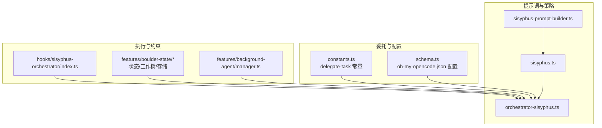
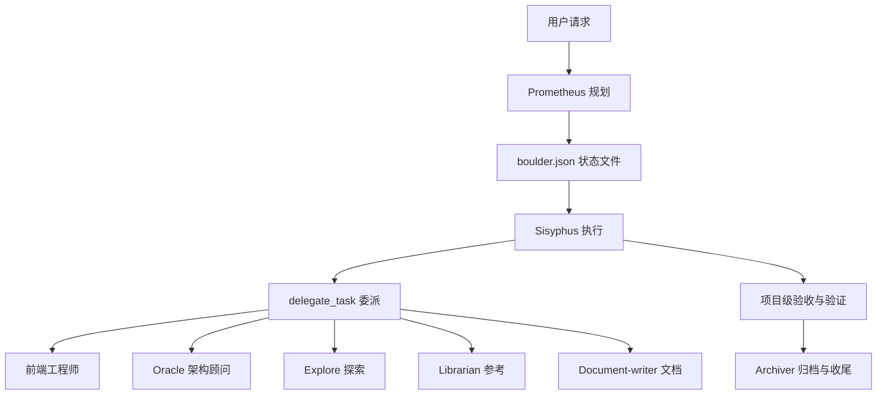
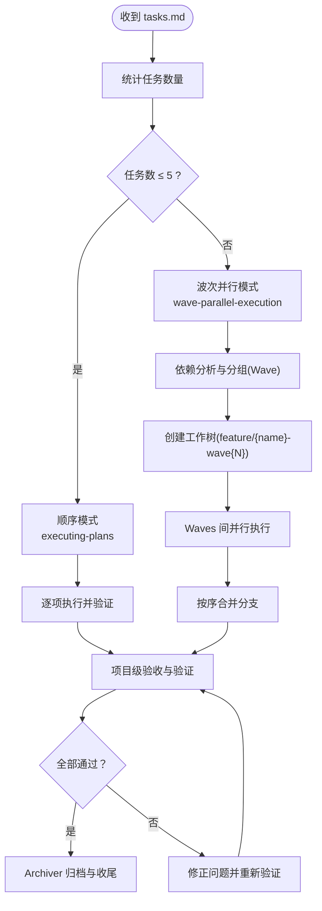
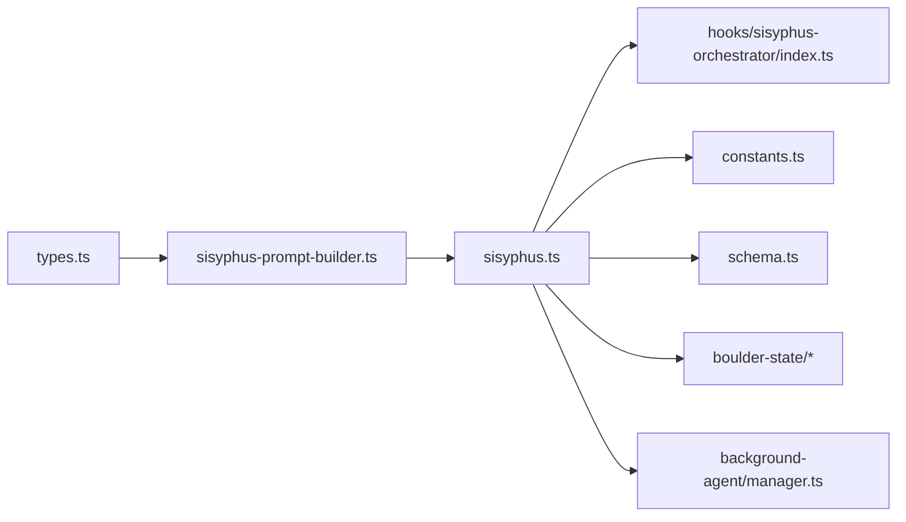
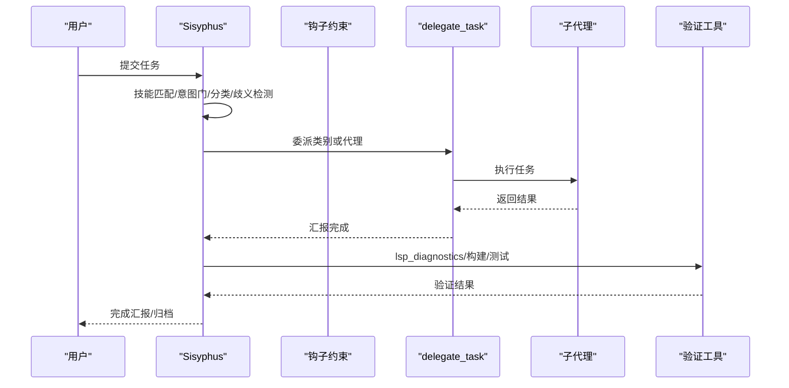

# Sisyphus 编排器

<cite>
**本文引用的文件**
- [orchestrator-sisyphus.ts](file://src/agents/orchestrator-sisyphus.ts)
- [sisyphus.ts](file://src/agents/sisyphus.ts)
- [sisyphus-prompt-builder.ts](file://src/agents/sisyphus-prompt-builder.ts)
- [types.ts](file://src/agents/types.ts)
- [constants.ts](file://src/tools/delegate-task/constants.ts)
- [schema.ts](file://src/config/schema.ts)
- [index.ts](file://src/hooks/sisyphus-orchestrator/index.ts)
- [index.ts](file://src/features/boulder-state/index.ts)
- [index.ts](file://src/features/background-agent/manager.ts)
- [index.ts](file://src/features/boulder-state/storage.ts)
- [index.ts](file://src/features/boulder-state/worktree-manager.ts)
- [index.ts](file://src/features/boulder-state/types.ts)
- [index.ts](file://src/features/boulder-state/worktree-manager.ts)
- [index.ts](file://src/features/boulder-state/storage.ts)
- [index.ts](file://src/features/boulder-state/types.ts)
- [index.ts](file://src/features/boulder-state/worktree-manager.ts)
- [index.ts](file://src/features/boulder-state/storage.ts)
- [index.ts](file://src/features/boulder-state/types.ts)
- [index.ts](file://src/features/boulder-state/worktree-manager.ts)
- [index.ts](file://src/features/boulder-state/storage.ts)
- [index.ts](file://src/features/boulder-state/types.ts)
- [index.ts](file://src/features/boulder-state/worktree-manager.ts)
- [index.ts](file://src/features/boulder-state/storage.ts)
- [index.ts](file://src/features/boulder-state/types.ts)
- [index.ts](file://src/features/boulder-state/worktree-manager.ts)
- [index.ts](file://src/features/boulder-state/storage.ts)
- [index.ts](file://src/features/boulder-state/types.ts)
- [index.ts](file://src/features/boulder-state/worktree-manager.ts)
- [index.ts](file://src/features/boulder-state/storage.ts)
- [index.ts](file://src/features/boulder-state/types.ts)
- [index.ts](file://src/features/boulder-state/worktree-manager.ts)
- [index.ts](file://src/features/boulder-state/storage.ts)
- [index.ts](file://src/features/boulder-state/types.ts)
- [index.ts](file://src/features/boulder-state/worktree-manager.ts)
- [index.ts](file://src/features/boulder-state/storage.ts)
- [index.ts](file://src/features/boulder-state/types.ts)
- [index.ts](file://src/features/boulder-state/worktree-manager.ts)
- [index.ts](file://src/features/boulder-state/storage.ts)
- [index.ts](file://src/features/boulder-state/types.ts)
- [index.ts](file://src/features/boulder-state/worktree-manager.ts)
- [index.ts](file://src/features/boulder-state/storage.ts)
- [index.ts](file://src/features/boulder-state/types.ts)
- [index.ts](file://src/features/boulder-state/worktree-manager.ts)
- [index.ts](file://src/features/boulder-state/storage.ts)
- [index.ts](file://src/features/boulder-state/types.ts)
- [index.ts](file://src/features/b......)
</cite>

## 目录
1. [简介](#简介)
2. [项目结构](#项目结构)
3. [核心组件](#核心组件)
4. [架构总览](#架构总览)
5. [详细组件分析](#详细组件分析)
6. [依赖分析](#依赖分析)
7. [性能考虑](#性能考虑)
8. [故障排除指南](#故障排除指南)
9. [结论](#结论)
10. [附录](#附录)

## 简介
本文件面向 Sisyphus 编排器的使用者与维护者，系统性阐述其核心架构、工作流程与决策机制。重点包括：
- 系统提示词的构建逻辑与动态生成机制
- 代理选择算法与任务分配策略
- 分类系统（Category）与代理直接调用的区别与适用场景
- 复杂任务分解、并行执行与结果验证的端到端流程
- 配置示例、性能优化建议与常见问题排查

## 项目结构
Sisyphus 编排器由“提示词构建器”“主编排器”“委托工具常量”“钩子约束”“状态管理与后台任务”等模块协同组成，形成“分离规划与执行”的完整流水线。

图表来源
- [sisyphus-prompt-builder.ts](file://src/agents/sisyphus-prompt-builder.ts#L1-L360)
- [sisyphus.ts](file://src/agents/sisyphus.ts#L1-L800)
- [orchestrator-sisyphus.ts](file://src/agents/orchestrator-sisyphus.ts#L1-L800)
- [constants.ts](file://src/tools/delegate-task/constants.ts#L1-L340)
- [schema.ts](file://src/config/schema.ts#L1-L384)
- [index.ts](file://src/hooks/sisyphus-orchestrator/index.ts#L1-L200)
- [index.ts](file://src/features/boulder-state/index.ts#L1-L200)
- [index.ts](file://src/features/background-agent/manager.ts#L698-L773)

章节来源
- [sisyphus-prompt-builder.ts](file://src/agents/sisyphus-prompt-builder.ts#L1-L360)
- [sisyphus.ts](file://src/agents/sisyphus.ts#L1-L800)
- [orchestrator-sisyphus.ts](file://src/agents/orchestrator-sisyphus.ts#L1-L800)
- [constants.ts](file://src/tools/delegate-task/constants.ts#L1-L340)
- [schema.ts](file://src/config/schema.ts#L1-L384)
- [index.ts](file://src/hooks/sisyphus-orchestrator/index.ts#L1-L200)
- [index.ts](file://src/features/boulder-state/index.ts#L1-L200)
- [index.ts](file://src/features/background-agent/manager.ts#L698-L773)

## 核心组件
- 提示词构建器：根据可用代理、工具与技能动态拼装行为指令、工具选择表、探索/参考检索策略、前端/Oracle 约束与硬规则。
- 主编排器：负责意图门、请求类型分类、歧义检测、验证前行动、自动规划触发、并行执行、失败恢复与完成阶段的全流程编排。
- 委托工具常量：定义分类默认模型/温度/提示追加、类别描述、代理默认技能、delegate_task 的互斥规则与 resume 使用规范。
- 钩子约束：在工具执行前后注入强提醒与协议校验，强制编排者仅能委派实现，不可越俎代庖。
- 状态与后台：通过 boulder.json 维护计划与会话状态；后台代理管理器提供并发控制、通知与过期清理。

章节来源
- [sisyphus-prompt-builder.ts](file://src/agents/sisyphus-prompt-builder.ts#L1-L360)
- [sisyphus.ts](file://src/agents/sisyphus.ts#L1-L800)
- [orchestrator-sisyphus.ts](file://src/agents/orchestrator-sisyphus.ts#L1-L800)
- [constants.ts](file://src/tools/delegate-task/constants.ts#L1-L340)
- [index.ts](file://src/hooks/sisyphus-orchestrator/index.ts#L1-L200)
- [index.ts](file://src/features/boulder-state/index.ts#L1-L200)
- [index.ts](file://src/features/background-agent/manager.ts#L698-L773)

## 架构总览
Sisyphus 将“规划”与“执行”解耦：Prometheus 进行需求访谈与计划生成，Sisyphus 读取计划并委派给专用代理（前端、架构顾问、探索、参考、文档等），全程以 todo 列表追踪进度，并在完成后进行项目级质量验收与归档。

图表来源
- [index.ts](file://src/hooks/sisyphus-orchestrator/index.ts#L97-L167)
- [index.ts](file://src/features/boulder-state/index.ts#L1-L200)
- [index.ts](file://src/features/boulder-state/storage.ts#L1-L200)
- [index.ts](file://src/features/boulder-state/worktree-manager.ts#L1-L200)

## 详细组件分析

### 系统提示词构建逻辑
- 关键触发与优先级：在“意图门”阶段，先检查技能匹配与关键触发（如外部库提及、多人模块涉及、GitHub 工单等），再进行请求类型分类与歧义检测。
- 工具与代理选择：按“技能 → 直接工具 → 代理”的优先级组织表格，明确成本与使用场景；默认流为“技能（若匹配）→ 并行探索/参考 + 直接工具 → 必要时咨询 Oracle”。
- 探索与参考检索：区分内部上下文 grep 与外部参考 grep，给出触发短语与使用建议。
- 前端与 Oracle 约束：前端视觉变更零容忍委派；Oracle 仅在复杂架构/调试/不熟悉模式时使用。
- 硬规则与反模式：禁止类型错误抑制、未授权提交、推测未读代码、遗留破坏性状态等；列举典型反模式避免。

章节来源
- [sisyphus-prompt-builder.ts](file://src/agents/sisyphus-prompt-builder.ts#L60-L146)
- [sisyphus-prompt-builder.ts](file://src/agents/sisyphus-prompt-builder.ts#L148-L186)
- [sisyphus-prompt-builder.ts](file://src/agents/sisyphus-prompt-builder.ts#L205-L258)
- [sisyphus-prompt-builder.ts](file://src/agents/sisyphus-prompt-builder.ts#L260-L287)
- [sisyphus-prompt-builder.ts](file://src/agents/sisyphus-prompt-builder.ts#L289-L336)
- [sisyphus.ts](file://src/agents/sisyphus.ts#L103-L165)
- [sisyphus.ts](file://src/agents/sisyphus.ts#L167-L188)
- [sisyphus.ts](file://src/agents/sisyphus.ts#L310-L356)
- [sisyphus.ts](file://src/agents/sisyphus.ts#L518-L544)

### 代理选择算法与任务分配策略
- 决策树（预委派规划）：先判定是否技能触发 → 是否前端视觉任务 → 是否后端/架构/逻辑任务 → 是否文档任务 → 是否探索/搜索任务 → 否则基于上下文选择默认类别。
- 互斥规则：category 与 agent 参数互斥（除 resume 场景），确保单一委派路径清晰。
- 并行执行：探索/参考代理默认后台并行，持续推进同时允许后续收集结果；支持 resume 保持上下文连续。
- 搜索停止条件：已足够自信推进、多源重复信息、两次迭代无新信息、直接答案出现。

章节来源
- [sisyphus.ts](file://src/agents/sisyphus.ts#L190-L308)
- [constants.ts](file://src/tools/delegate-task/constants.ts#L324-L340)
- [index.ts](file://src/hooks/sisyphus-orchestrator/index.ts#L72-L95)

### 分类系统（Category）与代理直接调用的区别
- 分类（Category）：通过预设类别配置（模型、温度、默认技能、提示追加）生成“Sisyphus-Junior”子代理，专注单一领域，避免无限委派。
- 代理直接调用：针对特定专家（如 Oracle、Explore、Librarian、Document-writer、Frontend 工程师）的即时委派，适合明确场景与高价值咨询。
- 何时使用：
  - 使用 Category：需要稳定、可复用的领域化执行，且希望避免再次委派。
  - 使用代理直接调用：需要专家级咨询或一次性专项任务，无需长期执行。

章节来源
- [constants.ts](file://src/tools/delegate-task/constants.ts#L246-L282)
- [constants.ts](file://src/tools/delegate-task/constants.ts#L300-L308)
- [constants.ts](file://src/tools/delegate-task/constants.ts#L324-L340)

### 复杂任务分解、并行执行与结果验证
- 任务分解：当 tasks.md 就绪时，自动统计任务数并选择执行模式：
  - ≤5 任务：顺序执行（executing-plans）
  - >5 任务：波次并行（wave-parallel-execution），按依赖分组为多个 Wave，在独立 worktree 中并行推进，最后合并。
- 结果验证：委派完成后必须进行三重验证：
  - lsp_diagnostics 在项目/目录级别清零
  - 构建命令退出码为 0
  - 测试套件通过或明确记录既有缺陷
- 失败恢复：连续三次失败立即回滚、记录尝试与失败、咨询 Oracle 或征询用户后再继续。

图表来源
- [index.ts](file://src/hooks/sisyphus-orchestrator/index.ts#L72-L95)
- [index.ts](file://src/features/boulder-state/worktree-manager.ts#L1-L200)
- [index.ts](file://src/features/boulder-state/storage.ts#L1-L200)

章节来源
- [index.ts](file://src/hooks/sisyphus-orchestrator/index.ts#L72-L95)
- [index.ts](file://src/features/boulder-state/worktree-manager.ts#L1-L200)
- [index.ts](file://src/features/boulder-state/storage.ts#L1-L200)

### 委派提示结构与证据要求
- 委派提示七要素：任务、预期产出、所需技能、所需工具白名单、必须做、禁止做、上下文。
- 证据清单：文件修改需项目级 lsp_diagnostics 清零；构建命令退出码 0；测试通过；委派结果经独立验证。

章节来源
- [sisyphus.ts](file://src/agents/sisyphus.ts#L408-L481)
- [sisyphus.ts](file://src/agents/sisyphus.ts#L518-L544)

### 钩子约束与协议强制
- 强制委派提醒：当编排者尝试在 .sisyphus/ 外直接写/改文件时，注入“委派提醒”，强调编排职责为协调与验证，非实现。
- 执行模式自动决策：当存在 tasks.md 时，自动选择顺序或波次并行模式，避免用户选择分歧。
- 验证提醒：强调“子代理经常撒谎”，必须以自身工具调用进行强制验证。

章节来源
- [index.ts](file://src/hooks/sisyphus-orchestrator/index.ts#L33-L59)
- [index.ts](file://src/hooks/sisyphus-orchestrator/index.ts#L72-L95)
- [index.ts](file://src/hooks/sisyphus-orchestrator/index.ts#L169-L200)

## 依赖分析
- 组件耦合与内聚：
  - 提示词构建器与主编排器通过接口与类型强耦合，保证行为指令与动态内容一致。
  - 委托工具常量为两类入口提供统一契约：类别配置与互斥规则。
  - 钩子约束与状态管理共同保障执行阶段的合规与可恢复性。
- 外部依赖与集成点：
  - MCP/插件生态通过配置禁用/启用；工具输出截断与动态上下文修剪通过实验性配置控制。
  - 后台代理管理器提供并发与过期清理，避免资源泄漏。

图表来源
- [types.ts](file://src/agents/types.ts#L1-L87)
- [sisyphus-prompt-builder.ts](file://src/agents/sisyphus-prompt-builder.ts#L1-L360)
- [sisyphus.ts](file://src/agents/sisyphus.ts#L1-L800)
- [index.ts](file://src/hooks/sisyphus-orchestrator/index.ts#L1-L200)
- [constants.ts](file://src/tools/delegate-task/constants.ts#L1-L340)
- [schema.ts](file://src/config/schema.ts#L1-L384)
- [index.ts](file://src/features/boulder-state/index.ts#L1-L200)
- [index.ts](file://src/features/background-agent/manager.ts#L698-L773)

章节来源
- [types.ts](file://src/agents/types.ts#L1-L87)
- [sisyphus-prompt-builder.ts](file://src/agents/sisyphus-prompt-builder.ts#L1-L360)
- [sisyphus.ts](file://src/agents/sisyphus.ts#L1-L800)
- [index.ts](file://src/hooks/sisyphus-orchestrator/index.ts#L1-L200)
- [constants.ts](file://src/tools/delegate-task/constants.ts#L1-L340)
- [schema.ts](file://src/config/schema.ts#L1-L384)
- [index.ts](file://src/features/boulder-state/index.ts#L1-L200)
- [index.ts](file://src/features/background-agent/manager.ts#L698-L773)

## 性能考虑
- 并行优先：探索/参考代理一律后台并行，减少等待；仅在需要结果时收集。
- 并发控制：后台代理管理器提供并发配额与过期清理，防止资源泄露与饥饿。
- 动态上下文修剪：可选开启，减少重复/错误/近期写入等冗余上下文，降低 token 消耗。
- 模型成本：根据代理/工具成本排序选择，优先免费/廉价资源，昂贵模型用于最终审阅与架构咨询。
- 波次并行：任务量大时采用波次并行，最大化吞吐的同时保持依赖可控。

章节来源
- [index.ts](file://src/features/background-agent/manager.ts#L698-L773)
- [schema.ts](file://src/config/schema.ts#L205-L239)
- [sisyphus.ts](file://src/agents/sisyphus.ts#L310-L356)

## 故障排除指南
- 直接文件修改被拦截：
  - 现象：在 .sisyphus/ 外直接写/改文件时，输出被注入“委派提醒”。
  - 处理：改为 delegate_task 委派给合适代理；仅在验证场景下允许小修。
- 任务未完成证据链缺失：
  - 现象：子代理声称完成但实际有类型错误或测试失败。
  - 处理：强制运行 lsp_diagnostics、构建与测试，确认无误后再标记完成。
- 连续失败未回滚：
  - 现象：多次修复无效。
  - 处理：达到阈值后立即回滚至上一稳定状态，记录尝试与失败，必要时咨询 Oracle。
- 并发任务卡死或资源不足：
  - 现象：后台任务长时间无响应或队列堆积。
  - 处理：检查并发配额与过期时间设置，清理过期任务并释放槽位。

章节来源
- [index.ts](file://src/hooks/sisyphus-orchestrator/index.ts#L33-L59)
- [index.ts](file://src/hooks/sisyphus-orchestrator/index.ts#L169-L200)
- [index.ts](file://src/features/background-agent/manager.ts#L78-L83)

## 结论
Sisyphus 编排器通过“提示词动态构建 + 明确决策树 + 并行执行 + 强约束钩子 + 状态与后台管理”的组合，实现了从规划到执行再到归档的闭环。其核心在于：以 Category 与代理直呼两种路径覆盖不同复杂度与领域，以 todo 与波次并行提升吞吐，以强制验证与失败恢复保障质量。

## 附录

### 配置示例与最佳实践
- oh-my-opencode.json 常用配置要点
  - 启用/禁用 Sisyphus 与 Prometheus、替换默认计划器
  - 禁用钩子（如限制 Prometheus 写入）
  - 自定义类别：模型、温度、思考预算、工具开关、提示追加
  - 禁用技能与实验性功能（如动态上下文修剪）

章节来源
- [schema.ts](file://src/config/schema.ts#L338-L384)
- [constants.ts](file://src/tools/delegate-task/constants.ts#L155-L200)

### 关键流程时序图（委派与验证）

图表来源
- [sisyphus.ts](file://src/agents/sisyphus.ts#L103-L165)
- [index.ts](file://src/hooks/sisyphus-orchestrator/index.ts#L169-L200)
- [constants.ts](file://src/tools/delegate-task/constants.ts#L324-L340)