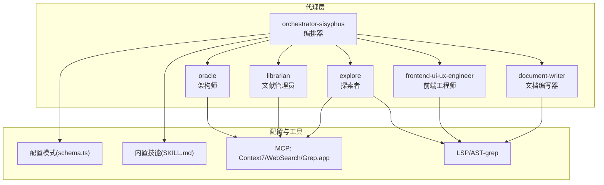
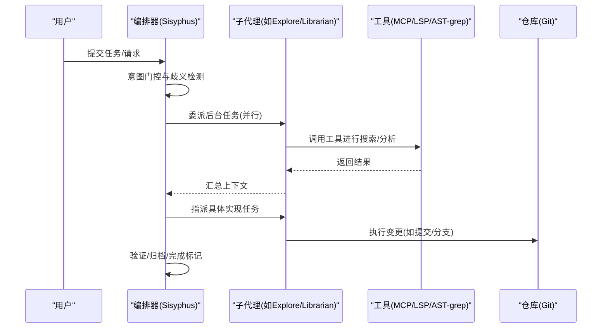
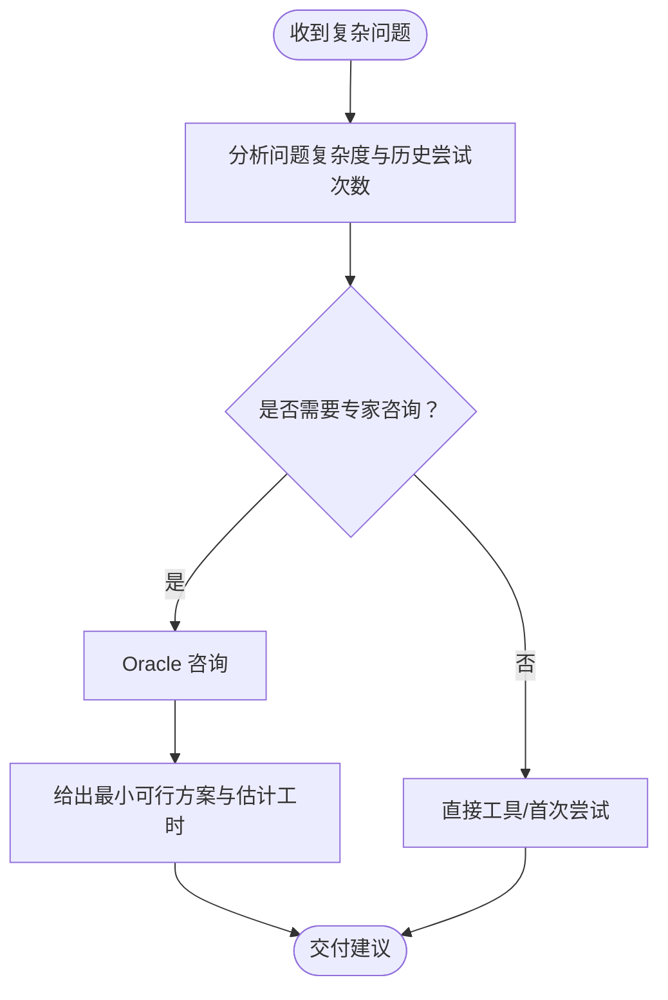
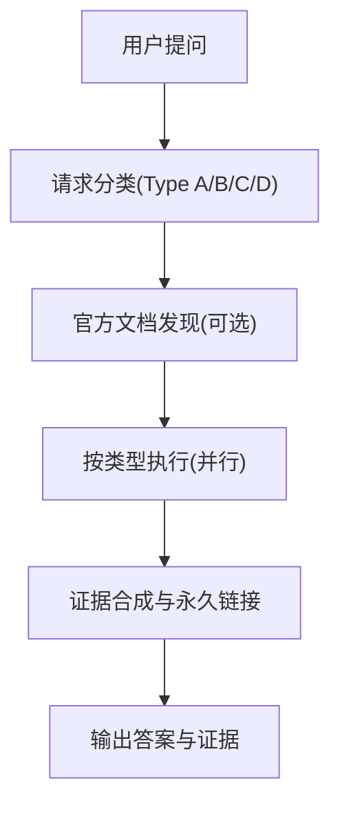
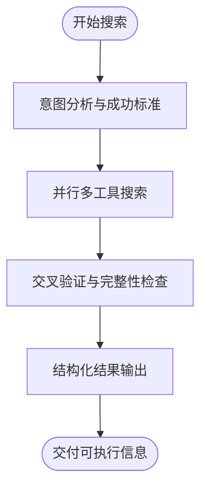
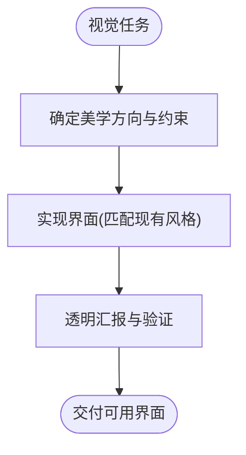
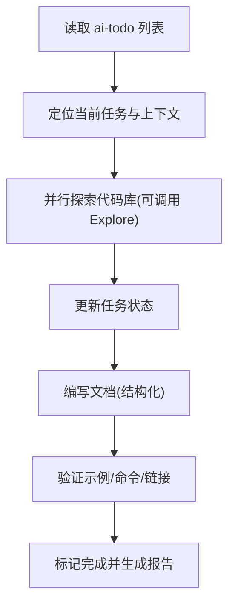
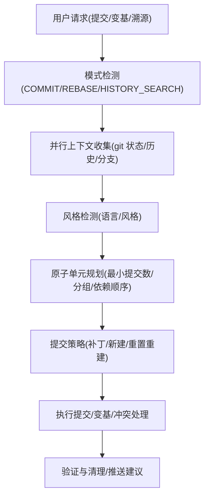
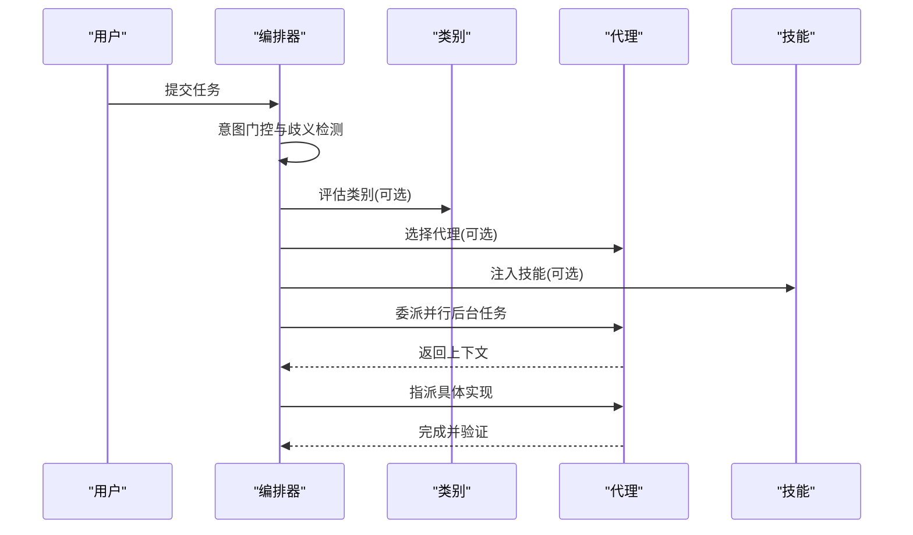
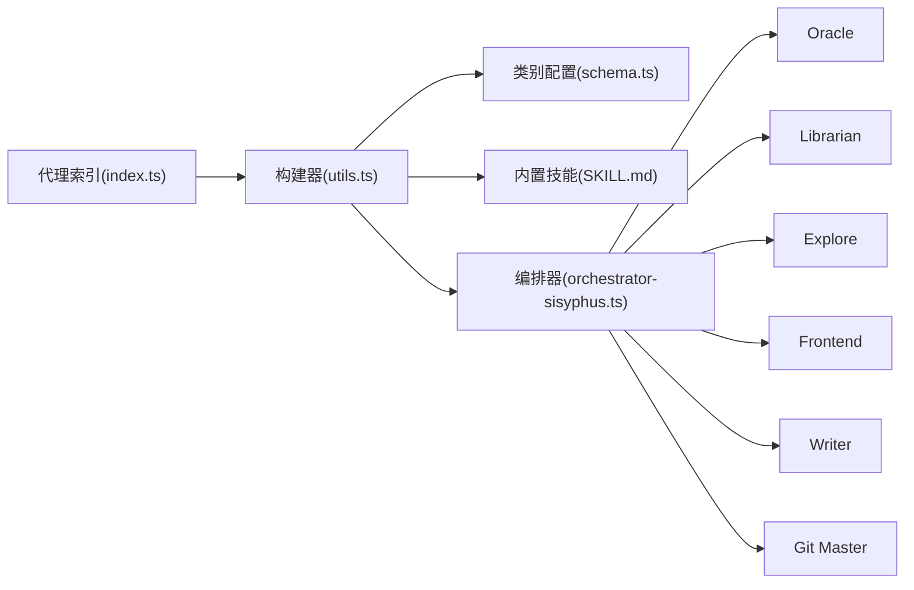

# 专业代理

<cite>
**本文引用的文件**
- [src/agents/index.ts](file://src/agents/index.ts)
- [src/agents/types.ts](file://src/agents/types.ts)
- [src/agents/utils.ts](file://src/agents/utils.ts)
- [src/agents/oracle.ts](file://src/agents/oracle.ts)
- [src/agents/librarian.ts](file://src/agents/librarian.ts)
- [src/agents/explore.ts](file://src/agents/explore.ts)
- [src/agents/frontend-ui-ux-engineer.ts](file://src/agents/frontend-ui-ux-engineer.ts)
- [src/agents/document-writer.ts](file://src/agents/document-writer.ts)
- [src/agents/orchestrator-sisyphus.ts](file://src/agents/orchestrator-sisyphus.ts)
- [src/config/schema.ts](file://src/config/schema.ts)
- [src/features/builtin-skills/git-master/SKILL.md](file://src/features/builtin-skills/git-master/SKILL.md)
- [src/features/builtin-skills/frontend-ui-ux/SKILL.md](file://src/features/builtin-skills/frontend-ui-ux/SKILL.md)
- [src/features/builtin-skills/writing-skills/SKILL.md](file://src/features/builtin-skills/writing-skills/SKILL.md)
- [docs/SUBAGENTS-COMPARISON.md](file://docs/SUBAGENTS-COMPARISON.md)
- [README.md](file://README.md)
</cite>

## 目录
1. [简介](#简介)
2. [项目结构](#项目结构)
3. [核心组件](#核心组件)
4. [架构总览](#架构总览)
5. [详细组件分析](#详细组件分析)
6. [依赖分析](#依赖分析)
7. [性能考虑](#性能考虑)
8. [故障排查指南](#故障排查指南)
9. [结论](#结论)
10. [附录](#附录)

## 简介
本文件面向专业代理系统，系统性梳理并说明各类“专业代理”的功能特性、适用场景、使用方法、能力边界、最佳实践与配置选项。重点覆盖以下代理：
- 架构师（Oracle）
- 文献管理员（Librarian）
- 探索者（Explore）
- 前端工程师（Frontend UI/UX Engineer）
- 文档编写器（Document Writer）
- 版本控制专家（Git Master）

同时，结合内置技能与编排器，给出并行执行、任务委派、计划-审查-执行循环、以及与外部工具（MCP、LSP、AST-grep、Grep.app、Context7、WebSearch）的协同方式，帮助读者在真实工程中高效落地。

## 项目结构
专业代理以“内置代理注册 + 动态构建 + 编排器调度”为核心组织方式：
- 代理注册与导出：集中于代理索引文件，统一暴露可用代理清单与工厂函数。
- 代理元数据：通过类型与元数据接口定义分类、成本、触发条件、提示别名等，支撑动态提示构建。
- 代理构建：根据类别配置、技能注入、环境上下文等，动态组装最终 AgentConfig。
- 编排器：提供“类别/代理/技能”三选一的决策矩阵与提示模板，负责任务委派与并行执行。

**图表来源**
- [src/agents/index.ts](file://src/agents/index.ts#L17-L32)
- [src/agents/utils.ts](file://src/agents/utils.ts#L25-L40)
- [src/agents/orchestrator-sisyphus.ts](file://src/agents/orchestrator-sisyphus.ts#L134-L200)
- [src/config/schema.ts](file://src/config/schema.ts#L1-L200)

**章节来源**
- [src/agents/index.ts](file://src/agents/index.ts#L17-L32)
- [src/agents/utils.ts](file://src/agents/utils.ts#L141-L224)
- [src/agents/orchestrator-sisyphus.ts](file://src/agents/orchestrator-sisyphus.ts#L134-L200)
- [src/config/schema.ts](file://src/config/schema.ts#L1-L200)

## 核心组件
- 代理类型与元数据
  - 代理分类（探索/专业顾问/顾问/实用工具）
  - 成本分级（免费/便宜/昂贵）
  - 委派触发条件（DelegationTrigger）
  - 提示元数据（PromptMetadata）：包含分类、成本、触发域、使用时机、避免场景、专用提示段落、提示别名、关键触发等
- 代理构建与覆盖
  - 通过 createBuiltinAgents 统一构建，支持禁用代理、覆盖模型/温度/工具权限/提示追加等
  - 支持基于类别配置继承模型与思维预算，支持技能内容注入
- 编排器
  - 提供“类别/代理/技能”三选一的决策矩阵与提示模板，支持并行后台任务与 todo 驱动

**章节来源**
- [src/agents/types.ts](file://src/agents/types.ts#L1-L87)
- [src/agents/utils.ts](file://src/agents/utils.ts#L63-L99)
- [src/agents/utils.ts](file://src/agents/utils.ts#L141-L224)
- [src/agents/orchestrator-sisyphus.ts](file://src/agents/orchestrator-sisyphus.ts#L22-L132)

## 架构总览
下图展示“编排器-代理-工具”的交互关系，以及典型任务流（意图门控 → 探索/研究 → 执行 → 验证/归档）：

**图表来源**
- [src/agents/orchestrator-sisyphus.ts](file://src/agents/orchestrator-sisyphus.ts#L156-L200)
- [docs/SUBAGENTS-COMPARISON.md](file://docs/SUBAGENTS-COMPARISON.md#L644-L800)

**章节来源**
- [src/agents/orchestrator-sisyphus.ts](file://src/agents/orchestrator-sisyphus.ts#L134-L200)
- [docs/SUBAGENTS-COMPARISON.md](file://docs/SUBAGENTS-COMPARISON.md#L644-L800)

## 详细组件分析

### 架构师（Oracle）
- 身份与定位
  - 顾问型代理，专注复杂架构设计、深层调试、代码审查与策略建议
  - 适合“重大实现完成后自审”“多次失败仍无解”“多系统权衡”等高价值场景
- 能力边界
  - 仅读咨询，不直接修改文件
  - 对简单文件操作、首次尝试、显而易见的问题不建议使用
- 性能与成本
  - 高成本模型；在 GPT 系列上启用中等推理强度与高文本冗长度
- 使用建议
  - 在复杂模块重构、跨系统集成、安全/性能风险评估时调用
  - 与 Explore/Librarian 并行前置，再由 Oracle 给出“最小可行路径”
- 配置要点
  - 模型与温度由 createOracleAgent 决定；可通过覆盖配置调整
  - 可追加提示片段，或通过类别继承设置推理预算

**图表来源**
- [src/agents/oracle.ts](file://src/agents/oracle.ts#L17-L32)
- [src/agents/oracle.ts](file://src/agents/oracle.ts#L100-L123)

**章节来源**
- [src/agents/oracle.ts](file://src/agents/oracle.ts#L1-L126)
- [src/agents/types.ts](file://src/agents/types.ts#L17-L53)

### 文献管理员（Librarian）
- 身份与定位
  - 多仓库分析与远程代码检索专家，擅长查找官方文档、开源实现与最佳实践
- 能力边界
  - 仅读检索，不直接改写；必须在“提及外部库/源码”时使用
  - 严格要求证据引用（带永久链接）
- 使用建议
  - “如何使用某库？”“某框架的实现原理？”“某行为的历史背景？”
  - 采用“概念型/实现型/上下文型/综合型”四类请求分类，按阶段执行
- 并行加速
  - 支持多工具并行调用，建议多样化查询以提升召回
- 配置要点
  - 可注入环境时间上下文，避免过时信息
  - 可通过覆盖追加提示，或通过类别继承设置模型

**图表来源**
- [src/agents/librarian.ts](file://src/agents/librarian.ts#L56-L66)
- [src/agents/librarian.ts](file://src/agents/librarian.ts#L117-L183)
- [src/agents/librarian.ts](file://src/agents/librarian.ts#L208-L240)

**章节来源**
- [src/agents/librarian.ts](file://src/agents/librarian.ts#L1-L330)
- [src/agents/utils.ts](file://src/agents/utils.ts#L168-L171)

### 探索者（Explore）
- 身份与定位
  - 代码库快速搜索专家，擅长“定位文件/代码/模式”，支持并行多路搜索
- 能力边界
  - 仅读，不创建/修改文件；必须返回绝对路径与可执行结果
- 使用建议
  - 多模块交叉发现、未知模块结构、跨层模式识别
  - 首次行动建议至少并行 3 个工具，覆盖语义/结构/文本/文件/历史
- 配置要点
  - 可通过覆盖禁用工具、调整温度；默认具备最小权限集合

**图表来源**
- [src/agents/explore.ts](file://src/agents/explore.ts#L56-L66)
- [src/agents/explore.ts](file://src/agents/explore.ts#L68-L86)
- [src/agents/explore.ts](file://src/agents/explore.ts#L112-L121)

**章节来源**
- [src/agents/explore.ts](file://src/agents/explore.ts#L1-L126)

### 前端工程师（Frontend UI/UX Engineer）
- 身份与定位
  - 设计师转前端工程师，专注于视觉/交互/动效，追求“可感知的美”
- 能力边界
  - 仅处理“纯视觉变更”；逻辑/状态/API 等非可视化任务不适用
- 使用建议
  - 明确美学方向（极简/奢华/有机/工业等），匹配现有代码风格
  - 注重像素级细节、动画节奏与可访问性
- 配置要点
  - 默认开放工具权限；可按需限制 bash/webfetch 等

**图表来源**
- [src/agents/frontend-ui-ux-engineer.ts](file://src/agents/frontend-ui-ux-engineer.ts#L51-L66)
- [src/agents/frontend-ui-ux-engineer.ts](file://src/agents/frontend-ui-ux-engineer.ts#L89-L96)

**章节来源**
- [src/agents/frontend-ui-ux-engineer.ts](file://src/agents/frontend-ui-ux-engineer.ts#L1-L110)
- [src/features/builtin-skills/frontend-ui-ux/SKILL.md](file://src/features/builtin-skills/frontend-ui-ux/SKILL.md#L1-L79)

### 文档编写器（Document Writer）
- 身份与定位
  - 技术写作专家，负责 README/API/架构/用户指南等高质量文档
- 能力边界
  - 仅处理文档任务；必须基于 ai-todo 列表执行，具备“验证-闭环”流程
- 使用建议
  - 严格遵循“可验证”原则：代码示例/命令/链接均需验证
  - 使用“结构化清单”与“风格指南”保证一致性
- 配置要点
  - 可通过覆盖追加提示；默认开放工具权限

**图表来源**
- [src/agents/document-writer.ts](file://src/agents/document-writer.ts#L89-L98)
- [src/agents/document-writer.ts](file://src/agents/document-writer.ts#L128-L138)
- [src/agents/document-writer.ts](file://src/agents/document-writer.ts#L164-L162)

**章节来源**
- [src/agents/document-writer.ts](file://src/agents/document-writer.ts#L1-L225)

### 版本控制专家（Git Master）
- 身份与定位
  - Git 专家：原子提交、变基整形、历史考古三合一
- 能力边界
  - 必须使用该代理进行任何 Git 操作；默认多提交策略
- 使用建议
  - 通过 delegate_task(category='quick', skills=['git-master']) 保存上下文
  - 严格遵循“语言+风格”检测与提交分组原则
- 配置要点
  - 与类别 quick 默认技能联动；可配合编排器自动触发

**图表来源**
- [src/features/builtin-skills/git-master/SKILL.md](file://src/features/builtin-skills/git-master/SKILL.md#L15-L27)
- [src/features/builtin-skills/git-master/SKILL.md](file://src/features/builtin-skills/git-master/SKILL.md#L73-L101)
- [src/features/builtin-skills/git-master/SKILL.md](file://src/features/builtin-skills/git-master/SKILL.md#L220-L400)

**章节来源**
- [src/features/builtin-skills/git-master/SKILL.md](file://src/features/builtin-skills/git-master/SKILL.md#L1-L800)

### 编排器（Orchestrator Sisyphus）
- 身份与定位
  - 主导者：解析隐含需求、适配代码库成熟度、委派给合适子代理、并行执行、遵循 todo
- 能力边界
  - 不在用户未要求时自行实现；必须在“GitHub 工单/明确指令”时才开始实施
- 使用建议
  - 优先使用“类别/代理/技能”三选一；类别优先，代理次之，技能补充
  - 并行后台任务（Explore/Librarian）先行，再委派执行者
- 配置要点
  - 支持类别配置（模型/温度/思维预算/默认技能）
  - 支持技能注入与提示追加

**图表来源**
- [src/agents/orchestrator-sisyphus.ts](file://src/agents/orchestrator-sisyphus.ts#L156-L200)
- [src/agents/orchestrator-sisyphus.ts](file://src/agents/orchestrator-sisyphus.ts#L22-L132)

**章节来源**
- [src/agents/orchestrator-sisyphus.ts](file://src/agents/orchestrator-sisyphus.ts#L1-L200)

## 依赖分析
- 代理注册与构建
  - 代理索引集中导出可用代理清单与工厂函数
  - 代理构建器根据类别配置、技能注入、环境上下文动态组装
- 编排器与代理协作
  - 编排器提供决策矩阵与提示模板，代理按元数据参与动态提示段落
- 外部工具链
  - Librarian/Explore 广泛使用 Context7/WebSearch/Grep.app
  - Explore/Librarian 与 LSP/AST-grep/Glob/Grep 等工具配合
- 技能与类别
  - 类别默认技能与代理默认技能叠加，用户传入技能与类别/代理默认技能合并去重

**图表来源**
- [src/agents/index.ts](file://src/agents/index.ts#L17-L32)
- [src/agents/utils.ts](file://src/agents/utils.ts#L25-L40)
- [src/config/schema.ts](file://src/config/schema.ts#L170-L186)

**章节来源**
- [src/agents/index.ts](file://src/agents/index.ts#L17-L32)
- [src/agents/utils.ts](file://src/agents/utils.ts#L127-L177)
- [src/config/schema.ts](file://src/config/schema.ts#L170-L186)

## 性能考虑
- 并行优先：Explore/Librarian 默认并行执行，减少等待；Oracle/Librarian 可在 GPT 系列上启用更高推理预算
- 成本控制：按代理成本分级（免费/便宜/昂贵）选择；对简单任务避免昂贵代理
- 上下文窗口：编排器与钩子提供上下文监控与压缩，避免超限
- 工具选择：针对不同任务选择最合适的工具（LSP/AST-grep/Context7/WebSearch/Grep.app），减少无效搜索
- 任务粒度：Git Master 强制多提交策略，避免大而无当的提交，提升可维护性

[本节为通用指导，不直接分析具体文件]

## 故障排查指南
- 代理未生效
  - 检查是否被禁用或被覆盖；确认类别配置是否正确继承模型/温度/工具
  - 参考：代理构建与覆盖逻辑
- 任务未完成
  - 检查 todo 连续性钩子是否生效；确认编排器是否在执行阶段阻止了规划类代理
  - 参考：编排器提示与钩子
- 文档/代码未验证
  - 文档编写器必须验证示例/命令/链接；若失败需回滚并重新验证
  - 参考：文档编写器验证流程
- Git 提交不符合规范
  - Git Master 严格要求多提交、按目录/关注点拆分、测试与实现配对
  - 参考：Git Master 技能流程

**章节来源**
- [src/agents/utils.ts](file://src/agents/utils.ts#L127-L177)
- [src/agents/orchestrator-sisyphus.ts](file://src/agents/orchestrator-sisyphus.ts#L156-L200)
- [src/agents/document-writer.ts](file://src/agents/document-writer.ts#L128-L138)
- [src/features/builtin-skills/git-master/SKILL.md](file://src/features/builtin-skills/git-master/SKILL.md#L30-L70)

## 结论
本专业代理体系以“编排器 + 专业代理 + 内置技能 + 外部工具链”为核心，形成“意图门控 → 并行探索 → 专家咨询 → 专业化执行 → 验证归档”的闭环。通过类别配置、技能注入与工具链协同，既能覆盖从架构设计到前端实现、从文档编写到版本控制的全流程，又能兼顾成本与效率。建议在实际工程中：
- 明确任务类型与边界，优先使用类别/代理/技能三选一
- 对复杂问题先并行探索与文献检索，再委派执行者
- 严格遵循验证与归档流程，确保交付质量与可追溯性

[本节为总结性内容，不直接分析具体文件]

## 附录

### 使用示例与最佳实践
- 复杂架构设计
  - 先调用 Explore/Librarian 获取上下文，再调用 Oracle 进行策略咨询
- 前端视觉优化
  - 使用 Frontend UI/UX Engineer，明确美学方向与约束，匹配现有风格
- 文档编写
  - 基于 ai-todo 列表，使用 Document Writer 并严格执行验证
- Git 提交流程
  - 使用 Git Master 的“语言+风格”检测与原子提交策略，避免单一大提交

**章节来源**
- [src/agents/orchestrator-sisyphus.ts](file://src/agents/orchestrator-sisyphus.ts#L156-L200)
- [src/agents/frontend-ui-ux-engineer.ts](file://src/agents/frontend-ui-ux-engineer.ts#L22-L106)
- [src/agents/document-writer.ts](file://src/agents/document-writer.ts#L86-L162)
- [src/features/builtin-skills/git-master/SKILL.md](file://src/features/builtin-skills/git-master/SKILL.md#L105-L172)

### 集成指南
- 插件与兼容
  - 项目提供 Claude Code 兼容层与钩子系统，支持命令/技能/代理/MCP/钩子加载
- 配置项
  - 支持代理覆盖（模型/温度/工具/提示追加）、类别配置（模型/思维预算/默认技能）、钩子开关
- 技能开发
  - 使用“写技能”的 TDD 方法：压力测试 → 编写技能 → 回归加固

**章节来源**
- [README.md](file://README.md#L660-L798)
- [src/config/schema.ts](file://src/config/schema.ts#L109-L151)
- [src/features/builtin-skills/writing-skills/SKILL.md](file://src/features/builtin-skills/writing-skills/SKILL.md#L28-L109)