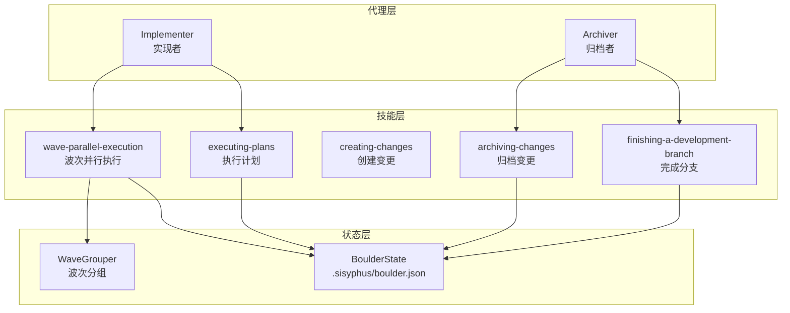
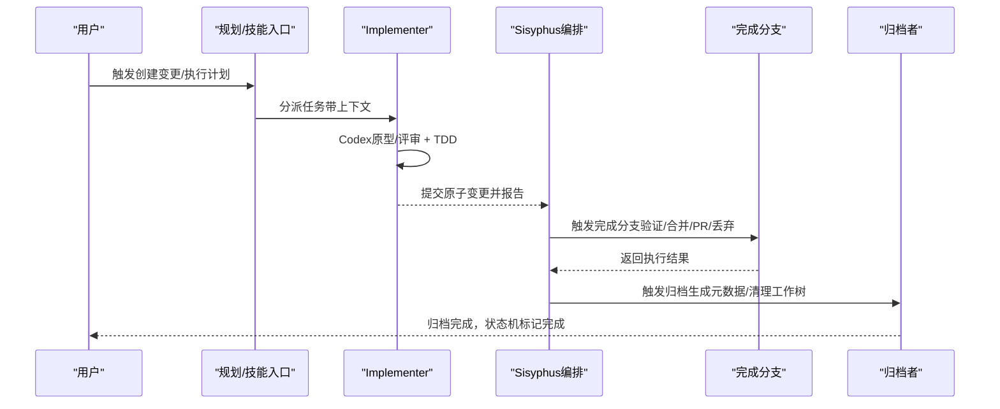
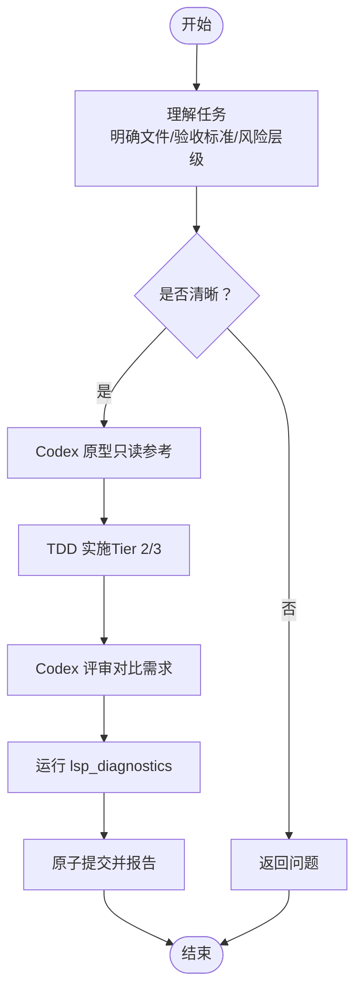
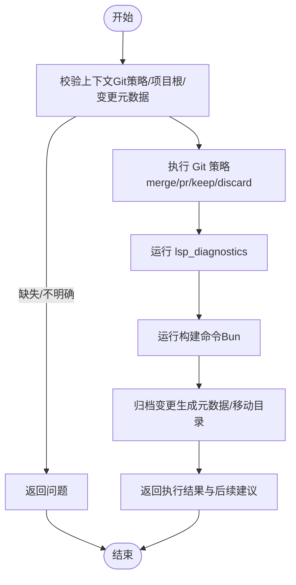
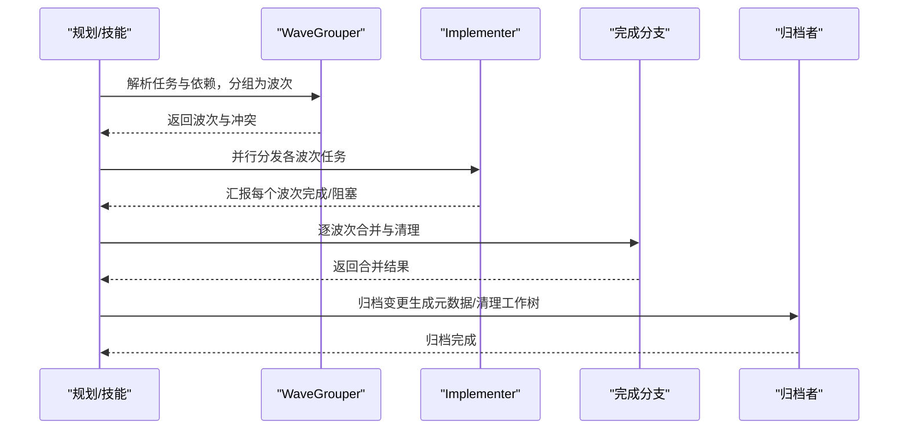
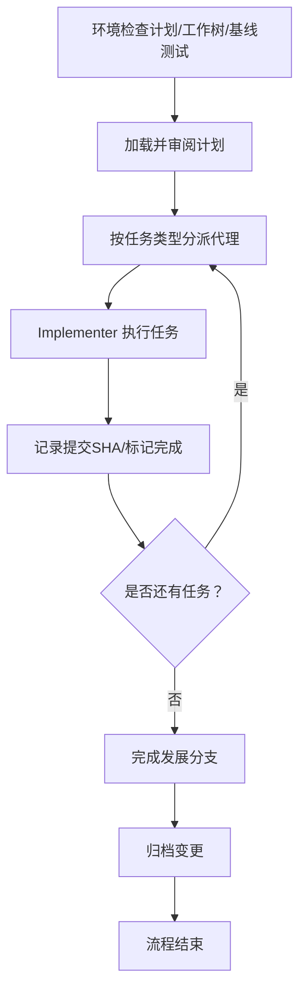
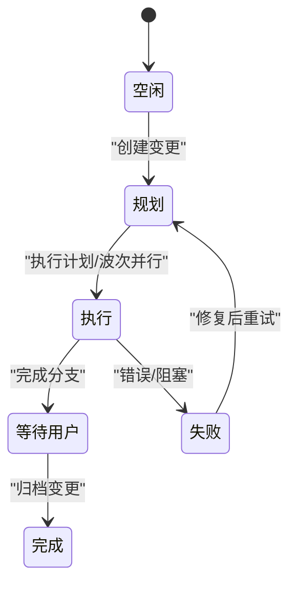
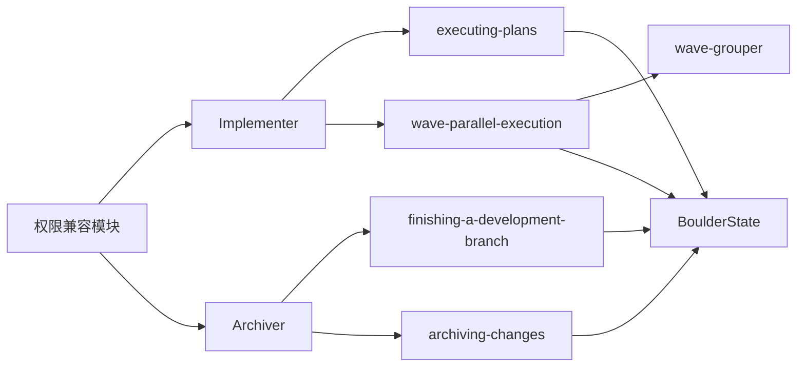

# 实现执行代理

<cite>
**本文引用的文件**
- [src/agents/implementer.ts](file://src/agents/implementer.ts)
- [src/agents/archiver.ts](file://src/agents/archiver.ts)
- [src/agents/types.ts](file://src/agents/types.ts)
- [src/shared/permission-compat.ts](file://src/shared/permission-compat.ts)
- [src/features/builtin-skills/executing-plans/SKILL.md](file://src/features/builtin-skills/executing-plans/SKILL.md)
- [src/features/builtin-skills/wave-parallel-execution/SKILL.md](file://src/features/builtin-skills/wave-parallel-execution/SKILL.md)
- [src/features/builtin-skills/creating-changes/SKILL.md](file://src/features/builtin-skills/creating-changes/SKILL.md)
- [src/features/builtin-skills/finishing-a-development-branch/SKILL.md](file://src/features/builtin-skills/finishing-a-development-branch/SKILL.md)
- [src/features/builtin-skills/archiving-changes/SKILL.md](file://src/features/builtin-skills/archiving-changes/SKILL.md)
- [src/features/boulder-state/types.ts](file://src/features/boulder-state/types.ts)
- [src/features/boulder-state/storage.ts](file://src/features/boulder-state/storage.ts)
- [src/features/boulder-state/constants.ts](file://src/features/boulder-state/constants.ts)
- [src/shared/wave-grouper.ts](file://src/shared/wave-grouper.ts)
- [src/agents/implementer.test.ts](file://src/agents/implementer.test.ts)
- [src/agents/archiver.test.ts](file://src/agents/archiver.test.ts)
</cite>

## 目录
1. [引言](#引言)
2. [项目结构](#项目结构)
3. [核心组件](#核心组件)
4. [架构总览](#架构总览)
5. [详细组件分析](#详细组件分析)
6. [依赖关系分析](#依赖关系分析)
7. [性能考量](#性能考量)
8. [故障排查指南](#故障排查指南)
9. [结论](#结论)
10. [附录](#附录)

## 引言
本文件面向“实现执行代理”系统，围绕实现者（Implementer）与归档者（Archiver）两类代理，系统阐述其在代码实现、变更创建、文件操作、项目维护中的职责边界、执行策略、质量控制、版本管理与备份恢复机制。文档同时给出与技能体系（skills）及工 Boulder 状态机的协同方式，帮助读者快速理解并正确集成与扩展。

## 项目结构
本项目采用“功能域 + 技能 + 代理”的分层组织方式：
- 代理层：实现者与归档者作为子代理，聚焦单一职责，严格遵守工具权限与约束。
- 技能层：提供可复用的工作流与过程规范，驱动代理执行具体任务。
- 状态层：通过 Boulder 状态机跟踪计划阶段、失败计数、波次执行等，保障流程可控与可回溯。

图表来源
- [src/agents/implementer.ts](file://src/agents/implementer.ts#L1-L153)
- [src/agents/archiver.ts](file://src/agents/archiver.ts#L1-L124)
- [src/features/builtin-skills/executing-plans/SKILL.md](file://src/features/builtin-skills/executing-plans/SKILL.md#L1-L232)
- [src/features/builtin-skills/wave-parallel-execution/SKILL.md](file://src/features/builtin-skills/wave-parallel-execution/SKILL.md#L1-L396)
- [src/features/builtin-skills/creating-changes/SKILL.md](file://src/features/builtin-skills/creating-changes/SKILL.md#L1-L172)
- [src/features/builtin-skills/finishing-a-development-branch/SKILL.md](file://src/features/builtin-skills/finishing-a-development-branch/SKILL.md#L1-L212)
- [src/features/builtin-skills/archiving-changes/SKILL.md](file://src/features/builtin-skills/archiving-changes/SKILL.md#L1-L149)
- [src/features/boulder-state/storage.ts](file://src/features/boulder-state/storage.ts#L1-L308)
- [src/shared/wave-grouper.ts](file://src/shared/wave-grouper.ts#L1-L146)

章节来源
- [src/agents/implementer.ts](file://src/agents/implementer.ts#L1-L153)
- [src/agents/archiver.ts](file://src/agents/archiver.ts#L1-L124)
- [src/features/boulder-state/storage.ts](file://src/features/boulder-state/storage.ts#L1-L308)

## 核心组件
- 实现者（Implementer）
  - 角色定位：专注于单任务完整实现，遵循 TDD 与 Codex 原型/评审流程，禁止委托与外部搜索。
  - 关键能力：测试驱动开发、系统性调试、代码评审协作、语言服务诊断。
  - 执行约束：禁用 task/background_task/sisyphus_task/call_omo_agent/webfetch/websearch；强制运行 lsp_diagnostics；失败多次触发系统性调试或阻塞。
- 归档者（Archiver）
  - 角色定位：第三阶段执行者，负责 Git 策略、诊断、构建验证与变更归档。
  - 关键能力：完成开发分支、归档变更。
  - 执行约束：禁用 Codex 与委托；基于提供的上下文执行；失败即阻塞。

章节来源
- [src/agents/implementer.ts](file://src/agents/implementer.ts#L20-L123)
- [src/agents/archiver.ts](file://src/agents/archiver.ts#L20-L94)
- [src/agents/implementer.test.ts](file://src/agents/implementer.test.ts#L1-L23)
- [src/agents/archiver.test.ts](file://src/agents/archiver.test.ts#L1-L23)

## 架构总览
实现者与归档者通过技能驱动的流水线协同工作，贯穿“创建变更 → 执行计划/波次并行 → 完成分支 → 归档变更”的完整生命周期，并由 Boulder 状态机进行阶段与进度管理。

图表来源
- [src/features/builtin-skills/creating-changes/SKILL.md](file://src/features/builtin-skills/creating-changes/SKILL.md#L1-L172)
- [src/features/builtin-skills/executing-plans/SKILL.md](file://src/features/builtin-skills/executing-plans/SKILL.md#L1-L232)
- [src/features/builtin-skills/wave-parallel-execution/SKILL.md](file://src/features/builtin-skills/wave-parallel-execution/SKILL.md#L1-L396)
- [src/features/builtin-skills/finishing-a-development-branch/SKILL.md](file://src/features/builtin-skills/finishing-a-development-branch/SKILL.md#L1-L212)
- [src/features/builtin-skills/archiving-changes/SKILL.md](file://src/features/builtin-skills/archiving-changes/SKILL.md#L1-L149)

## 详细组件分析

### 实现者（Implementer）分析
- 身份与职责
  - 接收来自 Sisyphus 的单一任务，完成实现并提交。
  - 严禁委托、外部搜索与 Web 获取，依赖 context7 与内置工具。
- 工作流（五步法）
  - 理解任务 → Codex 原型（必做）→ TDD 实施（按风险层级）→ Codex 评审（必做）→ 提交与报告。
- 质量控制
  - 强制运行 lsp_diagnostics；Tier 2/3 必须 TDD；失败超过阈值触发系统性调试或阻塞。
- 工具限制
  - 通过权限兼容模块对 task/background_task/sisyphus_task/call_omo_agent/webfetch/websearch 进行拒绝。

图表来源
- [src/agents/implementer.ts](file://src/agents/implementer.ts#L48-L123)

章节来源
- [src/agents/implementer.ts](file://src/agents/implementer.ts#L1-L153)
- [src/shared/permission-compat.ts](file://src/shared/permission-compat.ts#L1-L78)
- [src/agents/types.ts](file://src/agents/types.ts#L55-L57)

### 归档者（Archiver）分析
- 身份与职责
  - 接收结构化的 ArchiverTaskContext，严格执行 Git 策略、诊断、构建验证与归档。
- 工作流（六步法）
  - 校验上下文 → 执行 Git 策略 → 诊断 → 构建验证 → 归档 → 报告。
- 质量控制
  - 禁用 Codex；失败即阻塞；必须运行 lsp_diagnostics；归档后标记 Boulder 完成。
- 工具限制
  - 与实现者一致的工具限制策略。

图表来源
- [src/agents/archiver.ts](file://src/agents/archiver.ts#L44-L94)

章节来源
- [src/agents/archiver.ts](file://src/agents/archiver.ts#L1-L124)
- [src/shared/permission-compat.ts](file://src/shared/permission-compat.ts#L1-L78)

### 波次并行执行（Wave Parallel Execution）
- 设计目标
  - 将多任务按文件冲突与依赖关系分组为“波次”，波次间并行、波次内串行，最大化并行度同时保证一致性。
- 关键流程
  - 读取 tasks.md → 调用 wave-grouper → 创建多个 worktree → 并行调度 Implementer → 验证结果 → 合并清理 → 完成分支 → 归档。
- 错误处理
  - 单波次失败：停止该波次，其他继续；多波次失败：全部停止；合并冲突：按序逐个处理。

图表来源
- [src/features/builtin-skills/wave-parallel-execution/SKILL.md](file://src/features/builtin-skills/wave-parallel-execution/SKILL.md#L53-L396)
- [src/shared/wave-grouper.ts](file://src/shared/wave-grouper.ts#L45-L146)

章节来源
- [src/features/builtin-skills/wave-parallel-execution/SKILL.md](file://src/features/builtin-skills/wave-parallel-execution/SKILL.md#L1-L396)
- [src/shared/wave-grouper.ts](file://src/shared/wave-grouper.ts#L1-L146)

### 执行计划（Executing Plans）
- 设计目标
  - 以“任务级”为粒度，为每个任务分派实现者代理，自动设置检查点与错误触发评审。
- 关键流程
  - 环境检查 → 加载与审阅计划 → 按类型分派代理 → 自动 Git 检查点 → 完成发展分支 → 归档。
- 代理选择
  - 文档类：document-writer；可视化/UI：frontend-ui-ux-engineer；代码类：implementer。

图表来源
- [src/features/builtin-skills/executing-plans/SKILL.md](file://src/features/builtin-skills/executing-plans/SKILL.md#L22-L177)

章节来源
- [src/features/builtin-skills/executing-plans/SKILL.md](file://src/features/builtin-skills/executing-plans/SKILL.md#L1-L232)

### 完成分支（Finishing a Development Branch）
- 设计目标
  - 在实现完成后，验证测试并通过结构化选项决定合并、创建 PR、保留或丢弃。
- 关键流程
  - 检测分支状态（单分支或多波次）→ 验证测试 → 展示选项 → 执行选择 → 清理工作树。
- 与归档的衔接
  - 合并成功后提示归档，触发归档变更技能。

章节来源
- [src/features/builtin-skills/finishing-a-development-branch/SKILL.md](file://src/features/builtin-skills/finishing-a-development-branch/SKILL.md#L1-L212)

### 归档变更（Archiving Changes）
- 设计目标
  - 保存完整历史与元数据，清理工作树，标记 Boulder 完成，防止重复触发。
- 关键流程
  - 确认任务完成 → 运行归档命令 → 验证归档结果 → 标记 Boulder 完成 → 清理多工作树（波次模式）。

章节来源
- [src/features/builtin-skills/archiving-changes/SKILL.md](file://src/features/builtin-skills/archiving-changes/SKILL.md#L1-L149)

### Boulder 状态机与工作流控制
- 状态类型
  - 阶段状态：空闲/规划/评审/执行/等待用户/完成/失败。
  - 波次工作树状态：待定/就绪/进行中/完成/失败/清理。
- 核心能力
  - 读写 boulder.json；更新阶段状态；失败计数与错误记录；标记完成以终止后续触发。
- 与技能的集成
  - 执行计划/波次并行/完成分支/归档变更均通过状态机推进阶段流转。

图表来源
- [src/features/boulder-state/types.ts](file://src/features/boulder-state/types.ts#L11-L16)
- [src/features/boulder-state/storage.ts](file://src/features/boulder-state/storage.ts#L198-L223)
- [src/features/boulder-state/storage.ts](file://src/features/boulder-state/storage.ts#L286-L307)

章节来源
- [src/features/boulder-state/types.ts](file://src/features/boulder-state/types.ts#L1-L109)
- [src/features/boulder-state/storage.ts](file://src/features/boulder-state/storage.ts#L1-L308)
- [src/features/boulder-state/constants.ts](file://src/features/boulder-state/constants.ts#L1-L17)

## 依赖关系分析
- 代理与工具限制
  - 两者均通过权限兼容模块统一拒绝不必要工具，确保安全与专注。
- 代理与技能
  - 实现者：内部遵循 Codex 原型/评审与 TDD；对外通过 executing-plans 与 wave-parallel-execution 被分派任务。
  - 归档者：通过 finishing-a-development-branch 与 archiving-changes 完成第三阶段。
- 波次分组
  - wave-parallel-execution 依赖 wave-grouper 进行任务分组与冲突检测，确保并行安全。

图表来源
- [src/shared/permission-compat.ts](file://src/shared/permission-compat.ts#L1-L78)
- [src/agents/implementer.ts](file://src/agents/implementer.ts#L125-L150)
- [src/agents/archiver.ts](file://src/agents/archiver.ts#L96-L121)
- [src/features/builtin-skills/wave-parallel-execution/SKILL.md](file://src/features/builtin-skills/wave-parallel-execution/SKILL.md#L61-L67)
- [src/shared/wave-grouper.ts](file://src/shared/wave-grouper.ts#L45-L146)
- [src/features/boulder-state/storage.ts](file://src/features/boulder-state/storage.ts#L1-L308)

章节来源
- [src/shared/permission-compat.ts](file://src/shared/permission-compat.ts#L1-L78)
- [src/shared/wave-grouper.ts](file://src/shared/wave-grouper.ts#L1-L146)
- [src/features/boulder-state/storage.ts](file://src/features/boulder-state/storage.ts#L1-L308)

## 性能考量
- 并行化收益
  - 波次并行执行显著缩短大型计划的总耗时，同时通过工作树隔离避免文件冲突。
- 资源与成本
  - 实现者与归档者均为“低成本”代理，适合高频、自动化执行。
- 诊断前置
  - 强制 lsp_diagnostics 与构建验证，可在早期发现并修复问题，降低回滚与重试成本。

## 故障排查指南
- 实现者阻塞
  - 当出现多次失败时，系统将触发系统性调试或阻塞，需人工介入澄清后再继续。
- 归档者阻塞
  - 若构建或诊断失败，应返回阻塞并等待修复；修复后重新尝试。
- 波次冲突
  - wave-grouper 会自动检测文件冲突并添加依赖，若仍发生冲突，需按序手动解决。
- 状态异常
  - 检查 boulder.json 阶段状态与失败计数，必要时重置失败计数或回退到上一阶段。

章节来源
- [src/agents/implementer.ts](file://src/agents/implementer.ts#L94-L103)
- [src/agents/archiver.ts](file://src/agents/archiver.ts#L66-L73)
- [src/features/builtin-skills/wave-parallel-execution/SKILL.md](file://src/features/builtin-skills/wave-parallel-execution/SKILL.md#L282-L324)
- [src/features/boulder-state/storage.ts](file://src/features/boulder-state/storage.ts#L225-L260)

## 结论
实现者与归档者分别承担“实现执行”与“第三阶段治理”的关键职责，配合技能体系与 Boulder 状态机，形成从变更创建到归档的历史闭环。通过严格的工具限制、TDD 与 Codex 协作、波次并行与工作树隔离，系统在保证质量的同时实现了高效率与可维护性。

## 附录
- 集成建议
  - 在 CI/CD 中结合归档者输出的元数据进行发布与审计。
  - 使用波次并行执行处理大规模任务，确保文件冲突最小化。
- 版本管理与备份
  - 归档变更生成的 metadata.json 与工作树清理共同构成可追溯的备份与恢复基础。
- 质量控制清单
  - 每次提交前运行 lsp_diagnostics；Tier 2/3 任务必须 TDD；Codex 原型/评审不可省略；失败超过阈值必须阻塞或系统性调试。