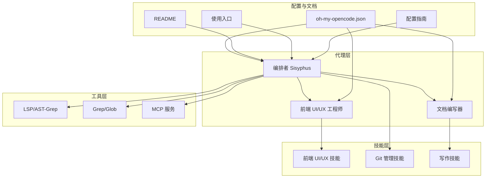
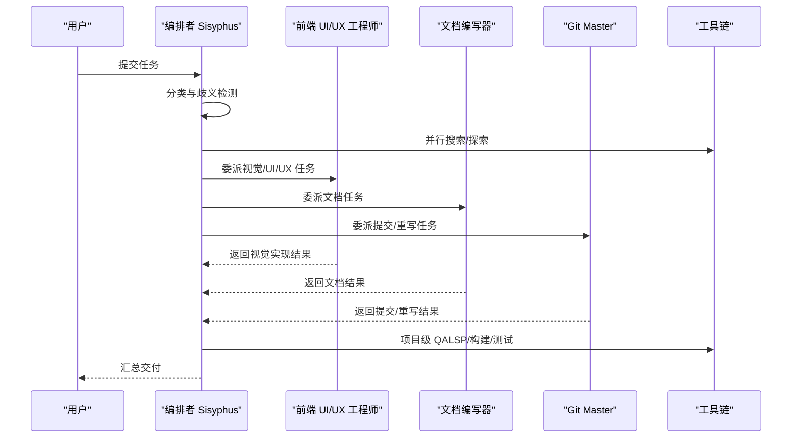
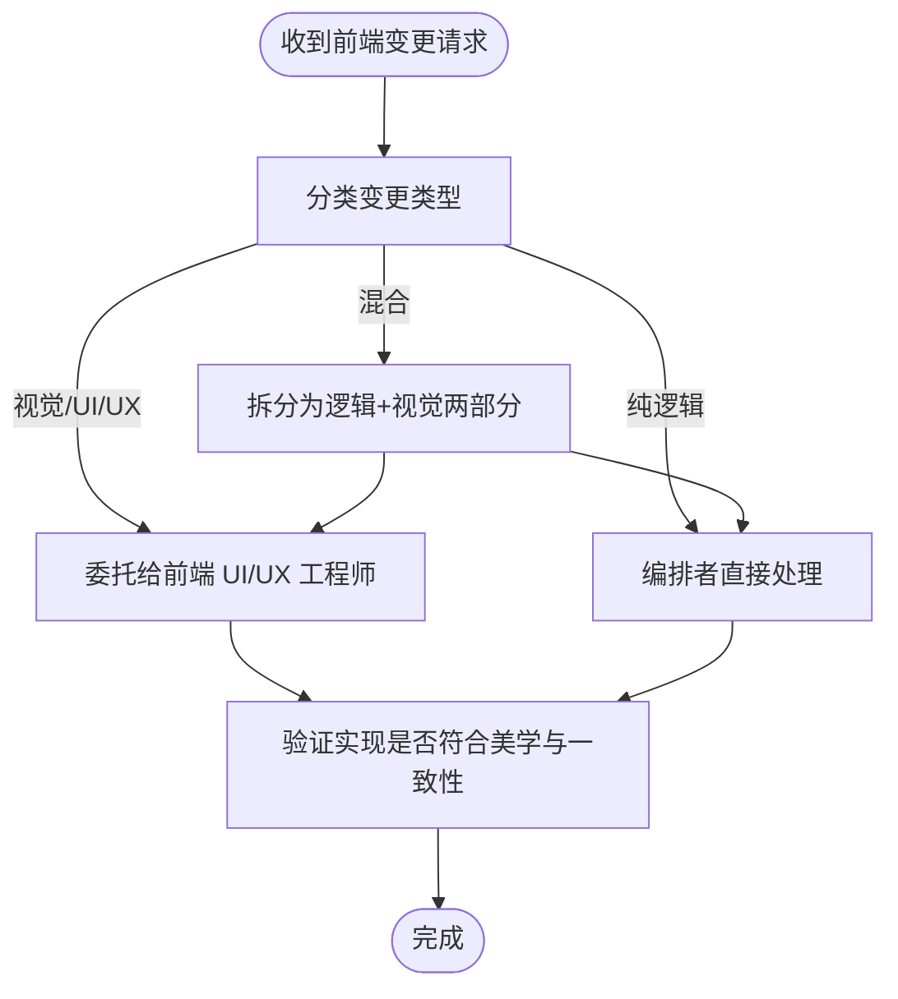
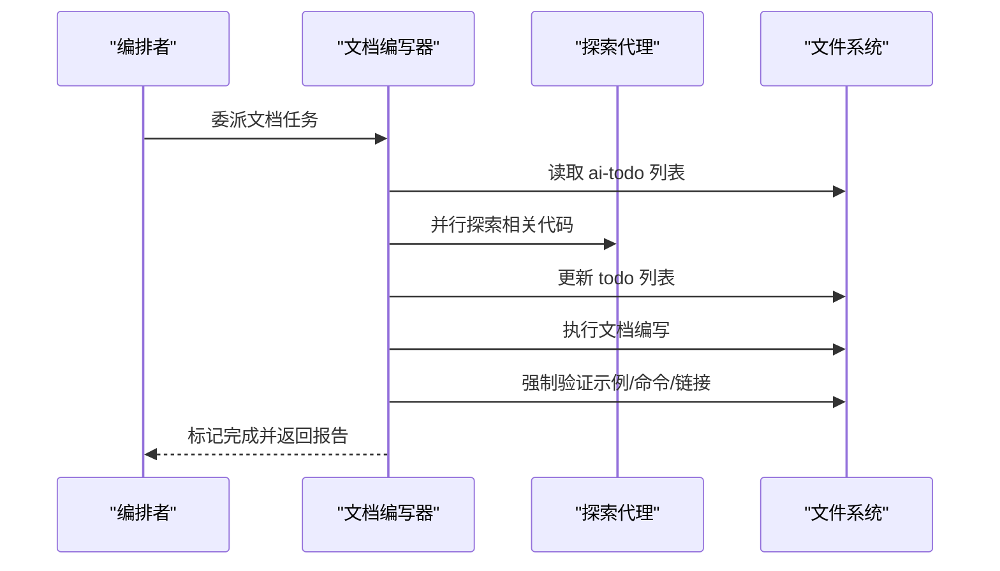
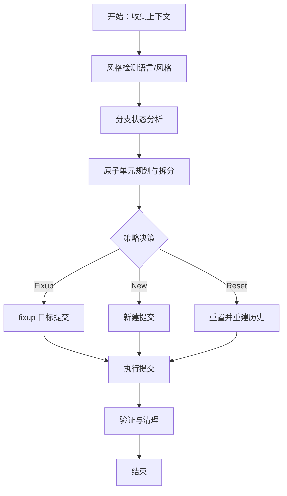
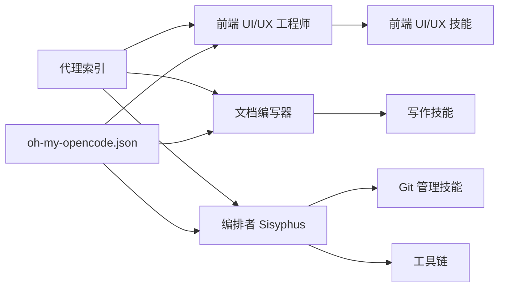

# 开发专精代理

<cite>
**本文引用的文件**
- [src/agents/frontend-ui-ux-engineer.ts](file://src/agents/frontend-ui-ux-engineer.ts)
- [src/agents/document-writer.ts](file://src/agents/document-writer.ts)
- [src/agents/orchestrator-sisyphus.ts](file://src/agents/orchestrator-sisyphus.ts)
- [src/features/builtin-skills/frontend-ui-ux/SKILL.md](file://src/features/builtin-skills/frontend-ui-ux/SKILL.md)
- [src/features/builtin-skills/git-master/SKILL.md](file://src/features/builtin-skills/git-master/SKILL.md)
- [src/features/builtin-skills/writing-skills/SKILL.md](file://src/features/builtin-skills/writing-skills/SKILL.md)
- [src/agents/index.ts](file://src/agents/index.ts)
- [CONFIGURATION-GUIDE.md](file://CONFIGURATION-GUIDE.md)
- [USAGE-ENTRY.md](file://USAGE-ENTRY.md)
- [README.md](file://README.md)
- [assets/oh-my-opencode.schema.json](file://assets/oh-my-opencode.schema.json)
</cite>

## 目录
1. [简介](#简介)
2. [项目结构](#项目结构)
3. [核心组件](#核心组件)
4. [架构总览](#架构总览)
5. [详细组件分析](#详细组件分析)
6. [依赖关系分析](#依赖关系分析)
7. [性能考虑](#性能考虑)
8. [故障排除指南](#故障排除指南)
9. [结论](#结论)
10. [附录](#附录)

## 简介
本文件面向“开发专精代理系统”的使用者与维护者，聚焦三类专业代理的能力与协作方式：
- 前端 UI/UX 工程师（Frontend UI/UX Engineer）：负责视觉与交互层面的设计与实现，强调美学、细节与一致性。
- 文档编写器（Document Writer）：负责技术文档的创作与验证，确保准确性、完整性与一致性。
- 版本控制专家（Git Master）：负责原子化提交、历史重写与分支管理，确保提交质量与可追溯性。

系统通过“编排者（Sisyphus）”统一调度上述专业代理，结合内置技能与工具链，形成从需求到交付的闭环工作流，并提供配置与最佳实践指导。

## 项目结构
该仓库围绕“代理 + 技能 + 工具 + 配置”的模块化架构组织，关键目录与职责如下：
- src/agents：内置代理定义与编排逻辑
- src/features/builtin-skills：内置技能（如前端 UI/UX、Git 管理、写作技能等）
- src/tools：工具集（如 LSP、AST-Grep、Grep、交互式 Bash 等）
- 配置与文档：README、使用入口、配置指南、模式定义等

图表来源
- [src/agents/frontend-ui-ux-engineer.ts](file://src/agents/frontend-ui-ux-engineer.ts#L1-L110)
- [src/agents/document-writer.ts](file://src/agents/document-writer.ts#L1-L225)
- [src/agents/orchestrator-sisyphus.ts](file://src/agents/orchestrator-sisyphus.ts#L1-L800)
- [src/features/builtin-skills/frontend-ui-ux/SKILL.md](file://src/features/builtin-skills/frontend-ui-ux/SKILL.md#L1-L79)
- [src/features/builtin-skills/git-master/SKILL.md](file://src/features/builtin-skills/git-master/SKILL.md#L1-L1106)
- [src/features/builtin-skills/writing-skills/SKILL.md](file://src/features/builtin-skills/writing-skills/SKILL.md#L1-L109)
- [CONFIGURATION-GUIDE.md](file://CONFIGURATION-GUIDE.md#L1-L289)
- [USAGE-ENTRY.md](file://USAGE-ENTRY.md#L1-L201)
- [README.md](file://README.md#L1-L1250)

章节来源
- [README.md](file://README.md#L1-L1250)
- [CONFIGURATION-GUIDE.md](file://CONFIGURATION-GUIDE.md#L1-L289)
- [USAGE-ENTRY.md](file://USAGE-ENTRY.md#L1-L201)

## 核心组件
- 前端 UI/UX 工程师代理
  - 角色定位：设计师转前端工程师，专注视觉与交互体验，强调美学与细节。
  - 关键特性：严格的“视觉变更硬阻”策略，避免直接编辑样式；强调研究现有模式、匹配团队风格、透明沟通。
  - 触发条件：仅处理纯视觉/UI/UX 变更，混合变更需拆分。
- 文档编写器代理
  - 角色定位：技术写作专家，负责 README、API 文档、架构文档与用户指南。
  - 关键特性：强制验证（代码示例、命令、链接）、严格的质量检查清单、一次性只处理一个任务。
  - 触发条件：文档类任务必须委托给该代理。
- 版本控制专家代理（Git Master）
  - 角色定位：Git 专家，负责原子化提交、历史重写、分支清理与历史检索。
  - 关键特性：多提交默认策略、按目录/模块拆分、测试与实现配对、语言与风格检测、强制验证。
- 编排者 Sisyphus
  - 角色定位：主控代理，负责分类任务、选择代理或技能、并行执行与质量保证。
  - 关键特性：前端视觉变更硬阻、文档任务自动委托、项目级 QA（LSP 诊断、构建/测试、交叉验证）。

章节来源
- [src/agents/frontend-ui-ux-engineer.ts](file://src/agents/frontend-ui-ux-engineer.ts#L1-L110)
- [src/agents/document-writer.ts](file://src/agents/document-writer.ts#L1-L225)
- [src/agents/orchestrator-sisyphus.ts](file://src/agents/orchestrator-sisyphus.ts#L1-L800)
- [src/features/builtin-skills/git-master/SKILL.md](file://src/features/builtin-skills/git-master/SKILL.md#L1-L1106)

## 架构总览
系统采用“编排者 + 专业代理 + 技能 + 工具”的分层架构。编排者根据任务类型自动选择合适的子代理或技能，并通过工具链（LSP、Grep、MCP 等）提升执行效率与质量。

图表来源
- [src/agents/orchestrator-sisyphus.ts](file://src/agents/orchestrator-sisyphus.ts#L1-L800)
- [src/agents/frontend-ui-ux-engineer.ts](file://src/agents/frontend-ui-ux-engineer.ts#L1-L110)
- [src/agents/document-writer.ts](file://src/agents/document-writer.ts#L1-L225)
- [src/features/builtin-skills/git-master/SKILL.md](file://src/features/builtin-skills/git-master/SKILL.md#L1-L1106)

## 详细组件分析

### 前端 UI/UX 工程师代理
- 设计原则
  - 明确的“视觉变更硬阻”：任何涉及样式、布局、动画、响应式断点、悬停状态、阴影、边框、图标、图片的变更一律委托给该代理。
  - 纯逻辑变更（API、数据获取、状态管理、事件处理器、类型定义、工具函数、业务逻辑）可由编排者直接处理。
  - 混合变更需拆分：逻辑部分由编排者处理，视觉部分委托给前端代理。
- 美学指南
  - 字体：避免通用字体，强调字体组合与可读性。
  - 色彩：使用 CSS 变量，强调主题一致性与高对比度。
  - 动效：聚焦高影响力时刻，优先使用 CSS，必要时使用 React Motion。
  - 布局：强调非对称、重叠、对角线流动、打破网格，营造独特氛围。
  - 反模式：避免通用字体、陈词滥调配色、可预测布局与“千篇一律”的设计。
- 执行复杂度匹配美学愿景：极简主义强调留白与排版，极繁主义强调丰富的动画与效果。

图表来源
- [src/agents/orchestrator-sisyphus.ts](file://src/agents/orchestrator-sisyphus.ts#L402-L483)
- [src/agents/frontend-ui-ux-engineer.ts](file://src/agents/frontend-ui-ux-engineer.ts#L1-L110)
- [src/features/builtin-skills/frontend-ui-ux/SKILL.md](file://src/features/builtin-skills/frontend-ui-ux/SKILL.md#L1-L79)

章节来源
- [src/agents/frontend-ui-ux-engineer.ts](file://src/agents/frontend-ui-ux-engineer.ts#L1-L110)
- [src/features/builtin-skills/frontend-ui-ux/SKILL.md](file://src/features/builtin-skills/frontend-ui-ux/SKILL.md#L1-L79)
- [src/agents/orchestrator-sisyphus.ts](file://src/agents/orchestrator-sisyphus.ts#L402-L483)

### 文档编写器代理
- 角色与职责
  - 专注于 README、API 文档、架构文档与用户指南的创作。
  - 强制验证：所有代码示例必须可运行，命令必须可执行，链接必须有效。
  - 严格的质量检查清单：清晰度、完整性、准确性、一致性。
- 工作流程
  - 读取 ai-todo 列表与相关描述文件
  - 识别当前任务，使用“探索”代理进行广泛代码库搜索
  - 更新 todo 列表中的“当前进行中”状态
  - 执行文档编写，强制验证
  - 标记任务完成并生成完成报告
- 最佳实践
  - 使用最大并行度进行只读操作
  - 使用“探索”代理进行广泛的代码库搜索
  - 一次只处理一个任务，完成后再次触发

图表来源
- [src/agents/document-writer.ts](file://src/agents/document-writer.ts#L1-L225)
- [src/agents/orchestrator-sisyphus.ts](file://src/agents/orchestrator-sisyphus.ts#L436-L483)

章节来源
- [src/agents/document-writer.ts](file://src/agents/document-writer.ts#L1-L225)
- [src/agents/orchestrator-sisyphus.ts](file://src/agents/orchestrator-sisyphus.ts#L436-L483)

### 版本控制专家代理（Git Master）
- 核心原则
  - 多提交默认策略：3+ 文件变更必须拆分为至少 2 个提交，5+ 文件至少 3 个提交，10+ 文件至少 5 个提交。
  - 目录/模块优先拆分：不同目录/组件类型必须拆分；可独立回滚的变更必须拆分；UI/逻辑/配置/测试不同关注点必须拆分。
  - 测试与实现配对：测试文件必须与实现文件在同一提交中。
  - 语言与风格检测：基于最近 30 条提交检测语言与风格（语义化、简洁、句子、短语），并据此生成提交信息。
- 执行流程
  - 并行收集上下文（状态、差异、历史、分支）
  - 风格检测与分支状态分析
  - 原子单元规划与拆分理由说明
  - 提交策略决策（fixup/new/重置重建）
  - 提交执行与验证
  - 清理与最终报告

图表来源
- [src/features/builtin-skills/git-master/SKILL.md](file://src/features/builtin-skills/git-master/SKILL.md#L1-L1106)

章节来源
- [src/features/builtin-skills/git-master/SKILL.md](file://src/features/builtin-skills/git-master/SKILL.md#L1-L1106)

### 编排者 Sisyphus（Master Orchestrator）
- 任务分类与歧义检测
  - 触发条件：外部库/源码提及、多模块涉及、GitHub 提及、明确“查看并创建 PR”等。
  - 分类：简单直接、显式、探索性、开放性、GitHub 工作、模糊。
  - 对模糊场景必须提问澄清，避免错误执行。
- 并行执行与背景任务
  - 默认使用“探索/图书管理员”并行搜索，必要时调用“先知”进行深度咨询。
  - 支持后台任务与结果收集，减少等待时间。
- 委派与质量保证
  - 前端视觉变更硬阻：必须委托给前端 UI/UX 工程师。
  - 文档任务自动委托给文档编写器。
  - 项目级 QA：LSP 诊断、构建/测试、交叉验证、证据要求。
- 项目级约束与反模式
  - 硬阻：禁止直接编辑视觉代码、禁止类型错误抑制、禁止未请求提交、禁止推测未读代码、禁止遗留破坏性状态。
  - 反模式：类型安全、错误处理、测试、搜索、前端、调试等领域的常见陷阱。

章节来源
- [src/agents/orchestrator-sisyphus.ts](file://src/agents/orchestrator-sisyphus.ts#L1-L800)

## 依赖关系分析
- 代理注册与导出
  - 内置代理集中注册于代理索引文件，便于统一加载与使用。
- 技能与代理的耦合
  - 前端 UI/UX 技能与前端代理紧密耦合，Git 管理技能与版本控制流程强关联。
- 工具与代理的协作
  - 编排者通过工具链（LSP、Grep、AST-Grep、MCP）提升搜索与验证效率。
- 配置与优先级
  - 项目级配置优先于全局配置，支持覆盖模型、温度、提示词追加与默认技能。

图表来源
- [src/agents/index.ts](file://src/agents/index.ts#L1-L37)
- [CONFIGURATION-GUIDE.md](file://CONFIGURATION-GUIDE.md#L1-L289)
- [assets/oh-my-opencode.schema.json](file://assets/oh-my-opencode.schema.json#L1850-L1904)

章节来源
- [src/agents/index.ts](file://src/agents/index.ts#L1-L37)
- [CONFIGURATION-GUIDE.md](file://CONFIGURATION-GUIDE.md#L1-L289)
- [assets/oh-my-opencode.schema.json](file://assets/oh-my-opencode.schema.json#L1850-L1904)

## 性能考虑
- 并行搜索与后台任务
  - 编排者默认并行启动“探索/图书管理员”等代理，缩短上下文收集时间。
- 背景输出与取消
  - 使用后台输出收集机制，在需要时再拉取结果，并在完成后统一取消任务，节省资源。
- 上下文窗口管理
  - 自动压缩与动态截断工具（Grep 输出、工具输出）防止上下文溢出。
- 模型与温度配置
  - 不同代理与技能使用不同模型与温度，确保在创意、严谨与效率之间取得平衡。

## 故障排除指南
- 前端视觉变更被错误地直接修改
  - 现象：编排者拒绝直接编辑前端样式文件。
  - 处理：将视觉变更委托给前端 UI/UX 工程师代理，或拆分为逻辑与视觉两部分。
- 文档任务未按预期完成
  - 现象：文档编写器未验证代码示例或链接。
  - 处理：确保任务来自 ai-todo 列表，遵循验证流程，一次性只处理一个任务。
- Git 提交不符合规范
  - 现象：单次提交包含过多文件或未按目录拆分。
  - 处理：遵循“多提交默认策略”，按目录/模块/关注点拆分，并提供合理拆分理由。
- 项目级 QA 失败
  - 现象：LSP 诊断失败、构建/测试不通过、委托结果未验证。
  - 处理：在每次委托完成后执行项目级 QA，确保变更符合要求。

章节来源
- [src/agents/orchestrator-sisyphus.ts](file://src/agents/orchestrator-sisyphus.ts#L560-L601)
- [src/agents/document-writer.ts](file://src/agents/document-writer.ts#L128-L162)
- [src/features/builtin-skills/git-master/SKILL.md](file://src/features/builtin-skills/git-master/SKILL.md#L30-L110)

## 结论
本系统通过“编排者 + 专业代理 + 技能 + 工具”的协同架构，实现了从需求到交付的高效闭环。前端 UI/UX 工程师代理专注于美学与细节，文档编写器确保技术文档的准确性与可读性，版本控制专家保障提交质量与历史可追溯性。编排者在其中承担了分类、委派、并行执行与质量保证的核心职责，配合工具链与配置体系，形成可扩展、可验证、可迭代的开发流水线。

## 附录

### 开发流程集成与最佳实践
- 典型工作流
  - 自然对话触发 → 自动技能建议 → 显式调用技能 → 并行执行 → 质量保证 → 交付
- 关键最佳实践
  - 前端变更：一律委托前端代理；混合变更拆分；严格遵循美学指南。
  - 文档任务：强制验证；使用最大并行度；一次性只处理一个任务。
  - Git 提交：多提交默认；按目录/模块拆分；测试与实现配对；语言与风格检测。
  - 编排者：并行搜索、后台任务、项目级 QA、证据要求。

章节来源
- [USAGE-ENTRY.md](file://USAGE-ENTRY.md#L1-L201)
- [README.md](file://README.md#L1-L1250)

### 配置方法与示例
- 配置优先级
  - 项目级 > 全局级 > 本地项目级 > 代码默认
- 推荐配置要点
  - 覆盖代理模型与温度
  - 为“视觉/超脑/写作”类别设置默认技能与提示词追加
  - 启用规划代理（Metis/Prometheus/Momus）以获得完整规划流程

章节来源
- [CONFIGURATION-GUIDE.md](file://CONFIGURATION-GUIDE.md#L1-L289)
- [assets/oh-my-opencode.schema.json](file://assets/oh-my-opencode.schema.json#L1850-L1904)