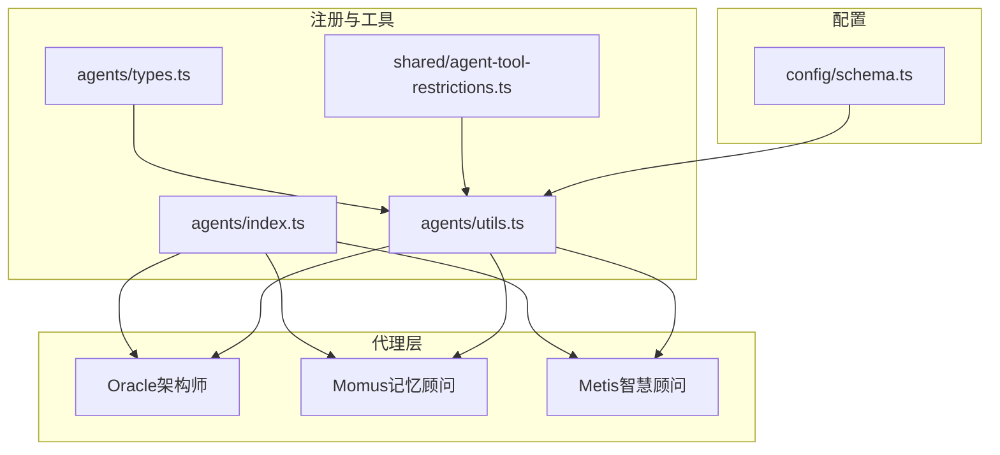
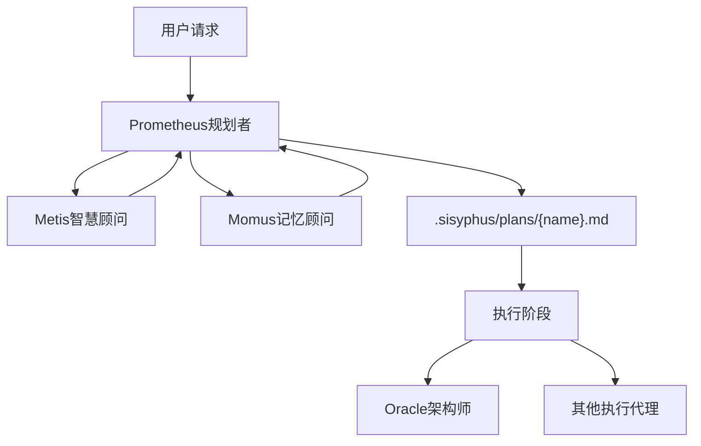
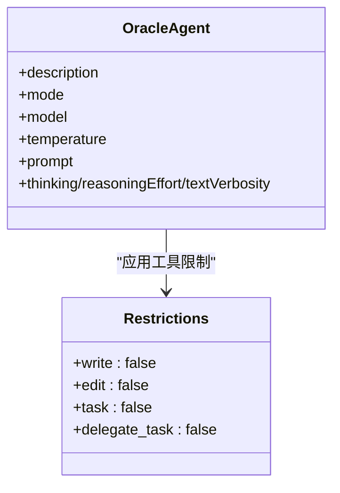
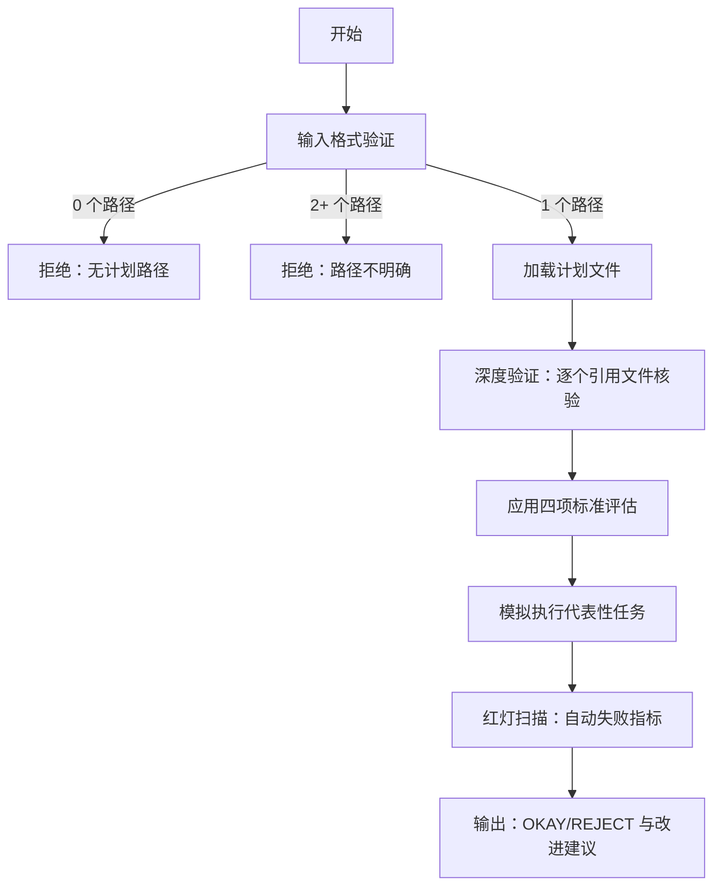
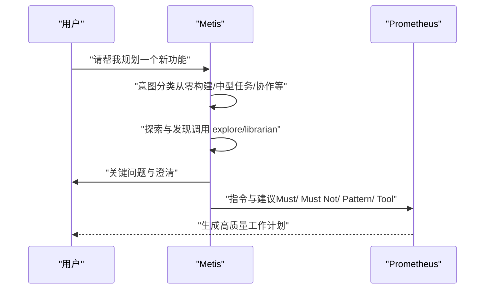
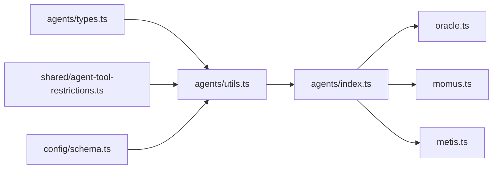

# 架构顾问代理

<cite>
**本文引用的文件**
- [src/agents/oracle.ts](file://src/agents/oracle.ts)
- [src/agents/momus.ts](file://src/agents/momus.ts)
- [src/agents/metis.ts](file://src/agents/metis.ts)
- [src/agents/index.ts](file://src/agents/index.ts)
- [src/agents/utils.ts](file://src/agents/utils.ts)
- [src/agents/types.ts](file://src/agents/types.ts)
- [src/shared/agent-tool-restrictions.ts](file://src/shared/agent-tool-restrictions.ts)
- [src/config/schema.ts](file://src/config/schema.ts)
- [docs/SUBAGENTS-COMPARISON.md](file://docs/SUBAGENTS-COMPARISON.md)
- [docs/orchestration-guide.md](file://docs/orchestration-guide.md)
- [src/agents/momus.test.ts](file://src/agents/momus.test.ts)
- [docs/CODEX-MCP-REPLACEMENT-PLAN.md](file://docs/CODEX-MCP-REPLACEMENT-PLAN.md)
</cite>

## 目录
1. [简介](#简介)
2. [项目结构](#项目结构)
3. [核心组件](#核心组件)
4. [架构总览](#架构总览)
5. [组件详解](#组件详解)
6. [依赖关系分析](#依赖关系分析)
7. [性能考量](#性能考量)
8. [故障排查指南](#故障排查指南)
9. [结论](#结论)
10. [附录](#附录)

## 简介
本文件面向架构顾问代理系统，聚焦三大核心代理：Oracle（架构师）、Momus（记忆顾问）、Metis（智慧顾问）。它们分别承担“高阶架构决策咨询”“工作计划的高精度审查”“规划前的意图与风险预分析”的职责。文档将从功能特性、使用场景、触发条件、最佳实践、配置选项与性能考虑等方面展开，并提供实际咨询案例与集成指南。

## 项目结构
- 代理注册与导出：在统一入口集中注册内置代理，便于系统按需启用与覆盖。
- 代理工厂与元数据：每个代理提供工厂函数与 Prompt 元数据，用于动态构建提示词与委托表。
- 工具权限控制：通过工具白/黑名单限制代理行为，确保只读或受限访问。
- 配置体系：支持按类别继承模型、温度、思维预算等参数，以及覆盖与追加提示词。

**图表来源**
- [src/agents/index.ts](file://src/agents/index.ts#L17-L32)
- [src/agents/utils.ts](file://src/agents/utils.ts#L141-L223)
- [src/agents/types.ts](file://src/agents/types.ts#L29-L53)
- [src/shared/agent-tool-restrictions.ts](file://src/shared/agent-tool-restrictions.ts#L49-L56)
- [src/config/schema.ts](file://src/config/schema.ts#L109-L151)

**章节来源**
- [src/agents/index.ts](file://src/agents/index.ts#L17-L32)
- [src/agents/utils.ts](file://src/agents/utils.ts#L141-L223)
- [src/agents/types.ts](file://src/agents/types.ts#L29-L53)
- [src/shared/agent-tool-restrictions.ts](file://src/shared/agent-tool-restrictions.ts#L49-L56)
- [src/config/schema.ts](file://src/config/schema.ts#L109-L151)

## 核心组件
- Oracle（架构师）
  - 角色：只读咨询专家，专注复杂架构设计与疑难调试的高阶推理。
  - 触发条件：多系统权衡、不熟悉模式、完成重大实现后的自审、多次修复尝试失败。
  - 使用时机：复杂架构设计、完成阶段性工作、调试陷入僵局、安全/性能担忧、跨系统权衡。
  - 避免使用：简单文件操作、首次尝试即解决的问题、可从已读代码推断的问题、微不足道的决定。
  - 模型与思考：默认模型，GPT 系列采用中等推理强度与高文本冗余；其他系列启用长思维预算。
  - 权限：仅允许只读工具，避免直接修改文件。
- Momus（记忆顾问）
  - 角色：工作计划的高精度审查者，严格校验清晰度、可验证性与完整性。
  - 触发条件：工作计划创建后，进入审查阶段。
  - 使用时机：计划创建后、复杂待办列表执行前、需要严谨质量把关时。
  - 审查维度：工作内容清晰度、验证与验收标准、上下文完整性、整体目标与流程理解。
  - 输出：OKAY 或 REJECT，并给出关键改进建议。
  - 输入格式：单个有效计划路径（.sisyphus/plans/*.md），忽略系统指令与包装。
- Metis（智慧顾问）
  - 角色：规划前的意图分析与风险预判者，防止 AI 过度工程与歧义导致的返工。
  - 触发条件：用户请求模糊或开放、需要 scope 明确化、存在潜在 AI 模式风险。
  - 使用时机：规划非平凡任务之前、用户请求含糊时、需要防止过度设计时。
  - 意图分类：重构、从零构建、中型任务、协作、架构、研究。
  - 输出：意图分类、探索发现、关键问题、风险与指令、推荐方法。

**章节来源**
- [src/agents/oracle.ts](file://src/agents/oracle.ts#L8-L32)
- [src/agents/oracle.ts](file://src/agents/oracle.ts#L100-L126)
- [src/agents/momus.ts](file://src/agents/momus.ts#L22-L392)
- [src/agents/momus.ts](file://src/agents/momus.ts#L394-L419)
- [src/agents/momus.ts](file://src/agents/momus.ts#L421-L447)
- [src/agents/metis.ts](file://src/agents/metis.ts#L19-L272)
- [src/agents/metis.ts](file://src/agents/metis.ts#L283-L296)
- [src/agents/metis.ts](file://src/agents/metis.ts#L298-L318)

## 架构总览
顾问代理系统遵循“规划前咨询 → 计划审查 → 执行与验证”的闭环。Metis 在 Prometheus 生成计划前进行意图与风险分析；Momus 对计划进行高精度审查；Oracle 在执行阶段提供只读架构咨询与调试支持。

**图表来源**
- [docs/orchestration-guide.md](file://docs/orchestration-guide.md#L37-L60)
- [docs/SUBAGENTS-COMPARISON.md](file://docs/SUBAGENTS-COMPARISON.md#L3534-L3580)

**章节来源**
- [docs/orchestration-guide.md](file://docs/orchestration-guide.md#L37-L80)
- [docs/SUBAGENTS-COMPARISON.md](file://docs/SUBAGENTS-COMPARISON.md#L3534-L3580)

## 组件详解

### Oracle（架构师）详解
- 功能要点
  - 高阶架构决策与系统权衡：对复杂设计进行系统性拆解与建议。
  - 只读咨询：不直接修改文件，提供可执行的建议与步骤估算。
  - 决策框架：强调最小可行、复用既有、开发者体验优先、一次明确路径、深度匹配复杂度、投资信号与停止条件。
- 使用场景
  - 多系统集成与权衡
  - 完成重大实现后的自审
  - 多次修复尝试失败后的突破
  - 不熟悉的代码模式与深层问题
  - 安全与性能敏感场景
- 触发与时机
  - 触发条件：多系统权衡、完成重大实现、多次失败尝试、不熟悉模式、安全/性能担忧。
  - 使用时机：复杂架构设计、完成阶段性工作、调试陷入僵局、跨系统权衡。
- 配置与权限
  - 默认模型与温度设置，GPT 系列与非 GPT 系列采用不同推理/思考配置。
  - 工具限制：仅允许只读工具，避免直接写入。
- 性能与成本
  - 高成本代理，适合关键节点使用；合理控制调用频次与上下文长度。

**图表来源**
- [src/agents/oracle.ts](file://src/agents/oracle.ts#L100-L126)
- [src/shared/agent-tool-restrictions.ts](file://src/shared/agent-tool-restrictions.ts#L20-L25)

**章节来源**
- [src/agents/oracle.ts](file://src/agents/oracle.ts#L8-L32)
- [src/agents/oracle.ts](file://src/agents/oracle.ts#L100-L126)
- [src/shared/agent-tool-restrictions.ts](file://src/shared/agent-tool-restrictions.ts#L20-L25)

### Momus（记忆顾问）详解
- 功能要点
  - 输入验证：严格提取单个计划路径，忽略系统指令与包装；拒绝无路径或多路径输入。
  - 四项审查标准：工作内容清晰度、验证与验收标准、上下文完整性、大局观与流程理解。
  - 审查流程：输入验证 → 深度验证（逐个引用文件核验）→ 应用四项标准 → 模拟执行代表性任务 → 红灯扫描 → 生成报告。
  - 输出：OKAY 或 REJECT，并列出关键改进建议。
- 使用场景
  - 计划创建后进行高精度审查
  - 复杂待办列表执行前的质量把关
  - 需要规避 ADHD 引发的遗漏与模糊
- 触发与时机
  - 触发条件：工作计划创建后。
  - 使用时机：计划创建后、复杂任务执行前、需要严谨质量把关时。
- 输入格式策略
  - 忽略系统指令块（如 [SYSTEM DIRECTIVE - READ-ONLY PLANNING CONSULTATION]）。
  - 支持对话式包装（如 “Please review .sisyphus/plans/plan.md”）。
  - 严格拒绝多路径或无路径情况。

**图表来源**
- [src/agents/momus.ts](file://src/agents/momus.ts#L140-L200)
- [src/agents/momus.ts](file://src/agents/momus.ts#L286-L359)

**章节来源**
- [src/agents/momus.ts](file://src/agents/momus.ts#L22-L392)
- [src/agents/momus.ts](file://src/agents/momus.ts#L394-L419)
- [src/agents/momus.ts](file://src/agents/momus.ts#L421-L447)
- [src/agents/momus.test.ts](file://src/agents/momus.test.ts#L8-L57)

### Metis（智慧顾问）详解
- 功能要点
  - 意图分类：重构、从零构建、中型任务、协作、架构、研究。
  - 风险预判：识别隐藏意图、消除歧义、标记 AI 过度工程模式。
  - 指令生成：为规划者提供可执行指令与问题清单。
- 使用场景
  - 规划非平凡任务之前
  - 用户请求模糊或开放
  - 需要防止 AI 过度工程与 scope 膨胀
- 触发与时机
  - 触发条件：复杂任务需要 scope 明确化、存在潜在歧义。
  - 使用时机：规划前、需要澄清边界与假设时。
- 输出结构
  - 意图分类、探索发现、关键问题、风险与指令、推荐方法。

**图表来源**
- [src/agents/metis.ts](file://src/agents/metis.ts#L19-L272)
- [src/agents/metis.ts](file://src/agents/metis.ts#L283-L296)
- [src/agents/metis.ts](file://src/agents/metis.ts#L298-L318)

**章节来源**
- [src/agents/metis.ts](file://src/agents/metis.ts#L19-L272)
- [src/agents/metis.ts](file://src/agents/metis.ts#L283-L296)
- [src/agents/metis.ts](file://src/agents/metis.ts#L298-L318)

## 依赖关系分析
- 代理注册与导出
  - agents/index.ts 将 Oracle、Momus、Metis 等内置代理集中导出，便于系统按名称检索与组合。
- 工具限制
  - shared/agent-tool-restrictions.ts 为 Oracle、Momus、Metis 等代理提供工具白/黑名单，确保只读或受限访问。
- 配置与覆盖
  - agents/utils.ts 负责根据类别配置、覆盖参数与技能注入，动态构建代理配置。
  - config/schema.ts 定义代理覆盖的字段（模型、温度、工具、描述等），支持按名称覆盖与禁用。
- 类型与元数据
  - agents/types.ts 定义代理分类、成本、触发器与 Prompt 元数据接口，支撑动态提示词段落生成。

**图表来源**
- [src/agents/types.ts](file://src/agents/types.ts#L29-L53)
- [src/shared/agent-tool-restrictions.ts](file://src/shared/agent-tool-restrictions.ts#L49-L56)
- [src/config/schema.ts](file://src/config/schema.ts#L109-L151)
- [src/agents/utils.ts](file://src/agents/utils.ts#L141-L223)
- [src/agents/index.ts](file://src/agents/index.ts#L17-L32)

**章节来源**
- [src/agents/index.ts](file://src/agents/index.ts#L17-L32)
- [src/agents/utils.ts](file://src/agents/utils.ts#L141-L223)
- [src/agents/types.ts](file://src/agents/types.ts#L29-L53)
- [src/shared/agent-tool-restrictions.ts](file://src/shared/agent-tool-restrictions.ts#L49-L56)
- [src/config/schema.ts](file://src/config/schema.ts#L109-L151)

## 性能考量
- 代理成本
  - Oracle、Momus、Metis 属于高成本代理，应谨慎调用，集中在关键节点使用。
- 思维预算与推理
  - 非 GPT 系列代理启用长思维预算；GPT 系列采用中等推理强度与高文本冗余，平衡深度与成本。
- 工具限制
  - 通过工具限制减少不必要的外部调用与上下文膨胀，降低延迟与费用。
- 配置继承
  - 通过类别配置继承模型与温度，避免重复设置，提升一致性与可维护性。

**章节来源**
- [src/agents/oracle.ts](file://src/agents/oracle.ts#L118-L122)
- [src/agents/metis.ts](file://src/agents/metis.ts#L289-L292)
- [src/shared/agent-tool-restrictions.ts](file://src/shared/agent-tool-restrictions.ts#L20-L25)
- [src/config/schema.ts](file://src/config/schema.ts#L170-L186)

## 故障排查指南
- Momus 输入格式问题
  - 现象：输入被拒绝（无路径或路径不明确）。
  - 排查：确认输入中仅包含一个 .sisyphus/plans/*.md 路径；忽略系统指令块与对话式包装。
  - 参考测试：验证系统指令剥离、路径提取策略与拒绝逻辑。
- 计划审查未通过
  - 现象：返回 REJECT 并列出关键改进建议。
  - 排查：检查计划是否满足四项标准（清晰度、可验证性、上下文完整性、大局观）；逐条核验引用文件与验收标准。
- Metis 未生成明确指令
  - 现象：Metis 输出较为宽泛，缺乏可执行指令。
  - 排查：确认用户请求是否足够具体；必要时引导用户提供边界与假设，促使 Metis 进行更深入的探索与提问。

**章节来源**
- [src/agents/momus.test.ts](file://src/agents/momus.test.ts#L8-L57)
- [src/agents/momus.ts](file://src/agents/momus.ts#L140-L200)
- [src/agents/momus.ts](file://src/agents/momus.ts#L286-L359)

## 结论
Oracle、Momus、Metis 三者协同，形成“规划前咨询 → 计划审查 → 执行支持”的闭环。Metis 预防歧义与过度工程，Momus 确保计划质量，Oracle 提供高阶架构与调试支持。通过严格的工具限制、配置继承与成本控制，系统在保证质量的同时兼顾效率与可控性。

## 附录

### 使用时机与最佳实践
- Metis
  - 在复杂任务或模糊请求出现时优先调用，确保 scope 明确、边界清晰。
  - 与探索类代理联动，先发现再提问，避免凭空臆测。
- Momus
  - 计划生成后立即审查，确保可执行性与可验证性。
  - 对关键路径与验收标准进行重点核验，杜绝模糊表述。
- Oracle
  - 在跨系统权衡、安全/性能敏感场景或调试陷入僵局时调用。
  - 以“最小可行方案”为原则，避免过度设计。

### 集成指南
- 注册与启用
  - 在 agents/index.ts 中确认 Oracle、Momus、Metis 已注册。
  - 通过 agents/utils.ts 的 createBuiltinAgents 按需启用与覆盖。
- 配置覆盖
  - 使用 config/schema.ts 中的 AgentOverrideConfig 字段覆盖模型、温度、工具、描述等。
  - 通过类别配置继承模型与思考预算，保持一致性。
- MCP/外部集成参考
  - 可参考替代方案文档中的调用示例，结合系统工具链进行扩展。

**章节来源**
- [src/agents/index.ts](file://src/agents/index.ts#L17-L32)
- [src/agents/utils.ts](file://src/agents/utils.ts#L141-L223)
- [src/config/schema.ts](file://src/config/schema.ts#L109-L151)
- [docs/CODEX-MCP-REPLACEMENT-PLAN.md](file://docs/CODEX-MCP-REPLACEMENT-PLAN.md#L654-L670)