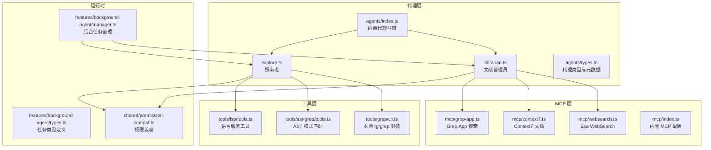
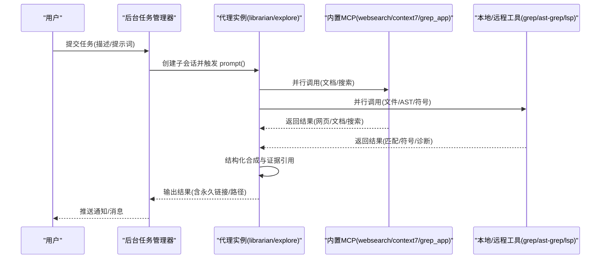
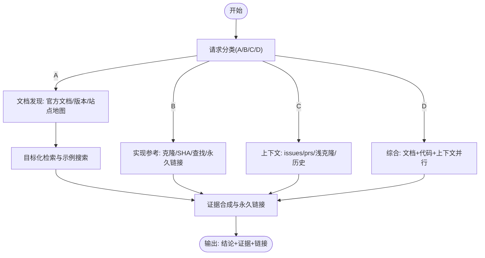
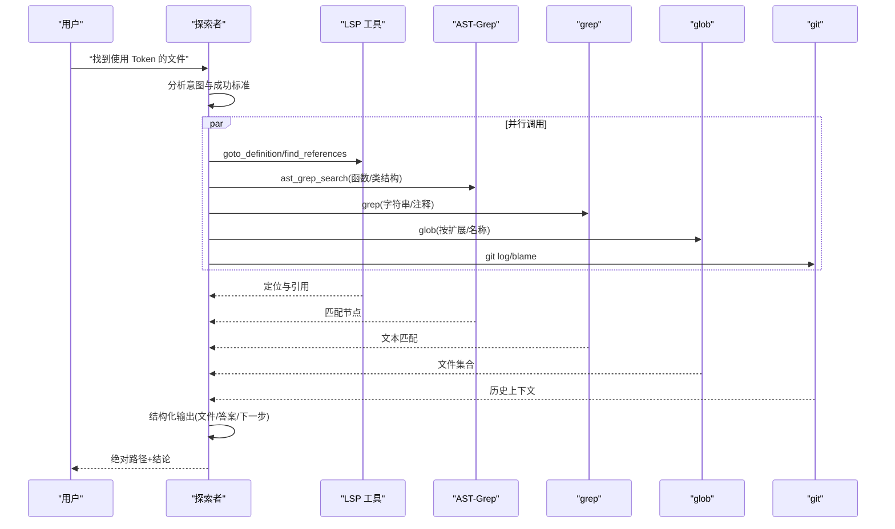
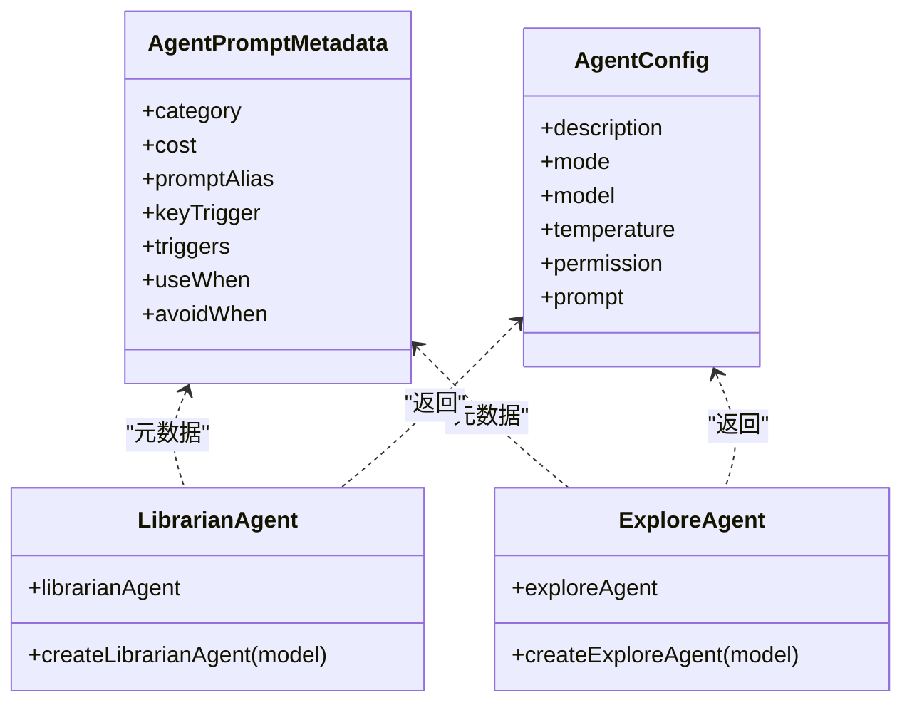
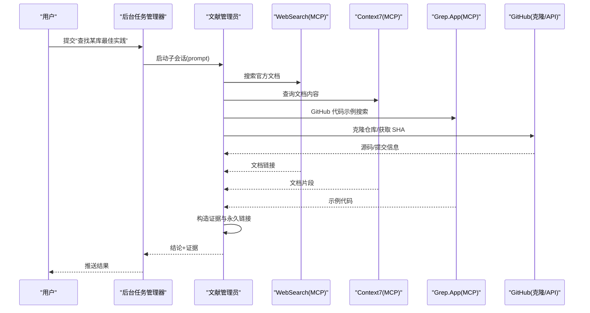
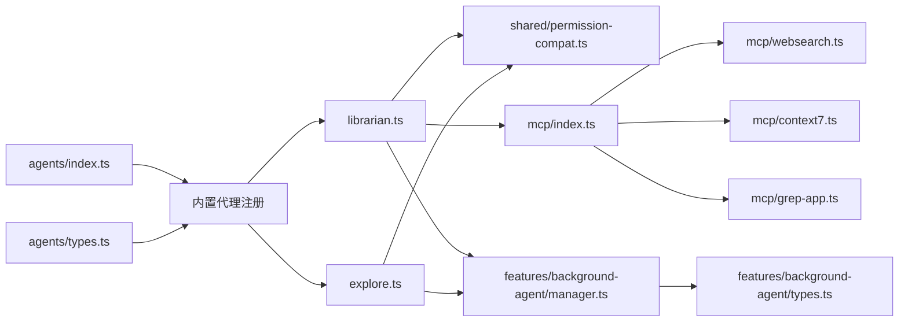

# 研究知识代理

<cite>
**本文引用的文件**
- [src/agents/librarian.ts](file://src/agents/librarian.ts)
- [src/agents/explore.ts](file://src/agents/explore.ts)
- [src/agents/index.ts](file://src/agents/index.ts)
- [src/agents/types.ts](file://src/agents/types.ts)
- [AGENTS.md](file://AGENTS.md)
- [src/mcp/context7.ts](file://src/mcp/context7.ts)
- [src/mcp/grep-app.ts](file://src/mcp/grep-app.ts)
- [src/mcp/websearch.ts](file://src/mcp/websearch.ts)
- [src/mcp/index.ts](file://src/mcp/index.ts)
- [src/tools/grep/cli.ts](file://src/tools/grep/cli.ts)
- [src/tools/ast-grep/tools.ts](file://src/tools/ast-grep/tools.ts)
- [src/tools/lsp/tools.ts](file://src/tools/lsp/tools.ts)
- [src/shared/permission-compat.ts](file://src/shared/permission-compat.ts)
- [src/features/background-agent/manager.ts](file://src/features/background-agent/manager.ts)
- [src/features/background-agent/types.ts](file://src/features/background-agent/types.ts)
</cite>

## 目录
1. [简介](#简介)
2. [项目结构](#项目结构)
3. [核心组件](#核心组件)
4. [架构总览](#架构总览)
5. [详细组件分析](#详细组件分析)
6. [依赖关系分析](#依赖关系分析)
7. [性能考量](#性能考量)
8. [故障排查指南](#故障排查指南)
9. [结论](#结论)
10. [附录](#附录)

## 简介
本文件面向“研究知识代理”系统，聚焦两类关键代理：Librarian（文献管理员）与 Explore（探索者）。它们分别承担“外部知识检索与证据合成”和“代码库内多维度并行探索”的职责，贯穿代码库探索、文档查找、知识发现、信息整理等研发全流程。本文从架构、数据流、处理逻辑、集成点与错误处理等方面进行深入解析，并提供检索策略、索引机制、知识组织方式与使用场景说明。

## 项目结构
该系统采用模块化分层设计：
- agents 层：内置代理工厂与元数据，统一注册到内置代理表中
- mcp 层：内置远程 MCP（如 websearch、context7、grep_app），作为知识检索与搜索工具的桥接
- tools 层：本地/远程工具封装（如 grep、ast-grep、lsp），提供文件级搜索、语义符号、替换等能力
- features 层：后台任务管理、会话状态、钩子注入等运行时支撑
- shared 层：权限兼容、日志、通用工具等横切能力

图表来源
- [src/agents/librarian.ts](file://src/agents/librarian.ts#L1-L330)
- [src/agents/explore.ts](file://src/agents/explore.ts#L1-L126)
- [src/agents/index.ts](file://src/agents/index.ts#L1-L37)
- [src/agents/types.ts](file://src/agents/types.ts#L1-L87)
- [src/mcp/websearch.ts](file://src/mcp/websearch.ts#L1-L11)
- [src/mcp/context7.ts](file://src/mcp/context7.ts#L1-L7)
- [src/mcp/grep-app.ts](file://src/mcp/grep-app.ts#L1-L7)
- [src/mcp/index.ts](file://src/mcp/index.ts#L1-L32)
- [src/tools/grep/cli.ts](file://src/tools/grep/cli.ts#L1-L230)
- [src/tools/ast-grep/tools.ts](file://src/tools/ast-grep/tools.ts#L1-L113)
- [src/tools/lsp/tools.ts](file://src/tools/lsp/tools.ts#L1-L262)
- [src/shared/permission-compat.ts](file://src/shared/permission-compat.ts#L1-L78)
- [src/features/background-agent/manager.ts](file://src/features/background-agent/manager.ts#L1-L200)
- [src/features/background-agent/types.ts](file://src/features/background-agent/types.ts#L1-L65)

章节来源
- [AGENTS.md](file://AGENTS.md#L1-L182)

## 核心组件
- 文献管理员（Librarian）
  - 角色定位：多仓库分析、远程代码搜索、官方文档检索、实现示例查找
  - 模型默认：GLM-4.7-Free（开源模型）
  - 关键能力：按请求类型分类执行（概念、实现、上下文、综合），并强制要求证据引用与永久链接
  - 并行加速：支持多工具并行调用，文档发现阶段顺序执行，主阶段并行执行
- 探索者（Explore）
  - 角色定位：代码库上下文 grep 专家，回答“哪里有 X？”“哪些文件包含 Y？”“找到做 Z 的代码”
  - 模型默认：Grok-Code（开源模型）
  - 关键能力：首次行动即并行启动多个工具；要求绝对路径、完整覆盖、可直接推进
  - 工具策略：语义搜索（LSP）、结构模式（AST-Grep）、文本模式（grep）、文件名/扩展（glob）、历史演进（git）

章节来源
- [src/agents/librarian.ts](file://src/agents/librarian.ts#L24-L330)
- [src/agents/explore.ts](file://src/agents/explore.ts#L27-L126)
- [src/agents/index.ts](file://src/agents/index.ts#L17-L32)
- [src/agents/types.ts](file://src/agents/types.ts#L29-L53)
- [AGENTS.md](file://AGENTS.md#L104-L118)

## 架构总览
Librarian 与 Explore 均通过 OpenCode SDK 注册为子代理（subagent），由后台任务管理器驱动，结合内置 MCP 与本地工具完成跨域知识检索与代码探索。

图表来源
- [src/features/background-agent/manager.ts](file://src/features/background-agent/manager.ts#L79-L200)
- [src/agents/librarian.ts](file://src/agents/librarian.ts#L40-L325)
- [src/agents/explore.ts](file://src/agents/explore.ts#L36-L121)
- [src/mcp/index.ts](file://src/mcp/index.ts#L16-L32)

## 详细组件分析

### 文献管理员（Librarian）分析
- 请求分类与执行策略
  - 类型 A（概念）：先进行“文档发现”（官方文档 URL、版本校验、站点地图发现），再目标化检索与示例搜索
  - 类型 B（实现）：克隆仓库、获取提交 SHA、精确查找实现、构造永久链接
  - 类型 C（上下文）：并行查询 issues/prs、浅克隆查看历史与 blame、获取发布信息
  - 类型 D（综合）：先文档发现，再并行文档、代码与上下文三路调查
- 强制证据与永久链接
  - 所有断言必须附带官方文档或源码永久链接，支持从克隆或 API 获取 commit SHA
- 并行与加速
  - 主阶段建议至少 3–5 个并行调用，避免串行导致延迟
  - 查询多样化以提升召回（例如同一功能的不同表达）
- 失败恢复
  - 文档未找到：改用 README/源码直读
  - 搜索无结果：放宽/换角度查询
  - 限流：切换到本地克隆目录
  - 版本文档缺失：回退到最新版并标注
- 通信规则
  - 不暴露工具名，直接说“我将搜索代码库”
  - 必须 Markdown 格式，代码块带语言标识
  - 简洁事实导向，避免推测

图表来源
- [src/agents/librarian.ts](file://src/agents/librarian.ts#L56-L204)

章节来源
- [src/agents/librarian.ts](file://src/agents/librarian.ts#L1-L330)

### 探索者（Explore）分析
- 任务目标
  - 回答“哪里有 X？”“哪些文件包含 Y？”“找到做 Z 的代码”
- 并行执行与结构化输出
  - 首次行动必须并行启动 3+ 工具，交叉验证
  - 结果必须包含文件列表、直接答案与后续步骤
  - 路径必须为绝对路径，确保可直接导航
- 工具策略
  - 语义搜索：LSP（定义跳转、引用、符号、诊断）
  - 结构模式：AST-Grep（函数/类结构匹配）
  - 文本模式：grep（字符串/注释/日志）
  - 文件模式：glob（按名称/扩展过滤）
  - 历史演进：git（log/blame/show）
- 成功标准
  - 覆盖所有相关匹配
  - 直接推动下一步工作，无需追问
  - 地址实际需求而非仅字面问题

图表来源
- [src/agents/explore.ts](file://src/agents/explore.ts#L56-L121)
- [src/tools/lsp/tools.ts](file://src/tools/lsp/tools.ts#L29-L261)
- [src/tools/ast-grep/tools.ts](file://src/tools/ast-grep/tools.ts#L35-L113)
- [src/tools/grep/cli.ts](file://src/tools/grep/cli.ts#L132-L230)

章节来源
- [src/agents/explore.ts](file://src/agents/explore.ts#L1-L126)

### 类与关系（代码级）

图表来源
- [src/agents/types.ts](file://src/agents/types.ts#L29-L53)
- [src/agents/librarian.ts](file://src/agents/librarian.ts#L24-L40)
- [src/agents/explore.ts](file://src/agents/explore.ts#L27-L42)

章节来源
- [src/agents/types.ts](file://src/agents/types.ts#L1-L87)
- [src/agents/librarian.ts](file://src/agents/librarian.ts#L24-L40)
- [src/agents/explore.ts](file://src/agents/explore.ts#L27-L42)

### API/服务组件（检索流程）

图表来源
- [src/agents/librarian.ts](file://src/agents/librarian.ts#L69-L204)
- [src/mcp/websearch.ts](file://src/mcp/websearch.ts#L1-L11)
- [src/mcp/context7.ts](file://src/mcp/context7.ts#L1-L7)
- [src/mcp/grep-app.ts](file://src/mcp/grep-app.ts#L1-L7)
- [src/mcp/index.ts](file://src/mcp/index.ts#L16-L32)

章节来源
- [src/agents/librarian.ts](file://src/agents/librarian.ts#L69-L204)
- [src/mcp/websearch.ts](file://src/mcp/websearch.ts#L1-L11)
- [src/mcp/context7.ts](file://src/mcp/context7.ts#L1-L7)
- [src/mcp/grep-app.ts](file://src/mcp/grep-app.ts#L1-L7)
- [src/mcp/index.ts](file://src/mcp/index.ts#L16-L32)

## 依赖关系分析
- 代理注册与元数据
  - 内置代理集中注册于 agents/index.ts，类型与元数据由 agents/types.ts 定义
- MCP 集成
  - mcp/index.ts 统一导出内置 MCP（websearch、context7、grep_app），支持禁用列表
  - mcp/*.ts 定义各 MCP 的远端地址、启用状态与认证头
- 权限控制
  - permission-compat.ts 提供工具白/黑名单与迁移逻辑，限制代理可调用工具集
- 运行时支撑
  - background-agent/manager.ts 负责后台任务生命周期、并发控制、会话创建与稳定性检测
  - background-agent/types.ts 定义任务状态、进度与恢复输入

图表来源
- [src/agents/index.ts](file://src/agents/index.ts#L17-L32)
- [src/agents/types.ts](file://src/agents/types.ts#L29-L53)
- [src/agents/librarian.ts](file://src/agents/librarian.ts#L24-L40)
- [src/agents/explore.ts](file://src/agents/explore.ts#L27-L42)
- [src/shared/permission-compat.ts](file://src/shared/permission-compat.ts#L15-L40)
- [src/mcp/index.ts](file://src/mcp/index.ts#L16-L32)
- [src/mcp/websearch.ts](file://src/mcp/websearch.ts#L1-L11)
- [src/mcp/context7.ts](file://src/mcp/context7.ts#L1-L7)
- [src/mcp/grep-app.ts](file://src/mcp/grep-app.ts#L1-L7)
- [src/features/background-agent/manager.ts](file://src/features/background-agent/manager.ts#L79-L200)
- [src/features/background-agent/types.ts](file://src/features/background-agent/types.ts#L15-L42)

章节来源
- [src/agents/index.ts](file://src/agents/index.ts#L17-L32)
- [src/mcp/index.ts](file://src/mcp/index.ts#L16-L32)
- [src/shared/permission-compat.ts](file://src/shared/permission-compat.ts#L15-L40)
- [src/features/background-agent/manager.ts](file://src/features/background-agent/manager.ts#L79-L200)

## 性能考量
- 并行优先：探索者要求首次并行 3+ 工具；文献管理员主阶段建议 3–5 并行，显著降低端到端时延
- 查询多样性：避免重复模式，同一主题使用不同关键词/正则组合，提高召回
- 本地缓存与克隆：在 API 限流或网络不稳定时，优先使用临时目录克隆，减少重复网络开销
- 工具选择：大范围扫描用 grep/ast-grep，精准定位用 LSP；历史溯源用 git 命令
- 输出截断与超时：本地 grep 工具设置最大输出与超时，避免阻塞与内存膨胀

## 故障排查指南
- 文献管理员常见问题
  - 文档未找到：改用 README/源码直读；检查版本号是否正确；尝试站点地图 fallback
  - 搜索无结果：放宽查询、换角度、使用概念性关键词
  - 限流：切换到本地克隆目录；分批请求
  - 版本文档缺失：回退到最新版并标注
  - 不确定性：明确声明不确定性并提出假设
- 探索者常见问题
  - 路径不完整：确保输出为绝对路径
  - 缺失匹配：扩大搜索范围或增加工具组合
  - 结果不可推进：重新分析意图，补充“成功标准”
- 运行时问题
  - 代理未找到：确认代理已在内置注册或插件中提供
  - 并发冲突：检查并发组与配额；必要时降低并行度
  - 会话异常：查看后台任务状态与错误字段，定位具体工具调用失败

章节来源
- [src/agents/librarian.ts](file://src/agents/librarian.ts#L303-L314)
- [src/agents/explore.ts](file://src/agents/explore.ts#L97-L105)
- [src/features/background-agent/manager.ts](file://src/features/background-agent/manager.ts#L192-L200)

## 结论
Librarian 与 Explore 在本系统中分别承担“外部知识检索与证据合成”和“内部代码库多维探索”的核心职责。通过内置 MCP 与本地工具的协同、严格的证据引用规范与并行执行策略，二者能够高效完成从文档发现到实现定位、从概念理解到历史溯源的知识闭环。配合后台任务管理器与权限兼容层，系统在可用性、安全性与可扩展性方面均具备良好基础。

## 附录
- 使用场景示例
  - 文献管理员：查找某开源库的官方文档、版本化文档、站点地图；并行搜索示例与实现；构造永久链接证据
  - 探索者：快速定位某功能实现文件、跨文件引用、符号定义与历史变更
- 配置选项
  - 代理模型：可在工厂函数中传入自定义模型，默认值见 AGENTS.md
  - 工具权限：通过权限兼容模块限制代理可调用工具集
  - MCP 禁用：通过内置 MCP 创建函数传入禁用列表
- 集成方法
  - 将代理注册到 agents/index.ts 的内置表中
  - 在后台任务管理器中以子代理模式发起 prompt
  - 通过 MCP 与本地工具扩展检索能力

章节来源
- [AGENTS.md](file://AGENTS.md#L104-L118)
- [src/agents/index.ts](file://src/agents/index.ts#L17-L32)
- [src/shared/permission-compat.ts](file://src/shared/permission-compat.ts#L15-L40)
- [src/mcp/index.ts](file://src/mcp/index.ts#L22-L32)
- [src/features/background-agent/manager.ts](file://src/features/background-agent/manager.ts#L79-L200)