# 代理系统

<cite>
**本文引用的文件**
- [src/agents/oracle.ts](file://src/agents/oracle.ts)
- [src/agents/librarian.ts](file://src/agents/librarian.ts)
- [src/agents/explore.ts](file://src/agents/explore.ts)
- [src/agents/frontend-ui-ux-engineer.ts](file://src/agents/frontend-ui-ux-engineer.ts)
- [src/agents/orchestrator-sisyphus.ts](file://src/agents/orchestrator-sisyphus.ts)
- [src/agents/sisyphus.ts](file://src/agents/sisyphus.ts)
- [src/agents/sisyphus-prompt-builder.ts](file://src/agents/sisyphus-prompt-builder.ts)
- [src/agents/types.ts](file://src/agents/types.ts)
- [src/agents/index.ts](file://src/agents/index.ts)
- [src/tools/delegate-task/tools.ts](file://src/tools/delegate-task/tools.ts)
- [src/features/background-agent/manager.ts](file://src/features/background-agent/manager.ts)
- [src/features/background-agent/concurrency.ts](file://src/features/background-agent/concurrency.ts)
- [src/features/builtin-skills/skills.ts](file://src/features/builtin-skills/skills.ts)
- [docs/orchestration-guide.md](file://docs/orchestration-guide.md)
- [docs/SUBAGENTS-COMPARISON.md](file://docs/SUBAGENTS-COMPARISON.md)
</cite>

## 目录
1. [简介](#简介)
2. [项目结构](#项目结构)
3. [核心组件](#核心组件)
4. [架构总览](#架构总览)
5. [详细组件分析](#详细组件分析)
6. [依赖关系分析](#依赖关系分析)
7. [性能考虑](#性能考虑)
8. [故障排除指南](#故障排除指南)
9. [结论](#结论)
10. [附录](#附录)

## 简介
本文件面向 Oh My OpenCode 的代理系统，重点围绕 Sisyphus 编排器的实现细节、工作流程与配置选项进行深入解析，并系统阐述各类专业代理（如 Oracle、Librarian、Explore、前端工程师等）的功能特性、适用场景与配置方法。文档同时覆盖后台代理管理机制、代理间通信与协调、任务分配策略、配置示例、性能优化建议以及常见问题排查路径，帮助读者快速掌握并高效使用该代理体系。

## 项目结构
代理系统由“编排器 + 专业代理 + 后台管理 + 技能系统”四大部分构成：
- 编排器层：Sisyphus 与 Orchestrator Sisyphus，负责意图识别、分类、歧义处理、并行探索、任务委派与执行监督。
- 专业代理层：Oracle（架构师）、Librarian（文献管理员）、Explore（探索者）、Frontend UI/UX Engineer（前端工程师）等，承担具体领域的专项任务。
- 后台管理层：Background Manager 与 Concurrency Manager，提供后台任务生命周期管理与并发控制。
- 技能系统：内置技能（如 TDD、调试、并行派发、前端 UI/UX 等），为代理与编排器提供可组合的行为指令。

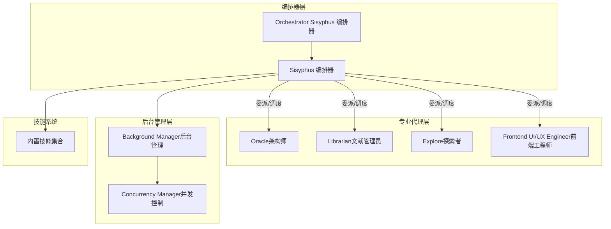

**图表来源**
- [src/agents/orchestrator-sisyphus.ts](file://src/agents/orchestrator-sisyphus.ts#L1-L800)
- [src/agents/sisyphus.ts](file://src/agents/sisyphus.ts#L1-L800)
- [src/agents/sisyphus-prompt-builder.ts](file://src/agents/sisyphus-prompt-builder.ts#L1-L360)
- [src/features/background-agent/manager.ts](file://src/features/background-agent/manager.ts#L1-L800)
- [src/features/background-agent/concurrency.ts](file://src/features/background-agent/concurrency.ts#L1-L138)
- [src/features/builtin-skills/skills.ts](file://src/features/builtin-skills/skills.ts#L1-L800)

**章节来源**
- [src/agents/index.ts](file://src/agents/index.ts#L1-L37)
- [src/agents/types.ts](file://src/agents/types.ts#L1-L87)
- [docs/orchestration-guide.md](file://docs/orchestration-guide.md#L1-L153)

## 核心组件
- Sisyphus 编排器：负责意图识别、请求分类、歧义检测、工具与代理选择、并行探索、任务委派与执行监督、验证与收尾。
- Orchestrator Sisyphus 编排器：面向复杂任务的“主导编排”，提供更强的决策矩阵、类别与技能选择、并行执行策略与失败恢复。
- 专业代理：
  - Oracle：高阶架构咨询与疑难调试顾问，昂贵但高质量。
  - Librarian：外部文档与开源实现检索专家，支持并行加速。
  - Explore：代码库上下文 grep 专家，多路并行搜索。
  - Frontend UI/UX Engineer：视觉设计与实现专家，严格区分“纯逻辑”与“视觉”变更。
- 后台代理管理：launch/resume/通知/完成判定/并发控制，确保后台任务稳定运行与资源可控。
- 技能系统：以“技能”为可组合指令，贯穿规划、执行、验证、并行等多个阶段。

**章节来源**
- [src/agents/orchestrator-sisyphus.ts](file://src/agents/orchestrator-sisyphus.ts#L1-L800)
- [src/agents/sisyphus.ts](file://src/agents/sisyphus.ts#L1-L800)
- [src/agents/oracle.ts](file://src/agents/oracle.ts#L1-L126)
- [src/agents/librarian.ts](file://src/agents/librarian.ts#L1-L330)
- [src/agents/explore.ts](file://src/agents/explore.ts#L1-L126)
- [src/agents/frontend-ui-ux-engineer.ts](file://src/agents/frontend-ui-ux-engineer.ts#L1-L110)
- [src/features/background-agent/manager.ts](file://src/features/background-agent/manager.ts#L1-L800)
- [src/features/background-agent/concurrency.ts](file://src/features/background-agent/concurrency.ts#L1-L138)
- [src/features/builtin-skills/skills.ts](file://src/features/builtin-skills/skills.ts#L1-L800)

## 架构总览
下图展示了从用户请求到任务完成的端到端流程，涵盖意图门控、规划阶段、执行阶段与归档阶段的关键节点与交互。

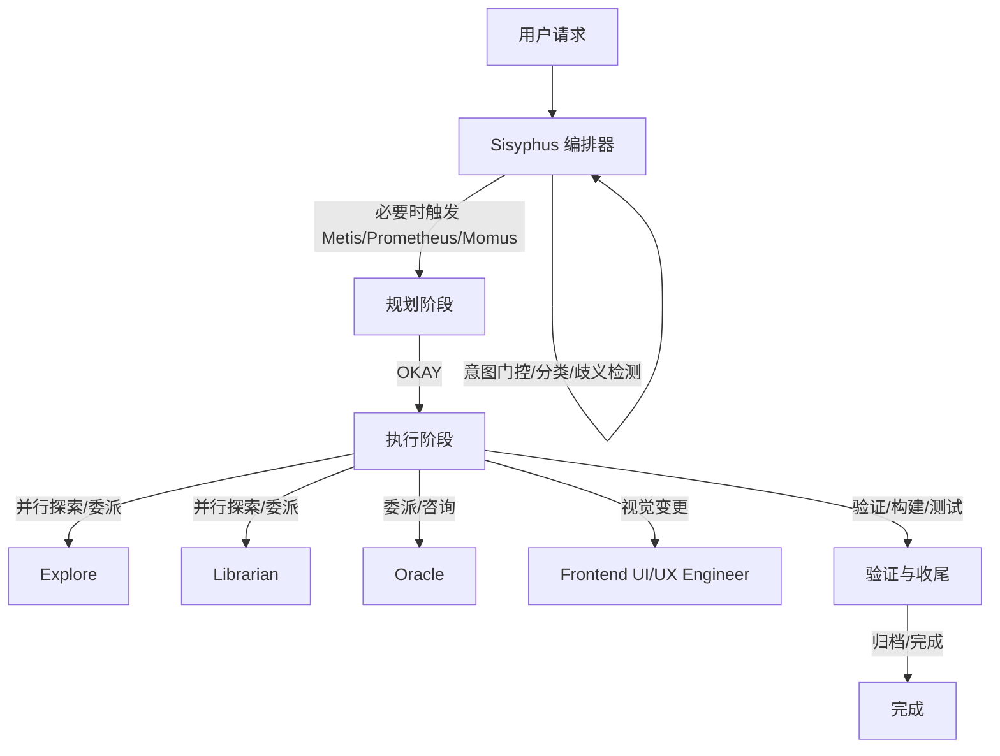

**图表来源**
- [docs/orchestration-guide.md](file://docs/orchestration-guide.md#L1-L153)
- [src/agents/orchestrator-sisyphus.ts](file://src/agents/orchestrator-sisyphus.ts#L1-L800)
- [src/agents/sisyphus.ts](file://src/agents/sisyphus.ts#L1-L800)

## 详细组件分析

### Sisyphus 编排器（Sisyphus）
- 角色定位：分离“规划”与“执行”的编排者，不直接写代码，专注于委派与监督。
- 关键能力：
  - 意图门控：技能优先、请求分类、歧义检测、验证假设与范围。
  - 工具与代理选择：优先技能 → 直接工具 → 代理；默认“并行后台 + 工具”组合。
  - 并行执行：Explore/Librarian 默认并行，后台任务收集与取消。
  - 执行模式：根据任务数量自动选择顺序执行或波次并行。
  - 验证与收尾：LSP 诊断、构建/测试、证据链校验、完成清理。
- 与 Orchestrator Sisyphus 的关系：后者提供更强的决策矩阵、类别与技能选择、失败恢复与收尾归档。

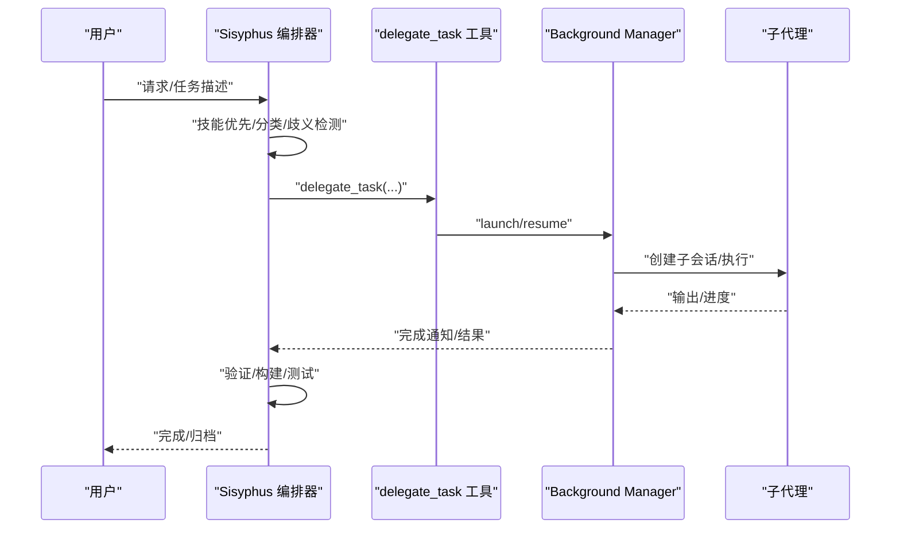

**图表来源**
- [src/agents/sisyphus.ts](file://src/agents/sisyphus.ts#L1-L800)
- [src/tools/delegate-task/tools.ts](file://src/tools/delegate-task/tools.ts#L1-L582)
- [src/features/background-agent/manager.ts](file://src/features/background-agent/manager.ts#L1-L800)

**章节来源**
- [src/agents/sisyphus.ts](file://src/agents/sisyphus.ts#L1-L800)
- [src/agents/sisyphus-prompt-builder.ts](file://src/agents/sisyphus-prompt-builder.ts#L1-L360)
- [src/tools/delegate-task/tools.ts](file://src/tools/delegate-task/tools.ts#L1-L582)

### Orchestrator Sisyphus 编排器（主导编排）
- 角色定位：复杂任务的“主导编排”，提供更强的决策矩阵、类别与技能选择、并行策略与失败恢复。
- 关键能力：
  - 决策矩阵：基于类别/代理/技能选择，明确“何时用谁”。
  - 自动规划触发：当任务≥3项时自动触发 Prometheus 规划。
  - 并行探索：默认后台并行，支持结果收集与取消。
  - 前端/文档/架构/调试委派：严格的“视觉变更硬块”与“文档任务自动委派”。
  - 验证与收尾：LSP 诊断、构建/测试、证据链校验、完成清理。
  - 失败恢复：连续失败停止/回滚/咨询 Oracle/用户介入。

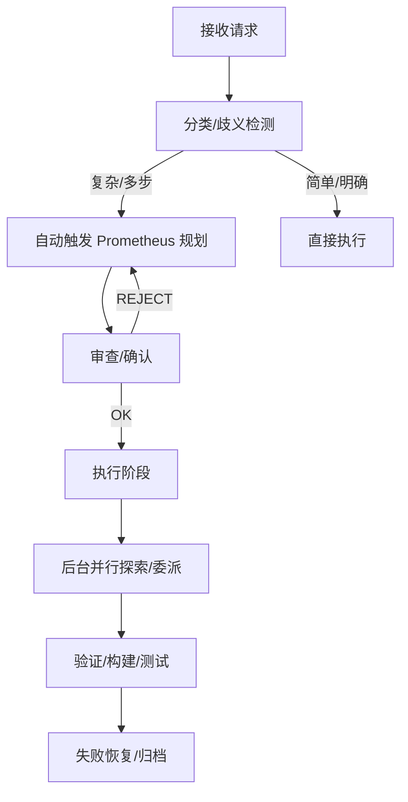

**图表来源**
- [src/agents/orchestrator-sisyphus.ts](file://src/agents/orchestrator-sisyphus.ts#L1-L800)

**章节来源**
- [src/agents/orchestrator-sisyphus.ts](file://src/agents/orchestrator-sisyphus.ts#L1-L800)

### 专业代理：Oracle（架构师）
- 角色：高阶架构咨询与疑难调试顾问，昂贵但高质量。
- 适用场景：复杂架构设计、多次失败后的调试、不熟悉模式、安全/性能关注、多系统权衡。
- 关键约束：只读咨询，避免简单文件操作与首次尝试；必要时短暂宣告“咨询 Oracle”。

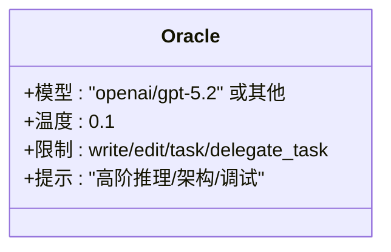

**图表来源**
- [src/agents/oracle.ts](file://src/agents/oracle.ts#L1-L126)

**章节来源**
- [src/agents/oracle.ts](file://src/agents/oracle.ts#L1-L126)

### 专业代理：Librarian（文献管理员）
- 角色：外部文档与开源实现检索专家，支持并行加速。
- 适用场景：不熟悉的库/框架、寻找最佳实践、查找官方文档与实现示例。
- 关键流程：概念型/实现型/上下文型/综合型四类，文档发现（版本/站点/结构）→ 并行检索 → 永久链接合成 → 引用格式化。

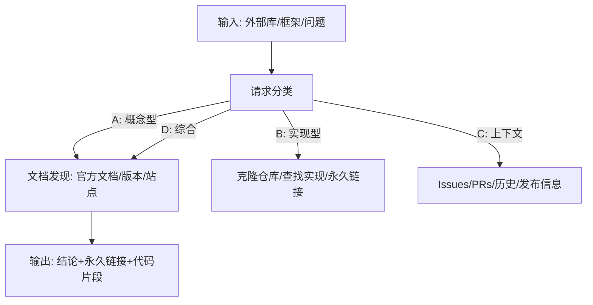

**图表来源**
- [src/agents/librarian.ts](file://src/agents/librarian.ts#L1-L330)

**章节来源**
- [src/agents/librarian.ts](file://src/agents/librarian.ts#L1-L330)

### 专业代理：Explore（探索者）
- 角色：代码库上下文 grep 专家，多路并行搜索。
- 适用场景：多模块涉及、不熟悉模块结构、跨层模式发现。
- 关键约束：只读搜索，必须返回绝对路径、完整匹配、可执行结果；失败条件明确。

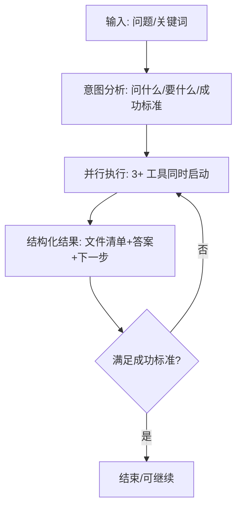

**图表来源**
- [src/agents/explore.ts](file://src/agents/explore.ts#L1-L126)

**章节来源**
- [src/agents/explore.ts](file://src/agents/explore.ts#L1-L126)

### 专业代理：Frontend UI/UX Engineer（前端工程师）
- 角色：视觉设计与实现专家，严格区分“纯逻辑”与“视觉”变更。
- 关键约束：任何前端文件的“样式/布局/动画/视觉关键字”变更一律委派；纯逻辑变更才可直接处理；混合变更需拆分。

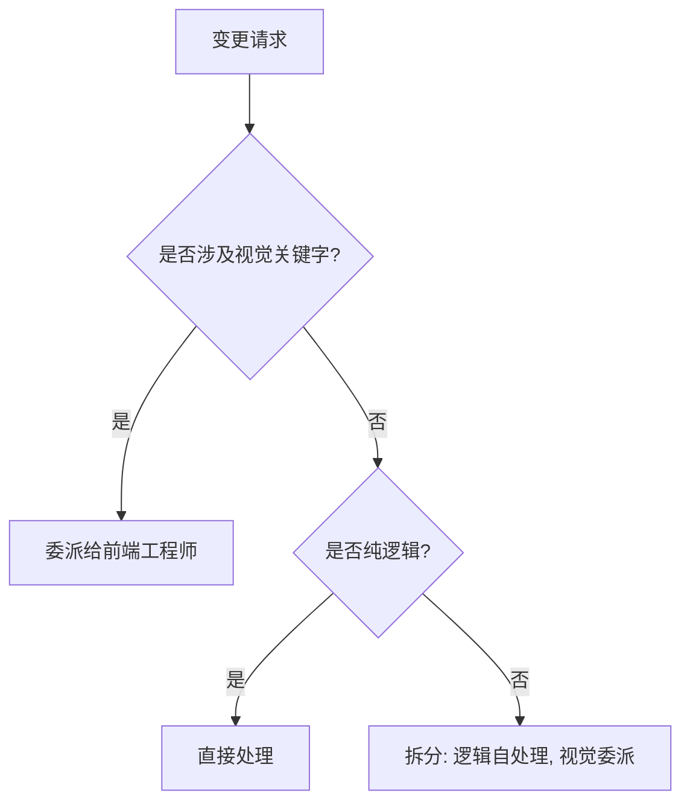

**图表来源**
- [src/agents/frontend-ui-ux-engineer.ts](file://src/agents/frontend-ui-ux-engineer.ts#L1-L110)

**章节来源**
- [src/agents/frontend-ui-ux-engineer.ts](file://src/agents/frontend-ui-ux-engineer.ts#L1-L110)

### 后台代理管理机制
- 生命周期：launch/resume/状态轮询/完成判定/通知/清理。
- 并发控制：按模型/提供商/默认并发上限，队列等待与释放，进程退出清理。
- 通知与可见性：Toast 通知、批量通知队列、父会话关联、任务取消。

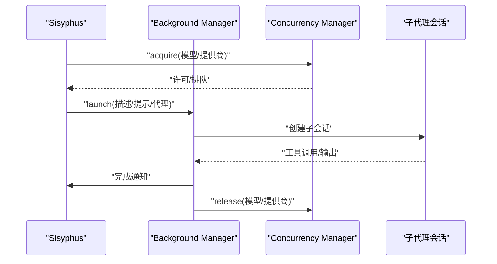

**图表来源**
- [src/features/background-agent/manager.ts](file://src/features/background-agent/manager.ts#L1-L800)
- [src/features/background-agent/concurrency.ts](file://src/features/background-agent/concurrency.ts#L1-L138)

**章节来源**
- [src/features/background-agent/manager.ts](file://src/features/background-agent/manager.ts#L1-L800)
- [src/features/background-agent/concurrency.ts](file://src/features/background-agent/concurrency.ts#L1-L138)

### 代理间通信与任务分配策略
- 委派工具：delegate_task，支持同步/后台两种模式、resume 恢复、技能合并、系统提示拼接。
- 选择策略：技能优先 → 直接工具 → 代理；默认“并行后台 + 工具”；前端/文档/架构/调试有硬性委派规则。
- 类别与技能：类别配置含默认技能，自动合并用户/类别/代理默认技能，减少遗漏。

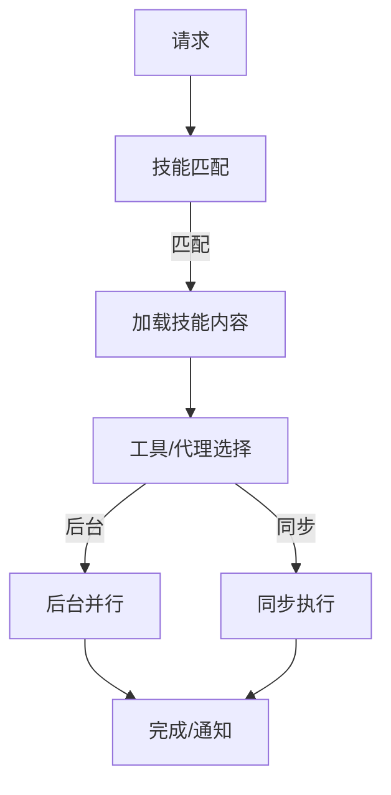

**图表来源**
- [src/tools/delegate-task/tools.ts](file://src/tools/delegate-task/tools.ts#L1-L582)
- [src/agents/sisyphus-prompt-builder.ts](file://src/agents/sisyphus-prompt-builder.ts#L1-L360)

**章节来源**
- [src/tools/delegate-task/tools.ts](file://src/tools/delegate-task/tools.ts#L1-L582)
- [src/agents/sisyphus-prompt-builder.ts](file://src/agents/sisyphus-prompt-builder.ts#L1-L360)

## 依赖关系分析
- 组件耦合：
  - Sisyphus 依赖 delegate_task 工具与后台管理器，间接依赖技能系统。
  - Orchestrator Sisyphus 在 Sisyphus 基础上扩展决策矩阵与失败恢复。
  - 专业代理通过统一的 AgentConfig 与元数据接口注册，便于动态构建提示。
- 外部依赖：
  - OpenCode SDK 的 AgentConfig、工具与会话 API。
  - 技能系统提供可组合的行为指令，贯穿规划与执行阶段。

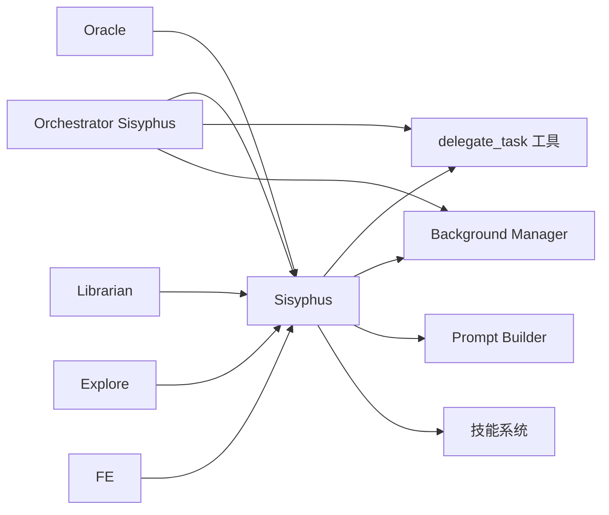

**图表来源**
- [src/agents/sisyphus.ts](file://src/agents/sisyphus.ts#L1-L800)
- [src/agents/orchestrator-sisyphus.ts](file://src/agents/orchestrator-sisyphus.ts#L1-L800)
- [src/tools/delegate-task/tools.ts](file://src/tools/delegate-task/tools.ts#L1-L582)
- [src/features/background-agent/manager.ts](file://src/features/background-agent/manager.ts#L1-L800)
- [src/features/builtin-skills/skills.ts](file://src/features/builtin-skills/skills.ts#L1-L800)

**章节来源**
- [src/agents/types.ts](file://src/agents/types.ts#L1-L87)
- [src/agents/index.ts](file://src/agents/index.ts#L1-L37)

## 性能考虑
- 并行探索：默认后台并行，减少等待时间；注意停止条件（重复信息/无新数据/直接答案）。
- 并发控制：按模型/提供商设置并发上限，避免资源争用；空闲槽位优先分配给等待队列。
- 任务粒度：前端/文档/架构/调试变更严格委派，避免无效往返与重复工作。
- 验证成本：LSP 诊断、构建/测试在关键节点执行，降低后期返工风险。
- 配置优化：合理设置类别默认技能与模型，减少技能加载与模型切换开销。

[本节提供通用指导，无需特定文件分析]

## 故障排除指南
- 代理未找到/不可调用：
  - 检查代理注册与可用性；确保名称与别名映射正确。
- 后台任务长时间无响应：
  - 检查并发配额与队列长度；确认会话输出验证与稳定性检测。
- 前端变更被拒绝：
  - 确认变更是否涉及视觉关键字；纯逻辑变更才可直接处理。
- 验证失败：
  - 检查 LSP 诊断、构建/测试命令是否通过；必要时手动干预。
- 失败恢复：
  - 连续失败后自动停止/回滚/咨询 Oracle；用户介入后重试。

**章节来源**
- [src/features/background-agent/manager.ts](file://src/features/background-agent/manager.ts#L1-L800)
- [src/features/background-agent/concurrency.ts](file://src/features/background-agent/concurrency.ts#L1-L138)
- [src/agents/orchestrator-sisyphus.ts](file://src/agents/orchestrator-sisyphus.ts#L1-L800)

## 结论
Oh My OpenCode 的代理系统通过“编排器 + 专业代理 + 后台管理 + 技能系统”的协同，实现了从意图识别到任务完成的全链路自动化与可监督执行。Sisyphus 与 Orchestrator Sisyphus 分别承担“执行编排”与“主导编排”的职责，配合 Oracle、Librarian、Explore、前端工程师等专业代理，形成高内聚、低耦合的代理生态。后台管理与并发控制确保大规模并行任务的稳定性，技能系统提供可组合的行为指令，显著提升系统的灵活性与可维护性。

[本节为总结性内容，无需特定文件分析]

## 附录

### 配置示例与最佳实践
- 类别与技能：
  - 通过类别配置设置默认技能与模型，自动合并用户/类别/代理默认技能。
  - 示例：visual-engineering 类别自动加载前端与浏览器技能；ultrabrain 类别自动加载系统调试与 Codex 协作技能。
- 委派参数：
  - run_in_background：后台并行探索；skills：技能数组（可为空）；resume：恢复先前会话。
- 并发控制：
  - 按模型/提供商/默认设置并发上限；空闲槽位优先分配给等待队列。
- 前端变更：
  - 任何涉及样式/布局/动画/视觉关键字的变更一律委派给前端工程师；纯逻辑变更可直接处理。

**章节来源**
- [src/tools/delegate-task/tools.ts](file://src/tools/delegate-task/tools.ts#L1-L582)
- [src/features/background-agent/concurrency.ts](file://src/features/background-agent/concurrency.ts#L1-L138)
- [src/agents/sisyphus-prompt-builder.ts](file://src/agents/sisyphus-prompt-builder.ts#L1-L360)
- [src/features/builtin-skills/skills.ts](file://src/features/builtin-skills/skills.ts#L1-L800)