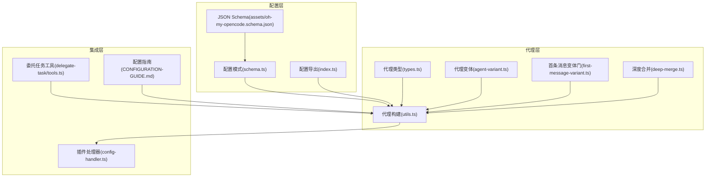
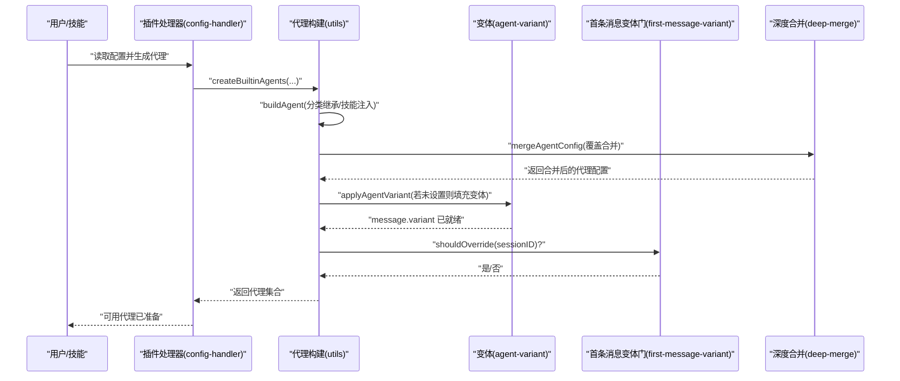
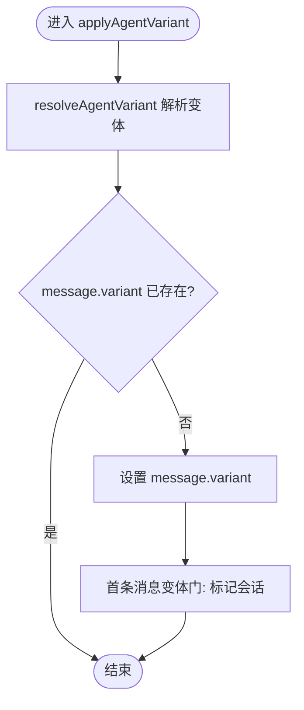
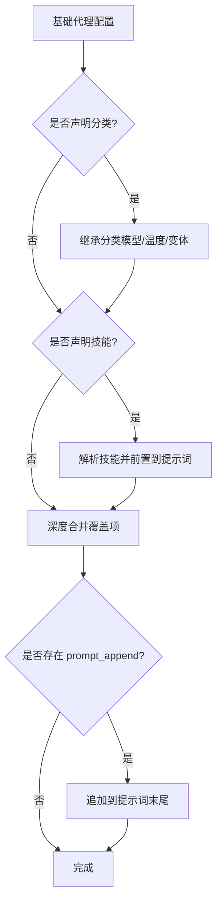
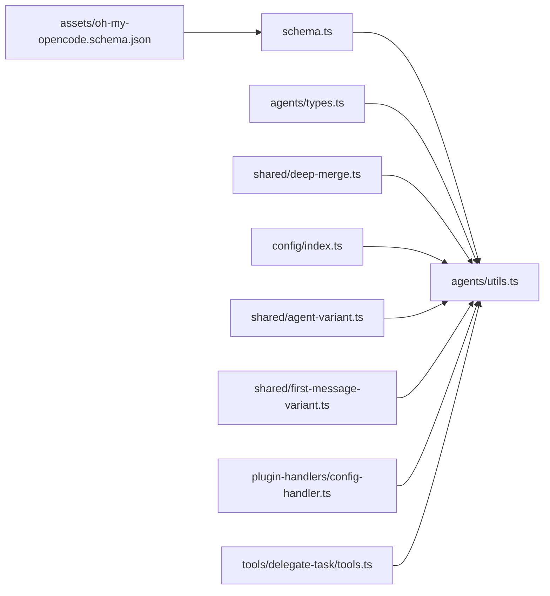

# 代理配置与定制

<cite>
**本文引用的文件**
- [assets/oh-my-opencode.schema.json](file://assets/oh-my-opencode.schema.json)
- [src/config/schema.ts](file://src/config/schema.ts)
- [src/config/index.ts](file://src/config/index.ts)
- [src/shared/agent-variant.ts](file://src/shared/agent-variant.ts)
- [src/shared/first-message-variant.ts](file://src/shared/first-message-variant.ts)
- [src/shared/deep-merge.ts](file://src/shared/deep-merge.ts)
- [src/agents/utils.ts](file://src/agents/utils.ts)
- [src/agents/types.ts](file://src/agents/types.ts)
- [src/plugin-handlers/config-handler.ts](file://src/plugin-handlers/config-handler.ts)
- [src/tools/delegate-task/tools.ts](file://src/tools/delegate-task/tools.ts)
- [CONFIGURATION-GUIDE.md](file://CONFIGURATION-GUIDE.md)
</cite>

## 目录
1. [简介](#简介)
2. [项目结构](#项目结构)
3. [核心组件](#核心组件)
4. [架构总览](#架构总览)
5. [详细组件分析](#详细组件分析)
6. [依赖关系分析](#依赖关系分析)
7. [性能考量](#性能考量)
8. [故障排查指南](#故障排查指南)
9. [结论](#结论)
10. [附录](#附录)

## 简介
本文件面向“代理配置与定制系统”，系统性阐述代理配置的数据结构、参数选项、定制方法与继承规则；详解代理变体系统、消息变体机制与配置优先级；并提供创建自定义代理、修改现有代理行为与优化代理性能的实操建议、最佳实践与扩展指南。内容基于仓库中的配置模式、代理构建流程与变体应用逻辑进行归纳总结。

## 项目结构
围绕代理配置与定制的关键模块包括：
- 配置模式与校验：配置模式定义、JSON Schema、类型导出
- 代理构建与合并：内置代理工厂、分类继承、技能注入、覆盖合并
- 变体系统：代理变体解析与消息变体应用
- 插件处理器：按配置生成最终代理集合
- 工具与指南：委托任务工具按分类解析、配置指南文档

**图表来源**
- [src/config/schema.ts](file://src/config/schema.ts#L338-L384)
- [src/config/index.ts](file://src/config/index.ts#L1-L27)
- [assets/oh-my-opencode.schema.json](file://assets/oh-my-opencode.schema.json#L1-L800)
- [src/agents/utils.ts](file://src/agents/utils.ts#L63-L224)
- [src/agents/types.ts](file://src/agents/types.ts#L1-L87)
- [src/shared/agent-variant.ts](file://src/shared/agent-variant.ts#L1-L41)
- [src/shared/first-message-variant.ts](file://src/shared/first-message-variant.ts#L1-L29)
- [src/shared/deep-merge.ts](file://src/shared/deep-merge.ts#L1-L54)
- [src/plugin-handlers/config-handler.ts](file://src/plugin-handlers/config-handler.ts#L206-L309)
- [src/tools/delegate-task/tools.ts](file://src/tools/delegate-task/tools.ts#L302-L320)
- [CONFIGURATION-GUIDE.md](file://CONFIGURATION-GUIDE.md#L1-L289)

**章节来源**
- [src/config/schema.ts](file://src/config/schema.ts#L338-L384)
- [src/config/index.ts](file://src/config/index.ts#L1-L27)
- [assets/oh-my-opencode.schema.json](file://assets/oh-my-opencode.schema.json#L1-L800)
- [src/agents/utils.ts](file://src/agents/utils.ts#L63-L224)
- [src/agents/types.ts](file://src/agents/types.ts#L1-L87)
- [src/shared/agent-variant.ts](file://src/shared/agent-variant.ts#L1-L41)
- [src/shared/first-message-variant.ts](file://src/shared/first-message-variant.ts#L1-L29)
- [src/shared/deep-merge.ts](file://src/shared/deep-merge.ts#L1-L54)
- [src/plugin-handlers/config-handler.ts](file://src/plugin-handlers/config-handler.ts#L206-L309)
- [src/tools/delegate-task/tools.ts](file://src/tools/delegate-task/tools.ts#L302-L320)
- [CONFIGURATION-GUIDE.md](file://CONFIGURATION-GUIDE.md#L1-L289)

## 核心组件
- 配置模式与类型
  - 统一的配置模式定义与类型导出，涵盖代理覆盖、分类、技能、实验特性等字段
  - JSON Schema 提供外部校验与编辑器提示
- 代理构建与合并
  - 内置代理工厂与构建函数，支持分类继承、技能注入、覆盖合并
  - 深度合并策略确保覆盖项生效且避免原型污染
- 变体系统
  - 代理变体解析：优先使用代理级变体，否则回退到分类级变体
  - 首条消息变体门：仅对新建会话应用一次变体覆盖
- 插件处理器与工具
  - 插件处理器根据配置生成最终代理集合，并应用分类属性
  - 委托任务工具按分类解析模型、默认技能与附加提示

**章节来源**
- [src/config/schema.ts](file://src/config/schema.ts#L109-L151)
- [src/config/index.ts](file://src/config/index.ts#L1-L27)
- [assets/oh-my-opencode.schema.json](file://assets/oh-my-opencode.schema.json#L102-L166)
- [src/agents/utils.ts](file://src/agents/utils.ts#L63-L99)
- [src/shared/deep-merge.ts](file://src/shared/deep-merge.ts#L1-L54)
- [src/shared/agent-variant.ts](file://src/shared/agent-variant.ts#L1-L41)
- [src/shared/first-message-variant.ts](file://src/shared/first-message-variant.ts#L1-L29)
- [src/plugin-handlers/config-handler.ts](file://src/plugin-handlers/config-handler.ts#L206-L309)
- [src/tools/delegate-task/tools.ts](file://src/tools/delegate-task/tools.ts#L302-L320)

## 架构总览
代理配置与定制的运行时流程如下：

**图表来源**
- [src/plugin-handlers/config-handler.ts](file://src/plugin-handlers/config-handler.ts#L206-L309)
- [src/agents/utils.ts](file://src/agents/utils.ts#L63-L224)
- [src/shared/agent-variant.ts](file://src/shared/agent-variant.ts#L31-L40)
- [src/shared/first-message-variant.ts](file://src/shared/first-message-variant.ts#L6-L27)
- [src/shared/deep-merge.ts](file://src/shared/deep-merge.ts#L23-L53)

## 详细组件分析

### 配置数据结构与参数选项
- 配置根对象
  - 支持禁用 MCP、代理、技能、钩子、命令
  - 支持代理覆盖、分类、技能、实验特性、通知、Git 主作者等
- 代理覆盖配置
  - 字段：模型、变体、分类、技能数组、温度、Top-P、提示词、追加提示、工具开关、禁用标志、描述、模式、颜色、权限
  - 支持从分类继承模型与其它设置
- 分类配置
  - 字段：模型、变体、温度、Top-P、最大 Token、思考配置、推理强度、文本冗余度、工具开关、追加提示、默认技能
- 技能配置
  - 支持数组或对象形式，含来源、启用/禁用列表等
- JSON Schema
  - 提供字段约束、枚举值与正则校验，确保配置合法

**章节来源**
- [src/config/schema.ts](file://src/config/schema.ts#L338-L384)
- [assets/oh-my-opencode.schema.json](file://assets/oh-my-opencode.schema.json#L102-L166)
- [assets/oh-my-opencode.schema.json](file://assets/oh-my-opencode.schema.json#L170-L186)
- [assets/oh-my-opencode.schema.json](file://assets/oh-my-opencode.schema.json#L250-L286)

### 代理变体系统与消息变体机制
- 代理变体解析
  - 优先使用代理级变体；若不存在，则回退到分类级变体
- 消息变体应用
  - 仅在消息未显式设置变体时进行填充
  - 首条消息变体门确保新建会话仅应用一次
- 首条消息变体门
  - 仅对无父会话的新建会话标记并允许覆盖
  - 应用后清除标记，避免重复覆盖

**图表来源**
- [src/shared/agent-variant.ts](file://src/shared/agent-variant.ts#L3-L40)
- [src/shared/first-message-variant.ts](file://src/shared/first-message-variant.ts#L6-L27)

**章节来源**
- [src/shared/agent-variant.ts](file://src/shared/agent-variant.ts#L1-L41)
- [src/shared/first-message-variant.ts](file://src/shared/first-message-variant.ts#L1-L29)

### 代理构建与配置继承规则
- 分类继承
  - 若代理声明了分类，且该分类存在，则继承模型、温度、变体等
- 技能注入
  - 若代理声明技能，将解析并前置到提示词
- 覆盖合并
  - 使用深度合并策略，覆盖项优先，数组替换，忽略危险键
- 追加提示
  - 在覆盖中提供 prompt_append 时，将其追加到现有提示词末尾

**图表来源**
- [src/agents/utils.ts](file://src/agents/utils.ts#L63-L99)
- [src/shared/deep-merge.ts](file://src/shared/deep-merge.ts#L23-L53)

**章节来源**
- [src/agents/utils.ts](file://src/agents/utils.ts#L63-L99)
- [src/shared/deep-merge.ts](file://src/shared/deep-merge.ts#L1-L54)

### 插件处理器与代理集合生成
- 插件处理器根据配置生成最终代理集合
  - 应用分类属性（温度、Top-P、工具、思考、推理强度、文本冗余度）
  - 设置代理描述、颜色、模式等
  - 合并内置、用户、项目与插件代理
- 权限控制
  - 针对特定代理设置工具权限白名单/黑名单

**章节来源**
- [src/plugin-handlers/config-handler.ts](file://src/plugin-handlers/config-handler.ts#L206-L309)

### 委托任务工具与分类解析
- 当使用分类参数时，委托任务工具解析分类配置
  - 获取模型字符串、追加提示、默认技能
- 当使用子代理名称时，采用该代理的默认技能

**章节来源**
- [src/tools/delegate-task/tools.ts](file://src/tools/delegate-task/tools.ts#L302-L320)

### 类型与接口
- 代理类型
  - 代理工厂、内置代理名、可覆盖代理名、代理覆盖配置、代理提示元数据
- 变体与权限
  - 变体解析与应用、权限枚举与组合

**章节来源**
- [src/agents/types.ts](file://src/agents/types.ts#L1-L87)

## 依赖关系分析
- 配置层
  - schema.ts 定义配置模式与类型
  - index.ts 导出模式与类型
  - JSON Schema 提供外部校验
- 代理层
  - agents/utils.ts 依赖 schema/types 与 deep-merge
  - shared/agent-variant.ts 依赖 config/schema
  - shared/first-message-variant.ts 独立维护会话状态
- 集成层
  - plugin-handlers/config-handler.ts 依赖 agents/utils 与 schema
  - tools/delegate-task/tools.ts 依赖分类解析与默认技能常量

**图表来源**
- [src/config/schema.ts](file://src/config/schema.ts#L338-L384)
- [src/config/index.ts](file://src/config/index.ts#L1-L27)
- [assets/oh-my-opencode.schema.json](file://assets/oh-my-opencode.schema.json#L1-L800)
- [src/agents/utils.ts](file://src/agents/utils.ts#L63-L224)
- [src/agents/types.ts](file://src/agents/types.ts#L1-L87)
- [src/shared/deep-merge.ts](file://src/shared/deep-merge.ts#L1-L54)
- [src/shared/agent-variant.ts](file://src/shared/agent-variant.ts#L1-L41)
- [src/shared/first-message-variant.ts](file://src/shared/first-message-variant.ts#L1-L29)
- [src/plugin-handlers/config-handler.ts](file://src/plugin-handlers/config-handler.ts#L206-L309)
- [src/tools/delegate-task/tools.ts](file://src/tools/delegate-task/tools.ts#L302-L320)

**章节来源**
- [src/config/schema.ts](file://src/config/schema.ts#L338-L384)
- [src/config/index.ts](file://src/config/index.ts#L1-L27)
- [assets/oh-my-opencode.schema.json](file://assets/oh-my-opencode.schema.json#L1-L800)
- [src/agents/utils.ts](file://src/agents/utils.ts#L63-L224)
- [src/agents/types.ts](file://src/agents/types.ts#L1-L87)
- [src/shared/deep-merge.ts](file://src/shared/deep-merge.ts#L1-L54)
- [src/shared/agent-variant.ts](file://src/shared/agent-variant.ts#L1-L41)
- [src/shared/first-message-variant.ts](file://src/shared/first-message-variant.ts#L1-L29)
- [src/plugin-handlers/config-handler.ts](file://src/plugin-handlers/config-handler.ts#L206-L309)
- [src/tools/delegate-task/tools.ts](file://src/tools/delegate-task/tools.ts#L302-L320)

## 性能考量
- 深度合并限制
  - 合并深度上限为 50，超过后直接以覆盖为主，避免深层递归带来的开销
- 变体解析
  - 变体解析为 O(1) 查表操作，仅在首次消息时触发
- 技能注入
  - 技能解析发生在构建阶段，尽量减少重复解析
- 分类继承
  - 仅在代理声明分类时生效，避免不必要的继承查找

**章节来源**
- [src/shared/deep-merge.ts](file://src/shared/deep-merge.ts#L1-L54)
- [src/shared/agent-variant.ts](file://src/shared/agent-variant.ts#L1-L41)
- [src/agents/utils.ts](file://src/agents/utils.ts#L63-L99)

## 故障排查指南
- 配置不合法
  - 使用 JSON Schema 校验配置，检查字段类型、枚举值与正则匹配
- 变体未生效
  - 确认代理未显式设置变体；检查分类是否存在；确认首条消息变体门是否被应用过
- 覆盖无效
  - 检查覆盖字段是否正确；确认未被深度合并策略忽略（如危险键）
- 分类继承未生效
  - 确认代理声明了有效分类；确认分类配置存在且字段未被覆盖

**章节来源**
- [assets/oh-my-opencode.schema.json](file://assets/oh-my-opencode.schema.json#L1-L800)
- [src/shared/agent-variant.ts](file://src/shared/agent-variant.ts#L1-L41)
- [src/shared/first-message-variant.ts](file://src/shared/first-message-variant.ts#L1-L29)
- [src/shared/deep-merge.ts](file://src/shared/deep-merge.ts#L1-L54)
- [src/agents/utils.ts](file://src/agents/utils.ts#L63-L99)

## 结论
本系统通过“配置模式 + 代理构建 + 变体机制”的组合，提供了灵活而可控的代理定制能力。分类继承与覆盖合并保证了配置的一致性与可维护性；变体系统与首条消息门确保了行为的一致性与幂等性。结合插件处理器与工具链，可在不同场景下快速生成满足需求的代理集合。

## 附录

### 配置优先级与示例
- 优先级（从高到低）
  - 项目级 oh-my-opencode.json
  - 用户全局 ~/.config/opencode/oh-my-opencode.json
  - 项目级 .opencode/oh-my-opencode.json
  - 代码默认配置（常量）
- 示例参考
  - 配置 Planning Agents 与 Categories
  - 混合配置示例

**章节来源**
- [CONFIGURATION-GUIDE.md](file://CONFIGURATION-GUIDE.md#L150-L158)
- [CONFIGURATION-GUIDE.md](file://CONFIGURATION-GUIDE.md#L204-L289)

### 最佳实践
- 使用分类统一管理模型与温度等通用参数
- 通过代理覆盖实现差异化行为，避免在多处重复配置
- 利用 prompt_append 与默认技能增强提示词效果
- 对于复杂场景，先在 JSON Schema 下验证配置再集成到系统

**章节来源**
- [assets/oh-my-opencode.schema.json](file://assets/oh-my-opencode.schema.json#L102-L166)
- [src/agents/utils.ts](file://src/agents/utils.ts#L63-L99)

### 扩展指南
- 自定义代理
  - 定义代理工厂与提示元数据，注册到代理源映射
  - 在代理覆盖中声明必要字段，或通过分类继承统一配置
- 修改现有代理行为
  - 使用代理覆盖字段调整模型、温度、工具与权限
  - 通过分类默认技能与追加提示增强提示词
- 优化性能
  - 控制覆盖层级，避免过深嵌套导致合并成本上升
  - 合理使用变体与首条消息门，减少重复计算

**章节来源**
- [src/agents/utils.ts](file://src/agents/utils.ts#L25-L40)
- [src/agents/types.ts](file://src/agents/types.ts#L29-L53)
- [src/shared/deep-merge.ts](file://src/shared/deep-merge.ts#L1-L54)