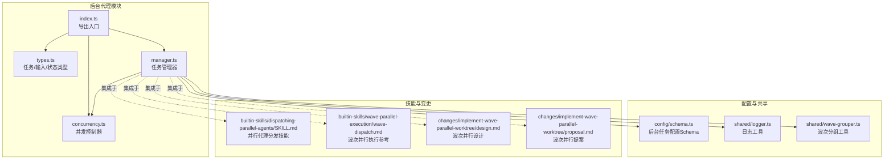
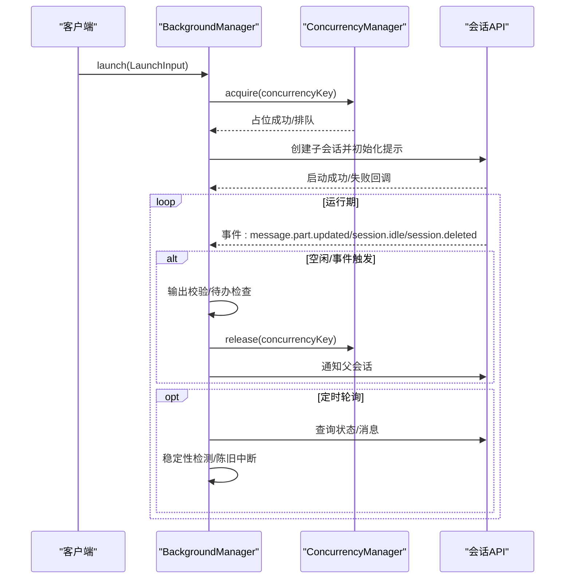
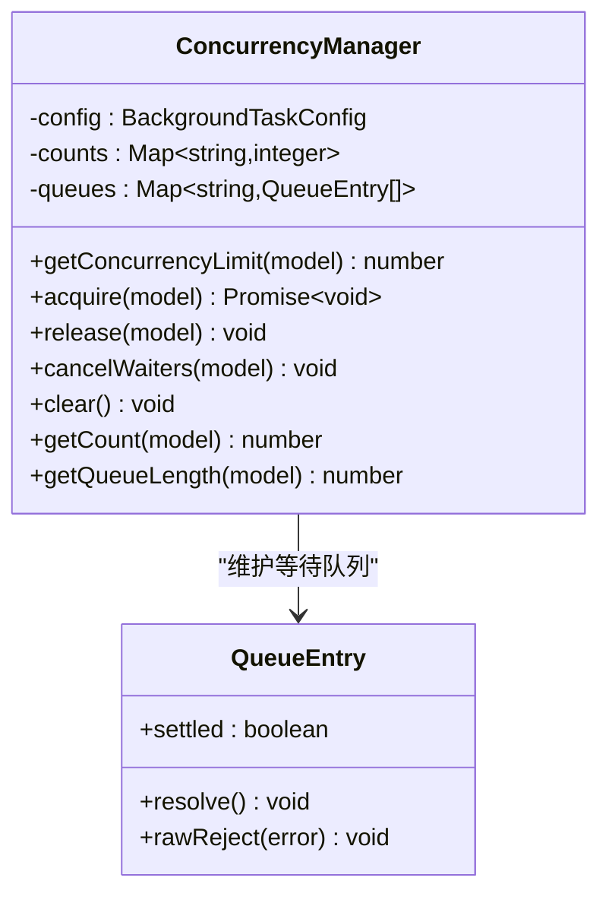
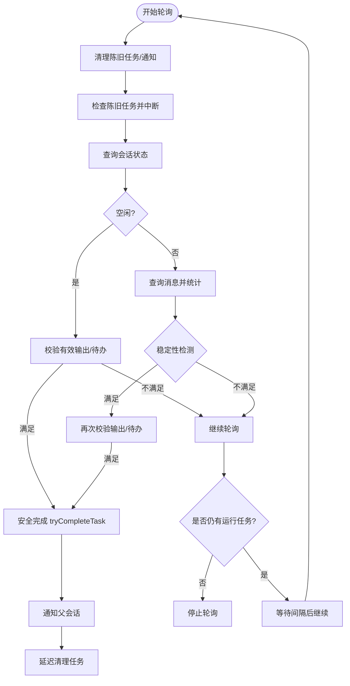
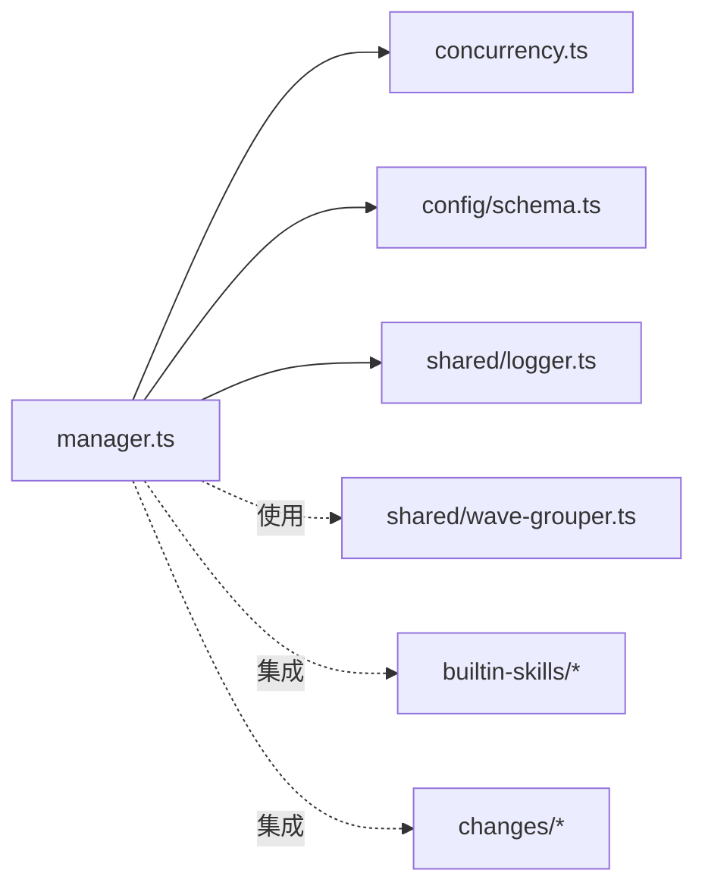

# 后台代理管理

<cite>
**本文引用的文件**
- [src/features/background-agent/index.ts](file://src/features/background-agent/index.ts)
- [src/features/background-agent/manager.ts](file://src/features/background-agent/manager.ts)
- [src/features/background-agent/concurrency.ts](file://src/features/background-agent/concurrency.ts)
- [src/features/background-agent/types.ts](file://src/features/background-agent/types.ts)
- [src/features/background-agent/manager.test.ts](file://src/features/background-agent/manager.test.ts)
- [src/config/schema.ts](file://src/config/schema.ts)
- [src/shared/logger.ts](file://src/shared/logger.ts)
- [src/shared/wave-grouper.ts](file://src/shared/wave-grouper.ts)
- [src/features/builtin-skills/dispatching-parallel-agents/SKILL.md](file://src/features/builtin-skills/dispatching-parallel-agents/SKILL.md)
- [src/features/builtin-skills/wave-parallel-execution/wave-dispatch.md](file://src/features/builtin-skills/wave-parallel-execution/wave-dispatch.md)
- [changes/implement-wave-parallel-worktree/design.md](file://changes/implement-wave-parallel-worktree/design.md)
- [changes/implement-wave-parallel-worktree/proposal.md](file://changes/implement-wave-parallel-worktree/proposal.md)
- [CONFIGURATION-GUIDE.md](file://CONFIGURATION-GUIDE.md)
</cite>

## 目录
1. [简介](#简介)
2. [项目结构](#项目结构)
3. [核心组件](#核心组件)
4. [架构总览](#架构总览)
5. [详细组件分析](#详细组件分析)
6. [依赖分析](#依赖分析)
7. [性能考虑](#性能考虑)
8. [故障排除指南](#故障排除指南)
9. [结论](#结论)
10. [附录](#附录)

## 简介
本文件系统性阐述后台代理管理系统的并发控制、任务调度与资源管理机制，覆盖代理生命周期、状态跟踪、错误恢复、并行执行限制、性能优化与监控方法，并提供配置示例、最佳实践与故障排除建议。该系统通过“后台任务”在独立会话中运行子代理，结合并发配额与轮询检测实现稳定可靠的异步执行与通知。

## 项目结构
后台代理管理位于 features/background-agent 子模块，核心由三部分组成：
- 类型定义：统一的任务状态、进度与输入输出结构
- 并发控制器：基于键值的配额与排队机制
- 管理器：任务生命周期、事件处理、轮询检测、超时中断与通知汇总

图表来源
- [src/features/background-agent/index.ts](file://src/features/background-agent/index.ts#L1-L4)
- [src/features/background-agent/manager.ts](file://src/features/background-agent/manager.ts#L52-L77)
- [src/features/background-agent/concurrency.ts](file://src/features/background-agent/concurrency.ts#L15-L22)
- [src/features/background-agent/types.ts](file://src/features/background-agent/types.ts#L1-L65)
- [src/config/schema.ts](file://src/config/schema.ts#L297-L303)
- [src/shared/logger.ts](file://src/shared/logger.ts#L1-L21)
- [src/shared/wave-grouper.ts](file://src/shared/wave-grouper.ts#L45-L133)

章节来源
- [src/features/background-agent/index.ts](file://src/features/background-agent/index.ts#L1-L4)
- [src/features/background-agent/manager.ts](file://src/features/background-agent/manager.ts#L52-L77)
- [src/features/background-agent/concurrency.ts](file://src/features/background-agent/concurrency.ts#L15-L22)
- [src/features/background-agent/types.ts](file://src/features/background-agent/types.ts#L1-L65)
- [src/config/schema.ts](file://src/config/schema.ts#L297-L303)
- [src/shared/logger.ts](file://src/shared/logger.ts#L1-L21)
- [src/shared/wave-grouper.ts](file://src/shared/wave-grouper.ts#L45-L133)

## 核心组件
- 任务类型与状态
  - BackgroundTask：包含任务标识、父会话、代理、状态、时间戳、进度与并发键等字段
  - LaunchInput/ResumeInput：启动与恢复的输入参数
- 并发控制器
  - 支持按模型或供应商维度设置并发上限；超过上限的任务进入队列等待释放
  - 提供计数查询、队列长度查询、取消等待与清空状态等调试接口
- 管理器
  - 生命周期：launch/trackTask/resume/complete/cancel/error
  - 事件驱动：处理消息更新、空闲、删除等事件，触发稳定性检测与完成判定
  - 轮询与超时：定时轮询运行中的任务，检测无输出空闲、长时间无活动的“陈旧”任务并中断
  - 通知汇总：批量通知父会话，支持全部完成汇总与单任务静默通知

章节来源
- [src/features/background-agent/types.ts](file://src/features/background-agent/types.ts#L15-L65)
- [src/features/background-agent/concurrency.ts](file://src/features/background-agent/concurrency.ts#L15-L138)
- [src/features/background-agent/manager.ts](file://src/features/background-agent/manager.ts#L79-L217)
- [src/features/background-agent/manager.ts](file://src/features/background-agent/manager.ts#L344-L442)
- [src/features/background-agent/manager.ts](file://src/features/background-agent/manager.ts#L992-L1106)

## 架构总览
后台代理管理采用“事件驱动 + 轮询检测”的双轨机制：
- 事件驱动：监听会话事件（消息更新、空闲、删除），进行即时判定与完成尝试
- 轮询检测：定时轮询任务状态与消息，进行稳定性检测与陈旧任务中断

图表来源
- [src/features/background-agent/manager.ts](file://src/features/background-agent/manager.ts#L79-L217)
- [src/features/background-agent/manager.ts](file://src/features/background-agent/manager.ts#L444-L557)
- [src/features/background-agent/manager.ts](file://src/features/background-agent/manager.ts#L992-L1106)
- [src/features/background-agent/concurrency.ts](file://src/features/background-agent/concurrency.ts#L41-L94)

## 详细组件分析

### 并发控制器（ConcurrencyManager）
- 设计要点
  - 键值：以模型名或供应商名为键，维护当前占用计数与等待队列
  - 优先级：模型级 > 供应商级 > 默认级；0 表示无限制
  - 等待机制：使用 settled 标记避免重复解析；cancelWaiters 保证清理一致性
- 关键行为
  - acquire：未达上限立即占位；否则入队等待
  - release：优先移交到下一个等待者；否则释放计数
  - 调试接口：getCount/getQueueLength

图表来源
- [src/features/background-agent/concurrency.ts](file://src/features/background-agent/concurrency.ts#L9-L138)

章节来源
- [src/features/background-agent/concurrency.ts](file://src/features/background-agent/concurrency.ts#L15-L138)

### 任务管理器（BackgroundManager）
- 生命周期与状态
  - launch：创建子会话、记录任务、初始化提示、注册并发、开始轮询
  - trackTask：外部任务接入，复用并发键，加入批处理通知
  - resume：从持久化状态恢复，重新获取并发，继续执行
  - tryCompleteTask：带竞态保护的安全完成流程，先释放并发再通知
- 事件处理
  - message.part.updated：统计工具调用次数与最后更新时间
  - session.idle：校验有效输出与待办，满足则完成
  - session.deleted：标记取消并清理资源
- 轮询与稳定性检测
  - 状态轮询：空闲状态、消息统计、工具调用与文本输出
  - 稳定性：连续多次消息数不变触发完成
  - 陈旧中断：超过阈值无活动自动中断并通知
- 通知与清理
  - 批量通知父会话，支持全部完成汇总与单任务静默通知
  - 定时清理陈旧任务与通知，防止内存泄漏

图表来源
- [src/features/background-agent/manager.ts](file://src/features/background-agent/manager.ts#L992-L1106)
- [src/features/background-agent/manager.ts](file://src/features/background-agent/manager.ts#L736-L764)
- [src/features/background-agent/manager.ts](file://src/features/background-agent/manager.ts#L952-L990)

章节来源
- [src/features/background-agent/manager.ts](file://src/features/background-agent/manager.ts#L79-L217)
- [src/features/background-agent/manager.ts](file://src/features/background-agent/manager.ts#L259-L342)
- [src/features/background-agent/manager.ts](file://src/features/background-agent/manager.ts#L344-L442)
- [src/features/background-agent/manager.ts](file://src/features/background-agent/manager.ts#L444-L557)
- [src/features/background-agent/manager.ts](file://src/features/background-agent/manager.ts#L992-L1106)

### 类型与配置
- 任务类型
  - BackgroundTask：包含状态、进度、并发键、父会话上下文等
  - LaunchInput/ResumeInput：启动/恢复所需参数
- 配置
  - defaultConcurrency/providerConcurrency/modelConcurrency：并发配额
  - staleTimeoutMs：陈旧超时（毫秒）

章节来源
- [src/features/background-agent/types.ts](file://src/features/background-agent/types.ts#L15-L65)
- [src/config/schema.ts](file://src/config/schema.ts#L297-L303)

### 并行执行与集成
- 技能与波次
  - 并行代理分发技能：面向独立任务的并行调度
  - 波次并行执行：基于依赖与文件冲突的波次分组，实现跨任务并行与同任务串行
- 工具链
  - wave-grouper：将任务按依赖与文件冲突分组为波次
  - 设计与提案：定义了从任务解析、工作树创建到合并清理的完整流程

章节来源
- [src/features/builtin-skills/dispatching-parallel-agents/SKILL.md](file://src/features/builtin-skills/dispatching-parallel-agents/SKILL.md#L1-L181)
- [src/features/builtin-skills/wave-parallel-execution/wave-dispatch.md](file://src/features/builtin-skills/wave-parallel-execution/wave-dispatch.md#L1-L32)
- [src/shared/wave-grouper.ts](file://src/shared/wave-grouper.ts#L45-L133)
- [changes/implement-wave-parallel-worktree/design.md](file://changes/implement-wave-parallel-worktree/design.md#L137-L183)
- [changes/implement-wave-parallel-worktree/proposal.md](file://changes/implement-wave-parallel-worktree/proposal.md#L138-L224)

## 依赖分析
- 组件耦合
  - BackgroundManager 依赖 ConcurrencyManager 进行并发控制
  - 通过配置 Schema 注入并发与陈旧超时策略
  - 与会话 API 交互（创建、轮询、中断、提示），并通过钩子/工具进行通知与日志
- 外部集成
  - 技能与波次工具用于任务分发与并行编排
  - 日志工具统一输出运行时信息

图表来源
- [src/features/background-agent/manager.ts](file://src/features/background-agent/manager.ts#L52-L77)
- [src/features/background-agent/concurrency.ts](file://src/features/background-agent/concurrency.ts#L15-L22)
- [src/config/schema.ts](file://src/config/schema.ts#L297-L303)
- [src/shared/logger.ts](file://src/shared/logger.ts#L1-L21)
- [src/shared/wave-grouper.ts](file://src/shared/wave-grouper.ts#L45-L133)

章节来源
- [src/features/background-agent/manager.ts](file://src/features/background-agent/manager.ts#L52-L77)
- [src/features/background-agent/concurrency.ts](file://src/features/background-agent/concurrency.ts#L15-L22)
- [src/config/schema.ts](file://src/config/schema.ts#L297-L303)
- [src/shared/logger.ts](file://src/shared/logger.ts#L1-L21)
- [src/shared/wave-grouper.ts](file://src/shared/wave-grouper.ts#L45-L133)

## 性能考虑
- 并发配额
  - 通过模型/供应商/默认三级配额控制资源占用，避免过载
  - 将高并发模型与低并发模型隔离，减少相互影响
- 轮询与检测
  - 10 秒轮询间隔平衡及时性与开销
  - 稳定性检测与陈旧中断减少无效轮询
- 通知批处理
  - 按父会话聚合通知，降低频繁提示带来的性能损耗
- 日志与清理
  - 定期清理陈旧任务与通知，避免内存膨胀
  - 日志落盘，便于离线分析

[本节为通用指导，无需列出具体文件来源]

## 故障排除指南
- 启动失败
  - 现象：创建子会话或提示失败
  - 排查：检查 agent 是否注册、权限与工具限制、父会话目录
  - 处理：释放并发槽位，记录错误并通知父会话
- 任务卡住
  - 现象：长时间无输出或无活动
  - 排查：查看稳定性检测与陈旧超时配置；确认会话是否被删除
  - 处理：陈旧中断后重试或人工介入
- 并发阻塞
  - 现象：新任务无法启动，等待队列增长
  - 排查：检查并发配额与当前占用；确认是否有异常未释放
  - 处理：调整配额或释放等待者；必要时清理状态
- 通知缺失
  - 现象：父会话未收到完成通知
  - 排查：确认批处理队列与 TTL 清理；检查通知构建逻辑
  - 处理：手动触发重试或检查日志

章节来源
- [src/features/background-agent/manager.ts](file://src/features/background-agent/manager.ts#L113-L1136)
- [src/features/background-agent/manager.ts](file://src/features/background-agent/manager.ts#L913-L950)
- [src/features/background-agent/manager.ts](file://src/features/background-agent/manager.ts#L952-L990)
- [src/features/background-agent/manager.ts](file://src/features/background-agent/manager.ts#L766-L890)

## 结论
后台代理管理系统通过明确的生命周期、严格的并发控制与稳健的事件/轮询检测机制，实现了高可靠性的异步任务执行。配合技能与波次工具，可在复杂任务场景下实现高效并行与有序收敛。建议根据实际负载与资源情况合理配置并发与陈旧超时，并持续关注日志与通知，确保系统稳定运行。

[本节为总结性内容，无需列出具体文件来源]

## 附录

### 配置示例与最佳实践
- 并发配置
  - defaultConcurrency：默认并发上限
  - providerConcurrency：按供应商设置并发
  - modelConcurrency：按模型设置并发
  - staleTimeoutMs：陈旧超时（毫秒）
- 最佳实践
  - 将高成本模型与低成本模型分离，分别设置并发
  - 对关键任务使用独立 concurrencyKey，避免互相阻塞
  - 合理设置陈旧超时，平衡响应与稳定性
  - 使用技能与波次工具进行任务分发，提升整体吞吐

章节来源
- [src/config/schema.ts](file://src/config/schema.ts#L297-L303)
- [CONFIGURATION-GUIDE.md](file://CONFIGURATION-GUIDE.md#L161-L289)

### 测试与验证
- 并发队列行为验证：包括上限、排队、顺序释放与清理
- 生命周期验证：启动、跟踪、恢复、完成、取消、错误
- 事件与轮询：空闲事件、稳定性检测、陈旧中断
- 通知与清理：批处理通知、TTL 清理、进程退出清理

章节来源
- [src/features/background-agent/manager.test.ts](file://src/features/background-agent/manager.test.ts#L167-L418)
- [src/features/background-agent/manager.test.ts](file://src/features/background-agent/manager.test.ts#L454-L565)
- [src/features/background-agent/manager.test.ts](file://src/features/background-agent/manager.test.ts#L954-L1007)