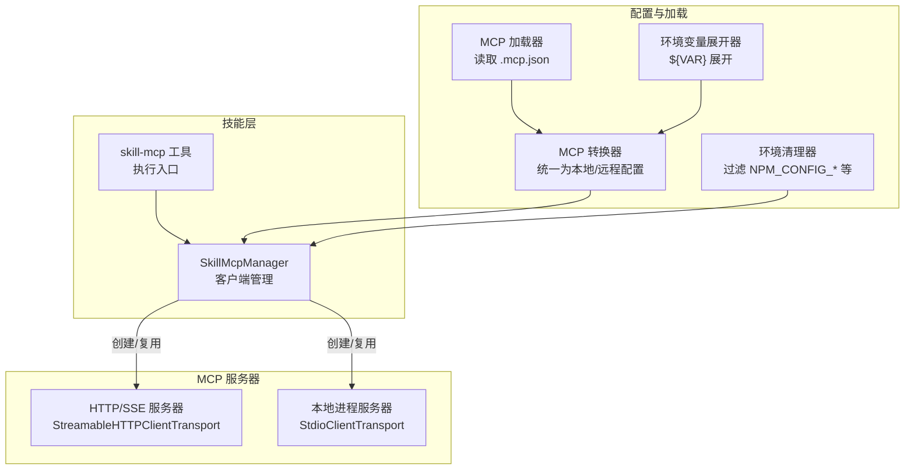
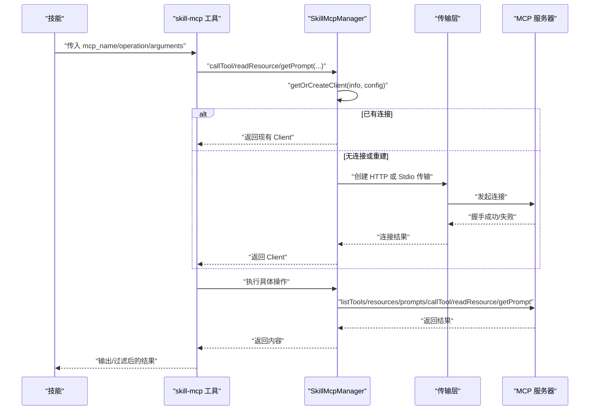
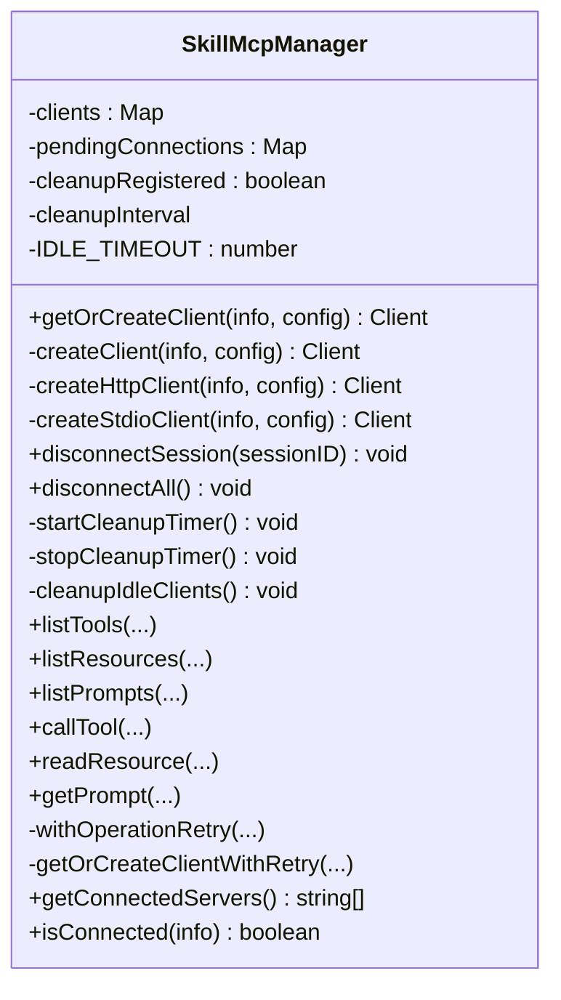
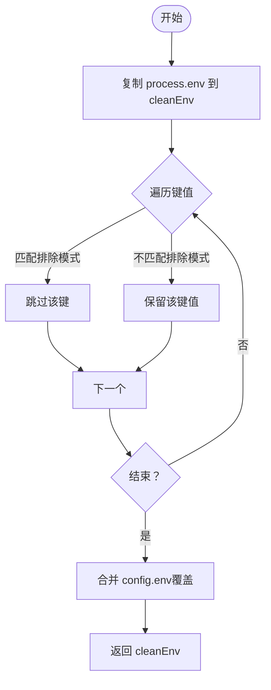
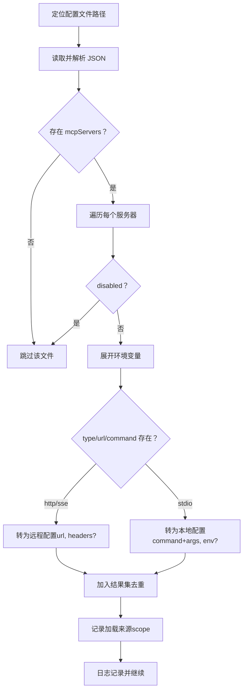
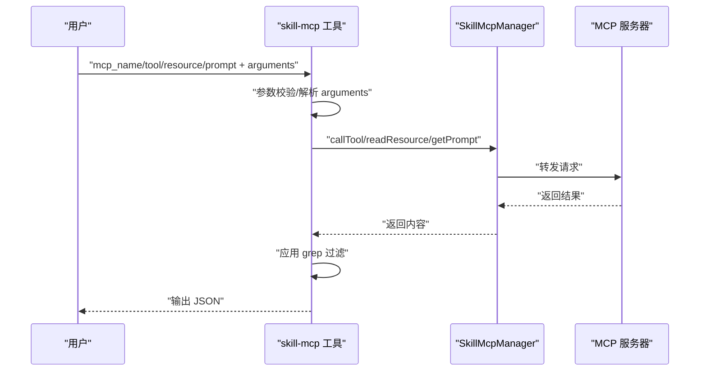
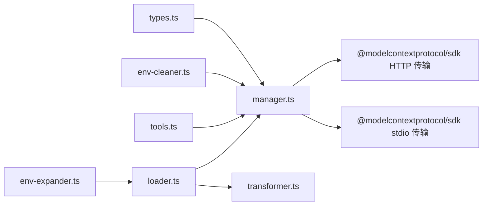

# MCP 管理器

<cite>
**本文引用的文件**
- [src/features/skill-mcp-manager/index.ts](file://src/features/skill-mcp-manager/index.ts)
- [src/features/skill-mcp-manager/manager.ts](file://src/features/skill-mcp-manager/manager.ts)
- [src/features/skill-mcp-manager/env-cleaner.ts](file://src/features/skill-mcp-manager/env-cleaner.ts)
- [src/features/skill-mcp-manager/types.ts](file://src/features/skill-mcp-manager/types.ts)
- [src/features/skill-mcp-manager/manager.test.ts](file://src/features/skill-mcp-manager/manager.test.ts)
- [src/features/claude-code-mcp-loader/types.ts](file://src/features/claude-code-mcp-loader/types.ts)
- [src/features/claude-code-mcp-loader/env-expander.ts](file://src/features/claude-code-mcp-loader/env-expander.ts)
- [src/features/claude-code-mcp-loader/loader.ts](file://src/features/claude-code-mcp-loader/loader.ts)
- [src/features/claude-code-mcp-loader/transformer.ts](file://src/features/claude-code-mcp-loader/transformer.ts)
- [src/tools/skill-mcp/tools.ts](file://src/tools/skill-mcp/tools.ts)
- [src/mcp/context7.ts](file://src/mcp/context7.ts)
- [src/mcp/grep-app.ts](file://src/mcp/grep-app.ts)
- [src/cli/doctor/checks/mcp.ts](file://src/cli/doctor/checks/mcp.ts)
</cite>

## 目录
1. [简介](#简介)
2. [项目结构](#项目结构)
3. [核心组件](#核心组件)
4. [架构总览](#架构总览)
5. [组件详解](#组件详解)
6. [依赖关系分析](#依赖关系分析)
7. [性能与可扩展性](#性能与可扩展性)
8. [故障排查与调试](#故障排查与调试)
9. [结论](#结论)
10. [附录：配置与集成指南](#附录配置与集成指南)

## 简介
本文件面向 Oh My OpenCode 的 MCP（Model Context Protocol）管理器，系统化阐述其在技能（Skill）层对 MCP 服务器的管理与协调机制。重点覆盖以下方面：
- 生命周期管理：启动、连接、空闲回收、会话断开、进程清理
- 配置与连接：HTTP（含 SSE）、本地 stdio 两类连接方式的识别与建立
- 错误处理与重试：连接失败时的自动重连策略与错误提示
- 多服务器与多会话：基于键空间的客户端缓存与按会话批量断开
- 环境变量隔离：避免包管理器环境变量污染 MCP 进程
- 集成与使用：从技能到工具调用的完整链路

## 项目结构
围绕 MCP 管理器的关键目录与文件如下：
- 技能 MCP 管理器：负责客户端生命周期、连接与操作封装
- MCP 加载器：负责从用户/项目/本地配置中加载并转换为统一格式
- 环境清理器：过滤并合并环境变量，避免 npm/pnpm/yarn 变量干扰
- 工具层：将 MCP 操作暴露为可执行工具，供技能调用
- 内置 MCP 服务器示例：context7、grep-app

图表来源
- [src/features/skill-mcp-manager/manager.ts](file://src/features/skill-mcp-manager/manager.ts#L60-L317)
- [src/features/claude-code-mcp-loader/loader.ts](file://src/features/claude-code-mcp-loader/loader.ts#L69-L103)
- [src/features/claude-code-mcp-loader/transformer.ts](file://src/features/claude-code-mcp-loader/transformer.ts#L9-L53)
- [src/features/claude-code-mcp-loader/env-expander.ts](file://src/features/claude-code-mcp-loader/env-expander.ts#L1-L28)
- [src/features/skill-mcp-manager/env-cleaner.ts](file://src/features/skill-mcp-manager/env-cleaner.ts#L10-L27)
- [src/tools/skill-mcp/tools.ts](file://src/tools/skill-mcp/tools.ts#L107-L172)

章节来源
- [src/features/skill-mcp-manager/index.ts](file://src/features/skill-mcp-manager/index.ts#L1-L3)
- [src/features/skill-mcp-manager/manager.ts](file://src/features/skill-mcp-manager/manager.ts#L60-L317)
- [src/features/claude-code-mcp-loader/loader.ts](file://src/features/claude-code-mcp-loader/loader.ts#L18-L103)
- [src/features/claude-code-mcp-loader/transformer.ts](file://src/features/claude-code-mcp-loader/transformer.ts#L9-L53)
- [src/features/claude-code-mcp-loader/env-expander.ts](file://src/features/claude-code-mcp-loader/env-expander.ts#L1-L28)
- [src/features/skill-mcp-manager/env-cleaner.ts](file://src/features/skill-mcp-manager/env-cleaner.ts#L10-L27)
- [src/tools/skill-mcp/tools.ts](file://src/tools/skill-mcp/tools.ts#L107-L172)

## 核心组件
- SkillMcpManager：集中式客户端管理器，负责连接类型判定、客户端创建、缓存、空闲回收、重连与断开
- 环境清理器：过滤可能破坏 MCP 进程的环境变量，合并自定义 env
- MCP 加载器与转换器：从 .mcp.json 加载配置，展开环境变量，统一为本地/远程配置
- 工具层：将 MCP 操作封装为工具，供技能调用

章节来源
- [src/features/skill-mcp-manager/manager.ts](file://src/features/skill-mcp-manager/manager.ts#L60-L317)
- [src/features/skill-mcp-manager/env-cleaner.ts](file://src/features/skill-mcp-manager/env-cleaner.ts#L10-L27)
- [src/features/claude-code-mcp-loader/loader.ts](file://src/features/claude-code-mcp-loader/loader.ts#L69-L103)
- [src/features/claude-code-mcp-loader/transformer.ts](file://src/features/claude-code-mcp-loader/transformer.ts#L9-L53)
- [src/tools/skill-mcp/tools.ts](file://src/tools/skill-mcp/tools.ts#L107-L172)

## 架构总览
下图展示从“技能工具调用”到“MCP 服务器”的端到端流程，以及管理器如何在中间层进行连接与生命周期管理。

图表来源
- [src/tools/skill-mcp/tools.ts](file://src/tools/skill-mcp/tools.ts#L120-L171)
- [src/features/skill-mcp-manager/manager.ts](file://src/features/skill-mcp-manager/manager.ts#L112-L174)
- [src/features/skill-mcp-manager/manager.ts](file://src/features/skill-mcp-manager/manager.ts#L180-L317)

## 组件详解

### SkillMcpManager：客户端生命周期与连接管理
- 连接类型判定：优先使用显式 type（http/sse/stdio），否则根据是否存在 url/command 推断
- HTTP 连接：通过 StreamableHTTPClientTransport 建立，支持 headers；失败时关闭传输并抛出带上下文的错误
- 本地 stdio 连接：通过 StdioClientTransport 启动本地进程，合并清理后的环境变量；失败时关闭传输并抛出带上下文的错误
- 客户端缓存：Map 存储已连接客户端，键由 sessionID、skillName、serverName 组成
- 并发安全：pendingConnections 避免同一键并发重复连接
- 空闲回收：定时器每分钟扫描一次，超过 5 分钟未使用则关闭并移除
- 断开策略：按会话批量断开；全局断开时停止定时器并逐个关闭
- 操作重试：针对“未连接”类错误最多重试 3 次，每次失败删除旧连接并重建

图表来源
- [src/features/skill-mcp-manager/manager.ts](file://src/features/skill-mcp-manager/manager.ts#L60-L520)

章节来源
- [src/features/skill-mcp-manager/manager.ts](file://src/features/skill-mcp-manager/manager.ts#L40-L58)
- [src/features/skill-mcp-manager/manager.ts](file://src/features/skill-mcp-manager/manager.ts#L112-L174)
- [src/features/skill-mcp-manager/manager.ts](file://src/features/skill-mcp-manager/manager.ts#L180-L317)
- [src/features/skill-mcp-manager/manager.ts](file://src/features/skill-mcp-manager/manager.ts#L319-L383)
- [src/features/skill-mcp-manager/manager.ts](file://src/features/skill-mcp-manager/manager.ts#L385-L488)
- [src/features/skill-mcp-manager/manager.ts](file://src/features/skill-mcp-manager/manager.ts#L490-L520)

### 环境清理器：避免包管理器变量污染
- 过滤规则：排除 NPM_CONFIG_*、npm_config_*、YARN_*、PNPM_*、NO_UPDATE_NOTIFIER 等
- 合并策略：先继承 process.env，再叠加 config.env（后者覆盖前者）
- 应用点：本地 stdio 连接前生成干净环境

图表来源
- [src/features/skill-mcp-manager/env-cleaner.ts](file://src/features/skill-mcp-manager/env-cleaner.ts#L10-L27)

章节来源
- [src/features/skill-mcp-manager/env-cleaner.ts](file://src/features/skill-mcp-manager/env-cleaner.ts#L1-L28)

### MCP 配置加载与转换
- 配置来源：用户级 ~/.mcp.json、项目级 .mcp.json、工作目录子路径 .claude/.mcp.json
- 加载逻辑：逐个文件读取 JSON，跳过 disabled 的服务器
- 转换逻辑：展开环境变量，统一为本地（command 数组）或远程（url+headers）配置
- 类型定义：ClaudeCodeMcpServer 支持 http/sse/stdio 三类；McpServerConfig 为本地/远程二选一

图表来源
- [src/features/claude-code-mcp-loader/loader.ts](file://src/features/claude-code-mcp-loader/loader.ts#L18-L103)
- [src/features/claude-code-mcp-loader/transformer.ts](file://src/features/claude-code-mcp-loader/transformer.ts#L9-L53)
- [src/features/claude-code-mcp-loader/env-expander.ts](file://src/features/claude-code-mcp-loader/env-expander.ts#L13-L27)

章节来源
- [src/features/claude-code-mcp-loader/loader.ts](file://src/features/claude-code-mcp-loader/loader.ts#L18-L103)
- [src/features/claude-code-mcp-loader/transformer.ts](file://src/features/claude-code-mcp-loader/transformer.ts#L9-L53)
- [src/features/claude-code-mcp-loader/env-expander.ts](file://src/features/claude-code-mcp-loader/env-expander.ts#L1-L28)
- [src/features/claude-code-mcp-loader/types.ts](file://src/features/claude-code-mcp-loader/types.ts#L3-L15)

### 工具层：将 MCP 操作暴露为可执行工具
- 参数校验：确保仅提供 tool_name、resource_name、prompt_name 之一
- 服务器查找：在已加载技能中按 mcp_name 查找对应配置
- 执行流程：构造 SkillMcpClientInfo 与 SkillMcpServerContext，调用管理器相应方法
- 输出处理：支持正则过滤 grep，统一 JSON 输出

图表来源
- [src/tools/skill-mcp/tools.ts](file://src/tools/skill-mcp/tools.ts#L120-L171)
- [src/features/skill-mcp-manager/manager.ts](file://src/features/skill-mcp-manager/manager.ts#L385-L445)

章节来源
- [src/tools/skill-mcp/tools.ts](file://src/tools/skill-mcp/tools.ts#L15-L91)
- [src/tools/skill-mcp/tools.ts](file://src/tools/skill-mcp/tools.ts#L107-L172)

### 内置 MCP 服务器示例
- context7：远程 HTTP 服务器
- grep-app：远程 HTTP 服务器

章节来源
- [src/mcp/context7.ts](file://src/mcp/context7.ts#L1-L7)
- [src/mcp/grep-app.ts](file://src/mcp/grep-app.ts#L1-L7)

## 依赖关系分析
- SkillMcpManager 依赖：
  - MCP SDK 传输层（HTTP/stdio）
  - 环境清理器（stdoio 场景）
  - 环境变量展开器（加载器阶段）
  - 类型定义（技能侧传递的 info/context）
- MCP 加载器依赖：
  - 配置文件读取
  - 转换器与环境变量展开器
- 工具层依赖：
  - 技能侧已加载的技能列表
  - 管理器提供的操作接口

图表来源
- [src/features/skill-mcp-manager/types.ts](file://src/features/skill-mcp-manager/types.ts#L1-L15)
- [src/features/skill-mcp-manager/manager.ts](file://src/features/skill-mcp-manager/manager.ts#L1-L8)
- [src/features/claude-code-mcp-loader/env-expander.ts](file://src/features/claude-code-mcp-loader/env-expander.ts#L1-L28)
- [src/features/claude-code-mcp-loader/loader.ts](file://src/features/claude-code-mcp-loader/loader.ts#L1-L11)
- [src/features/claude-code-mcp-loader/transformer.ts](file://src/features/claude-code-mcp-loader/transformer.ts#L1-L7)
- [src/features/skill-mcp-manager/env-cleaner.ts](file://src/features/skill-mcp-manager/env-cleaner.ts#L1-L27)
- [src/tools/skill-mcp/tools.ts](file://src/tools/skill-mcp/tools.ts#L1-L6)

章节来源
- [src/features/skill-mcp-manager/manager.ts](file://src/features/skill-mcp-manager/manager.ts#L1-L8)
- [src/features/claude-code-mcp-loader/loader.ts](file://src/features/claude-code-mcp-loader/loader.ts#L1-L11)
- [src/features/claude-code-mcp-loader/transformer.ts](file://src/features/claude-code-mcp-loader/transformer.ts#L1-L7)
- [src/features/claude-code-mcp-loader/env-expander.ts](file://src/features/claude-code-mcp-loader/env-expander.ts#L1-L28)
- [src/features/skill-mcp-manager/env-cleaner.ts](file://src/features/skill-mcp-manager/env-cleaner.ts#L1-L27)
- [src/tools/skill-mcp/tools.ts](file://src/tools/skill-mcp/tools.ts#L1-L6)

## 性能与可扩展性
- 连接复用：通过 Map 缓存客户端，避免重复创建，降低进程/网络开销
- 并发控制：pendingConnections 防止同一键并发连接，减少资源竞争
- 空闲回收：定期清理长时间未使用的连接，释放进程与内存
- 重试策略：针对“未连接”类瞬时错误进行有限次数重试，提升鲁棒性
- 扩展方向：
  - 引入连接池与权重轮询（多服务器场景）
  - 增加健康检查与故障转移
  - 支持 SSE/WS 等更多传输变体
  - 将重试与退避策略参数化

[本节为通用指导，无需列出章节来源]

## 故障排查与调试
- 常见错误与提示
  - 无有效连接配置：明确要求提供 url 或 command，并给出 HTTP/stdio 示例
  - HTTP URL 无效：提示修正 URL
  - HTTP 连接失败：提示核对 URL、认证头、服务器是否支持 MCP over HTTP
  - stdio 命令缺失：提示命令需存在于 PATH 或安装完成
  - stdio 连接失败：提示检查命令、参数与包是否存在
- 重试行为
  - 对“未连接”错误最多重试 3 次，失败后抛出汇总错误
  - 非“未连接”错误直接抛出，不重试
- 环境变量问题
  - 若 MCP 进程异常退出或行为异常，检查是否被 NPM_CONFIG_* 等变量影响
  - 使用环境清理器生成干净环境
- 断开与清理
  - 按会话断开：确保释放该会话下的所有连接
  - 全局断开：停止定时器并逐个关闭，避免孤儿进程

章节来源
- [src/features/skill-mcp-manager/manager.test.ts](file://src/features/skill-mcp-manager/manager.test.ts#L54-L98)
- [src/features/skill-mcp-manager/manager.test.ts](file://src/features/skill-mcp-manager/manager.test.ts#L213-L264)
- [src/features/skill-mcp-manager/manager.test.ts](file://src/features/skill-mcp-manager/manager.test.ts#L291-L344)
- [src/features/skill-mcp-manager/manager.test.ts](file://src/features/skill-mcp-manager/manager.test.ts#L506-L610)
- [src/features/skill-mcp-manager/manager.ts](file://src/features/skill-mcp-manager/manager.ts#L148-L167)
- [src/features/skill-mcp-manager/manager.ts](file://src/features/skill-mcp-manager/manager.ts#L186-L237)
- [src/features/skill-mcp-manager/manager.ts](file://src/features/skill-mcp-manager/manager.ts#L261-L304)
- [src/features/skill-mcp-manager/manager.ts](file://src/features/skill-mcp-manager/manager.ts#L319-L353)
- [src/features/skill-mcp-manager/env-cleaner.ts](file://src/features/skill-mcp-manager/env-cleaner.ts#L1-L8)

## 结论
Oh My OpenCode 的 MCP 管理器通过清晰的职责划分与稳健的错误处理，实现了对本地与远程 MCP 服务器的统一接入与生命周期管理。其设计兼顾了易用性与可维护性：配置加载与转换抽象了不同来源与格式；管理器提供了连接复用、空闲回收与有限重试；环境清理器解决了跨包管理器的兼容性问题。未来可在多服务器调度、健康检查与故障转移等方面进一步增强。

[本节为总结，无需列出章节来源]

## 附录：配置与集成指南

### 配置文件与加载顺序
- 用户级：~/.mcp.json
- 项目级：工作目录 .mcp.json
- 本地级：工作目录 .claude/.mcp.json
- 加载时会跳过 disabled 的服务器，并记录加载来源 scope

章节来源
- [src/features/claude-code-mcp-loader/loader.ts](file://src/features/claude-code-mcp-loader/loader.ts#L18-L27)
- [src/features/claude-code-mcp-loader/loader.ts](file://src/features/claude-code-mcp-loader/loader.ts#L78-L99)

### 连接类型与配置要点
- HTTP/SSE
  - 必填：url
  - 可选：headers（如 Authorization）
  - 适用：远程托管的 MCP 服务
- stdio
  - 必填：command（可含 args）
  - 可选：env（将与清理后的环境合并）
  - 适用：本地安装的 MCP 服务器
- 环境变量
  - 支持 ${VAR} 与 ${VAR:-default} 展开
  - stdio 连接前会过滤并合并环境变量

章节来源
- [src/features/claude-code-mcp-loader/types.ts](file://src/features/claude-code-mcp-loader/types.ts#L3-L11)
- [src/features/claude-code-mcp-loader/env-expander.ts](file://src/features/claude-code-mcp-loader/env-expander.ts#L1-L28)
- [src/features/skill-mcp-manager/env-cleaner.ts](file://src/features/skill-mcp-manager/env-cleaner.ts#L10-L27)

### 工具调用与参数
- 必填：mcp_name（来自技能配置）
- 三选一：tool_name、resource_name、prompt_name
- 可选：arguments（JSON 字符串或对象）
- 可选：grep（正则过滤输出）

章节来源
- [src/tools/skill-mcp/tools.ts](file://src/tools/skill-mcp/tools.ts#L112-L119)
- [src/tools/skill-mcp/tools.ts](file://src/tools/skill-mcp/tools.ts#L120-L171)

### 内置服务器参考
- context7：远程 HTTP 服务器
- grep-app：远程 HTTP 服务器

章节来源
- [src/mcp/context7.ts](file://src/mcp/context7.ts#L1-L7)
- [src/mcp/grep-app.ts](file://src/mcp/grep-app.ts#L1-L7)

### CLI 健康检查
- 内置 MCP 服务器检查：统计启用数量
- 用户 MCP 服务器检查：统计有效/无效配置并给出详情

章节来源
- [src/cli/doctor/checks/mcp.ts](file://src/cli/doctor/checks/mcp.ts#L67-L109)