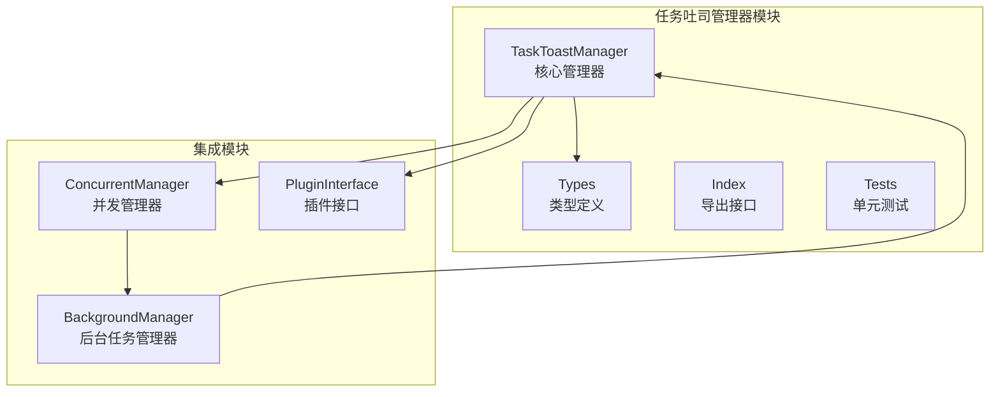
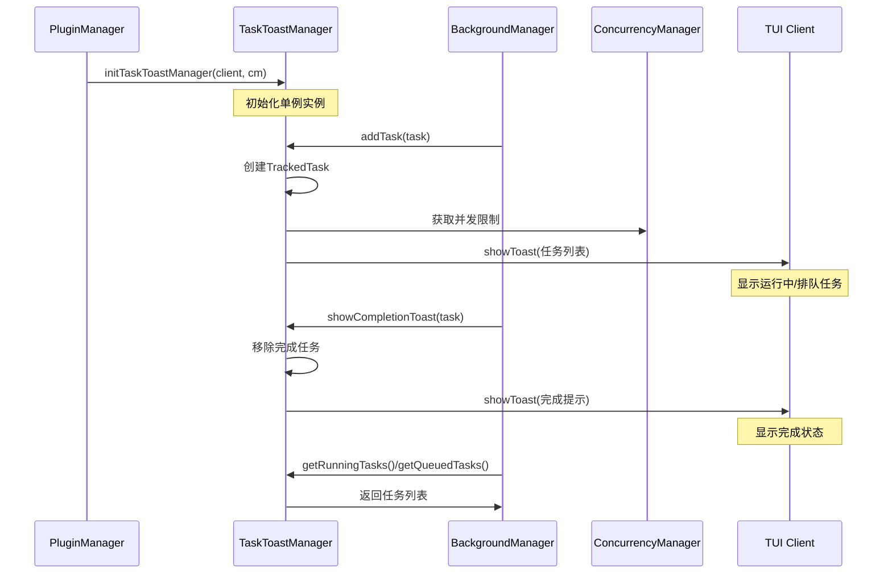
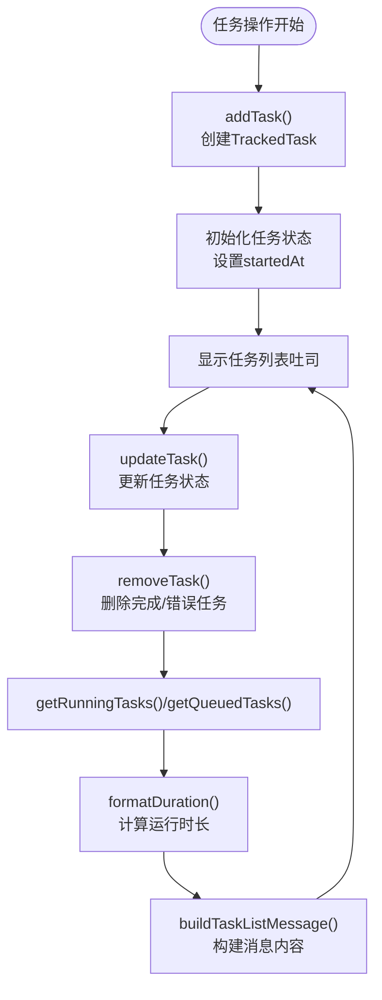
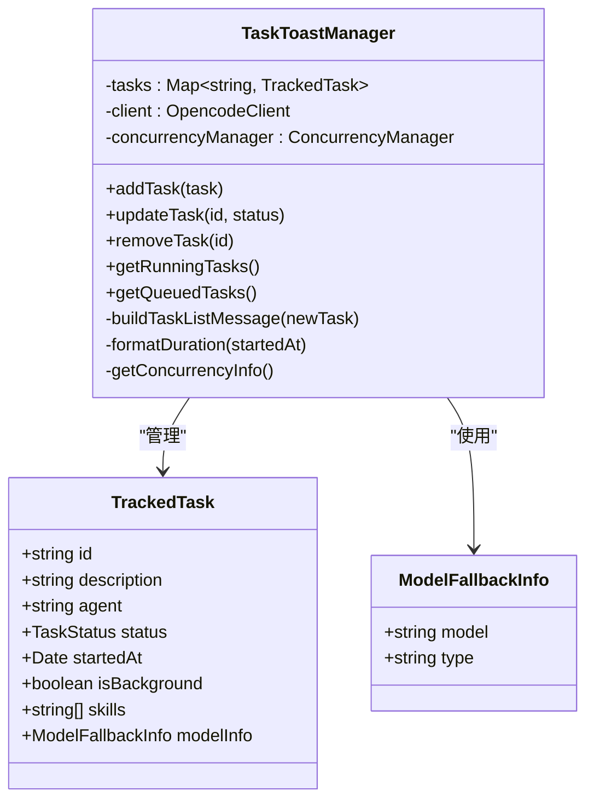
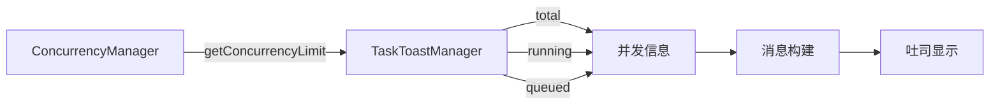
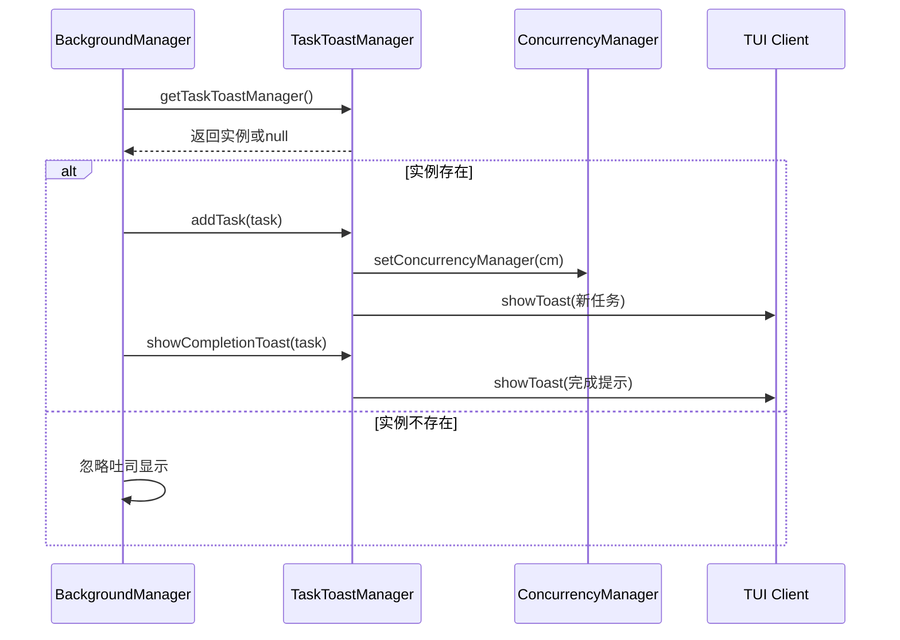
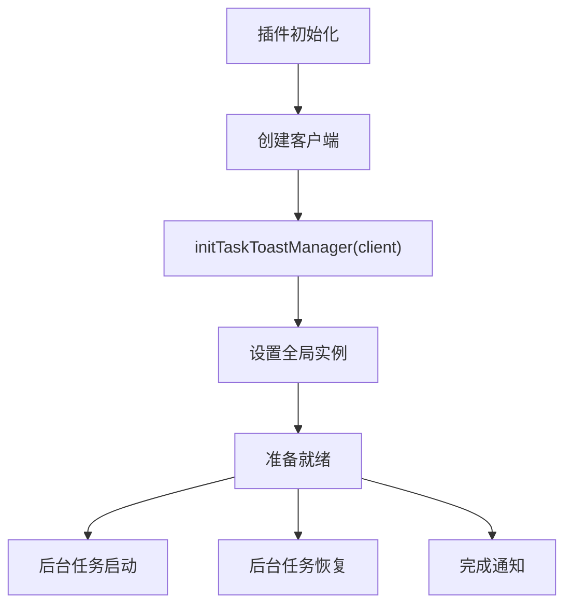
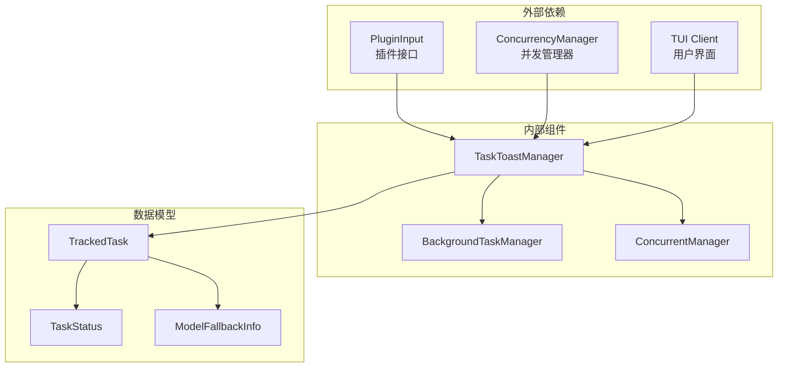
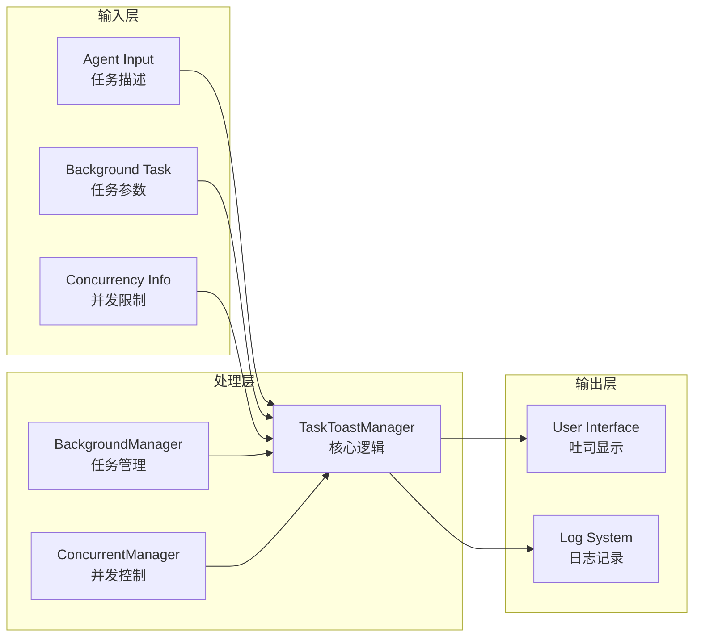

# 任务吐司管理器

<cite>
**本文档引用的文件**
- [src/features/task-toast-manager/index.ts](file://src/features/task-toast-manager/index.ts)
- [src/features/task-toast-manager/manager.ts](file://src/features/task-toast-manager/manager.ts)
- [src/features/task-toast-manager/types.ts](file://src/features/task-toast-manager/types.ts)
- [src/features/task-toast-manager/manager.test.ts](file://src/features/task-toast-manager/manager.test.ts)
- [src/features/background-agent/manager.ts](file://src/features/background-agent/manager.ts)
- [src/features/background-agent/concurrency.ts](file://src/features/background-agent/concurrency.ts)
- [src/features/background-agent/types.ts](file://src/features/background-agent/types.ts)
- [src/index.ts](file://src/index.ts)
</cite>

## 目录
1. [简介](#简介)
2. [项目结构](#项目结构)
3. [核心组件](#核心组件)
4. [架构概览](#架构概览)
5. [详细组件分析](#详细组件分析)
6. [依赖关系分析](#依赖关系分析)
7. [性能考虑](#性能考虑)
8. [故障排查指南](#故障排查指南)
9. [结论](#结论)
10. [附录](#附录)

## 简介
任务吐司管理器是 Oh My OpenCode 中用于管理和展示任务执行状态的核心组件。它提供了统一的任务状态通知、进度显示和完成提示功能，支持前台任务和后台任务的差异化处理，并集成了并发控制信息展示。

该管理器通过一次性汇总所有运行中和排队中的任务，向用户呈现清晰的任务状态概览，帮助用户了解当前系统的负载情况和任务执行进度。

## 项目结构
任务吐司管理器位于 `src/features/task-toast-manager/` 目录下，包含以下关键文件：
- `index.ts`: 导出接口和类型定义
- `manager.ts`: 核心管理器实现
- `types.ts`: 类型定义
- `manager.test.ts`: 单元测试

**图表来源**
- [src/features/task-toast-manager/manager.ts](file://src/features/task-toast-manager/manager.ts#L1-L215)
- [src/features/background-agent/manager.ts](file://src/features/background-agent/manager.ts#L1-L200)

**章节来源**
- [src/features/task-toast-manager/index.ts](file://src/features/task-toast-manager/index.ts#L1-L3)
- [src/features/task-toast-manager/manager.ts](file://src/features/task-toast-manager/manager.ts#L1-L215)

## 核心组件
任务吐司管理器由以下核心组件构成：

### TaskToastManager 类
这是主要的管理器类，负责：
- 任务生命周期管理（创建、更新、删除）
- 任务状态跟踪和排序
- 吐司消息构建和显示
- 并发信息集成

### TrackedTask 接口
定义了被跟踪任务的数据结构，包含：
- 基本信息：id、description、agent
- 状态管理：status、startedAt
- 行为标识：isBackground
- 可选信息：skills、modelInfo

### TaskStatus 枚举
定义了任务的四种状态：
- running：运行中
- queued：排队中  
- completed：已完成
- error：错误状态

**章节来源**
- [src/features/task-toast-manager/manager.ts](file://src/features/task-toast-manager/manager.ts#L7-L215)
- [src/features/task-toast-manager/types.ts](file://src/features/task-toast-manager/types.ts#L1-L25)

## 架构概览
任务吐司管理器采用松耦合的设计，与后台任务管理器通过单例模式进行集成，实现了清晰的关注点分离。

**图表来源**
- [src/index.ts](file://src/index.ts#L240-L241)
- [src/features/background-agent/manager.ts](file://src/features/background-agent/manager.ts#L157-L166)
- [src/features/background-agent/manager.ts](file://src/features/background-agent/manager.ts#L775-L782)

## 详细组件分析

### TaskToastManager 实现分析

#### 任务生命周期管理
管理器维护一个 Map 来存储所有跟踪的任务，提供完整的 CRUD 操作：

**图表来源**
- [src/features/task-toast-manager/manager.ts](file://src/features/task-toast-manager/manager.ts#L21-L60)
- [src/features/task-toast-manager/manager.ts](file://src/features/task-toast-manager/manager.ts#L65-L145)

#### 吐司消息构建机制
消息构建器根据任务状态和配置生成格式化的吐司内容：

**图表来源**
- [src/features/task-toast-manager/manager.ts](file://src/features/task-toast-manager/manager.ts#L7-L215)
- [src/features/task-toast-manager/types.ts](file://src/features/task-toast-manager/types.ts#L8-L17)

#### 并发信息集成
管理器能够与并发管理器集成，显示当前的并发状态：

**图表来源**
- [src/features/task-toast-manager/manager.ts](file://src/features/task-toast-manager/manager.ts#L93-L101)
- [src/features/background-agent/concurrency.ts](file://src/features/background-agent/concurrency.ts#L24-L39)

**章节来源**
- [src/features/task-toast-manager/manager.ts](file://src/features/task-toast-manager/manager.ts#L1-L215)
- [src/features/task-toast-manager/types.ts](file://src/features/task-toast-manager/types.ts#L1-L25)

### 集成实现分析

#### 后台任务管理器集成
后台任务管理器通过单例模式获取任务吐司管理器实例：

**图表来源**
- [src/features/background-agent/manager.ts](file://src/features/background-agent/manager.ts#L13-L13)
- [src/features/background-agent/manager.ts](file://src/features/background-agent/manager.ts#L157-L166)
- [src/features/background-agent/manager.ts](file://src/features/background-agent/manager.ts#L775-L782)

#### 插件初始化集成
在插件启动时初始化任务吐司管理器：

**图表来源**
- [src/index.ts](file://src/index.ts#L240-L241)

**章节来源**
- [src/features/background-agent/manager.ts](file://src/features/background-agent/manager.ts#L1-L200)
- [src/index.ts](file://src/index.ts#L240-L241)

## 依赖关系分析

### 组件依赖图

**图表来源**
- [src/features/task-toast-manager/manager.ts](file://src/features/task-toast-manager/manager.ts#L1-L15)
- [src/features/background-agent/manager.ts](file://src/features/background-agent/manager.ts#L1-L25)

### 数据流分析
任务吐司管理器的数据流遵循以下模式：

**图表来源**
- [src/features/task-toast-manager/manager.ts](file://src/features/task-toast-manager/manager.ts#L103-L145)
- [src/features/background-agent/manager.ts](file://src/features/background-agent/manager.ts#L157-L166)

**章节来源**
- [src/features/task-toast-manager/manager.ts](file://src/features/task-toast-manager/manager.ts#L1-L215)
- [src/features/background-agent/manager.ts](file://src/features/background-agent/manager.ts#L1-L200)

## 性能考虑
任务吐司管理器在设计时充分考虑了性能优化：

### 内存管理
- 使用 Map 数据结构存储任务，提供 O(1) 的查找和删除操作
- 自动清理完成和错误的任务，避免内存泄漏
- 支持任务超时清理机制

### 吐司显示优化
- 动态调整显示时长：当有多个任务时显示更长时间
- 条件渲染：仅在有实际内容时显示技能信息
- 异步处理：吐司显示调用使用异步方式，不影响主流程

### 并发控制集成
- 与并发管理器集成，避免重复查询
- 缓存并发限制信息
- 支持无限并发模式（limit=0）

**章节来源**
- [src/features/task-toast-manager/manager.ts](file://src/features/task-toast-manager/manager.ts#L84-L101)
- [src/features/task-toast-manager/manager.ts](file://src/features/task-toast-manager/manager.ts#L163-L170)

## 故障排查指南

### 常见问题及解决方案

#### 吐司不显示
可能原因：
1. TUI 客户端未正确初始化
2. showToast 方法不可用
3. 插件未正确初始化

解决步骤：
1. 检查插件初始化代码
2. 验证客户端连接状态
3. 查看控制台错误日志

#### 任务状态异常
可能原因：
1. 任务生命周期管理错误
2. 并发控制冲突
3. 任务超时处理

排查方法：
1. 检查任务状态转换逻辑
2. 验证并发限制配置
3. 查看任务超时时间设置

#### 并发信息显示错误
可能原因：
1. 并发管理器未正确设置
2. 任务计数统计错误
3. 配置解析失败

解决方法：
1. 确认并发管理器实例化
2. 检查配置文件设置
3. 验证任务计数逻辑

**章节来源**
- [src/features/task-toast-manager/manager.test.ts](file://src/features/task-toast-manager/manager.test.ts#L1-L250)

## 结论
任务吐司管理器是一个设计精良的任务状态管理组件，具有以下特点：

### 设计优势
- **模块化设计**：清晰的职责分离和接口定义
- **可扩展性**：支持多种任务状态和配置选项
- **用户体验友好**：提供直观的任务状态可视化
- **性能优化**：高效的内存管理和异步处理

### 技术亮点
- 统一的任务状态管理
- 智能的并发信息集成
- 灵活的消息格式化
- 完善的错误处理机制

### 应用价值
该组件为 Oh My OpenCode 提供了可靠的任务状态通知能力，帮助用户更好地理解和控制复杂的多任务执行环境。

## 附录

### 配置选项说明
任务吐司管理器支持以下配置选项：

| 选项名称 | 类型 | 默认值 | 描述 |
|---------|------|--------|------|
| title | string | 自动生成 | 吐司标题 |
| message | string | 自动生成 | 吐司消息内容 |
| variant | enum | "info" | 吐司样式变体 |
| duration | number | 动态计算 | 显示持续时间（毫秒） |

### 样式定制指南
支持的样式变体：
- info：信息提示（默认）
- success：成功状态
- warning：警告状态
- error：错误状态

### 集成示例
基本集成步骤：
1. 在插件初始化时调用 `initTaskToastManager(client)`
2. 在后台任务启动时调用 `addTask(task)`
3. 在任务完成时调用 `showCompletionToast(task)`

### 最佳实践
- 确保在插件启动时正确初始化管理器
- 合理设置任务超时时间
- 监控并发限制配置
- 处理吐司显示的异步特性
- 定期清理过期任务