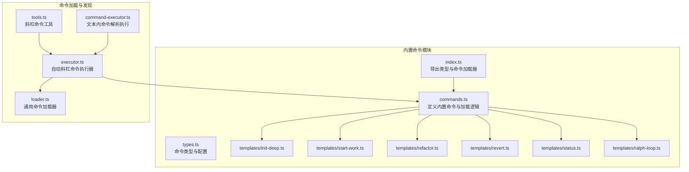
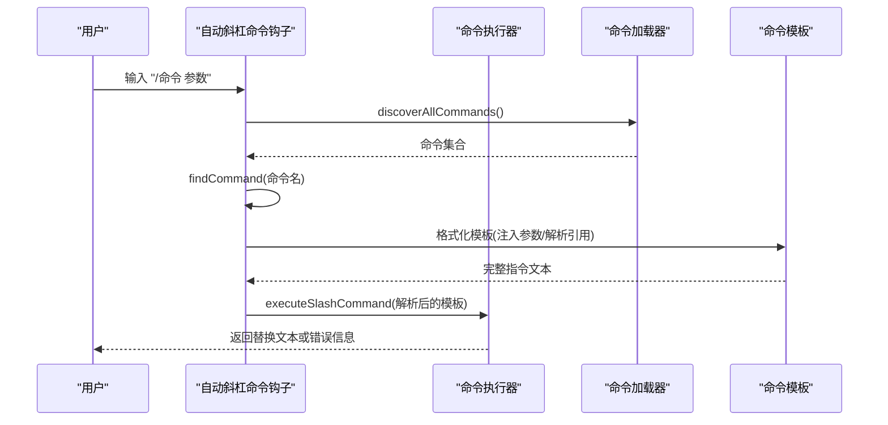
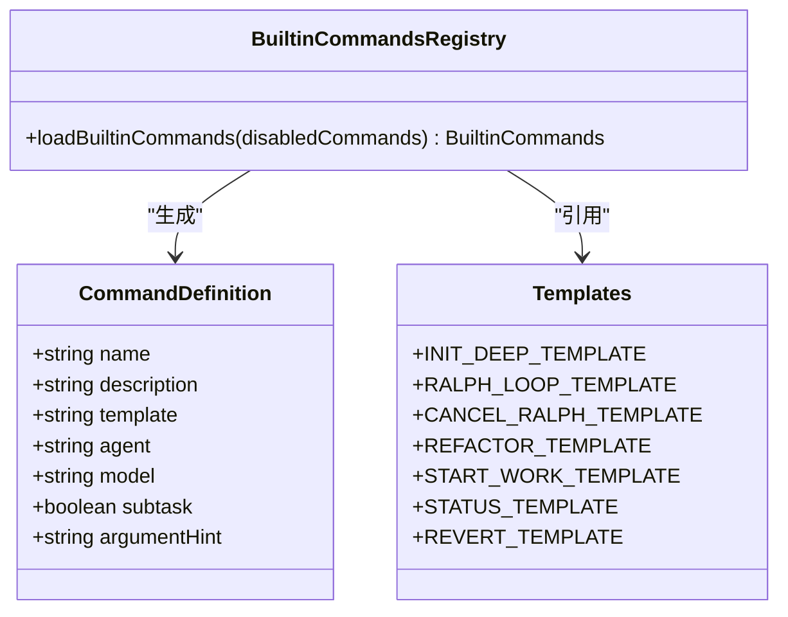
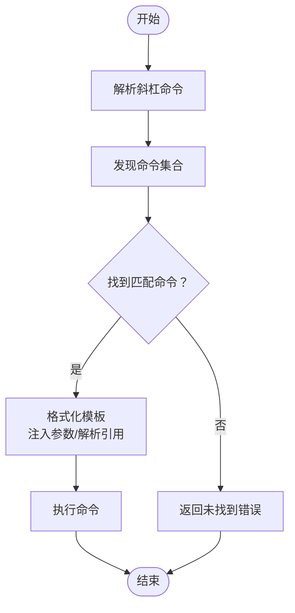
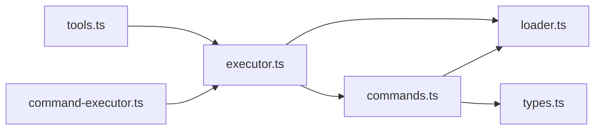

# 内置命令系统

<cite>
**本文引用的文件**
- [src/features/builtin-commands/index.ts](file://src/features/builtin-commands/index.ts)
- [src/features/builtin-commands/commands.ts](file://src/features/builtin-commands/commands.ts)
- [src/features/builtin-commands/types.ts](file://src/features/builtin-commands/types.ts)
- [src/features/builtin-commands/templates/init-deep.ts](file://src/features/builtin-commands/templates/init-deep.ts)
- [src/features/builtin-commands/templates/start-work.ts](file://src/features/builtin-commands/templates/start-work.ts)
- [src/features/builtin-commands/templates/refactor.ts](file://src/features/builtin-commands/templates/refactor.ts)
- [src/features/builtin-commands/templates/revert.ts](file://src/features/builtin-commands/templates/revert.ts)
- [src/features/builtin-commands/templates/status.ts](file://src/features/builtin-commands/templates/status.ts)
- [src/features/builtin-commands/templates/ralph-loop.ts](file://src/features/builtin-commands/templates/ralph-loop.ts)
- [src/features/claude-code-command-loader/loader.ts](file://src/features/claude-code-command-loader/loader.ts)
- [src/features/claude-code-command-loader/types.ts](file://src/features/claude-code-command-loader/types.ts)
- [src/hooks/auto-slash-command/executor.ts](file://src/hooks/auto-slash-command/executor.ts)
- [src/tools/slashcommand/tools.ts](file://src/tools/slashcommand/tools.ts)
- [src/shared/command-executor.ts](file://src/shared/command-executor.ts)
- [src/cli/config-manager.ts](file://src/cli/config-manager.ts)
</cite>

## 目录
1. [简介](#简介)
2. [项目结构](#项目结构)
3. [核心组件](#核心组件)
4. [架构总览](#架构总览)
5. [详细组件分析](#详细组件分析)
6. [依赖关系分析](#依赖关系分析)
7. [性能考量](#性能考量)
8. [故障排查指南](#故障排查指南)
9. [结论](#结论)
10. [附录](#附录)

## 简介
本文件系统性阐述 Oh My OpenCode 的内置命令系统：从命令的定义、注册到执行的完整机制；详解 init-deep、start-work、refactor、revert、status、ralph-loop 等预设命令模板的功能与用法；说明参数处理与结果返回流程；并提供扩展开发指南（自定义命令创建、模板使用与最佳实践）、配置项、错误处理与调试技巧，以及实际使用示例与工作流集成建议。

## 项目结构
内置命令系统由“命令定义与注册”“模板实现”“命令发现与执行”三部分组成：
- 命令定义与注册：在内置命令模块中集中声明命令名称、描述、模板与参数提示，并通过加载函数输出兼容 OpenCode 的命令记录。
- 模板实现：每个命令对应一个模板文件，封装完整的执行步骤、工具调用与输出格式。
- 命令发现与执行：自动斜杠命令钩子负责解析用户输入、查找命令、格式化模板并返回可执行文本；斜杠命令工具提供命令列表与详情展示；命令执行器支持在文本中解析并执行嵌入式命令片段。

**图表来源**
- [src/features/builtin-commands/index.ts](file://src/features/builtin-commands/index.ts#L1-L3)
- [src/features/builtin-commands/commands.ts](file://src/features/builtin-commands/commands.ts#L1-L109)
- [src/features/builtin-commands/types.ts](file://src/features/builtin-commands/types.ts#L1-L18)
- [src/features/builtin-commands/templates/init-deep.ts](file://src/features/builtin-commands/templates/init-deep.ts#L1-L301)
- [src/features/builtin-commands/templates/start-work.ts](file://src/features/builtin-commands/templates/start-work.ts#L1-L79)
- [src/features/builtin-commands/templates/refactor.ts](file://src/features/builtin-commands/templates/refactor.ts#L1-L620)
- [src/features/builtin-commands/templates/revert.ts](file://src/features/builtin-commands/templates/revert.ts#L1-L119)
- [src/features/builtin-commands/templates/status.ts](file://src/features/builtin-commands/templates/status.ts#L1-L73)
- [src/features/builtin-commands/templates/ralph-loop.ts](file://src/features/builtin-commands/templates/ralph-loop.ts#L1-L39)
- [src/features/claude-code-command-loader/loader.ts](file://src/features/claude-code-command-loader/loader.ts#L1-L145)
- [src/hooks/auto-slash-command/executor.ts](file://src/hooks/auto-slash-command/executor.ts#L119-L205)
- [src/tools/slashcommand/tools.ts](file://src/tools/slashcommand/tools.ts#L64-L233)
- [src/shared/command-executor.ts](file://src/shared/command-executor.ts#L143-L205)

**章节来源**
- [src/features/builtin-commands/index.ts](file://src/features/builtin-commands/index.ts#L1-L3)
- [src/features/builtin-commands/commands.ts](file://src/features/builtin-commands/commands.ts#L1-L109)
- [src/features/builtin-commands/types.ts](file://src/features/builtin-commands/types.ts#L1-L18)

## 核心组件
- 内置命令定义与加载
  - 在命令定义文件中集中声明所有内置命令，包含名称、描述、模板与参数提示；通过加载函数过滤禁用命令并输出兼容 OpenCode 的命令记录。
- 模板系统
  - 每个命令模板封装了完整的执行步骤、工具调用约定与输出格式，确保命令在不同环境下具有一致的行为。
- 命令发现与执行
  - 自动斜杠命令钩子解析用户输入，查找匹配命令，格式化模板并返回可执行文本；斜杠命令工具提供命令列表与详情展示；命令执行器支持在文本中解析并执行嵌入式命令片段。

**章节来源**
- [src/features/builtin-commands/commands.ts](file://src/features/builtin-commands/commands.ts#L10-L108)
- [src/features/claude-code-command-loader/loader.ts](file://src/features/claude-code-command-loader/loader.ts#L112-L144)
- [src/hooks/auto-slash-command/executor.ts](file://src/hooks/auto-slash-command/executor.ts#L183-L205)
- [src/tools/slashcommand/tools.ts](file://src/tools/slashcommand/tools.ts#L167-L233)
- [src/shared/command-executor.ts](file://src/shared/command-executor.ts#L184-L205)

## 架构总览
内置命令系统的执行链路如下：
- 用户输入以斜杠命令触发（如 /init-deep、/refactor）。
- 自动斜杠命令钩子解析命令名与参数，查找所有可用命令（含内置、技能与用户自定义）。
- 找到匹配命令后，格式化模板：注入参数、解析文件引用与嵌入式命令，生成最终指令文本。
- 返回给会话或工具，交由代理执行。

**图表来源**
- [src/hooks/auto-slash-command/executor.ts](file://src/hooks/auto-slash-command/executor.ts#L126-L175)
- [src/features/claude-code-command-loader/loader.ts](file://src/features/claude-code-command-loader/loader.ts#L136-L144)
- [src/features/builtin-commands/templates/init-deep.ts](file://src/features/builtin-commands/templates/init-deep.ts#L1-L301)

## 详细组件分析

### 命令定义与注册（commands.ts）
- 命令注册表：集中声明内置命令名称、描述、模板与参数提示；模板中通过占位符注入参数与上下文变量。
- 加载逻辑：根据禁用列表过滤命令，移除与 OpenCode 兼容无关的字段，输出兼容的命令记录。
- 支持的内置命令：
  - init-deep：初始化分层 AGENTS.md 知识库，支持更新模式与新建模式、最大深度限制等参数。
  - ralph-loop / ulw-loop：自参照循环开发，持续迭代直到完成，支持完成承诺与最大迭代次数。
  - cancel-ralph：取消当前 Ralph 循环。
  - refactor：智能重构，结合 LSP、AST-grep、架构分析与测试验证。
  - start-work：从 Prometheus 计划启动 Sisyphus 工作会话。
  - status：显示当前变更执行状态。
  - revert：按任务/阶段/变更粒度回退到历史检查点。

**图表来源**
- [src/features/builtin-commands/commands.ts](file://src/features/builtin-commands/commands.ts#L10-L108)
- [src/features/builtin-commands/types.ts](file://src/features/builtin-commands/types.ts#L1-L18)

**章节来源**
- [src/features/builtin-commands/commands.ts](file://src/features/builtin-commands/commands.ts#L10-L108)
- [src/features/builtin-commands/types.ts](file://src/features/builtin-commands/types.ts#L3-L15)

### 命令模板详解

#### init-deep 模板
- 功能：生成分层 AGENTS.md 文件，支持更新现有与新建两种模式，可限制目录深度。
- 关键流程：并发探索、结构分析、LSP 代码图谱、评分决策、并行生成、审查去重。
- 使用建议：首次使用建议新建模式以保留既有上下文；根据项目规模动态调整代理数量。

**章节来源**
- [src/features/builtin-commands/templates/init-deep.ts](file://src/features/builtin-commands/templates/init-deep.ts#L1-L301)

#### start-work 模板
- 功能：从 changes 目录选择或自动选择计划，读取 boulder.json 并继续执行任务。
- 关键流程：检测活跃计划、决策逻辑（续写/新选）、创建/更新 boulder.json、读取计划并开始执行。
- 使用建议：遵循 7 段委托协议，确保在开始前更新 boulder.json。

**章节来源**
- [src/features/builtin-commands/templates/start-work.ts](file://src/features/builtin-commands/templates/start-work.ts#L1-L79)

#### refactor 模板
- 功能：基于意图识别、并行探索、代码图谱构建、测试评估、计划生成、确定性执行与回归验证的完整重构流程。
- 关键流程：意图门禁、并行探索、LSP/AST-grep 分析、测试覆盖率评估、Plan Agent 生成计划、每步验证与提交检查点、最终回归验证。
- 使用建议：优先保证测试覆盖率；严格遵循“先预览再执行”的原则；遇到冲突立即停止并修复。

**章节来源**
- [src/features/builtin-commands/templates/refactor.ts](file://src/features/builtin-commands/templates/refactor.ts#L1-L620)

#### revert 模板
- 功能：按任务/阶段/变更粒度回退到历史检查点，支持列出可用检查点与交互确认。
- 关键流程：列出检查点、解析提交消息、任务/阶段/变更回退、逆序回退、清理与状态更新。
- 使用建议：变更回退具有破坏性，务必确认后再执行；出现冲突时按提示解决。

**章节来源**
- [src/features/builtin-commands/templates/revert.ts](file://src/features/builtin-commands/templates/revert.ts#L1-L119)

#### status 模板
- 功能：显示当前变更执行状态，包括任务进度、最近提交、工作树分支等。
- 关键流程：检查 boulder.json 或 changes 目录、解析 tasks.md 进度、查询 git 状态、格式化输出。
- 使用建议：无活动变更时提供可用变更列表与引导。

**章节来源**
- [src/features/builtin-commands/templates/status.ts](file://src/features/builtin-commands/templates/status.ts#L1-L73)

#### ralph-loop 模板
- 功能：自参照循环开发，持续迭代直至任务完全完成；支持完成承诺与最大迭代次数。
- 关键流程：解析参数、规则约束、退出条件（完成/达到最大迭代/取消）。
- 使用建议：仅在任务真正完成后输出完成承诺；必要时通过取消命令终止循环。

**章节来源**
- [src/features/builtin-commands/templates/ralph-loop.ts](file://src/features/builtin-commands/templates/ralph-loop.ts#L1-L39)

### 命令执行流程与参数处理
- 命令解析：自动斜杠命令钩子解析用户输入，提取命令名与参数。
- 命令发现：统一加载用户、项目、全局与 OpenCode 专用命令，合并为命令集合。
- 模板格式化：注入参数、解析文件引用与嵌入式命令，生成最终指令文本。
- 结果返回：成功时返回替换文本，失败时返回错误信息。

**图表来源**
- [src/hooks/auto-slash-command/executor.ts](file://src/hooks/auto-slash-command/executor.ts#L183-L205)
- [src/features/claude-code-command-loader/loader.ts](file://src/features/claude-code-command-loader/loader.ts#L136-L144)

**章节来源**
- [src/hooks/auto-slash-command/executor.ts](file://src/hooks/auto-slash-command/executor.ts#L126-L175)
- [src/shared/command-executor.ts](file://src/shared/command-executor.ts#L184-L205)

### 命令扩展开发指南
- 创建自定义命令
  - 在用户/项目/全局/OpenCode 专用命令目录下创建 Markdown 文件，文件名即命令名。
  - 在 Frontmatter 中设置描述、参数提示、代理、模型、子任务与手-offs。
  - 模板内容中使用占位符注入参数与上下文变量。
- 模板使用与最佳实践
  - 明确意图门禁与参数校验，避免模糊请求。
  - 并行探索与同步验证相结合，确保每步变更可追溯。
  - 使用嵌入式命令解析器在模板中执行辅助命令。
- 集成与发布
  - 将命令放置于相应目录后即可被自动发现与加载。
  - 可通过斜杠命令工具查看命令列表与详情。

**章节来源**
- [src/features/claude-code-command-loader/loader.ts](file://src/features/claude-code-command-loader/loader.ts#L11-L101)
- [src/features/claude-code-command-loader/types.ts](file://src/features/claude-code-command-loader/types.ts#L19-L39)
- [src/tools/slashcommand/tools.ts](file://src/tools/slashcommand/tools.ts#L64-L111)

## 依赖关系分析
- 内置命令模块依赖命令加载器与类型定义，通过加载函数输出兼容的命令记录。
- 自动斜杠命令钩子依赖命令加载器与模板格式化逻辑，负责最终的执行与返回。
- 斜杠命令工具提供命令列表与详情展示，便于用户了解可用命令。
- 命令执行器支持在文本中解析并执行嵌入式命令片段，增强模板灵活性。

**图表来源**
- [src/features/builtin-commands/commands.ts](file://src/features/builtin-commands/commands.ts#L1-L10)
- [src/features/claude-code-command-loader/loader.ts](file://src/features/claude-code-command-loader/loader.ts#L1-L10)
- [src/hooks/auto-slash-command/executor.ts](file://src/hooks/auto-slash-command/executor.ts#L119-L124)
- [src/tools/slashcommand/tools.ts](file://src/tools/slashcommand/tools.ts#L167-L195)
- [src/shared/command-executor.ts](file://src/shared/command-executor.ts#L184-L188)

**章节来源**
- [src/features/builtin-commands/commands.ts](file://src/features/builtin-commands/commands.ts#L1-L10)
- [src/features/claude-code-command-loader/loader.ts](file://src/features/claude-code-command-loader/loader.ts#L136-L144)
- [src/hooks/auto-slash-command/executor.ts](file://src/hooks/auto-slash-command/executor.ts#L183-L205)
- [src/tools/slashcommand/tools.ts](file://src/tools/slashcommand/tools.ts#L167-L233)
- [src/shared/command-executor.ts](file://src/shared/command-executor.ts#L184-L205)

## 性能考量
- 并行探索：在重构与 init-deep 等场景中，优先采用并行探索以缩短分析时间。
- 缓存与预热：斜杠命令工具对命令列表进行缓存与预热，减少重复扫描开销。
- 嵌入式命令解析：递归解析嵌入式命令时设置最大深度，避免深层嵌套导致的性能问题。
- I/O 优化：命令加载器在访问目录前进行存在性检查与路径解析，减少无效 I/O。

[本节为通用指导，不直接分析具体文件]

## 故障排查指南
- 命令未找到
  - 检查命令拼写与大小写；确认命令位于正确的命令目录。
  - 使用斜杠命令工具列出可用命令与参数提示。
- 模板加载失败
  - 查看日志中的解析错误信息；检查 Frontmatter 语法与模板完整性。
- 嵌入式命令执行异常
  - 检查命令是否存在且可执行；确认非交互环境下的安全策略。
- 权限与磁盘问题
  - 配置文件读写失败时，检查权限与磁盘空间；根据错误提示采取相应措施。

**章节来源**
- [src/hooks/auto-slash-command/executor.ts](file://src/hooks/auto-slash-command/executor.ts#L186-L204)
- [src/shared/command-executor.ts](file://src/shared/command-executor.ts#L184-L205)
- [src/cli/config-manager.ts](file://src/cli/config-manager.ts#L74-L98)

## 结论
Oh My OpenCode 的内置命令系统通过“集中定义、模板驱动、统一加载与执行”的方式，实现了高一致性与可扩展的命令生态。内置命令覆盖知识库初始化、工作会话启动、智能重构、状态查询与回退等关键场景；同时提供完善的扩展机制，允许用户基于模板快速创建自定义命令并融入现有工作流。

[本节为总结性内容，不直接分析具体文件]

## 附录

### 命令配置选项
- 禁用内置命令：通过配置对象中的禁用列表控制命令加载。
- 命令目录层次：用户、项目、全局与 OpenCode 专用四类命令目录，按优先级合并。
- 模型与代理：Frontmatter 中可指定模型与代理，影响命令执行的上下文与能力。

**章节来源**
- [src/features/builtin-commands/types.ts](file://src/features/builtin-commands/types.ts#L13-L15)
- [src/features/claude-code-command-loader/types.ts](file://src/features/claude-code-command-loader/types.ts#L19-L39)
- [src/features/claude-code-command-loader/loader.ts](file://src/features/claude-code-command-loader/loader.ts#L112-L144)

### 实际使用示例与工作流集成建议
- 初始化知识库：使用 init-deep 模板生成分层 AGENTS.md，随后在文档写作代理协助下完善内容。
- 启动工作会话：通过 start-work 模板选择或自动选择计划，读取 tasks.md 并开始执行。
- 智能重构：使用 refactor 模板进行意图识别、并行探索、测试评估与计划生成，确保每步变更均可验证。
- 监控与回退：定期使用 status 模板查看进度；出现问题时使用 revert 模板按粒度回退。
- 自主循环：使用 ralph-loop 模板进行持续迭代，直至输出完成承诺。

**章节来源**
- [src/features/builtin-commands/templates/init-deep.ts](file://src/features/builtin-commands/templates/init-deep.ts#L1-L301)
- [src/features/builtin-commands/templates/start-work.ts](file://src/features/builtin-commands/templates/start-work.ts#L1-L79)
- [src/features/builtin-commands/templates/refactor.ts](file://src/features/builtin-commands/templates/refactor.ts#L1-L620)
- [src/features/builtin-commands/templates/status.ts](file://src/features/builtin-commands/templates/status.ts#L1-L73)
- [src/features/builtin-commands/templates/revert.ts](file://src/features/builtin-commands/templates/revert.ts#L1-L119)
- [src/features/builtin-commands/templates/ralph-loop.ts](file://src/features/builtin-commands/templates/ralph-loop.ts#L1-L39)