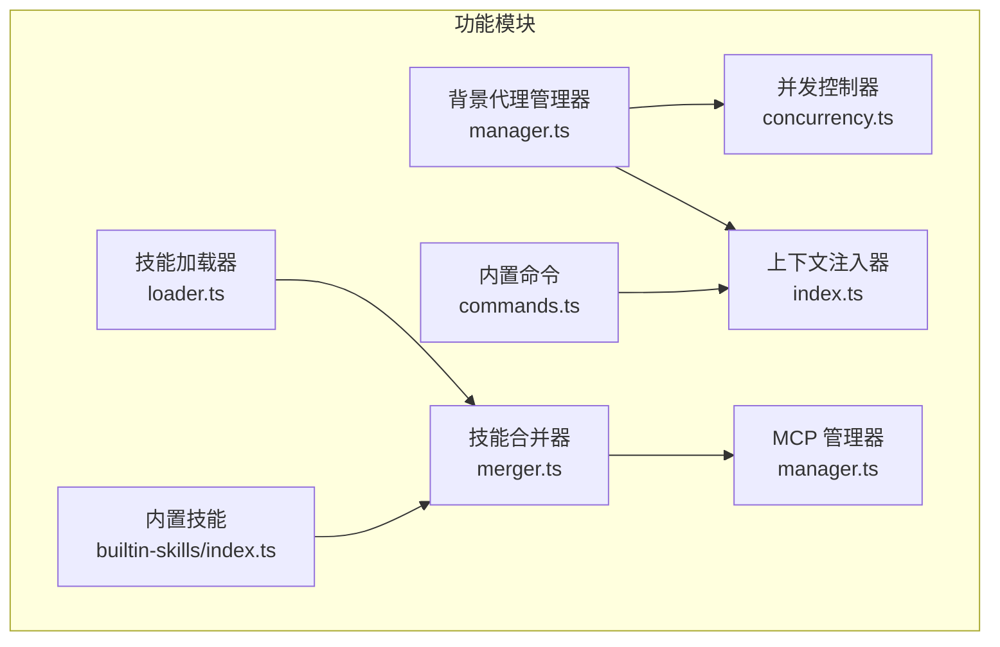
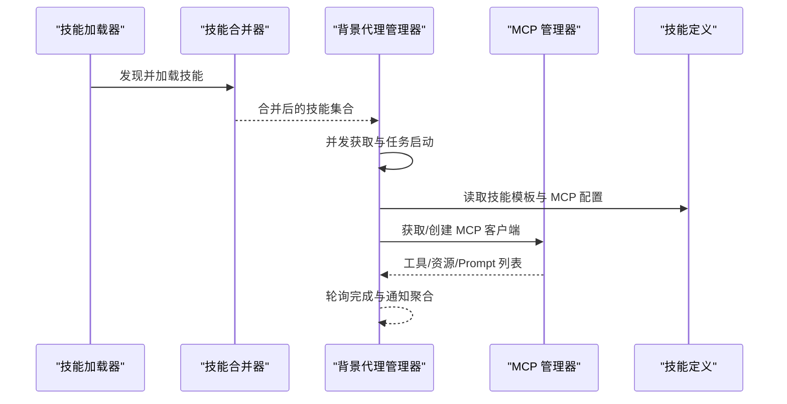
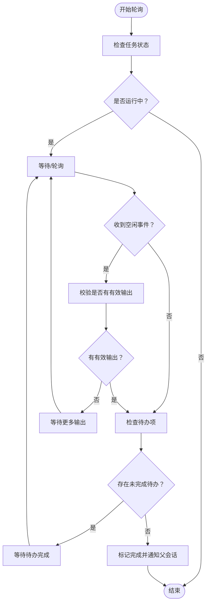
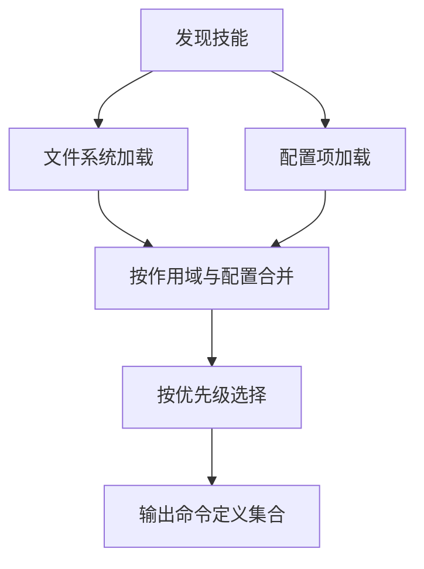
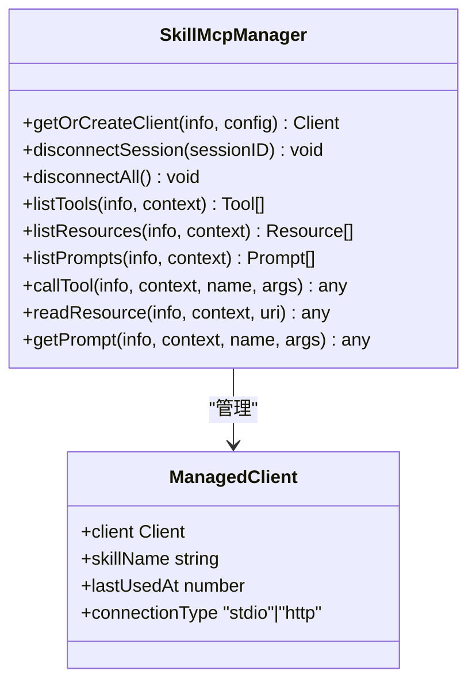
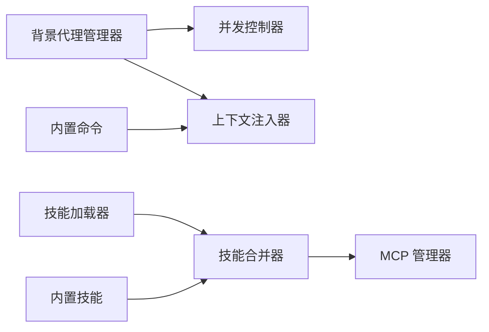

# 功能模块

<cite>
**本文引用的文件**
- [src/features/background-agent/index.ts](file://src/features/background-agent/index.ts)
- [src/features/background-agent/manager.ts](file://src/features/background-agent/manager.ts)
- [src/features/background-agent/concurrency.ts](file://src/features/background-agent/concurrency.ts)
- [src/features/opencode-skill-loader/index.ts](file://src/features/opencode-skill-loader/index.ts)
- [src/features/opencode-skill-loader/loader.ts](file://src/features/opencode-skill-loader/loader.ts)
- [src/features/opencode-skill-loader/merger.ts](file://src/features/opencode-skill-loader/merger.ts)
- [src/features/skill-mcp-manager/index.ts](file://src/features/skill-mcp-manager/index.ts)
- [src/features/skill-mcp-manager/manager.ts](file://src/features/skill-mcp-manager/manager.ts)
- [src/features/builtin-commands/index.ts](file://src/features/builtin-commands/index.ts)
- [src/features/builtin-commands/commands.ts](file://src/features/builtin-commands/commands.ts)
- [src/features/context-injector/index.ts](file://src/features/context-injector/index.ts)
- [src/features/builtin-skills/index.ts](file://src/features/builtin-skills/index.ts)
</cite>

## 目录
1. [简介](#简介)
2. [项目结构](#项目结构)
3. [核心组件](#核心组件)
4. [架构总览](#架构总览)
5. [详细组件分析](#详细组件分析)
6. [依赖关系分析](#依赖关系分析)
7. [性能考虑](#性能考虑)
8. [故障排查指南](#故障排查指南)
9. [结论](#结论)
10. [附录](#附录)

## 简介
本文件面向 Oh My OpenCode 的功能模块，系统性梳理以下能力：背景代理管理器（并发控制与任务调度）、技能加载系统（发现、加载与合并）、MCP 管理器（技能嵌入式 MCP 服务器接入）、内置命令系统、规则注入器与关键词检测器等。文档提供架构视图、数据流与处理逻辑说明，并给出配置要点、使用示例与性能优化建议。

## 项目结构
围绕“功能模块”的核心目录与文件如下：
- 背景代理管理器：负责后台会话生命周期、并发控制、轮询完成判定与通知聚合
- 技能加载系统：从多源路径发现、解析、加载技能定义，并与配置进行合并
- MCP 管理器：为技能提供 MCP 客户端连接、复用、重连与资源管理
- 内置命令系统：提供开箱即用的命令模板与参数提示
- 上下文注入器：在消息生成阶段收集上下文并按策略注入
- 规则注入器与关键词检测器：在会话中注入规则与检测特定关键词

**图表来源**
- [src/features/background-agent/manager.ts](file://src/features/background-agent/manager.ts#L52-L1166)
- [src/features/background-agent/concurrency.ts](file://src/features/background-agent/concurrency.ts#L15-L138)
- [src/features/opencode-skill-loader/loader.ts](file://src/features/opencode-skill-loader/loader.ts#L1-L260)
- [src/features/opencode-skill-loader/merger.ts](file://src/features/opencode-skill-loader/merger.ts#L1-L268)
- [src/features/skill-mcp-manager/manager.ts](file://src/features/skill-mcp-manager/manager.ts#L1-L521)
- [src/features/builtin-commands/commands.ts](file://src/features/builtin-commands/commands.ts#L1-L109)
- [src/features/context-injector/index.ts](file://src/features/context-injector/index.ts#L1-L15)
- [src/features/builtin-skills/index.ts](file://src/features/builtin-skills/index.ts#L1-L3)

**章节来源**
- [src/features/background-agent/index.ts](file://src/features/background-agent/index.ts#L1-L4)
- [src/features/opencode-skill-loader/index.ts](file://src/features/opencode-skill-loader/index.ts#L1-L5)
- [src/features/skill-mcp-manager/index.ts](file://src/features/skill-mcp-manager/index.ts#L1-L3)
- [src/features/builtin-commands/index.ts](file://src/features/builtin-commands/index.ts#L1-L3)
- [src/features/context-injector/index.ts](file://src/features/context-injector/index.ts#L1-L15)
- [src/features/builtin-skills/index.ts](file://src/features/builtin-skills/index.ts#L1-L3)

## 核心组件
- 背景代理管理器：统一管理后台子会话的启动、恢复、轮询、完成判定与通知聚合；通过并发控制器限制模型/提供商并发；对空闲事件进行稳定性校验，避免过早完成。
- 并发控制器：基于键（模型或提供商）的计数与队列，支持无限并发与取消等待者清理。
- 技能加载系统：从用户/项目/全局/内置等多源发现与加载技能，解析 Frontmatter 与 mcp.json，构建命令定义；随后与配置进行合并，支持启用/禁用与覆盖。
- MCP 管理器：为技能提供 MCP 客户端（HTTP/STDIO），连接复用、空闲清理、断线重连与操作重试；暴露工具/资源/Prompt 列表与调用接口。
- 内置命令系统：提供初始化、循环执行、重构、开始工作、状态查询、回滚等命令模板与参数提示。
- 上下文注入器：在消息生成前收集上下文并按优先级与策略注入，支持多种上下文类型与输出部件。
- 规则注入器与关键词检测器：在会话中注入规则与检测关键词，辅助自动化与合规检查。

**章节来源**
- [src/features/background-agent/manager.ts](file://src/features/background-agent/manager.ts#L52-L1166)
- [src/features/background-agent/concurrency.ts](file://src/features/background-agent/concurrency.ts#L15-L138)
- [src/features/opencode-skill-loader/loader.ts](file://src/features/opencode-skill-loader/loader.ts#L1-L260)
- [src/features/opencode-skill-loader/merger.ts](file://src/features/opencode-skill-loader/merger.ts#L1-L268)
- [src/features/skill-mcp-manager/manager.ts](file://src/features/skill-mcp-manager/manager.ts#L1-L521)
- [src/features/builtin-commands/commands.ts](file://src/features/builtin-commands/commands.ts#L1-L109)
- [src/features/context-injector/index.ts](file://src/features/context-injector/index.ts#L1-L15)

## 架构总览
下图展示从“技能加载”到“MCP 服务”的端到端流程，以及“背景代理管理器”对并发与任务生命周期的控制。

**图表来源**
- [src/features/opencode-skill-loader/loader.ts](file://src/features/opencode-skill-loader/loader.ts#L205-L260)
- [src/features/opencode-skill-loader/merger.ts](file://src/features/opencode-skill-loader/merger.ts#L187-L268)
- [src/features/background-agent/manager.ts](file://src/features/background-agent/manager.ts#L79-L217)
- [src/features/skill-mcp-manager/manager.ts](file://src/features/skill-mcp-manager/manager.ts#L112-L140)

## 详细组件分析

### 背景代理管理器（并发控制与任务调度）
- 关键职责
  - 启动/恢复后台任务：创建子会话、设置工具权限、触发一次提示以初始化代理循环。
  - 并发控制：按 agent 模型/提供商键获取并发许可，避免资源争用。
  - 任务轮询与完成判定：定时轮询运行中的任务，结合空闲事件、待办项与输出内容进行稳定完成判断。
  - 通知聚合：按父会话批量推送完成/失败通知，支持 Toast 提示。
  - 进程清理：注册信号处理器，确保退出时释放并发槽位并关闭会话。
- 并发控制机制
  - 基于模型/提供商的并发上限，超过阈值的任务进入队列等待；释放时优先移交下一个等待者，否则减少计数。
  - 支持取消等待者与清空状态，用于优雅关闭。
- 完成判定算法
  - 忽略过短空闲时间（早期空闲可能无输出）。
  - 校验会话是否已有助手/工具输出且具备实际内容（排除纯元信息）。
  - 若存在未完成待办，则延迟完成，直至待办完成。
- 通知与 UI
  - 通过任务 Toast 管理器显示完成状态与耗时。
  - 批量通知父会话，避免重复与遗漏。

**图表来源**
- [src/features/background-agent/manager.ts](file://src/features/background-agent/manager.ts#L444-L531)
- [src/features/background-agent/manager.ts](file://src/features/background-agent/manager.ts#L577-L631)

**章节来源**
- [src/features/background-agent/manager.ts](file://src/features/background-agent/manager.ts#L52-L1166)
- [src/features/background-agent/concurrency.ts](file://src/features/background-agent/concurrency.ts#L15-L138)

### 技能加载系统（发现、加载与合并）
- 发现与加载
  - 多源路径：用户技能、项目技能、全局/项目 OpenCode 技能、内置技能。
  - 文件识别：支持 SKILL.md 或与目录同名的 .md；解析 Frontmatter 与正文，提取元数据与模板。
  - MCP 配置：优先解析 Frontmatter 中的 mcp 字段，其次读取目录下的 mcp.json。
  - 命令定义：标准化为 CommandDefinition，包含名称、描述、模板、模型、代理、子任务与参数提示。
- 合并策略
  - 作用域优先级：builtin < config < user < opencode < project < opencode-project。
  - 配置覆盖：支持启用/禁用、按名称覆盖、允许工具列表合并、元数据深合并。
  - 文件系统技能：若新技能作用域更高，直接替换；相同作用域保留后者。
- 性能与一致性
  - 内容加载采用“预加载+惰性接口兼容”的模式，保证元数据与正文原子一致。

**图表来源**
- [src/features/opencode-skill-loader/loader.ts](file://src/features/opencode-skill-loader/loader.ts#L205-L260)
- [src/features/opencode-skill-loader/merger.ts](file://src/features/opencode-skill-loader/merger.ts#L187-L268)

**章节来源**
- [src/features/opencode-skill-loader/loader.ts](file://src/features/opencode-skill-loader/loader.ts#L1-L260)
- [src/features/opencode-skill-loader/merger.ts](file://src/features/opencode-skill-loader/merger.ts#L1-L268)

### MCP 管理器（技能嵌入式 MCP 服务器）
- 连接类型与选择
  - 显式类型优先：http/sse、stdio；否则根据是否存在 url/command 推断。
- 客户端创建
  - HTTP：基于 StreamableHTTPClientTransport，支持可选请求头；连接失败时关闭传输并抛出带上下文的错误。
  - STDIO：基于 StdioClientTransport，合并环境变量后启动本地进程；失败时关闭传输并抛出带上下文的错误。
- 生命周期管理
  - 连接复用：同一会话/技能/服务器键复用客户端实例。
  - 空闲清理：定期扫描并关闭超时未使用的客户端。
  - 断线重连：对“未连接”类错误进行有限次数重连；失败则抛出明确错误。
- 操作封装
  - 提供 listTools/listResources/listPrompts/callTool/readResource/getPrompt 等方法，内部统一封装重试与连接重建。

**图表来源**
- [src/features/skill-mcp-manager/manager.ts](file://src/features/skill-mcp-manager/manager.ts#L60-L521)

**章节来源**
- [src/features/skill-mcp-manager/manager.ts](file://src/features/skill-mcp-manager/manager.ts#L1-L521)

### 内置命令系统
- 组件导出：commands.ts 提供内置命令定义集合；index.ts 导出类型与加载函数。
- 命令覆盖：可通过禁用列表动态过滤；其余字段标准化为 OpenCode 兼容格式。
- 模板与参数：每个命令包含指令模板与参数提示，便于用户快速上手。

**章节来源**
- [src/features/builtin-commands/commands.ts](file://src/features/builtin-commands/commands.ts#L1-L109)
- [src/features/builtin-commands/index.ts](file://src/features/builtin-commands/index.ts#L1-L3)

### 规则注入器与关键词检测器（概念性说明）
- 规则注入器：在会话中注入规则，辅助行为约束与合规检查。
- 关键词检测器：检测用户输入或上下文中出现的特定关键词，触发相应动作或告警。
- 两者通常配合使用，形成“规则+触发”的自动化闭环。

[本节为概念性说明，不直接分析具体文件，故无章节来源]

## 依赖关系分析
- 背景代理管理器依赖并发控制器与上下文注入器；对外通过插件客户端驱动会话生命周期。
- 技能加载系统依赖文件系统与 Frontmatter 解析；合并器依赖深合并与配置归一化。
- MCP 管理器依赖外部 MCP 服务器（HTTP/STDIO），并维护连接池与空闲清理。
- 内置命令系统与内置技能共同构成默认可用的命令集，供合并器与加载器消费。

**图表来源**
- [src/features/background-agent/manager.ts](file://src/features/background-agent/manager.ts#L52-L1166)
- [src/features/background-agent/concurrency.ts](file://src/features/background-agent/concurrency.ts#L15-L138)
- [src/features/opencode-skill-loader/loader.ts](file://src/features/opencode-skill-loader/loader.ts#L1-L260)
- [src/features/opencode-skill-loader/merger.ts](file://src/features/opencode-skill-loader/merger.ts#L1-L268)
- [src/features/skill-mcp-manager/manager.ts](file://src/features/skill-mcp-manager/manager.ts#L1-L521)
- [src/features/builtin-commands/commands.ts](file://src/features/builtin-commands/commands.ts#L1-L109)
- [src/features/context-injector/index.ts](file://src/features/context-injector/index.ts#L1-L15)
- [src/features/builtin-skills/index.ts](file://src/features/builtin-skills/index.ts#L1-L3)

**章节来源**
- [src/features/background-agent/index.ts](file://src/features/background-agent/index.ts#L1-L4)
- [src/features/opencode-skill-loader/index.ts](file://src/features/opencode-skill-loader/index.ts#L1-L5)
- [src/features/skill-mcp-manager/index.ts](file://src/features/skill-mcp-manager/index.ts#L1-L3)
- [src/features/builtin-commands/index.ts](file://src/features/builtin-commands/index.ts#L1-L3)
- [src/features/context-injector/index.ts](file://src/features/context-injector/index.ts#L1-L15)
- [src/features/builtin-skills/index.ts](file://src/features/builtin-skills/index.ts#L1-L3)

## 性能考虑
- 并发控制
  - 为不同模型/提供商设置合理上限，避免过度并发导致资源争用；对无限并发场景谨慎使用。
  - 在任务完成前释放并发槽位，防止泄漏；清理等待队列与状态。
- 轮询与空闲判定
  - 轮询间隔与最小稳定时间应平衡响应速度与系统负载；避免过早完成导致的抖动。
  - 对空闲事件增加稳定性校验，减少无效完成。
- MCP 连接
  - 复用连接与空闲清理降低进程/连接数量；对“未连接”错误进行有限重试，避免频繁重建。
  - HTTP 连接可配置请求头，STDIO 连接合并环境变量，确保启动效率与隔离性。
- 技能加载
  - 预加载模板与内容，保证元数据与正文一致性；对大文件或远程资源访问进行缓存与降级策略。

[本节提供通用指导，不直接分析具体文件，故无章节来源]

## 故障排查指南
- 背景代理任务未完成
  - 检查空闲事件是否过早触发；确认会话存在有效输出（文本/推理/工具/工具结果）。
  - 查看待办项状态，确保未遗留未完成任务。
  - 关注并发控制器是否阻塞，必要时释放等待队列。
- MCP 连接失败
  - HTTP：核对 URL 与认证头；确认服务器可达且支持 MCP over HTTP。
  - STDIO：核对命令与参数；确认包已安装且在 PATH 中；检查环境变量合并。
  - 观察重试日志，定位“未连接”类错误的根因。
- 技能加载异常
  - 检查 Frontmatter 与 mcp.json 格式；确认文件存在且可读。
  - 核对作用域优先级与配置覆盖，确认最终生效的模板与元数据。

**章节来源**
- [src/features/background-agent/manager.ts](file://src/features/background-agent/manager.ts#L444-L531)
- [src/features/skill-mcp-manager/manager.ts](file://src/features/skill-mcp-manager/manager.ts#L169-L317)
- [src/features/opencode-skill-loader/loader.ts](file://src/features/opencode-skill-loader/loader.ts#L13-L51)

## 结论
Oh My OpenCode 的功能模块围绕“后台任务编排、技能生态与 MCP 服务集成”三大支柱展开。背景代理管理器通过并发控制与稳定完成判定保障后台任务的可靠性；技能加载系统提供多源发现与灵活合并，满足复杂场景下的定制需求；MCP 管理器为技能提供稳定的外部服务接入能力。内置命令与上下文注入器进一步提升用户体验与自动化水平。建议在生产环境中合理配置并发与轮询策略，完善 MCP 服务的可观测性与重试策略，并持续优化技能模板与规则注入策略。

[本节为总结性内容，不直接分析具体文件，故无章节来源]

## 附录
- 使用示例（概念性）
  - 启动后台任务：准备 agent/model/description/parentSessionID，调用启动接口；观察 Toast 与父会话通知。
  - 加载技能：确保 Frontmatter 与 mcp.json 正确；通过合并器查看最终生效的命令定义。
  - 注入规则与关键词：在会话中启用规则注入器与关键词检测器，观察触发动作。
- 配置选项（概念性）
  - 并发配置：模型/提供商/默认并发上限；无限并发场景需谨慎。
  - 轮询与稳定时间：根据任务特性调整空闲判定与最小运行时间。
  - MCP 连接：HTTP 的 URL/Headers；STDIO 的 command/args/env。

[本节为概念性说明，不直接分析具体文件，故无章节来源]