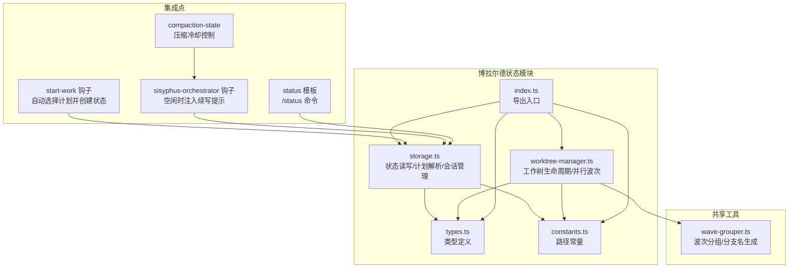
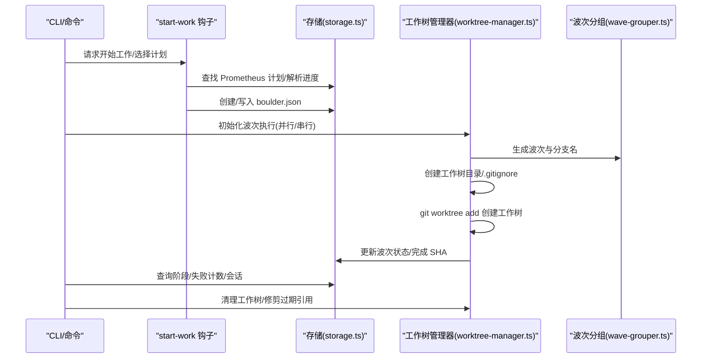
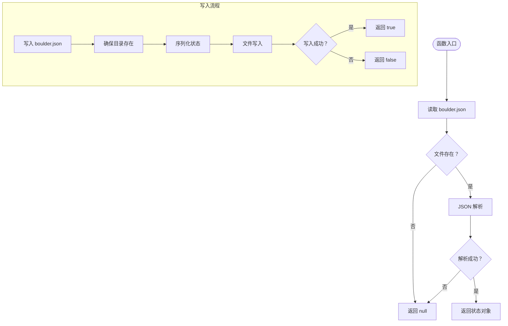
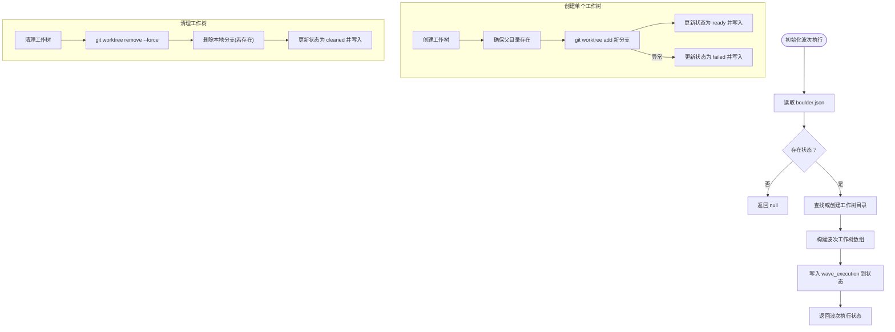
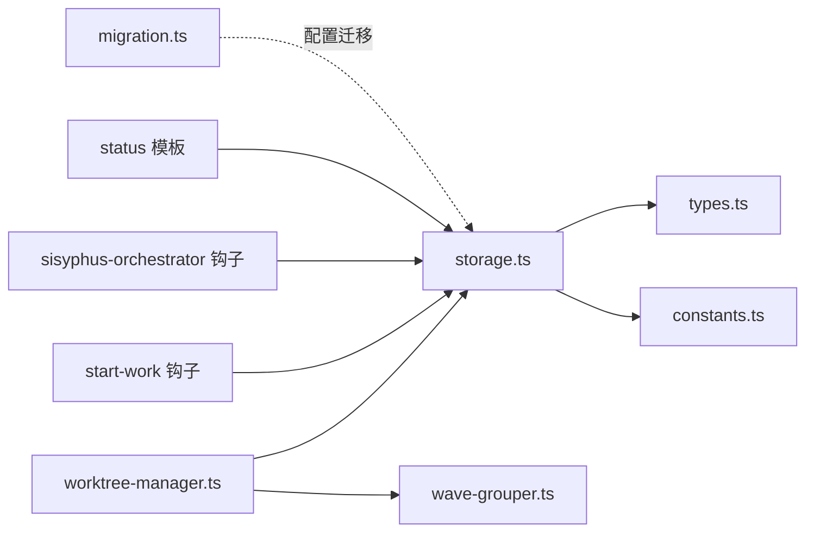

# 博拉尔德状态管理

<cite>
**本文引用的文件**
- [src/features/boulder-state/index.ts](file://src/features/boulder-state/index.ts)
- [src/features/boulder-state/storage.ts](file://src/features/boulder-state/storage.ts)
- [src/features/boulder-state/worktree-manager.ts](file://src/features/boulder-state/worktree-manager.ts)
- [src/features/boulder-state/types.ts](file://src/features/boulder-state/types.ts)
- [src/features/boulder-state/constants.ts](file://src/features/boulder-state/constants.ts)
- [src/features/boulder-state/storage.test.ts](file://src/features/boulder-state/storage.test.ts)
- [src/features/boulder-state/worktree-manager.test.ts](file://src/features/boulder-state/worktree-manager.test.ts)
- [src/shared/wave-grouper.ts](file://src/shared/wave-grouper.ts)
- [src/features/builtin-commands/templates/status.ts](file://src/features/builtin-commands/templates/status.ts)
- [src/hooks/start-work/index.ts](file://src/hooks/start-work/index.ts)
- [src/hooks/sisyphus-orchestrator/index.test.ts](file://src/hooks/sisyphus-orchestrator/index.test.ts)
- [src/hooks/compaction-state.ts](file://src/hooks/compaction-state.ts)
- [src/shared/migration.ts](file://src/shared/migration.ts)
</cite>

## 目录
1. [简介](#简介)
2. [项目结构](#项目结构)
3. [核心组件](#核心组件)
4. [架构总览](#架构总览)
5. [详细组件分析](#详细组件分析)
6. [依赖关系分析](#依赖关系分析)
7. [性能考虑](#性能考虑)
8. [故障排查指南](#故障排查指南)
9. [结论](#结论)
10. [附录](#附录)

## 简介
本文件系统性阐述 Oh My OpenCode 中“博拉尔德状态管理”（Boulder State）的设计与实现，覆盖以下关键主题：
- 状态存储机制：数据持久化、缓存策略与一致性保障
- 工作树管理器：Git 工作树的创建、切换与清理
- 状态同步与冲突解决：多实例间的状态协调
- 状态迁移、版本管理与备份恢复
- 配置选项、性能优化与故障排查
- 实际使用场景与最佳实践

博拉尔德状态以 Sisyphus 推石上山的巨石命名，用于跟踪当前执行计划、阶段状态、失败计数、会话历史以及并行波次（Wave）执行的工作树状态。

## 项目结构
博拉尔德状态相关代码位于 features/boulder-state 目录，采用按功能分层组织：
- 存储模块：负责 boulder.json 的读写、计划进度解析、会话记录等
- 工作树管理器：负责并行/串行模式下的工作树生命周期管理
- 类型定义与常量：统一的数据模型与路径约定
- 测试用例：覆盖存储与工作树管理的关键行为
- 集成点：与内置命令/status 模板、启动工作钩子、编排器钩子、压缩冷却状态等协作

图表来源
- [src/features/boulder-state/index.ts](file://src/features/boulder-state/index.ts#L1-L5)
- [src/features/boulder-state/storage.ts](file://src/features/boulder-state/storage.ts#L1-L308)
- [src/features/boulder-state/worktree-manager.ts](file://src/features/boulder-state/worktree-manager.ts#L1-L462)
- [src/features/boulder-state/types.ts](file://src/features/boulder-state/types.ts#L1-L109)
- [src/features/boulder-state/constants.ts](file://src/features/boulder-state/constants.ts#L1-L17)
- [src/shared/wave-grouper.ts](file://src/shared/wave-grouper.ts#L1-L146)
- [src/features/builtin-commands/templates/status.ts](file://src/features/builtin-commands/templates/status.ts#L1-L73)
- [src/hooks/start-work/index.ts](file://src/hooks/start-work/index.ts#L80-L120)
- [src/hooks/sisyphus-orchestrator/index.test.ts](file://src/hooks/sisyphus-orchestrator/index.test.ts#L625-L664)
- [src/hooks/compaction-state.ts](file://src/hooks/compaction-state.ts#L1-L48)

章节来源
- [src/features/boulder-state/index.ts](file://src/features/boulder-state/index.ts#L1-L5)
- [src/features/boulder-state/storage.ts](file://src/features/boulder-state/storage.ts#L1-L308)
- [src/features/boulder-state/worktree-manager.ts](file://src/features/boulder-state/worktree-manager.ts#L1-L462)
- [src/features/boulder-state/types.ts](file://src/features/boulder-state/types.ts#L1-L109)
- [src/features/boulder-state/constants.ts](file://src/features/boulder-state/constants.ts#L1-L17)

## 核心组件
- 状态存储（storage.ts）
  - 提供 boulder.json 的读取、写入、清空、会话追加、计划进度解析、计划查找等功能
  - 统一的文件路径由常量定义，确保跨平台兼容
- 工作树管理器（worktree-manager.ts）
  - 初始化波次执行状态，创建/清理工作树，更新状态与完成 SHA 记录
  - 支持并行与串行两种模式，维护工作树目录与 .gitignore 同步
- 类型与常量（types.ts、constants.ts）
  - 定义阶段状态、工作树状态、波次执行状态、波次工作树信息等
  - 定义 .sisyphus、.sisyphus/plans、changes 等路径常量
- 导出入口（index.ts）
  - 统一导出存储、工作树管理、类型与常量，便于上层模块按需引入

章节来源
- [src/features/boulder-state/storage.ts](file://src/features/boulder-state/storage.ts#L16-L307)
- [src/features/boulder-state/worktree-manager.ts](file://src/features/boulder-state/worktree-manager.ts#L21-L332)
- [src/features/boulder-state/types.ts](file://src/features/boulder-state/types.ts#L60-L99)
- [src/features/boulder-state/constants.ts](file://src/features/boulder-state/constants.ts#L5-L17)
- [src/features/boulder-state/index.ts](file://src/features/boulder-state/index.ts#L1-L5)

## 架构总览
博拉尔德状态管理通过单一的 boulder.json 文件作为持久化介质，贯穿计划选择、阶段推进、失败计数、并行波次执行与工作树生命周期管理。工作树管理器与波次分组工具协同，确保任务在不同工作树上的隔离执行，并通过状态文件进行跨进程/多实例协调。

图表来源
- [src/hooks/start-work/index.ts](file://src/hooks/start-work/index.ts#L80-L120)
- [src/features/boulder-state/storage.ts](file://src/features/boulder-state/storage.ts#L16-L307)
- [src/features/boulder-state/worktree-manager.ts](file://src/features/boulder-state/worktree-manager.ts#L21-L332)
- [src/shared/wave-grouper.ts](file://src/shared/wave-grouper.ts#L41-L43)

## 详细组件分析

### 状态存储模块（storage.ts）
职责与能力
- boulder.json 读写：自动创建目录、序列化/反序列化、异常兜底返回 null
- 会话管理：向 session_ids 追加唯一会话标识，避免重复
- 计划进度解析：从 .sisyphus/plans 或 legacy changes 目录中解析任务勾选状态
- 阶段与失败管理：更新阶段状态、递增失败计数、重置失败计数
- 完成标记：将 active_plan 清空并标记 completed，防止重复触发

关键流程示意

图表来源
- [src/features/boulder-state/storage.ts](file://src/features/boulder-state/storage.ts#L16-L45)

章节来源
- [src/features/boulder-state/storage.ts](file://src/features/boulder-state/storage.ts#L16-L307)
- [src/features/boulder-state/storage.test.ts](file://src/features/boulder-state/storage.test.ts#L37-L251)

### 工作树管理器（worktree-manager.ts）
职责与能力
- 初始化波次执行：根据波次列表生成工作树路径与分支名，写入 boulder.json 的 wave_execution 字段
- 工作树目录管理：优先 .worktrees，其次 worktrees；确保 .gitignore 包含工作树目录
- 工作树生命周期：创建、状态更新、任务完成 SHA 记录、清理、修剪
- 执行摘要与活跃状态：统计各状态数量、判断是否仍有未完成工作树

关键流程示意

图表来源
- [src/features/boulder-state/worktree-manager.ts](file://src/features/boulder-state/worktree-manager.ts#L21-L332)

章节来源
- [src/features/boulder-state/worktree-manager.ts](file://src/features/boulder-state/worktree-manager.ts#L21-L462)
- [src/features/boulder-state/worktree-manager.test.ts](file://src/features/boulder-state/worktree-manager.test.ts#L99-L431)

### 类型与常量（types.ts、constants.ts）
- 类型定义：PhaseStatus、WorktreeStatus、WaveWorktree、WaveExecutionState、BoulderState、PlanProgress
- 常量定义：.sisyphus、boulder.json、.sisyphus/plans、changes 等路径常量

章节来源
- [src/features/boulder-state/types.ts](file://src/features/boulder-state/types.ts#L11-L99)
- [src/features/boulder-state/constants.ts](file://src/features/boulder-state/constants.ts#L5-L17)

### 波次分组工具（wave-grouper.ts）
- 将任务按文件冲突与依赖关系分组为多个波次，生成每波的任务集合与分支名
- 提供分支名生成函数，支持 feature/{featureName}-wave{waveId}

章节来源
- [src/shared/wave-grouper.ts](file://src/shared/wave-grouper.ts#L41-L133)

### 集成点与使用场景
- /status 命令模板：展示当前变更名称、任务进度、最近提交 SHA、当前工作树分支
- start-work 钩子：自动选择 Prometheus 计划并创建 boulder.json
- sisyphus-orchestrator 钩子：在空闲时注入续写提示，基于 boulder.json 的存在与否决定是否注入
- compaction-state：压缩后冷却时间控制，避免在冷却期内触发续写

章节来源
- [src/features/builtin-commands/templates/status.ts](file://src/features/builtin-commands/templates/status.ts#L1-L73)
- [src/hooks/start-work/index.ts](file://src/hooks/start-work/index.ts#L80-L120)
- [src/hooks/sisyphus-orchestrator/index.test.ts](file://src/hooks/sisyphus-orchestrator/index.test.ts#L625-L664)
- [src/hooks/compaction-state.ts](file://src/hooks/compaction-state.ts#L1-L48)

## 依赖关系分析
- 存储模块依赖类型与常量，提供读写、计划解析、阶段与失败管理
- 工作树管理器依赖存储模块读写状态、依赖波次分组工具生成分支名
- 集成点通过存储模块读取状态，驱动命令与钩子的行为
- 共享迁移模块提供配置迁移能力，间接影响状态文件的兼容性

图表来源
- [src/features/boulder-state/storage.ts](file://src/features/boulder-state/storage.ts#L1-L308)
- [src/features/boulder-state/worktree-manager.ts](file://src/features/boulder-state/worktree-manager.ts#L1-L462)
- [src/features/boulder-state/types.ts](file://src/features/boulder-state/types.ts#L1-L109)
- [src/features/boulder-state/constants.ts](file://src/features/boulder-state/constants.ts#L1-L17)
- [src/shared/wave-grouper.ts](file://src/shared/wave-grouper.ts#L1-L146)
- [src/hooks/start-work/index.ts](file://src/hooks/start-work/index.ts#L80-L120)
- [src/hooks/sisyphus-orchestrator/index.test.ts](file://src/hooks/sisyphus-orchestrator/index.test.ts#L625-L664)
- [src/features/builtin-commands/templates/status.ts](file://src/features/builtin-commands/templates/status.ts#L1-L73)
- [src/shared/migration.ts](file://src/shared/migration.ts#L125-L166)

章节来源
- [src/features/boulder-state/storage.ts](file://src/features/boulder-state/storage.ts#L1-L308)
- [src/features/boulder-state/worktree-manager.ts](file://src/features/boulder-state/worktree-manager.ts#L1-L462)
- [src/shared/migration.ts](file://src/shared/migration.ts#L125-L166)

## 性能考虑
- 文件 I/O 成本控制
  - 仅在必要时写入 boulder.json，批量更新后再落盘
  - 使用统一的 ensure 目录逻辑，避免重复创建目录
- 并行工作树
  - 并行模式下并发创建工作树，但注意磁盘与 Git 资源竞争
  - 建议在资源受限环境使用串行模式，降低 I/O 压力
- 计划解析
  - 计划进度解析仅扫描 Markdown 内容，复杂度与文件大小线性相关
  - 对大型计划文件可考虑缓存解析结果或增量解析
- 状态查询
  - 读取 boulder.json 为轻量操作，建议在高频查询场景中缓存最近一次读取结果

## 故障排查指南
常见问题与定位方法
- boulder.json 无法读取/写入
  - 检查 .sisyphus 目录权限与磁盘空间
  - 确认路径常量与项目根目录一致
- 工作树创建失败
  - 检查 Git 版本与权限，确认分支名不冲突
  - 查看状态中的 error 字段与错误消息
- 计划进度解析异常
  - 检查计划文件格式，确保使用标准 Markdown 列表语法
  - 确认文件编码为 UTF-8
- 多实例状态不一致
  - 确保同一时刻只有一个实例写入 boulder.json
  - 在高并发场景下，建议增加外部锁或采用顺序化写入策略
- 清理后残留引用
  - 使用 pruneWorktrees 清理过期引用
  - 手动检查 .gitignore 是否包含工作树目录

章节来源
- [src/features/boulder-state/storage.ts](file://src/features/boulder-state/storage.ts#L16-L45)
- [src/features/boulder-state/worktree-manager.ts](file://src/features/boulder-state/worktree-manager.ts#L114-L167)
- [src/features/boulder-state/worktree-manager.ts](file://src/features/boulder-state/worktree-manager.ts#L252-L298)

## 结论
博拉尔德状态管理通过简洁的 boulder.json 持久化与清晰的阶段/失败管理，实现了对开发计划的全生命周期跟踪。结合工作树管理器，系统能够在并行/串行模式下高效地隔离任务执行，并通过状态文件实现多实例间的协调。配合 /status 命令与钩子集成，用户可以直观地掌握执行进度与工作树状态。未来可在高并发写入、大型计划解析与工作树资源调度方面进一步优化。

## 附录

### 配置选项与最佳实践
- 配置项
  - 工作树目录：优先 .worktrees，其次 worktrees；确保 .gitignore 包含该目录
  - 波次模式：并行模式提升吞吐，串行模式降低资源占用
  - 计划来源：优先 .sisyphus/plans，兼容 legacy changes 目录
- 最佳实践
  - 在团队协作中，尽量避免同时修改同一计划文件
  - 并行执行时，合理划分波次，减少文件冲突
  - 定期清理已完成的工作树，释放磁盘空间
  - 使用 /status 命令定期检查执行状态，及时发现异常

章节来源
- [src/features/boulder-state/constants.ts](file://src/features/boulder-state/constants.ts#L5-L17)
- [src/features/boulder-state/worktree-manager.ts](file://src/features/boulder-state/worktree-manager.ts#L62-L82)
- [src/features/builtin-commands/templates/status.ts](file://src/features/builtin-commands/templates/status.ts#L1-L73)

### 状态迁移、版本管理与备份恢复
- 迁移与兼容
  - 通过迁移模块对旧配置键进行映射与升级，写入新键并保留备份
- 备份与恢复
  - 迁移写入前自动备份原配置文件，便于回滚
  - 建议手动备份 boulder.json 重要节点，防止误操作导致丢失

章节来源
- [src/shared/migration.ts](file://src/shared/migration.ts#L125-L166)