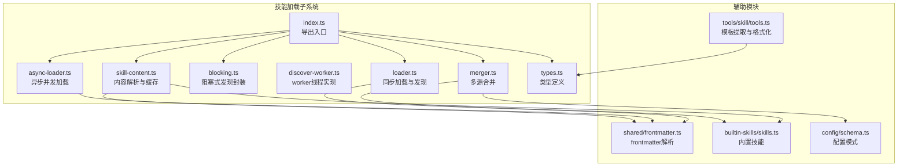
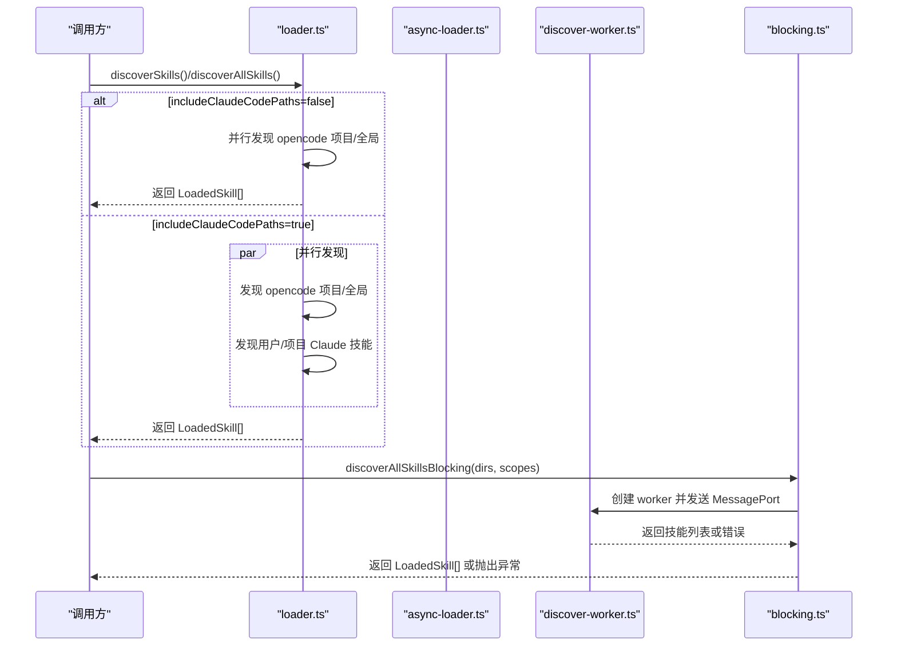
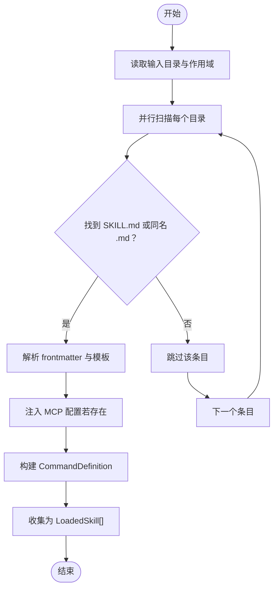
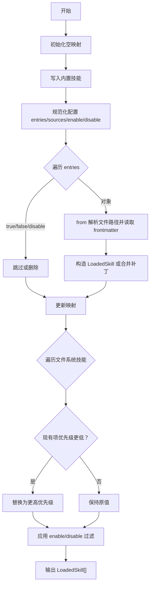
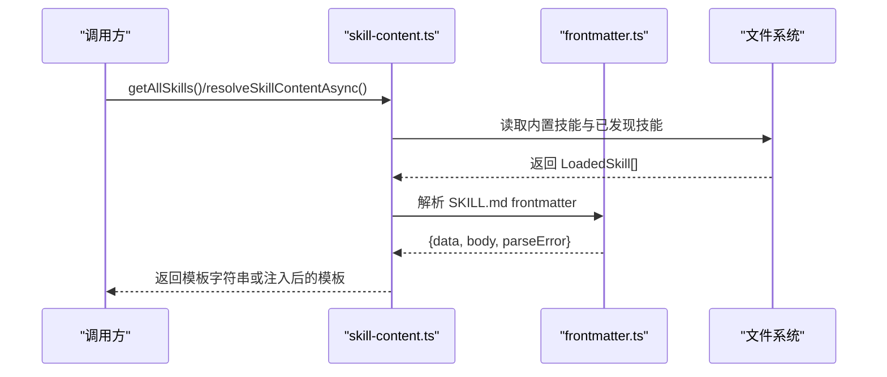
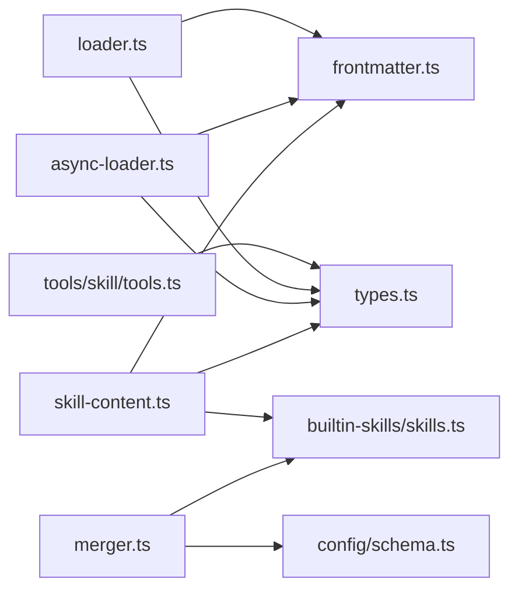

# 技能加载系统

<cite>
**本文引用的文件**
- [src/features/opencode-skill-loader/index.ts](file://src/features/opencode-skill-loader/index.ts)
- [src/features/opencode-skill-loader/discover-worker.ts](file://src/features/opencode-skill-loader/discover-worker.ts)
- [src/features/opencode-skill-loader/loader.ts](file://src/features/opencode-skill-loader/loader.ts)
- [src/features/opencode-skill-loader/async-loader.ts](file://src/features/opencode-skill-loader/async-loader.ts)
- [src/features/opencode-skill-loader/blocking.ts](file://src/features/opencode-skill-loader/blocking.ts)
- [src/features/opencode-skill-loader/merger.ts](file://src/features/opencode-skill-loader/merger.ts)
- [src/features/opencode-skill-loader/skill-content.ts](file://src/features/opencode-skill-loader/skill-content.ts)
- [src/features/opencode-skill-loader/types.ts](file://src/features/opencode-skill-loader/types.ts)
- [src/features/builtin-skills/skills.ts](file://src/features/builtin-skills/skills.ts)
- [src/features/builtin-skills/types.ts](file://src/features/builtin-skills/types.ts)
- [src/shared/frontmatter.ts](file://src/shared/frontmatter.ts)
- [src/tools/skill/tools.ts](file://src/tools/skill/tools.ts)
- [src/config/schema.ts](file://src/config/schema.ts)
</cite>

## 目录
1. [简介](#简介)
2. [项目结构](#项目结构)
3. [核心组件](#核心组件)
4. [架构总览](#架构总览)
5. [详细组件分析](#详细组件分析)
6. [依赖分析](#依赖分析)
7. [性能考虑](#性能考虑)
8. [故障排查指南](#故障排查指南)
9. [结论](#结论)
10. [附录](#附录)

## 简介
本文件系统性阐述 Oh My OpenCode 的“技能加载系统”，覆盖以下关键主题：
- 技能发现机制：discover-worker 如何扫描与识别可用技能
- 异步加载器与阻塞加载器：不同实现方式及适用场景
- 技能内容合并器：多来源技能定义的合并策略
- 技能内容解析、验证与缓存机制
- 技能加载生命周期管理：加载优先级、依赖关系处理与错误恢复
- 技能开发规范、最佳实践与调试技巧
- 配置选项说明与性能优化建议

## 项目结构
技能加载系统主要位于 src/features/opencode-skill-loader 目录，围绕“发现、加载、合并、解析、缓存”五大阶段组织代码，并与内置技能、前端元数据解析、工具层进行协作。

图表来源
- [src/features/opencode-skill-loader/index.ts](file://src/features/opencode-skill-loader/index.ts#L1-L5)
- [src/features/opencode-skill-loader/loader.ts](file://src/features/opencode-skill-loader/loader.ts#L1-L260)
- [src/features/opencode-skill-loader/async-loader.ts](file://src/features/opencode-skill-loader/async-loader.ts#L1-L181)
- [src/features/opencode-skill-loader/blocking.ts](file://src/features/opencode-skill-loader/blocking.ts#L1-L63)
- [src/features/opencode-skill-loader/discover-worker.ts](file://src/features/opencode-skill-loader/discover-worker.ts#L1-L60)
- [src/features/opencode-skill-loader/merger.ts](file://src/features/opencode-skill-loader/merger.ts#L1-L268)
- [src/features/opencode-skill-loader/skill-content.ts](file://src/features/opencode-skill-loader/skill-content.ts#L1-L207)
- [src/features/opencode-skill-loader/types.ts](file://src/features/opencode-skill-loader/types.ts#L1-L39)
- [src/shared/frontmatter.ts](file://src/shared/frontmatter.ts#L1-L32)
- [src/features/builtin-skills/skills.ts](file://src/features/builtin-skills/skills.ts#L1-L800)
- [src/config/schema.ts](file://src/config/schema.ts#L1-L200)
- [src/tools/skill/tools.ts](file://src/tools/skill/tools.ts#L30-L70)

章节来源
- [src/features/opencode-skill-loader/index.ts](file://src/features/opencode-skill-loader/index.ts#L1-L5)

## 核心组件
- 发现与加载
  - 同步加载器：负责从用户、项目、全局等目录读取技能文件，解析 frontmatter，生成命令定义与 MCP 配置
  - 异步加载器：以并发方式遍历目录，提升大规模技能库的加载效率
  - 阻塞加载器：基于 worker_threads 的阻塞式封装，带超时与信号通知
  - discover-worker：worker 线程实现，接收父线程指令，完成批量技能发现并返回结果
- 合并器
  - 将内置技能、配置注入技能、文件系统技能按作用域优先级合并，支持启用/禁用与增量补丁
- 内容解析与缓存
  - 统一解析技能模板，支持从文件或已加载对象提取；提供缓存与清理能力；针对特定技能（如 git-master）注入额外内容
- 类型系统
  - 定义技能范围、元数据、延迟内容加载器、已加载技能等核心类型

章节来源
- [src/features/opencode-skill-loader/loader.ts](file://src/features/opencode-skill-loader/loader.ts#L124-L260)
- [src/features/opencode-skill-loader/async-loader.ts](file://src/features/opencode-skill-loader/async-loader.ts#L136-L181)
- [src/features/opencode-skill-loader/blocking.ts](file://src/features/opencode-skill-loader/blocking.ts#L23-L63)
- [src/features/opencode-skill-loader/discover-worker.ts](file://src/features/opencode-skill-loader/discover-worker.ts#L29-L59)
- [src/features/opencode-skill-loader/merger.ts](file://src/features/opencode-skill-loader/merger.ts#L12-L268)
- [src/features/opencode-skill-loader/skill-content.ts](file://src/features/opencode-skill-loader/skill-content.ts#L12-L60)
- [src/features/opencode-skill-loader/types.ts](file://src/features/opencode-skill-loader/types.ts#L4-L39)

## 架构总览
技能加载系统采用“分层 + 并发”的设计：
- 展示层：CLI 或上层调用者通过 discoverSkills/discoverAllSkills 获取技能清单
- 发现层：loader 提供同步发现；async-loader 提供并发发现；blocking 封装 worker 并提供阻塞接口
- 合并层：merger 按作用域优先级与配置规则合并多源技能
- 解析层：skill-content 统一解析模板，提供缓存与注入能力
- 工具层：tools/skill 提供模板提取、MCP 能力格式化等

图表来源
- [src/features/opencode-skill-loader/loader.ts](file://src/features/opencode-skill-loader/loader.ts#L205-L234)
- [src/features/opencode-skill-loader/async-loader.ts](file://src/features/opencode-skill-loader/async-loader.ts#L136-L181)
- [src/features/opencode-skill-loader/discover-worker.ts](file://src/features/opencode-skill-loader/discover-worker.ts#L29-L59)
- [src/features/opencode-skill-loader/blocking.ts](file://src/features/opencode-skill-loader/blocking.ts#L23-L63)

## 详细组件分析

### 发现与加载机制
- 同步加载器（loader.ts）
  - 支持从用户、项目、全局等目录扫描技能，自动识别 SKILL.md 或与目录同名的 .md 文件
  - 解析 frontmatter，提取元数据与模板正文，生成 CommandDefinition
  - 支持从 SKILL.md 前言段落或目录下的 mcp.json 注入 MCP 配置
  - 将技能转换为记录结构，便于后续检索
- 异步加载器（async-loader.ts）
  - 使用并发映射函数限制并发度，避免资源争用
  - 对每个条目并行判断目录/符号链接/Markdown 文件，定位 SKILL.md 或同名 .md
  - 与同步版本相同的解析逻辑，但具备更强的吞吐能力
- 阻塞加载器（blocking.ts）
  - 基于 worker_threads，通过共享信号与 MessagePort 实现阻塞等待
  - 设置超时时间，超时后终止 worker 并抛出异常
- discover-worker（discover-worker.ts）
  - 接收父线程输入的目录与作用域数组
  - 并行调用 discoverSkillsInDirAsync 扫描各目录，聚合结果并通过端口回传

图表来源
- [src/features/opencode-skill-loader/async-loader.ts](file://src/features/opencode-skill-loader/async-loader.ts#L136-L181)
- [src/features/opencode-skill-loader/loader.ts](file://src/features/opencode-skill-loader/loader.ts#L124-L166)

章节来源
- [src/features/opencode-skill-loader/loader.ts](file://src/features/opencode-skill-loader/loader.ts#L124-L260)
- [src/features/opencode-skill-loader/async-loader.ts](file://src/features/opencode-skill-loader/async-loader.ts#L12-L31)
- [src/features/opencode-skill-loader/async-loader.ts](file://src/features/opencode-skill-loader/async-loader.ts#L136-L181)
- [src/features/opencode-skill-loader/blocking.ts](file://src/features/opencode-skill-loader/blocking.ts#L23-L63)
- [src/features/opencode-skill-loader/discover-worker.ts](file://src/features/opencode-skill-loader/discover-worker.ts#L29-L59)

### 异步加载器与阻塞加载器
- 异步加载器（async-loader）
  - mapWithConcurrency 控制并发度，避免 IO 抖动
  - discoverSkillsInDirAsync 处理目录不存在等边界情况，返回空数组而非抛错
- 阻塞加载器（blocking）
  - discoverAllSkillsBlocking 通过 SharedArrayBuffer + Atomics.wait 实现阻塞等待
  - 超时控制与错误透传，确保调用方可感知 worker 异常

适用场景
- 异步加载器：大规模技能库、后台扫描、批量导入
- 阻塞加载器：需要在主线程同步等待结果的场景，如 CLI 初始化阶段

章节来源
- [src/features/opencode-skill-loader/async-loader.ts](file://src/features/opencode-skill-loader/async-loader.ts#L12-L31)
- [src/features/opencode-skill-loader/async-loader.ts](file://src/features/opencode-skill-loader/async-loader.ts#L174-L181)
- [src/features/opencode-skill-loader/blocking.ts](file://src/features/opencode-skill-loader/blocking.ts#L21-L63)

### 技能内容合并器
- 作用域优先级：builtin > config > user > opencode > project > opencode-project
- 合并策略
  - 内置技能：直接转换为 LoadedSkill 加入映射
  - 配置注入技能：支持 from 文件路径与内联 template，解析元数据并注入
  - 文件系统技能：按作用域优先级覆盖或保留
  - 启用/禁用：支持 enable/disable 列表与 entries 中的布尔/对象值
  - 增量补丁：对已有技能进行元数据与字段的深度合并
- 路径解析：支持 ~、绝对路径与相对路径，结合配置目录解析

图表来源
- [src/features/opencode-skill-loader/merger.ts](file://src/features/opencode-skill-loader/merger.ts#L12-L19)
- [src/features/opencode-skill-loader/merger.ts](file://src/features/opencode-skill-loader/merger.ts#L187-L268)

章节来源
- [src/features/opencode-skill-loader/merger.ts](file://src/features/opencode-skill-loader/merger.ts#L12-L268)
- [src/config/schema.ts](file://src/config/schema.ts#L1-L200)

### 技能内容解析、验证与缓存
- 内容解析
  - 从 LoadedSkill.path 读取文件，使用 frontmatter 解析器分离元数据与正文
  - 未提供 path 的技能，直接使用 definition.template
- 验证
  - frontmatter 解析失败时返回空，避免污染后续流程
  - mcp.json 与 frontmatter 的 mcp 字段互为补充，优先使用目录中的 mcp.json
- 缓存
  - skill-content 提供内存缓存，首次加载后复用
  - 提供 clearSkillCache 清理缓存的能力
- 特殊注入
  - git-master 模板注入提交信息与 co-authored-by 指令

图表来源
- [src/features/opencode-skill-loader/skill-content.ts](file://src/features/opencode-skill-loader/skill-content.ts#L18-L60)
- [src/shared/frontmatter.ts](file://src/shared/frontmatter.ts#L10-L32)

章节来源
- [src/features/opencode-skill-loader/skill-content.ts](file://src/features/opencode-skill-loader/skill-content.ts#L12-L60)
- [src/shared/frontmatter.ts](file://src/shared/frontmatter.ts#L10-L32)

### 技能加载生命周期管理
- 生命周期阶段
  - 发现：按目录与作用域扫描，解析 frontmatter 与模板
  - 合并：依据优先级与配置规则合并多源技能
  - 解析：提取模板正文，注入必要内容
  - 缓存：建立内存缓存，减少重复 IO
- 依赖关系
  - 合并器依赖配置模式与内置技能定义
  - 解析器依赖 frontmatter 解析器
  - worker 与阻塞封装依赖 worker_threads 与共享信号
- 错误恢复
  - 目录不存在或权限不足时返回空集合
  - frontmatter 解析失败时跳过该项
  - worker 超时终止并抛出异常，调用方可选择重试或降级

章节来源
- [src/features/opencode-skill-loader/async-loader.ts](file://src/features/opencode-skill-loader/async-loader.ts#L174-L181)
- [src/features/opencode-skill-loader/blocking.ts](file://src/features/opencode-skill-loader/blocking.ts#L36-L62)
- [src/features/opencode-skill-loader/merger.ts](file://src/features/opencode-skill-loader/merger.ts#L187-L268)

## 依赖分析
- 组件耦合
  - loader 与 async-loader 共享 frontmatter 解析与模板包装逻辑
  - merger 依赖配置模式与内置技能类型
  - skill-content 依赖内置技能与 frontmatter 解析
  - tools/skill 依赖 LoadedSkill 类型与 lazyContent 接口
- 外部依赖
  - js-yaml 用于 frontmatter 解析
  - worker_threads 用于阻塞封装
  - node:fs 与 path 用于文件系统操作

图表来源
- [src/features/opencode-skill-loader/loader.ts](file://src/features/opencode-skill-loader/loader.ts#L1-L12)
- [src/features/opencode-skill-loader/async-loader.ts](file://src/features/opencode-skill-loader/async-loader.ts#L1-L10)
- [src/features/opencode-skill-loader/skill-content.ts](file://src/features/opencode-skill-loader/skill-content.ts#L1-L6)
- [src/features/opencode-skill-loader/merger.ts](file://src/features/opencode-skill-loader/merger.ts#L1-L10)
- [src/tools/skill/tools.ts](file://src/tools/skill/tools.ts#L1-L7)

章节来源
- [src/features/opencode-skill-loader/loader.ts](file://src/features/opencode-skill-loader/loader.ts#L1-L12)
- [src/features/opencode-skill-loader/async-loader.ts](file://src/features/opencode-skill-loader/async-loader.ts#L1-L10)
- [src/features/opencode-skill-loader/merger.ts](file://src/features/opencode-skill-loader/merger.ts#L1-L10)
- [src/tools/skill/tools.ts](file://src/tools/skill/tools.ts#L1-L7)

## 性能考虑
- 并发控制
  - 使用 mapWithConcurrency 限制并发度，避免磁盘与 CPU 资源争用
  - 在大规模目录中建议根据磁盘 IOPS 与 CPU 核数调整并发度
- 缓存策略
  - skill-content 的内存缓存显著降低重复读取成本
  - 建议在长时间运行的服务中定期调用 clearSkillCache 以释放内存
- I/O 优化
  - 优先使用异步 API（async-loader），避免阻塞主线程
  - 对于小规模、低频场景可使用阻塞封装简化调用
- 错误短路
  - 目录不存在或权限不足时快速返回空集合，减少无效尝试

[本节为通用性能建议，不直接分析具体文件]

## 故障排查指南
- 常见问题
  - 技能未被发现：确认 SKILL.md 或同名 .md 是否存在；检查目录权限
  - frontmatter 解析失败：检查 YAML 语法与 JSON_SCHEMA 限制
  - worker 超时：增大超时时间或降低并发度；检查磁盘性能
  - 合并冲突：检查配置 entries 中的 enable/disable 与布尔值语义
- 调试技巧
  - 使用异步加载器的并发映射测试用例思路，验证并发度与边界条件
  - 在 tools/skill 中提取模板正文，定位模板片段问题
  - 通过 clearSkillCache 清理缓存，排除缓存干扰

章节来源
- [src/features/opencode-skill-loader/async-loader.test.ts](file://src/features/opencode-skill-loader/async-loader.test.ts#L286-L332)
- [src/tools/skill/tools.ts](file://src/tools/skill/tools.ts#L43-L56)
- [src/features/opencode-skill-loader/blocking.ts](file://src/features/opencode-skill-loader/blocking.ts#L36-L62)

## 结论
Oh My OpenCode 的技能加载系统通过“同步/异步发现 + worker 封装 + 多源合并 + 模板解析与缓存”的完整链路，实现了高扩展、高性能且易维护的技能体系。开发者可根据场景选择合适的加载方式，并遵循合并器的优先级与配置规则，确保技能定义的一致性与可控性。

[本节为总结性内容，不直接分析具体文件]

## 附录

### 技能开发规范与最佳实践
- 文件命名与结构
  - 技能根目录下放置 SKILL.md；或与目录同名的 .md 文件
  - frontmatter 包含 name/description/agent/subtask/argument-hint 等元数据
- 模板编写
  - 使用标准 frontmatter 分隔正文；正文作为技能模板主体
  - 可选地在目录下提供 mcp.json 注入 MCP 服务器配置
- 合并与覆盖
  - 通过配置 entries 对已有技能进行增量补丁
  - 使用 enable/disable 精细控制技能集合
- 缓存与性能
  - 避免频繁重载同一技能；利用缓存减少 IO
  - 大规模扫描时优先使用异步并发加载

章节来源
- [src/features/opencode-skill-loader/loader.ts](file://src/features/opencode-skill-loader/loader.ts#L58-L122)
- [src/features/opencode-skill-loader/async-loader.ts](file://src/features/opencode-skill-loader/async-loader.ts#L73-L129)
- [src/features/opencode-skill-loader/merger.ts](file://src/features/opencode-skill-loader/merger.ts#L187-L268)
- [src/shared/frontmatter.ts](file://src/shared/frontmatter.ts#L10-L32)

### 配置选项说明（与技能加载相关）
- 配置模式（config/schema.ts）
  - skills 配置支持数组、对象形式，entries 中可为布尔或对象
  - sources 支持路径、递归与 glob 形式
  - enable/disable 控制技能启用/禁用
- 内置技能（builtin-skills/skills.ts）
  - 内置技能提供默认模板与 MCP 配置
  - 合并器按优先级覆盖用户/项目技能

章节来源
- [src/config/schema.ts](file://src/config/schema.ts#L1-L200)
- [src/features/builtin-skills/skills.ts](file://src/features/builtin-skills/skills.ts#L1-L800)