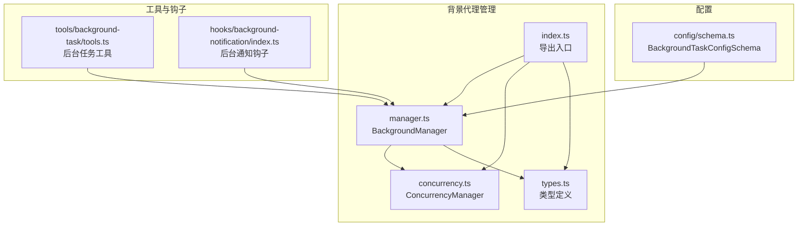
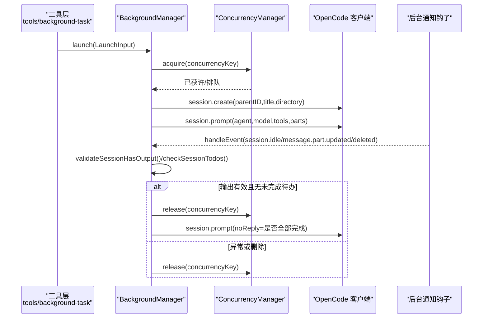
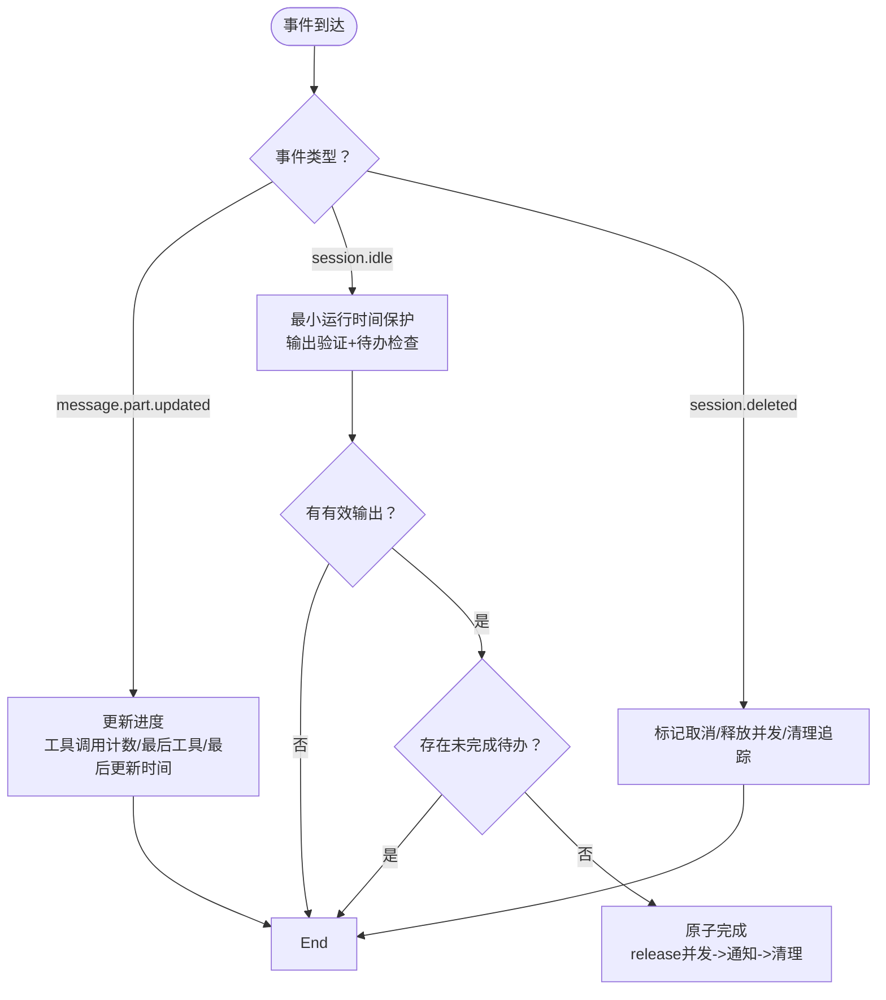
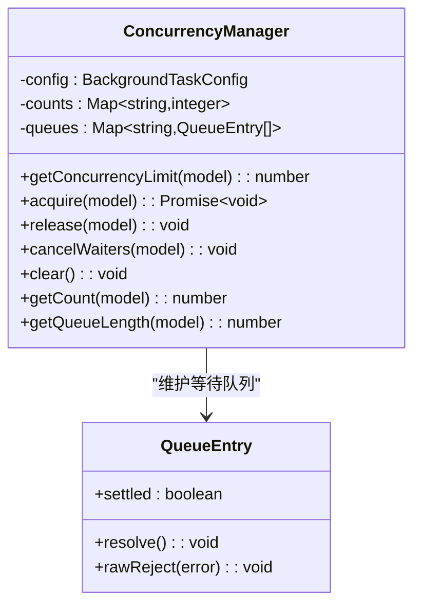
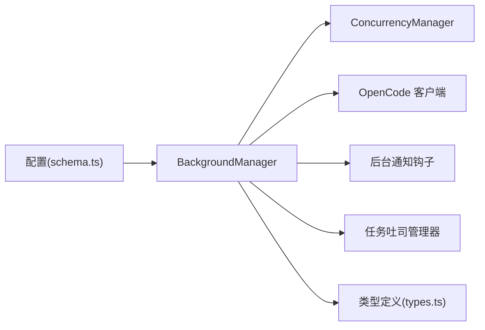

# 背景代理管理

<cite>
**本文引用的文件**
- [src/features/background-agent/manager.ts](file://src/features/background-agent/manager.ts)
- [src/features/background-agent/concurrency.ts](file://src/features/background-agent/concurrency.ts)
- [src/features/background-agent/types.ts](file://src/features/background-agent/types.ts)
- [src/features/background-agent/index.ts](file://src/features/background-agent/index.ts)
- [src/features/background-agent/manager.test.ts](file://src/features/background-agent/manager.test.ts)
- [src/features/background-agent/concurrency.test.ts](file://src/features/background-agent/concurrency.test.ts)
- [src/config/schema.ts](file://src/config/schema.ts)
- [src/tools/background-task/tools.ts](file://src/tools/background-task/tools.ts)
- [src/hooks/background-notification/index.ts](file://src/hooks/background-notification/index.ts)
- [src/hooks/background-notification/types.ts](file://src/hooks/background-notification/types.ts)
</cite>

## 目录
1. [简介](#简介)
2. [项目结构](#项目结构)
3. [核心组件](#核心组件)
4. [架构总览](#架构总览)
5. [详细组件分析](#详细组件分析)
6. [依赖关系分析](#依赖关系分析)
7. [性能考量](#性能考量)
8. [故障排查指南](#故障排查指南)
9. [结论](#结论)
10. [附录](#附录)

## 简介
本文件面向 Oh My OpenCode 的“背景代理管理”子系统，系统性阐述 BackgroundManager 类的实现原理与使用方法，覆盖任务生命周期（启动、暂停、恢复、完成）、并发控制机制（ConcurrencyManager）、任务跟踪与批处理通知、会话监控（session.idle 事件处理、输出验证、自动完成逻辑）、配置项说明、错误处理策略与性能优化建议，并提供实际使用示例与最佳实践。

## 项目结构
背景代理管理位于 features/background-agent 目录，核心由以下模块组成：
- manager.ts：BackgroundManager 核心类，负责任务生命周期、事件处理、轮询检测、通知与清理
- concurrency.ts：ConcurrencyManager 并发控制器，按模型/提供商/默认维度限制并发
- types.ts：类型定义，包括 BackgroundTask、LaunchInput、ResumeInput 等
- index.ts：导出入口
- manager.test.ts、concurrency.test.ts：单元测试，验证行为与边界条件

图表来源
- [src/features/background-agent/manager.ts](file://src/features/background-agent/manager.ts#L52-L1136)
- [src/features/background-agent/concurrency.ts](file://src/features/background-agent/concurrency.ts#L15-L138)
- [src/features/background-agent/types.ts](file://src/features/background-agent/types.ts#L1-L65)
- [src/features/background-agent/index.ts](file://src/features/background-agent/index.ts#L1-L4)
- [src/tools/background-task/tools.ts](file://src/tools/background-task/tools.ts#L51-L119)
- [src/hooks/background-notification/index.ts](file://src/hooks/background-notification/index.ts#L18-L26)
- [src/config/schema.ts](file://src/config/schema.ts#L297-L303)

章节来源
- [src/features/background-agent/manager.ts](file://src/features/background-agent/manager.ts#L52-L1136)
- [src/features/background-agent/concurrency.ts](file://src/features/background-agent/concurrency.ts#L15-L138)
- [src/features/background-agent/types.ts](file://src/features/background-agent/types.ts#L1-L65)
- [src/features/background-agent/index.ts](file://src/features/background-agent/index.ts#L1-L4)

## 核心组件
- BackgroundManager
  - 任务生命周期：launch → 运行中 → 完成/错误/取消
  - 事件驱动：处理 message.part.updated、session.idle、session.deleted 等
  - 轮询检测：定时检查会话状态、消息稳定性、待办事项与超时
  - 通知系统：批量通知父会话，支持单个/全部完成提示
  - 清理与退出：进程信号处理、并发队列取消、内存清理
- ConcurrencyManager
  - 模型/提供商/默认三级并发限制解析
  - 入队等待与出队释放，避免资源泄漏
  - 支持取消等待与清空状态，用于优雅关闭
- 类型系统
  - BackgroundTask、LaunchInput、ResumeInput、TaskProgress 等强类型定义

章节来源
- [src/features/background-agent/manager.ts](file://src/features/background-agent/manager.ts#L52-L1136)
- [src/features/background-agent/concurrency.ts](file://src/features/background-agent/concurrency.ts#L15-L138)
- [src/features/background-agent/types.ts](file://src/features/background-agent/types.ts#L1-L65)

## 架构总览
BackgroundManager 通过 OpenCode 插件客户端与会话系统交互，结合 ConcurrencyManager 控制并发，借助钩子接收事件并触发内部状态机推进。工具层提供 launch/resume/output/cancel 等能力，配置层提供并发与超时参数。

图表来源
- [src/tools/background-task/tools.ts](file://src/tools/background-task/tools.ts#L86-L94)
- [src/features/background-agent/manager.ts](file://src/features/background-agent/manager.ts#L79-L217)
- [src/features/background-agent/concurrency.ts](file://src/features/background-agent/concurrency.ts#L41-L94)
- [src/hooks/background-notification/index.ts](file://src/hooks/background-notification/index.ts#L18-L26)

## 详细组件分析

### BackgroundManager 生命周期与事件处理
- 启动（launch）
  - 参数校验与并发获取；创建子会话；记录任务；注册批处理通知；调用 session.prompt 初始化代理循环
  - 错误路径：释放并发槽位、标记错误、入队通知、向父会话发送失败提示
- 暂停（pause）与恢复（resume）
  - 当前实现仅暴露 resume 接口：恢复运行状态、重置计时、重新获取并发组、重新 prompt
  - 恢复时保留进度信息（工具调用次数等），确保连续性
- 事件处理（handleEvent）
  - message.part.updated：统计工具调用次数与最后工具名，更新进度
  - session.idle：最小运行时间保护、输出验证、待办检查，满足条件后尝试完成
  - session.deleted：标记取消、释放并发、清理挂起父会话追踪
- 自动完成与通知
  - tryCompleteTask 原子化完成，先释放并发再发送通知，防止并发泄漏
  - 批量通知：同一父会话下多个任务完成后一次性汇总提示；单个完成时静默通知其余进行中的任务
- 轮询与清理
  - 10 秒轮询：检查会话 idle 状态、消息稳定性（连续 3 次无变化）、待办状态
  - 剔除过期任务（30 分钟）与通知（TTL 保持一致）
  - 活跃度超时中断：超过 staleTimeoutMs（默认 3 分钟，最小 1 分钟）无活动则取消并通知

图表来源
- [src/features/background-agent/manager.ts](file://src/features/background-agent/manager.ts#L461-L557)
- [src/features/background-agent/manager.ts](file://src/features/background-agent/manager.ts#L736-L764)
- [src/features/background-agent/manager.ts](file://src/features/background-agent/manager.ts#L992-L1106)

章节来源
- [src/features/background-agent/manager.ts](file://src/features/background-agent/manager.ts#L79-L217)
- [src/features/background-agent/manager.ts](file://src/features/background-agent/manager.ts#L344-L442)
- [src/features/background-agent/manager.ts](file://src/features/background-agent/manager.ts#L461-L557)
- [src/features/background-agent/manager.ts](file://src/features/background-agent/manager.ts#L736-L764)
- [src/features/background-agent/manager.ts](file://src/features/background-agent/manager.ts#L992-L1106)

### 并发控制机制（ConcurrencyManager）
- 限制优先级：模型特定 > 提供商特定 > 默认
- acquire：若未达上限立即放行；否则入队等待
- release：优先将空闲槽位转交下一个等待者；否则直接递减计数
- 取消与清理：cancelWaiters 批量拒绝等待；clear 清空所有状态
- 配置项：defaultConcurrency、providerConcurrency、modelConcurrency；值为 0 表示无限制

图表来源
- [src/features/background-agent/concurrency.ts](file://src/features/background-agent/concurrency.ts#L15-L138)

章节来源
- [src/features/background-agent/concurrency.ts](file://src/features/background-agent/concurrency.ts#L15-L138)
- [src/config/schema.ts](file://src/config/schema.ts#L297-L303)
- [src/features/background-agent/concurrency.test.ts](file://src/features/background-agent/concurrency.test.ts#L5-L159)

### 任务跟踪与批处理通知
- 父会话关联：每个任务记录 parentSessionID，便于按父会话聚合通知
- 批处理通知：pendingByParent 按父会话收集待完成任务；当集合为空时触发“全部完成”汇总
- 通知内容：根据完成/失败/取消状态生成不同提示；包含耗时、任务列表等
- 清理策略：任务完成后延迟清理内存条目，避免竞态

章节来源
- [src/features/background-agent/manager.ts](file://src/features/background-agent/manager.ts#L559-L571)
- [src/features/background-agent/manager.ts](file://src/features/background-agent/manager.ts#L766-L890)
- [src/features/background-agent/manager.ts](file://src/features/background-agent/manager.ts#L913-L950)

### 会话监控与自动完成
- 输出验证：要求至少存在 assistant 或 tool 角色消息，并包含非空文本/推理/工具结果
- 待办检查：通过 session.todo 查询未完成待办，存在则延后完成
- 最小运行时间保护：session.idle 到达后，需等待至少 5 秒才接受“空闲”判定
- 消息稳定性：连续 3 次轮询消息数量不变，且满足输出验证与待办检查，触发完成
- 活跃度超时：超过 staleTimeoutMs（默认 3 分钟，最小 1 分钟）无活动自动取消并通知

章节来源
- [src/features/background-agent/manager.ts](file://src/features/background-agent/manager.ts#L444-L531)
- [src/features/background-agent/manager.ts](file://src/features/background-agent/manager.ts#L577-L631)
- [src/features/background-agent/manager.ts](file://src/features/background-agent/manager.ts#L1006-L1096)
- [src/features/background-agent/manager.ts](file://src/features/background-agent/manager.ts#L952-L990)

### 配置选项说明
- defaultConcurrency：默认并发上限（默认 5，0 表示无限制）
- providerConcurrency：按提供商维度设置并发上限
- modelConcurrency：按具体模型设置并发上限
- staleTimeoutMs：活跃度超时阈值（毫秒，默认 180000，最小 60000）

章节来源
- [src/config/schema.ts](file://src/config/schema.ts#L297-L303)

### 错误处理策略
- 启动阶段：捕获 session.create 失败并释放并发；prompt 异常时标记错误、释放并发、入队通知
- 恢复阶段：prompt 异常同样释放并发并通知
- 轮询阶段：忽略单个任务的查询异常，继续处理其他任务
- 进程退出：统一释放并发、取消等待、清理状态，移除信号监听器

章节来源
- [src/features/background-agent/manager.ts](file://src/features/background-agent/manager.ts#L112-L120)
- [src/features/background-agent/manager.ts](file://src/features/background-agent/manager.ts#L192-L214)
- [src/features/background-agent/manager.ts](file://src/features/background-agent/manager.ts#L423-L439)
- [src/features/background-agent/manager.ts](file://src/features/background-agent/manager.ts#L1113-L1135)

### 性能优化建议
- 并发限制：合理设置 defaultConcurrency/providerConcurrency/modelConcurrency，避免过度并发导致资源争用
- 轮询间隔：当前固定 10 秒，可根据任务特性在配置中扩展（如支持动态调整）
- 输出验证：仅在 idle 或稳定性检测时进行，避免频繁查询
- 通知批处理：利用 pendingByParent 减少冗余提示，提升用户体验
- 超时中断：适当缩短 staleTimeoutMs 可快速回收资源，但需权衡任务完成率

章节来源
- [src/features/background-agent/manager.ts](file://src/features/background-agent/manager.ts#L659-L666)
- [src/features/background-agent/manager.ts](file://src/features/background-agent/manager.ts#L952-L990)

### 实际使用示例与最佳实践
- 启动后台任务
  - 使用工具 createBackgroundTask，传入 description、prompt、agent
  - 系统自动解析父会话 agent/model 并创建子会话
  - 返回任务 ID 与会话 ID，系统会在完成后通知
- 查询任务状态与结果
  - 使用工具 createBackgroundOutput，传入 task_id；可选择 block=true 等待完成
  - 若已完成，返回合并后的最终输出；否则返回状态摘要
- 取消任务
  - 使用工具 createBackgroundCancel，传入 taskId 或 all=true 取消全部
- 最佳实践
  - 为高并发场景设置合理的 providerConcurrency/modelConcurrency
  - 对长耗时任务设置合适的 staleTimeoutMs，避免资源占用
  - 使用父会话聚合通知，减少打扰
  - 在 resume 时保留原 model 与 parent 上下文，确保一致性

章节来源
- [src/tools/background-task/tools.ts](file://src/tools/background-task/tools.ts#L51-L119)
- [src/tools/background-task/tools.ts](file://src/tools/background-task/tools.ts#L303-L367)
- [src/tools/background-task/tools.ts](file://src/tools/background-task/tools.ts#L369-L438)

## 依赖关系分析
- BackgroundManager 依赖
  - ConcurrencyManager：并发控制
  - OpenCode 客户端：会话创建、prompt、状态查询、消息读取、待办查询、abort
  - 钩子系统：接收 session.idle 等事件
  - 任务吐司管理器：显示任务状态与完成提示
- 类型与配置
  - types.ts 提供强类型约束
  - config/schema.ts 提供并发与超时配置

图表来源
- [src/features/background-agent/manager.ts](file://src/features/background-agent/manager.ts#L52-L1136)
- [src/features/background-agent/concurrency.ts](file://src/features/background-agent/concurrency.ts#L15-L138)
- [src/features/background-agent/types.ts](file://src/features/background-agent/types.ts#L1-L65)
- [src/config/schema.ts](file://src/config/schema.ts#L297-L303)

章节来源
- [src/features/background-agent/manager.ts](file://src/features/background-agent/manager.ts#L52-L1136)
- [src/features/background-agent/concurrency.ts](file://src/features/background-agent/concurrency.ts#L15-L138)
- [src/features/background-agent/types.ts](file://src/features/background-agent/types.ts#L1-L65)
- [src/config/schema.ts](file://src/config/schema.ts#L297-L303)

## 性能考量
- 并发控制：通过模型/提供商/默认三级限制，避免全局拥塞
- 轮询频率：10 秒一次，折中考虑响应速度与开销
- 输出验证与待办检查：仅在必要时机执行，减少不必要的 API 调用
- 超时中断：及时回收长时间无进展的任务，释放资源
- 内存管理：TTL 清理与延迟删除，避免长期驻留

## 故障排查指南
- 启动失败
  - 检查 agent 是否注册；查看错误信息是否包含 agent.name/undefined 提示
  - 确认父会话目录与权限
- 无法完成
  - 确认是否存在未完成待办；检查输出验证是否通过（存在 assistant/tool 且有内容）
  - 检查 staleTimeoutMs 设置是否过短
- 通知未送达
  - 确认钩子已正确注入 BackgroundManager；检查父会话 prompt 权限
- 并发阻塞
  - 检查是否有等待队列；使用 cancelWaiters 或重启插件释放
- 进程退出
  - 确认信号监听与清理逻辑是否生效；检查是否存在残留监听器

章节来源
- [src/features/background-agent/manager.ts](file://src/features/background-agent/manager.ts#L112-L120)
- [src/features/background-agent/manager.ts](file://src/features/background-agent/manager.ts#L192-L214)
- [src/features/background-agent/manager.ts](file://src/features/background-agent/manager.ts#L423-L439)
- [src/features/background-agent/manager.ts](file://src/features/background-agent/manager.ts#L1113-L1135)
- [src/features/background-agent/concurrency.test.ts](file://src/features/background-agent/concurrency.test.ts#L353-L394)

## 结论
BackgroundManager 通过事件驱动与轮询相结合的方式，实现了对后台代理任务的全生命周期管理；ConcurrencyManager 提供细粒度的并发控制；批处理通知与输出验证保障了用户体验与可靠性。配合合理的配置与最佳实践，可在复杂场景下稳定高效地运行大量后台任务。

## 附录
- 相关钩子：后台通知钩子负责事件路由至 BackgroundManager
- 类型导出：通过 index.ts 统一导出类型与管理器

章节来源
- [src/hooks/background-notification/index.ts](file://src/hooks/background-notification/index.ts#L18-L26)
- [src/features/background-agent/index.ts](file://src/features/background-agent/index.ts#L1-L4)