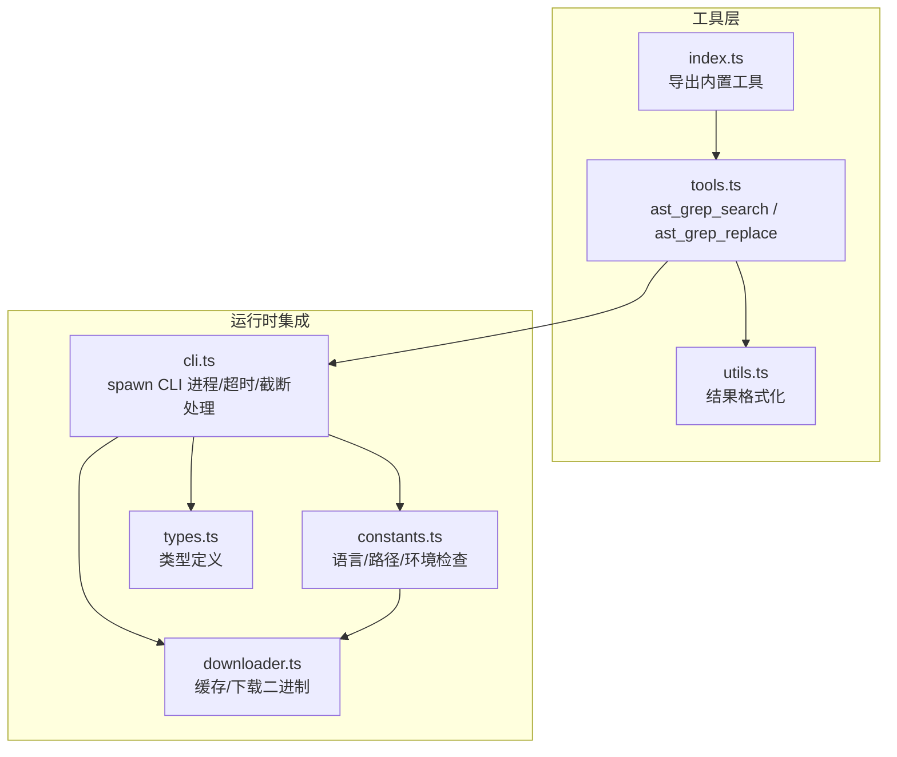
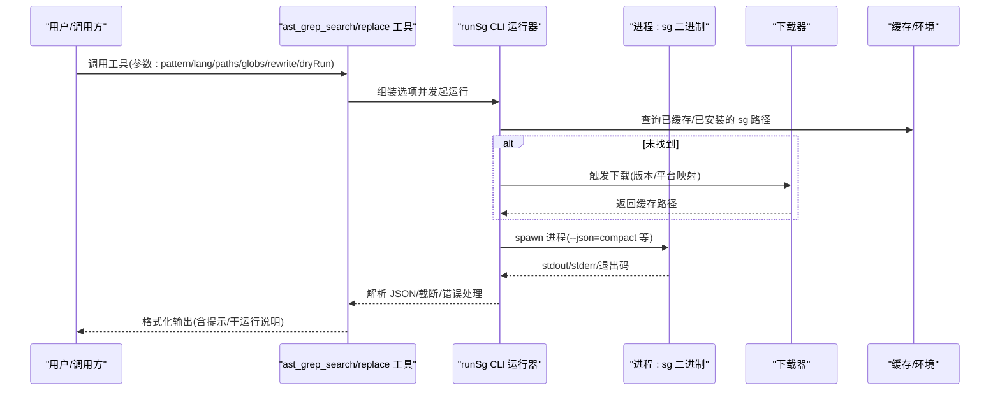
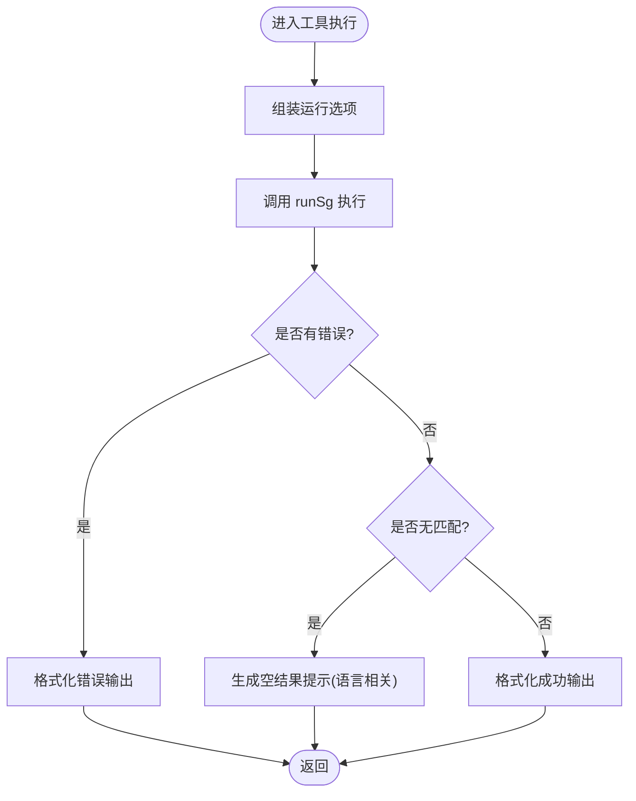
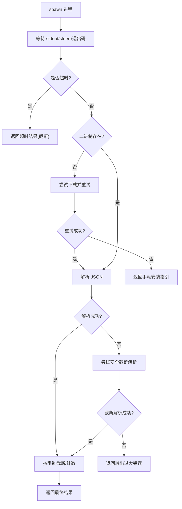
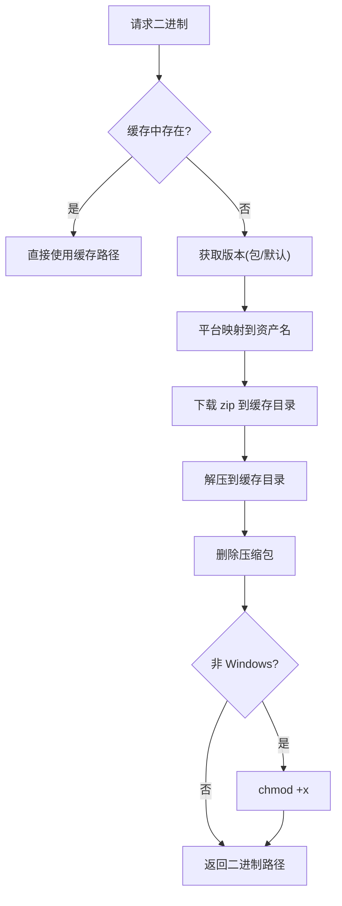
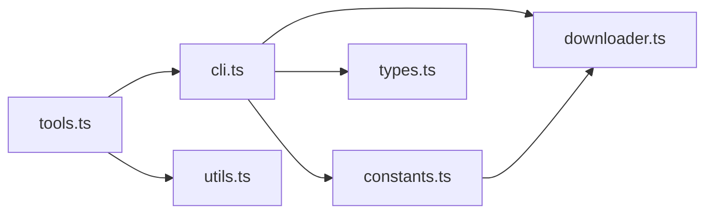

# AST-Grep 工具

<cite>
**本文引用的文件**
- [src/tools/ast-grep/index.ts](file://src/tools/ast-grep/index.ts)
- [src/tools/ast-grep/tools.ts](file://src/tools/ast-grep/tools.ts)
- [src/tools/ast-grep/cli.ts](file://src/tools/ast-grep/cli.ts)
- [src/tools/ast-grep/downloader.ts](file://src/tools/ast-grep/downloader.ts)
- [src/tools/ast-grep/constants.ts](file://src/tools/ast-grep/constants.ts)
- [src/tools/ast-grep/types.ts](file://src/tools/ast-grep/types.ts)
- [src/tools/ast-grep/utils.ts](file://src/tools/ast-grep/utils.ts)
- [README.md](file://README.md)
</cite>

## 目录
1. [简介](#简介)
2. [项目结构](#项目结构)
3. [核心组件](#核心组件)
4. [架构总览](#架构总览)
5. [详细组件分析](#详细组件分析)
6. [依赖关系分析](#依赖关系分析)
7. [性能考量](#性能考量)
8. [故障排查指南](#故障排查指南)
9. [结论](#结论)
10. [附录](#附录)

## 简介
本文件为 AST-Grep 工具的全面技术文档，面向希望在代码库中进行“基于抽象语法树”的精准模式搜索与替换的工程师与研究者。AST-Grep 通过本地二进制或已安装的 CLI 提供对 25 种编程语言的 AST 匹配能力，支持元变量占位符（如 $VAR、$$$）、上下文输出、以及安全的“预览替换”（dry-run）。文档涵盖：
- ast_grep_search 与 ast_grep_replace 的使用方法与参数说明
- AST 模式语法与元变量语义
- 正则表达式支持现状与替代策略
- 本地二进制下载与管理机制
- 实际使用示例与复杂查询模式构建思路
- 性能优化建议与与传统文本搜索的对比

## 项目结构
AST-Grep 工具位于插件体系中的工具模块，对外暴露两个内置工具，并封装了 CLI 调用、二进制下载、环境检查等能力。

**图表来源**
- [src/tools/ast-grep/index.ts](file://src/tools/ast-grep/index.ts#L1-L14)
- [src/tools/ast-grep/tools.ts](file://src/tools/ast-grep/tools.ts#L1-L113)
- [src/tools/ast-grep/cli.ts](file://src/tools/ast-grep/cli.ts#L1-L231)
- [src/tools/ast-grep/constants.ts](file://src/tools/ast-grep/constants.ts#L1-L262)
- [src/tools/ast-grep/downloader.ts](file://src/tools/ast-grep/downloader.ts#L1-L129)
- [src/tools/ast-grep/utils.ts](file://src/tools/ast-grep/utils.ts#L1-L103)
- [src/tools/ast-grep/types.ts](file://src/tools/ast-grep/types.ts#L1-L62)

**章节来源**
- [src/tools/ast-grep/index.ts](file://src/tools/ast-grep/index.ts#L1-L14)
- [README.md](file://README.md#L584-L586)

## 核心组件
- ast_grep_search：在目标语言的完整 AST 上进行模式匹配，返回匹配位置、上下文与文件信息。支持 include/exclude globs 与上下文行数。
- ast_grep_replace：在保持 AST 语义的前提下进行替换，支持 dry-run 预览；可通过元变量将匹配内容重用到替换模板中。
- CLI 运行器：负责拼装参数、启动本地二进制、处理超时、输出截断与错误回退。
- 下载器：按平台映射下载对应压缩包，解压后设置可执行权限，缓存至用户目录。
- 环境检查：检测 CLI 与 N-API 可用性，提供友好的诊断信息。
- 类型与格式化：统一匹配结果结构，提供搜索/替换两种输出格式。

**章节来源**
- [src/tools/ast-grep/tools.ts](file://src/tools/ast-grep/tools.ts#L35-L110)
- [src/tools/ast-grep/cli.ts](file://src/tools/ast-grep/cli.ts#L64-L220)
- [src/tools/ast-grep/downloader.ts](file://src/tools/ast-grep/downloader.ts#L61-L129)
- [src/tools/ast-grep/constants.ts](file://src/tools/ast-grep/constants.ts#L184-L261)
- [src/tools/ast-grep/utils.ts](file://src/tools/ast-grep/utils.ts#L3-L103)

## 架构总览
AST-Grep 在插件中作为“工具”被调用，内部通过 CLI 层与本地二进制交互，必要时自动下载并缓存二进制。

**图表来源**
- [src/tools/ast-grep/tools.ts](file://src/tools/ast-grep/tools.ts#L35-L110)
- [src/tools/ast-grep/cli.ts](file://src/tools/ast-grep/cli.ts#L64-L220)
- [src/tools/ast-grep/downloader.ts](file://src/tools/ast-grep/downloader.ts#L61-L129)
- [src/tools/ast-grep/constants.ts](file://src/tools/ast-grep/constants.ts#L33-L81)

## 详细组件分析

### 工具定义与参数
- ast_grep_search
  - 参数要点：pattern（必须是完整 AST 节点）、lang（25 语言枚举）、paths、globs（支持以 ! 开头排除）、context（上下文行数）
  - 行为：调用 runSg，格式化输出；当无匹配且满足特定模式时给出“空结果提示”
- ast_grep_replace
  - 参数要点：pattern、rewrite（可使用 $VAR 引用）、lang、paths、globs、dryRun（默认 true）
  - 行为：调用 runSg，根据 dryRun 决定是否应用更新；格式化输出并提示如何应用更改

**图表来源**
- [src/tools/ast-grep/tools.ts](file://src/tools/ast-grep/tools.ts#L35-L110)
- [src/tools/ast-grep/utils.ts](file://src/tools/ast-grep/utils.ts#L3-L70)

**章节来源**
- [src/tools/ast-grep/tools.ts](file://src/tools/ast-grep/tools.ts#L35-L110)

### CLI 运行器与错误处理
- 参数拼装：固定参数（-p/-r/--lang/--json=compact），可选参数（-C 上下文、--globs、路径列表）
- 进程管理：spawn 启动，超时保护（默认 300 秒），输出截断（默认 1MB、默认最多 500 条）
- 错误处理：
  - 超时：返回 truncated= true，原因 timeout
  - 二进制不存在：尝试自动下载并重试；若仍失败，返回手动安装指引
  - 输出过大：尝试安全截断解析；若仍失败，返回 truncated=max_output_bytes
  - 匹配过多：截断到上限并标记 truncated=max_matches
- 退出码非零但 stdout 为空：根据 stderr 判定“未找到文件”等特殊提示

**图表来源**
- [src/tools/ast-grep/cli.ts](file://src/tools/ast-grep/cli.ts#L64-L220)

**章节来源**
- [src/tools/ast-grep/cli.ts](file://src/tools/ast-grep/cli.ts#L64-L220)

### 本地二进制下载与管理
- 版本来源：优先读取 @ast-grep/cli 的 package.json 版本；若不可用则回退到内置默认版本
- 平台映射：根据 process.platform 与 process.arch 映射到对应的资产名
- 缓存策略：跨平台缓存目录统一；Windows 使用 LOCALAPPDATA/APPDATA 下的子目录，类 Unix 使用 XDG_CACHE_HOME 或 ~/.cache
- 安装流程：若缓存中已有二进制则直接使用；否则下载 zip、解压、删除压缩包、设置可执行权限（非 Windows）

**图表来源**
- [src/tools/ast-grep/downloader.ts](file://src/tools/ast-grep/downloader.ts#L61-L129)
- [src/tools/ast-grep/constants.ts](file://src/tools/ast-grep/constants.ts#L16-L31)

**章节来源**
- [src/tools/ast-grep/downloader.ts](file://src/tools/ast-grep/downloader.ts#L61-L129)
- [src/tools/ast-grep/constants.ts](file://src/tools/ast-grep/constants.ts#L16-L31)

### 语言支持与环境检查
- 支持语言：25 种语言枚举，覆盖 Bash、C/C++、C#、CSS、Elixir、Go、Haskell、HTML、Java、JavaScript、JSON、Kotlin、Lua、Nix、PHP、Python、Ruby、Rust、Scala、Solidity、Swift、TypeScript、TSX、YAML
- N-API 语言：HTML、JavaScript、TSX、CSS、TypeScript（原生绑定）
- 环境检查：检测 CLI 是否可用（缓存路径、PATH、Homebrew macOS）、N-API 是否可用，并格式化为用户友好消息

**章节来源**
- [src/tools/ast-grep/constants.ts](file://src/tools/ast-grep/constants.ts#L103-L166)
- [src/tools/ast-grep/constants.ts](file://src/tools/ast-grep/constants.ts#L184-L261)

### 数据模型与输出格式
- 匹配项结构：包含文本、范围（行列号）、文件、上下文行、字符计数、语言
- 结果对象：包含匹配数组、总数、是否截断、截断原因（超时/输出过大/匹配过多）、错误信息
- 输出格式：
  - 搜索：统计、截断提示、逐条展示文件与上下文
  - 替换：统计、截断提示、逐条展示原文本；dry-run 时提示如何应用

**章节来源**
- [src/tools/ast-grep/types.ts](file://src/tools/ast-grep/types.ts#L16-L61)
- [src/tools/ast-grep/utils.ts](file://src/tools/ast-grep/utils.ts#L3-L103)

## 依赖关系分析
- 工具层依赖 CLI 运行器与格式化模块
- CLI 运行器依赖下载器与常量配置
- 常量模块提供语言列表、扩展映射、环境检查与默认阈值
- 类型模块提供统一的数据结构

**图表来源**
- [src/tools/ast-grep/index.ts](file://src/tools/ast-grep/index.ts#L1-L14)
- [src/tools/ast-grep/tools.ts](file://src/tools/ast-grep/tools.ts#L1-L113)
- [src/tools/ast-grep/cli.ts](file://src/tools/ast-grep/cli.ts#L1-L231)
- [src/tools/ast-grep/constants.ts](file://src/tools/ast-grep/constants.ts#L1-L262)
- [src/tools/ast-grep/downloader.ts](file://src/tools/ast-grep/downloader.ts#L1-L129)
- [src/tools/ast-grep/types.ts](file://src/tools/ast-grep/types.ts#L1-L62)
- [src/tools/ast-grep/utils.ts](file://src/tools/ast-grep/utils.ts#L1-L103)

**章节来源**
- [src/tools/ast-grep/index.ts](file://src/tools/ast-grep/index.ts#L1-L14)

## 性能考量
- 超时与截断：默认超时 300 秒，输出上限 1MB，最多 500 条匹配；超出时自动截断并标注原因
- 二进制缓存：避免重复下载，提升启动速度
- 并行与后台初始化：可在启动时触发后台初始化，减少首次调用延迟
- 语言与范围：合理使用 globs 与 paths 缩小搜索范围，减少 AST 解析开销
- 元变量使用：尽量使用精确的 AST 节点模式，避免过宽泛的匹配导致大量误报与处理成本

[本节为通用指导，不直接分析具体文件]

## 故障排查指南
- 二进制未找到
  - 现象：返回“未找到 ast-grep CLI 二进制”，并提供手动安装指引
  - 处理：安装 @ast-grep/cli 或系统级安装（cargo/brew/bun）
- 超时
  - 现象：返回 truncated=true，原因 timeout
  - 处理：缩小搜索范围、减少上下文、调整 globs、增加超时阈值（如需）
- 输出过大/匹配过多
  - 现象：返回 truncated=true，原因 max_output_bytes/max_matches
  - 处理：使用更精确的 pattern、增加 include/exclude globs、分批处理
- 空结果提示
  - 现象：无匹配但给出语言相关的提示（如 Python 函数缺少冒号、JS 函数缺少参数与体）
  - 处理：根据提示修正 pattern，确保为完整 AST 节点

**章节来源**
- [src/tools/ast-grep/cli.ts](file://src/tools/ast-grep/cli.ts#L115-L220)
- [src/tools/ast-grep/tools.ts](file://src/tools/ast-grep/tools.ts#L12-L33)

## 结论
AST-Grep 工具通过本地二进制与完善的错误处理、缓存与环境检查机制，为大规模代码库提供了高性能、可预测的 AST 模式搜索与替换能力。其“干运行”与“元变量重用”特性使其在重构与迁移场景中尤为安全高效。配合合理的 globs 与路径限定，可显著降低性能开销并提升准确性。

[本节为总结，不直接分析具体文件]

## 附录

### 使用方法与参数速览
- ast_grep_search
  - 关键参数：pattern、lang、paths、globs、context
  - 输出：匹配数量、截断提示、逐条文件与上下文
- ast_grep_replace
  - 关键参数：pattern、rewrite、lang、paths、globs、dryRun
  - 输出：匹配数量、逐条原文本；dryRun 时提示如何应用

**章节来源**
- [src/tools/ast-grep/tools.ts](file://src/tools/ast-grep/tools.ts#L35-L110)

### AST 模式语法与元变量
- 元变量
  - $VAR：单节点占位
  - $$$：多节点占位
- 重要约束
  - 模式必须是完整的 AST 节点（有效代码）
  - 函数模式需包含参数与函数体，例如“export async function $NAME($$$) { $$$ }”
- 语言相关提示
  - Python：class/def 末尾冒号常见误用
  - JavaScript/TypeScript/TSX：函数模式需包含参数与体

**章节来源**
- [src/tools/ast-grep/tools.ts](file://src/tools/ast-grep/tools.ts#L36-L41)
- [src/tools/ast-grep/tools.ts](file://src/tools/ast-grep/tools.ts#L12-L33)

### 正则表达式支持
- 当前实现不直接提供正则表达式匹配
- 建议策略
  - 使用更精确的 AST 节点模式替代正则
  - 对于跨语言/跨文件的文本特征，结合工具链中的文本搜索工具进行预筛选，再用 AST-Grep 精确过滤

[本节为通用指导，不直接分析具体文件]

### 实际代码示例（步骤化说明）
以下示例以“步骤化”形式给出，不包含具体代码片段，请按步骤在调用方环境中组织参数：

- 示例一：查找所有 Python 函数定义
  - 选择语言：python
  - 模式：形如“def $FUNC($$$):”或“async def $FUNC($$$):”，确保包含冒号与函数体
  - 路径：可选，限定在 src/ 目录
  - globs：可选，如包含“*.py”，排除“test_*.py”
  - 上下文：可选，设置为 2 获取前后各 2 行上下文
  - 执行：调用 ast_grep_search，查看输出统计与逐条上下文

- 示例二：将 JS 控制台日志替换为统一 logger
  - 模式：console.log($MSG)
  - 替换：logger.info($MSG)
  - 语言：javascript 或 typescript
  - dryRun：先设为 true 预览，确认后再改为 false 应用
  - 路径/globs：限定在 src/ 与 test/ 目录

- 示例三：查找并替换多文件中的重复导入
  - 模式：import 语句的完整 AST 节点
  - 替换：合并为单一导入或移除冗余
  - dryRun：true 预览，确认后再应用

**章节来源**
- [src/tools/ast-grep/tools.ts](file://src/tools/ast-grep/tools.ts#L35-L110)

### 与传统文本搜索的对比与适用场景
- AST-Grep
  - 优点：语义精确、可跨语言、支持元变量重用、可预览替换
  - 适用：重构、迁移、规范化、静态分析
- 文本搜索
  - 优点：速度快、适合粗筛、正则灵活
  - 适用：一次性全文检索、跨仓库示例查找
- 建议策略
  - 先用文本搜索定位候选文件，再用 AST-Grep 精确匹配与替换

[本节为通用指导，不直接分析具体文件]