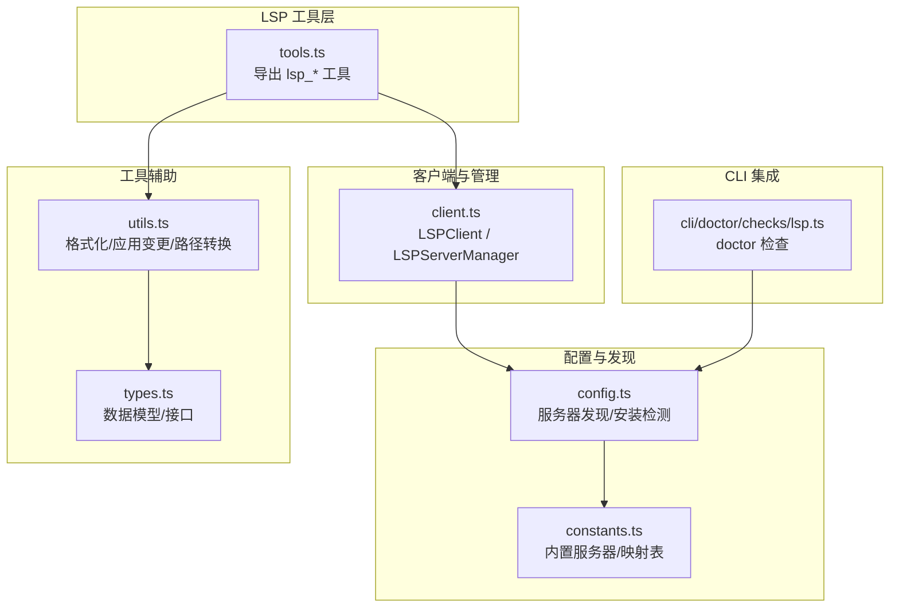
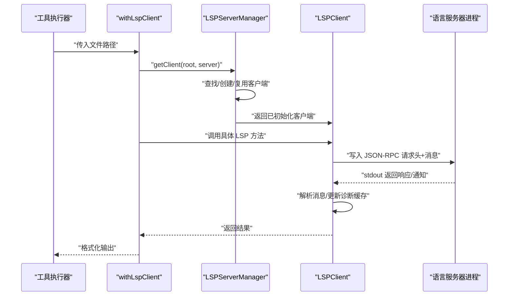
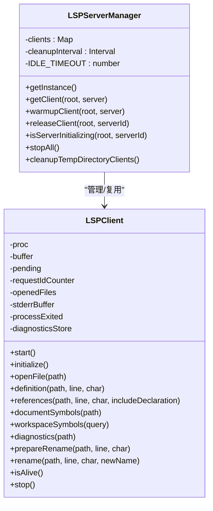
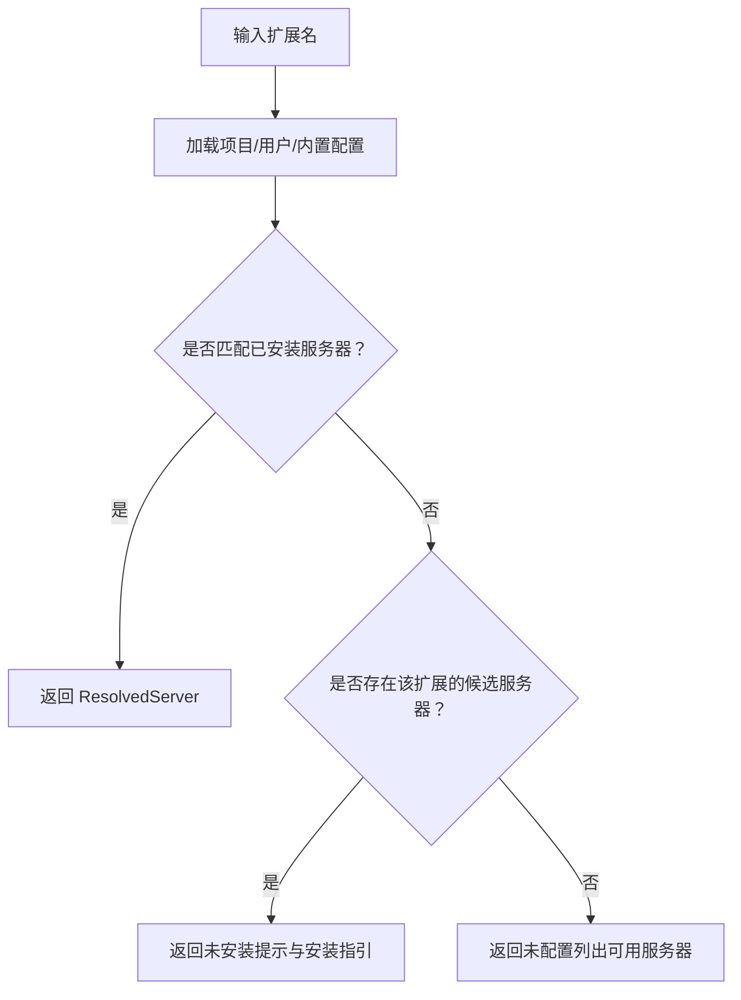
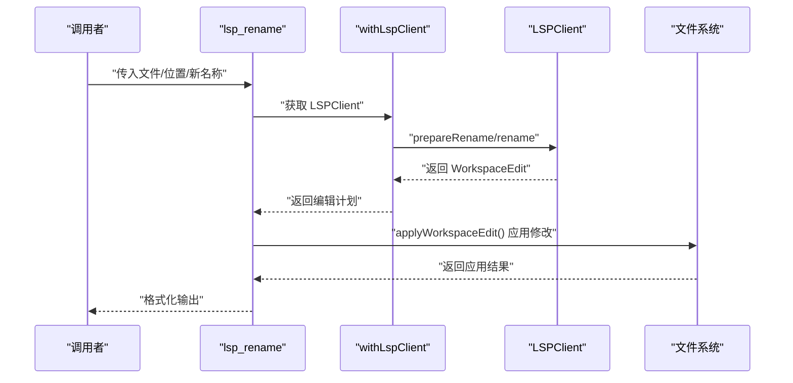
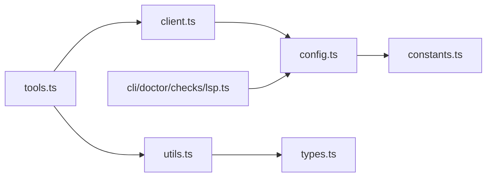

# LSP 工具集

<cite>
**本文档引用的文件**
- [src/tools/lsp/index.ts](file://src/tools/lsp/index.ts)
- [src/tools/lsp/client.ts](file://src/tools/lsp/client.ts)
- [src/tools/lsp/config.ts](file://src/tools/lsp/config.ts)
- [src/tools/lsp/types.ts](file://src/tools/lsp/types.ts)
- [src/tools/lsp/utils.ts](file://src/tools/lsp/utils.ts)
- [src/tools/lsp/tools.ts](file://src/tools/lsp/tools.ts)
- [src/tools/lsp/constants.ts](file://src/tools/lsp/constants.ts)
- [src/cli/doctor/checks/lsp.ts](file://src/cli/doctor/checks/lsp.ts)
- [src/cli/doctor/types.ts](file://src/cli/doctor/types.ts)
- [src/tools/lsp/config.test.ts](file://src/tools/lsp/config.test.ts)
- [src/cli/doctor/checks/lsp.test.ts](file://src/cli/doctor/checks/lsp.test.ts)
- [README.md](file://README.md)
</cite>

## 目录
1. [简介](#简介)
2. [项目结构](#项目结构)
3. [核心组件](#核心组件)
4. [架构总览](#架构总览)
5. [详细组件分析](#详细组件分析)
6. [依赖关系分析](#依赖关系分析)
7. [性能考量](#性能考量)
8. [故障排查指南](#故障排查指南)
9. [结论](#结论)
10. [附录](#附录)

## 简介
本文件系统性阐述 oh-my-opencode 中的 LSP 工具集，覆盖以下核心能力：
- 定义跳转：lsp_goto_definition
- 引用查找：lsp_find_references
- 符号搜索：lsp_symbols（支持文档级与工作区级）
- 诊断信息：lsp_diagnostics（支持按严重级别过滤）
- 重命名准备：lsp_prepare_rename
- 重命名应用：lsp_rename（在工作区范围内安全改名并落盘）

同时，文档将深入解析 LSP 客户端配置、连接管理、错误处理机制，并提供实际使用示例、性能优化建议与常见问题解决方案，以及与其他工具（如 OpenCode、CLI doctor）的集成方式与最佳实践。

## 项目结构
LSP 工具集位于 src/tools/lsp 目录，采用“工具层 + 客户端 + 配置 + 类型 + 常量”的分层设计，便于扩展与维护。

图表来源
- [src/tools/lsp/tools.ts](file://src/tools/lsp/tools.ts#L1-L262)
- [src/tools/lsp/client.ts](file://src/tools/lsp/client.ts#L1-L597)
- [src/tools/lsp/config.ts](file://src/tools/lsp/config.ts#L1-L286)
- [src/tools/lsp/constants.ts](file://src/tools/lsp/constants.ts#L1-L391)
- [src/tools/lsp/utils.ts](file://src/tools/lsp/utils.ts#L1-L407)
- [src/tools/lsp/types.ts](file://src/tools/lsp/types.ts#L1-L125)
- [src/cli/doctor/checks/lsp.ts](file://src/cli/doctor/checks/lsp.ts#L1-L78)

章节来源
- [src/tools/lsp/index.ts](file://src/tools/lsp/index.ts#L1-L8)
- [src/tools/lsp/tools.ts](file://src/tools/lsp/tools.ts#L1-L262)
- [src/tools/lsp/client.ts](file://src/tools/lsp/client.ts#L1-L597)
- [src/tools/lsp/config.ts](file://src/tools/lsp/config.ts#L1-L286)
- [src/tools/lsp/utils.ts](file://src/tools/lsp/utils.ts#L1-L407)
- [src/tools/lsp/constants.ts](file://src/tools/lsp/constants.ts#L1-L391)
- [src/tools/lsp/types.ts](file://src/tools/lsp/types.ts#L1-L125)
- [src/cli/doctor/checks/lsp.ts](file://src/cli/doctor/checks/lsp.ts#L1-L78)

## 核心组件
- LSPClient：封装与语言服务器的 JSON-RPC 通信，负责启动进程、读取 stdout/stderr、发送请求与通知、处理响应与诊断缓存。
- LSPServerManager：单例管理器，负责多根目录/多服务器实例的生命周期、空闲清理、预热与并发引用计数。
- 配置与发现：合并项目/用户/内置三层配置，按扩展名匹配可用服务器，检测安装状态并提供安装提示。
- 工具层：将 LSP 能力包装为可被 OpenCode 插件调用的工具，统一参数校验、结果格式化与错误处理。
- 工具辅助：位置/范围/符号/诊断/重命名结果的格式化；工作区编辑应用与批量落盘。
- 常量与映射：内置服务器清单、扩展到语言 ID 映射、符号与严重级别枚举映射、默认限制阈值。

章节来源
- [src/tools/lsp/client.ts](file://src/tools/lsp/client.ts#L16-L208)
- [src/tools/lsp/config.ts](file://src/tools/lsp/config.ts#L44-L156)
- [src/tools/lsp/tools.ts](file://src/tools/lsp/tools.ts#L29-L262)
- [src/tools/lsp/utils.ts](file://src/tools/lsp/utils.ts#L82-L111)
- [src/tools/lsp/constants.ts](file://src/tools/lsp/constants.ts#L88-L391)

## 架构总览
LSP 工具集通过 withLspClient 获取 LSPClient，再调用具体方法完成 LSP 操作。客户端内部负责：
- 启动语言服务器子进程并建立 stdin/stdout/stderr 流
- 解析 Content-Length 头部，拼接完整消息后 JSON 解析
- 维护请求 ID 映射与超时控制
- 订阅 textDocument/publishDiagnostics 并缓存诊断
- 发送 initialize/initialized/workspace/didChangeConfiguration 等初始化消息

图表来源
- [src/tools/lsp/utils.ts](file://src/tools/lsp/utils.ts#L82-L111)
- [src/tools/lsp/client.ts](file://src/tools/lsp/client.ts#L225-L489)

章节来源
- [src/tools/lsp/utils.ts](file://src/tools/lsp/utils.ts#L82-L111)
- [src/tools/lsp/client.ts](file://src/tools/lsp/client.ts#L225-L489)

## 详细组件分析

### LSPClient 与 LSPServerManager
- 单例管理器负责：
  - 键：root 目录 + server.id
  - 引用计数与空闲超时（默认 5 分钟），自动清理闲置客户端
  - 初始化并发控制：initPromise 防止重复初始化
  - 进程退出信号处理：SIGINT/SIGTERM/SIGBREAK 等，确保资源回收
- LSPClient 负责：
  - 子进程启动与环境变量注入
  - 双通道读取：stdout 消息解析，stderr 缓冲用于错误上下文
  - JSON-RPC 请求/响应：带超时（默认 15 秒）、pending 映射、错误透传
  - 诊断订阅：textDocument/publishDiagnostics 缓存至内存
  - 初始化能力：capabilities 包含 hover/definition/references/documentSymbol/codeAction/rename 等
  - 文件打开：didOpen 自动读取文本并上报语言 ID

图表来源
- [src/tools/lsp/client.ts](file://src/tools/lsp/client.ts#L16-L208)
- [src/tools/lsp/client.ts](file://src/tools/lsp/client.ts#L210-L597)

章节来源
- [src/tools/lsp/client.ts](file://src/tools/lsp/client.ts#L16-L208)
- [src/tools/lsp/client.ts](file://src/tools/lsp/client.ts#L210-L597)

### 配置与服务器发现
- 配置来源优先级：项目级 > 用户级 > 内置（opencode.json）
- 支持禁用、优先级、环境变量、初始化参数覆盖
- 服务器安装检测：PATH/PATHEXT（Windows）或 PATH（类 Unix），支持绝对路径与 node/bun 运行器
- 扩展到语言 ID 映射：基于 EXT_TO_LANG 常量
- 内置服务器清单：涵盖 TypeScript/Vue/Rust/Go/Python 等主流语言

图表来源
- [src/tools/lsp/config.ts](file://src/tools/lsp/config.ts#L60-L156)
- [src/tools/lsp/constants.ts](file://src/tools/lsp/constants.ts#L88-L391)

章节来源
- [src/tools/lsp/config.ts](file://src/tools/lsp/config.ts#L44-L156)
- [src/tools/lsp/constants.ts](file://src/tools/lsp/constants.ts#L258-L391)

### 工具层：lsp_* API
- lsp_goto_definition：定位符号定义，支持 Location/LocationLink 列表，格式化输出为“文件:行:列”
- lsp_find_references：查找引用，支持 includeDeclaration 控制是否包含声明自身，限制默认上限
- lsp_symbols：支持 scope=document/workspace，分别返回 DocumentSymbol 或 SymbolInfo，限制默认上限
- lsp_diagnostics：获取诊断，支持 severity 过滤（error/warning/information/hint/all），限制默认上限
- lsp_prepare_rename：检查重命名可行性，支持多种返回形态（范围/占位符/默认行为），格式化输出
- lsp_rename：生成 WorkspaceEdit，应用到本地文件系统，格式化应用结果

图表来源
- [src/tools/lsp/tools.ts](file://src/tools/lsp/tools.ts#L240-L262)
- [src/tools/lsp/utils.ts](file://src/tools/lsp/utils.ts#L313-L385)

章节来源
- [src/tools/lsp/tools.ts](file://src/tools/lsp/tools.ts#L29-L262)
- [src/tools/lsp/utils.ts](file://src/tools/lsp/utils.ts#L270-L385)

### 数据模型与格式化
- 位置/范围/符号/诊断/重命名/工作区编辑等核心类型定义于 types.ts
- 常量中提供符号种类与严重级别的映射表
- 工具辅助模块提供：
  - 位置格式化（文件:行:列）
  - 文档符号树格式化（缩进层级）
  - 符号信息格式化（名称/类型/容器/位置）
  - 诊断格式化（严重级别/来源/编号/位置/消息）
  - 重命名结果格式化（范围/占位符/默认行为）
  - 文本编辑与工作区编辑格式化
  - 应用编辑结果汇总与错误收集

章节来源
- [src/tools/lsp/types.ts](file://src/tools/lsp/types.ts#L1-L125)
- [src/tools/lsp/constants.ts](file://src/tools/lsp/constants.ts#L3-L84)
- [src/tools/lsp/utils.ts](file://src/tools/lsp/utils.ts#L113-L268)

### CLI doctor 集成
- doctor 检查 LSP 服务器可用性，统计已安装数量，给出详细列表
- 不依赖外部 which/spawn 命令，兼容 Windows 环境
- 提供检查定义与分类，便于在 CLI 中统一运行

章节来源
- [src/cli/doctor/checks/lsp.ts](file://src/cli/doctor/checks/lsp.ts#L1-L78)
- [src/cli/doctor/types.ts](file://src/cli/doctor/types.ts#L92-L97)

## 依赖关系分析
- 工具层依赖客户端与工具辅助模块，统一错误处理与结果格式化
- 客户端依赖配置模块进行服务器发现与语言 ID 推断
- 配置模块依赖常量中的内置服务器清单与扩展映射
- doctor 检查依赖配置模块的安装检测能力

图表来源
- [src/tools/lsp/tools.ts](file://src/tools/lsp/tools.ts#L1-L28)
- [src/tools/lsp/client.ts](file://src/tools/lsp/client.ts#L1-L6)
- [src/tools/lsp/config.ts](file://src/tools/lsp/config.ts#L1-L5)
- [src/tools/lsp/constants.ts](file://src/tools/lsp/constants.ts#L1-L2)
- [src/tools/lsp/utils.ts](file://src/tools/lsp/utils.ts#L1-L19)
- [src/tools/lsp/types.ts](file://src/tools/lsp/types.ts#L1-L1)
- [src/cli/doctor/checks/lsp.ts](file://src/cli/doctor/checks/lsp.ts#L15)

章节来源
- [src/tools/lsp/index.ts](file://src/tools/lsp/index.ts#L1-L8)
- [src/tools/lsp/tools.ts](file://src/tools/lsp/tools.ts#L1-L28)
- [src/tools/lsp/client.ts](file://src/tools/lsp/client.ts#L1-L6)
- [src/tools/lsp/config.ts](file://src/tools/lsp/config.ts#L1-L5)
- [src/tools/lsp/constants.ts](file://src/tools/lsp/constants.ts#L1-L2)
- [src/tools/lsp/utils.ts](file://src/tools/lsp/utils.ts#L1-L19)
- [src/tools/lsp/types.ts](file://src/tools/lsp/types.ts#L1-L1)
- [src/cli/doctor/checks/lsp.ts](file://src/cli/doctor/checks/lsp.ts#L15)

## 性能考量
- 连接复用与空闲回收：LSPServerManager 通过引用计数与 5 分钟空闲超时减少频繁重启开销
- 初始化并发控制：initPromise 避免重复初始化，warmupClient 支持预热
- 消息解析与缓冲：客户端采用流式读取与头部扫描，避免阻塞
- 结果截断：默认最大引用/符号/诊断数量限制，防止大工程输出膨胀
- I/O 顺序：重命名应用时按行/字符逆序排序文本编辑，保证索引稳定
- 诊断缓存：publishDiagnostics 订阅缓存，查询时优先返回缓存，降低往返

章节来源
- [src/tools/lsp/client.ts](file://src/tools/lsp/client.ts#L76-L91)
- [src/tools/lsp/client.ts](file://src/tools/lsp/client.ts#L134-L159)
- [src/tools/lsp/client.ts](file://src/tools/lsp/client.ts#L320-L372)
- [src/tools/lsp/constants.ts](file://src/tools/lsp/constants.ts#L39-L41)
- [src/tools/lsp/utils.ts](file://src/tools/lsp/utils.ts#L277-L311)

## 故障排查指南
- 服务器未安装或未找到
  - 现象：返回“未安装”提示与安装指引
  - 处理：根据提示安装对应语言服务器，确保命令在 PATH 中
  - 参考：formatServerLookupError 与 LSP_INSTALL_HINTS
- 服务器启动即退出
  - 现象：启动后立即退出，stderr 缓冲包含错误信息
  - 处理：检查命令、参数、工作目录权限与环境变量
  - 参考：start() 中对 exitCode 的检查与 stderrBuffer
- 请求超时
  - 现象：超过 15 秒无响应
  - 处理：检查服务器性能、工作区规模；若服务器仍在初始化，等待后再试
  - 参考：send() 中超时逻辑与 isServerInitializing
- 重命名不可用
  - 现象：prepareRename 返回不可重命名
  - 处理：确认光标位置是否处于可重命名实体；必要时使用默认行为提示
  - 参考：formatPrepareRenameResult
- 应用重命名失败
  - 现象：applyWorkspaceEdit 部分失败
  - 处理：查看错误列表与成功修改文件清单，修复冲突或权限问题
  - 参考：applyWorkspaceEdit 与 formatApplyResult
- doctor 检查告警
  - 现象：doctor 报告未检测到 LSP 服务器
  - 处理：安装常用服务器（如 typescript-language-server/pyright/rust-analyzer/gopls），再次检查
  - 参考：checkLspServers 与 getLspServersInfo

章节来源
- [src/tools/lsp/utils.ts](file://src/tools/lsp/utils.ts#L48-L80)
- [src/tools/lsp/client.ts](file://src/tools/lsp/client.ts#L225-L252)
- [src/tools/lsp/utils.ts](file://src/tools/lsp/utils.ts#L98-L111)
- [src/tools/lsp/utils.ts](file://src/tools/lsp/utils.ts#L186-L216)
- [src/tools/lsp/utils.ts](file://src/tools/lsp/utils.ts#L313-L385)
- [src/cli/doctor/checks/lsp.ts](file://src/cli/doctor/checks/lsp.ts#L38-L67)

## 结论
本 LSP 工具集以简洁可靠的客户端与管理器为核心，结合完善的配置发现与安装检测、丰富的格式化与应用工具，实现了从定义跳转、引用查找、符号搜索、诊断获取到安全重命名的全链路能力。通过连接复用、初始化并发控制与诊断缓存等机制，在大型工程中仍能保持良好性能。配合 doctor 检查与错误提示，能够快速定位与解决问题，适合在 OpenCode 生态中作为标准化的 LSP 能力提供者。

## 附录

### 实际使用示例（步骤说明）
- 定义跳转
  - 步骤：选择文件与光标位置，调用 lsp_goto_definition
  - 输出：格式化后的“文件:行:列”列表
  - 参考：lsp_goto_definition 工具定义与 formatLocation
- 查找引用
  - 步骤：选择符号位置，调用 lsp_find_references，可选 includeDeclaration
  - 输出：引用位置列表（默认最多 200 条）
  - 参考：lsp_find_references 工具定义
- 符号搜索
  - 步骤：scope=document 获取文件内符号；scope=workspace 传入 query 获取工作区符号
  - 输出：文档符号树或符号信息列表（默认最多 200 条）
  - 参考：lsp_symbols 工具定义
- 诊断信息
  - 步骤：传入文件路径与可选 severity（error/warning/information/hint/all）
  - 输出：格式化诊断列表（默认最多 200 条）
  - 参考：lsp_diagnostics 工具定义
- 重命名准备与应用
  - 步骤：先 lsp_prepare_rename 检查，再 lsp_rename 生成编辑计划并应用
  - 输出：应用结果汇总（成功/失败文件与错误）
  - 参考：lsp_prepare_rename、lsp_rename 与 applyWorkspaceEdit

章节来源
- [src/tools/lsp/tools.ts](file://src/tools/lsp/tools.ts#L29-L262)
- [src/tools/lsp/utils.ts](file://src/tools/lsp/utils.ts#L113-L165)
- [src/tools/lsp/utils.ts](file://src/tools/lsp/utils.ts#L313-L385)

### 最佳实践
- 在大型项目中启用 LSPServerManager 的 warmupClient 进行预热，减少首次请求延迟
- 使用 doctor 检查确保关键语言服务器已安装，避免工具层报错
- 对于大规模重命名，先 prepareRename 再 rename，最后集中应用，减少多次 I/O
- 诊断过滤：在 CI 或自动化流程中仅报告 error/warning，提升可读性
- 服务器选择：优先选择与项目语言匹配度高且性能稳定的服务器

章节来源
- [src/tools/lsp/client.ts](file://src/tools/lsp/client.ts#L134-L159)
- [src/cli/doctor/checks/lsp.ts](file://src/cli/doctor/checks/lsp.ts#L38-L67)
- [src/tools/lsp/tools.ts](file://src/tools/lsp/tools.ts#L169-L214)

### 与其他工具的集成
- OpenCode 插件：通过工具层注册 lsp_* 工具，供插件调用
- CLI doctor：独立检查 LSP 服务器安装状态，输出统计与详情
- README 中的 LSP 能力说明：为用户提供高层认知与使用场景

章节来源
- [README.md](file://README.md#L581-L587)
- [src/cli/doctor/checks/lsp.ts](file://src/cli/doctor/checks/lsp.ts#L69-L78)