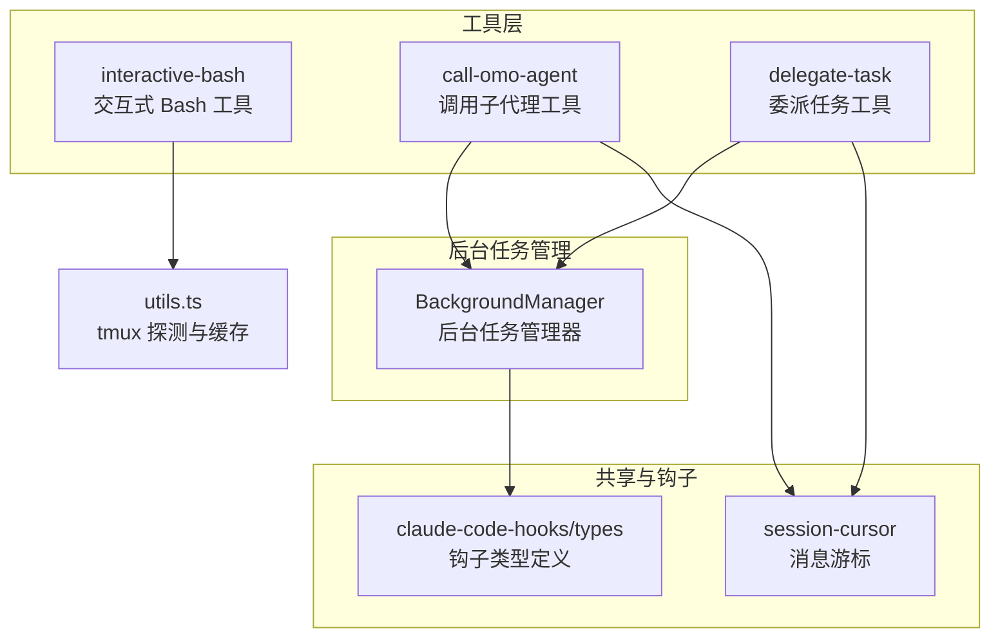
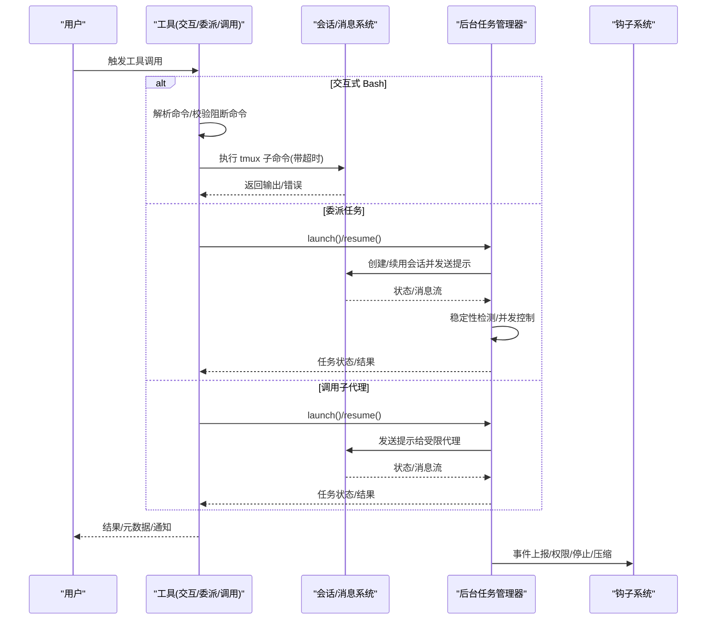
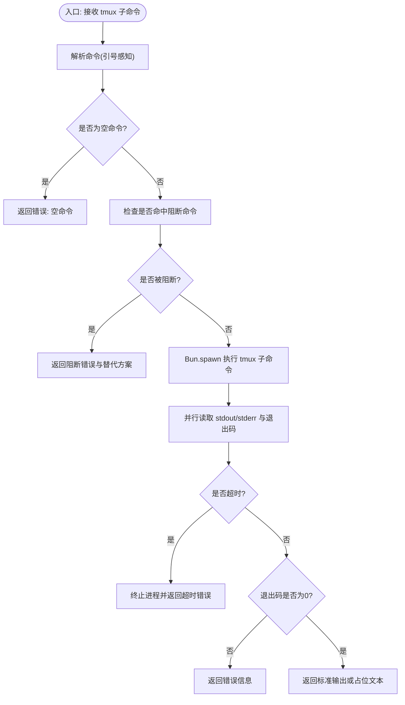
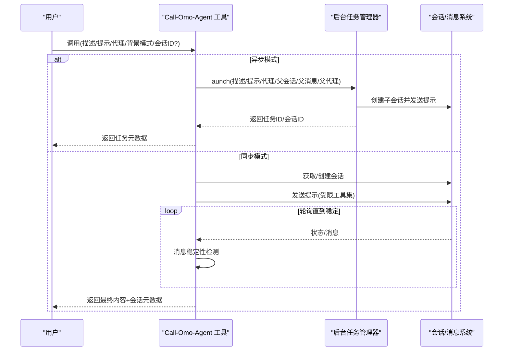
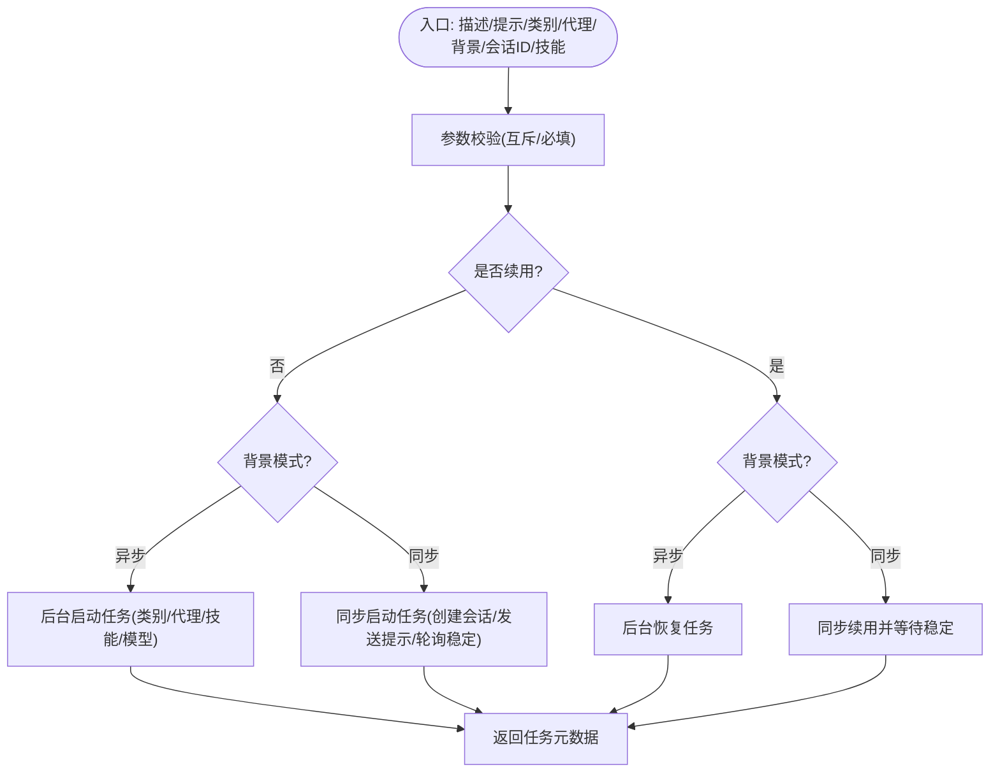
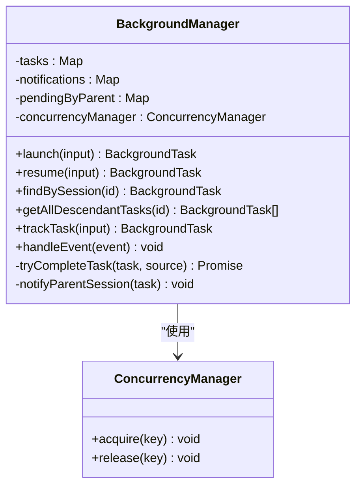
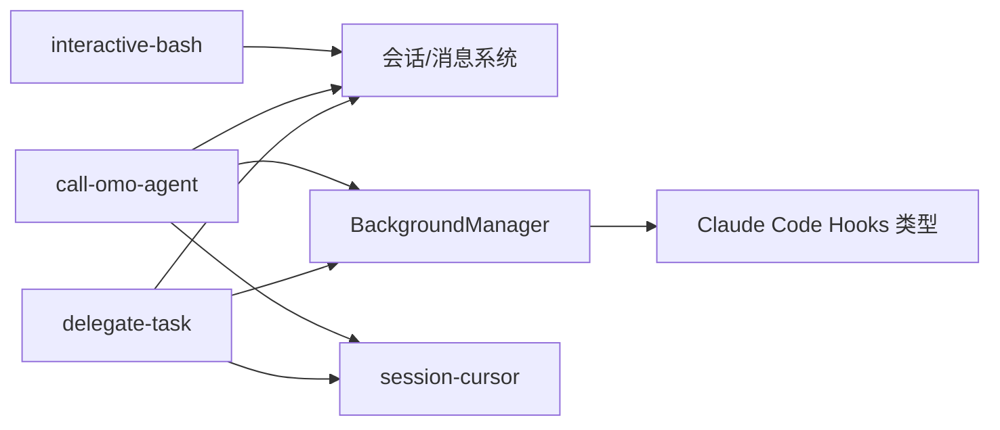

# 交互式工具

<cite>
**本文引用的文件**
- [src/tools/interactive-bash/index.ts](file://src/tools/interactive-bash/index.ts)
- [src/tools/interactive-bash/tools.ts](file://src/tools/interactive-bash/tools.ts)
- [src/tools/interactive-bash/constants.ts](file://src/tools/interactive-bash/constants.ts)
- [src/tools/interactive-bash/utils.ts](file://src/tools/interactive-bash/utils.ts)
- [src/tools/call-omo-agent/index.ts](file://src/tools/call-omo-agent/index.ts)
- [src/tools/call-omo-agent/tools.ts](file://src/tools/call-omo-agent/tools.ts)
- [src/tools/call-omo-agent/constants.ts](file://src/tools/call-omo-agent/constants.ts)
- [src/tools/delegate-task/index.ts](file://src/tools/delegate-task/index.ts)
- [src/tools/delegate-task/tools.ts](file://src/tools/delegate-task/tools.ts)
- [src/tools/delegate-task/constants.ts](file://src/tools/delegate-task/constants.ts)
- [src/features/background-agent/manager.ts](file://src/features/background-agent/manager.ts)
- [src/shared/session-cursor.ts](file://src/shared/session-cursor.ts)
- [src/hooks/claude-code-hooks/types.ts](file://src/hooks/claude-code-hooks/types.ts)
</cite>

## 目录
1. [简介](#简介)
2. [项目结构](#项目结构)
3. [核心组件](#核心组件)
4. [架构总览](#架构总览)
5. [详细组件分析](#详细组件分析)
6. [依赖关系分析](#依赖关系分析)
7. [性能考量](#性能考量)
8. [故障排查指南](#故障排查指南)
9. [结论](#结论)
10. [附录](#附录)

## 简介
本文件面向“交互式工具”的使用者与维护者，系统化阐述以下能力：
- 交互式 Bash 会话管理：会话启动、状态监控与资源清理
- Call-Omo-Agent 工具：代理调用机制与异步执行
- Delegate-Task 工具：任务委派与分类/直接代理两种模式
- 异步执行模式、错误处理与超时管理
- 实际使用场景、安全考虑与性能优化建议
- 与后台任务管理器的集成方式与最佳实践

## 项目结构
交互式工具相关代码主要位于 src/tools 下的三个工具模块，并与后台任务管理器、会话游标等共享模块协同工作。

**图表来源**
- [src/tools/interactive-bash/index.ts](file://src/tools/interactive-bash/index.ts#L1-L5)
- [src/tools/interactive-bash/utils.ts](file://src/tools/interactive-bash/utils.ts#L1-L72)
- [src/tools/call-omo-agent/tools.ts](file://src/tools/call-omo-agent/tools.ts#L1-L339)
- [src/tools/delegate-task/tools.ts](file://src/tools/delegate-task/tools.ts#L1-L582)
- [src/features/background-agent/manager.ts](file://src/features/background-agent/manager.ts#L1-L800)
- [src/shared/session-cursor.ts](file://src/shared/session-cursor.ts#L1-L86)
- [src/hooks/claude-code-hooks/types.ts](file://src/hooks/claude-code-hooks/types.ts#L1-L205)

**章节来源**
- [src/tools/interactive-bash/index.ts](file://src/tools/interactive-bash/index.ts#L1-L5)
- [src/tools/call-omo-agent/index.ts](file://src/tools/call-omo-agent/index.ts#L1-L4)
- [src/tools/delegate-task/index.ts](file://src/tools/delegate-task/index.ts#L1-L4)

## 核心组件
- 交互式 Bash 工具：基于 tmux 的一次性交互式命令执行，带超时与阻断命令保护
- Call-Omo-Agent 工具：以同步或异步方式调用受限子代理（explore/librarian），支持会话续用
- Delegate-Task 工具：支持按“类别配置”或“直接代理名”委派任务，支持同步/异步与会话续用
- 后台任务管理器：统一调度、并发控制、稳定性检测、通知与资源回收
- 消息游标：在同步模式下增量提取新消息，避免重复输出
- 钩子类型：与 Claude Code 钩子事件对接，用于权限决策、停止、压缩等

**章节来源**
- [src/tools/interactive-bash/tools.ts](file://src/tools/interactive-bash/tools.ts#L50-L127)
- [src/tools/call-omo-agent/tools.ts](file://src/tools/call-omo-agent/tools.ts#L34-L74)
- [src/tools/delegate-task/tools.ts](file://src/tools/delegate-task/tools.ts#L118-L132)
- [src/features/background-agent/manager.ts](file://src/features/background-agent/manager.ts#L52-L77)
- [src/shared/session-cursor.ts](file://src/shared/session-cursor.ts#L43-L77)
- [src/hooks/claude-code-hooks/types.ts](file://src/hooks/claude-code-hooks/types.ts#L6-L29)

## 架构总览
交互式工具通过统一的插件工具接口对外暴露，内部与会话管理、后台任务管理器、消息游标与钩子系统协作，形成“工具 -> 会话/任务 -> 输出/通知”的闭环。

**图表来源**
- [src/tools/interactive-bash/tools.ts](file://src/tools/interactive-bash/tools.ts#L55-L125)
- [src/tools/delegate-task/tools.ts](file://src/tools/delegate-task/tools.ts#L363-L396)
- [src/tools/call-omo-agent/tools.ts](file://src/tools/call-omo-agent/tools.ts#L98-L128)
- [src/features/background-agent/manager.ts](file://src/features/background-agent/manager.ts#L176-L214)
- [src/hooks/claude-code-hooks/types.ts](file://src/hooks/claude-code-hooks/types.ts#L31-L92)

## 详细组件分析

### 交互式 Bash 会话管理
- 功能要点
  - 仅接受 tmux 子命令（不带“tmux”前缀）
  - 内置阻断命令白名单，防止直接捕获面板/缓冲区等
  - 命令解析采用无外部依赖的引号感知分词器
  - 进程执行带超时，超时自动终止并返回错误
  - 支持后台预热 tmux 路径探测，减少首次延迟
- 关键行为
  - 若传入空命令或命中阻断命令，返回明确替代方案与说明
  - 并行读取 stdout/stderr，避免竞态；退出码非零即视为失败
  - 错误统一包装为字符串返回，便于上层工具处理
- 安全与限制
  - 严格限制可执行的 tmux 子命令集合
  - 通过超时与进程终止保障资源回收
- 性能与可用性
  - 缓存 tmux 可执行路径，避免重复查找
  - 超时默认值可配置

**图表来源**
- [src/tools/interactive-bash/tools.ts](file://src/tools/interactive-bash/tools.ts#L9-L48)
- [src/tools/interactive-bash/tools.ts](file://src/tools/interactive-bash/tools.ts#L55-L125)
- [src/tools/interactive-bash/constants.ts](file://src/tools/interactive-bash/constants.ts#L1-L19)
- [src/tools/interactive-bash/utils.ts](file://src/tools/interactive-bash/utils.ts#L62-L72)

**章节来源**
- [src/tools/interactive-bash/tools.ts](file://src/tools/interactive-bash/tools.ts#L50-L127)
- [src/tools/interactive-bash/constants.ts](file://src/tools/interactive-bash/constants.ts#L1-L19)
- [src/tools/interactive-bash/utils.ts](file://src/tools/interactive-bash/utils.ts#L1-L72)

### Call-Omo-Agent 工具
- 功能要点
  - 限定允许的子代理类型（explore、librarian）
  - 支持同步与异步两种运行模式
  - 异步模式通过后台任务管理器启动，返回任务标识与会话标识
  - 同步模式创建/复用会话，轮询稳定后提取最新消息内容
  - 支持会话续用（resume），保留完整上下文
- 关键行为
  - 异步：记录父会话、父消息、父代理，提交任务并返回元数据
  - 同步：创建子会话，发送提示，轮询会话状态与消息稳定性，提取 assistant/tool 消息
  - 统一使用消息游标增量提取，避免重复输出
- 错误处理
  - 参数校验失败返回明确错误
  - 会话创建/获取失败返回错误
  - 超时（默认 5 分钟）返回超时错误
  - 中止信号触发中止响应
- 使用建议
  - 复杂任务优先使用异步模式，配合后台输出工具查询进度
  - 需要连续对话或修复时使用 resume

**图表来源**
- [src/tools/call-omo-agent/tools.ts](file://src/tools/call-omo-agent/tools.ts#L56-L73)
- [src/tools/call-omo-agent/tools.ts](file://src/tools/call-omo-agent/tools.ts#L76-L128)
- [src/tools/call-omo-agent/tools.ts](file://src/tools/call-omo-agent/tools.ts#L130-L339)
- [src/features/background-agent/manager.ts](file://src/features/background-agent/manager.ts#L79-L217)
- [src/shared/session-cursor.ts](file://src/shared/session-cursor.ts#L43-L77)

**章节来源**
- [src/tools/call-omo-agent/tools.ts](file://src/tools/call-omo-agent/tools.ts#L34-L74)
- [src/tools/call-omo-agent/constants.ts](file://src/tools/call-omo-agent/constants.ts#L1-L8)
- [src/shared/session-cursor.ts](file://src/shared/session-cursor.ts#L43-L77)

### Delegate-Task 工具
- 功能要点
  - 两类委派模式：类别配置（Sisyphus-Junior）或直接代理名
  - 支持同步/异步运行，异步返回任务标识
  - 支持会话续用（resume），保留完整上下文
  - 技能合并与解析：用户技能 + 类别默认技能（去重）
  - 系统内容构建：技能内容 + 类别附加提示
- 关键行为
  - 异步：通过后台任务管理器启动，返回任务/会话标识
  - 同步：创建子会话，发送提示（含系统内容与受限工具集），轮询稳定性后提取最后 assistant 输出
  - 代理有效性校验：确保不可直接调用主代理
- 错误处理
  - 参数互斥校验（类别/代理二选一，除非续用）
  - 未知类别/代理返回错误
  - 会话创建/消息获取失败返回错误
  - 超时（默认 10 分钟）返回错误
- 使用建议
  - 大型复杂任务使用异步并行探索
  - 需要持续对话或迭代时使用 resume
  - 明确指定技能以提升任务质量

**图表来源**
- [src/tools/delegate-task/tools.ts](file://src/tools/delegate-task/tools.ts#L132-L136)
- [src/tools/delegate-task/tools.ts](file://src/tools/delegate-task/tools.ts#L149-L288)
- [src/tools/delegate-task/tools.ts](file://src/tools/delegate-task/tools.ts#L363-L582)
- [src/tools/delegate-task/constants.ts](file://src/tools/delegate-task/constants.ts#L324-L340)

**章节来源**
- [src/tools/delegate-task/tools.ts](file://src/tools/delegate-task/tools.ts#L118-L132)
- [src/tools/delegate-task/constants.ts](file://src/tools/delegate-task/constants.ts#L246-L340)

### 后台任务管理器（BackgroundManager）
- 功能要点
  - 统一创建/恢复任务，绑定父会话与消息
  - 并发控制：按代理/分组限制并发，避免资源争用
  - 稳定性检测：最小运行时间 + 消息稳定性阈值，防止过早完成
  - 事件驱动：监听会话空闲、删除等事件，原子化完成任务
  - 通知与提示：向父会话批量通知任务完成，支持 Toast 提示
  - 资源回收：释放并发槽、清理挂起队列、注销会话
- 关键行为
  - launch/resume：创建会话、发送提示（受限工具集）、注册并发
  - 轮询与事件：10 秒轮询 + 事件驱动双通道检测完成
  - tryCompleteTask：原子化完成，先释放并发再通知，避免竞态
- 最佳实践
  - 为不同代理设置合理的并发组，避免互相干扰
  - 利用稳定性检测避免“假空闲”提前完成
  - 使用批量通知减少冗余消息

**图表来源**
- [src/features/background-agent/manager.ts](file://src/features/background-agent/manager.ts#L52-L77)
- [src/features/background-agent/manager.ts](file://src/features/background-agent/manager.ts#L79-L217)
- [src/features/background-agent/manager.ts](file://src/features/background-agent/manager.ts#L461-L557)
- [src/features/background-agent/manager.ts](file://src/features/background-agent/manager.ts#L736-L764)

**章节来源**
- [src/features/background-agent/manager.ts](file://src/features/background-agent/manager.ts#L52-L800)

### 会话游标与增量消息提取
- 功能要点
  - 基于消息键（id/timestamp/index）跟踪上次消费位置
  - 在同步模式下仅提取新增消息，避免重复输出
  - 支持重置游标，清空所有会话状态
- 使用场景
  - 同步轮询中提取最新 assistant/tool 输出
  - 与后台任务管理器配合，保证通知一致性

**章节来源**
- [src/shared/session-cursor.ts](file://src/shared/session-cursor.ts#L43-L86)

### 钩子系统（Claude Code Hooks）
- 功能要点
  - 定义钩子事件（PreToolUse/PostToolUse/UserPromptSubmit/Stop/PreCompact）
  - 输入/输出结构体，支持权限决策、额外上下文注入、停止原因等
  - 与插件事件映射，用于权限控制、停止、压缩等
- 使用场景
  - 在工具前后插入权限校验与上下文注入
  - 控制会话生命周期与内容压缩

**章节来源**
- [src/hooks/claude-code-hooks/types.ts](file://src/hooks/claude-code-hooks/types.ts#L6-L186)

## 依赖关系分析
- 工具到后台任务管理器：Delegate-Task 与 Call-Omo-Agent 通过后台任务管理器统一调度
- 工具到会话系统：三类工具均与会话/消息系统交互，进行创建、提示、轮询与状态查询
- 工具到共享模块：同步模式依赖消息游标增量提取，异步模式依赖后台任务管理器通知
- 钩子系统：后台任务管理器在事件处理中与钩子类型定义协作

**图表来源**
- [src/tools/interactive-bash/tools.ts](file://src/tools/interactive-bash/tools.ts#L55-L125)
- [src/tools/call-omo-agent/tools.ts](file://src/tools/call-omo-agent/tools.ts#L98-L128)
- [src/tools/delegate-task/tools.ts](file://src/tools/delegate-task/tools.ts#L363-L396)
- [src/features/background-agent/manager.ts](file://src/features/background-agent/manager.ts#L176-L214)
- [src/shared/session-cursor.ts](file://src/shared/session-cursor.ts#L43-L77)
- [src/hooks/claude-code-hooks/types.ts](file://src/hooks/claude-code-hooks/types.ts#L31-L92)

**章节来源**
- [src/tools/interactive-bash/index.ts](file://src/tools/interactive-bash/index.ts#L1-L5)
- [src/tools/call-omo-agent/index.ts](file://src/tools/call-omo-agent/index.ts#L1-L4)
- [src/tools/delegate-task/index.ts](file://src/tools/delegate-task/index.ts#L1-L4)

## 性能考量
- 并发控制
  - 通过并发管理器限制同一代理/分组的并发数，避免资源争用
- 轮询策略
  - 后台任务管理器 10 秒轮询一次，结合事件驱动（session.idle/delete）降低无效轮询
- 稳定性检测
  - 最小运行时间 + 消息计数稳定阈值，避免“假空闲”提前完成
- I/O 并行
  - 交互式 Bash 并行读取 stdout/stderr，减少等待时间
- 超时与资源回收
  - 统一超时策略与进程终止，防止僵尸进程与资源泄漏
- 缓存与预热
  - tmux 路径缓存与后台预热，降低首次调用延迟

[本节为通用性能建议，无需特定文件引用]

## 故障排查指南
- 交互式 Bash
  - 症状：命令被阻断或返回空输出
  - 排查：确认命令未命中阻断列表；检查 tmux 是否安装且可执行
  - 超时：调整超时阈值或改用一次性命令（Bash 工具）
- Call-Omo-Agent
  - 症状：代理不存在或未注册
  - 排查：确认代理名称正确且为可调用子代理；检查工具限制
  - 超时：延长最大轮询时间或切换为异步模式
- Delegate-Task
  - 症状：类别/代理冲突或未知
  - 排查：二选一提供类别或代理；检查可用代理列表
  - 技能缺失：确认技能名称存在或使用内置技能
- 后台任务管理器
  - 症状：任务长时间不完成
  - 排查：检查会话是否处于空闲但无有效输出；确认稳定性阈值与最小运行时间
  - 通知失败：关注并发槽释放与事件处理日志

**章节来源**
- [src/tools/interactive-bash/tools.ts](file://src/tools/interactive-bash/tools.ts#L66-L90)
- [src/tools/call-omo-agent/tools.ts](file://src/tools/call-omo-agent/tools.ts#L200-L205)
- [src/tools/delegate-task/tools.ts](file://src/tools/delegate-task/tools.ts#L290-L296)
- [src/features/background-agent/manager.ts](file://src/features/background-agent/manager.ts#L493-L531)

## 结论
交互式工具围绕“会话/任务”两条主线展开：交互式 Bash 提供轻量的 tmux 交互能力；Call-Omo-Agent 与 Delegate-Task 则通过后台任务管理器实现可靠的异步执行与状态监控。通过并发控制、稳定性检测与事件驱动机制，系统在复杂任务场景下仍能保持高可靠与高性能。建议在大型任务中优先采用异步模式，并结合 resume 与技能合并提升迭代效率与质量。

[本节为总结性内容，无需特定文件引用]

## 附录
- 实际使用场景
  - 交互式 Bash：需要与 TUI 应用交互（如 vim、htop、pudb）时使用
  - Call-Omo-Agent：快速调用受限子代理执行检索/资料整理等任务
  - Delegate-Task：按类别委派复杂工程任务，或直接委派给特定代理
- 安全考虑
  - 严格限制 tmux 命令集合，避免直接访问缓冲区
  - 代理工具集受限，防止危险工具调用
  - 会话上下文隔离与父会话绑定，避免越权
- 性能优化建议
  - 使用异步模式并行探索多个独立问题
  - 合理设置并发组，避免同类代理互相影响
  - 利用稳定性检测与事件驱动，减少无效轮询
  - 预热 tmux 路径，缩短首次调用延迟

[本节为通用建议，无需特定文件引用]