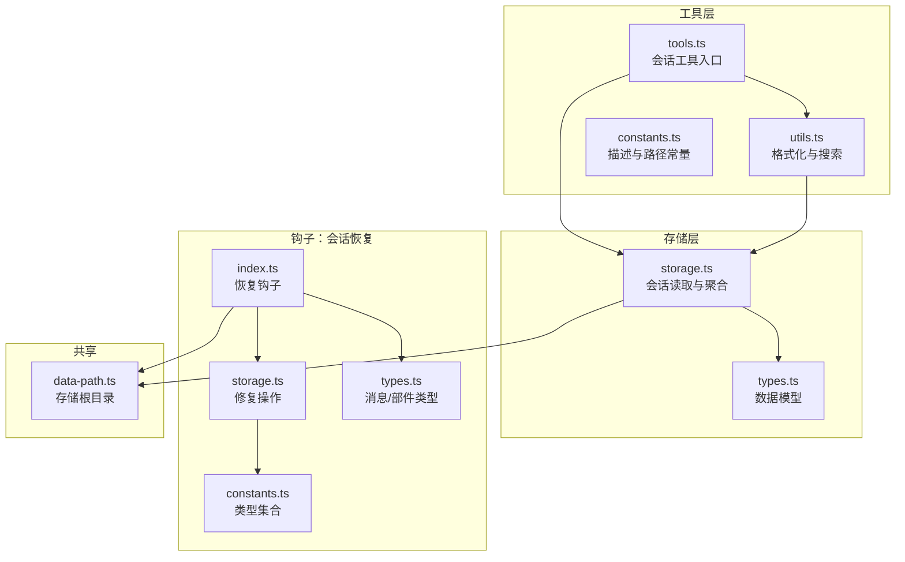
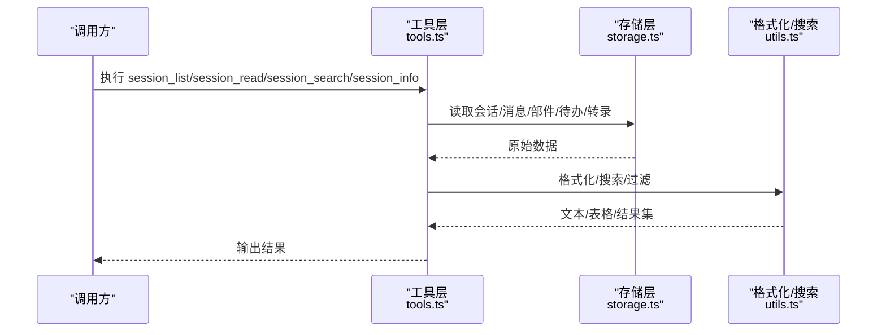
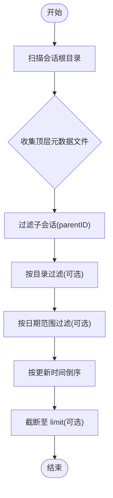
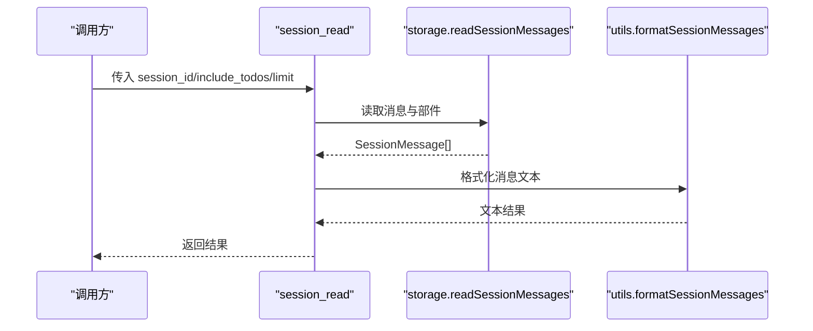
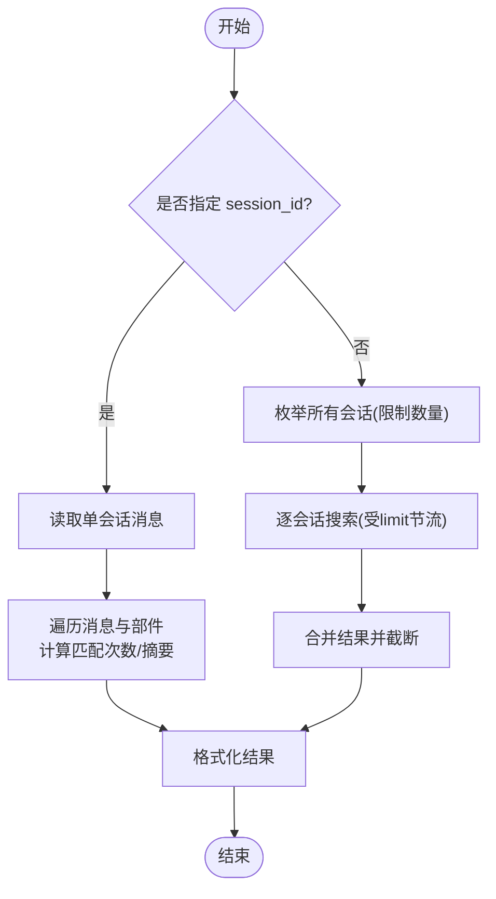
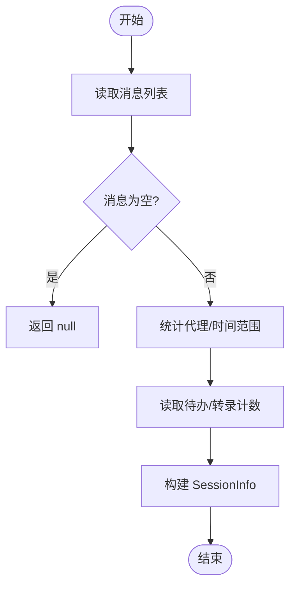
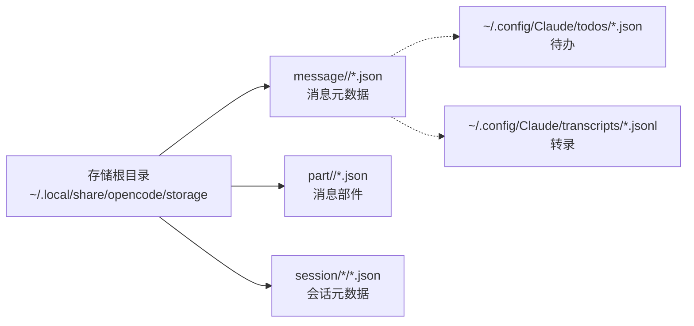
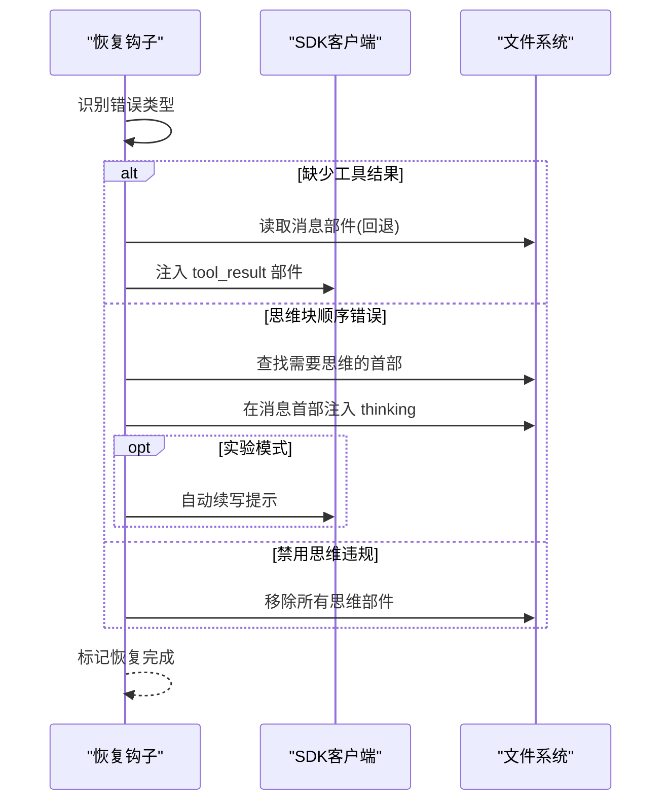
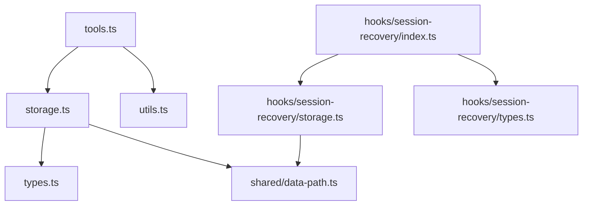

# 会话管理工具

<cite>
**本文引用的文件**
- [src/tools/session-manager/index.ts](file://src/tools/session-manager/index.ts)
- [src/tools/session-manager/storage.ts](file://src/tools/session-manager/storage.ts)
- [src/tools/session-manager/types.ts](file://src/tools/session-manager/types.ts)
- [src/tools/session-manager/utils.ts](file://src/tools/session-manager/utils.ts)
- [src/tools/session-manager/tools.ts](file://src/tools/session-manager/tools.ts)
- [src/tools/session-manager/constants.ts](file://src/tools/session-manager/constants.ts)
- [src/shared/data-path.ts](file://src/shared/data-path.ts)
- [src/hooks/session-recovery/index.ts](file://src/hooks/session-recovery/index.ts)
- [src/hooks/session-recovery/storage.ts](file://src/hooks/session-recovery/storage.ts)
- [src/hooks/session-recovery/constants.ts](file://src/hooks/session-recovery/constants.ts)
- [src/hooks/session-recovery/types.ts](file://src/hooks/session-recovery/types.ts)
</cite>

## 目录
1. [简介](#简介)
2. [项目结构](#项目结构)
3. [核心组件](#核心组件)
4. [架构总览](#架构总览)
5. [详细组件分析](#详细组件分析)
6. [依赖关系分析](#依赖关系分析)
7. [性能考量](#性能考量)
8. [故障排查指南](#故障排查指南)
9. [结论](#结论)
10. [附录](#附录)

## 简介
本文件系统性阐述 OpenCode 会话管理工具的设计与实现，覆盖会话生命周期管理的关键能力：会话列表（session_list）、会话读取（session_read）、会话搜索（session_search）与会话信息（session_info）。文档重点说明：
- 会话存储机制与数据持久化策略（消息、部分、待办、转录）
- 并发访问控制与错误恢复机制
- 会话状态跟踪与历史记录管理
- 实际使用场景、性能优化与最佳实践

## 项目结构
会话管理功能主要由“工具层”和“存储层”构成，配合钩子（hook）实现错误恢复与自动续写；数据路径统一由共享模块提供。

**图表来源**
- [src/tools/session-manager/tools.ts](file://src/tools/session-manager/tools.ts#L1-L147)
- [src/tools/session-manager/storage.ts](file://src/tools/session-manager/storage.ts#L1-L239)
- [src/tools/session-manager/utils.ts](file://src/tools/session-manager/utils.ts#L1-L200)
- [src/tools/session-manager/types.ts](file://src/tools/session-manager/types.ts#L1-L100)
- [src/hooks/session-recovery/index.ts](file://src/hooks/session-recovery/index.ts#L1-L433)
- [src/hooks/session-recovery/storage.ts](file://src/hooks/session-recovery/storage.ts#L1-L391)
- [src/shared/data-path.ts](file://src/shared/data-path.ts#L1-L23)

**章节来源**
- [src/tools/session-manager/index.ts](file://src/tools/session-manager/index.ts#L1-L4)
- [src/tools/session-manager/tools.ts](file://src/tools/session-manager/tools.ts#L1-L147)
- [src/tools/session-manager/storage.ts](file://src/tools/session-manager/storage.ts#L1-L239)
- [src/tools/session-manager/utils.ts](file://src/tools/session-manager/utils.ts#L1-L200)
- [src/tools/session-manager/types.ts](file://src/tools/session-manager/types.ts#L1-L100)
- [src/hooks/session-recovery/index.ts](file://src/hooks/session-recovery/index.ts#L1-L433)
- [src/hooks/session-recovery/storage.ts](file://src/hooks/session-recovery/storage.ts#L1-L391)
- [src/shared/data-path.ts](file://src/shared/data-path.ts#L1-L23)

## 核心组件
- 工具入口与命令定义：提供 session_list、session_read、session_search、session_info 四个工具，封装参数校验、执行与错误返回。
- 存储与聚合：负责扫描会话目录、读取消息与部件、统计会话信息、读取待办与转录。
- 格式化与搜索：将原始数据格式化为表格或文本视图；在单会话或多会话范围内进行全文检索。
- 钩子恢复：检测并修复“缺少工具结果”“思维块顺序错误”“禁用思维违规”等典型问题，必要时自动续写。
- 数据模型：统一的消息、部件、会话元数据与查询参数类型。

**章节来源**
- [src/tools/session-manager/tools.ts](file://src/tools/session-manager/tools.ts#L29-L147)
- [src/tools/session-manager/storage.ts](file://src/tools/session-manager/storage.ts#L11-L239)
- [src/tools/session-manager/utils.ts](file://src/tools/session-manager/utils.ts#L4-L200)
- [src/hooks/session-recovery/index.ts](file://src/hooks/session-recovery/index.ts#L321-L433)

## 架构总览
会话管理采用“工具-存储-钩子”的分层设计：
- 工具层接收用户输入，调用存储层完成数据读取与聚合，再通过格式化工具输出人类可读结果。
- 存储层基于本地文件系统组织数据，按会话与消息维度分层存放，支持快速检索与统计。
- 钩子层在运行期对异常进行识别与修复，保障会话连续性与一致性。

**图表来源**
- [src/tools/session-manager/tools.ts](file://src/tools/session-manager/tools.ts#L29-L147)
- [src/tools/session-manager/storage.ts](file://src/tools/session-manager/storage.ts#L11-L239)
- [src/tools/session-manager/utils.ts](file://src/tools/session-manager/utils.ts#L4-L200)

## 详细组件分析

### 会话列表（session_list）
- 功能要点
  - 列出主会话（排除子会话），支持按项目路径、日期范围与数量限制筛选。
  - 默认使用当前工作目录作为项目路径，未指定时回退到 process.cwd()。
- 关键流程
  - 扫描会话存储根目录，收集顶层 .json 元数据文件，过滤 parentID 的子会话。
  - 可选按目录过滤与时间范围过滤，最终按更新时间倒序排序。
- 性能与并发
  - 使用同步/异步混合读取，注意在大目录下可能产生 I/O 压力；建议配合 limit 控制输出规模。
- 错误处理
  - 目录不存在或读取失败时返回空列表或错误提示。

**图表来源**
- [src/tools/session-manager/storage.ts](file://src/tools/session-manager/storage.ts#L11-L46)
- [src/tools/session-manager/tools.ts](file://src/tools/session-manager/tools.ts#L37-L56)

**章节来源**
- [src/tools/session-manager/tools.ts](file://src/tools/session-manager/tools.ts#L29-L56)
- [src/tools/session-manager/storage.ts](file://src/tools/session-manager/storage.ts#L11-L46)

### 会话读取（session_read）
- 功能要点
  - 读取指定会话的所有消息及其部件，支持限制消息数量、选择是否包含待办与转录。
  - 若会话不存在，返回明确提示。
- 关键流程
  - 定位消息目录，遍历 .json 文件构建消息数组。
  - 按消息时间与 ID 排序，截断至 limit。
  - 可选读取待办与转录条目数。
- 性能与并发
  - 大会话读取涉及多次文件读取，建议合理设置 limit。
- 错误处理
  - 目录不存在或读取异常时返回错误字符串。

**图表来源**
- [src/tools/session-manager/tools.ts](file://src/tools/session-manager/tools.ts#L58-L85)
- [src/tools/session-manager/storage.ts](file://src/tools/session-manager/storage.ts#L102-L138)
- [src/tools/session-manager/utils.ts](file://src/tools/session-manager/utils.ts#L44-L84)

**章节来源**
- [src/tools/session-manager/tools.ts](file://src/tools/session-manager/tools.ts#L58-L85)
- [src/tools/session-manager/storage.ts](file://src/tools/session-manager/storage.ts#L102-L138)
- [src/tools/session-manager/utils.ts](file://src/tools/session-manager/utils.ts#L44-L84)

### 会话搜索（session_search）
- 功能要点
  - 支持在单会话或全库范围内搜索；默认限制结果数量，超时保护。
  - 支持大小写敏感与结果上限。
- 关键流程
  - 单会话搜索：直接遍历消息与部件，统计匹配次数并生成摘要片段。
  - 全库搜索：限定扫描会话数量，逐会话增量收集结果，达到上限即停止。
  - 统一格式化输出。
- 性能与并发
  - 设置超时阈值避免长时间阻塞；限制扫描会话数量以平衡覆盖率与性能。
- 错误处理
  - 捕获异常并返回错误字符串。

**图表来源**
- [src/tools/session-manager/tools.ts](file://src/tools/session-manager/tools.ts#L87-L126)
- [src/tools/session-manager/utils.ts](file://src/tools/session-manager/utils.ts#L149-L199)

**章节来源**
- [src/tools/session-manager/tools.ts](file://src/tools/session-manager/tools.ts#L87-L126)
- [src/tools/session-manager/utils.ts](file://src/tools/session-manager/utils.ts#L149-L199)

### 会话信息（session_info）
- 功能要点
  - 聚合会话统计信息：消息总数、首次/末次消息时间、使用过的代理、是否存在待办与转录、转录条目数等。
- 关键流程
  - 读取消息列表，遍历统计代理集合与时间边界。
  - 读取待办与转录条目数，生成结构化信息对象。
- 错误处理
  - 无消息则返回空，避免空指针。

**图表来源**
- [src/tools/session-manager/storage.ts](file://src/tools/session-manager/storage.ts#L207-L239)
- [src/tools/session-manager/utils.ts](file://src/tools/session-manager/utils.ts#L86-L106)

**章节来源**
- [src/tools/session-manager/storage.ts](file://src/tools/session-manager/storage.ts#L207-L239)
- [src/tools/session-manager/utils.ts](file://src/tools/session-manager/utils.ts#L86-L106)

### 存储机制与数据持久化
- 存储布局
  - 会话根目录：message、part、session 三类子目录分别存放消息元数据、消息部件与会话元数据。
  - 待办与转录：待办位于 Claude 配置目录下的 todos；转录位于 transcripts。
- 读取策略
  - 会话列表：扫描 session 根目录，解析顶层 .json 元数据，过滤子会话。
  - 会话读取：定位消息目录，读取每个消息的元数据与部件，按时间与 ID 排序。
  - 会话信息：汇总消息统计与外部数据源（待办/转录）。
- 并发与一致性
  - 当前实现以文件系统为基础，未见显式的锁机制；在高并发写入场景下需谨慎评估一致性风险。

**图表来源**
- [src/shared/data-path.ts](file://src/shared/data-path.ts#L20-L22)
- [src/tools/session-manager/constants.ts](file://src/tools/session-manager/constants.ts#L5-L10)
- [src/hooks/session-recovery/constants.ts](file://src/hooks/session-recovery/constants.ts#L4-L6)

**章节来源**
- [src/shared/data-path.ts](file://src/shared/data-path.ts#L1-L23)
- [src/tools/session-manager/constants.ts](file://src/tools/session-manager/constants.ts#L1-L11)
- [src/hooks/session-recovery/constants.ts](file://src/hooks/session-recovery/constants.ts#L1-L11)

### 错误恢复机制（会话恢复钩子）
- 错误类型识别
  - 缺少工具结果（tool_result_missing）
  - 思维块顺序错误（thinking_block_order）
  - 禁用思维违规（thinking_disabled_violation）
- 修复策略
  - 注入“已取消”工具结果，使对话链路可继续。
  - 在消息首部注入思维部件，或移除非法思维部件。
  - 对空内容消息注入占位文本，确保消息完整性。
- 自动续写
  - 在实验模式开启时，修复后自动向会话追加提示以继续任务。
- 并发与状态
  - 使用集合标记正在处理的 assistant 消息 ID，避免重复处理。
  - 提供回调通知“开始恢复/恢复完成”，便于上层状态管理。

**图表来源**
- [src/hooks/session-recovery/index.ts](file://src/hooks/session-recovery/index.ts#L125-L433)
- [src/hooks/session-recovery/storage.ts](file://src/hooks/session-recovery/storage.ts#L155-L391)

**章节来源**
- [src/hooks/session-recovery/index.ts](file://src/hooks/session-recovery/index.ts#L1-L433)
- [src/hooks/session-recovery/storage.ts](file://src/hooks/session-recovery/storage.ts#L1-L391)

### 数据模型与类型
- 消息与部件
  - SessionMessage：包含角色、代理、时间戳与部件数组。
  - MessagePart：支持 text、thinking、tool、tool_use、tool_result 等类型。
- 会话信息
  - SessionInfo：消息数、时间范围、代理集合、待办/转录存在性与计数。
- 查询参数
  - SessionListArgs、SessionReadArgs、SessionSearchArgs、SessionInfoArgs：约束工具参数。
- 存储部件
  - StoredMessageMeta、StoredPart 等：用于恢复钩子的内部存储结构。

**章节来源**
- [src/tools/session-manager/types.ts](file://src/tools/session-manager/types.ts#L1-L100)
- [src/hooks/session-recovery/types.ts](file://src/hooks/session-recovery/types.ts#L1-L99)

## 依赖关系分析
- 工具层依赖存储层与格式化层；存储层依赖共享数据路径模块。
- 钩子层独立于工具层，但共享相同的存储常量与类型定义。
- 各层之间耦合度低，职责清晰，便于扩展与维护。

**图表来源**
- [src/tools/session-manager/tools.ts](file://src/tools/session-manager/tools.ts#L1-L18)
- [src/tools/session-manager/storage.ts](file://src/tools/session-manager/storage.ts#L1-L6)
- [src/tools/session-manager/utils.ts](file://src/tools/session-manager/utils.ts#L1-L2)
- [src/shared/data-path.ts](file://src/shared/data-path.ts#L1-L23)
- [src/hooks/session-recovery/index.ts](file://src/hooks/session-recovery/index.ts#L1-L18)
- [src/hooks/session-recovery/storage.ts](file://src/hooks/session-recovery/storage.ts#L1-L4)
- [src/hooks/session-recovery/types.ts](file://src/hooks/session-recovery/types.ts#L1-L4)

**章节来源**
- [src/tools/session-manager/tools.ts](file://src/tools/session-manager/tools.ts#L1-L18)
- [src/tools/session-manager/storage.ts](file://src/tools/session-manager/storage.ts#L1-L6)
- [src/shared/data-path.ts](file://src/shared/data-path.ts#L1-L23)
- [src/hooks/session-recovery/index.ts](file://src/hooks/session-recovery/index.ts#L1-L18)

## 性能考量
- I/O 优化
  - 会话列表与搜索默认限制扫描数量与结果数量，避免全库扫描带来的性能开销。
  - 会话读取支持 limit 截断，减少渲染压力。
- 超时与限流
  - 搜索操作设置超时阈值，防止长时间阻塞。
- 存储布局
  - 将消息与部件分离，有利于按需加载与缓存热点消息。
- 并发访问
  - 文件系统读取为默认并发模型；在高并发写入场景建议引入应用级锁或重试策略。

[本节为通用指导，无需列出具体文件来源]

## 故障排查指南
- 会话不存在
  - 现象：session_read 或 session_info 返回“未找到”。
  - 排查：确认 session_id 是否正确；检查消息目录是否存在。
- 搜索无结果
  - 现象：session_search 返回“未找到”。
  - 排查：确认查询大小写设置；尝试扩大 limit；检查是否限定了 session_id。
- 恢复失败
  - 现象：恢复钩子日志显示“恢复失败”。
  - 排查：检查错误类型识别是否命中；确认 SDK 客户端可用；查看文件系统写入权限。
- 性能问题
  - 现象：列表/搜索响应缓慢。
  - 排查：降低 limit；关闭全库搜索；优化磁盘 I/O（SSD/缓存）。

**章节来源**
- [src/tools/session-manager/tools.ts](file://src/tools/session-manager/tools.ts#L68-L83)
- [src/hooks/session-recovery/index.ts](file://src/hooks/session-recovery/index.ts#L413-L423)

## 结论
会话管理工具通过清晰的分层设计实现了对会话生命周期的完整覆盖：从列表、读取、搜索到信息聚合，并辅以钩子恢复机制提升稳定性。结合合理的参数限制与超时策略，可在保证性能的同时满足日常开发与调试需求。建议在生产环境中配合监控与重试策略，进一步增强可靠性。

[本节为总结性内容，无需列出具体文件来源]

## 附录
- 最佳实践
  - 使用 session_list 获取目标会话 ID，再用 session_read 读取详情。
  - 使用 session_search 快速定位关键词，必要时缩小到特定会话。
  - 在大规模会话场景中，优先使用日期范围与 limit 参数。
  - 对异常会话启用恢复钩子，必要时开启自动续写以提高效率。
- 常见场景
  - 快速回顾：session_list + session_info
  - 问题定位：session_search + session_read
  - 历史审计：按日期范围筛选 + 读取消息与转录

[本节为通用指导，无需列出具体文件来源]