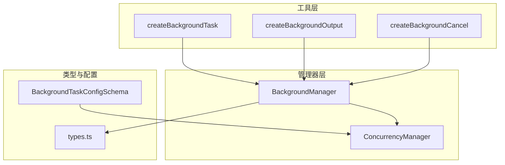
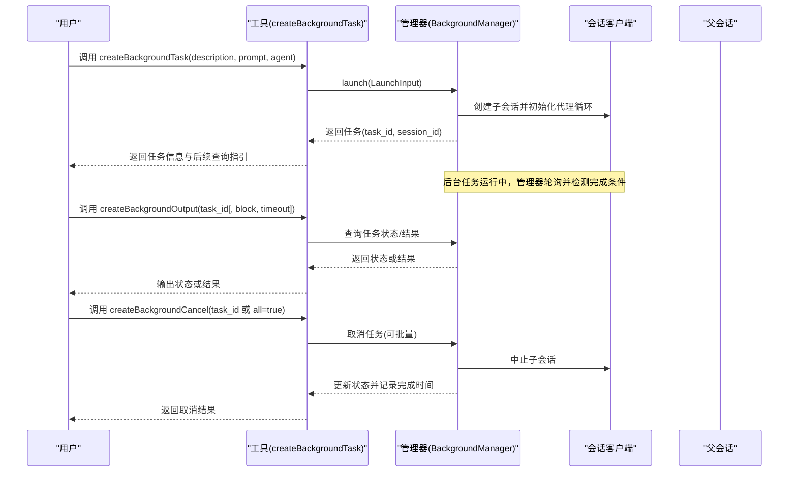
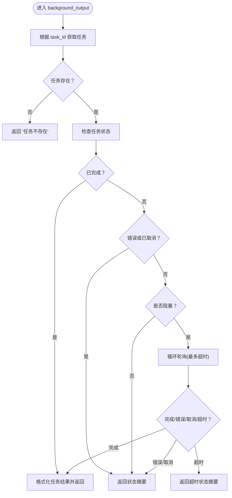
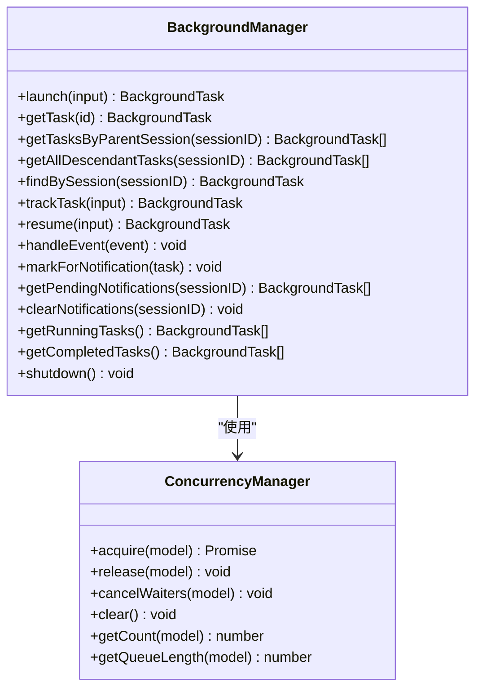
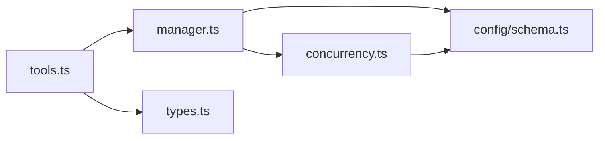

# 后台任务工具

<cite>
**本文引用的文件**
- [src/tools/background-task/index.ts](file://src/tools/background-task/index.ts)
- [src/tools/background-task/tools.ts](file://src/tools/background-task/tools.ts)
- [src/tools/background-task/types.ts](file://src/tools/background-task/types.ts)
- [src/tools/background-task/constants.ts](file://src/tools/background-task/constants.ts)
- [src/features/background-agent/index.ts](file://src/features/background-agent/index.ts)
- [src/features/background-agent/manager.ts](file://src/features/background-agent/manager.ts)
- [src/features/background-agent/concurrency.ts](file://src/features/background-agent/concurrency.ts)
- [src/features/background-agent/types.ts](file://src/features/background-agent/types.ts)
- [src/config/schema.ts](file://src/config/schema.ts)
</cite>

## 目录
1. [简介](#简介)
2. [项目结构](#项目结构)
3. [核心组件](#核心组件)
4. [架构总览](#架构总览)
5. [详细组件分析](#详细组件分析)
6. [依赖关系分析](#依赖关系分析)
7. [性能考量](#性能考量)
8. [故障排查指南](#故障排查指南)
9. [结论](#结论)
10. [附录：使用示例与最佳实践](#附录使用示例与最佳实践)

## 简介
本文件系统性阐述后台任务工具的设计与实现，重点覆盖以下内容：
- 后台任务的创建、执行与取消机制
- background_output 与 background_cancel 工具的功能特性与使用方式
- 后台任务管理器与工具系统的集成路径
- 任务生命周期管理、资源分配与并发控制策略
- 实际使用示例、性能监控与故障恢复机制
- 最佳实践与常见问题解决方案

## 项目结构
后台任务工具位于 tools 子模块中，核心由三个工具函数组成：创建后台任务、查询输出、取消任务；其背后由后台任务管理器统一调度与状态维护。

图表来源
- [src/tools/background-task/tools.ts](file://src/tools/background-task/tools.ts#L51-L119)
- [src/tools/background-task/tools.ts](file://src/tools/background-task/tools.ts#L303-L367)
- [src/tools/background-task/tools.ts](file://src/tools/background-task/tools.ts#L369-L438)
- [src/features/background-agent/manager.ts](file://src/features/background-agent/manager.ts#L52-L77)
- [src/features/background-agent/concurrency.ts](file://src/features/background-agent/concurrency.ts#L15-L22)
- [src/config/schema.ts](file://src/config/schema.ts#L297-L303)

章节来源
- [src/tools/background-task/index.ts](file://src/tools/background-task/index.ts#L1-L8)
- [src/tools/background-task/tools.ts](file://src/tools/background-task/tools.ts#L1-L439)
- [src/features/background-agent/index.ts](file://src/features/background-agent/index.ts#L1-L3)

## 核心组件
- 工具定义与导出
  - createBackgroundTask：创建后台任务，返回任务标识与会话标识，并在完成后通知父会话
  - createBackgroundOutput：查询后台任务状态或结果，支持阻塞等待与超时控制
  - createBackgroundCancel：取消单个或全部运行中的后台任务
- 后台任务管理器 BackgroundManager
  - 统一调度、状态跟踪、完成通知、过期清理、空闲检测与稳定性检测
- 并发控制器 ConcurrencyManager
  - 基于模型/提供商/默认限制的任务并发配额与排队机制
- 类型与配置
  - BackgroundTask、LaunchInput、ResumeInput 等类型定义
  - BackgroundTaskConfigSchema 提供并发与空闲超时等配置项

章节来源
- [src/tools/background-task/tools.ts](file://src/tools/background-task/tools.ts#L51-L119)
- [src/tools/background-task/tools.ts](file://src/tools/background-task/tools.ts#L303-L367)
- [src/tools/background-task/tools.ts](file://src/tools/background-task/tools.ts#L369-L438)
- [src/features/background-agent/manager.ts](file://src/features/background-agent/manager.ts#L52-L77)
- [src/features/background-agent/concurrency.ts](file://src/features/background-agent/concurrency.ts#L15-L39)
- [src/features/background-agent/types.ts](file://src/features/background-agent/types.ts#L1-L65)
- [src/config/schema.ts](file://src/config/schema.ts#L297-L303)

## 架构总览
后台任务工具通过工具函数与后台任务管理器解耦协作，工具负责参数校验与用户交互，管理器负责任务生命周期与资源控制。

图表来源
- [src/tools/background-task/tools.ts](file://src/tools/background-task/tools.ts#L51-L119)
- [src/tools/background-task/tools.ts](file://src/tools/background-task/tools.ts#L303-L367)
- [src/tools/background-task/tools.ts](file://src/tools/background-task/tools.ts#L369-L438)
- [src/features/background-agent/manager.ts](file://src/features/background-agent/manager.ts#L79-L217)

## 详细组件分析

### 工具：后台任务创建（background_task）
- 功能要点
  - 参数校验：必须提供 agent
  - 解析父会话上下文（父代理、父模型）用于通知与一致性
  - 创建子会话并启动代理循环（fire-and-forget），避免阻塞主流程
  - 记录任务元数据（任务ID、会话ID、描述、代理、开始时间、并发键）
  - 触发批处理通知队列，便于汇总完成提醒
- 关键行为
  - 使用 prompt() 初始化代理循环，确保任务进入稳定运行态
  - 对错误进行兜底处理：标记为 error 并释放并发槽位
  - 通过 metadata 回调向调用方提供会话级元信息

章节来源
- [src/tools/background-task/tools.ts](file://src/tools/background-task/tools.ts#L51-L119)
- [src/features/background-agent/manager.ts](file://src/features/background-agent/manager.ts#L79-L217)

### 工具：后台任务输出（background_output）
- 功能要点
  - 支持非阻塞即时查询与阻塞等待两种模式
  - 超时控制（最大60秒，默认60秒）
  - 结果格式化：提取所有 assistant 与 tool 消息，拼接文本内容
  - 状态展示：任务ID、描述、代理、状态、耗时、会话ID、最后工具调用、最后消息预览等
- 关键行为
  - 已完成：直接返回结果
  - 错误/取消：返回状态摘要
  - 非阻塞且仍在运行：返回状态摘要
  - 阻塞：每秒轮询，直至完成、错误、取消或超时

图表来源
- [src/tools/background-task/tools.ts](file://src/tools/background-task/tools.ts#L303-L367)

章节来源
- [src/tools/background-task/tools.ts](file://src/tools/background-task/tools.ts#L303-L367)

### 工具：后台任务取消（background_cancel）
- 功能要点
  - 单个取消：仅允许对 running 状态的任务取消
  - 批量取消：遍历指定会话下的所有后代任务，筛选 running 任务
  - 取消流程：先向会话发送中止请求，再更新本地状态与完成时间
- 关键行为
  - all=true 时，自动发现并中止所有运行中的后代任务
  - 对异常进行容错处理，避免影响主流程

章节来源
- [src/tools/background-task/tools.ts](file://src/tools/background-task/tools.ts#L369-L438)
- [src/features/background-agent/manager.ts](file://src/features/background-agent/manager.ts#L233-L244)

### 后台任务管理器（BackgroundManager）
- 生命周期管理
  - 启动：创建子会话、初始化代理循环、登记任务、启动轮询
  - 运行：轮询会话状态、消息数量稳定性检测、空闲事件检测、待办事项检测
  - 完成：原子化标记完成、释放并发槽位、触发通知、清理内存
  - 清理：过期任务清理（30分钟）、空闲超时中断（默认3分钟，可配置）
- 通知机制
  - 任务完成时向父会话发送系统提醒，支持“全部完成”与“单个完成”两类通知
  - 批处理通知队列，按父会话聚合，减少重复提示
- 稳定性与鲁棒性
  - 空闲事件与消息稳定性双重保障，避免过早完成
  - 待办事项未完成时延迟完成，确保工作闭环
  - 异常兜底：错误时标记 error 并释放并发槽位

图表来源
- [src/features/background-agent/manager.ts](file://src/features/background-agent/manager.ts#L52-L77)
- [src/features/background-agent/concurrency.ts](file://src/features/background-agent/concurrency.ts#L15-L22)

章节来源
- [src/features/background-agent/manager.ts](file://src/features/background-agent/manager.ts#L79-L217)
- [src/features/background-agent/manager.ts](file://src/features/background-agent/manager.ts#L444-L557)
- [src/features/background-agent/manager.ts](file://src/features/background-agent/manager.ts#L577-L631)
- [src/features/background-agent/manager.ts](file://src/features/background-agent/manager.ts#L668-L703)
- [src/features/background-agent/manager.ts](file://src/features/background-agent/manager.ts#L736-L764)
- [src/features/background-agent/manager.ts](file://src/features/background-agent/manager.ts#L766-L890)
- [src/features/background-agent/manager.ts](file://src/features/background-agent/manager.ts#L913-L990)
- [src/features/background-agent/manager.ts](file://src/features/background-agent/manager.ts#L992-L1106)
- [src/features/background-agent/manager.ts](file://src/features/background-agent/manager.ts#L1113-L1135)

### 并发控制（ConcurrencyManager）
- 优先级与配额
  - 模型级优先于提供商级，提供商级优先于默认值
  - 0 表示无限制（Infinity）
- 排队与释放
  - 达到上限时排队等待，有槽位释放时优先唤醒下一个等待者
  - 释放时优先移交而非自减，避免饥饿
- 清理与退出
  - 退出时取消所有等待者，防止插件卸载后线程悬挂

章节来源
- [src/features/background-agent/concurrency.ts](file://src/features/background-agent/concurrency.ts#L24-L39)
- [src/features/background-agent/concurrency.ts](file://src/features/background-agent/concurrency.ts#L53-L69)
- [src/features/background-agent/concurrency.ts](file://src/features/background-agent/concurrency.ts#L79-L94)
- [src/features/background-agent/concurrency.ts](file://src/features/background-agent/concurrency.ts#L99-L110)
- [src/features/background-agent/concurrency.ts](file://src/features/background-agent/concurrency.ts#L116-L122)
- [src/config/schema.ts](file://src/config/schema.ts#L297-L303)

### 类型与配置
- 任务状态与进度
  - 状态：running/completed/error/cancelled
  - 进度：工具调用次数、最后更新时间、最后消息与时间
- 输入输出
  - LaunchInput/ResumeInput：启动与恢复所需上下文
  - BackgroundTaskArgs/BackgroundOutputArgs/BackgroundCancelArgs：工具参数
- 配置项
  - defaultConcurrency/providerConcurrency/modelConcurrency：并发限制
  - staleTimeoutMs：空闲超时（毫秒）

章节来源
- [src/features/background-agent/types.ts](file://src/features/background-agent/types.ts#L1-L65)
- [src/tools/background-task/types.ts](file://src/tools/background-task/types.ts#L1-L17)
- [src/config/schema.ts](file://src/config/schema.ts#L297-L303)

## 依赖关系分析
- 工具层依赖管理器层提供的任务生命周期能力
- 管理器层依赖并发控制器进行资源配额管理
- 配置层通过 Schema 为并发与空闲策略提供参数化支持
- 工具层与管理器层通过类型定义保持强约束

图表来源
- [src/tools/background-task/tools.ts](file://src/tools/background-task/tools.ts#L1-L12)
- [src/features/background-agent/manager.ts](file://src/features/background-agent/manager.ts#L1-L16)
- [src/features/background-agent/concurrency.ts](file://src/features/background-agent/concurrency.ts#L1-L2)
- [src/config/schema.ts](file://src/config/schema.ts#L297-L303)

章节来源
- [src/tools/background-task/tools.ts](file://src/tools/background-task/tools.ts#L1-L12)
- [src/features/background-agent/manager.ts](file://src/features/background-agent/manager.ts#L1-L16)
- [src/features/background-agent/concurrency.ts](file://src/features/background-agent/concurrency.ts#L1-L2)
- [src/config/schema.ts](file://src/config/schema.ts#L297-L303)

## 性能考量
- 轮询频率与开销
  - 管理器以固定周期轮询运行中的任务，周期为 10 秒，适合后台长任务场景
  - 轮询仅在存在运行中任务时启用，任务结束后停止定时器，降低空转成本
- 并发控制
  - 通过 ConcurrencyManager 的排队与移交机制，避免频繁阻塞与饥饿
  - 支持模型/提供商/默认三级优先级，满足不同模型的吞吐差异
- 稳定性检测
  - 消息数量稳定（连续多次不变）作为完成信号之一，减少误判
  - 空闲事件与待办事项检测进一步提升完成准确性
- 资源回收
  - 任务完成后及时释放并发槽位，避免资源泄漏
  - 过期任务清理与空闲中断保障系统长期健康

## 故障排查指南
- 无法取消任务
  - 仅 running 状态可取消；若状态为 completed/error/cancelled，需先确认任务状态
  - 批量取消时，确认是否存在 running 任务
- 输出长时间阻塞
  - 默认不建议阻塞等待；如需阻塞，请设置合理超时
  - 若任务长时间无进展，可能触发空闲超时中断，查看错误信息
- 任务未完成通知
  - 等待待办事项清空或消息出现有效内容后再完成
  - 空闲事件早期触发会被忽略，需等待稳定期
- 并发卡住
  - 检查并发限制配置与当前排队长度
  - 插件退出时会清理等待者，避免悬挂

章节来源
- [src/tools/background-task/tools.ts](file://src/tools/background-task/tools.ts#L369-L438)
- [src/features/background-agent/manager.ts](file://src/features/background-agent/manager.ts#L486-L531)
- [src/features/background-agent/manager.ts](file://src/features/background-agent/manager.ts#L952-L990)
- [src/features/background-agent/concurrency.ts](file://src/features/background-agent/concurrency.ts#L99-L110)

## 结论
后台任务工具通过“工具层 + 管理器层 + 控制层”的分层设计，实现了高可用、可扩展的后台任务体系。工具层提供简洁易用的接口，管理器层负责复杂的状态与资源管理，控制层通过配置实现灵活的并发与稳定性策略。配合完善的故障恢复与清理机制，该方案适用于多种后台执行场景。

## 附录：使用示例与最佳实践

### 使用示例
- 创建后台任务
  - 步骤：调用 createBackgroundTask，传入描述、提示与代理名称
  - 返回：任务ID与会话ID，以及后续查询指引
- 查询任务输出
  - 非阻塞：直接调用 createBackgroundOutput(task_id)，立即返回状态摘要
  - 阻塞：传入 block=true，等待完成或超时
- 取消任务
  - 单个：传入 task_id
  - 全部：传入 all=true，取消当前会话下所有运行中的后代任务

章节来源
- [src/tools/background-task/tools.ts](file://src/tools/background-task/tools.ts#L51-L119)
- [src/tools/background-task/tools.ts](file://src/tools/background-task/tools.ts#L303-L367)
- [src/tools/background-task/tools.ts](file://src/tools/background-task/tools.ts#L369-L438)

### 最佳实践
- 任务描述清晰：便于通知与回溯
- 合理设置并发限制：根据模型与提供商能力调整 defaultConcurrency/providerConcurrency/modelConcurrency
- 避免过度阻塞：系统会在完成后主动通知，通常无需 block=true
- 批量取消策略：在需要快速终止时使用 all=true
- 长时间任务监控：关注空闲超时与过期清理策略，必要时调整 staleTimeoutMs

章节来源
- [src/config/schema.ts](file://src/config/schema.ts#L297-L303)
- [src/features/background-agent/manager.ts](file://src/features/background-agent/manager.ts#L913-L950)
- [src/features/background-agent/manager.ts](file://src/features/background-agent/manager.ts#L952-L990)