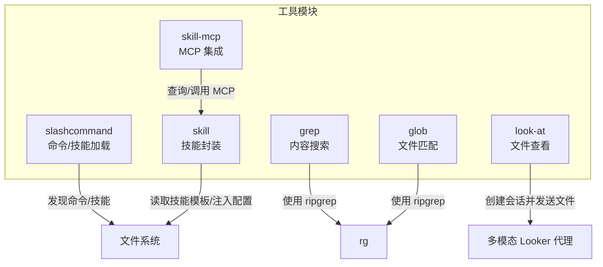
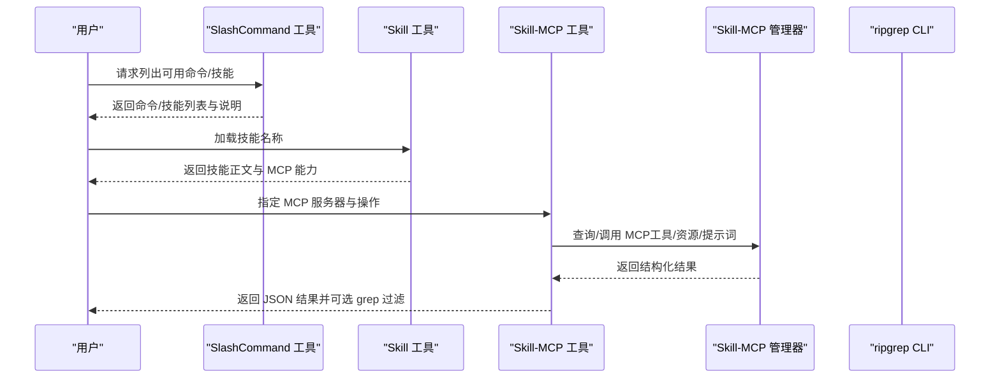
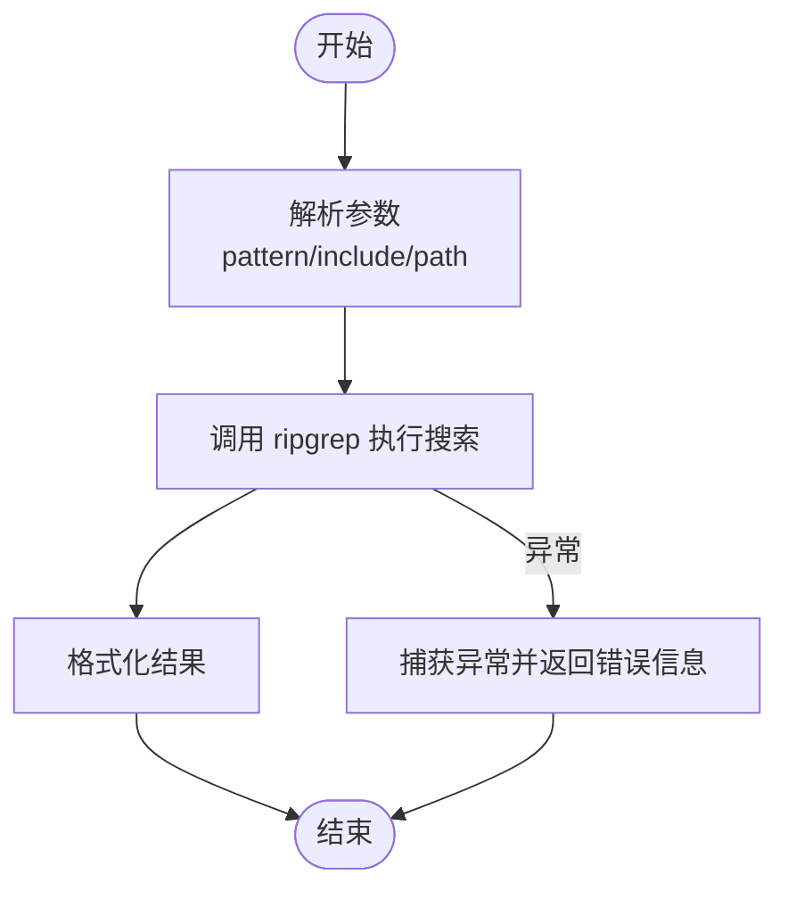
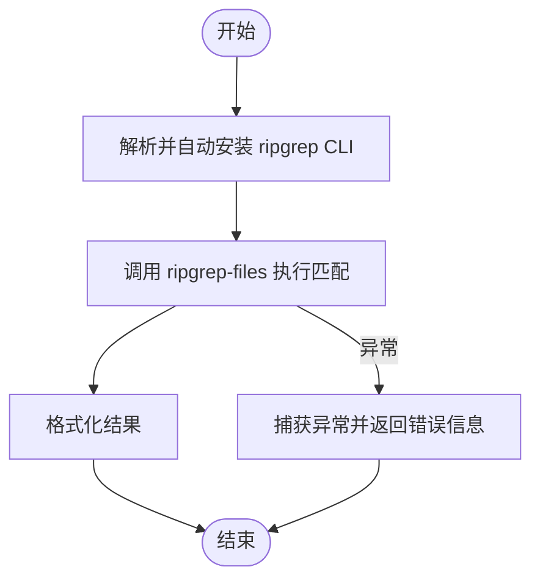
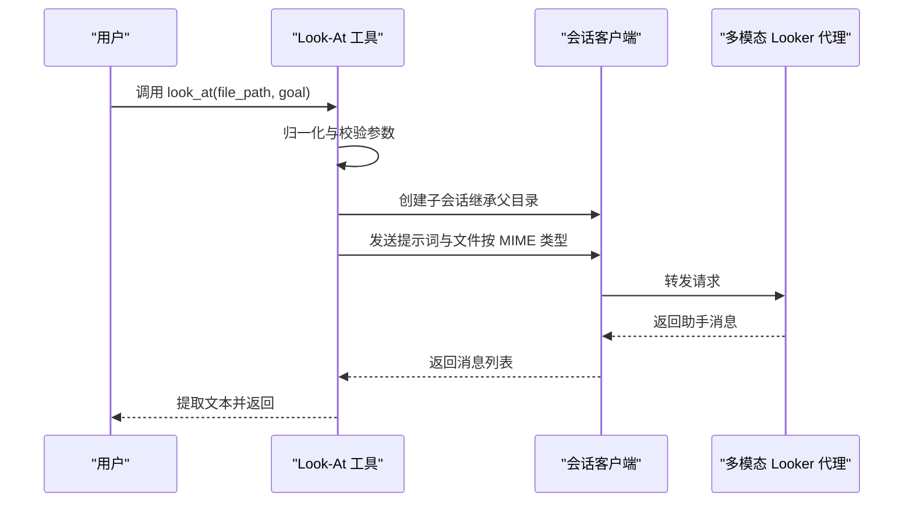
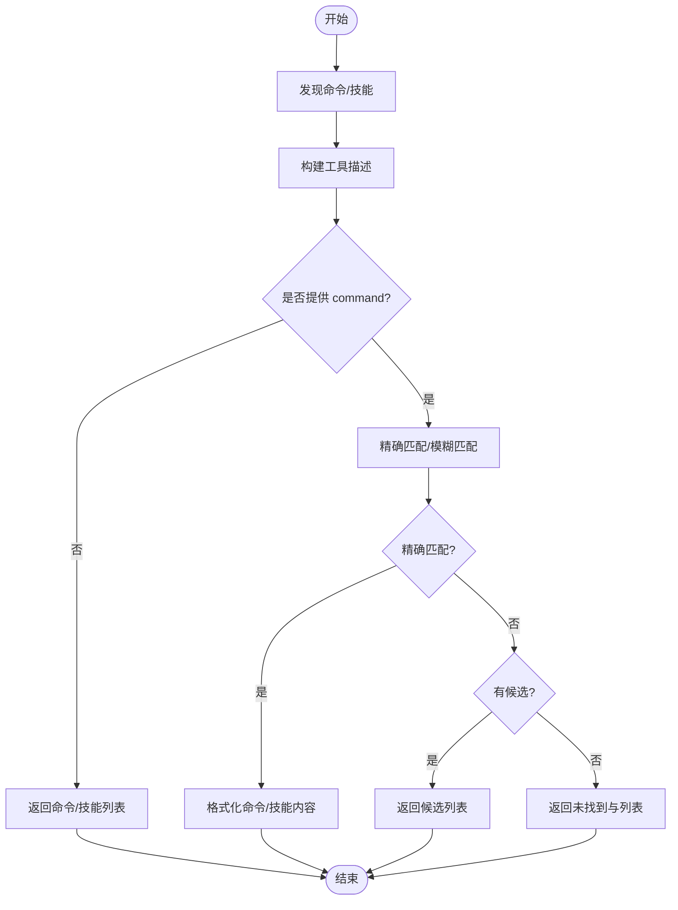
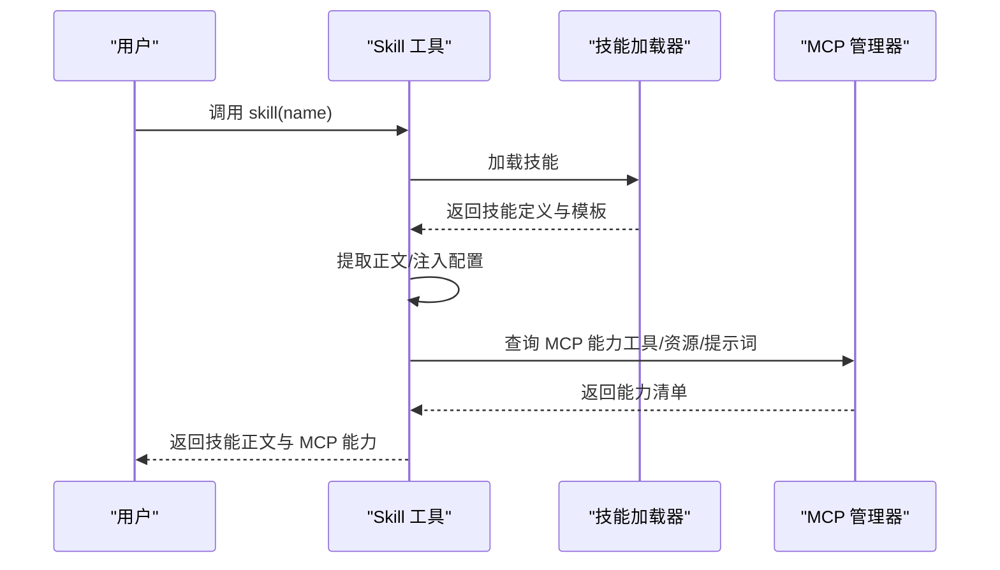
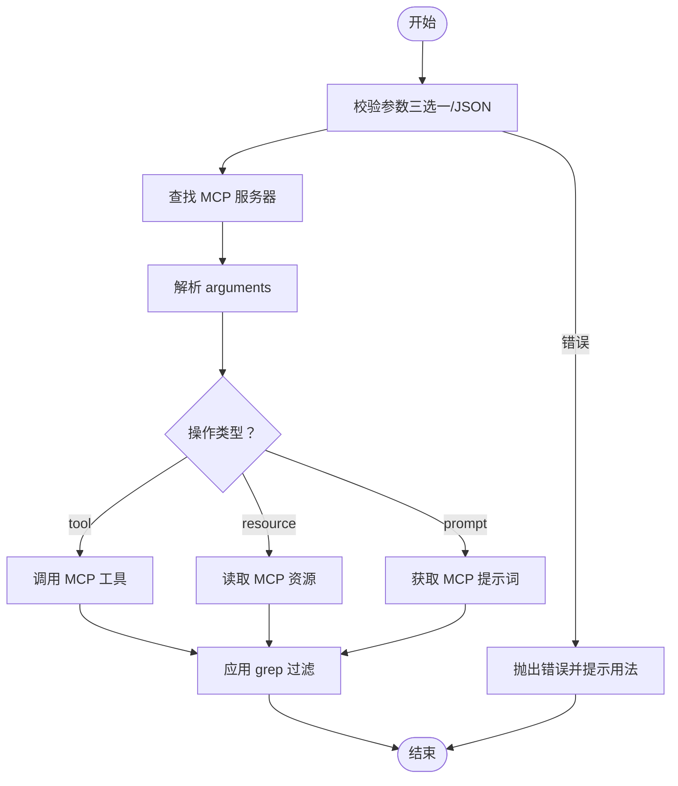
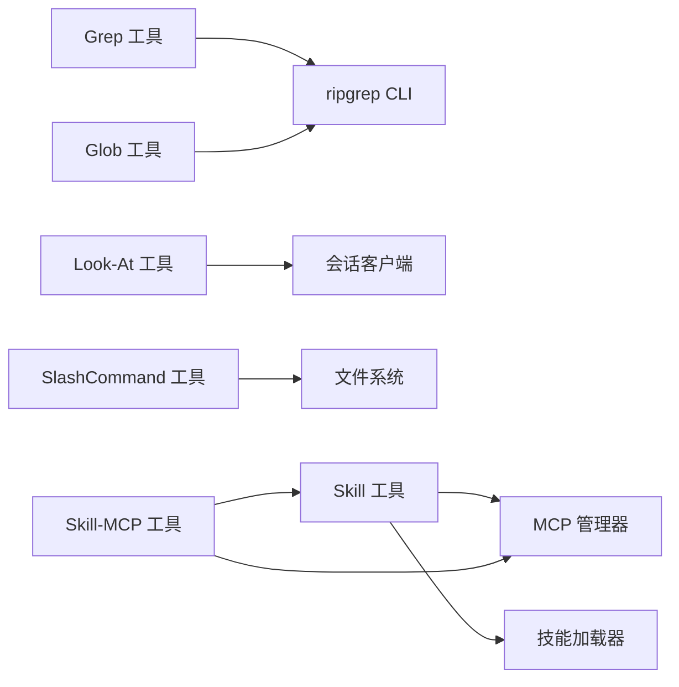

# 实用工具集

<cite>
**本文引用的文件**
- [src/tools/grep/index.ts](file://src/tools/grep/index.ts)
- [src/tools/grep/tools.ts](file://src/tools/grep/tools.ts)
- [src/tools/grep/types.ts](file://src/tools/grep/types.ts)
- [src/tools/glob/index.ts](file://src/tools/glob/index.ts)
- [src/tools/glob/tools.ts](file://src/tools/glob/tools.ts)
- [src/tools/glob/types.ts](file://src/tools/glob/types.ts)
- [src/tools/look-at/index.ts](file://src/tools/look-at/index.ts)
- [src/tools/look-at/tools.ts](file://src/tools/look-at/tools.ts)
- [src/tools/look-at/types.ts](file://src/tools/look-at/types.ts)
- [src/tools/slashcommand/index.ts](file://src/tools/slashcommand/index.ts)
- [src/tools/slashcommand/tools.ts](file://src/tools/slashcommand/tools.ts)
- [src/tools/slashcommand/types.ts](file://src/tools/slashcommand/types.ts)
- [src/tools/skill/index.ts](file://src/tools/skill/index.ts)
- [src/tools/skill/tools.ts](file://src/tools/skill/tools.ts)
- [src/tools/skill/types.ts](file://src/tools/skill/types.ts)
- [src/tools/skill-mcp/index.ts](file://src/tools/skill-mcp/index.ts)
- [src/tools/skill-mcp/tools.ts](file://src/tools/skill-mcp/tools.ts)
- [src/tools/skill-mcp/types.ts](file://src/tools/skill-mcp/types.ts)
</cite>

## 目录
1. [简介](#简介)
2. [项目结构](#项目结构)
3. [核心组件](#核心组件)
4. [架构总览](#架构总览)
5. [详细组件分析](#详细组件分析)
6. [依赖关系分析](#依赖关系分析)
7. [性能考虑](#性能考虑)
8. [故障排查指南](#故障排查指南)
9. [结论](#结论)
10. [附录](#附录)

## 简介
本文件为实用工具集的综合文档，重点覆盖以下工具的能力与使用方法：
- Grep：基于 ripgrep 的文件内容搜索工具，支持正则表达式、包含/排除模式与安全限制。
- Glob：基于 ripgrep 的文件模式匹配工具，支持通配符与目录搜索。
- Look-At：文件内容查看工具，通过多模态会话对文件进行定向提取与摘要。
- SlashCommand：命令快捷方式工具，聚合用户/项目/全局技能与命令，提供可执行说明。
- Skill：技能封装工具，加载内置或外部技能，输出结构化技能说明与 MCP 能力清单。
- Skill-MCP：MCP（Model Context Protocol）协议集成工具，统一调用技能中嵌入的 MCP 服务器资源。

文档同时提供配置选项、使用示例、性能优化建议、工具组合最佳实践与常见场景。

## 项目结构
工具模块按“功能域”组织在 src/tools 下，每个工具均提供：
- index.ts：导出入口，暴露工具定义与常量/类型。
- tools.ts：工具实现，定义 ToolDefinition、参数校验、执行逻辑与错误处理。
- types.ts：工具相关接口定义。
- cli.ts / utils.ts：底层 CLI 调用与结果格式化（如适用）。

图表来源
- [src/tools/grep/tools.ts](file://src/tools/grep/tools.ts#L23-L39)
- [src/tools/glob/tools.ts](file://src/tools/glob/tools.ts#L23-L39)
- [src/tools/look-at/tools.ts](file://src/tools/look-at/tools.ts#L101-L135)
- [src/tools/slashcommand/tools.ts](file://src/tools/slashcommand/tools.ts#L54-L67)
- [src/tools/skill/tools.ts](file://src/tools/skill/tools.ts#L159-L196)
- [src/tools/skill-mcp/tools.ts](file://src/tools/skill-mcp/tools.ts#L120-L170)

章节来源
- [src/tools/grep/index.ts](file://src/tools/grep/index.ts#L1-L4)
- [src/tools/glob/index.ts](file://src/tools/glob/index.ts#L1-L4)
- [src/tools/look-at/index.ts](file://src/tools/look-at/index.ts#L1-L4)
- [src/tools/slashcommand/index.ts](file://src/tools/slashcommand/index.ts#L1-L3)
- [src/tools/skill/index.ts](file://src/tools/skill/index.ts#L1-L4)
- [src/tools/skill-mcp/index.ts](file://src/tools/skill-mcp/index.ts#L1-L4)

## 核心组件
- Grep 工具
  - 功能：基于 ripgrep 的内容搜索，支持正则、包含/排除模式、超时与输出大小限制。
  - 关键参数：pattern、include（glob）、path（目录）。
  - 返回：匹配文件路径列表（按修改时间排序）。
- Glob 工具
  - 功能：基于 ripgrep 的文件名模式匹配，支持目录与深度限制。
  - 关键参数：pattern（glob）、path（目录）。
  - 返回：匹配文件路径列表（按修改时间排序）。
- Look-At 工具
  - 功能：通过多模态会话对指定文件进行定向信息抽取，返回纯文本响应。
  - 关键参数：file_path、goal。
  - 行为：自动推断 MIME 类型，创建子会话，发送文件与提示词，提取助手最后一条消息文本。
- SlashCommand 工具
  - 功能：聚合用户/项目/全局命令与技能，动态构建可用项列表与描述，支持模糊匹配与懒加载。
  - 关键参数：command（不带斜杠）。
  - 行为：发现命令/技能 → 格式化内容 → 模糊匹配返回候选。
- Skill 工具
  - 功能：加载技能并输出结构化说明；当存在 MCP 配置时，展示可用 MCP 服务器能力。
  - 关键参数：name（技能标识）。
  - 行为：提取技能模板 → 注入特定配置（如 git-master）→ 输出技能正文与 MCP 能力。
- Skill-MCP 工具
  - 功能：统一调用技能中嵌入的 MCP 服务器，支持工具调用、资源读取、提示词获取，并可选行过滤。
  - 关键参数：mcp_name、tool_name/resource_name/prompt_name 三选一、arguments（JSON 字符串或对象）、grep（正则过滤）。
  - 行为：参数校验 → 查找对应 MCP 服务器 → 解析参数 → 执行操作 → 应用 grep 过滤。

章节来源
- [src/tools/grep/tools.ts](file://src/tools/grep/tools.ts#L5-L40)
- [src/tools/glob/tools.ts](file://src/tools/glob/tools.ts#L6-L41)
- [src/tools/look-at/tools.ts](file://src/tools/look-at/tools.ts#L67-L173)
- [src/tools/slashcommand/tools.ts](file://src/tools/slashcommand/tools.ts#L167-L249)
- [src/tools/skill/tools.ts](file://src/tools/skill/tools.ts#L129-L197)
- [src/tools/skill-mcp/tools.ts](file://src/tools/skill-mcp/tools.ts#L107-L172)

## 架构总览
下图展示了工具间的交互关系与数据流：

图表来源
- [src/tools/slashcommand/tools.ts](file://src/tools/slashcommand/tools.ts#L167-L249)
- [src/tools/skill/tools.ts](file://src/tools/skill/tools.ts#L129-L197)
- [src/tools/skill-mcp/tools.ts](file://src/tools/skill-mcp/tools.ts#L107-L172)

## 详细组件分析

### Grep 组件分析
- 设计要点
  - 使用 ripgrep 执行搜索，支持 include（glob）与 path（目录）筛选。
  - 对异常进行捕获并返回错误字符串，避免中断流程。
  - 返回结果经格式化函数处理，便于下游消费。
- 参数与行为
  - pattern：必填，正则表达式。
  - include：可选，文件包含模式。
  - path：可选，搜索根目录，默认当前工作目录。
- 性能与安全
  - 工具描述中声明了超时与输出大小限制，有助于防止长时间运行与内存占用过高。
- 典型使用场景
  - 在代码库中查找特定日志模式或函数签名。
  - 结合 Glob 先定位文件集合，再用 Grep 过滤内容。

图表来源
- [src/tools/grep/tools.ts](file://src/tools/grep/tools.ts#L23-L39)

章节来源
- [src/tools/grep/tools.ts](file://src/tools/grep/tools.ts#L5-L40)
- [src/tools/grep/types.ts](file://src/tools/grep/types.ts#L1-L34)

### Glob 组件分析
- 设计要点
  - 基于 ripgrep 的文件名匹配，支持目录与深度限制。
  - 自动安装 ripgrep CLI 并进行安全限制（超时与文件数量上限）。
- 参数与行为
  - pattern：必填，glob 模式。
  - path：可选，搜索根目录。
- 典型使用场景
  - 快速定位源文件、测试文件或配置文件集合。
  - 与 Grep 组合：先用 Glob 获取文件列表，再用 Grep 过滤内容。

图表来源
- [src/tools/glob/tools.ts](file://src/tools/glob/tools.ts#L23-L39)

章节来源
- [src/tools/glob/tools.ts](file://src/tools/glob/tools.ts#L6-L41)
- [src/tools/glob/types.ts](file://src/tools/glob/types.ts#L1-L22)

### Look-At 组件分析
- 设计要点
  - 参数归一化与校验，确保 file_path 与 goal 存在。
  - 推断 MIME 类型，创建子会话，向多模态 Looker 代理发送文件与提示词。
  - 提取消息中最后一个助手文本部分作为最终输出。
- 参数与行为
  - file_path：必填，绝对路径。
  - goal：必填，期望提取的信息目标。
- 错误处理
  - 参数缺失、会话创建失败、无助手回复等均返回明确错误信息。
- 典型使用场景
  - 从配置文件中提取关键字段。
  - 从文档中抽取摘要或步骤清单。

图表来源
- [src/tools/look-at/tools.ts](file://src/tools/look-at/tools.ts#L74-L171)

章节来源
- [src/tools/look-at/tools.ts](file://src/tools/look-at/tools.ts#L67-L173)
- [src/tools/look-at/types.ts](file://src/tools/look-at/types.ts#L1-L5)

### SlashCommand 组件分析
- 设计要点
  - 同步发现用户/项目/全局命令与技能，支持懒加载与缓存。
  - 动态构建工具描述，包含可用命令/技能列表。
  - 支持精确匹配与模糊匹配，返回候选列表。
- 参数与行为
  - command：可选，要执行的命令/技能名称（不含斜杠）。
  - 返回：命令/技能详情或列表与提示。
- 典型使用场景
  - 快速了解可用命令与技能，选择合适项执行。
  - 与其他工具组合：先用 SlashCommand 列表，再用 Skill/Grep/Glob 等具体工具执行任务。

图表来源
- [src/tools/slashcommand/tools.ts](file://src/tools/slashcommand/tools.ts#L167-L249)

章节来源
- [src/tools/slashcommand/tools.ts](file://src/tools/slashcommand/tools.ts#L54-L67)
- [src/tools/slashcommand/tools.ts](file://src/tools/slashcommand/tools.ts#L167-L249)
- [src/tools/slashcommand/types.ts](file://src/tools/slashcommand/types.ts#L1-L29)

### Skill 组件分析
- 设计要点
  - 加载技能并提取模板正文，必要时注入特定配置（如 git-master）。
  - 当技能包含 MCP 配置时，查询可用 MCP 服务器的工具/资源/提示词并格式化输出。
  - 描述信息缓存，首次访问时预热。
- 参数与行为
  - name：必填，技能标识。
  - 返回：技能标题、基目录、正文与 MCP 能力说明（若存在）。
- 典型使用场景
  - 获取技能的完整执行说明与上下文。
  - 为后续 Skill-MCP 调用做准备。

图表来源
- [src/tools/skill/tools.ts](file://src/tools/skill/tools.ts#L159-L196)
- [src/tools/skill/tools.ts](file://src/tools/skill/tools.ts#L58-L127)

章节来源
- [src/tools/skill/tools.ts](file://src/tools/skill/tools.ts#L129-L197)
- [src/tools/skill/types.ts](file://src/tools/skill/types.ts#L1-L32)

### Skill-MCP 组件分析
- 设计要点
  - 参数校验：三选一（tool_name、resource_name、prompt_name），并校验 arguments 的 JSON 格式。
  - 服务器定位：遍历已加载技能，查找匹配的 MCP 服务器。
  - 操作分派：根据类型调用工具、读取资源或获取提示词。
  - 输出过滤：可选正则过滤仅保留匹配行。
- 参数与行为
  - mcp_name：必填，MCP 服务器名称。
  - tool_name/resource_name/prompt_name：三选一。
  - arguments：JSON 字符串或对象。
  - grep：可选，用于过滤输出行。
- 典型使用场景
  - 通过技能嵌入的 MCP 服务器执行数据库查询、读取外部资源或获取模板化提示词。

图表来源
- [src/tools/skill-mcp/tools.ts](file://src/tools/skill-mcp/tools.ts#L15-L91)
- [src/tools/skill-mcp/tools.ts](file://src/tools/skill-mcp/tools.ts#L120-L170)

章节来源
- [src/tools/skill-mcp/tools.ts](file://src/tools/skill-mcp/tools.ts#L107-L172)
- [src/tools/skill-mcp/types.ts](file://src/tools/skill-mcp/types.ts#L1-L9)

## 依赖关系分析
- 工具间耦合
  - Grep/Glob 依赖 ripgrep CLI，具备相似的搜索与安全限制策略。
  - Look-At 依赖会话客户端与多模态代理，输出为纯文本。
  - SlashCommand 依赖文件系统与技能加载器，动态构建描述与内容。
  - Skill 依赖技能加载器与 MCP 管理器，输出技能正文与 MCP 能力。
  - Skill-MCP 依赖 MCP 管理器与已加载技能，负责统一调用。
- 外部依赖
  - ripgrep：内容搜索与文件匹配。
  - 会话客户端：多模态 Looker 代理交互。
  - 文件系统：命令/技能发现与内容读取。

图表来源
- [src/tools/grep/tools.ts](file://src/tools/grep/tools.ts#L23-L39)
- [src/tools/glob/tools.ts](file://src/tools/glob/tools.ts#L23-L39)
- [src/tools/look-at/tools.ts](file://src/tools/look-at/tools.ts#L101-L135)
- [src/tools/slashcommand/tools.ts](file://src/tools/slashcommand/tools.ts#L54-L67)
- [src/tools/skill/tools.ts](file://src/tools/skill/tools.ts#L159-L196)
- [src/tools/skill-mcp/tools.ts](file://src/tools/skill-mcp/tools.ts#L120-L170)

章节来源
- [src/tools/grep/tools.ts](file://src/tools/grep/tools.ts#L1-L41)
- [src/tools/glob/tools.ts](file://src/tools/glob/tools.ts#L1-L42)
- [src/tools/look-at/tools.ts](file://src/tools/look-at/tools.ts#L1-L174)
- [src/tools/slashcommand/tools.ts](file://src/tools/slashcommand/tools.ts#L1-L253)
- [src/tools/skill/tools.ts](file://src/tools/skill/tools.ts#L1-L201)
- [src/tools/skill-mcp/tools.ts](file://src/tools/skill-mcp/tools.ts#L1-L173)

## 性能考虑
- 超时与限流
  - Grep/Glob 工具描述中声明了超时与输出/文件数量限制，建议在大规模仓库中优先使用 include/glob 与 path 缩小搜索范围。
- I/O 与并发
  - SlashCommand/Skill 在首次使用时进行缓存预热，后续调用可显著降低延迟。
  - Skill-MCP 的 MCP 查询可能涉及网络/外部服务，建议批量调用或复用会话。
- 输出处理
  - Look-At 返回纯文本，适合直接消费；如需结构化数据，可在上层进行二次解析。
  - Skill-MCP 的 grep 过滤可快速缩小输出规模，提升下游处理效率。

## 故障排查指南
- Grep/Glob
  - 现象：无结果或报错。
  - 排查：确认 pattern 是否正确、include 是否合理、path 是否存在；检查工具描述中的安全限制是否触发。
- Look-At
  - 现象：返回错误或无响应。
  - 排查：确认 file_path 是否为绝对路径且存在、goal 是否明确；检查会话创建与消息获取是否成功。
- SlashCommand
  - 现象：找不到命令/技能或列表为空。
  - 排查：确认命令/技能文件命名与 Frontmatter；检查发现目录是否存在；尝试刷新缓存。
- Skill
  - 现象：技能未找到或 MCP 能力为空。
  - 排查：确认技能名称拼写；检查技能是否已加载；验证 MCP 配置是否有效。
- Skill-MCP
  - 现象：MCP 服务器未找到或参数错误。
  - 排查：确认 mcp_name 来自已加载技能；确保三选一参数正确；arguments 为合法 JSON；必要时使用 grep 过滤输出。

章节来源
- [src/tools/grep/tools.ts](file://src/tools/grep/tools.ts#L36-L38)
- [src/tools/glob/tools.ts](file://src/tools/glob/tools.ts#L37-L39)
- [src/tools/look-at/tools.ts](file://src/tools/look-at/tools.ts#L76-L80)
- [src/tools/look-at/tools.ts](file://src/tools/look-at/tools.ts#L111-L114)
- [src/tools/look-at/tools.ts](file://src/tools/look-at/tools.ts#L143-L146)
- [src/tools/look-at/tools.ts](file://src/tools/look-at/tools.ts#L156-L159)
- [src/tools/slashcommand/tools.ts](file://src/tools/slashcommand/tools.ts#L216-L246)
- [src/tools/skill/tools.ts](file://src/tools/skill/tools.ts#L163-L165)
- [src/tools/skill-mcp/tools.ts](file://src/tools/skill-mcp/tools.ts#L125-L131)
- [src/tools/skill-mcp/tools.ts](file://src/tools/skill-mcp/tools.ts#L145-L91)

## 结论
本实用工具集围绕内容搜索、文件匹配、文件查看、命令/技能加载与 MCP 集成构建了完整的开发辅助能力。通过合理的参数设计、安全限制与缓存策略，能够在保证稳定性的同时提供高效的检索与执行体验。建议在实际使用中结合场景选择合适的工具组合，并充分利用 grep 过滤与 include/glob 缩小搜索范围以提升性能。

## 附录
- 使用示例（路径参考）
  - Grep：[src/tools/grep/tools.ts](file://src/tools/grep/tools.ts#L23-L39)
  - Glob：[src/tools/glob/tools.ts](file://src/tools/glob/tools.ts#L23-L39)
  - Look-At：[src/tools/look-at/tools.ts](file://src/tools/look-at/tools.ts#L74-L171)
  - SlashCommand：[src/tools/slashcommand/tools.ts](file://src/tools/slashcommand/tools.ts#L213-L247)
  - Skill：[src/tools/skill/tools.ts](file://src/tools/skill/tools.ts#L159-L196)
  - Skill-MCP：[src/tools/skill-mcp/tools.ts](file://src/tools/skill-mcp/tools.ts#L120-L170)
- 配置与扩展
  - Grep/Glob：可通过 include/glob 与 path 精细化控制搜索范围。
  - Look-At：goal 应尽量具体，以提高提取准确性。
  - SlashCommand：支持预加载 commands/skills 以跳过发现阶段。
  - Skill：支持注入 git-master 配置与 MCP 管理器以查询能力。
  - Skill-MCP：支持 arguments 的 JSON 字符串或对象，grep 可过滤输出。