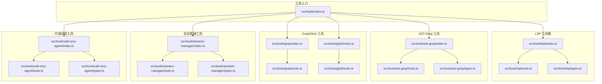
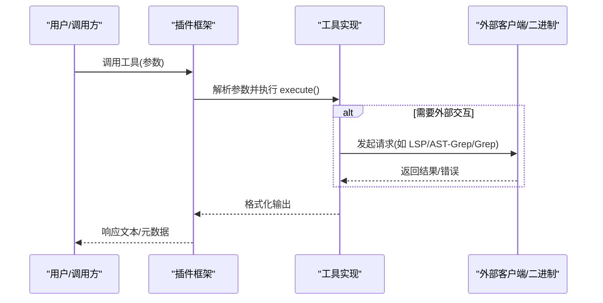
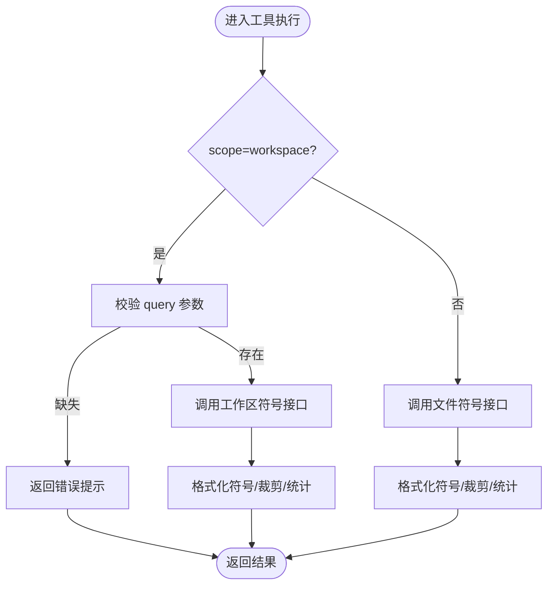
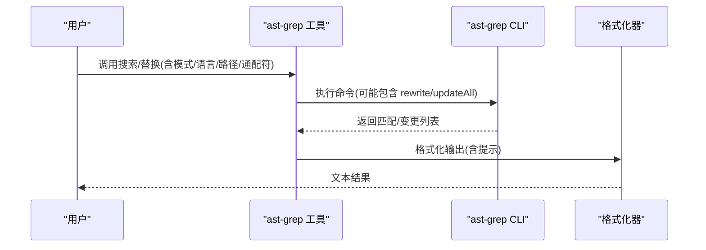
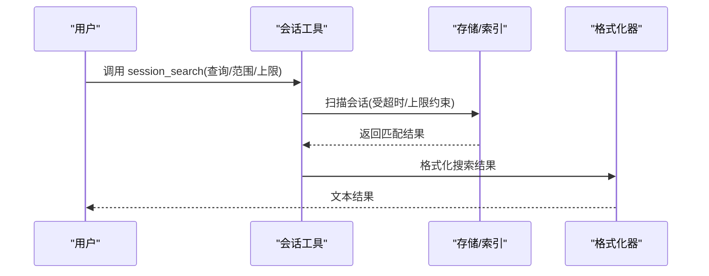
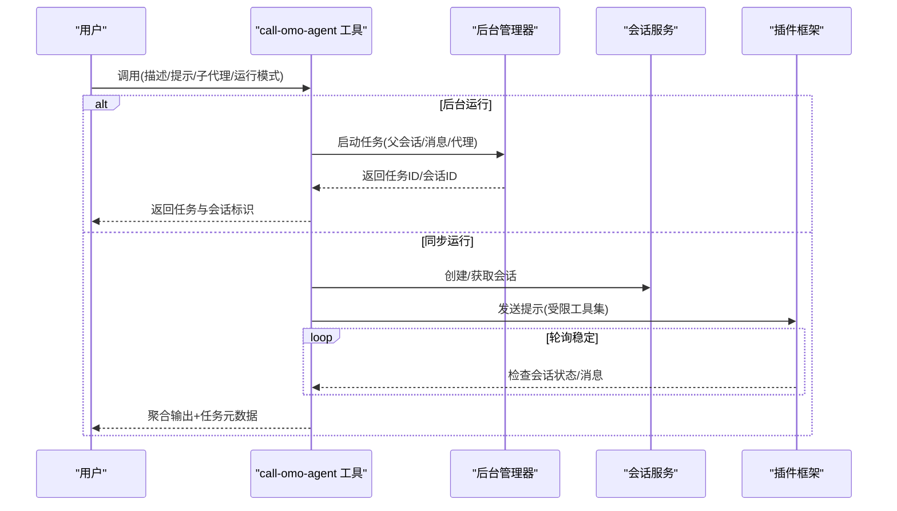
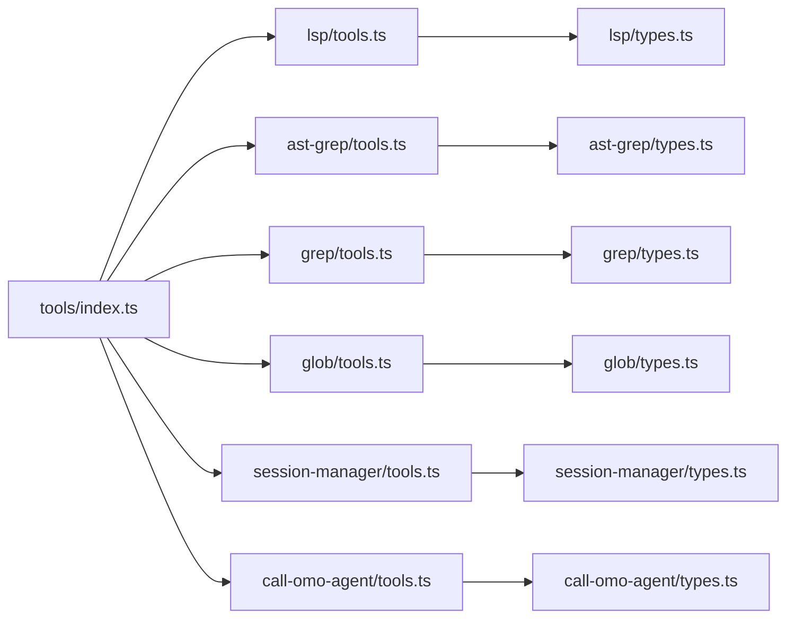

# 工具系统

<cite>
**本文引用的文件**
- [src/tools/index.ts](file://src/tools/index.ts)
- [src/tools/lsp/index.ts](file://src/tools/lsp/index.ts)
- [src/tools/lsp/tools.ts](file://src/tools/lsp/tools.ts)
- [src/tools/lsp/types.ts](file://src/tools/lsp/types.ts)
- [src/tools/ast-grep/index.ts](file://src/tools/ast-grep/index.ts)
- [src/tools/ast-grep/tools.ts](file://src/tools/ast-grep/tools.ts)
- [src/tools/ast-grep/types.ts](file://src/tools/ast-grep/types.ts)
- [src/tools/grep/index.ts](file://src/tools/grep/index.ts)
- [src/tools/grep/tools.ts](file://src/tools/grep/tools.ts)
- [src/tools/glob/index.ts](file://src/tools/glob/index.ts)
- [src/tools/glob/tools.ts](file://src/tools/glob/tools.ts)
- [src/tools/call-omo-agent/index.ts](file://src/tools/call-omo-agent/index.ts)
- [src/tools/call-omo-agent/tools.ts](file://src/tools/call-omo-agent/tools.ts)
- [src/tools/call-omo-agent/types.ts](file://src/tools/call-omo-agent/types.ts)
- [src/tools/session-manager/index.ts](file://src/tools/session-manager/index.ts)
- [src/tools/session-manager/tools.ts](file://src/tools/session-manager/tools.ts)
- [src/tools/session-manager/types.ts](file://src/tools/session-manager/types.ts)
</cite>

## 目录
1. [简介](#简介)
2. [项目结构](#项目结构)
3. [核心组件](#核心组件)
4. [架构总览](#架构总览)
5. [详细组件分析](#详细组件分析)
6. [依赖关系分析](#依赖关系分析)
7. [性能考量](#性能考量)
8. [故障排查指南](#故障排查指南)
9. [结论](#结论)
10. [附录](#附录)

## 简介
本文件系统性梳理 Oh My OpenCode 的工具体系，重点覆盖以下方面：
- LSP 工具集：诊断、跳转定义、查找引用、符号检索、重命名（预检与应用）等
- AST-Grep 工具：基于 AST 的跨语言模式搜索与替换
- 会话管理工具：OpenCode 会话历史与状态的查询、检索与信息展示
- 其他专业工具：代理调用、内容搜索（Grep）、通配符匹配（Glob）等
- 配置与使用要点、性能优化与最佳实践

## 项目结构
工具系统以“按功能域分层”的方式组织，核心入口导出所有内置工具，并在各子目录下提供独立的工具实现、类型与常量。

图表来源
- [src/tools/index.ts](file://src/tools/index.ts#L1-L73)
- [src/tools/lsp/index.ts](file://src/tools/lsp/index.ts#L1-L8)
- [src/tools/ast-grep/index.ts](file://src/tools/ast-grep/index.ts#L1-L14)
- [src/tools/grep/index.ts](file://src/tools/grep/index.ts#L1-L4)
- [src/tools/glob/index.ts](file://src/tools/glob/index.ts#L1-L4)
- [src/tools/session-manager/index.ts](file://src/tools/session-manager/index.ts#L1-L4)
- [src/tools/call-omo-agent/index.ts](file://src/tools/call-omo-agent/index.ts#L1-L4)

章节来源
- [src/tools/index.ts](file://src/tools/index.ts#L1-L73)

## 核心组件
- LSP 工具集：提供定义跳转、引用查找、符号检索、诊断查看、重命名预检与应用等能力，统一通过客户端封装与格式化输出。
- AST-Grep 工具：支持 25 种语言的 AST 模式搜索与替换，具备元变量匹配、上下文输出与提示优化。
- 会话管理工具：列出、读取、搜索、查询会话信息，带超时与结果限制控制。
- Grep 工具：基于 ripgrep 的内容搜索，支持正则、包含/排除模式与安全限制。
- Glob 工具：基于 ripgrep-files 的文件名模式匹配，支持通配符与安全限制。
- 代理调用工具：封装对子代理的同步/异步调用，自动解析父代理、会话生命周期管理与轮询完成状态。

章节来源
- [src/tools/lsp/tools.ts](file://src/tools/lsp/tools.ts#L29-L261)
- [src/tools/ast-grep/tools.ts](file://src/tools/ast-grep/tools.ts#L35-L110)
- [src/tools/session-manager/tools.ts](file://src/tools/session-manager/tools.ts#L29-L146)
- [src/tools/grep/tools.ts](file://src/tools/grep/tools.ts#L5-L40)
- [src/tools/glob/tools.ts](file://src/tools/glob/tools.ts#L6-L41)
- [src/tools/call-omo-agent/tools.ts](file://src/tools/call-omo-agent/tools.ts#L34-L338)

## 架构总览
工具系统采用“统一入口导出 + 子模块职责分离”的架构。每个工具均实现标准的 ToolDefinition 接口，统一由插件框架调度执行；部分工具通过客户端或外部二进制（如 ast-grep、ripgrep）与语言服务器交互。

图表来源
- [src/tools/lsp/tools.ts](file://src/tools/lsp/tools.ts#L36-L63)
- [src/tools/ast-grep/tools.ts](file://src/tools/ast-grep/tools.ts#L49-L75)
- [src/tools/grep/tools.ts](file://src/tools/grep/tools.ts#L23-L35)
- [src/tools/glob/tools.ts](file://src/tools/glob/tools.ts#L23-L36)

## 详细组件分析

### LSP 工具集
- 功能特性
  - 定义跳转：根据光标位置返回目标位置集合
  - 引用查找：跨工作区查找符号的所有引用，支持上限裁剪
  - 符号检索：支持文件级与工作区级符号，支持名称过滤与上限裁剪
  - 诊断查看：按严重级别过滤，支持上限裁剪
  - 重命名预检：检查是否可重命名及占位符
  - 重命名应用：生成工作区编辑并应用
- 关键参数
  - 文件路径、行列坐标、范围查询、严重级别、是否包含声明、符号查询词、结果上限等
- 输出格式
  - 统一格式化位置、符号、诊断、重命名结果；异常时返回错误文本
- 错误处理
  - 包装异常为字符串，避免抛出未捕获错误

图表来源
- [src/tools/lsp/tools.ts](file://src/tools/lsp/tools.ts#L103-L166)

章节来源
- [src/tools/lsp/index.ts](file://src/tools/lsp/index.ts#L1-L8)
- [src/tools/lsp/tools.ts](file://src/tools/lsp/tools.ts#L29-L261)
- [src/tools/lsp/types.ts](file://src/tools/lsp/types.ts#L1-L125)

### AST-Grep 工具
- 功能特性
  - 搜索：支持 25 种语言的 AST 模式匹配，支持元变量 $VAR 与 $$$ 多节点匹配
  - 替换：支持干运行与直接更新，保留匹配中的元变量
  - 提示优化：针对空结果给出常见模式修正建议
- 关键参数
  - 模式、语言、路径数组、包含/排除通配符、上下文行数、是否干运行
- 输出格式
  - 统一格式化搜索/替换结果，必要时附加提示信息
- 性能与安全
  - 通过提示引导正确模式写法，减少无效搜索

图表来源
- [src/tools/ast-grep/tools.ts](file://src/tools/ast-grep/tools.ts#L49-L75)
- [src/tools/ast-grep/tools.ts](file://src/tools/ast-grep/tools.ts#L91-L109)

章节来源
- [src/tools/ast-grep/index.ts](file://src/tools/ast-grep/index.ts#L1-L14)
- [src/tools/ast-grep/tools.ts](file://src/tools/ast-grep/tools.ts#L35-L110)
- [src/tools/ast-grep/types.ts](file://src/tools/ast-grep/types.ts#L1-L62)

### 会话管理工具
- 功能特性
  - 列出会话：支持时间范围过滤、项目路径过滤、数量限制
  - 读取会话：可选包含待办与摘要日志，支持消息数量限制
  - 搜索会话：支持单会话内或多会话扫描，带超时与上限控制
  - 查询会话信息：返回会话基础统计与元信息
- 关键参数
  - 会话 ID、查询词、大小写敏感、结果上限、时间范围、项目路径、是否包含待办/日志
- 安全与性能
  - 搜索操作设置超时与扫描上限，避免长时间阻塞

图表来源
- [src/tools/session-manager/tools.ts](file://src/tools/session-manager/tools.ts#L95-L125)

章节来源
- [src/tools/session-manager/index.ts](file://src/tools/session-manager/index.ts#L1-L4)
- [src/tools/session-manager/tools.ts](file://src/tools/session-manager/tools.ts#L29-L146)
- [src/tools/session-manager/types.ts](file://src/tools/session-manager/types.ts#L1-L100)

### Grep 工具
- 功能特性
  - 基于 ripgrep 的内容搜索，支持正则表达式、包含/排除模式、修改时间排序
  - 安全限制：超时与输出大小限制
- 关键参数
  - 正则模式、包含模式、搜索目录
- 输出格式
  - 统一格式化匹配结果

章节来源
- [src/tools/grep/index.ts](file://src/tools/grep/index.ts#L1-L4)
- [src/tools/grep/tools.ts](file://src/tools/grep/tools.ts#L5-L40)
- [src/tools/grep/types.ts](file://src/tools/grep/types.ts#L1-L40)

### Glob 工具
- 功能特性
  - 基于 ripgrep-files 的文件名模式匹配，支持通配符、深度与数量限制
  - 自动安装与解析 CLI
- 关键参数
  - 模式、搜索目录
- 输出格式
  - 统一格式化文件匹配结果

章节来源
- [src/tools/glob/index.ts](file://src/tools/glob/index.ts#L1-L4)
- [src/tools/glob/tools.ts](file://src/tools/glob/tools.ts#L6-L41)
- [src/tools/glob/types.ts](file://src/tools/glob/types.ts#L1-L23)

### 代理调用工具
- 功能特性
  - 同步模式：创建/复用会话，发送提示，轮询直到稳定完成，聚合 assistant 与 tool 结果
  - 异步模式：交由后台管理器启动任务，返回任务与会话标识，后续可用后台输出工具查询
  - 自动解析父代理与会话上下文
- 关键参数
  - 描述、提示、子代理类型、是否后台运行、可选会话 ID
- 输出格式
  - 同步：拼接工具与助手输出，附带任务元数据
  - 异步：返回任务与会话标识，指导使用后台输出工具

图表来源
- [src/tools/call-omo-agent/tools.ts](file://src/tools/call-omo-agent/tools.ts#L56-L72)
- [src/tools/call-omo-agent/tools.ts](file://src/tools/call-omo-agent/tools.ts#L130-L338)

章节来源
- [src/tools/call-omo-agent/index.ts](file://src/tools/call-omo-agent/index.ts#L1-L4)
- [src/tools/call-omo-agent/tools.ts](file://src/tools/call-omo-agent/tools.ts#L34-L338)
- [src/tools/call-omo-agent/types.ts](file://src/tools/call-omo-agent/types.ts#L1-L28)

## 依赖关系分析
- 工具入口集中导出所有内置工具，便于插件框架统一注册
- LSP 工具依赖类型定义与客户端封装；AST-Grep 工具依赖 CLI 与环境检测；Grep/Glob 工具依赖 ripgrep 生态；会话工具依赖存储与格式化；代理调用工具依赖后台管理器与会话服务
- 工具间无直接耦合，通过统一的 ToolDefinition 接口与插件框架交互

图表来源
- [src/tools/index.ts](file://src/tools/index.ts#L57-L72)
- [src/tools/lsp/tools.ts](file://src/tools/lsp/tools.ts#L1-L27)
- [src/tools/ast-grep/tools.ts](file://src/tools/ast-grep/tools.ts#L1-L5)
- [src/tools/grep/tools.ts](file://src/tools/grep/tools.ts#L1-L3)
- [src/tools/glob/tools.ts](file://src/tools/glob/tools.ts#L1-L4)
- [src/tools/session-manager/tools.ts](file://src/tools/session-manager/tools.ts#L1-L16)
- [src/tools/call-omo-agent/tools.ts](file://src/tools/call-omo-agent/tools.ts#L1-L7)

章节来源
- [src/tools/index.ts](file://src/tools/index.ts#L1-L73)

## 性能考量
- LSP
  - 对引用与符号进行上限裁剪，避免大结果集导致输出膨胀
  - 诊断按严重级别过滤，减少无关噪声
- AST-Grep
  - 使用提示优化常见错误模式，降低无效搜索次数
  - 干运行默认开启，先审后改
- 会话搜索
  - 设置最大扫描会话数与超时，防止长时间阻塞
- Grep/Glob
  - 设定超时与输出/文件数量上限，避免大规模文件遍历造成卡顿
- 代理调用
  - 同步模式采用稳定轮询策略，避免频繁拉取；异步模式交由后台管理器处理

## 故障排查指南
- LSP
  - 若无结果：确认文件路径与行列坐标；检查语言服务器是否可用
  - 重命名失败：先执行预检，确保可重命名；若返回错误，检查符号是否被特殊语言特性限制
- AST-Grep
  - 搜索为空：参考工具返回的提示，修正模式（如移除多余冒号、补全函数体）
  - 替换不生效：确认语言与模式匹配完整 AST 节点；干运行模式不会写入文件
- 会话管理
  - 会话不存在：核对会话 ID；检查项目路径过滤条件
  - 搜索超时：缩短查询范围或提高上限；仅在必要时跨会话扫描
- Grep/Glob
  - 结果异常：检查包含/排除模式与路径；确认 CLI 可用且已自动安装
- 代理调用
  - 同步超时：默认最长等待时间有限；可改为后台运行并通过后台输出工具查询
  - 代理不可用：确认代理名称正确且已注册；检查工具集限制

## 结论
Oh My OpenCode 的工具系统以清晰的职责划分与统一的工具接口实现了强大的工程化能力：从语言感知的 LSP 操作到跨语言的 AST 模式搜索，再到会话与代理的协同编排，既满足日常开发高频需求，又兼顾性能与稳定性。建议在复杂场景中优先采用 AST-Grep 的干运行与提示优化，结合会话搜索与代理调用实现端到端的自动化开发流程。

## 附录
- 实际使用示例（步骤说明）
  - LSP 诊断查看：传入文件路径与可选严重级别，快速定位问题
  - AST-Grep 搜索：选择目标语言与模式，必要时添加上下文行数，先干运行再决定是否替换
  - 会话搜索：输入关键词与可选会话 ID，限定结果数量，快速回溯历史
  - Grep 内容搜索：编写正则表达式，指定包含模式与搜索目录，获取匹配文件列表
  - Glob 文件匹配：编写通配符模式，限定搜索目录，获取匹配文件列表
  - 代理调用：选择子代理类型，输入简短描述与任务提示，按需选择同步或异步模式
- 最佳实践
  - 优先使用 AST-Grep 进行结构化搜索与替换，提升准确性
  - 在大型项目中对 LSP 引用/符号与会话搜索设置合理上限与超时
  - 使用 Grep/Glob 时明确包含/排除规则，避免不必要的文件扫描
  - 同步代理调用适用于短时任务，长时任务建议后台运行并定期查询进度