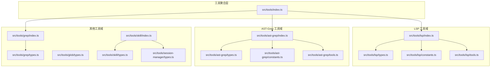
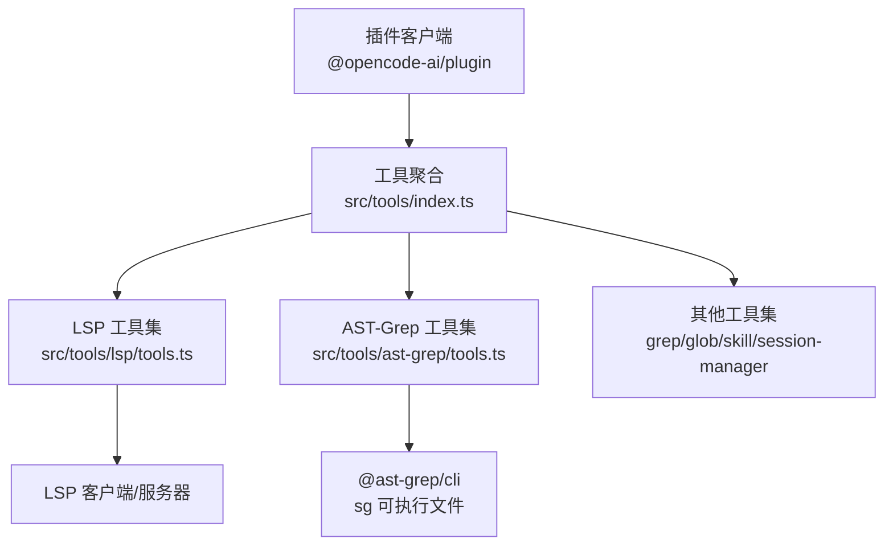
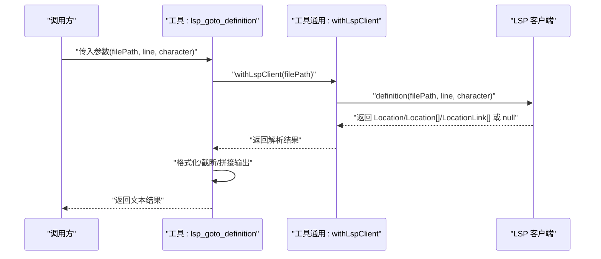
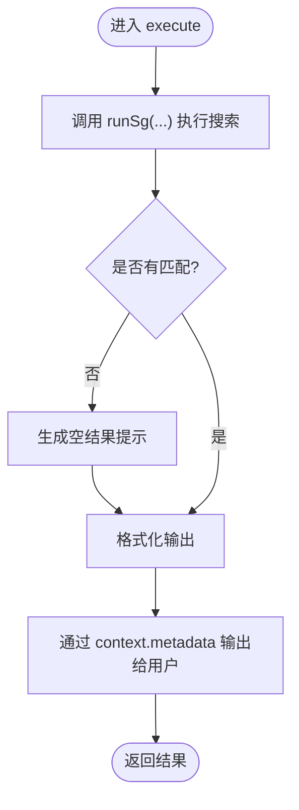
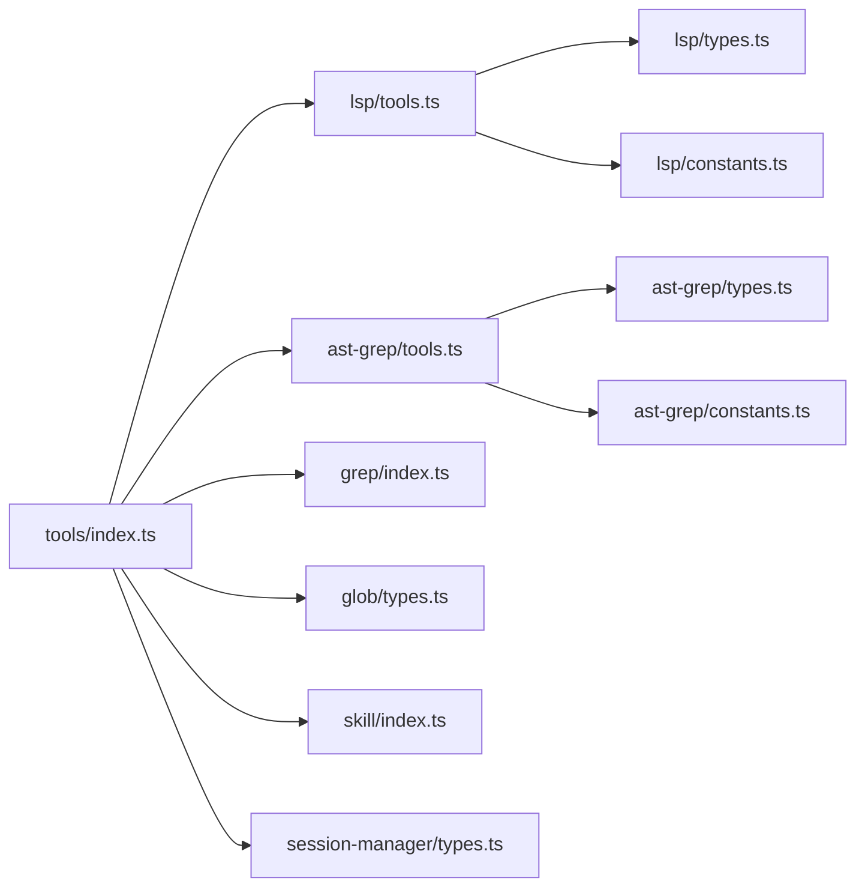

# 工具开发规范

<cite>
**本文引用的文件**
- [src/tools/index.ts](file://src/tools/index.ts)
- [src/tools/lsp/index.ts](file://src/tools/lsp/index.ts)
- [src/tools/lsp/types.ts](file://src/tools/lsp/types.ts)
- [src/tools/lsp/constants.ts](file://src/tools/lsp/constants.ts)
- [src/tools/lsp/tools.ts](file://src/tools/lsp/tools.ts)
- [src/tools/ast-grep/index.ts](file://src/tools/ast-grep/index.ts)
- [src/tools/ast-grep/types.ts](file://src/tools/ast-grep/types.ts)
- [src/tools/ast-grep/constants.ts](file://src/tools/ast-grep/constants.ts)
- [src/tools/ast-grep/tools.ts](file://src/tools/ast-grep/tools.ts)
- [src/tools/grep/index.ts](file://src/tools/grep/index.ts)
- [src/tools/grep/types.ts](file://src/tools/grep/types.ts)
- [src/tools/glob/types.ts](file://src/tools/glob/types.ts)
- [src/tools/skill/index.ts](file://src/tools/skill/index.ts)
- [src/tools/skill/types.ts](file://src/tools/skill/types.ts)
- [src/tools/session-manager/types.ts](file://src/tools/session-manager/types.ts)
</cite>

## 目录
1. [引言](#引言)
2. [项目结构](#项目结构)
3. [核心组件](#核心组件)
4. [架构总览](#架构总览)
5. [详细组件分析](#详细组件分析)
6. [依赖关系分析](#依赖关系分析)
7. [性能考量](#性能考量)
8. [故障排查指南](#故障排查指南)
9. [结论](#结论)
10. [附录](#附录)

## 引言
本规范面向在 Oh My OpenCode 中开发“工具”的工程师，系统性说明工具的标准结构与文件组织方式，明确 index.ts、types.ts、constants.ts、tools.ts、utils.ts 的职责分工；给出工具接口定义、参数校验与返回值规范；提供从需求分析到实现与测试的完整流程；并说明工具与代理系统的集成方式与调用协议。文末包含 LSP 工具与 AST-Grep 工具的具体实现示例与最佳实践。

## 项目结构
工具模块位于 src/tools 下，采用“按功能域分包”的组织方式：每个工具域（如 lsp、ast-grep、grep、glob、skill、session-manager 等）自成子目录，内部再细分为 types.ts、constants.ts、tools.ts、utils.ts 等文件，遵循单一职责与清晰边界。

- 典型工具包结构
  - index.ts：导出工具定义与辅助函数，统一注册到内置工具表
  - types.ts：定义该工具域的数据模型与输入输出类型
  - constants.ts：定义常量、默认配置、映射表等
  - tools.ts：实现具体工具函数，使用 @opencode-ai/plugin/tool 定义 ToolDefinition
  - utils.ts：封装格式化、转换、错误处理等通用逻辑

- 工具聚合入口
  - src/tools/index.ts 汇总所有内置工具，并导出 createBackgroundTools 等工厂方法，供插件系统注册

图表来源
- [src/tools/index.ts](file://src/tools/index.ts#L1-L73)
- [src/tools/lsp/index.ts](file://src/tools/lsp/index.ts#L1-L8)
- [src/tools/ast-grep/index.ts](file://src/tools/ast-grep/index.ts#L1-L14)
- [src/tools/grep/index.ts](file://src/tools/grep/index.ts#L1-L4)
- [src/tools/skill/index.ts](file://src/tools/skill/index.ts#L1-L4)
- [src/tools/session-manager/types.ts](file://src/tools/session-manager/types.ts#L1-L100)

章节来源
- [src/tools/index.ts](file://src/tools/index.ts#L1-L73)

## 核心组件
- 工具定义与注册
  - 使用 @opencode-ai/plugin/tool 的 tool(...) 构造 ToolDefinition，包含 description、args（schema 校验）、execute（异步执行）
  - 在各工具域的 index.ts 中导出 builtinTools 或直接导出工具函数
- 类型与常量
  - types.ts 统一声明输入/输出数据结构
  - constants.ts 提供默认阈值、映射表、安装提示、语言扩展映射等
- 工具聚合
  - src/tools/index.ts 将所有工具汇总为 builtinTools，并导出 createBackgroundTools 等工厂

章节来源
- [src/tools/lsp/tools.ts](file://src/tools/lsp/tools.ts#L29-L261)
- [src/tools/ast-grep/tools.ts](file://src/tools/ast-grep/tools.ts#L35-L110)
- [src/tools/index.ts](file://src/tools/index.ts#L50-L73)

## 架构总览
工具体系通过“域内自治 + 聚合注册”的方式与上层插件系统对接。工具在执行时可依赖各自域内的客户端或外部二进制（如 LSP、ast-grep CLI），并通过上下文 context 传递元数据与运行环境。

图表来源
- [src/tools/index.ts](file://src/tools/index.ts#L57-L72)
- [src/tools/lsp/tools.ts](file://src/tools/lsp/tools.ts#L29-L261)
- [src/tools/ast-grep/tools.ts](file://src/tools/ast-grep/tools.ts#L35-L110)
- [src/tools/ast-grep/constants.ts](file://src/tools/ast-grep/constants.ts#L103-L130)

## 详细组件分析

### LSP 工具域
- 职责分工
  - types.ts：定义 LSP 基础类型（位置、范围、符号、诊断、编辑等）
  - constants.ts：内置服务器清单、语言扩展映射、默认阈值、严重级别映射、安装提示
  - tools.ts：实现 goto_definition、find_references、symbols、diagnostics、prepare_rename、rename 等工具
  - index.ts：导出工具与配置/类型
- 接口与参数
  - 所有工具均通过 tool(...) 定义，args 使用 tool.schema 进行强类型校验
  - execute 返回字符串或错误信息，必要时进行结果截断与格式化
- 执行流程（以 goto_definition 为例）

图表来源
- [src/tools/lsp/tools.ts](file://src/tools/lsp/tools.ts#L29-L64)
- [src/tools/lsp/constants.ts](file://src/tools/lsp/constants.ts#L39-L41)

章节来源
- [src/tools/lsp/index.ts](file://src/tools/lsp/index.ts#L1-L8)
- [src/tools/lsp/types.ts](file://src/tools/lsp/types.ts#L1-L125)
- [src/tools/lsp/constants.ts](file://src/tools/lsp/constants.ts#L1-L391)
- [src/tools/lsp/tools.ts](file://src/tools/lsp/tools.ts#L29-L261)

### AST-Grep 工具域
- 职责分工
  - types.ts：定义匹配结果、范围、元变量、分析结果、变换结果等
  - constants.ts：CLI/NAPI 支持的语言列表、默认超时/最大匹配数、语言扩展映射、环境检查与格式化
  - tools.ts：实现 ast_grep_search、ast_grep_replace，支持干跑与提示优化
  - index.ts：导出工具与环境检查、CLI 可用性检测
- 接口与参数
  - pattern 必须是完整 AST 节点（支持 $VAR、$$$ 元变量）
  - lang 限定为 CLI_LANGUAGES 之一
  - 支持 paths、globs、context、dryRun 等选项
- 执行流程（以 ast_grep_search 为例）

图表来源
- [src/tools/ast-grep/tools.ts](file://src/tools/ast-grep/tools.ts#L35-L76)
- [src/tools/ast-grep/constants.ts](file://src/tools/ast-grep/constants.ts#L103-L130)

章节来源
- [src/tools/ast-grep/index.ts](file://src/tools/ast-grep/index.ts#L1-L14)
- [src/tools/ast-grep/types.ts](file://src/tools/ast-grep/types.ts#L1-L62)
- [src/tools/ast-grep/constants.ts](file://src/tools/ast-grep/constants.ts#L1-L262)
- [src/tools/ast-grep/tools.ts](file://src/tools/ast-grep/tools.ts#L35-L110)

### grep 工具域
- 职责分工
  - index.ts：导出 grep 工具
  - types.ts：定义匹配项、结果、选项（路径、过滤、上下文、大小限制、超时等）
- 接口与参数
  - pattern 为必填
  - 支持 paths、globs、maxCount、caseSensitive、multiline、timeout 等
- 返回值
  - 返回包含 matches、totalMatches、filesSearched、truncated 等字段的结果对象

章节来源
- [src/tools/grep/index.ts](file://src/tools/grep/index.ts#L1-L4)
- [src/tools/grep/types.ts](file://src/tools/grep/types.ts#L1-L40)

### glob 工具域
- 职责分工
  - types.ts：定义文件匹配项与结果、选项（pattern、paths、hidden、follow、limit、timeout 等）
- 接口与参数
  - pattern 为必填
  - 支持 paths、hidden、follow、noIgnore、maxDepth、timeout、limit
- 返回值
  - 返回 files、totalFiles、truncated 等字段

章节来源
- [src/tools/glob/types.ts](file://src/tools/glob/types.ts#L1-L23)

### skill 工具域
- 职责分工
  - index.ts：导出 createSkillTool 与相关常量/类型
  - types.ts：定义 SkillArgs、SkillInfo、SkillLoadOptions 等
- 接口与参数
  - name 为必填
  - 支持 opencodeOnly、skills、mcpManager、getSessionID、gitMasterConfig 等加载选项
- 返回值
  - 返回技能执行结果或错误信息

章节来源
- [src/tools/skill/index.ts](file://src/tools/skill/index.ts#L1-L4)
- [src/tools/skill/types.ts](file://src/tools/skill/types.ts#L1-L32)

### session-manager 工具域
- 职责分工
  - types.ts：定义会话消息、检索结果、会话信息、查询参数等
- 接口与参数
  - 支持 list/read/search/info 等操作，含分页与时间范围筛选
- 返回值
  - 列表/详情/检索结果等结构化数据

章节来源
- [src/tools/session-manager/types.ts](file://src/tools/session-manager/types.ts#L1-L100)

## 依赖关系分析
- 工具域内依赖
  - tools.ts 依赖 types.ts 与 constants.ts，以及工具域内的 utils.ts（如格式化、截断、错误处理）
  - index.ts 作为聚合层，仅负责导出与注册，不直接参与业务逻辑
- 外部依赖
  - LSP 工具依赖 LSP 客户端/服务器
  - AST-Grep 工具依赖 @ast-grep/cli 的 sg 可执行文件或 N-API
  - grep/glob 工具依赖本地文件系统扫描能力
- 聚合层耦合
  - src/tools/index.ts 通过导出 builtinTools 与工厂方法 createBackgroundTools，向插件系统暴露工具集合

图表来源
- [src/tools/index.ts](file://src/tools/index.ts#L1-L73)
- [src/tools/lsp/tools.ts](file://src/tools/lsp/tools.ts#L1-L28)
- [src/tools/ast-grep/tools.ts](file://src/tools/ast-grep/tools.ts#L1-L6)
- [src/tools/grep/index.ts](file://src/tools/grep/index.ts#L1-L4)
- [src/tools/glob/types.ts](file://src/tools/glob/types.ts#L1-L23)
- [src/tools/skill/index.ts](file://src/tools/skill/index.ts#L1-L4)
- [src/tools/session-manager/types.ts](file://src/tools/session-manager/types.ts#L1-L100)

章节来源
- [src/tools/index.ts](file://src/tools/index.ts#L57-L72)

## 性能考量
- 结果截断与超时
  - LSP 默认阈值：参考 DEFAULT_MAX_REFERENCES、DEFAULT_MAX_SYMBOLS、DEFAULT_MAX_DIAGNOSTICS
  - AST-Grep 默认阈值：DEFAULT_MAX_MATCHES、DEFAULT_MAX_OUTPUT_BYTES、DEFAULT_TIMEOUT_MS
- I/O 与扫描
  - grep/glob 应设置合理 maxCount、maxFilesize、timeout，避免大仓库全量扫描
- 并发与后台任务
  - 使用 createBackgroundTools 注册后台输出与取消工具，避免阻塞主线程

章节来源
- [src/tools/lsp/constants.ts](file://src/tools/lsp/constants.ts#L39-L41)
- [src/tools/ast-grep/constants.ts](file://src/tools/ast-grep/constants.ts#L136-L138)
- [src/tools/index.ts](file://src/tools/index.ts#L50-L55)

## 故障排查指南
- LSP 工具
  - 若无定义/引用/符号/诊断，检查文件路径与 LSP 服务器是否正确启动
  - 若报错，查看 severities 映射与默认阈值，确认是否被截断
- AST-Grep 工具
  - 确认 sg 可执行文件可用（checkEnvironment/formatEnvironmentCheck），优先使用缓存路径
  - pattern 需为完整 AST 节点，注意语言差异与元变量使用
- grep/glob
  - 检查 paths/globs 是否正确，避免过大范围导致超时
- session-manager
  - 确认 session_id 存在且权限允许，关注 limit/offset 分页参数

章节来源
- [src/tools/lsp/tools.ts](file://src/tools/lsp/tools.ts#L169-L214)
- [src/tools/ast-grep/constants.ts](file://src/tools/ast-grep/constants.ts#L184-L226)
- [src/tools/grep/types.ts](file://src/tools/grep/types.ts#L16-L34)
- [src/tools/session-manager/types.ts](file://src/tools/session-manager/types.ts#L70-L94)

## 结论
本规范明确了工具开发的“域内自治 + 聚合注册”模式，统一了类型、常量、工具实现与工具聚合的职责边界。通过强类型参数校验、结果格式化与截断策略、环境检查与错误反馈，确保工具在不同域内的一致性与可靠性。建议在新增工具时严格遵循本文档的结构与流程，以降低维护成本并提升可扩展性。

## 附录

### 工具开发流程（从需求到测试）
- 需求分析
  - 明确输入/输出、目标语言/文件范围、是否需要外部二进制或 LSP 客户端
- 设计与建模
  - 在 types.ts 中定义输入输出结构
  - 在 constants.ts 中沉淀默认值、映射表与安装提示
- 实现
  - 在 tools.ts 中使用 tool(...) 定义 ToolDefinition，实现 execute
  - 在 utils.ts 中封装格式化、截断、错误处理
  - 在 index.ts 中导出工具与聚合 builtinTools
- 集成与测试
  - 通过 src/tools/index.ts 注册到插件系统
  - 编写单元测试覆盖正常/异常/截断场景
- 文档与发布
  - 更新变更日志与技能/工具说明

### 工具接口定义、参数校验与返回值规范
- 接口定义
  - 使用 @opencode-ai/plugin/tool 的 tool(...) 构造 ToolDefinition
  - args 使用 tool.schema 进行强类型校验（字符串、数字、枚举、布尔、数组、可选）
- 参数校验
  - 必填字段必须校验
  - 数值范围（如行号、列号）需最小值约束
  - 枚举值使用 tool.schema.enum([...])
- 返回值
  - execute 返回字符串或结构化对象
  - 对于多结果场景，先截断再格式化，保留“显示前 N 条/共 M 条”的提示
  - 错误统一包装为“Error: ...”，便于上层识别

### 工具与代理系统的集成与调用协议
- 聚合注册
  - 通过 src/tools/index.ts 导出 builtinTools 与 createBackgroundTools
- 调用协议
  - 工具通过 context 访问插件上下文（如 metadata.output）
  - 工具应尽量幂等、可重试，并对超时/失败进行降级处理
- 后台任务
  - 使用 createBackgroundTools 注册后台输出与取消工具，避免阻塞交互

章节来源
- [src/tools/index.ts](file://src/tools/index.ts#L50-L73)
- [src/tools/ast-grep/tools.ts](file://src/tools/ast-grep/tools.ts#L7-L10)

### 示例：LSP 工具（goto_definition）
- 输入
  - filePath: string
  - line: number（1 基）
  - character: number（0 基）
- 处理
  - withLspClient 获取 LSP 客户端，调用 definition
  - 格式化 Location/Location[]/LocationLink[]
- 输出
  - 文本化结果，若无则返回“未找到”

章节来源
- [src/tools/lsp/tools.ts](file://src/tools/lsp/tools.ts#L29-L64)

### 示例：AST-Grep 工具（ast_grep_search）
- 输入
  - pattern: string（完整 AST 节点，支持 $VAR、$$$）
  - lang: enum（CLI_LANGUAGES）
  - paths/globs/context: 可选
- 处理
  - runSg 执行搜索，formatSearchResult 格式化
  - 若无匹配，生成语言相关的提示
- 输出
  - 文本化结果，通过 context.metadata 输出给用户

章节来源
- [src/tools/ast-grep/tools.ts](file://src/tools/ast-grep/tools.ts#L35-L76)
- [src/tools/ast-grep/constants.ts](file://src/tools/ast-grep/constants.ts#L103-L130)