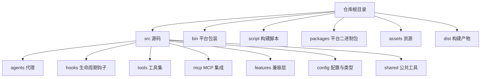
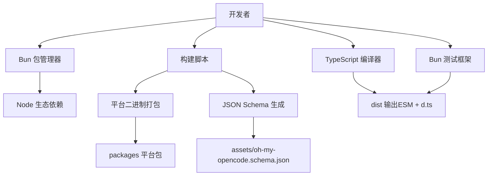
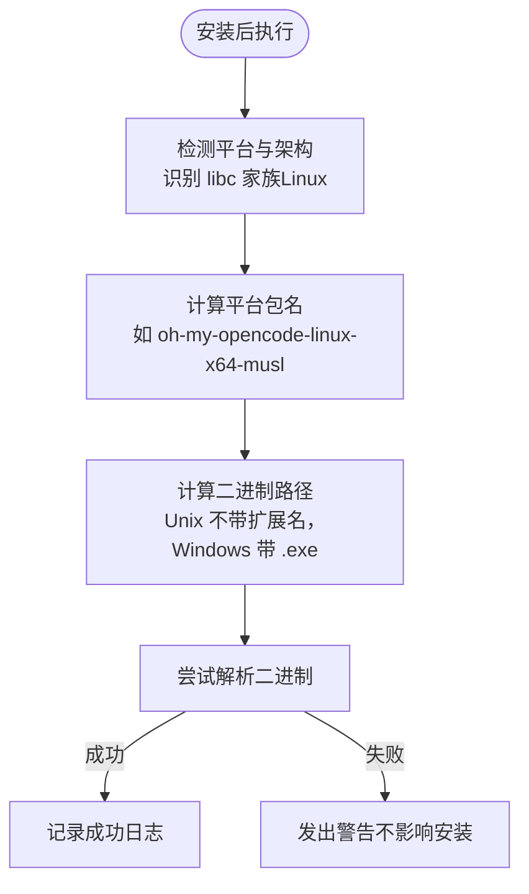
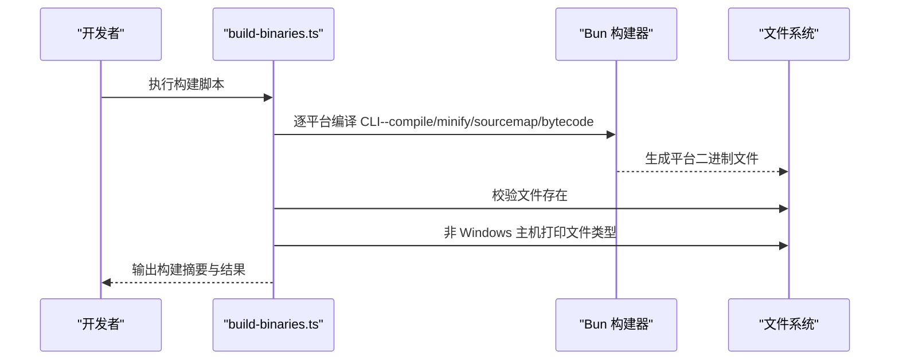
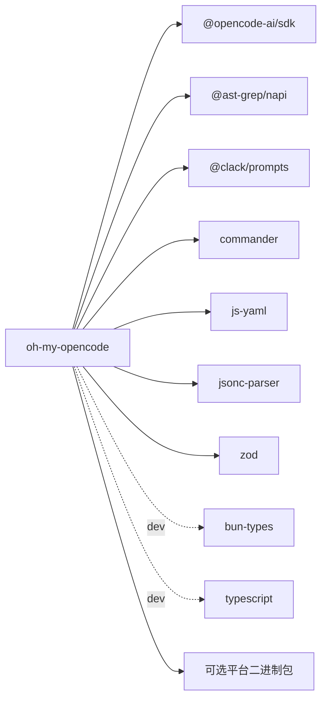

# 开发环境搭建

<cite>
**本文引用的文件**
- [package.json](file://package.json)
- [tsconfig.json](file://tsconfig.json)
- [bunfig.toml](file://bunfig.toml)
- [postinstall.mjs](file://postinstall.mjs)
- [test-setup.ts](file://test-setup.ts)
- [CONTRIBUTING.md](file://CONTRIBUTING.md)
- [README.md](file://README.md)
- [bin/platform.js](file://bin/platform.js)
- [bin/platform.test.ts](file://bin/platform.test.ts)
- [script/build-binaries.ts](file://script/build-binaries.ts)
- [script/build-schema.ts](file://script/build-schema.ts)
</cite>

## 目录
1. [简介](#简介)
2. [项目结构](#项目结构)
3. [核心组件](#核心组件)
4. [架构总览](#架构总览)
5. [详细组件分析](#详细组件分析)
6. [依赖分析](#依赖分析)
7. [性能考虑](#性能考虑)
8. [故障排除指南](#故障排除指南)
9. [结论](#结论)
10. [附录](#附录)

## 简介
本指南面向希望参与 Oh My OpenCode 开发的贡献者，提供从零到一的开发环境搭建步骤与最佳实践。内容涵盖前置条件（Bun、TypeScript、OpenCode 测试环境）、安装与构建流程、工具链配置（TypeScript、Bun 运行时、IDE 建议）、本地验证方法以及常见问题排查。

## 项目结构
该项目采用以“功能域”为主的分层组织方式，核心目录说明如下：
- src：源码根目录，按功能域拆分 agents、hooks、tools、mcp、features、config、shared 等子模块
- bin：CLI 包装与平台二进制相关逻辑
- script：构建脚本（平台二进制打包、JSON Schema 生成）
- packages：各平台二进制包（darwin/linux/windows 对应不同架构与 libc）
- assets：插件 JSON Schema 等资源
- dist：构建产物输出目录（ESM + 类型声明）

图表来源
- [package.json](file://package.json#L1-L93)
- [tsconfig.json](file://tsconfig.json#L1-L21)

章节来源
- [package.json](file://package.json#L1-L93)
- [tsconfig.json](file://tsconfig.json#L1-L21)

## 核心组件
- 包管理与运行时：Bun（唯一支持的包管理器与运行时）
- 类型系统：TypeScript 5.7.3+
- 构建目标：ESM 模块，配合 Bun 的 bundler 解析策略
- 测试框架：Bun 内置测试（bun:test），通过 bunfig.toml 预加载测试初始化
- 平台二进制：通过脚本为多平台编译 CLI 二进制，并在安装后进行可用性校验

章节来源
- [CONTRIBUTING.md](file://CONTRIBUTING.md#L54-L72)
- [tsconfig.json](file://tsconfig.json#L1-L21)
- [bunfig.toml](file://bunfig.toml#L1-L3)
- [postinstall.mjs](file://postinstall.mjs#L1-L44)

## 架构总览
下图展示开发环境的关键交互：开发者通过 Bun 安装依赖并执行构建；TypeScript 编译生成 ESM 与类型声明；Bun 测试框架负责单元测试；平台脚本负责跨平台二进制构建与校验。

图表来源
- [package.json](file://package.json#L26-L36)
- [tsconfig.json](file://tsconfig.json#L1-L21)
- [bunfig.toml](file://bunfig.toml#L1-L3)
- [script/build-binaries.ts](file://script/build-binaries.ts#L1-L104)
- [script/build-schema.ts](file://script/build-schema.ts#L1-L29)

## 详细组件分析

### 前置条件与安装步骤
- 必备工具
  - Bun（最新版本）
  - TypeScript 5.7.3+
  - OpenCode 1.0.150+（用于插件测试）
- 安装流程
  1) 克隆仓库并进入目录
  2) 使用 Bun 安装依赖（仅支持 Bun）
  3) 执行构建命令生成 dist 产物
- 本地验证
  - 在 OpenCode 配置中指向本地 dist/index.js
  - 重启 OpenCode 并确认 OmO 代理可用或启动日志提示加载成功

章节来源
- [CONTRIBUTING.md](file://CONTRIBUTING.md#L54-L72)
- [CONTRIBUTING.md](file://CONTRIBUTING.md#L74-L106)

### TypeScript 配置
- 目标与模块解析
  - 目标：ESNext
  - 模块：ESNext
  - 模块解析：bundler（与 Bun 运行时一致）
- 类型声明
  - 生成 .d.ts 到 dist 目录
  - rootDir 指向 src，避免类型声明污染
- 运行时类型
  - 引入 bun-types，确保 Bun 特定类型可用
- 严格性与兼容性
  - 启用严格模式
  - 允许解析 JSON 模块
  - 跳过库检查（skipLibCheck）

章节来源
- [tsconfig.json](file://tsconfig.json#L1-L21)

### Bun 运行时与测试配置
- 测试预加载
  - 通过 bunfig.toml 的 preload 字段加载 test-setup.ts
  - 在每个测试前重置会话状态，保证测试隔离
- 测试执行
  - 使用 bun test 运行
  - 平台相关测试位于 bin/platform.test.ts

章节来源
- [bunfig.toml](file://bunfig.toml#L1-L3)
- [test-setup.ts](file://test-setup.ts#L1-L7)
- [bin/platform.test.ts](file://bin/platform.test.ts#L1-L149)

### 平台二进制与安装后校验
- 平台检测与包名映射
  - 支持 macOS（arm64/x64）、Linux（x64/arm64，含 musl）、Windows（x64）
  - Linux 上根据 libc 家族区分 glibc 与 musl
- 二进制路径
  - Unix 平台：不带扩展名
  - Windows 平台：带 .exe 扩展名
- 安装后校验
  - postinstall.mjs 在安装后尝试解析对应平台二进制
  - 若无法解析则发出警告，但不中断安装流程

图表来源
- [bin/platform.js](file://bin/platform.js#L1-L39)
- [postinstall.mjs](file://postinstall.mjs#L1-L44)

章节来源
- [bin/platform.js](file://bin/platform.js#L1-L39)
- [postinstall.mjs](file://postinstall.mjs#L1-L44)

### 构建与发布脚本
- 平台二进制构建
  - script/build-binaries.ts 遍历 PLATFORMS 列表，逐个平台编译 CLI
  - 使用 --compile/--minify/--sourcemap/--bytecode 提升体积与性能
  - 验证输出文件存在，并在非 Windows 主机上打印文件类型信息
- JSON Schema 生成
  - script/build-schema.ts 基于 Zod Schema 生成 JSON Schema 并写入 assets
  - 为配置文件提供智能提示与校验

图表来源
- [script/build-binaries.ts](file://script/build-binaries.ts#L1-L104)

章节来源
- [script/build-binaries.ts](file://script/build-binaries.ts#L1-L104)
- [script/build-schema.ts](file://script/build-schema.ts#L1-L29)

### OpenCode 测试环境
- CLI 作为独立二进制分发，安装后无需额外运行时即可执行
- 支持平台：macOS（ARM64/x64）、Linux（x64/arm64，含 Alpine/musl）、Windows（x64）
- 本地开发时可在 OpenCode 配置中指向本地 dist/index.js 进行插件热更新测试

章节来源
- [README.md](file://README.md#L260-L275)
- [CONTRIBUTING.md](file://CONTRIBUTING.md#L74-L106)

## 依赖分析
- 运行时依赖
  - @opencode-ai/sdk/plugin：插件 SDK
  - @ast-grep/napi/cli：AST 搜索能力
  - @clack/prompts：交互式提示
  - commander/js-yaml/jsonc-parser/zod：命令行、配置与校验
- 开发依赖
  - bun-types：Bun 运行时类型
  - typescript：类型检查与声明生成
- 可选依赖
  - 多平台二进制包（oh-my-opencode-<os>-<arch>）用于 CLI 分发

图表来源
- [package.json](file://package.json#L56-L91)

章节来源
- [package.json](file://package.json#L56-L91)

## 性能考虑
- 构建优化
  - 使用 --compile 与 --bytecode 降低运行时开销
  - 启用 --minify 与 sourcemap 便于调试与压缩
- 类型声明
  - 通过 tsc --emitDeclarationOnly 与 Bun 构建并行，缩短构建时间
- 平台二进制
  - 针对不同 libc（glibc/musl）分别打包，减少运行时兼容成本

章节来源
- [script/build-binaries.ts](file://script/build-binaries.ts#L35-L56)
- [package.json](file://package.json#L27-L30)

## 故障排除指南
- 安装后 CLI 不可用
  - 现象：安装后提示 CLI 可能不可用
  - 原因：Linux 上 libc 检测失败或对应平台包缺失
  - 处理：确保 detect-libc 可用；或使用官方 npm 包提供的二进制
- 平台包未找到
  - 现象：require.resolve 抛错
  - 处理：确认平台包名称与架构匹配；检查 packages 下对应目录是否存在
- OpenCode 插件未加载
  - 现象：OmO 代理不可用或无加载提示
  - 处理：将 opencode.json 中的插件路径指向本地 dist/index.js；移除 npm 版本插件以避免冲突；重启 OpenCode
- 测试失败或不稳定
  - 现象：测试间状态干扰
  - 处理：确认 test-setup.ts 已通过 preload 加载；检查 _resetForTesting 是否被正确调用

章节来源
- [postinstall.mjs](file://postinstall.mjs#L33-L40)
- [bin/platform.js](file://bin/platform.js#L10-L27)
- [CONTRIBUTING.md](file://CONTRIBUTING.md#L74-L106)
- [test-setup.ts](file://test-setup.ts#L1-L7)

## 结论
按照本指南完成 Bun、TypeScript 与 OpenCode 的准备，即可顺利克隆、安装、构建并验证 Oh My OpenCode。通过 Bun 的内置测试与平台二进制脚本，可以高效地进行本地开发与跨平台验证。遇到问题时，优先检查平台二进制可用性、OpenCode 配置指向与测试初始化状态。

## 附录
- 快速命令清单
  - 安装依赖：bun install
  - 类型检查：bun run typecheck
  - 构建：bun run build
  - 构建平台二进制：bun run build:binaries
  - 生成 JSON Schema：bun run build:schema
  - 运行测试：bun test
- IDE 建议
  - 使用支持 Bun 与 TypeScript 的编辑器（如 VS Code），开启 ESLint/Prettier
  - 为 TypeScript 选择 ESNext + bundler 解析，确保导入路径与运行时一致