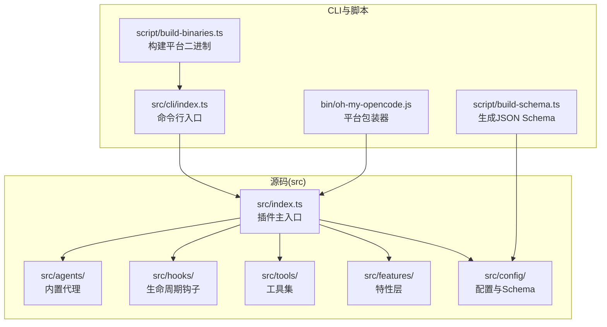
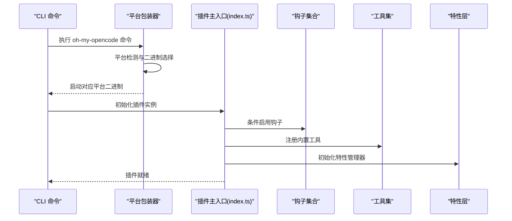
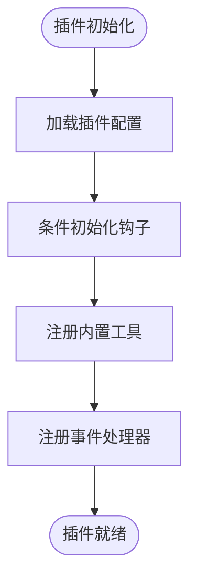
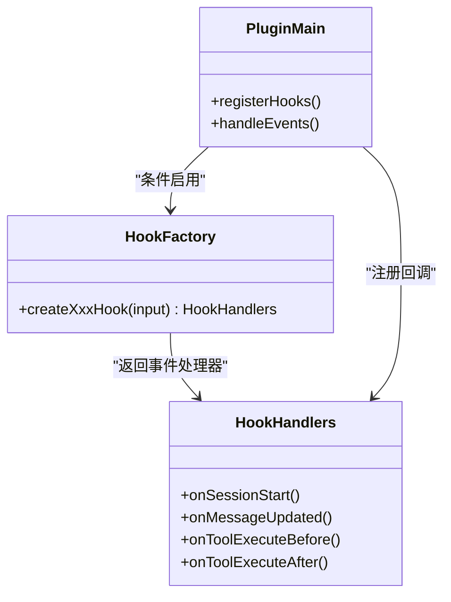
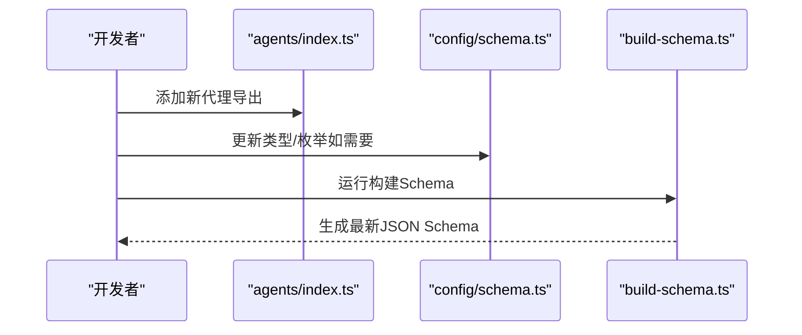
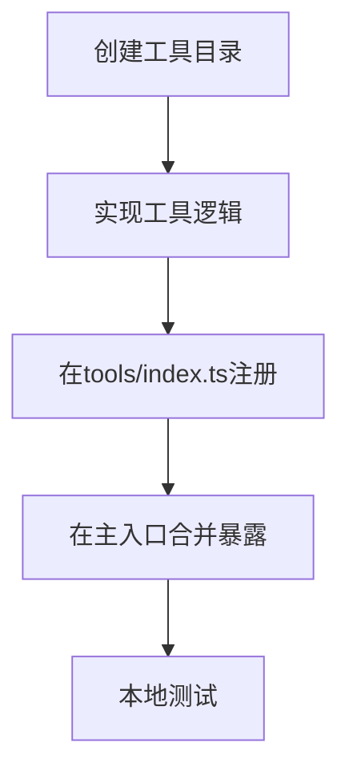
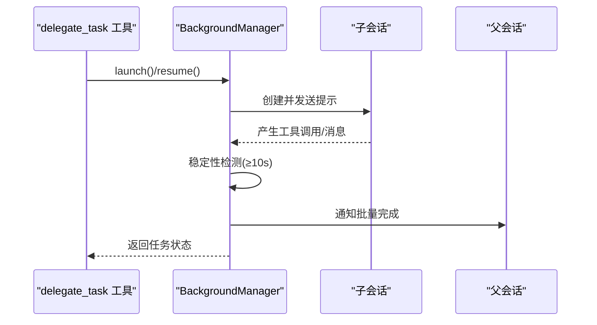
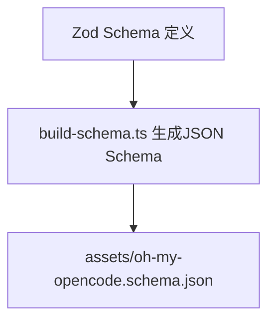
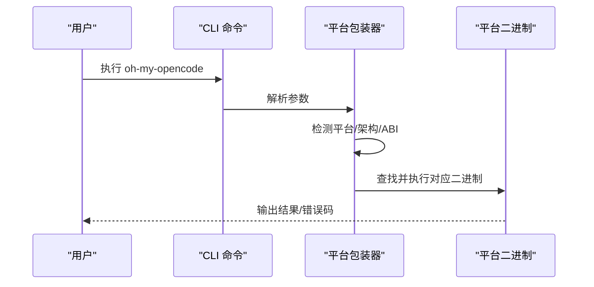
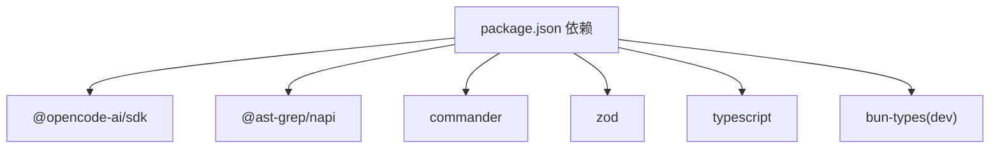

# 开发者指南

<cite>
**本文档引用的文件**
- [README.md](file://README.md)
- [package.json](file://package.json)
- [CONTRIBUTING.md](file://CONTRIBUTING.md)
- [src/index.ts](file://src/index.ts)
- [bin/oh-my-opencode.js](file://bin/oh-my-opencode.js)
- [src/cli/index.ts](file://src/cli/index.ts)
- [src/config/schema.ts](file://src/config/schema.ts)
- [src/hooks/index.ts](file://src/hooks/index.ts)
- [src/tools/index.ts](file://src/tools/index.ts)
- [src/agents/index.ts](file://src/agents/index.ts)
- [script/build-schema.ts](file://script/build-schema.ts)
- [script/build-binaries.ts](file://script/build-binaries.ts)
- [src/tools/delegate-task/tools.ts](file://src/tools/delegate-task/tools.ts)
- [src/agents/sisyphus.ts](file://src/agents/sisyphus.ts)
- [src/features/background-agent/manager.ts](file://src/features/background-agent/manager.ts)
- [src/shared/logger.ts](file://src/shared/logger.ts)
- [test-setup.ts](file://test-setup.ts)
</cite>

## 目录
1. [简介](#简介)
2. [项目结构](#项目结构)
3. [核心组件](#核心组件)
4. [架构总览](#架构总览)
5. [详细组件分析](#详细组件分析)
6. [依赖关系分析](#依赖关系分析)
7. [性能考虑](#性能考虑)
8. [故障排除指南](#故障排除指南)
9. [结论](#结论)
10. [附录](#附录)

## 简介
本指南面向 Oh My OpenCode 插件的开发者，提供从环境搭建、代码结构理解到插件开发规范、钩子扩展与代理创建的完整说明。文档覆盖以下主题：
- 插件开发规范与目录命名约定
- 自定义代理（Agent）与工具（Tool）的创建方法
- 钩子（Hook）扩展开发指南
- 项目构建流程与二进制分发
- 测试策略、调试技巧与性能分析
- 贡献流程、代码审查标准与发布流程
- 实际开发示例与最佳实践

## 项目结构
项目采用模块化组织方式，核心入口为插件主文件，功能按领域拆分为 agents、hooks、tools、features、config 等目录。CLI 提供安装、运行、诊断等命令；脚本目录负责构建与打包。

图表来源
- [src/index.ts](file://src/index.ts#L86-L606)
- [src/cli/index.ts](file://src/cli/index.ts#L1-L147)
- [bin/oh-my-opencode.js](file://bin/oh-my-opencode.js#L1-L81)
- [script/build-schema.ts](file://script/build-schema.ts#L1-L29)
- [script/build-binaries.ts](file://script/build-binaries.ts#L1-L104)

章节来源
- [README.md](file://README.md#L108-L125)
- [package.json](file://package.json#L1-L93)

## 核心组件
- 插件主入口：在主入口中集中初始化配置、加载钩子、注册工具与代理，并处理事件与消息流。
- 钩子系统：提供 21 类生命周期钩子，覆盖会话管理、上下文注入、输出截断、通知、自动更新检查、关键词检测、任务恢复、错误恢复、交互式 Bash 会话等。
- 工具集：内置 LSP、AST-Grep、Grep、Glob、会话管理、交互式 Bash、技能工具、技能 MCP 工具、slashcommand 工具等。
- 特性层：背景代理管理、技能 MCP 管理、任务 Toast 管理、Claude Code 兼容层、规则注入器、上下文窗口监控等。
- 配置与 Schema：通过 Zod 定义完整的配置 Schema，支持禁用代理/技能/钩子、分类配置、实验性功能、通知、Git Master 等。

章节来源
- [src/index.ts](file://src/index.ts#L86-L606)
- [src/hooks/index.ts](file://src/hooks/index.ts#L1-L48)
- [src/tools/index.ts](file://src/tools/index.ts#L1-L73)
- [src/config/schema.ts](file://src/config/schema.ts#L338-L358)

## 架构总览
下图展示插件主入口如何协调各组件，以及 CLI 如何与平台包装器配合进行二进制分发。

图表来源
- [bin/oh-my-opencode.js](file://bin/oh-my-opencode.js#L29-L78)
- [src/cli/index.ts](file://src/cli/index.ts#L1-L147)
- [src/index.ts](file://src/index.ts#L86-L606)

## 详细组件分析

### 插件主入口（OhMyOpenCodePlugin）
- 职责：加载配置、条件启用钩子、注册工具、处理事件与消息回调、管理会话状态与 MCP 连接。
- 关键点：
  - 使用配置控制钩子启用/禁用与实验性功能。
  - 统一处理 chat.message、event、tool.execute.before/after 生命周期。
  - 管理会话代理、消息游标、技能 MCP 断开连接等。

图表来源
- [src/index.ts](file://src/index.ts#L86-L606)

章节来源
- [src/index.ts](file://src/index.ts#L86-L606)

### 钩子扩展开发指南
- 钩子类型：包括会话恢复、上下文窗口监控、评论检查、工具输出截断、目录注入、规则注入、自动更新检查、关键词检测、思考模式、非交互环境、交互式 Bash、思维块验证、Ralph 循环、自动 Slash 命令、编辑错误恢复、委托任务重试、任务恢复信息、开始工作、Sisyphus 协调器、TDD Guard、调试注入器、失败计数器、技能建议、规划流程引导等。
- 开发步骤：
  - 在 src/hooks 下创建新目录，实现 createXxxHook(input) 返回事件处理器。
  - 在 src/hooks/index.ts 中导出钩子工厂函数。
  - 在插件主入口根据配置启用钩子。
  - 使用日志工具记录钩子行为，便于调试与审计。

图表来源
- [src/hooks/index.ts](file://src/hooks/index.ts#L1-L48)
- [src/index.ts](file://src/index.ts#L86-L606)

章节来源
- [src/hooks/index.ts](file://src/hooks/index.ts#L1-L48)
- [src/index.ts](file://src/index.ts#L86-L606)

### 自定义代理（Agent）开发规范
- 位置：src/agents/
- 规范：
  - 每个代理独立文件，导出 AgentConfig。
  - 在 src/agents/index.ts 的 builtinAgents 中注册。
  - 更新 src/agents/types.ts（如需新增类型）。
  - 修改后运行 bun run build:schema 更新 JSON Schema。
- 示例路径：
  - 新增代理文件：src/agents/my-agent.ts
  - 注册：src/agents/index.ts
  - Schema 更新：script/build-schema.ts

图表来源
- [src/agents/index.ts](file://src/agents/index.ts#L1-L37)
- [src/config/schema.ts](file://src/config/schema.ts#L19-L62)
- [script/build-schema.ts](file://script/build-schema.ts#L1-L29)

章节来源
- [CONTRIBUTING.md](file://CONTRIBUTING.md#L166-L187)
- [src/agents/index.ts](file://src/agents/index.ts#L1-L37)
- [src/config/schema.ts](file://src/config/schema.ts#L19-L62)
- [script/build-schema.ts](file://script/build-schema.ts#L1-L29)

### 自定义工具（Tool）开发规范
- 位置：src/tools/
- 结构：每个工具目录包含 index.ts、types.ts、constants.ts、tools.ts、utils.ts。
- 步骤：
  - 在 src/tools/ 下创建工具目录并实现工具逻辑。
  - 在 src/tools/index.ts 的 builtinTools 或 createBackgroundTools 中注册。
  - 在插件主入口合并到 tool 暴露给 OpenCode。
- 示例路径：
  - 工具实现：src/tools/my-tool/tools.ts
  - 注册：src/tools/index.ts
  - 主入口合并：src/index.ts

图表来源
- [src/tools/index.ts](file://src/tools/index.ts#L1-L73)
- [src/index.ts](file://src/index.ts#L330-L341)

章节来源
- [CONTRIBUTING.md](file://CONTRIBUTING.md#L207-L222)
- [src/tools/index.ts](file://src/tools/index.ts#L1-L73)
- [src/index.ts](file://src/index.ts#L330-L341)

### 背景代理管理（BackgroundManager）
- 职责：管理后台任务的并发、超时、稳定性检测、通知与回收。
- 关键机制：
  - 并发控制：基于代理名或自定义并发组。
  - 稳定性检测：等待至少 10 秒且消息稳定后才标记完成。
  - 通知聚合：批量通知父会话任务完成。
  - 错误处理：捕获异常并释放并发槽位。
- 与委托任务工具协作：delegate_task 工具通过 BackgroundManager 启动/恢复子会话。

图表来源
- [src/tools/delegate-task/tools.ts](file://src/tools/delegate-task/tools.ts#L118-L582)
- [src/features/background-agent/manager.ts](file://src/features/background-agent/manager.ts#L79-L442)

章节来源
- [src/tools/delegate-task/tools.ts](file://src/tools/delegate-task/tools.ts#L118-L582)
- [src/features/background-agent/manager.ts](file://src/features/background-agent/manager.ts#L52-L800)

### 配置与 Schema
- 配置项：支持禁用代理/技能/钩子、分类配置、实验性功能、通知、Git Master、TDD Guard 等。
- Schema：使用 Zod 定义，确保配置校验与 JSON Schema 输出。
- 构建 Schema：通过 script/build-schema.ts 生成 assets/oh-my-opencode.schema.json。

图表来源
- [src/config/schema.ts](file://src/config/schema.ts#L338-L358)
- [script/build-schema.ts](file://script/build-schema.ts#L1-L29)

章节来源
- [src/config/schema.ts](file://src/config/schema.ts#L338-L358)
- [script/build-schema.ts](file://script/build-schema.ts#L1-L29)

### CLI 与平台包装器
- CLI：提供 install、run、get-local-version、doctor、version 等命令。
- 平台包装器：根据运行平台选择对应二进制，处理缺失二进制与信号退出码。
- 构建二进制：script/build-binaries.ts 针对多平台编译可执行文件。

图表来源
- [src/cli/index.ts](file://src/cli/index.ts#L1-L147)
- [bin/oh-my-opencode.js](file://bin/oh-my-opencode.js#L29-L78)
- [script/build-binaries.ts](file://script/build-binaries.ts#L28-L57)

章节来源
- [src/cli/index.ts](file://src/cli/index.ts#L1-L147)
- [bin/oh-my-opencode.js](file://bin/oh-my-opencode.js#L1-L81)
- [script/build-binaries.ts](file://script/build-binaries.ts#L1-L104)

## 依赖关系分析
- 依赖管理：使用 Bun 作为包管理器与运行时，TypeScript 进行类型检查与声明生成。
- 外部依赖：@opencode-ai/* SDK、@ast-grep/*、commander、zod、picocolors 等。
- 可选依赖：各平台二进制包，用于 CLI 分发。

图表来源
- [package.json](file://package.json#L56-L91)

章节来源
- [package.json](file://package.json#L1-L93)

## 性能考虑
- 上下文窗口监控与动态截断：在工具输出与会话消息阶段进行动态截断，避免超出模型上下文限制。
- 背景任务并发控制：通过并发管理器限制同一代理或自定义并发组的任务数量，防止资源争用。
- 稳定性检测：后台任务在会话空闲后等待至少 10 秒并确认消息稳定再完成，减少过早完成导致的遗漏。
- 日志与可观测性：统一的日志工具写入临时目录文件，便于定位问题。

章节来源
- [src/index.ts](file://src/index.ts#L97-L129)
- [src/features/background-agent/manager.ts](file://src/features/background-agent/manager.ts#L18-L21)
- [src/shared/logger.ts](file://src/shared/logger.ts#L1-L21)

## 故障排除指南
- 安装与诊断：
  - 使用 doctor 命令检查安装、配置、认证、依赖、工具与更新状态。
  - 支持按类别运行（installation、configuration、authentication、dependencies、tools、updates）。
- 常见问题：
  - 平台二进制缺失：平台包装器会提示所需包名并指导安装。
  - 会话未完成：后台任务需满足稳定性检测与无未完成 TODO 才会完成。
  - 钩子冲突：当检测到外部通知插件冲突时，会话通知钩子会被禁用以避免重复通知。
- 调试技巧：
  - 查看临时日志文件路径，定位错误与异常。
  - 使用 get-local-version 命令查看当前版本与可用更新。
  - 在本地构建后通过 file:// 协议指向 dist/index.js 进行快速验证。

章节来源
- [src/cli/index.ts](file://src/cli/index.ts#L109-L137)
- [bin/oh-my-opencode.js](file://bin/oh-my-opencode.js#L42-L55)
- [src/features/background-agent/manager.ts](file://src/features/background-agent/manager.ts#L527-L631)
- [src/shared/logger.ts](file://src/shared/logger.ts#L1-L21)
- [CONTRIBUTING.md](file://CONTRIBUTING.md#L74-L106)

## 结论
本指南提供了 Oh My OpenCode 插件的完整开发蓝图，涵盖从环境搭建、代码结构理解到插件扩展、钩子与代理开发、工具实现、构建与发布流程。遵循本文档的规范与最佳实践，开发者可以高效地扩展插件能力，提升开发体验与系统稳定性。

## 附录

### 开发环境搭建
- 安装与构建
  - 使用 Bun 安装依赖与构建项目。
  - 构建产物输出至 dist 目录，包含 ESM 与类型声明。
- 本地测试
  - 通过 OpenCode 配置中的 file:// 协议指向本地 dist/index.js 进行验证。
  - 使用 doctor 命令进行健康检查。

章节来源
- [CONTRIBUTING.md](file://CONTRIBUTING.md#L60-L106)
- [package.json](file://package.json#L26-L35)

### 测试策略
- 单元测试：使用 Bun 测试框架，测试钩子、工具与辅助函数。
- 集成测试：通过本地构建与 OpenCode 配置验证插件行为。
- 清理与隔离：测试前重置会话状态，避免跨用例干扰。

章节来源
- [test-setup.ts](file://test-setup.ts#L1-L7)

### 发布流程
- 发布由 GitHub Actions 负责，禁止本地直接发布。
- 维护者通过 workflow_dispatch 触发发布，指定补丁/小改/大改版本号。

章节来源
- [CONTRIBUTING.md](file://CONTRIBUTING.md#L248-L258)

### 实际开发示例
- 新增代理示例：参考 src/agents/my-agent.ts 的结构与注册流程。
- 新增钩子示例：参考 src/hooks/my-hook/index.ts 的 createXxxHook 模式并在主入口启用。
- 新增工具示例：参考 src/tools/delegate-task/tools.ts 的工具实现与注册。

章节来源
- [CONTRIBUTING.md](file://CONTRIBUTING.md#L166-L222)
- [src/agents/index.ts](file://src/agents/index.ts#L1-L37)
- [src/hooks/index.ts](file://src/hooks/index.ts#L1-L48)
- [src/tools/delegate-task/tools.ts](file://src/tools/delegate-task/tools.ts#L118-L582)