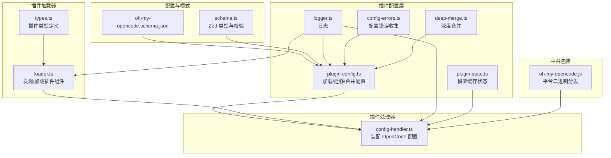
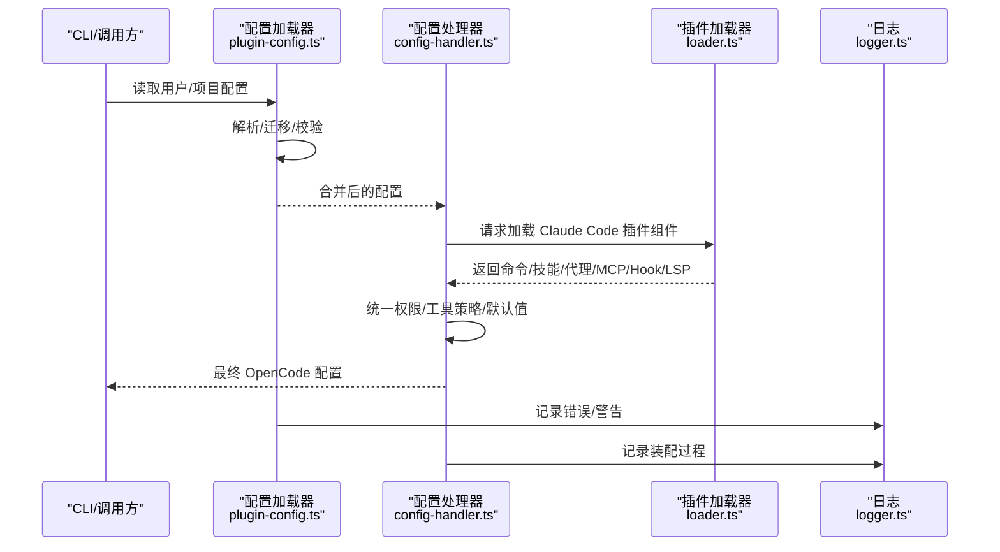
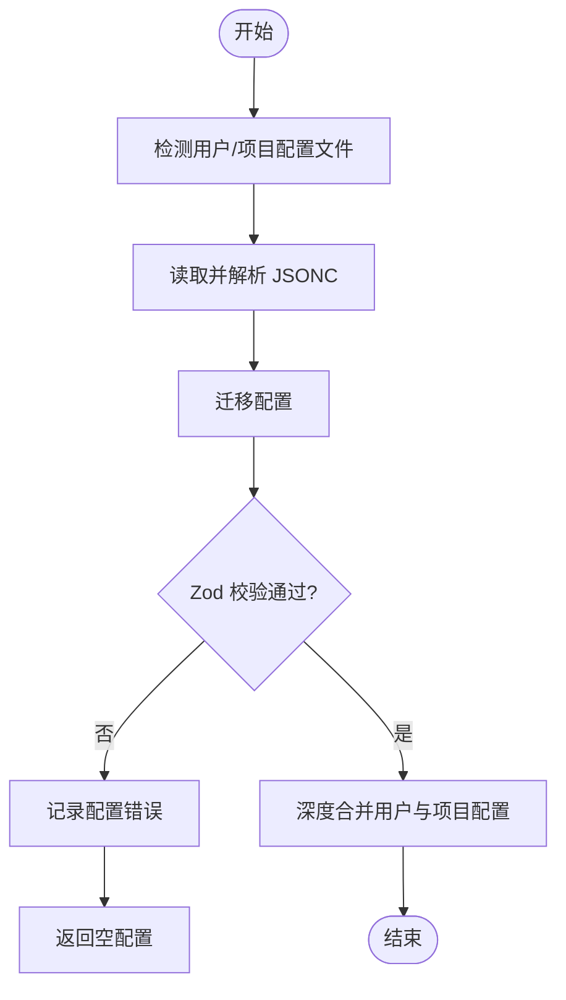
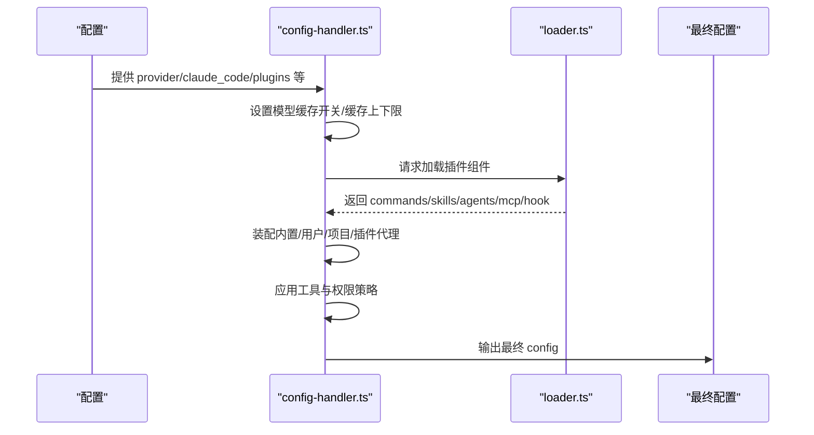
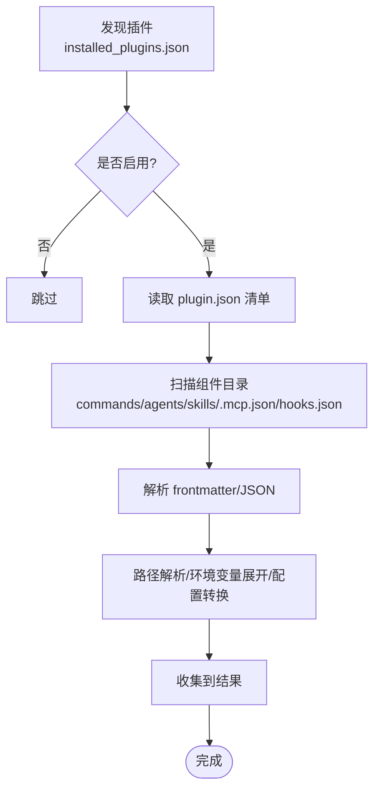
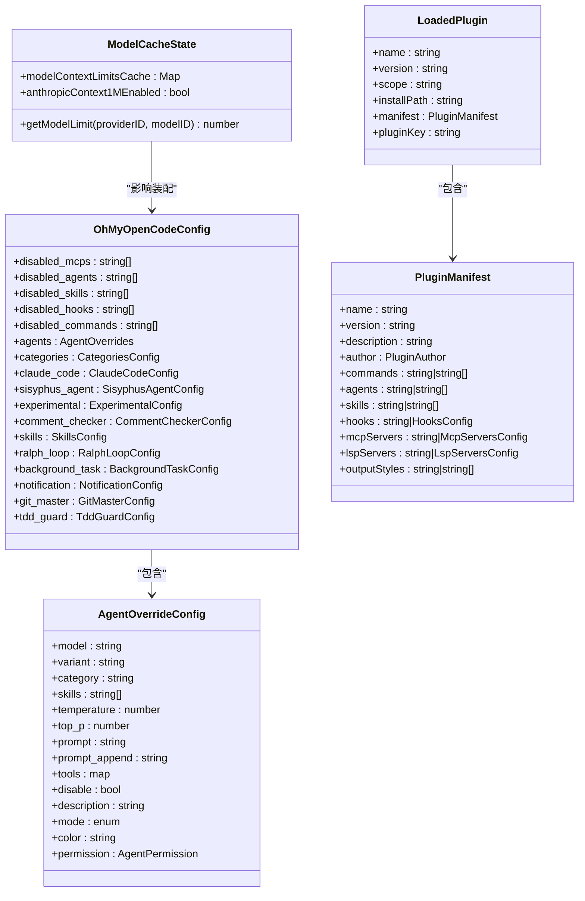
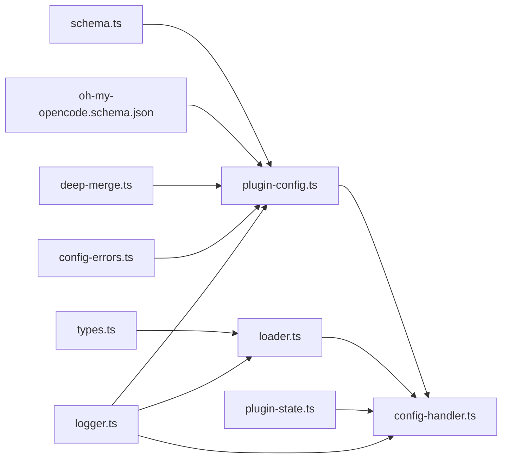

# 插件开发规范

<cite>
**本文引用的文件**
- [oh-my-opencode.schema.json](file://assets/oh-my-opencode.schema.json)
- [plugin-config.ts](file://src/plugin-config.ts)
- [config-handler.ts](file://src/plugin-handlers/config-handler.ts)
- [schema.ts](file://src/config/schema.ts)
- [logger.ts](file://src/shared/logger.ts)
- [config-errors.ts](file://src/shared/config-errors.ts)
- [deep-merge.ts](file://src/shared/deep-merge.ts)
- [plugin-state.ts](file://src/plugin-state.ts)
- [loader.ts](file://src/features/claude-code-plugin-loader/loader.ts)
- [types.ts](file://src/features/claude-code-plugin-loader/types.ts)
- [oh-my-opencode.js](file://bin/oh-my-opencode.js)
- [plugin-config.test.ts](file://src/plugin-config.test.ts)
</cite>

## 目录
1. [简介](#简介)
2. [项目结构](#项目结构)
3. [核心组件](#核心组件)
4. [架构总览](#架构总览)
5. [详细组件分析](#详细组件分析)
6. [依赖关系分析](#依赖关系分析)
7. [性能考量](#性能考量)
8. [故障排查指南](#故障排查指南)
9. [结论](#结论)
10. [附录](#附录)

## 简介
本规范面向为 Oh My OpenCode 开发插件的开发者，系统性阐述插件的标准接口、生命周期方法、配置结构与类型定义、验证规则、与核心系统的集成方式与通信协议，并提供最佳实践（错误处理、日志记录、性能优化）、完整开发示例与调试技巧。目标是帮助你在不破坏现有系统行为的前提下，安全、可维护地扩展 OpenCode 的能力。

## 项目结构
围绕插件体系的关键目录与文件：
- 配置与模式：assets/oh-my-opencode.schema.json、src/config/schema.ts
- 插件配置加载与合并：src/plugin-config.ts
- 插件处理器（装配 OpenCode 配置）：src/plugin-handlers/config-handler.ts
- 插件加载器（Claude Code 插件兼容）：src/features/claude-code-plugin-loader/loader.ts、types.ts
- 日志与错误收集：src/shared/logger.ts、src/shared/config-errors.ts
- 模型缓存状态：src/plugin-state.ts
- 平台包装脚本：bin/oh-my-opencode.js

图表来源
- [oh-my-opencode.schema.json](file://assets/oh-my-opencode.schema.json#L1-L2739)
- [schema.ts](file://src/config/schema.ts#L1-L384)
- [plugin-config.ts](file://src/plugin-config.ts#L1-L136)
- [config-handler.ts](file://src/plugin-handlers/config-handler.ts#L1-L382)
- [loader.ts](file://src/features/claude-code-plugin-loader/loader.ts#L1-L487)
- [types.ts](file://src/features/claude-code-plugin-loader/types.ts#L1-L211)
- [logger.ts](file://src/shared/logger.ts#L1-L21)
- [config-errors.ts](file://src/shared/config-errors.ts#L1-L19)
- [deep-merge.ts](file://src/shared/deep-merge.ts#L1-L54)
- [plugin-state.ts](file://src/plugin-state.ts#L1-L31)
- [oh-my-opencode.js](file://bin/oh-my-opencode.js#L1-L81)

章节来源
- [oh-my-opencode.schema.json](file://assets/oh-my-opencode.schema.json#L1-L2739)
- [schema.ts](file://src/config/schema.ts#L1-L384)
- [plugin-config.ts](file://src/plugin-config.ts#L1-L136)
- [config-handler.ts](file://src/plugin-handlers/config-handler.ts#L1-L382)
- [loader.ts](file://src/features/claude-code-plugin-loader/loader.ts#L1-L487)
- [types.ts](file://src/features/claude-code-plugin-loader/types.ts#L1-L211)
- [logger.ts](file://src/shared/logger.ts#L1-L21)
- [config-errors.ts](file://src/shared/config-errors.ts#L1-L19)
- [deep-merge.ts](file://src/shared/deep-merge.ts#L1-L54)
- [plugin-state.ts](file://src/plugin-state.ts#L1-L31)
- [oh-my-opencode.js](file://bin/oh-my-opencode.js#L1-L81)

## 核心组件
- 配置模式与校验：基于 JSON Schema 与 Zod，定义插件可配置项、枚举集合、嵌套对象结构与约束。
- 插件配置加载与合并：从用户级与项目级路径加载配置，执行迁移与校验，支持数组去重与对象深度合并。
- 插件处理器：在运行时装配 OpenCode 配置，注入内置/用户/项目/插件组件，统一权限与工具策略。
- 插件加载器：兼容 Claude Code 插件生态，发现安装数据库、读取清单与组件目录，转换 MCP/Hook/LSP 等配置。
- 日志与错误：统一写入临时日志文件；配置加载错误集中收集，便于诊断。
- 模型缓存状态：按提供方/模型维度缓存上下文限制，支持特性开关。

章节来源
- [plugin-config.ts](file://src/plugin-config.ts#L1-L136)
- [config-handler.ts](file://src/plugin-handlers/config-handler.ts#L1-L382)
- [loader.ts](file://src/features/claude-code-plugin-loader/loader.ts#L1-L487)
- [logger.ts](file://src/shared/logger.ts#L1-L21)
- [config-errors.ts](file://src/shared/config-errors.ts#L1-L19)
- [plugin-state.ts](file://src/plugin-state.ts#L1-L31)

## 架构总览
OpenCode 插件系统通过“配置层 → 处理器 → 加载器”的链路工作：配置层负责解析与校验；处理器负责装配与策略合并；加载器负责从外部生态（Claude Code 插件）加载命令、技能、代理、MCP/Hook/LSP 等组件。

图表来源
- [plugin-config.ts](file://src/plugin-config.ts#L1-L136)
- [config-handler.ts](file://src/plugin-handlers/config-handler.ts#L1-L382)
- [loader.ts](file://src/features/claude-code-plugin-loader/loader.ts#L1-L487)
- [logger.ts](file://src/shared/logger.ts#L1-L21)

## 详细组件分析

### 配置结构与类型定义
- 全局配置键：禁用 MCP/代理/技能/钩子/命令、代理覆盖、分类、Claude Code 集成开关、Sisyphus 行为控制、实验特性、技能源与过滤、循环与后台任务、通知、Git 主分支增强、TDD Guard 等。
- 代理覆盖：支持按代理名或内置键（build/plan/Sisyphus 等）进行覆盖，含模型、变体、类别继承、温度/TopP、提示词、工具白名单、颜色、权限等。
- 权限模型：统一使用“ask/allow/deny”三态，支持 Bash 的字符串或对象形式（逐工具粒度）。
- 分类配置：类别可继承模型、温度、TopP、最大 Token、思考模式、推理强度、文本冗余度、工具集、默认技能等。
- 技能配置：支持数组、映射、带 sources/enabled/disabled 的复合结构，以及技能元数据字段。
- Claude Code 集成：mcp/commands/skills/agents/hooks/plugins 及 plugins_override 控制启用范围与覆盖。

章节来源
- [oh-my-opencode.schema.json](file://assets/oh-my-opencode.schema.json#L1-L2739)
- [schema.ts](file://src/config/schema.ts#L1-L384)

### 配置加载与合并流程
- 用户级与项目级配置分别检测 .jsonc/.json，优先 .jsonc；加载后执行迁移与 Zod 校验；失败则记录错误。
- 合并策略：
  - 对象属性：深度合并（避免数组拼接，使用覆盖），防止危险键。
  - 数组属性：去重合并（如 disabled_*）。
  - 特殊字段：agents/categories 采用深度合并，确保既有配置不被完全覆盖。
- 最终输出：合并后的 OhMyOpenCodeConfig，供处理器装配。

图表来源
- [plugin-config.ts](file://src/plugin-config.ts#L1-L136)
- [deep-merge.ts](file://src/shared/deep-merge.ts#L1-L54)
- [config-errors.ts](file://src/shared/config-errors.ts#L1-L19)

章节来源
- [plugin-config.ts](file://src/plugin-config.ts#L1-L136)
- [deep-merge.ts](file://src/shared/deep-merge.ts#L1-L54)
- [config-errors.ts](file://src/shared/config-errors.ts#L1-L19)
- [plugin-config.test.ts](file://src/plugin-config.test.ts#L1-L120)

### 插件处理器装配逻辑
- 模型上下文缓存：根据 provider.headers 中的特性头设置启用 1M 上下文缓存；按 provider/model 缓存上下限。
- 插件组件加载：根据 claude_code.plugins 与 plugins_override 决定是否加载插件组件；若禁用则返回空集合。
- 代理装配：
  - 内置代理：按 disabled_agents 与 agents 覆盖装配。
  - Claude Code 代理：直接加载用户/项目代理；插件代理需做权限迁移以兼容 OpenCode 系统。
  - Sisyphus/构建/规划代理：根据 sisyphus_agent 开关与覆盖决定是否注入默认代理与规划器。
  - 过滤与降级：保留用户自定义 agent 配置，必要时将原配置降级为 subagent。
- 工具与权限：
  - 默认关闭部分内置工具，针对特定代理追加允许/拒绝策略。
  - 全局 permission 注入 webfetch/external_directory 的默认策略。
- MCP/Hook/LSP：
  - MCP：合并内置与插件 MCP 服务器；插件 MCP 经过路径解析与环境变量展开。
  - Hook：从插件 hooks.json 加载并解析。
  - LSP：由插件声明，经转换后注入。
- 命令与技能：
  - 并行加载内置/用户/项目/插件命令与技能，统一命名空间（插件名:前缀）。

图表来源
- [config-handler.ts](file://src/plugin-handlers/config-handler.ts#L1-L382)
- [loader.ts](file://src/features/claude-code-plugin-loader/loader.ts#L1-L487)

章节来源
- [config-handler.ts](file://src/plugin-handlers/config-handler.ts#L1-L382)
- [plugin-state.ts](file://src/plugin-state.ts#L1-L31)

### 插件加载器（Claude Code 生态）
- 发现插件：读取 ~/.claude/plugins/installed_plugins.json，解析版本格式，提取已安装插件列表。
- 设置与覆盖：读取 ~/.claude/settings.json 的 enabledPlugins，支持通过插件覆盖选项强制启用/禁用。
- 组件加载：
  - 命令：扫描 commands 目录，解析 Markdown frontmatter，生成 OpenCode 兼容命令定义。
  - 技能：扫描 skills 目录，读取 SKILL.md，包装为命令模板。
  - 代理：扫描 agents 目录，解析 frontmatter 为 AgentConfig。
  - MCP：读取 .mcp.json，解析/展开/转换为 OpenCode 可用的 MCP 服务器配置。
  - Hook：读取 hooks/hooks.json，解析为 HooksConfig。
- 错误处理：对每个组件加载失败单独记录，不影响其他组件加载。

图表来源
- [loader.ts](file://src/features/claude-code-plugin-loader/loader.ts#L1-L487)
- [types.ts](file://src/features/claude-code-plugin-loader/types.ts#L1-L211)

章节来源
- [loader.ts](file://src/features/claude-code-plugin-loader/loader.ts#L1-L487)
- [types.ts](file://src/features/claude-code-plugin-loader/types.ts#L1-L211)

### 类与关系图（代码级）

图表来源
- [schema.ts](file://src/config/schema.ts#L1-L384)
- [plugin-state.ts](file://src/plugin-state.ts#L1-L31)
- [types.ts](file://src/features/claude-code-plugin-loader/types.ts#L1-L211)

## 依赖关系分析
- 配置层依赖模式定义与校验，使用深度合并与错误收集模块。
- 处理器依赖配置层结果、插件加载器、内置组件工厂与模型缓存状态。
- 插件加载器依赖插件清单与组件目录约定，兼容 Claude Code 规范。
- 日志模块独立于业务逻辑，仅负责写入临时文件。

图表来源
- [schema.ts](file://src/config/schema.ts#L1-L384)
- [plugin-config.ts](file://src/plugin-config.ts#L1-L136)
- [config-handler.ts](file://src/plugin-handlers/config-handler.ts#L1-L382)
- [loader.ts](file://src/features/claude-code-plugin-loader/loader.ts#L1-L487)
- [types.ts](file://src/features/claude-code-plugin-loader/types.ts#L1-L211)
- [plugin-state.ts](file://src/plugin-state.ts#L1-L31)
- [logger.ts](file://src/shared/logger.ts#L1-L21)
- [config-errors.ts](file://src/shared/config-errors.ts#L1-L19)
- [deep-merge.ts](file://src/shared/deep-merge.ts#L1-L54)

章节来源
- [schema.ts](file://src/config/schema.ts#L1-L384)
- [plugin-config.ts](file://src/plugin-config.ts#L1-L136)
- [config-handler.ts](file://src/plugin-handlers/config-handler.ts#L1-L382)
- [loader.ts](file://src/features/claude-code-plugin-loader/loader.ts#L1-L487)
- [types.ts](file://src/features/claude-code-plugin-loader/types.ts#L1-L211)
- [plugin-state.ts](file://src/plugin-state.ts#L1-L31)
- [logger.ts](file://src/shared/logger.ts#L1-L21)
- [config-errors.ts](file://src/shared/config-errors.ts#L1-L19)
- [deep-merge.ts](file://src/shared/deep-merge.ts#L1-L54)

## 性能考量
- 并行加载：命令与技能加载使用 Promise.all 并行化，显著降低启动时间。
- 深度合并：限制最大递归深度，避免深层嵌套导致的性能问题。
- 缓存策略：模型上下文限制按 provider/model 缓存，减少重复计算与查询。
- 文件 I/O：插件发现与组件读取尽量批量处理，失败单独记录，不影响整体流程。

章节来源
- [config-handler.ts](file://src/plugin-handlers/config-handler.ts#L342-L364)
- [deep-merge.ts](file://src/shared/deep-merge.ts#L1-L54)
- [plugin-state.ts](file://src/plugin-state.ts#L1-L31)
- [loader.ts](file://src/features/claude-code-plugin-loader/loader.ts#L467-L473)

## 故障排查指南
- 查看日志：日志文件位于系统临时目录下的固定文件名，便于定位加载/装配问题。
- 配置错误：配置加载失败会记录错误列表，可在后续阶段统一查看。
- 插件错误：插件加载器对每个组件的失败单独记录，关注错误消息中的路径与原因。
- 平台二进制：包装脚本负责选择正确平台二进制，若执行失败请检查平台包是否安装。

章节来源
- [logger.ts](file://src/shared/logger.ts#L1-L21)
- [config-errors.ts](file://src/shared/config-errors.ts#L1-L19)
- [loader.ts](file://src/features/claude-code-plugin-loader/loader.ts#L160-L216)
- [oh-my-opencode.js](file://bin/oh-my-opencode.js#L1-L81)

## 结论
通过明确的配置模式、严格的校验与合并策略、可插拔的插件加载机制与完善的日志/错误收集，OpenCode 为插件开发提供了清晰、稳定且高性能的扩展框架。遵循本规范，可确保插件在不同环境下一致运行，并与 OpenCode 核心系统无缝集成。

## 附录

### 插件开发最佳实践
- 使用统一的 frontmatter 字段与模板约定，保证命令/技能/代理的可移植性。
- 在 MCP 配置中合理使用环境变量与相对路径占位符，配合路径解析与环境展开。
- 严格遵守权限模型，避免过度授权；对 Bash 权限建议使用对象形式实现细粒度控制。
- 利用分类配置集中管理模型与参数，减少重复配置。
- 将组件加载失败作为可恢复错误处理，避免阻断主流程。

### 错误处理与日志记录
- 所有配置加载与插件组件加载均捕获异常并记录，便于后续诊断。
- 日志文件位置固定，便于收集与分享。

章节来源
- [plugin-config.ts](file://src/plugin-config.ts#L42-L47)
- [loader.ts](file://src/features/claude-code-plugin-loader/loader.ts#L262-L264)
- [logger.ts](file://src/shared/logger.ts#L1-L21)

### 性能优化建议
- 将昂贵的 I/O 或网络请求放入异步任务，保持主线程响应。
- 合理使用缓存（模型上下文限制、深度合并深度限制）。
- 并行化可独立执行的任务，减少串行等待。

章节来源
- [config-handler.ts](file://src/plugin-handlers/config-handler.ts#L342-L364)
- [plugin-state.ts](file://src/plugin-state.ts#L1-L31)
- [deep-merge.ts](file://src/shared/deep-merge.ts#L1-L54)

### 插件与核心系统集成方式与通信协议
- 插件通过 Claude Code 生态的清单与组件目录约定接入 OpenCode。
- MCP 服务器可通过本地进程或 HTTP/SSE 方式提供服务，经转换后注入 OpenCode。
- Hook 与 LSP 通过 hooks.json 与 LSP 配置文件声明，加载器负责解析与转换。
- 通信协议遵循 OpenCode 的统一配置注入与权限控制模型。

章节来源
- [types.ts](file://src/features/claude-code-plugin-loader/types.ts#L1-L211)
- [loader.ts](file://src/features/claude-code-plugin-loader/loader.ts#L390-L428)

### 完整插件开发示例与调试技巧
- 示例：在插件根目录创建 commands/agents/skills 目录，编写 Markdown 文件并添加 frontmatter；在 .mcp.json 中声明 MCP 服务器；在 hooks.json 中定义 Hook 匹配器。
- 调试：开启日志，观察装配阶段输出；检查插件安装数据库与清单文件；确认 enabledPlugins 覆盖设置；核对路径解析与环境变量展开结果。

章节来源
- [loader.ts](file://src/features/claude-code-plugin-loader/loader.ts#L218-L328)
- [loader.ts](file://src/features/claude-code-plugin-loader/loader.ts#L390-L428)
- [loader.ts](file://src/features/claude-code-plugin-loader/loader.ts#L430-L452)
- [logger.ts](file://src/shared/logger.ts#L1-L21)