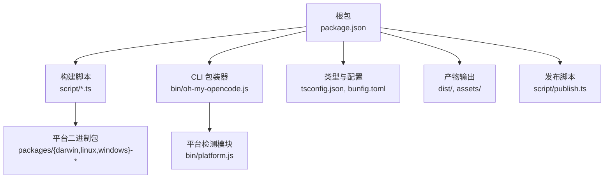
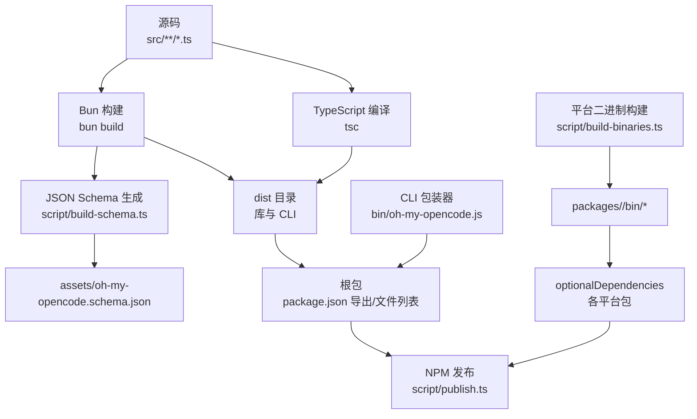
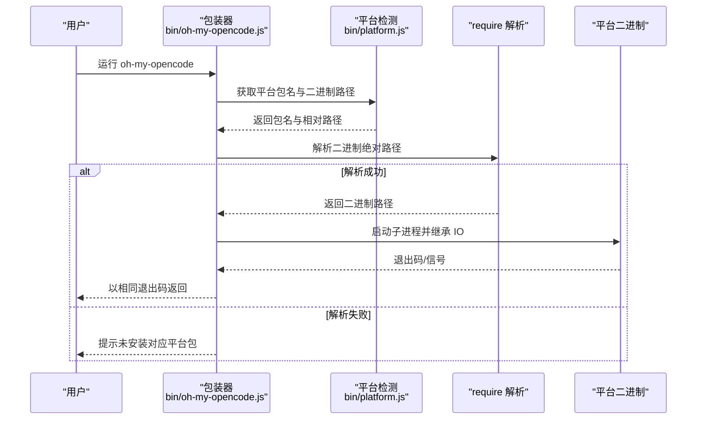
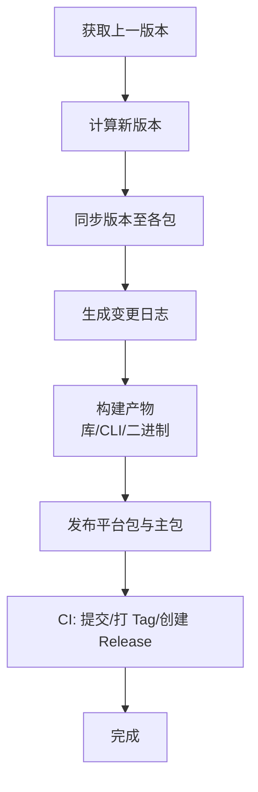
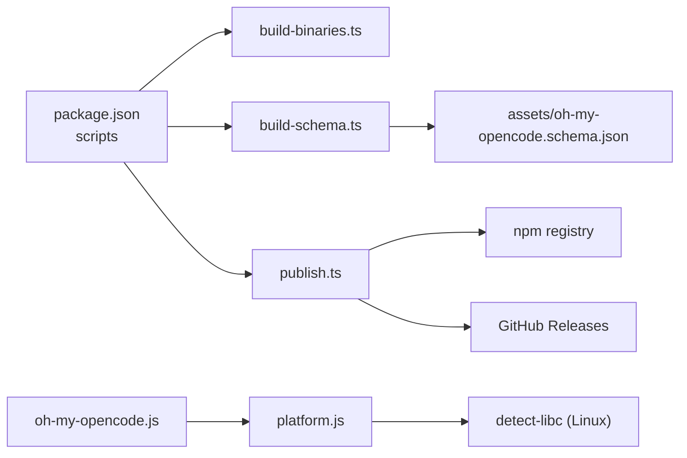

# 构建与发布

<cite>
**本文引用的文件**
- [package.json](file://package.json)
- [bunfig.toml](file://bunfig.toml)
- [tsconfig.json](file://tsconfig.json)
- [script/build-binaries.ts](file://script/build-binaries.ts)
- [script/build-schema.ts](file://script/build-schema.ts)
- [script/generate-changelog.ts](file://script/generate-changelog.ts)
- [script/publish.ts](file://script/publish.ts)
- [bin/oh-my-opencode.js](file://bin/oh-my-opencode.js)
- [bin/platform.js](file://bin/platform.js)
- [bin/platform.test.ts](file://bin/platform.test.ts)
- [postinstall.mjs](file://postinstall.mjs)
</cite>

## 目录
1. [简介](#简介)
2. [项目结构](#项目结构)
3. [核心组件](#核心组件)
4. [架构总览](#架构总览)
5. [详细组件分析](#详细组件分析)
6. [依赖关系分析](#依赖关系分析)
7. [性能考虑](#性能考虑)
8. [故障排查指南](#故障排查指南)
9. [结论](#结论)
10. [附录](#附录)

## 简介
本指南面向维护者与贡献者，系统性说明 Oh My OpenCode 的构建与发布流程。内容涵盖：
- 构建命令与流程：typecheck、build、rebuild、build:schema、build:binaries、build:all
- 构建产物结构与分发方式（多平台二进制与 NPM 包）
- 发布流程：版本管理、变更日志生成、GitHub Releases 与 npm 发布
- 质量控制与发布前检查清单
- 常见问题与解决方案

## 项目结构
该仓库采用“单仓多包”结构：
- 根包：提供核心库与 CLI 入口，导出类型声明与 JSON Schema
- packages/<platform>：每个平台独立的二进制包，包含对应平台的原生可执行文件
- script：构建与发布自动化脚本
- bin：跨平台 CLI 包装器与平台检测逻辑
- assets：JSON Schema 输出目录
- src：TypeScript 源码

图表来源
- [package.json](file://package.json#L1-L93)
- [script/build-binaries.ts](file://script/build-binaries.ts#L1-L104)
- [bin/oh-my-opencode.js](file://bin/oh-my-opencode.js#L1-L81)
- [bin/platform.js](file://bin/platform.js#L1-L39)

章节来源
- [package.json](file://package.json#L1-L93)
- [tsconfig.json](file://tsconfig.json#L1-L21)
- [bunfig.toml](file://bunfig.toml#L1-L3)

## 核心组件
- 构建命令与目标
  - typecheck：类型检查，不生成产物
  - build：构建核心库与 CLI，生成类型声明与 JSON Schema
  - build:all：先执行 build，再构建平台二进制
  - build:schema：从配置模式生成 JSON Schema 并写入 assets
  - build:binaries：为各平台编译原生二进制到 packages 下
  - clean：清理 dist 目录
  - prepublishOnly：发布前清理并构建
- 产物与分发
  - dist：ESM 库与类型声明、CLI 目录
  - assets：JSON Schema 文件
  - packages：各平台独立包，含原生二进制
  - NPM：主包与平台包作为 optionalDependencies 协同分发

章节来源
- [package.json](file://package.json#L26-L36)
- [script/build-schema.ts](file://script/build-schema.ts#L1-L29)
- [script/build-binaries.ts](file://script/build-binaries.ts#L1-L104)

## 架构总览
下图展示从源码到多平台可执行文件与 NPM 包的构建路径。

图表来源
- [package.json](file://package.json#L11-L25)
- [script/build-schema.ts](file://script/build-schema.ts#L1-L29)
- [script/build-binaries.ts](file://script/build-binaries.ts#L1-L104)
- [bin/oh-my-opencode.js](file://bin/oh-my-opencode.js#L1-L81)

## 详细组件分析

### 构建命令与流程
- typecheck
  - 作用：仅进行类型检查，不生成任何产物
  - 命令：在项目根目录执行
  - 适用场景：本地开发时快速验证类型安全
- build
  - 作用：构建核心库与 CLI，生成类型声明，并调用 build:schema
  - 关键步骤：
    - 使用 Bun 将入口打包为 ESM
    - 仅生成类型声明（不生成 JS）
    - 再次使用 Bun 打包 CLI 入口
    - 最后运行 JSON Schema 生成脚本
  - 产物：dist 目录下的库与 CLI，以及 assets/oh-my-opencode.schema.json
- build:all
  - 作用：先执行 build，再执行 build:binaries
- build:schema
  - 作用：基于配置模式生成 JSON Schema 并写入 assets
  - 产物：assets/oh-my-opencode.schema.json
- build:binaries
  - 作用：为所有支持平台编译原生二进制
  - 支持平台：darwin-arm64、darwin-x64、linux-x64、linux-arm64、linux-x64-musl、linux-arm64-musl、windows-x64
  - 产物：packages/<platform>/bin/ 下的可执行文件
- clean
  - 作用：删除 dist 目录
- prepublishOnly
  - 作用：发布前自动清理并构建，确保发布包干净

章节来源
- [package.json](file://package.json#L26-L36)
- [script/build-schema.ts](file://script/build-schema.ts#L1-L29)
- [script/build-binaries.ts](file://script/build-binaries.ts#L1-L104)

### 构建产物结构与部署
- dist 目录
  - 包含库的 ESM 入口与类型声明
  - 包含 CLI 的 ESM 目录
- assets 目录
  - JSON Schema 文件，供外部工具校验配置
- packages/<platform>
  - 每个平台一个独立包，包含原生二进制
  - optionalDependencies 中声明各平台包版本，与根包版本保持一致
- NPM 部署
  - 主包导出库入口与 JSON Schema
  - CLI 通过包装器在运行时选择对应平台二进制
  - 平台二进制由对应平台包提供，安装时自动解析

章节来源
- [package.json](file://package.json#L11-L25)
- [package.json](file://package.json#L78-L86)
- [bin/oh-my-opencode.js](file://bin/oh-my-opencode.js#L1-L81)

### CLI 包装器与平台检测
- 功能概述
  - 在运行时根据当前平台与架构选择正确的平台包
  - Linux 上通过 libc 类型区分 glibc 与 musl
  - 解析平台包内的二进制路径并执行
- 错误处理
  - 若无法检测 libc 或找不到二进制，给出明确提示并退出
  - 子进程异常或被信号中断时，转换为合适的退出码

图表来源
- [bin/oh-my-opencode.js](file://bin/oh-my-opencode.js#L1-L81)
- [bin/platform.js](file://bin/platform.js#L1-L39)

章节来源
- [bin/oh-my-opencode.js](file://bin/oh-my-opencode.js#L1-L81)
- [bin/platform.js](file://bin/platform.js#L1-L39)
- [bin/platform.test.ts](file://bin/platform.test.ts#L1-L149)

### 发布流程与自动化
- 版本管理
  - 从 npm registry 查询最新版本，按语义化版本规则 bump
  - 支持通过环境变量覆盖版本或指定 bump 类型
  - 同步更新根包与各平台包的版本号
- 变更日志生成
  - 自动对比上次发布标签与当前 HEAD，过滤非功能类提交
  - 拉取贡献者信息，生成贡献者致谢
- 构建与发布
  - 先构建根包与 CLI，再构建平台二进制（可选跳过）
  - 按顺序发布各平台包与主包，支持 dist-tag（如 prerelease）
  - CI 环境下自动打 Tag、提交变更并创建 GitHub Release
- 质量控制
  - 对已存在版本进行幂等检查，避免重复发布
  - 发布失败时记录错误并中止后续步骤

图表来源
- [script/publish.ts](file://script/publish.ts#L296-L319)

章节来源
- [script/publish.ts](file://script/publish.ts#L1-L319)

### 变更日志生成脚本
- 自动获取最近一次稳定发布标签
- 生成变更日志与社区贡献者致谢
- 适用于首次发布或无标签时的降级处理

章节来源
- [script/generate-changelog.ts](file://script/generate-changelog.ts#L1-L93)

## 依赖关系分析
- 构建链路
  - package.json scripts 串联各构建步骤
  - TypeScript 编译与 Bun 打包并行产出库与 CLI
  - JSON Schema 生成依赖配置模式定义
- 运行时链路
  - CLI 包装器依赖平台检测模块
  - 平台检测模块依赖 detect-libc（Linux musl 判定）
  - NPM optionalDependencies 保证平台二进制可用

图表来源
- [package.json](file://package.json#L26-L36)
- [script/build-binaries.ts](file://script/build-binaries.ts#L1-L104)
- [script/build-schema.ts](file://script/build-schema.ts#L1-L29)
- [script/publish.ts](file://script/publish.ts#L1-L319)
- [bin/oh-my-opencode.js](file://bin/oh-my-opencode.js#L1-L81)
- [bin/platform.js](file://bin/platform.js#L1-L39)

章节来源
- [package.json](file://package.json#L78-L86)
- [postinstall.mjs](file://postinstall.mjs#L1-L44)

## 性能考虑
- 构建优化
  - 使用 Bun 的编译与最小化选项生成原生二进制，缩短启动时间
  - 仅在需要时构建平台二进制，可通过环境变量跳过以加速迭代
- 发布效率
  - 并行构建与发布（平台包）可结合 CI 并行作业提升吞吐
  - 使用 dist-tag 管理预发布通道，减少主通道冲突

## 故障排查指南
- 构建阶段
  - typecheck 失败：检查 TypeScript 报错并修复类型问题
  - build 失败：确认入口文件存在且依赖完整；查看 Bun/TSC 输出
  - build:schema 失败：检查配置模式定义是否正确
  - build:binaries 失败：确认各平台工具链可用；Linux 上 musl 检测失败需安装 detect-libc
- 运行阶段
  - CLI 报错“平台二进制未安装”：确认对应平台包已安装；或在 CI 中启用 SKIP_PLATFORM_PACKAGES=false
  - Linux 上 libc 检测失败：安装 detect-libc 或手动指定兼容包
- 发布阶段
  - 版本已存在：检查 npm registry 是否已有该版本；必要时调整版本策略
  - 发布失败：查看错误日志并重试；确认 CI 环境变量（如 CI、SKIP_PLATFORM_PACKAGES、BUMP、VERSION）设置正确
  - GitHub Release：若已存在则跳过；确保 gh CLI 可用且有权限

章节来源
- [bin/oh-my-opencode.js](file://bin/oh-my-opencode.js#L35-L78)
- [bin/platform.js](file://bin/platform.js#L10-L27)
- [postinstall.mjs](file://postinstall.mjs#L25-L41)
- [script/publish.ts](file://script/publish.ts#L164-L186)

## 结论
本指南提供了从本地构建到多平台发布的完整路径。通过统一的脚本与约定，项目实现了：
- 快速的本地开发与类型验证
- 跨平台原生二进制的标准化构建
- 自动化的版本管理与发布流程
- 明确的质量控制与故障排查机制

建议在团队内固化以下实践：
- 优先使用 build:all 进行端到端验证
- 预发布使用 prerelease 标签与 dist-tag
- CI 中开启发布流程并配置必要的环境变量

## 附录
- 常用命令速查
  - 类型检查：bun run typecheck
  - 构建库与 CLI：bun run build
  - 生成 JSON Schema：bun run build:schema
  - 构建平台二进制：bun run build:binaries
  - 全量构建：bun run build:all
  - 清理：bun run clean
  - 发布（本地）：bun run publish（配合环境变量）
- 环境变量
  - BUMP：指定版本提升类型（major/minor/patch）
  - VERSION：直接指定版本号
  - SKIP_PLATFORM_PACKAGES：true 时跳过平台二进制构建
  - CI：在 CI 环境下启用自动打 Tag 与创建 Release

章节来源
- [package.json](file://package.json#L26-L36)
- [script/publish.ts](file://script/publish.ts#L8-L11)